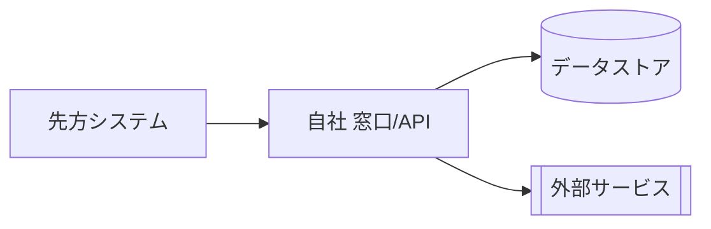
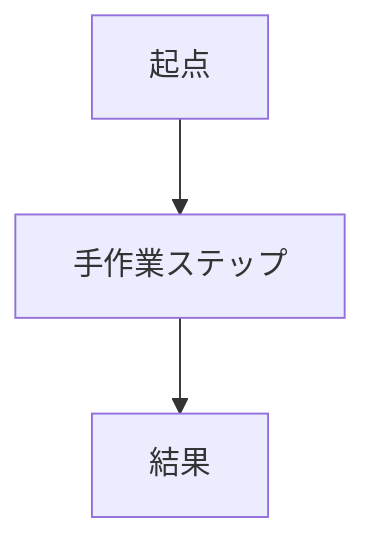
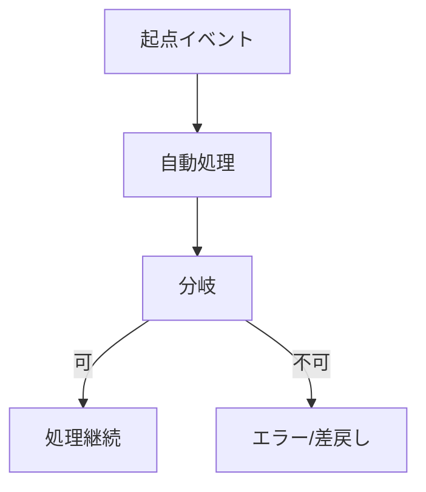

# プロジェクト概要（人間向け・最初に読む1枚）

> **目的**: この案件が「何を・なぜ・誰のために・どう解決するか」を1枚で俯瞰する、人間が最初に読むドキュメント。
> **書き方**: 実装詳細は他層（`01_要件定義/`・`02_設計/`）に譲り、ここは俯瞰に徹する。固有名詞・数値はプレースホルダ `{...}` を実データに置換して記入する。記入例は example-suido-fax の対応ファイル参照。
> **重複させない**: 体制・登場人物の詳細は [`02_体制・役割.md`](./02_体制・役割.md) を正とし、本書 §4 は俯瞰のアクター名のみ（詳細はリンクで参照）。

## 目次
1. [目的（何を・なぜ）](#1-目的何をなぜ)
2. [ビジネス価値・KPI](#2-ビジネス価値kpi)
3. [システム全体像](#3-システム全体像)
4. [登場人物](#4-登場人物)
5. [As-Is → To-Be](#5-as-is--to-be)
6. [採用構成の理由（要点）](#6-採用構成の理由要点)

---

## 1. 目的（何を・なぜ）

> 📝 ここにこの案件の目的を記載する。「顕在目的（発注元が直接解決したい課題）」と「副次目的（自社の事業価値・資産化の狙い）」を分けて箇条書きする。各項目は1〜2文で、根拠となる要件ID（例: requirements §1.1）を添える。

- **顕在目的**: {発注元が解決したい業務課題を、As-Isの手作業と対比して1〜2文で}
- **副次目的（自社の事業価値）**:
  - (a) {資産化・横展開など自社にとっての価値}
  - (b) {同上}

## 2. ビジネス価値・KPI

> 📝 ここに定量効果とKPIを記載する。冒頭に効果の試算（件数×1件あたり削減時間＝月次削減規模など）を1段落。続けてKPI表に「指標・As-Is・To-Be目標」を列挙する。数値の確度（確定/暫定）と依存する未確定事項（TODO-ID）を明記する。

**定量効果**: {件数・単価・削減時間などから算出した月次/年次の効果を1段落で。前提と確度（`[暫定]`等）を添える}

| ID | 指標 | As-Is | To-Be（目標） |
|---|---|---|---|
| （記入） | （記入） | （記入） | （記入） |

## 3. システム全体像

> 📝 ここにシステムの全体像を記載する。まずサービス/コンポーネント構成を表で（サービス名・内部名・責務）。続けてMermaid構成図で主要コンポーネントと外部連携・データフローの骨組みを描く。最後に「処理の流れ」を1段落で通しで説明する。詳細な構成は `02_設計/10_システム基本設計/` を正とする。

| サービス／コンポーネント | 内部名 | 担う責務 |
|---|---|---|
| （記入） | （記入） | （記入） |

**処理の流れ（To-Be）**: {起点イベント → 各処理 → 結果反映 までを1段落で通して説明する}

## 4. 登場人物

> 📝 ここに登場人物（アクター）を記載する。人・組織・外部システムを「立場」と「この案件での関わり」で整理する。誰が資産にアクセスできる/できないか等の重要な境界も注記する。

| 登場人物 | 立場 | 関わり |
|---|---|---|
| （記入） | （記入） | （記入） |

## 5. As-Is → To-Be

> 📝 ここに現状（As-Is）・課題（Gap）・目指す姿（To-Be）を記載する。まず3行の対比表。続けてAs-IsフローとTo-BeフローをそれぞれMermaidで描き、どこが自動化・改善されるかが見えるようにする。

| 段階 | 内容 |
|---|---|
| **As-Is** | （記入） |
| **Gap** | （記入） |
| **To-Be** | （記入） |

**As-Is（現状）フロー**

**To-Be（あるべき姿）フロー**

## 6. 採用構成の理由（要点）

> 📝 ここに構成の採用理由を記載する。検討した複数案を比較表（案・概要・採否・根拠）で示し、採用案を太字にする。詳細な意思決定の経緯・トレードオフは `../意思決定_ADR/` を正とし、ここは要点のみ。

| 案 | 概要 | 採否 | 根拠（要点） |
|---|---|---|---|
| （記入） | （記入） | （記入） | （記入） |
