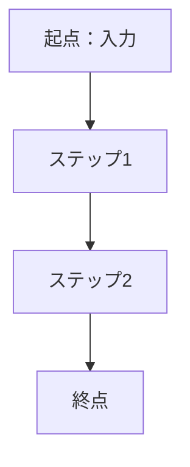
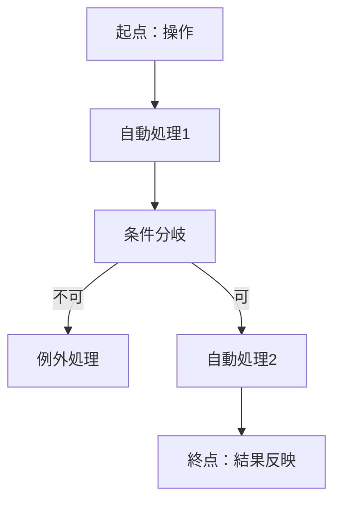

# 課題・解決・業務フロー（As-Is → To-Be）

> **目的**: 現状（As-Is）の課題と業務フローを起点に、解決方針（To-Be）と導入後の業務フローまでを一連で示し、「何が・どう変わるか」を可視化する。
> **書き方**: 「困っている事実」は具体的に、定量化できるものは数値で。To-Beは案比較の採否と根拠を必ず記載。フローは人手/システムの区別・分岐・例外が分かるように。記入例は example-suido-fax/01_要件定義/01_全体像/02_課題・解決・業務フロー.md 参照。
> **重複させない**: システム全体像・As-Is→To-Beの"俯瞰"は [`../../00_プロジェクト概要/01_プロジェクト概要_人間向け.md`](../../00_プロジェクト概要/01_プロジェクト概要_人間向け.md) を正とし、本書は課題の具体とフロー詳細に徹する。

## 目次
1. [現状の課題（As-Is）](#1-現状の課題as-is)
2. [現行ビジネスフロー（As-Is）](#2-現行ビジネスフローas-is)
3. [解決方法（To-Be方針）](#3-解決方法to-be方針)
4. [導入後ビジネスフロー（To-Be）](#4-導入後ビジネスフローto-be)

## 1. 現状の課題（As-Is）
> **書き方**: 工数・ミス率・リスクなど定量化できるものは数値で。

### 1.1 As-Is（現状業務の内訳）
> 📝 ここに現状の業務手順を記載。含める項目: 現在どのような手作業・処理が発生しているかをステップで列挙。1件あたりの所要時間や頻度も。

### 1.2 As-Is / Gap
> 📝 ここに現状と課題（Gap）を対比で記載。含める項目: As-Is＝現状の実態／Gap＝そこにある非効率・ミス・リスク・属人性など。

| 段階 | 内容 |
|---|---|
| （記入） | （記入） |

## 2. 現行ビジネスフロー（As-Is）
> 📝 ここに現行フローを記載。含める項目: 起点（入力）から終点までの各ステップ、人手作業のノード、分岐条件。下の骨組みのコメント部を実際のステップに置き換える。

## 3. 解決方法（To-Be方針）
> **書き方**: To-Beは「何が・どう変わるか」を対比で。手段は複数案を挙げ採否と根拠を必ず記載。

### 3.1 To-Be（解決の方針）
> 📝 ここにTo-Be方針を記載。含める項目: 導入後にどう変わるか（自動化・削減・一元化など）を1文＋箇条書きで。As-Isとの対比が分かるように。

| 段階 | 内容 |
|---|---|
| （記入） | （記入） |

### 3.2 手段選定の根拠（案比較）
> 📝 ここに案比較を記載。含める項目: 検討した各案の概要／採否／採否の根拠。目的（`01_目的・対象・システム概要.md`）に照らして評価する。ROIや初期スコープの考え方も付記。

| 案 | 概要 | 採否 | 根拠 |
|---|---|---|---|
| （記入） | （記入） | （記入） | （記入） |

## 4. 導入後ビジネスフロー（To-Be）
> **書き方**: システム処理・分岐・例外（エラー/再送）も図に含める。As-Is→To-Beの対応表で削減効果を示す。

### 4.1 To-Be（導入後）フロー
> 📝 ここに導入後フローを記載。含める項目: 起点となる操作、自動処理の各ステップ、分岐（可否判定など）、例外・再送・通知。下の骨組みのコメント部を実際のステップに置き換える。

### 4.2 As-Is → To-Be の対応
> 📝 ここに対応表を記載。含める項目: As-Isの各手作業／To-Beでの自動化内容／対応する機能要件ID。削減・自動化の効果が読み取れるように。

| As-Is（手作業） | To-Be（自動化） | 対応FEAT |
|---|---|---|
| （記入） | （記入） | （記入） |
