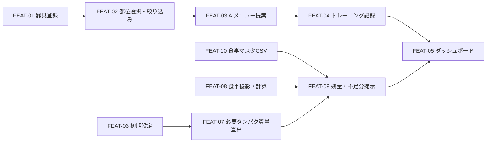

# 機能要件インデックス（俯瞰1枚）

> **目的**: 機能要件（FEAT）を一意なIDで洗い出し、優先度・外部連携・業務ルールを1枚で俯瞰する。ビジネス要求→機能→IF/ルールの追跡（トレーサビリティ）の入口。
> **書き方**: 参照は必ずID（位置参照禁止）。優先度は MUST/NICE で明示。各機能・画面・帳票の詳細は本フォルダ配下（`01_機能一覧/`・`02_画面/`・`03_帳票一覧/`）を正とする。記入例は example-suido-fax/01_要件定義/02_機能要件/00_機能要件インデックス.md 参照。

> **重要（受入基準・状態・エラーの正本）**: 各FEATの**受入基準（Given-When-Then）・状態機械（ST）・エラー母集合（ERR）は本書に載せない**。これらは **TDDのRED源泉**として `02_設計/60_テスト設計/02_RED母集合_受入基準・状態・エラー.md` に **FEAT番号で紐づけて** 定義する。本書は各FEATから同ファイルを FEAT番号で参照する。

## 目次
1. [機能サマリ（FEAT一覧・優先度・トレーサビリティ）](#1-機能サマリfr一覧優先度トレーサビリティ)
2. [外部連携一覧（要件面）](#2-外部連携一覧要件面)
3. [業務ルール一覧](#3-業務ルール一覧)

## 1. 機能サマリ（FEAT一覧・優先度・トレーサビリティ）
### 1.1 ビジネス要求 → 機能要件
> 📝 ここにビジネス要求と充足する機能の対応を記載。含める項目: REQ-ID／区分（顕在・潜在）／要求の内容／それを充足するFEAT-IDの列挙。`01_全体像/01_目的・対象・システム概要.md` のKPI・課題と紐づける。

| REQ | 区分 | 要求 | 充足する機能 |
|---|---|---|---|
| REQ-01 | 顕在 | 毎回同じメニューを避け、鍛えたい部位に合ったトレーニングを提案してほしい（KPI: 継続利用） | FEAT-02, FEAT-03 |
| REQ-02 | 顕在 | 前回何をやったか・履歴を振り返りたい（KPI-03 記録網羅率） | FEAT-04, FEAT-05 |
| REQ-03 | 顕在 | トレーニング（回数・重量・メニュー）を記録したい（KPI-03） | FEAT-04 |
| REQ-04 | 顕在 | タンパク質摂取を把握し、不足分を何で補うか知りたい | FEAT-07, FEAT-08, FEAT-09, FEAT-10 |
| REQ-05 | 顕在 | 継続して使いたい（ジム習慣の維持。KPI-01/02 ログイン率） | FEAT-05, FEAT-06 |

### 1.2 機能サマリ表
> 📝 ここにFEATごとのサマリを記載。含める項目: FEAT-ID／機能名（概要）／優先度（MUST/NICE）／関連EXT-ID。**受入基準（G/W/T）・状態（ST）・エラー（ERR）・テスト観点（TC）は本表に書かず** `02_設計/60_テスト設計/` を FEAT番号で参照する。各機能の概要は `01_機能一覧/01_機能概要_テンプレート.md` を正とする。

| FEAT | 概要 | 優先 | 関連IF | 受入基準・ST・ERR・TC |
|---|---|---|---|---|
| [FEAT-01](01_機能一覧/FEAT-01_器具登録.md) | 器具登録（部位タグ付与：胸/背中/脚/肩/腕） | MUST | — | → `02_設計/60_テスト設計/`（FEAT番号で参照） |
| [FEAT-02](01_機能一覧/FEAT-02_部位選択と器具絞り込み.md) | 鍛えたい部位の選択と、部位タグによる器具の絞り込み | MUST | — | → `02_設計/60_テスト設計/`（FEAT番号で参照） |
| [FEAT-03](01_機能一覧/FEAT-03_AIメニュー提案.md) | generateボタンでAI（Claude）が選択部位のメニューを提案 | MUST | EXT-01 | → `02_設計/60_テスト設計/`（FEAT番号で参照） |
| [FEAT-04](01_機能一覧/FEAT-04_トレーニング記録.md) | トレーニング記録（回数・重量・メニュー） | MUST | — | → `02_設計/60_テスト設計/`（FEAT番号で参照） |
| [FEAT-05](01_機能一覧/FEAT-05_ダッシュボード.md) | ダッシュボード／履歴・前回実施の可視化 | MUST | — | → `02_設計/60_テスト設計/`（FEAT番号で参照） |
| [FEAT-06](01_機能一覧/FEAT-06_初期設定.md) | 初期設定（目標ログイン回数・体重） | MUST | — | → `02_設計/60_テスト設計/`（FEAT番号で参照） |
| [FEAT-07](01_機能一覧/FEAT-07_必要タンパク質量算出.md) | 必要タンパク質量の算出（体重×2g/日） | MUST | — | → `02_設計/60_テスト設計/`（FEAT番号で参照） |
| [FEAT-08](01_機能一覧/FEAT-08_食事撮影タンパク質計算.md) | 食事撮影とAI（Claude・画像入力）によるタンパク質量計算 | MUST | EXT-01 | → `02_設計/60_テスト設計/`（FEAT番号で参照） |
| [FEAT-09](01_機能一覧/FEAT-09_タンパク質残量と不足分提示.md) | タンパク質残量の表示と、食事マスタからの不足分提示 | MUST | — | → `02_設計/60_テスト設計/`（FEAT番号で参照） |
| [FEAT-10](01_機能一覧/FEAT-10_食事マスタCSVインポート.md) | 食事マスタのCSVインポート（初期取り込み） | MUST | — | → `02_設計/60_テスト設計/`（FEAT番号で参照） |

### 1.3 機能間依存
> 📝 ここに機能間の依存関係を記載。含める項目: どのFEATがどのFEATの前提になるか（実行順・データ依存）。下の骨組みのノード/エッジを実際のFEATに置き換える。

## 2. 外部連携一覧（要件面）
> **目的**: 本システムが連携する外部システム・内部サービスを洗い出し、**要件面（何と・なぜ・制約）**を明確にする。APIワイヤ・データ構造・手順の実装契約は設計層（`02_設計/`）へ委譲する。

### 2.1 連携先と目的
> 📝 ここに連携先を記載。含める項目: 連携先の名称／種別（外部SaaS・外部API・内部資産など）／なぜ連携するか（目的）。

| 連携先 | 種別 | なぜ連携するか |
|---|---|---|
| Claude（Anthropic） | 外部API（LLM・画像入力対応） | トレーニングメニューの提案（FEAT-03）と、食事写真からのタンパク質量計算（FEAT-08） |

### 2.2 IF一覧（要件面）
> 📝 ここにインターフェースを記載。含める項目: EXT-ID／方向（誰→誰）／プロトコル／認証方式／主な内容（何をやり取りするか）。番号の欠番があれば注記する。

| EXT-ID | 方向 | プロトコル | 認証 | 主内容 |
|---|---|---|---|---|
| EXT-01 | 本システム → Claude | HTTPS/REST（API） `[仮]` | APIキー `[仮]` | 入力: 部位・登録器具のプロンプト／食事写真（画像）。出力: 提案トレーニングメニュー／推定タンパク質量 |

### 2.3 連携ごとの要件・制約
> 📝 ここに連携ごとの要件・制約を記載。含める項目: 連携先ごとに「何を／なぜ／制約（規約・同時実行・エンコード・公開/非公開・未確定事項など）」を段落で。連携先の数だけ小見出しを追加する。

#### Claude（EXT-01）
> 📝 ここに当該連携の要件・制約を記載。含める項目: 何を連携するか／なぜ必要か／守るべき制約・規約。

- **何を**: トレーニングメニューの生成（選択部位＋登録器具を入力）、および食事写真からのタンパク質量の推定（画像を入力）。
- **なぜ**: 選択部位に対する多様なメニュー提案でマンネリを防ぎ、写真から手軽にタンパク質摂取を把握するため。
- **制約**: **画像入力対応が必須**（DEC-B01）。⚠️ 要確認: API方式・認証・レート上限・料金は未確定。⚠️ 要確認: 食事写真の外部送信・保持ポリシー未定（[`../01_全体像/05_未決定事項.md`](../01_全体像/05_未決定事項.md)）。

## 3. 業務ルール一覧
> **目的**: 各FEATに散在する業務ロジック（判定・制御・制約）を横断的に抽出し、一意な `RULE-ID` で整理する。判定の詳細は各FEATを正とし、ここはその索引・要約とする。
> **書き方**: 1ルール＝1行。各ルールに `RULE-NNN`（連番・不変）を付番し、必ず根拠（FEAT-ID・ST/ERR-ID・ADR等）を添え、位置参照でなくIDで結ぶ。カテゴリごとに表を分ける。`RULE-` はハーネス(aic-harness/criteria.json)準拠の業務ルールID。

### 算出・判定ルール
> 📝 ここに当該カテゴリのルールを記載。含める項目: RULE-ID／ルール（条件→挙動を1文で）／根拠（対応するFEAT-ID・ERR-ID・ADR等）。

| RULE-ID | ルール | 根拠 |
|---|---|---|
| RULE-001 | 1日の必要タンパク質量 = 体重(kg) × 2g とする | FEAT-07 / DEC-B06 |
| RULE-002 | タンパク質残量 = 必要量 − その日の摂取量合計 とする | FEAT-09 |
| RULE-003 | 部位タグは「胸・背中・脚・肩・腕」の5種から付与・選択する | FEAT-01, FEAT-02 / DEC-B04 |

### 絞り込み・提示ルール
> 📝 ここに当該カテゴリのルールを記載。カテゴリの数だけ表を増やす。RULE-ID は表をまたいで連番を継続する。

| RULE-ID | ルール | 根拠 |
|---|---|---|
| RULE-004 | 器具の絞り込みは、選択部位の部位タグに一致する器具のみを提示する | FEAT-02 |
| RULE-005 | 不足分の食事提示は食事マスタ（CSV）から残量を補う食品を抽出して行う（AI不使用） | FEAT-09 / DEC-B05 |
| RULE-006 | メニュー提案（FEAT-03）と食事写真のタンパク質計算（FEAT-08）はClaude（画像入力対応）で実行する | FEAT-03, FEAT-08 / EXT-01 / DEC-B01 |

### 初期設定ルール
> 📝 ここに当該カテゴリのルールを記載。カテゴリの数だけ表を増やす。RULE-ID は表をまたいで連番を継続する。

| RULE-ID | ルール | 根拠 |
|---|---|---|
| RULE-007 | 目標ログイン回数の既定は月12回（週3想定）とする | FEAT-06 / TODO-A02 |
