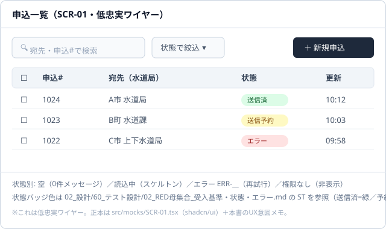

# 画面モック規約（AI実装前の人間定義）

> **目的**: **AI実装の前に人間が定義する「画面モック」の規約**を定める。**画面/UXは人間の代替不可領域**（戦略ボード）なので、モックの人間定義・承認を実装の前提ゲートにする。
> **書き方**: モックは本書の規約に従い **正本＝リポ内 tsx（shadcn/ui）＋UX意図メモ**（画像/Figmaは補助）。各画面の概要は `画面概要_テンプレート.md` を複製して記載。記入例は example-suido-fax/01_要件定義/02_機能要件/02_画面/00_画面モック規約.md 参照。

## 目次
1. [規約](#1-規約)
2. [チュートリアル：画面モックの作り方](#2-チュートリアル画面モックの作り方)
3. [サンプル（見本）](#3-サンプル見本)

## 1. 規約
- **命名・採番**: 本フォルダで**採番するのは本規約（`00_画面モック規約.md`）のみ**。画面概要・モック（tsx/画像/SVG）等の成果物は**無番号**とし、**画面名または SCR-ID** で並べる（画面は増減が激しく、連番だと挿入で参照が玉突きになるため）。参照は位置ではなく SCR-ID で行う。
- **原則**: 画面のモック（ワイヤー＋UX意図）は **人間が先に定義** し、**承認されるまでAIは画面実装に進まない**（UX＝人間の代替不可領域）。
- **採用ライブラリ**: **shadcn/ui**（Radix UI＋Tailwind CSS。部品ソースを自リポに所有）。※Chakra UI は今回不採用。
- **正本**: モックの正本は **リポ内の tsx コード**（実装/プロトタイプリポの `src/mocks/{画面ID}.tsx` など）＋ **UX意図メモ**（各画面の概要ファイル）。
  - 理由: コード＝テキストなので **diff・レビュー・AIが確実に読める**（最大要件②「AIが読んで開発できる」）。画像だけだとAIが解釈できない。
  - **閲覧用の副本を併記**: 正本の tsx に加え、**レンダ済み画像/SVG または Storybookリンクを"人間・客先レビュー用の副本"として添える**（ビルド不要でレビュー可能に）。＝**正本=tsx（AI/実装）／閲覧補助=画像（人間/客先）** の二層。Figmaリンクも同列の補助。
- **各画面に含めるもの**: 目的/主体・要素と配置・主要操作導線・**状態別表示**（空／読込中／エラー／権限なし）・入力/バリデーション。状態・エラーは `02_設計/60_テスト設計/02_RED母集合_受入基準・状態・エラー.md` の **ST/ERR を ID参照**。
- **ゲート**: 「画面モック 人間承認済み」を実装/リリースの前提にする（`00_プロジェクト概要/04_適用マトリクス.md` で必須化・**共通の統合開発フロー（STRATEGY BOARD／AGENTS.md）で人間承認を明示**）。

| 画面ID | モック(tsx) の場所 | UX意図メモ | 人間承認 |
|---|---|---|---|
| SCR-01 ダッシュボード | `src/mocks/SCR-01.tsx` | [SCR-01_ダッシュボード.md](SCR-01_ダッシュボード.md) | ☐ 承認（承認者・日付） |
| SCR-02 器具登録 | `src/mocks/SCR-02.tsx` | [SCR-02_器具登録.md](SCR-02_器具登録.md) | ☐ 承認（承認者・日付） |
| SCR-03 トレーニング | `src/mocks/SCR-03.tsx` | [SCR-03_トレーニング.md](SCR-03_トレーニング.md) | ☐ 承認（承認者・日付） |
| SCR-04 食事記録 | `src/mocks/SCR-04.tsx` | [SCR-04_食事記録.md](SCR-04_食事記録.md) | ☐ 承認（承認者・日付） |
| SCR-05 設定・プロフィール | `src/mocks/SCR-05.tsx` | [SCR-05_設定プロフィール.md](SCR-05_設定プロフィール.md) | ☐ 承認（承認者・日付） |

## 2. チュートリアル：画面モックの作り方
1. **一覧に登録**: 画面を `画面概要_テンプレート.md` を複製して 画面ID で登録する。
2. **UX意図メモを書く**: 目的・主体・要素・主要導線・**状態別表示**・入力/検証。状態/エラーは ST/ERR を ID参照。
3. **モックを tsx で作る**: **shadcn/ui** で低忠実モックを `src/mocks/{画面ID}.tsx` に作成（ピクセル完璧は不要・骨格と導線が伝わればよい）。
4. **（任意）補助を添付**: ワイヤー画像（SVG等）や Figmaリンクを補助として添える（正本はあくまで tsx＋メモ）。
5. **人間レビュー→承認**: レビューで承認。**承認までAI実装に進まない**（§1 ゲート）。
6. **AIが実装・詳細化**: 承認後、AIが tsx を読んで実装。状態/バリデーションは テスト設計の ST/ERR と突合する。

## 3. サンプル（見本）
> 画面: `SCR-01 申込一覧`（例）。**ワイヤー（補助・低忠実）→ UX意図メモ → shadcn/ui の tsx（正本）** の順。

**ワイヤー（画像・低忠実／補助）**



ASCIIフォールバック（画像が使えない環境向け）:
```
┌──────────────────────────────────────────────┐
│ 申込一覧（SCR-01）                              │
│ [🔍 検索      ] [状態で絞込▾]        [＋新規申込] │
│ ┌──────────────────────────────────────────┐ │
│ │ ☐  申込#   宛先（水道局）   状態     更新   │ │
│ │ ☐  1024   A市 水道局      [送信済] 10:12  │ │
│ │ ☐  1023   B町 水道課      [送信予約]10:03 │ │
│ │ ☐  1022   C市 上下水道局  [エラー] 09:58  │ │
│ └──────────────────────────────────────────┘ │
│ 状態別: 空/読込中/エラー(ERR-__)/権限なし        │
└──────────────────────────────────────────────┘
```

**UX意図メモ**
- 目的/主体: オペレーターが申込を一覧・検索し、1件を選んで詳細へ。
- 要素/導線: 検索＋状態絞込＋新規申込。行クリックで詳細（SCR-02）へ遷移。
- 状態別表示: 空＝0件メッセージ／読込中＝スケルトン／エラー＝再試行（ERR-__）／権限なし＝行を非表示。
- 状態バッジ: 送信済=緑／送信予約=黄／エラー=赤（テスト設計の ST を正）。
- 入力/検証: 検索は2文字以上。絞込は状態の列挙から選択。

**モック（shadcn/ui・tsx／正本）** ※抜粋・低忠実。実体は `src/mocks/SCR-01.tsx`
```tsx
import { Input } from "@/components/ui/input"
import { Button } from "@/components/ui/button"
import { Badge } from "@/components/ui/badge"
import { Table, TableHeader, TableRow, TableHead, TableBody, TableCell } from "@/components/ui/table"
import { Select, SelectTrigger, SelectValue, SelectContent, SelectItem } from "@/components/ui/select"

// SCR-01 申込一覧（低忠実モック）。状態は テスト設計の RED母集合 の ST を参照。
export function ApplicationList() {
  return (
    <div className="p-4 space-y-3">
      <div className="flex items-center gap-2">
        <Input placeholder="宛先・申込#で検索" className="max-w-xs" />{/* 2文字以上で絞込 */}
        <Select>
          <SelectTrigger className="w-40"><SelectValue placeholder="状態で絞込" /></SelectTrigger>
          <SelectContent>
            <SelectItem value="sent">送信済</SelectItem>
            <SelectItem value="reserved">送信予約</SelectItem>
            <SelectItem value="error">エラー</SelectItem>
          </SelectContent>
        </Select>
        <Button className="ml-auto">＋ 新規申込</Button>
      </div>

      <Table>
        <TableHeader>
          <TableRow><TableHead>申込#</TableHead><TableHead>宛先</TableHead><TableHead>状態</TableHead><TableHead>更新</TableHead></TableRow>
        </TableHeader>
        <TableBody>
          {/* 空: 0件メッセージ / 読込中: スケルトン に差し替え */}
          <TableRow>
            <TableCell>1024</TableCell><TableCell>A市 水道局</TableCell>
            <TableCell><Badge className="bg-green-100 text-green-800">送信済</Badge></TableCell>
            <TableCell>10:12</TableCell>
          </TableRow>
        </TableBody>
      </Table>
    </div>
  )
}
```
