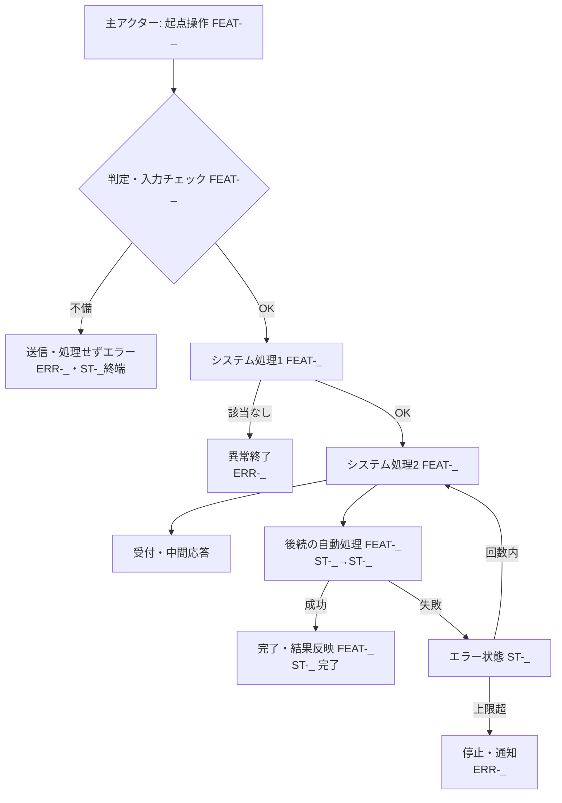

# UC-{ユースケース名} — {主アクター}の「1{業務単位}」end-to-end 体験

> **目的**: **要件視点**で、1つの業務ゴール（ユーザージャーニー／業務シナリオ単位のフロー）を主アクターの業務語彙で end-to-end に記す。設計視点のシーケンス図・詳細フローは `02_設計/40_機能設計/` を正とし、本書は業務の流れ・アクター・主/代替フローと関連FEATの俯瞰にとどめる。
> **書き方**:（記入例は example-suido-fax/01_要件定義/03_ユースケース/01_ユースケース_テンプレート.md 参照）実データは書かず、`{ }` を自プロジェクトの語に置き換える。**参照する要件ID**（`FEAT-*`／状態 `ST-*`／例外 `ERR-*`）でリンクし、章位置参照は使わない。受入基準・状態機械・エラー母集合は `02_設計/60_テスト設計/` を正とし、本書はFEAT番号でリンクする。1ファイル＝1ユースケース（CRUD単位・画面単位に分解しない）。

## 目次
- [1. サマリー](#1-サマリー)
- [2. 主アクター・関係者](#2-主アクター関係者)
- [3. 事前条件](#3-事前条件)
- [4. 主成功シナリオ](#4-主成功シナリオ)
- [5. 業務フロー図](#5-業務フロー図)
- [6. 例外・代替シナリオ](#6-例外代替シナリオ)
- [7. 事後条件](#7-事後条件)
- [8. トレーサビリティ（ステップ → FEAT/ST/ERR）](#8-トレーサビリティステップ--frsterr)

---

## 1. サマリー
> 📝 ここにユースケースの要約を記載。{ユースケース名／目的（価値・KPI）／適用範囲（スコープ外の明示）／トリガ（起点イベント・FEAT）／粒度}

| 項目 | 内容 |
|---|---|
| ユースケース名 |  |
| 目的（価値） |  |
| 適用範囲 |  |
| トリガ |  |
| 粒度 |  |

## 2. 主アクター・関係者
> 📝 ここに登場アクターと関心事を記載。**主アクター（業務ゴールの主体）／副アクター（システム）／外部／監視・保守** を区別する。{区分／アクター／関心事}

| 区分 | アクター | 関心事 |
|---|---|---|
| **主アクター** |  |  |
| 副アクター（システム） |  |  |
| 外部 |  |  |
| 監視・保守 |  |  |

## 3. 事前条件
> 📝 ここにこのユースケース開始の前提条件を記載（成立していないと起動しない条件）。{データ状態／認証状態／対象の状態／マスタ登録状態}（関連FEAT/ERRを併記）

- {事前条件1（関連 `FEAT-__` / `ERR-__`）}
- {事前条件2}
- {事前条件3}

## 4. 主成功シナリオ
> 📝 ここに「起動 → … → 完了」の正常系ステップを時系列で記載。主アクターの操作と、それに続くシステムの自動処理を業務語彙で。各ステップに関連FEATと状態遷移（ST）を紐づける。{#／アクター／業務ステップ／関連FEAT／状態}

| # | アクター | 業務ステップ | 関連FEAT | 状態 |
|---|---|---|---|---|
| 1 |  |  |  | ST-_ |
| 2 |  |  |  | ST-_ |
| 3 |  |  |  | ST-_→ST-_ |

> 補足: {正常系で注意すべき制約・前提（例: 承認フロー・dry-run既定など）を記載}

## 5. 業務フロー図
> 📝 ここに**ユースケース単位のフロー**をMermaidで記載（主成功シナリオ＋主要分岐を1枚に）。ノードにFEAT・ERR・STを併記する。%% ここに記載

## 6. 例外・代替シナリオ
> 📝 ここに業務上の主要例外を記載。分岐の母集合は `02_設計/60_テスト設計/02_RED母集合_受入基準・状態・エラー.md` のERR完全列挙を正とし、本書は発生ステップ・関連FEAT/ERR・振る舞い・アクター体験でまとめる。{例外／発生ステップ／関連FEAT・ERR／システムの振る舞い／アクター体験}

| 例外 | 発生ステップ | 関連FEAT / ERR | システムの振る舞い | アクター体験 |
|---|---|---|---|---|
|  |  |  |  |  |

## 7. 事後条件
> 📝 ここに各結末での最終状態を記載（成功／処理前終了／隔離／失敗終了など、結末ごとに1行）。末尾に**結末に依らず常に成立する共通事後条件**（冪等・監査ログ等）を箇条書きで。{結末／状態／最終状態}

| 結末 | 状態 | {対象}の最終状態 |
|---|---|---|
| **成功**（主成功シナリオ） | ST-_ 完了 |  |
| {処理前で終了} | ST-_ 終端 |  |
| {要確認で隔離} | ST-_ |  |
| {失敗で終了} | ST-_ → 終端 |  |

- 共通事後条件: {いかなる結末でも成立する不変条件（例: 二重処理は発生しない `FEAT-__`／状態遷移は監査ログに記録 `FEAT-__`）}

## 8. トレーサビリティ（ステップ → FEAT/ST/ERR）
> 📝 ここに業務ステップと FEAT・状態遷移・主な例外の対応表を記載。状態機械の全遷移とERRの完全列挙は `02_設計/60_テスト設計/02_RED母集合_受入基準・状態・エラー.md` を正本とし、本書は対応関係のみ示す。{業務ステップ／関連FEAT／状態遷移（ST）／主な例外（ERR）}

| 業務ステップ | 関連FEAT | 状態遷移（ST） | 主な例外（ERR） |
|---|---|---|---|
|  |  |  |  |

> 関連: 状態機械・エラー完全列挙＝`02_設計/60_テスト設計/02_RED母集合_受入基準・状態・エラー.md`／状態イベント表現＝`02_設計/30_データ・IF設計/03_ドメインイベント.md`。
