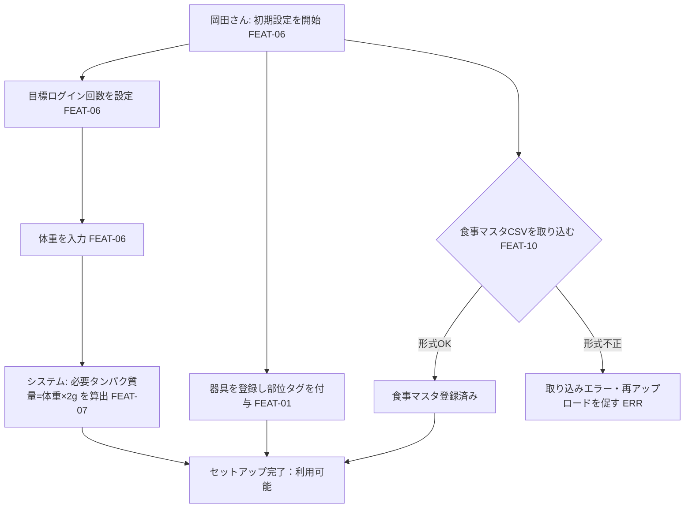

# UC-01 初期セットアップ — 岡田さんの「アプリを使い始める準備」end-to-end 体験

> **目的**: **要件視点**で、1つの業務ゴール（ユーザージャーニー／業務シナリオ単位のフロー）を主アクターの業務語彙で end-to-end に記す。設計視点のシーケンス図・詳細フローは `02_設計/40_機能設計/` を正とし、本書は業務の流れ・アクター・主/代替フローと関連FEATの俯瞰にとどめる。
> **書き方**:（記入例は example-suido-fax/01_要件定義/03_ユースケース/01_ユースケース_テンプレート.md 参照）実データは書かず、`{ }` を自プロジェクトの語に置き換える。**参照する要件ID**（`FEAT-*`／状態 `ST-*`／例外 `ERR-*`）でリンクし、章位置参照は使わない。受入基準・状態機械・エラー母集合は `02_設計/60_テスト設計/` を正とし、本書はFEAT番号でリンクする。1ファイル＝1ユースケース（CRUD単位・画面単位に分解しない）。

> ⚠️ 要確認（人間判断）: 状態機械（ST-）・エラー母集合（ERR-）の正式IDは `02_設計/60_テスト設計/` で採番する（設計フェーズ）。本書では業務状態・例外を記述で示す。

## 目次
- [1. サマリー](#1-サマリー)
- [2. 主アクター・関係者](#2-主アクター関係者)
- [3. 事前条件](#3-事前条件)
- [4. 主成功シナリオ](#4-主成功シナリオ)
- [5. 業務フロー図](#5-業務フロー図)
- [6. 例外・代替シナリオ](#6-例外代替シナリオ)
- [7. 事後条件](#7-事後条件)
- [8. トレーサビリティ（ステップ → FEAT/ST/ERR）](#8-トレーサビリティステップ--frsterr)

---

## 1. サマリー
> 📝 ここにユースケースの要約を記載。{ユースケース名／目的（価値・KPI）／適用範囲（スコープ外の明示）／トリガ（起点イベント・FEAT）／粒度}

| 項目 | 内容 |
|---|---|
| ユースケース名 | 初期セットアップ（アプリを使える状態にする） |
| 目的（価値） | 岡田さんが以降のトレーニング・栄養管理を行えるよう、器具・体重・目標・食事マスタを整える |
| 適用範囲 | 初回の設定一式。日々の利用（UC-02/UC-03）は対象外 |
| トリガ | 初回起動・設定画面での操作（FEAT-06） |
| 粒度 | 業務ゴール単位（1回のセットアップ） |

## 2. 主アクター・関係者
> 📝 ここに登場アクターと関心事を記載。**主アクター（業務ゴールの主体）／副アクター（システム）／外部／監視・保守** を区別する。{区分／アクター／関心事}

| 区分 | アクター | 関心事 |
|---|---|---|
| **主アクター** | 岡田さん | 手早くセットアップを終え、使い始めたい |
| 副アクター（システム） | okada-fit（Webアプリ） | 入力を保存し、必要タンパク質量を自動算出 |
| 外部 | — | （本UCでは外部連携なし） |
| 監視・保守 | 岡田さん（本人運用） | データの保存先・バックアップ |

## 3. 事前条件
> 📝 ここにこのユースケース開始の前提条件を記載（成立していないと起動しない条件）。{データ状態／認証状態／対象の状態／マスタ登録状態}（関連FEAT/ERRを併記）

- 岡田さんが本人として認証済みであること（`FEAT-06` 前提。認証方式は `../01_全体像/05_未決定事項.md` DEC-D03 ⚠️ 要確認）
- 取り込む食事マスタのCSV（食品・タンパク質量）が手元にあること（`FEAT-10`）
- 器具の情報（ジムにある器具）が把握できていること（`FEAT-01`）

## 4. 主成功シナリオ
> 📝 ここに「起動 → … → 完了」の正常系ステップを時系列で記載。主アクターの操作と、それに続くシステムの自動処理を業務語彙で。各ステップに関連FEATと状態遷移（ST）を紐づける。{#／アクター／業務ステップ／関連FEAT／状態}

| # | アクター | 業務ステップ | 関連FEAT | 状態 |
|---|---|---|---|---|
| 1 | 岡田さん | 目標ログイン回数を設定（既定 月12回） | FEAT-06 | 目標設定済み |
| 2 | 岡田さん | 体重を入力する | FEAT-06 | 体重登録済み |
| 3 | システム | 体重×2gで1日の必要タンパク質量を自動算出・保存 | FEAT-07 | 必要量算出済み |
| 4 | 岡田さん | 器具を登録し、各器具に部位タグ（胸/背中/脚/肩/腕）を付与 | FEAT-01 | 器具マスタ登録済み |
| 5 | 岡田さん | 食事マスタCSVをインポート | FEAT-10 | 食事マスタ登録済み |

> 補足: 手順1〜5の順序は前後してよい（体重は必要タンパク質量算出（FEAT-07）の前提）。CSVは初回にまとめて取り込む前提 `[仮]`。

## 5. 業務フロー図
> 📝 ここに**ユースケース単位のフロー**をMermaidで記載（主成功シナリオ＋主要分岐を1枚に）。ノードにFEAT・ERR・STを併記する。%% ここに記載

## 6. 例外・代替シナリオ
> 📝 ここに業務上の主要例外を記載。分岐の母集合は `02_設計/60_テスト設計/02_RED母集合_受入基準・状態・エラー.md` のERR完全列挙を正とし、本書は発生ステップ・関連FEAT/ERR・振る舞い・アクター体験でまとめる。{例外／発生ステップ／関連FEAT・ERR／システムの振る舞い／アクター体験}

| 例外 | 発生ステップ | 関連FEAT / ERR | システムの振る舞い | アクター体験 |
|---|---|---|---|---|
| CSV形式が不正 | 手順5（CSV取込） | FEAT-10 / ERR（設計で採番） | 取り込みを中止しエラー表示、再アップロードを促す | 何が不正か分かり、修正して再取込できる |
| 体重が未入力のまま算出 | 手順3（必要量算出） | FEAT-07 / ERR（設計で採番） | 体重入力を促す（算出しない） | 先に体重入力が必要と分かる |
| 器具を1つも登録しない | 手順4 | FEAT-01 | 登録は任意だがトレーニング（UC-02）開始時に登録へ誘導 | 後からでも登録できる |

## 7. 事後条件
> 📝 ここに各結末での最終状態を記載（成功／処理前終了／隔離／失敗終了など、結末ごとに1行）。末尾に**結末に依らず常に成立する共通事後条件**（冪等・監査ログ等）を箇条書きで。{結末／状態／最終状態}

| 結末 | 状態 | セットアップの最終状態 |
|---|---|---|
| **成功**（主成功シナリオ） | セットアップ完了 | 目標・体重・必要量・器具・食事マスタが保存され、UC-02/UC-03を開始できる |
| 一部のみ完了 | 部分設定 | 未設定項目は後から追加可能（例: 食事マスタ未登録でもトレーニングは可能） |
| CSV取込失敗で終了 | 食事マスタ未登録 | トレーニングは可能、食事の不足分提示（UC-03）は食事マスタ登録後に有効 |

- 共通事後条件: 入力値はDBに保存され、再入力で上書きできる（冪等）。体重更新時は必要タンパク質量を再算出する（`FEAT-07`）。

## 8. トレーサビリティ（ステップ → FEAT/ST/ERR）
> 📝 ここに業務ステップと FEAT・状態遷移・主な例外の対応表を記載。状態機械の全遷移とERRの完全列挙は `02_設計/60_テスト設計/02_RED母集合_受入基準・状態・エラー.md` を正本とし、本書は対応関係のみ示す。{業務ステップ／関連FEAT／状態遷移（ST）／主な例外（ERR）}

| 業務ステップ | 関連FEAT | 状態遷移（ST） | 主な例外（ERR） |
|---|---|---|---|
| 目標ログイン回数・体重の設定 | FEAT-06 | 未設定→設定済み（設計で採番） | 体重未入力 |
| 必要タンパク質量の算出 | FEAT-07 | 未算出→算出済み | 体重未入力 |
| 器具登録（部位タグ付与） | FEAT-01 | 未登録→登録済み | — |
| 食事マスタCSVインポート | FEAT-10 | 未登録→登録済み | CSV形式不正 |

> 関連: 状態機械・エラー完全列挙＝`02_設計/60_テスト設計/02_RED母集合_受入基準・状態・エラー.md`／状態イベント表現＝`02_設計/30_データ・IF設計/03_ドメインイベント.md`。
