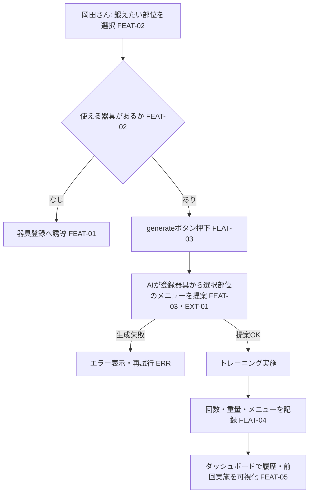

# UC-02 トレーニングを1回行う — 岡田さんの「1回のトレーニング」end-to-end 体験

> **目的**: **要件視点**で、1つの業務ゴール（ユーザージャーニー／業務シナリオ単位のフロー）を主アクターの業務語彙で end-to-end に記す。設計視点のシーケンス図・詳細フローは `02_設計/40_機能設計/` を正とし、本書は業務の流れ・アクター・主/代替フローと関連FEATの俯瞰にとどめる。
> **書き方**:（記入例は example-suido-fax/01_要件定義/03_ユースケース/01_ユースケース_テンプレート.md 参照）実データは書かず、`{ }` を自プロジェクトの語に置き換える。**参照する要件ID**（`FEAT-*`／状態 `ST-*`／例外 `ERR-*`）でリンクし、章位置参照は使わない。受入基準・状態機械・エラー母集合は `02_設計/60_テスト設計/` を正とし、本書はFEAT番号でリンクする。1ファイル＝1ユースケース（CRUD単位・画面単位に分解しない）。

> ⚠️ 要確認（人間判断）: 状態機械（ST-）・エラー母集合（ERR-）の正式IDは `02_設計/60_テスト設計/` で採番する（設計フェーズ）。本書では業務状態・例外を記述で示す。

## 目次
- [1. サマリー](#1-サマリー)
- [2. 主アクター・関係者](#2-主アクター関係者)
- [3. 事前条件](#3-事前条件)
- [4. 主成功シナリオ](#4-主成功シナリオ)
- [5. 業務フロー図](#5-業務フロー図)
- [6. 例外・代替シナリオ](#6-例外代替シナリオ)
- [7. 事後条件](#7-事後条件)
- [8. トレーサビリティ（ステップ → FEAT/ST/ERR）](#8-トレーサビリティステップ--frsterr)

---

## 1. サマリー
> 📝 ここにユースケースの要約を記載。{ユースケース名／目的（価値・KPI）／適用範囲（スコープ外の明示）／トリガ（起点イベント・FEAT）／粒度}

| 項目 | 内容 |
|---|---|
| ユースケース名 | トレーニングを1回行う |
| 目的（価値） | 鍛えたい部位に対しAIが提案したメニューでトレーニングし、記録して継続を支える（KPI-01/02 ログイン率、KPI-03 記録網羅率） |
| 適用範囲 | 1回のトレーニングセッション。初期設定（UC-01）・栄養（UC-03）は対象外 |
| トリガ | 岡田さんが鍛えたい部位を選択（FEAT-02） |
| 粒度 | 業務ゴール単位（1セッション） |

## 2. 主アクター・関係者
> 📝 ここに登場アクターと関心事を記載。**主アクター（業務ゴールの主体）／副アクター（システム）／外部／監視・保守** を区別する。{区分／アクター／関心事}

| 区分 | アクター | 関心事 |
|---|---|---|
| **主アクター** | 岡田さん | 毎回同じメニューを避け、部位に合ったトレーニングをこなして記録したい |
| 副アクター（システム） | okada-fit（Webアプリ） | 器具の絞り込み・記録・可視化 |
| 外部 | Claude API（AI生成エンジン） | 選択部位のトレーニングメニューを提案（EXT-01） |
| 監視・保守 | 岡田さん（本人運用） | AI連携の稼働・記録の保存 |

## 3. 事前条件
> 📝 ここにこのユースケース開始の前提条件を記載（成立していないと起動しない条件）。{データ状態／認証状態／対象の状態／マスタ登録状態}（関連FEAT/ERRを併記）

- 岡田さんが本人として認証済みであること（DEC-D03 ⚠️ 要確認）
- 鍛えたい部位に使える器具が登録済みであること（`FEAT-01`。未登録なら代替シナリオへ）

## 4. 主成功シナリオ
> 📝 ここに「起動 → … → 完了」の正常系ステップを時系列で記載。主アクターの操作と、それに続くシステムの自動処理を業務語彙で。各ステップに関連FEATと状態遷移（ST）を紐づける。{#／アクター／業務ステップ／関連FEAT／状態}

| # | アクター | 業務ステップ | 関連FEAT | 状態 |
|---|---|---|---|---|
| 1 | 岡田さん | 鍛えたい部位（胸/背中/脚/肩/腕）を選択 | FEAT-02 | 部位選択済み |
| 2 | システム | 部位タグで使える器具を絞り込み提示 | FEAT-02 | 器具提示済み |
| 3 | 岡田さん | generateボタンを押下 | FEAT-03 | 生成要求 |
| 4 | システム→Claude | 登録器具から選択部位のトレーニングメニューをAIが提案 | FEAT-03 / EXT-01 | メニュー提案済み |
| 5 | 岡田さん | トレーニングを実施 | — | 実施中 |
| 6 | 岡田さん | 実施した回数・重量・メニューを記録 | FEAT-04 | 記録済み |
| 7 | システム | ダッシュボードに履歴・前回実施を可視化 | FEAT-05 | 可視化済み |

> 補足: 提案はボタン押下のオンデマンド（自動/定期のローテーション提案は行わない）。3日ルール・回復日数は用いない。

## 5. 業務フロー図
> 📝 ここに**ユースケース単位のフロー**をMermaidで記載（主成功シナリオ＋主要分岐を1枚に）。ノードにFEAT・ERR・STを併記する。%% ここに記載

## 6. 例外・代替シナリオ
> 📝 ここに業務上の主要例外を記載。分岐の母集合は `02_設計/60_テスト設計/02_RED母集合_受入基準・状態・エラー.md` のERR完全列挙を正とし、本書は発生ステップ・関連FEAT/ERR・振る舞い・アクター体験でまとめる。{例外／発生ステップ／関連FEAT・ERR／システムの振る舞い／アクター体験}

| 例外 | 発生ステップ | 関連FEAT / ERR | システムの振る舞い | アクター体験 |
|---|---|---|---|---|
| 選択部位に使える器具が未登録 | 手順2 | FEAT-01/02 | 器具登録（SCR-02）へ誘導 | 器具を登録すれば続行できる |
| AIメニュー生成に失敗（Claude不達・エラー） | 手順4 | FEAT-03 / EXT-01 / ERR（設計で採番） | エラー表示し再試行を促す。記録・閲覧は継続可 | 再試行できる／手動で記録も可能 |
| 提案メニューが妥当でない | 手順4〜6 | FEAT-03 | 岡田さんが内容を調整して記録できる | 生成結果を自分で修正できる |
| 記録の必須項目（回数・重量）未入力 | 手順6 | FEAT-04 / ERR（設計で採番） | 入力を促す | 何が足りないか分かる |

## 7. 事後条件
> 📝 ここに各結末での最終状態を記載（成功／処理前終了／隔離／失敗終了など、結末ごとに1行）。末尾に**結末に依らず常に成立する共通事後条件**（冪等・監査ログ等）を箇条書きで。{結末／状態／最終状態}

| 結末 | 状態 | セッションの最終状態 |
|---|---|---|
| **成功**（主成功シナリオ） | 記録済み・可視化済み | トレーニング記録が保存され、ダッシュボードに反映される |
| 器具未登録で中断 | 未実施 | 器具登録後に再開できる（記録なし） |
| AI生成失敗 | 生成失敗 | 再試行、または手動記録で記録は残せる |

- 共通事後条件: 記録はDBに保存され、同一セッションの二重記録は避ける（冪等の担保方針は設計で確定 ⚠️）。前回実施はダッシュボード（`FEAT-05`）から常に参照可能。

## 8. トレーサビリティ（ステップ → FEAT/ST/ERR）
> 📝 ここに業務ステップと FEAT・状態遷移・主な例外の対応表を記載。状態機械の全遷移とERRの完全列挙は `02_設計/60_テスト設計/02_RED母集合_受入基準・状態・エラー.md` を正本とし、本書は対応関係のみ示す。{業務ステップ／関連FEAT／状態遷移（ST）／主な例外（ERR）}

| 業務ステップ | 関連FEAT | 状態遷移（ST） | 主な例外（ERR） |
|---|---|---|---|
| 部位選択・器具絞り込み | FEAT-02 | 未選択→器具提示（設計で採番） | 器具未登録 |
| AIメニュー提案 | FEAT-03（EXT-01） | 生成要求→提案済み | 生成失敗 |
| トレーニング記録 | FEAT-04 | 未記録→記録済み | 必須項目未入力 |
| ダッシュボード可視化 | FEAT-05 | 記録済み→可視化 | — |

> 関連: 状態機械・エラー完全列挙＝`02_設計/60_テスト設計/02_RED母集合_受入基準・状態・エラー.md`／状態イベント表現＝`02_設計/30_データ・IF設計/03_ドメインイベント.md`。
