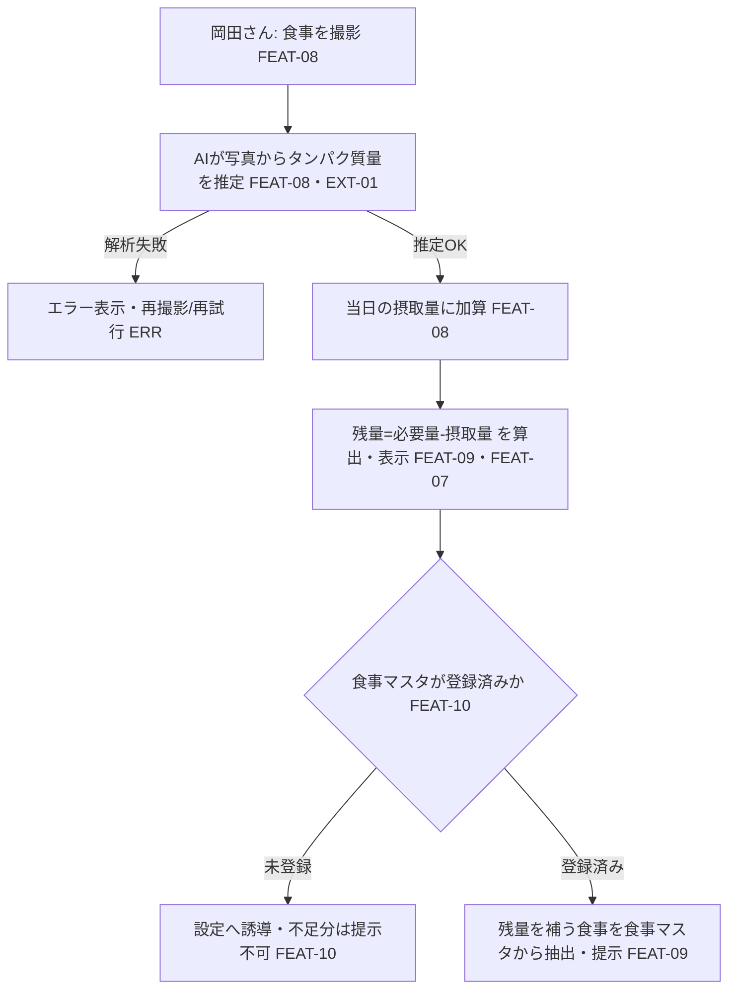

# UC-03 食事のタンパク質を管理する — 岡田さんの「1回の食事記録と不足補い」end-to-end 体験

> **目的**: **要件視点**で、1つの業務ゴール（ユーザージャーニー／業務シナリオ単位のフロー）を主アクターの業務語彙で end-to-end に記す。設計視点のシーケンス図・詳細フローは `02_設計/40_機能設計/` を正とし、本書は業務の流れ・アクター・主/代替フローと関連FEATの俯瞰にとどめる。
> **書き方**:（記入例は example-suido-fax/01_要件定義/03_ユースケース/01_ユースケース_テンプレート.md 参照）実データは書かず、`{ }` を自プロジェクトの語に置き換える。**参照する要件ID**（`FEAT-*`／状態 `ST-*`／例外 `ERR-*`）でリンクし、章位置参照は使わない。受入基準・状態機械・エラー母集合は `02_設計/60_テスト設計/` を正とし、本書はFEAT番号でリンクする。1ファイル＝1ユースケース（CRUD単位・画面単位に分解しない）。

> ⚠️ 要確認（人間判断）: 状態機械（ST-）・エラー母集合（ERR-）の正式IDは `02_設計/60_テスト設計/` で採番する（設計フェーズ）。本書では業務状態・例外を記述で示す。

## 目次
- [1. サマリー](#1-サマリー)
- [2. 主アクター・関係者](#2-主アクター関係者)
- [3. 事前条件](#3-事前条件)
- [4. 主成功シナリオ](#4-主成功シナリオ)
- [5. 業務フロー図](#5-業務フロー図)
- [6. 例外・代替シナリオ](#6-例外代替シナリオ)
- [7. 事後条件](#7-事後条件)
- [8. トレーサビリティ（ステップ → FEAT/ST/ERR）](#8-トレーサビリティステップ--frsterr)

---

## 1. サマリー
> 📝 ここにユースケースの要約を記載。{ユースケース名／目的（価値・KPI）／適用範囲（スコープ外の明示）／トリガ（起点イベント・FEAT）／粒度}

| 項目 | 内容 |
|---|---|
| ユースケース名 | 食事のタンパク質を管理する |
| 目的（価値） | 食事を撮るだけでタンパク質摂取を把握し、1日の不足分を何で補うかまで分かる |
| 適用範囲 | 1回の食事記録〜残量・不足分提示。トレーニング（UC-02）・目標体型/食事メニュー生成（対象外）は含まない |
| トリガ | 岡田さんが食事を撮影（FEAT-08） |
| 粒度 | 業務ゴール単位（1回の食事記録と補い） |

## 2. 主アクター・関係者
> 📝 ここに登場アクターと関心事を記載。**主アクター（業務ゴールの主体）／副アクター（システム）／外部／監視・保守** を区別する。{区分／アクター／関心事}

| 区分 | アクター | 関心事 |
|---|---|---|
| **主アクター** | 岡田さん | 手軽にタンパク質摂取を把握し、不足を補いたい |
| 副アクター（システム） | okada-fit（Webアプリ） | 残量算出・食事マスタからの不足分抽出 |
| 外部 | Claude API（画像入力対応） | 食事写真からタンパク質量を推定（EXT-01） |
| 監視・保守 | 岡田さん（本人運用） | 食事写真の外部送信・保持ポリシー（DEC-D04 ⚠️） |

## 3. 事前条件
> 📝 ここにこのユースケース開始の前提条件を記載（成立していないと起動しない条件）。{データ状態／認証状態／対象の状態／マスタ登録状態}（関連FEAT/ERRを併記）

- 岡田さんが本人として認証済みであること（DEC-D03 ⚠️ 要確認）
- 体重が設定され、1日の必要タンパク質量が算出済みであること（`FEAT-07`。未設定なら残量を出せない）
- 食事マスタが登録済みであること（`FEAT-10`。未登録なら不足分を提示できない → 代替シナリオ）

## 4. 主成功シナリオ
> 📝 ここに「起動 → … → 完了」の正常系ステップを時系列で記載。主アクターの操作と、それに続くシステムの自動処理を業務語彙で。各ステップに関連FEATと状態遷移（ST）を紐づける。{#／アクター／業務ステップ／関連FEAT／状態}

| # | アクター | 業務ステップ | 関連FEAT | 状態 |
|---|---|---|---|---|
| 1 | 岡田さん | 食事を撮影・アップロード | FEAT-08 | 撮影済み |
| 2 | システム→Claude | 写真からタンパク質量を推定 | FEAT-08 / EXT-01 | 計算済み |
| 3 | システム | 当日の摂取量に加算 | FEAT-08 | 摂取量更新 |
| 4 | システム | 残量（必要量−摂取量）を算出・表示 | FEAT-09, FEAT-07 | 残量表示済み |
| 5 | システム | 残量を補う食事を食事マスタから抽出・提示 | FEAT-09, FEAT-10 | 不足分提示済み |

> 補足: 残量を補う食事の抽出は食事マスタ（CSV）からの決定的処理（AIは使わない）。AIは写真からのタンパク質計算のみ（RULE-005/006）。

## 5. 業務フロー図
> 📝 ここに**ユースケース単位のフロー**をMermaidで記載（主成功シナリオ＋主要分岐を1枚に）。ノードにFEAT・ERR・STを併記する。%% ここに記載

## 6. 例外・代替シナリオ
> 📝 ここに業務上の主要例外を記載。分岐の母集合は `02_設計/60_テスト設計/02_RED母集合_受入基準・状態・エラー.md` のERR完全列挙を正とし、本書は発生ステップ・関連FEAT/ERR・振る舞い・アクター体験でまとめる。{例外／発生ステップ／関連FEAT・ERR／システムの振る舞い／アクター体験}

| 例外 | 発生ステップ | 関連FEAT / ERR | システムの振る舞い | アクター体験 |
|---|---|---|---|---|
| 画像解析に失敗（Claude不達・不鮮明） | 手順2 | FEAT-08 / EXT-01 / ERR（設計で採番） | エラー表示し再撮影/再試行を促す | 撮り直せる |
| AI推定値が実態とズレる | 手順2〜3 | FEAT-08 | 岡田さんが推定値を手動補正できる `[仮]`（設計で確定） | 値を直せる |
| 必要タンパク質量が未算出（体重未設定） | 手順4 | FEAT-07 | 体重設定（UC-01）へ誘導。残量を出さない | 体重設定が必要と分かる |
| 食事マスタ未登録 | 手順5 | FEAT-10 | 残量表示は可能、不足分提示は不可。CSVインポートへ誘導 | マスタ登録後に不足分提示が有効になる |

## 7. 事後条件
> 📝 ここに各結末での最終状態を記載（成功／処理前終了／隔離／失敗終了など、結末ごとに1行）。末尾に**結末に依らず常に成立する共通事後条件**（冪等・監査ログ等）を箇条書きで。{結末／状態／最終状態}

| 結末 | 状態 | 食事記録の最終状態 |
|---|---|---|
| **成功**（主成功シナリオ） | 不足分提示済み | 摂取量が更新され、残量と補う食事が表示される |
| 画像解析失敗 | 未計算 | 摂取量は更新されず、再撮影できる |
| 食事マスタ未登録 | 残量表示のみ | 残量は分かるが不足分の食事提示は保留 |

- 共通事後条件: 摂取量は当日単位で集計し、日付が変わればリセットされる `[仮]`（設計で確定 ⚠️）。食事写真の外部送信・保持はDEC-D04の方針に従う。

## 8. トレーサビリティ（ステップ → FEAT/ST/ERR）
> 📝 ここに業務ステップと FEAT・状態遷移・主な例外の対応表を記載。状態機械の全遷移とERRの完全列挙は `02_設計/60_テスト設計/02_RED母集合_受入基準・状態・エラー.md` を正本とし、本書は対応関係のみ示す。{業務ステップ／関連FEAT／状態遷移（ST）／主な例外（ERR）}

| 業務ステップ | 関連FEAT | 状態遷移（ST） | 主な例外（ERR） |
|---|---|---|---|
| 食事撮影・タンパク質計算 | FEAT-08（EXT-01） | 撮影済み→計算済み（設計で採番） | 画像解析失敗 |
| 残量の算出・表示 | FEAT-09, FEAT-07 | 計算済み→残量表示 | 必要量未算出 |
| 不足分の食事提示 | FEAT-09, FEAT-10 | 残量表示→不足分提示 | 食事マスタ未登録 |

> 関連: 状態機械・エラー完全列挙＝`02_設計/60_テスト設計/02_RED母集合_受入基準・状態・エラー.md`／状態イベント表現＝`02_設計/30_データ・IF設計/03_ドメインイベント.md`。
