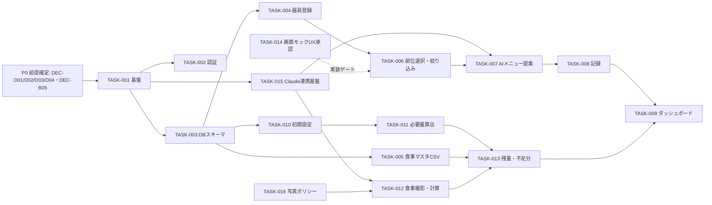

# 大タスク（作業ブロック）

> **目的**: 機能一覧（FEAT）を実装に向けた**作業ブロック（10〜30個目安）**へ分解する。要件レベルの分解であり、正確な工数見積とは別物（見積は別ドキュメント/将来のWBSで行う）。
> **書き方**: 1ブロック＝まとまった作業単位。構成要素・リスク・備考を添える。※工数の数値を詰めるのが目的ではない。記入例は example-suido-fax/01_要件定義/05_タスク一覧/01_大タスク.md 参照。

## 目次
1. [作業ブロック一覧](#1-作業ブロック一覧)
2. [依存・クリティカルパス](#2-依存クリティカルパス)

## 1. 作業ブロック一覧
> 📝 ここに作業ブロックを記載。含める項目: ID（`TASK-001, TASK-002…` 連番・不変。ハーネス aic-harness/criteria.json 準拠）／構成要素（何を作るか）／リスク（低/中/高）／備考（外部律速・新規/重い等）。10〜30個を目安に、機能一覧のFEATを漏れなくカバーする。※これは要件レベルの分解で、工数見積とは別。

| TASK-ID | 構成要素 | リスク | 備考 |
|---|---|:--:|---|
| TASK-001 | プロジェクト基盤（Next.js＋shadcn/ui＋Supabase接続＋Vercelデプロイ雛形） | 中 | 新規スタック（DEC-D01 `[仮]`確定待ち） |
| TASK-002 | 認証（本人限定ログイン） | 高 | 方式未定（DEC-D03） |
| TASK-003 | DBスキーマ設計・マイグレーション（器具/部位タグ・記録・プロフィール・食事マスタ・食事記録の5データストア） | 中 | 対応DM設計（設計PR2）に依存 |
| TASK-004 | 器具登録・部位タグ付与（FEAT-01） | 低 | 部位=胸/背中/脚/肩/腕（DEC-B04） |
| TASK-005 | 食事マスタCSVインポート（FEAT-10） | 低 | CSVスキーマ=DEC-B05 |
| TASK-006 | 部位選択・器具絞り込み（FEAT-02） | 低 | 決定的処理（AI不使用） |
| TASK-007 | AIメニュー提案（generate・Claude連携）（FEAT-03） | 高 | プロンプト設計・生成品質（EXT-01） |
| TASK-008 | トレーニング記録（回数・重量・メニュー）（FEAT-04） | 低 | — |
| TASK-009 | ダッシュボード・可視化（FEAT-05） | 中 | 継続導線（KPI-01/02 直結） |
| TASK-010 | 初期設定（目標ログイン回数・体重）（FEAT-06） | 低 | 既定 月12回 |
| TASK-011 | 必要タンパク質量の算出（体重×2g）（FEAT-07） | 低 | RULE-001 |
| TASK-012 | 食事撮影・タンパク質計算（Claude画像入力）（FEAT-08） | 高 | 画像推定の精度・手動補正（EXT-01） |
| TASK-013 | 残量表示・不足分の食事提示（FEAT-09） | 中 | 抽出ロジック（1品/組合せ）要確認 |
| TASK-014 | 画面モック作成・UX承認（SCR-01〜05） | 中 | 人間承認ゲート（画面モック規約） |
| TASK-015 | Claude API連携基盤（サーバ側・APIキー秘匿・エラー/リトライ・構造化出力） | 高 | 全AI機能の土台（EXT-01） |
| TASK-016 | 食事写真の外部送信・保持ポリシー実装（DEC-D04） | 高 | プライバシー・方針未定 |

> FEATカバレッジ: FEAT-01→TASK-004 / FEAT-02→TASK-006 / FEAT-03→TASK-007 / FEAT-04→TASK-008 / FEAT-05→TASK-009 / FEAT-06→TASK-010 / FEAT-07→TASK-011 / FEAT-08→TASK-012 / FEAT-09→TASK-013 / FEAT-10→TASK-005（全10機能を網羅）。

## 2. 依存・クリティカルパス
> 📝 ここに作業ブロックの依存関係を記載。含める項目: どのブロックがどのブロックの前提か／クリティカルパス／最大の不確実性・律速要因。下の骨組みのノードを実際の作業ブロックに置き換える。

- クリティカルパス: **P0（DEC確定）→ TASK-001 基盤 → TASK-015 Claude連携基盤 → TASK-007/TASK-012（AI機能）→ TASK-013/TASK-009（統合・可視化）**。
- 最大の不確実性: AIの生成/推定品質（TASK-007・TASK-012）と、未確定のDEC（認証DEC-D03・食事写真ポリシーDEC-D04・モデルtier DEC-D02）。
- 律速要因: Claude連携基盤（TASK-015）が全AI機能の前提。画面はUX承認（TASK-014）がマージ/実装のゲート。

> 高リスクな作業ブロックの内訳サブタスクは `02_想定タスク.md` に分解する。
