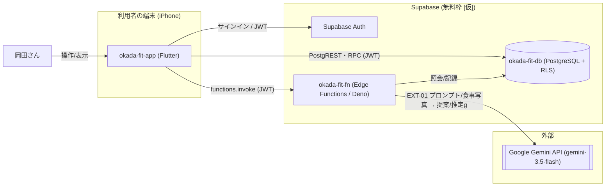

# 構成要素 — okada-fit

> **目的**: システムを構成する要素を**論理（サービス/コンポーネントの責務）**と**物理（実装配置）**の2面で俯瞰し、「何が・何を担うか」を固定する。
> **書き方**:（記入例は example-suido-fax の対応ファイル参照）実データは書かず、`{ }` を自プロジェクトの語に置き換える。信頼境界は `02_境界.md`、DFDは `03_データフロー.md` を正本とし本書は概要俯瞰にとどめる。

## 目次
1. [構成の要点](#1-構成の要点)
2. [サービス/コンポーネントの責務](#2-サービスコンポーネントの責務)
3. [システム構成図（実装配置）](#3-システム構成図実装配置)
4. [処理の流れ（概要）](#4-処理の流れ概要)

## 1. 構成の要点
> 📝 ここに構成上の主要な設計判断を記載。{論点／採用した方式／根拠（REQ/FEAT/NFR/DEC）}

| 論点 | 採用 | 根拠 |
|---|---|---|
| アプリ形態 | Flutter アプリ（iOS先行・TestFlight配布）＋ Supabase | 個人利用・小規模（DEC-D01・ADR-0010 で確定） |
| 実行基盤 | Supabase（Auth／PostgreSQL + RLS／Edge Functions）。**Webホスティングを持たない** | BaaS集約で保守を最小化（DEC-B03） |
| クライアントの呼び出し方式 | PostgREST 直接／RPC／Edge Function の3方式に割り当てる | `50_詳細設計/07_実装共通設計パターン.md` |
| AI呼び出し経路 | Google Gemini API は Edge Function からのみ呼ぶ。APIキーは端末に出さない | 秘匿（EXT-01・境界・NFR-SEC-02） |
| 決定的処理の分離 | 部位タグによる器具絞り込み・不足分の食事抽出はAI不使用の決定的処理 | RULE-004/005・DEC-B01 |
| データ永続化 | 無料枠のDB（Supabase/PostgreSQL・**500 MB**）に集約。本人分離はRLS | DEC-B03・ADR-0004/0005 |
| 単一ユーザ前提 | マルチテナントは持たない。認証は Supabase Auth の本人限定のみ | 利用者は1人（ADR-0004・ADR-0016） |

## 2. サービス/コンポーネントの責務
> 📝 ここに各サービス（または主要コンポーネント）の責務を記載。{サービス名／内部名／主な責務／主要コンポーネント／主なEXT-ID}

内部サービス名の正本は `50_詳細設計/06_DB設計規約.md §5`。

| サービス | 内部名 | 主な責務 | 主要コンポーネント | 主なIF |
|---|---|---|---|---|
| Flutter アプリ | okada-fit-app | 画面表示・入力・端末内の軽い算出（FEAT-07） | Flutter（Dart）、`supabase_flutter` | — |
| Edge Functions | okada-fit-fn | JWT検証・プロンプト組立・AI呼び出し・構造化出力の検証 | Deno（`generate-menu`／`analyze-meal`） | EXT-01 |
| データベース・認証 | okada-fit-db（Supabase） | 器具・部位タグ／トレーニング記録／プロフィール（体重・目標）／食事マスタ／食事記録の永続化。認証・RLS・RPC | PostgreSQL、Supabase Auth | — |
| AI生成（外部） | Google Gemini API | メニュー提案（FEAT-03）・食事写真からのタンパク質計算（FEAT-08） | `generateContent`（構造化出力・画像入力） | EXT-01 |

## 3. システム構成図（実装配置）
> 📝 ここに物理的な実装配置（デプロイ構成・データストア・外部連携）をMermaidで記載。ラベルはEXT-IDや業務データの意味で示す。%% ここに記載

> ※ iPhone（iOS先行）は ADR-0010 で確定。Supabase の料金プランは未確定のため `[仮]` を残す。

**無料枠の確定値**（公式の料金ページ・2026-08-08 確認）。正本は `20_インフラ設計/01_システム構成・環境.md §2`。

| 項目 | 無料枠 | 本PJへの影響 |
|---|---|---|
| DB／ストレージ | 500 MB ／ 1 GB | 個人利用の規模では当面足りる見込み `[仮]` |
| Edge Function 呼び出し | 500,000回／月 | `generate-menu`・`analyze-meal` の想定量では余る |
| ログ保持 | **7日** | 7日を超えた外部送信は追えない（`50_詳細設計/05_ログ設計.md §4`） |
| 自動バックアップ・PITR | **どちらも無し** | 復元元は手動エクスポートのみ（`20_インフラ設計/02_IaC・デプロイ・可用性配置.md §3`） |
| プロジェクトの停止 | **1週間の無操作で一時停止** | 使わない週があるとアプリが動かない |
| アクティブなプロジェクト数 | **2つまで** | dev/prod で使い切る |

## 4. 処理の流れ（概要）
> 📝 ここに主要な処理シーケンスの概要を番号付きで記載。時系列の詳細はシーケンス図／`03_ドメインイベント.md` を正本とする。{ステップ／担当コンポーネント／入出力}

呼び出しは3方式に分かれる。**AIを呼ぶものだけ Edge Function**、集計は RPC、単純CRUDは PostgREST 直接。

1. トレーニング: 部位選択 → PostgREST の埋め込み select で器具を絞り込む（FEAT-02・AI不使用）。generate押下 → `functions.invoke('generate-menu')` → Gemini API。記録は RPC `create_training_session`。表示は RPC `get_dashboard`。
2. 栄養: 食事撮影 → `functions.invoke('analyze-meal')` → Gemini API（画像→推定タンパク質量）。結果は PostgREST で `meal_logs` に記録。残量は RPC `get_protein_remaining`。不足分の食事は `foods` のDB照会で抽出する。
3. 初期設定: 体重入力 → PostgREST で `users` に保存。必要タンパク質量（体重×2g）は **Dart 純関数のみ**で算出する（SQL には式を置かない・ADR-0016）。食事マスタは RPC `import_foods` で初期取り込み。

| FEAT | 方式 | 名前 |
|---|---|---|
| FEAT-01 器具登録 | RPC | `create_machine` / `update_machine` / `delete_machine` |
| FEAT-02 部位絞り込み | PostgREST（埋め込み select・`DISTINCT`） | `training_menus` → `machine_menus` → `training_machines` |
| FEAT-03 AIメニュー | Edge Function | `generate-menu` |
| FEAT-04 トレーニング記録 | RPC＋PostgREST | `create_training_session` |
| FEAT-05 ダッシュボード | RPC | `get_dashboard` |
| FEAT-06 初期設定 | PostgREST | `users` |
| FEAT-07 必要量算出 | **Dart 純関数のみ**（APIなし） | `calcTargetProteinG` |
| FEAT-08 食事撮影 | Edge Function＋PostgREST | `analyze-meal` |
| FEAT-09 残量・不足分 | RPC | `get_protein_remaining` |
| FEAT-10 CSV取込 | RPC | `import_foods` |

> 方式割り当ての正本は `50_詳細設計/07_実装共通設計パターン.md`。命名規約は `50_詳細設計/06_DB設計規約.md §5`。

> 関連: 信頼境界＝`02_境界.md` / DFD＝`03_データフロー.md` / 外部連携＝`04_外部連携.md` / 技術選定＝`05_技術選定.md`。
