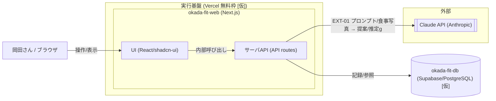

# 構成要素 — okada-fit

> **目的**: システムを構成する要素を**論理（サービス/コンポーネントの責務）**と**物理（実装配置）**の2面で俯瞰し、「何が・何を担うか」を固定する。
> **書き方**:（記入例は example-suido-fax の対応ファイル参照）実データは書かず、`{ }` を自プロジェクトの語に置き換える。信頼境界は `02_境界.md`、DFDは `03_データフロー.md` を正本とし本書は概要俯瞰にとどめる。

## 目次
1. [構成の要点](#1-構成の要点)
2. [サービス/コンポーネントの責務](#2-サービスコンポーネントの責務)
3. [システム構成図（実装配置）](#3-システム構成図実装配置)
4. [処理の流れ（概要）](#4-処理の流れ概要)

## 1. 構成の要点
> 📝 ここに構成上の主要な設計判断を記載。{論点／採用した方式／根拠（REQ/FEAT/NFR/DEC）}

| 論点 | 採用 | 根拠 |
|---|---|---|
| アプリ形態 | 単一のWebアプリ（Next.js）でフロント＋サーバAPIを一体化 `[仮]` | 個人利用・小規模（DEC-D01） |
| AI呼び出し経路 | Claude API はサーバ側（API route）からのみ呼ぶ。APIキーはクライアントに出さない | 秘匿（EXT-01・境界） |
| 決定的処理の分離 | 部位タグによる器具絞り込み・不足分の食事抽出はAI不使用の決定的処理 | RULE-004/005・DEC-B01 |
| データ永続化 | 無料枠のDB（Supabase/PostgreSQL `[仮]`）に集約 | DEC-B03 |
| 単一ユーザ前提 | マルチテナントは持たない。認証は最小限 `[仮]` | 個人利用で確定 |

## 2. サービス/コンポーネントの責務
> 📝 ここに各サービス（または主要コンポーネント）の責務を記載。{サービス名／内部名／主な責務／主要コンポーネント／主なEXT-ID}

| サービス | 内部名 | 主な責務 | 主要コンポーネント | 主なIF |
|---|---|---|---|---|
| Webアプリ | okada-fit-web `[仮]` | UI表示・API・ビジネスロジック（絞り込み/残量算出等） | UI(React/shadcn-ui)、サーバAPI(API routes) | EXT-01 |
| データベース | okada-fit-db（Supabase `[仮]`） | 器具・部位タグ／トレーニング記録／プロフィール（体重・目標）／食事マスタ／食事記録の永続化 | PostgreSQL | — |
| AI生成（外部） | Claude API | メニュー提案（FEAT-03）・食事写真からのタンパク質計算（FEAT-08） | Anthropic Messages API | EXT-01 |

## 3. システム構成図（実装配置）
> 📝 ここに物理的な実装配置（デプロイ構成・データストア・外部連携）をMermaidで記載。ラベルはEXT-IDや業務データの意味で示す。%% ここに記載

## 4. 処理の流れ（概要）
> 📝 ここに主要な処理シーケンスの概要を番号付きで記載。時系列の詳細はシーケンス図／`03_ドメインイベント.md` を正本とする。{ステップ／担当コンポーネント／入出力}

1. トレーニング: ブラウザ → 部位選択 → API（器具を部位タグでDB照会・絞り込み）→ generate押下 → API → Claude（メニュー生成）→ 記録（DB） → ダッシュボード表示。
2. 栄養: 食事撮影 → API → Claude（画像→推定タンパク質量）→ 残量算出（必要量−摂取量、DB）→ 不足分抽出（食事マスタからDB照会）→ 表示。
3. 初期設定: 体重入力 → 必要タンパク質量（体重×2g）を算出・保存（DB）。食事マスタはCSVインポートで初期取り込み（DB）。

> 関連: 信頼境界＝`02_境界.md` / DFD＝`03_データフロー.md` / 外部連携＝`04_外部連携.md` / 技術選定＝`05_技術選定.md`。
