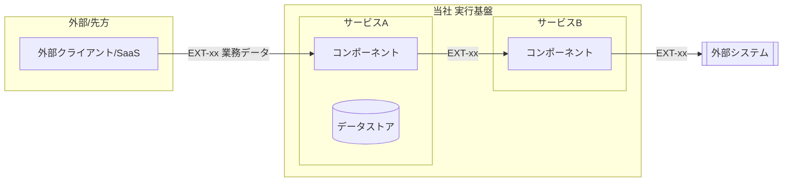

# 構成要素 — {システム名}

> **目的**: システムを構成する要素を**論理（サービス/コンポーネントの責務）**と**物理（実装配置）**の2面で俯瞰し、「何が・何を担うか」を固定する。
> **書き方**:（記入例は example-suido-fax の対応ファイル参照）実データは書かず、`{ }` を自プロジェクトの語に置き換える。信頼境界は `02_境界.md`、DFDは `03_データフロー.md` を正本とし本書は概要俯瞰にとどめる。

## 目次
1. [構成の要点](#1-構成の要点)
2. [サービス/コンポーネントの責務](#2-サービスコンポーネントの責務)
3. [システム構成図（実装配置）](#3-システム構成図実装配置)
4. [処理の流れ（概要）](#4-処理の流れ概要)

## 1. 構成の要点
> 📝 ここに構成上の主要な設計判断を記載。{論点／採用した方式／根拠（REQ/FEAT/NFR/DEC）}

| 論点 | 採用 | 根拠 |
|---|---|---|
|  |  |  |

## 2. サービス/コンポーネントの責務
> 📝 ここに各サービス（または主要コンポーネント）の責務を記載。{サービス名／内部名／主な責務／主要コンポーネント／主なEXT-ID}

| サービス | 内部名 | 主な責務 | 主要コンポーネント | 主なIF |
|---|---|---|---|---|
|  |  |  |  |  |

## 3. システム構成図（実装配置）
> 📝 ここに物理的な実装配置（デプロイ構成・データストア・外部連携）をMermaidで記載。ラベルはEXT-IDや業務データの意味で示す。%% ここに記載

## 4. 処理の流れ（概要）
> 📝 ここに主要な処理シーケンスの概要を番号付きで記載。時系列の詳細はシーケンス図／`03_ドメインイベント.md` を正本とする。{ステップ／担当コンポーネント／入出力}

1. {ステップ1: 担当コンポーネント → 処理 → 出力}
2. {ステップ2}
3. {ステップ3}

> 関連: 信頼境界＝`02_境界.md` / DFD＝`03_データフロー.md` / 外部連携＝`04_外部連携.md` / 技術選定＝`05_技術選定.md`。
