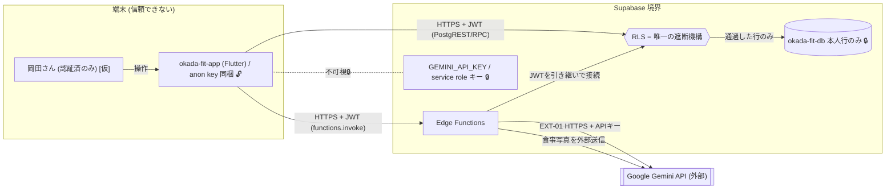

# 境界 — okada-fit の信頼境界

> **目的**: システムの**信頼境界**と**データの可視性**を示す。誰から何が見えるか（先方不可視・VPC内・外部公開）と、境界ごとの認証・制御を固定する。
> **書き方**:（記入例は example-suido-fax の対応ファイル参照）実データは書かず、境界と制御方式のみ設計面で記す。最重要の非公開データ（🔒）と外部公開面（攻撃面）を必ず明示する。構成要素は `01_構成要素.md`。

## 目次
1. [全体境界図（論理）](#1-全体境界図論理)
2. [信頼境界一覧](#2-信頼境界一覧)
3. [データ可視性](#3-データ可視性)
4. [境界に効く前提](#4-境界に効く前提)

## 1. 全体境界図（論理）
> 📝 ここに相手（先方／自社／外部システム）ごとの境界とEXT-IDをMermaidで記載。非公開データは点線＋🔒で不可視を示す。%% ここに記載

## 2. 信頼境界一覧
> 📝 ここに各信頼境界と制御を記載。{境界（誰と誰の間）／相手／公開面／制御（認証・封じ込め）}

| 境界 | 相手 | 制御 |
|---|---|---|
| Flutter アプリ ↔ Supabase | 岡田さん（唯一の利用者・端末は信頼できない） | HTTPS/TLS ＋ **Supabase Auth** の JWT で本人限定（ADR-0004・DEC-D03確定）。**遮断は RLS が担う**（下記 §4） |
| Supabase 内部（PostgREST/RPC ↔ DB） | Supabase | 全10表で RLS 有効。`TO authenticated` を明示し `anon` に権限を与えない。述語は `user_id = auth.uid()`（ADR-0005） |
| Edge Function ↔ Google Gemini API | Google Gemini API（外部API） | Edge Function からのみ呼び出し。APIキーは Function Secrets🔒。食事写真は送信するが**自システムでは保存しない**（DEC-D04確定・ADR-0003） |

> 旧構成では「ブラウザ｜サーバ（Route Handler）｜DB」の3層で、サーバが一次防御だった。
> 本構成にサーバ層は無い。端末から DB まで直接届き、**RLS が一次防御になる**（`50_詳細設計/07_実装共通設計パターン.md`）。

## 3. データ可視性
> 📝 ここにデータごとの可視性方針を記載。特に**先方から構造的に不可視にすべき資産データ**を明記。{データ／所有／公開範囲／不可視化の手段}

| データ | 所有 | 公開範囲 | 可視性の制御 |
|---|---|---|---|
| `GEMINI_API_KEY` / service role キー | 岡田さん（運用） | 非公開🔒 | Edge Function の環境変数のみ。Flutter 側・リポジトリに出さない（NFR-SEC-02） |
| Supabase の anon key | 岡田さん（運用） | **公開🔓（アプリに同梱）** | 秘匿できない。秘匿ではなくRLSで守る（ADR-0005） |
| トレーニング記録・体重・目標 | 岡田さん | 本人のみ | RLSで `user_id = auth.uid()` の行に限定 `[仮]`（DEC-D03） |
| 食事写真 | 岡田さん | 本人＋Gemini API（計算時に外部送信） | **自システムでは保存しない**（解析後に破棄・ADR-0003）。送信先プロバイダでの保持はZDR設定で別途確認（ADR-0001申し送り） |
| 食事マスタ（食品×タンパク質量） | 岡田さん | 本人のみ | DBに保存。共通マスタ扱いで認証済みなら読み書き可（ADR-0005申し送り） |

## 4. 境界に効く前提
> 📝 ここに境界設計の前提・注意点を記載。{公開エンドポイントの限定／内部完結の範囲／時系列は状態遷移で表す等}

**anon key は端末に埋め込まれる公開鍵である。** ここが本構成の急所になる。

| # | 前提 |
|---|---|
| 1 | Flutter アプリは配布物である。埋め込んだ anon key と `SUPABASE_URL` は取り出せる |
| 2 | 鍵を取り出せば、誰でも PostgREST・RPC を直接叩ける |
| 3 | したがって**RLS が唯一の遮断機構**になる。ポリシー1行の誤りがそのままデータ漏洩になる |
| 4 | アプリ側の絞り込みは表示のためであり、防御ではない |
| 5 | Edge Function は受け取ったJWTを引き継いで接続する。RLS を迂回しない |

- 公開エンドポイントは Supabase の API のみ。自前のホスティングは持たない。
- `GEMINI_API_KEY` は **Edge Function からのみ**利用（Flutter 側に露出させない）。
- service role キーは RLS を迂回する。本人データに触れない処理だけに使う（例: `import_foods`）。
- 食事写真は外部（Google Gemini API）へ送信する前提。**自システムでは永続化せず、解析後に破棄する**（DEC-D04確定・ADR-0003）。Edge Function はリクエスト単位で終了し、メモリ上の画像も解放される。
- 個人利用だが公開面を持つため、**Supabase Auth** で本人以外を遮断（ADR-0004・DEC-D03確定）。DBはRLSで本人行のみに制限する。

> ⚠️ 要確認（人間判断）: RLS が単一の防御線になるため、ポリシーの誤りを検知する手段が要る。
> 案は2つ。(1) `anon` ロールで全表を読めないことをテストで固定する、(2) 他人の行が見えないことを TC- で網羅する。
> 詳細は `50_詳細設計/06_DB設計規約.md §4.1`。

> 関連: 構成要素＝`01_構成要素.md` / DFDの信頼境界節＝`03_データフロー.md` / 外部連携＝`04_外部連携.md`。
