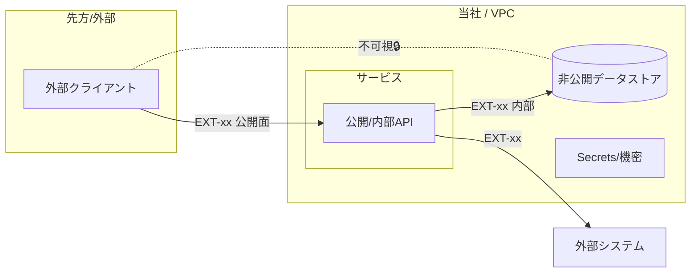

# 境界 — {システム名}の信頼境界

> **目的**: システムの**信頼境界**と**データの可視性**を示す。誰から何が見えるか（先方不可視・VPC内・外部公開）と、境界ごとの認証・制御を固定する。
> **書き方**:（記入例は example-suido-fax の対応ファイル参照）実データは書かず、境界と制御方式のみ設計面で記す。最重要の非公開データ（🔒）と外部公開面（攻撃面）を必ず明示する。構成要素は `01_構成要素.md`。

## 目次
1. [全体境界図（論理）](#1-全体境界図論理)
2. [信頼境界一覧](#2-信頼境界一覧)
3. [データ可視性](#3-データ可視性)
4. [境界に効く前提](#4-境界に効く前提)

## 1. 全体境界図（論理）
> 📝 ここに相手（先方／自社／外部システム）ごとの境界とEXT-IDをMermaidで記載。非公開データは点線＋🔒で不可視を示す。%% ここに記載

## 2. 信頼境界一覧
> 📝 ここに各信頼境界と制御を記載。{境界（誰と誰の間）／相手／公開面／制御（認証・封じ込め）}

| 境界 | 相手 | 制御 |
|---|---|---|
|  |  |  |

## 3. データ可視性
> 📝 ここにデータごとの可視性方針を記載。特に**先方から構造的に不可視にすべき資産データ**を明記。{データ／所有／公開範囲／不可視化の手段}

| データ | 所有 | 公開範囲 | 可視性の制御 |
|---|---|---|---|
|  |  |  |  |

## 4. 境界に効く前提
> 📝 ここに境界設計の前提・注意点を記載。{公開エンドポイントの限定／内部完結の範囲／時系列は状態遷移で表す等}

- {前提1}
- {前提2}

> 関連: 構成要素＝`01_構成要素.md` / DFDの信頼境界節＝`03_データフロー.md` / 外部連携＝`04_外部連携.md`。
