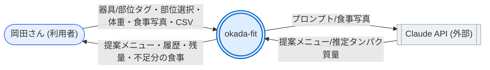
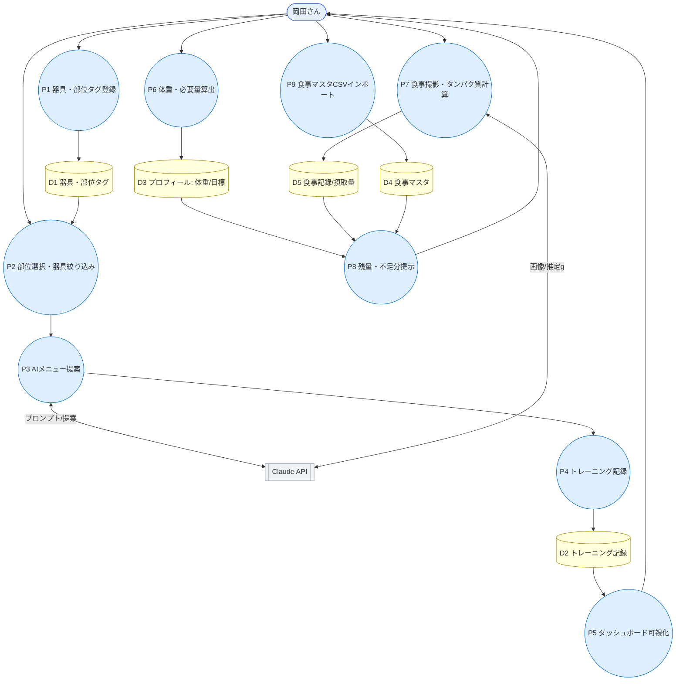

# データフロー（DFD） — okada-fit

> **目的**: システムの**静的な地図**（データがどこから来て・どう変換され・どこへ出るか）を Level0（コンテキスト）／Level1（主要プロセス）で示す。時系列の動きは扱わない。
> **書き方**:（記入例は example-suido-fax の対応ファイル参照）作図方針・記法凡例・チェックリストは本ファイル内に記載。**ビジネス（人・意思決定・成果）を第一級で含める**（利用者・承認者・経営などのアクターと業務上の意思決定/成果フロー）。時系列の動きはDFDでなくシーケンス図／`03_ドメインイベント.md` で。

## 目次
1. [記法凡例](#1-記法凡例)
2. [レベル0：コンテキストDFD](#2-レベル0コンテキストdfd)
3. [レベル1：主要プロセス＋データストア](#3-レベル1主要プロセスデータストア)
4. [データストア一覧](#4-データストア一覧)
5. [信頼境界](#5-信頼境界)

## 1. 記法凡例
> 📝 ここに本書で用いる記法を記載（`DFD_テンプレート.md §記法凡例` を踏襲）。{要素／意味／Mermaid形状}

| 要素 | 意味 | Mermaid形状（例） |
|---|---|---|
| 外部エンティティ | システム外の相手（人・組織・外部システム） | `([人/組織])` `[[外部システム]]` |
| プロセス | システム内の処理（P1, P2 …と採番） | `((処理))` |
| データストア | 保管場所（DB・ファイル・キュー） | `[(データストア)]` |
| データフロー | 流れる**業務データ**（矢印ラベルに明記） | `-- 業務データ -->` |

## 2. レベル0：コンテキストDFD
> 📝 ここにシステムを1プロセスに置いた全体像をMermaidで記載。**ビジネスの入出力**（利用者の入力・承認、経営の方針・KPI、成果レポート）を必ず含める。ラベルは業務データの意味で書く。%% ここに記載

## 3. レベル1：主要プロセス＋データストア
> 📝 ここにレベル0の1プロセスを主要プロセス（P1〜Pn）とデータストア（D1〜Dn）に分解して記載。プロセス間・ストアとのフローに業務データを明記。見づらければ主要な相手ごとに複数枚に分割する。%% ここに記載

## 4. データストア一覧
> 📝 ここに登場するデータストアを記載。物理DB・DMと対応づける。{ID／データストア／物理／所有・公開／主内容／対応DM-ID}

| ID | データストア | 物理 | 所有/公開 | 主内容 | 対応DM |
|---|---|---|---|---|---|
| D1 | 器具・部位タグ | Supabase/PostgreSQL `[仮]` | 岡田さん/非公開 | 器具、部位タグ（胸/背中/脚/肩/腕） | （記入）<!-- TODO:aic --> |
| D2 | トレーニング記録 | 同上 | 岡田さん/非公開 | 実施日・部位・器具・回数・重量・メニュー | （記入）<!-- TODO:aic --> |
| D3 | プロフィール | 同上 | 岡田さん/非公開 | 体重、必要タンパク質量、目標ログイン回数 | （記入）<!-- TODO:aic --> |
| D4 | 食事マスタ | 同上 | 岡田さん/非公開 | 食品名・タンパク質量・分量（CSV由来） | （記入）<!-- TODO:aic --> |
| D5 | 食事記録/摂取量 | 同上 | 岡田さん/非公開 | 撮影日時・推定タンパク質量・当日摂取合計 | （記入）<!-- TODO:aic --> |

> ⚠️ 要確認（人間判断）: 詳細なデータモデル（DM-ID・正規化・リレーション）は `30_データ・IF設計/01_データモデル.md`（設計PR2）で確定。

## 5. 信頼境界
> 📝 ここにDFD上の信頼境界を記載（詳細は `02_境界.md`）。{境界／相手／制御}。非公開データ（先方不可視🔒）は必ず注記。

| 境界 | 相手 | 制御 |
|---|---|---|
| ブラウザ ↔ アプリ | 岡田さん | HTTPS・認証 `[仮]`（DEC-D03） |
| アプリ ↔ Claude | 外部API | サーバ側呼び出し・APIキーはSecrets🔒。食事写真を外部送信（DEC-D04） |
| アプリ ↔ DB | Supabase | 非公開接続🔒 |

> 関連: 構成要素＝`01_構成要素.md` / 信頼境界の詳細＝`02_境界.md` / 外部連携＝`04_外部連携.md`。
