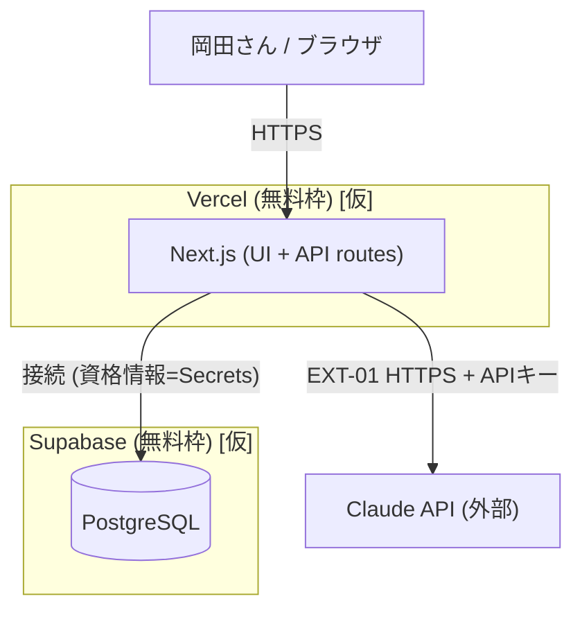

# システム構成・環境 — okada-fit

> **目的**: 稼働環境のインフラ構成（構成図）・環境（dev/stg/prod）・ネットワークを固定し、どこで・どう動くかを実装/運用が迷わない粒度で示す。
> **書き方**:（記入例は example-suido-fax の対応ファイル参照）実データ（実IP・実ホスト名・鍵）は書かず、`{ }` を自プロジェクトの語に置き換える。技術選定は `10_システム基本設計/05_技術選定.md`、可用性要件は NFR-AVAIL（`01_要件定義/04_非機能要件.md`）を正とし矛盾させない。IaC・デプロイ・冗長化配置は `02_IaC・デプロイ・可用性配置.md` を参照。

## 目次
1. [システム構成図](#1-システム構成図)
2. [環境一覧（dev/stg/prod）](#2-環境一覧devstgprod)
3. [ネットワーク](#3-ネットワーク)

## 1. システム構成図
> 📝 ここにインフラ構成をMermaidで記載。コンピュート／データストア／外部連携／境界（VPC・サブネット）を示す。ノードラベルに特殊文字（`(` 等）を含む場合は `["..."]` で引用する。%% ここに記載（実データは書かない）

> ※ マネージドPaaS（Vercel/Supabase）を採用するため、自前のVPC/サブネット/ロードバランサは持たない `[仮]`。

## 2. 環境一覧（dev/stg/prod）
> 📝 ここに環境ごとの用途・差異を記載。{環境／用途／規模・スペック／データ（本番相当かマスキングか）／外部連携（本番/サンドボックス）／アクセス制限}。環境間の差異が一目で分かるように。

| 環境 | 用途 | 規模/スペック | データ | 外部連携 | アクセス制限 |
|---|---|---|---|---|---|
| dev | 開発 | ローカル / Vercel Preview・Supabase無料プロジェクト(dev) `[仮]` | ダミー | Claude（開発用APIキー） | 本人のみ |
| stg | 検証 | ⚠️ 要確認: 個人アプリのため省略可（dev/prodの2環境） | — | — | — |
| prod | 本番 | Vercel本番・Supabase無料プロジェクト(prod) `[仮]` | 本番（岡田さん本人のデータ） | Claude（本番APIキー） | 認証済み本人のみ `[仮]`（DEC-D03） |

> ⚠️ 要確認（人間判断）: 環境は dev/prod の2つで足りるか（stgの要否）。無料枠の制約（プロジェクト数・スリープ等）も併せて確認。

## 3. ネットワーク
> 📝 ここにネットワーク構成を記載。{VPC・サブネット構成（公開/非公開）／インバウンド・アウトバウンドの許可経路／外部連携の経路（固定IP・許可リスト）／DNS・証明書／内部通信の暗号化}。攻撃面（NFR-SEC）と整合させる。

| 項目 | 方針 |
|---|---|
| サブネット構成 | マネージドPaaSのため自前VPCなし `[仮]`。ネットワーク分離はVercel/Supabaseに委譲 |
| インバウンド許可 | Webアプリ（HTTPS/443）のみ公開。DB・Claudeへの直接公開なし |
| アウトバウンド許可 | サーバ→Claude API（HTTPS）、サーバ→Supabase（HTTPS/DB接続） |
| DNS/証明書 | Vercel提供のドメイン・TLS証明書を利用 `[仮]`。独自ドメインは任意 |
| 内部通信の暗号化 | アプリ↔DB、アプリ↔ClaudeはいずれもTLS |

> ⚠️ 要確認（人間判断）: 非機能要件（`../01_要件定義/04_非機能要件.md` NFR-SEC 等）が未作成のため、攻撃面・セキュリティ要件との突合は非機能要件の作成後に行う。

> 関連: 技術選定＝`10_システム基本設計/05_技術選定.md` / 可用性要件＝`01_要件定義/04_非機能要件.md`（NFR-AVAIL） / 攻撃面＝`01_要件定義/04_非機能要件.md`（NFR-SEC）。
