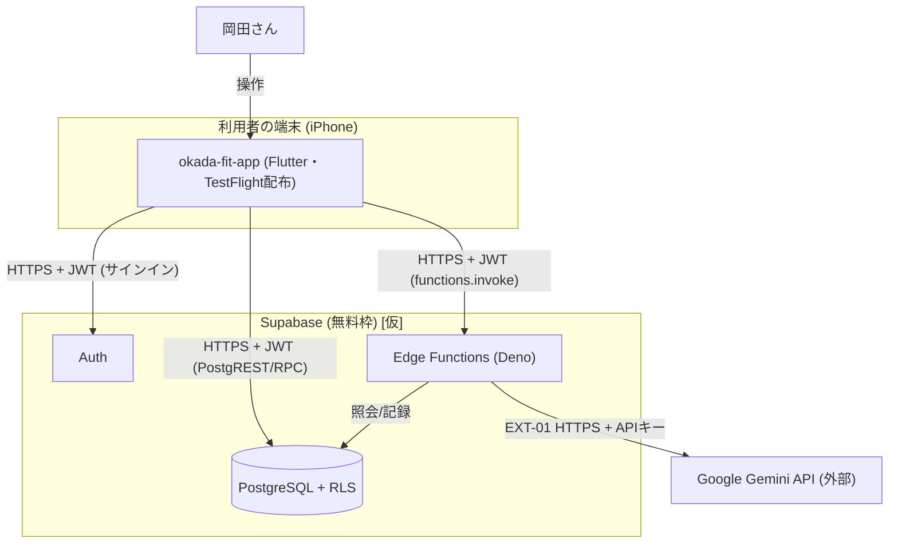

# システム構成・環境 — okada-fit

> **目的**: 稼働環境のインフラ構成（構成図）・環境（dev/stg/prod）・ネットワークを固定し、どこで・どう動くかを実装/運用が迷わない粒度で示す。
> **書き方**:（記入例は example-suido-fax の対応ファイル参照）実データ（実IP・実ホスト名・鍵）は書かず、`{ }` を自プロジェクトの語に置き換える。技術選定は `10_システム基本設計/05_技術選定.md`、可用性要件は NFR-AVAIL（`01_要件定義/04_非機能要件.md`）を正とし矛盾させない。IaC・デプロイ・冗長化配置は `02_IaC・デプロイ・可用性配置.md` を参照。

## 目次
1. [システム構成図](#1-システム構成図)
2. [環境一覧（dev/stg/prod）](#2-環境一覧devstgprod)
3. [ネットワーク](#3-ネットワーク)

## 1. システム構成図
> 📝 ここにインフラ構成をMermaidで記載。コンピュート／データストア／外部連携／境界（VPC・サブネット）を示す。ノードラベルに特殊文字（`(` 等）を含む場合は `["..."]` で引用する。%% ここに記載（実データは書かない）

> ※ マネージドBaaS（Supabase）を採用するため、自前のVPC/サブネット/ロードバランサは持たない（ADR-0004）。
> ※ **Webホスティング環境を持たない。** アプリは利用者の端末で動き、配布は TestFlight で行う。
> ※ iPhone（iOS先行）は ADR-0010 で確定。Supabase の料金プランは未確定のため `[仮]` を残す。

## 2. 環境一覧（dev/stg/prod）
> 📝 ここに環境ごとの用途・差異を記載。{環境／用途／規模・スペック／データ（本番相当かマスキングか）／外部連携（本番/サンドボックス）／アクセス制限}。環境間の差異が一目で分かるように。

環境の単位は **Supabase プロジェクト**。環境ごとにプロジェクトを分ける（`50_詳細設計/06_DB設計規約.md §5`）。

| 環境 | 用途 | 規模/スペック | データ | 外部連携 | アクセス制限 |
|---|---|---|---|---|---|
| dev | 開発 | ローカル Supabase（`supabase start`）／ Supabase無料プロジェクト(dev) | ダミー | Gemini API（開発用APIキー） | 本人のみ |
| stg | 検証 | ⚠️ 要確認: 個人アプリのため省略可（dev/prodの2環境） | — | — | — |
| prod | 本番 | Supabase無料プロジェクト(prod)。アプリは TestFlight 配布 | 本番（岡田さん本人のデータ） | Gemini API（本番APIキー） | 認証済み本人のみ（DEC-D03・ADR-0004） |

環境で切り替わる値は次の3つ。

| 値 | 置き場所 | 備考 |
|---|---|---|
| `SUPABASE_URL` / anon key | アプリのビルド時引数（`--dart-define`）`[仮]` | anon key は公開鍵。秘匿目的ではなく接続先の切替 |
| `GEMINI_API_KEY` / `GEMINI_MODEL` | Supabase の Function Secrets🔒 | 環境ごとに別のキーを使う |
| DBスキーマ | `supabase/migrations/`（git管理） | 同じマイグレーションを dev → prod の順に適用 |

- 環境名は DBオブジェクト名・テーブル名に含めない。環境差はプロジェクト分離で表す。
- **アプリのビルドは prod 用と dev 用で分かれる。** 接続先を実行時に切り替えない `[仮]`。

> ⚠️ 要確認（人間判断）: 環境は dev/prod の2つで足りるか（stgの要否）。無料枠の制約（プロジェクト数・スリープ等）も併せて確認。

> ⚠️ 要確認（人間判断）: dev 環境のアプリをどう端末に入れるか。
> 案は2つ。(1) Xcode から実機に直接インストールする、(2) TestFlight の別ビルドを配る。
> 実機のカメラ（FEAT-08）・通知の検証には実機が要る。

## 3. ネットワーク
> 📝 ここにネットワーク構成を記載。{VPC・サブネット構成（公開/非公開）／インバウンド・アウトバウンドの許可経路／外部連携の経路（固定IP・許可リスト）／DNS・証明書／内部通信の暗号化}。攻撃面（NFR-SEC）と整合させる。

| 項目 | 方針 |
|---|---|
| サブネット構成 | マネージドBaaSのため自前VPCなし（ADR-0004）。ネットワーク分離は Supabase に委譲 |
| インバウンド許可 | **自前の公開エンドポイントを持たない。** 公開面は Supabase の API（HTTPS/443）のみ |
| アウトバウンド許可 | アプリ→Supabase（HTTPS）、Edge Function→Google Gemini API（HTTPS） |
| DNS/証明書 | Supabase が発行するプロジェクトドメイン・TLS証明書を利用 `[仮]`。独自ドメインは持たない |
| 内部通信の暗号化 | アプリ↔Supabase、Edge Function↔Gemini API はいずれもTLS |
| 端末の扱い | 端末は信頼境界の外。到達を止める仕組みは持たず、RLSで行を絞る（`10_システム基本設計/02_境界.md §4`） |

> ⚠️ 要確認（人間判断）: 非機能要件（`../01_要件定義/04_非機能要件.md` NFR-SEC 等）が未作成のため、攻撃面・セキュリティ要件との突合は非機能要件の作成後に行う。

> 関連: 技術選定＝`10_システム基本設計/05_技術選定.md` / 可用性要件＝`01_要件定義/04_非機能要件.md`（NFR-AVAIL） / 攻撃面＝`01_要件定義/04_非機能要件.md`（NFR-SEC）。
