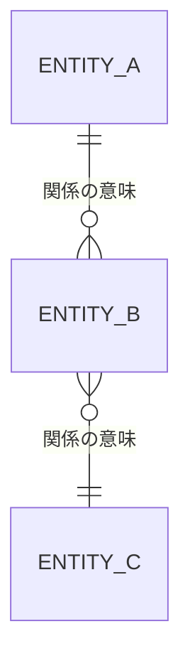
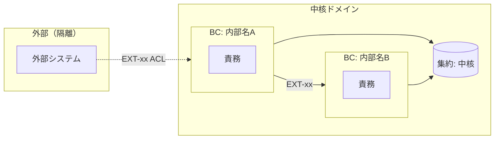

# データモデル（概念ERD＋ドメイン集約＋外部ACL/Port）

> **目的**: **概念モデル**（エンティティの関係と役割）と**ドメインモデル**（BC・集約・外部隔離）を1本に統合し、データの構造と一貫性境界を固定する。
> **書き方**:（記入例は example-suido-fax の対応ファイル参照）実データ・実DDLは書かず、概念表現にとどめる。列の詳細型・制約・enum全値は `50_詳細設計/01_DB物理設計.md` を、物理DDLも詳細設計を正本とする。中核集約と外部（ACL/Port）で隔離する相手を明示する。

## 目次
1. [概念エンティティ一覧](#1-概念エンティティ一覧)
2. [エンティティ関係図（概念・俯瞰図）](#2-エンティティ関係図概念俯瞰図)
3. [各エンティティの役割](#3-各エンティティの役割)
4. [BC一覧（境界づけられたコンテキスト）](#4-bc一覧境界づけられたコンテキスト)
5. [集約](#5-集約)
6. [外部隔離（ACL / Port）](#6-外部隔離acl--port)
7. [不変条件](#7-不変条件)

## 1. 概念エンティティ一覧
> 📝 ここにエンティティを記載。DM-ID を採番。{DM-ID／エンティティ（物理名＋和名）／業務上の役割／物理（DB種別）}

| DM-ID | エンティティ | 業務上の役割 | 物理 |
|---|---|---|---|
|  |  |  |  |

## 2. エンティティ関係図（概念・俯瞰図）
> 📝 ここに**概念ER（データ領域の全体像・俯瞰図）**を Mermaid erDiagram で記載。**エンティティ＝箱のみ（カラムは書かない）**、関係とカーディナリティで俯瞰する。分離境界（テナント等）と中核集約を中心に据える。**カラムレベルの物理ERD（型/PK/FK）は `../50_詳細設計/01_DB物理設計.md` の「全体ERD」を正**とし、本書には書かない（抽象度が別：本書＝概念/俯瞰、物理設計＝カラムレベル）。

## 3. 各エンティティの役割
> 📝 ここに各エンティティの概念的な役割を記載。{DM-ID／エンティティ／役割（概念）／主な関連}

| DM-ID | エンティティ | 役割（概念） | 主な関連 |
|---|---|---|---|
|  |  |  |  |

## 4. BC一覧（境界づけられたコンテキスト）
> 📝 ここにBC（境界づけられたコンテキスト）を記載。小規模ならサービス境界に沿って最小限に。{BC／内部名／責務（中核ドメイン）／保有・参照エンティティ／主なIF}

| BC | 内部名 | 責務（中核ドメイン） | 保有/参照エンティティ | 主なIF |
|---|---|---|---|---|
|  |  |  |  |  |

## 5. 集約
> 📝 ここに集約ルートと一貫性境界を記載。{集約が保持するもの（同一性・状態・冪等・外部連携キー等）／由来}

| 観点 | 集約が保持するもの | 由来 |
|---|---|---|
|  |  |  |

## 6. 外部隔離（ACL / Port）
> 📝 ここに外部システムを隔離するACL/Port方針を記載。外部ワイヤの都合（キー名・形式・状態語彙）を中核モデルに持ち込まない。{外部／隔離するBC／Port・ACLの責務／変換の要点}

| 外部 | 隔離するBC | Port/ACL の責務 | 変換の要点 |
|---|---|---|---|
|  |  |  |  |

## 7. 不変条件
> 📝 ここに中核ドメインが常に満たすべき不変条件を記載。{データ分離（RLS等）／一意性・冪等／状態機械のガード等}。詳細な状態機械・enumは `50_詳細設計/` と `03_ドメインイベント.md` を正本とする。

- {不変条件1}
- {不変条件2}

> 関連: 用語・命名の正本＝`../../01_要件定義/00_用語定義.md` / IF契約＝`02_API設計.md` / 状態イベント＝`03_ドメインイベント.md` / 物理DDL＝`50_詳細設計/01_DB物理設計.md`。
