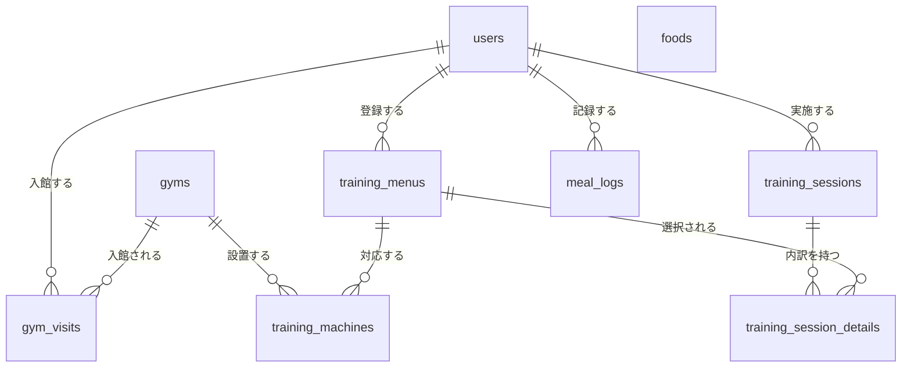
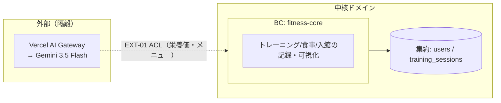

# データモデル（概念ERD＋ドメイン集約＋外部ACL/Port）

> **目的**: **概念モデル**（エンティティの関係と役割）と**ドメインモデル**（BC・集約・外部隔離）を1本に統合し、データの構造と一貫性境界を固定する。
> **書き方**:（記入例は example-suido-fax の対応ファイル参照）実データ・実DDLは書かず、概念表現にとどめる。列の詳細型・制約・enum全値は `50_詳細設計/01_DB物理設計.md` を、物理DDLも詳細設計を正本とする。中核集約と外部（ACL/Port）で隔離する相手を明示する。

> **出典**: 本モデルは岡田さんの手書きER図（2026-07-25・ホワイトボード）を落とし込んだもの。**カラムの詳細型・制約・PK/FK の物理定義は `../50_詳細設計/01_DB物理設計.md` を正本**とし、本書は概念レベル（主要属性まで）にとどめる。

## 目次
1. [概念エンティティ一覧](#1-概念エンティティ一覧)
2. [エンティティ関係図（概念・俯瞰図）](#2-エンティティ関係図概念俯瞰図)
3. [各エンティティの役割](#3-各エンティティの役割)
4. [BC一覧（境界づけられたコンテキスト）](#4-bc一覧境界づけられたコンテキスト)
5. [集約](#5-集約)
6. [外部隔離（ACL / Port）](#6-外部隔離acl--port)
7. [不変条件](#7-不変条件)
8. [敵対的検証・要確認事項](#8-敵対的検証要確認事項)

## 1. 概念エンティティ一覧
> 📝 ここにエンティティを記載。DM-ID を採番。{DM-ID／エンティティ（物理名＋和名）／業務上の役割／物理（DB種別）}

| DM-ID | エンティティ（物理名＋和名） | 業務上の役割 | 物理 |
|---|---|---|---|
| DM-01 | `users`（ユーザー） | 岡田さん本人。体重・目標トレーニング回数を保持 | PostgreSQL |
| DM-02 | `gyms`（ジム） | 通うジム。マシン数を保持 | PostgreSQL |
| DM-03 | `gym_visits`（入館履歴） | ジムに入館した記録（いつ・どのジムに行ったか） | PostgreSQL |
| DM-04 | `training_menus`（トレーニングメニュー） | 種目マスタ。部位・やり方を保持 | PostgreSQL |
| DM-05 | `training_machines`（トレーニングマシーン） | マシン（器具）マスタ。ジム内に設置され、トレーニングメニュー（種目）に対応（FEAT-01/02） | PostgreSQL |
| DM-06 | `training_sessions`（トレーニング履歴） | ある日に実施したトレーニングの記録 | PostgreSQL |
| DM-07 | `training_session_details`（トレーニング明細） | そのトレーニングで各メニューを実行したか（実行済フラグ） | PostgreSQL |
| DM-08 | `meal_logs`（食事履歴） | 食事撮影で得た栄養価（カロリー/タンパク質/糖質/脂質の4項目）の記録（FEAT-08） | PostgreSQL |
| DM-09 | `foods`（食品） | 不足分提示用の食品マスタ（タンパク質量） | PostgreSQL |

## 2. エンティティ関係図（概念・俯瞰図）
> 📝 ここに**概念ER（データ領域の全体像・俯瞰図）**を Mermaid erDiagram で記載。**エンティティ＝箱のみ（カラムは書かない）**、関係とカーディナリティで俯瞰する。分離境界（テナント等）と中核集約を中心に据える。**カラムレベルの物理ERD（型/PK/FK）は `../50_詳細設計/01_DB物理設計.md` の「全体ERD」を正**とし、本書には書かない（抽象度が別：本書＝概念/俯瞰、物理設計＝カラムレベル）。

> 注: `foods`（食品マスタ）は不足分提示（FEAT-09）に使うマスタで、`meal_logs` とはFKで繋がない（食事の栄養価はAIが直接算出するため。手書き元図でも線なし＝独立）。

## 3. 各エンティティの役割
> 📝 ここに各エンティティの概念的な役割を記載。{DM-ID／エンティティ／役割（概念）／主な関連}

主要属性は手書き元図に基づく概念レベル。**詳細型・制約は `50_詳細設計/01_DB物理設計.md` を正本**とする。

| DM-ID | エンティティ | 役割（概念）／主要属性 | 主な関連 |
|---|---|---|---|
| DM-01 | `users` | 本人。`name` / `目標トレーニング回数` / `体重` | 全履歴の所有者 |
| DM-02 | `gyms` | 通うジム。`name`（ジム名）。※`machine`は削除（個々のマシンは`training_machines`・§8-6解決） | 入館履歴・マシンを持つ |
| DM-03 | `gym_visits` | 入館記録。`日付` / `時間` / `user_id`(FK) / `gym_id`(FK) | users・gyms に属する |
| DM-04 | `training_menus` | 種目マスタ。`部位` / `name` / `やり方` / `user_id`(FK) | シーン・明細から参照 |
| DM-05 | `training_machines` | マシン（器具）マスタ。`name`（マシン名） / `menu_id`(FK) / `gym_id`(FK) | menus・gyms に属する |
| DM-06 | `training_sessions` | ある日のトレーニング。`実行日` / `user_id`(FK)。※種目は明細側で保持（§8-9解決で`menu_id`は持たない） | 明細を持つ |
| DM-07 | `training_session_details` | トレーニングの内訳。`session_id`(FK) / `menu_id`(FK) / `実行済`(boolean) | sessions・menus に属する |
| DM-08 | `meal_logs` | 食事記録。**栄養4項目**（`calories_kcal` / `protein_g` / `sugar_g` / `fat_g`）/ `摂取した日` / `摂取時間` / `user_id`(FK) / `摂取数`。**画像は保持しない（ADR-0003）** | users に属する |
| DM-09 | `foods` | 食品マスタ。`たんぱく質量` / `name` | 独立（不足分提示・FEAT-09） |

## 4. BC一覧（境界づけられたコンテキスト）
> 📝 ここにBC（境界づけられたコンテキスト）を記載。小規模ならサービス境界に沿って最小限に。{BC／内部名／責務（中核ドメイン）／保有・参照エンティティ／主なIF}

個人開発・単一Webアプリのため、中核は単一BCとする。

| BC | 内部名 | 責務（中核ドメイン） | 保有/参照エンティティ | 主なIF |
|---|---|---|---|---|
| フィットネス記録 | fitness-core | トレーニング・食事・入館の記録と可視化 | DM-01〜09すべて | EXT-01（AI Gateway・栄養価/メニュー生成） |

## 5. 集約
> 📝 ここに集約ルートと一貫性境界を記載。{集約が保持するもの（同一性・状態・冪等・外部連携キー等）／由来}

| 観点 | 集約が保持するもの | 由来 |
|---|---|---|
| ユーザー集約（root: `users`） | 本人の同一性、体重・目標。各履歴の所有境界（user_id） | DM-01 |
| トレーニング集約（root: `training_sessions`） | ある日のトレーニングと明細（`training_session_details`）の一貫性 | DM-06/07 |
| 食事記録（`meal_logs`） | 撮影1回＝1レコード。栄養価のみ保持（画像は非保持） | DM-08・ADR-0003 |

## 6. 外部隔離（ACL / Port）
> 📝 ここに外部システムを隔離するACL/Port方針を記載。外部ワイヤの都合（キー名・形式・状態語彙）を中核モデルに持ち込まない。{外部／隔離するBC／Port・ACLの責務／変換の要点}

| 外部 | 隔離するBC | Port/ACL の責務 | 変換の要点 |
|---|---|---|---|
| Vercel AI Gateway（EXT-01） | fitness-core | 食事画像→栄養価、部位＋器具→メニュー生成を呼び出し、結果を中核モデルの語彙へ変換 | AIの構造化出力のうち**栄養4項目**（`calories_kcal`/`protein_g`/`sugar_g`/`fat_g`）を `meal_logs` に保存。`dish_names`（料理名）は表示用で保存しない。画像はモデルに送るのみで永続化しない（ADR-0003） |

## 7. 不変条件
> 📝 ここに中核ドメインが常に満たすべき不変条件を記載。{データ分離（RLS等）／一意性・冪等／状態機械のガード等}。詳細な状態機械・enumは `50_詳細設計/` と `03_ドメインイベント.md` を正本とする。

- 全履歴（`gym_visits`/`training_sessions`/`meal_logs`/`training_menus`）は `user_id` で本人に紐づく（将来のマルチユーザー化・RLSに備えた分離キー）。
- `meal_logs` は**食事写真を保持しない**（解析後に破棄・ADR-0003）。栄養価の数値と日時のみを持つ。
- `training_session_details.実行済` は boolean。トレーニング実施の有無を表し、ダッシュボードのヒートマップ（実施有無の2値）の集計元となる。
- データ保持: 履歴系の**保持期間の制限は当面設けない**（全履歴を保持）。ダッシュボードの表示範囲（1ヶ月）はUI仕様であり、データ保持とは独立（2026-07-25 決定）。

## 8. 敵対的検証・要確認事項
> 本節は手書きER図を忠実に落とし込んだ上で、実装・詳細設計に進む前に確定すべき論点を洗い出したもの（CLAUDE.md「生成＋敵対的検証」）。**モデルは勝手に変更せず、指摘として提示**する。

| # | 論点 | 内容 | 重大度 |
|---|---|---|---|
| 1 | ~~器具マスタが無い~~（**撤回**） | 当初「器具マスタが無い」と誤指摘したが、`training_machines`（トレーニングマシーン）が器具マスタに該当。FEAT-02（部位→器具の絞り込み）は 部位→`training_menus`→`training_machines` の経路で辿れるため乖離なし。※ただし部位からマシンへの絞り込み経路が2ホップになる点は物理設計でインデックス等を要考慮 | — |
| 2 | ~~`meal_logs`が`protein`のみ~~（**解決**） | 岡田さん決定により **カロリー/タンパク質/糖質/脂質の4項目**を保持（PoCの構造化出力 `{calories_kcal, protein_g, sugar_g, fat_g}` と一致）。データモデル・物理設計に反映済み | — |
| 3 | ~~`training_session_details` のFK構成~~（**解決**） | `session_id`(FK)＋`menu_id`(FK)＋`is_done` の中間テーブルとして確定。`(session_id, menu_id)` を UNIQUE（50_物理設計に反映） | — |
| 4 | **`gyms.入館 FK` の意味** | 手書きの `gyms` に「入館 FK」とあるが、入館履歴→ジムのFKと方向が逆で意味が不明瞭。属性の要否を要確認 | 🟡 中 |
| 5 | ~~数値型（int vs float）~~（**解決**） | 岡田さん決定により栄養値は `float` を採用（小数対応）。meal_logsの4項目・foods.たんぱく質量に反映済み | — |
| 6 | ~~`gyms.machine` と `training_machines` の重複~~（**一部解決**） | `gyms.machine` は削除（個々のマシンは`training_machines`で表現）。`gyms` には `name` を追加。※`meal_logs.intake_count`（摂取数）の業務的意味は引き続き要確認 | 🟢 低 |
| 7 | ~~保持3ヶ月の削除方式~~（**撤回**） | 岡田さん決定により保持期間の制限（3ヶ月削除）は一旦なし。全履歴を保持するため自動削除の実装は不要 | — |
| 8 | **マルチユーザー対応（評価）** | `user_id` を各履歴が持つため、将来のマルチユーザー化（NFR-SCALE-01・Phase2）に構造的に対応済み。単一ユーザー運用でも整合的で問題なし（良い設計） | — |
| 9 | ~~`training_sessions.menu_id` の重複~~（**解決**） | `training_sessions` は `menu_id` を持たず、種目は `training_session_details.menu_id` で保持。ヒートマップの種目名は session→details→menus 経由で取得 | — |

> **次アクション**: 上記のうち #1（器具マスタ）・#7（保持削除）を優先的に確定し、確定後に `50_詳細設計/01_DB物理設計.md`（カラム型・制約・PK/FK・DDL）へ展開する。

> 関連: 用語・命名の正本＝`../../01_要件定義/00_用語定義.md` / IF契約＝`02_API設計.md` / 状態イベント＝`03_ドメインイベント.md` / 物理DDL＝`50_詳細設計/01_DB物理設計.md`。
