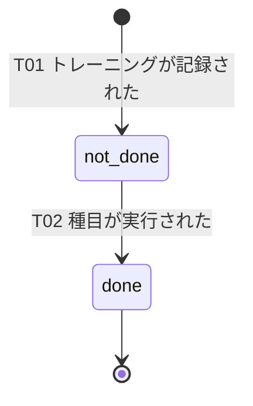

# ドメインイベント一覧 — okada-fit（トレーニング実施が中心）

> **目的**: 中核集約の状態遷移を、ドメインで起きた事実＝**「〜された」イベント**として一覧化する。各イベントは**状態遷移のトリガ**であり、トリガ（何が起きたか）・状態遷移（ST）・発生元BC・後続処理を対応づける。
> **書き方**:（記入例は example-suido-fax の対応ファイル参照）実データは書かず、イベント名（過去形「〜された」）／発火タイミング／後続処理の枠を用意する。実装の状態機械・enumは `50_詳細設計/`・要件定義の状態一覧を、集約の整理は `01_データモデル.md` を正本とする。

> 本システムは記録中心で**複雑な状態機械を持たない**。明確な永続状態は `training_session_details.is_done`（未実行/実行済）のみ。他（食事解析・入館・CSV取込）は状態を持たない一過性の記録イベントとして扱う。

## 目次
1. [状態（ST）とenum](#1-状態stとenum)
2. [ドメインイベント一覧](#2-ドメインイベント一覧)
3. [状態遷移図](#3-状態遷移図)
4. [イベントとERR/通知の対応](#4-イベントとerr通知の対応)

## 1. 状態（ST）とenum
> 📝 ここに集約の status enum を記載。{ST-ID／enum／表示名／説明}

| ST-ID | enum | 表示名 | 説明 |
|---|---|---|---|
| ST-01 | not_done | 未実行 | トレーニング明細の初期状態（`is_done=false`） |
| ST-02 | done | 実行済 | 実施をチェックした状態（`is_done=true`） |

## 2. ドメインイベント一覧
> 📝 ここにドメインイベントを記載。イベント名は過去形「〜された」で、**状態遷移のトリガ**として書く。{イベント（過去形）／遷移ID／状態遷移（ST-x→ST-y）／発火タイミング（トリガの事実）／後続処理／発生元BC}

| イベント（過去形） | 遷移ID | 状態遷移 | 発火タイミング（トリガ） | 後続処理 | 発生元BC |
|---|---|---|---|---|---|
| トレーニングが記録された | T01 | （新規）→ST-01 | セッション作成時に明細を `not_done` で登録（FEAT-04） | ヒートマップの実施有無に反映 | fitness-core |
| 種目が実行された | T02 | ST-01→ST-02 | 明細の実行済をチェック | ダッシュボード更新・保存完了トースト | fitness-core |
| 食事が解析・記録された | —（状態なし） | — | 撮影→AI Gateway→栄養4項目→`meal_logs`保存（FEAT-08） | 残量再計算（FEAT-09）・成功/失敗トースト | fitness-core |
| 入館が記録された | —（状態なし） | — | 入館記録（FEAT-04） | ヒートマップ補助 | fitness-core |
| 食事マスタが取り込まれた | —（状態なし） | — | CSVインポート（FEAT-10） | 取込結果トースト | fitness-core |

## 3. 状態遷移図
> 📝 ここに状態遷移をMermaid stateDiagramで記載。各遷移ラベルはトリガとなるイベントに対応。

> 食事解析・入館・CSV取込は状態を持たない一過性イベントのため本図に含めない（成功/失敗はトーストで通知）。

## 4. イベントとERR/通知の対応
> 📝 ここにイベントごとの関連ERR・通知条件を記載。ERRの完全列挙・通知条件は要件定義（状態・エラー一覧）を正本とする。{イベント／関連ERR／通知}

| イベント | 関連ERR | 通知 |
|---|---|---|
| 食事が解析・記録された | ERR-AI-CREDIT / ERR-AI-RATE / ERR-AI-TIMEOUT / ERR-AI-FAIL（§02_API設計 §5） | AI生成成功トースト／AI解析失敗トースト |
| トレーニングが記録された | ERR-VALIDATION-001 | 記録の保存完了トースト |
| 食事マスタが取り込まれた | ERR-VALIDATION-001 | CSVインポート結果トースト |
| （共通） | ERR-AUTH-001（未認証） | ログイン画面へ誘導 |

> 関連: 集約＝`01_データモデル.md` / IF契約＝`02_API設計.md` / 状態機械の正本＝要件定義（状態・エラー一覧）・`50_詳細設計/`。
