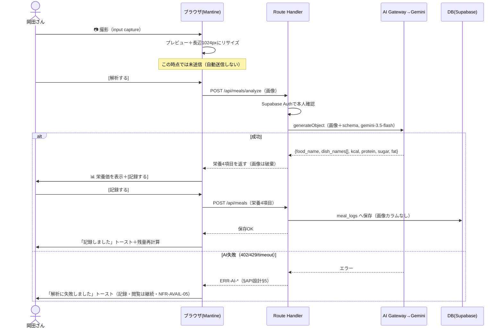
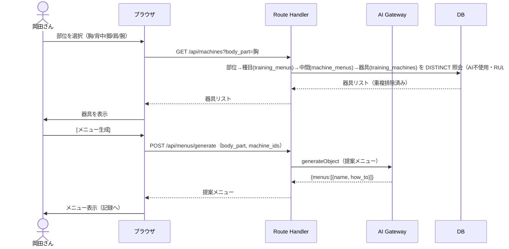
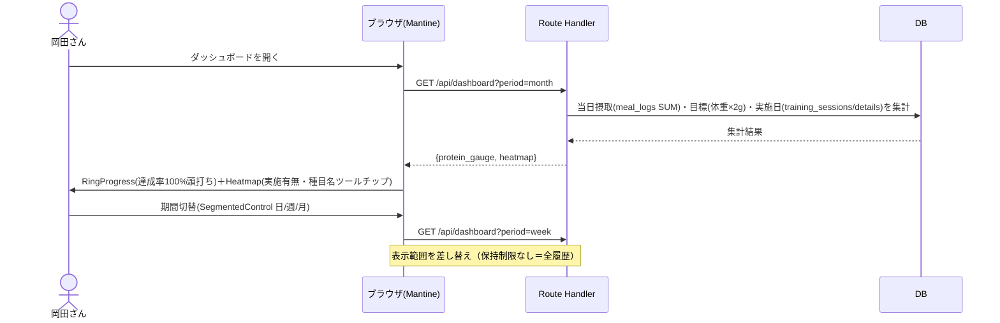
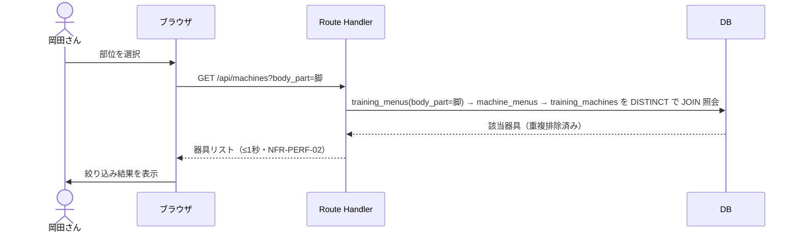
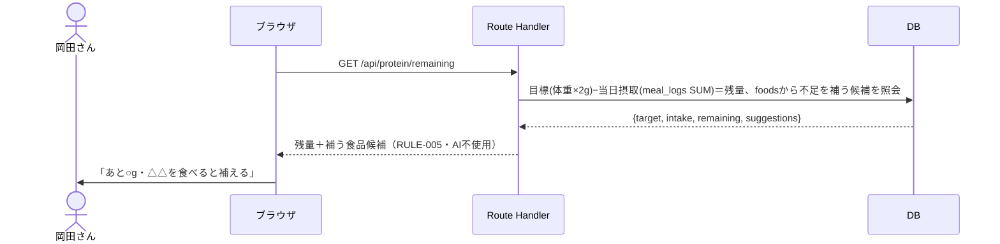

# 機能設計（FEAT別シーケンス） — okada-fit

> **目的**: 各機能要件（FEAT）の処理シーケンス（画面操作→サーバ→AI/DB→応答）を定義し、実装の振る舞いを固定する。API契約は `../30_データ・IF設計/02_API設計.md`、データは `01_データモデル.md`、状態は `03_ドメインイベント.md` を正本とし、本書はその**流れ**を担う。
> **書き方**: 実データは書かず、登場アクター（ブラウザ/サーバ/AI Gateway/DB）と主要メッセージ・分岐（正常/エラー/縮退）を Mermaid sequenceDiagram で示す。エラーは `02_API設計.md §5` の共通契約、状態は ST-ID を参照。

> ⚠️ **本書はたたき台（2026-07-25 生成）**。画面モック（SCR-01〜05）の人間承認と併せて確定する。

## 目次
1. [FEAT-08 食事撮影・タンパク質計算](#1-feat-08-食事撮影タンパク質計算)
2. [FEAT-03 AIメニュー提案](#2-feat-03-aiメニュー提案)
3. [FEAT-05 ダッシュボード表示](#3-feat-05-ダッシュボード表示)
4. [FEAT-02 部位→器具の絞り込み](#4-feat-02-部位器具の絞り込み)
5. [FEAT-09 タンパク質残量・不足分提示](#5-feat-09-タンパク質残量不足分提示)

## 1. FEAT-08 食事撮影・タンパク質計算
対応画面: SCR-04 食事記録 ／ API: `POST /api/meals/analyze`・`POST /api/meals`（EXT-01）／ 写真は非保存（ADR-0003）

- ローディング表示は最大20秒想定（NFR-PERF-04）。非冪等・自動リトライなし。
- 撮影→プレビュー→[解析する]→[記録する] の2ステップで、失敗写真の無駄な課金を防ぐ。

## 2. FEAT-03 AIメニュー提案
対応画面: SCR-03 トレーニング ／ API: `GET /api/machines?body_part=`・`POST /api/menus/generate`（EXT-01）

- 器具↔種目は多対多（中間テーブル `machine_menus`）。1台の器具が複数部位に対応する。
- 生成前の検証は「器具が指定部位の種目を1つ以上持つ」で判定する（部位の完全一致ではない）。

## 3. FEAT-05 ダッシュボード表示
対応画面: SCR-01 ダッシュボード ／ API: `GET /api/dashboard?period=month`

- 初期表示 ≤2秒（NFR-PERF-01）。チャートは `next/dynamic` で遅延ロード。

## 4. FEAT-02 部位→器具の絞り込み
対応画面: SCR-02 器具登録／SCR-03 ／ API: `GET /api/machines?body_part=`（AI不使用の決定的処理・RULE-004）

- 器具↔種目は多対多。中間テーブル `machine_menus` を必ず経由する。
- **`DISTINCT` が必須**。1台が同じ部位の種目を複数持つと、付けないと同じ器具が重複して返る。

## 5. FEAT-09 タンパク質残量・不足分提示
対応画面: SCR-01／SCR-04 ／ API: `GET /api/protein/remaining`（AI不使用・DB照会）

> 関連: API契約＝`../30_データ・IF設計/02_API設計.md` / データ＝`../30_データ・IF設計/01_データモデル.md` / 状態＝`../30_データ・IF設計/03_ドメインイベント.md` / 画面モック＝`../../01_要件定義/02_機能要件/02_画面/`（SCR-01〜05・人間承認ゲート）。
