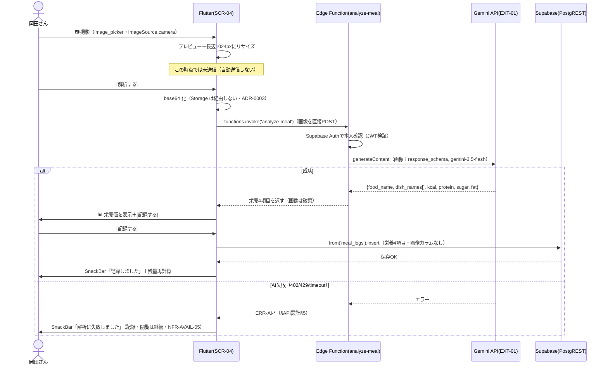
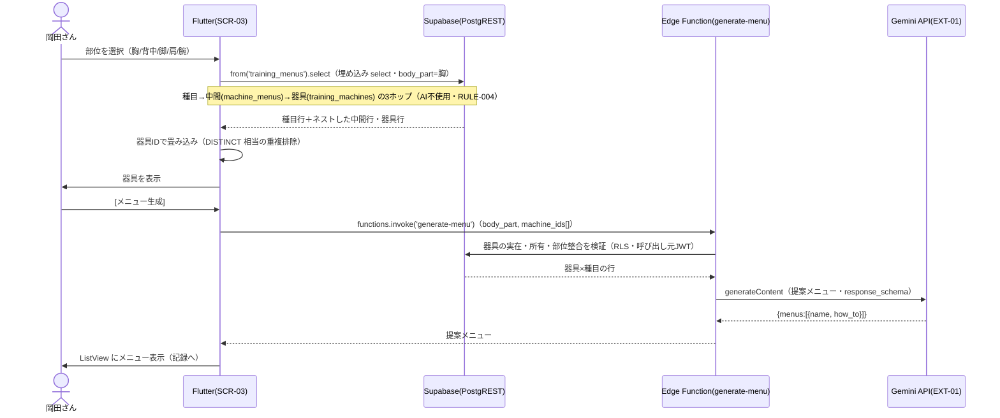
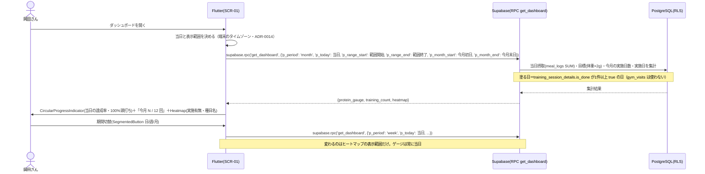
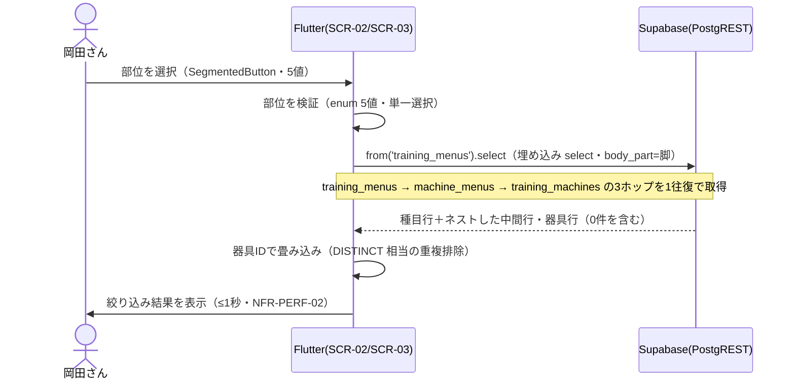
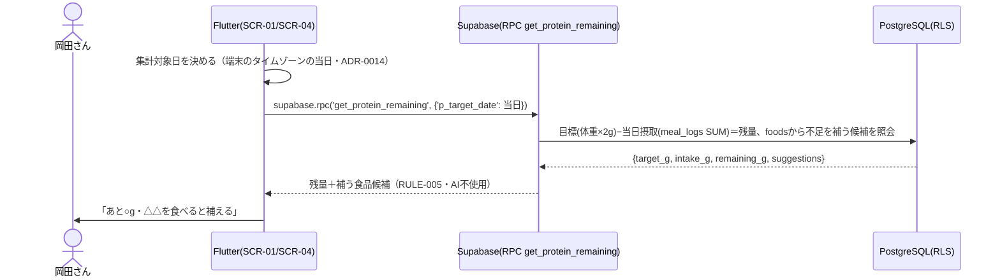

# 機能設計（FEAT別シーケンス） — okada-fit

> **目的**: 各機能要件（FEAT）の処理シーケンス（画面操作→サーバ→AI/DB→応答）を定義し、実装の振る舞いを固定する。API契約は `../30_データ・IF設計/02_API設計.md`、データは `01_データモデル.md`、状態は `03_ドメインイベント.md` を正本とし、本書はその**流れ**を担う。
> **書き方**: 実データは書かず、登場アクター（Flutter/Edge Function/Gemini API/Supabase）と主要メッセージ・分岐（正常/エラー/縮退）を Mermaid sequenceDiagram で示す。エラーは `02_API設計.md §5` の共通契約、状態は ST-ID を参照。

> ⚠️ **本書はたたき台（2026-07-25 生成）**。画面モック（SCR-01〜05）の人間承認と併せて確定する。

## 目次
1. [FEAT-08 食事撮影・タンパク質計算](#1-feat-08-食事撮影タンパク質計算)
2. [FEAT-03 AIメニュー提案](#2-feat-03-aiメニュー提案)
3. [FEAT-05 ダッシュボード表示](#3-feat-05-ダッシュボード表示)
4. [FEAT-02 部位→器具の絞り込み](#4-feat-02-部位器具の絞り込み)
5. [FEAT-09 タンパク質残量・不足分提示](#5-feat-09-タンパク質残量不足分提示)

## 1. FEAT-08 食事撮影・タンパク質計算
対応画面: SCR-04 食事記録 ／ 写真は非保存（ADR-0003）
API: `functions.invoke('analyze-meal')`（EXT-01）／ `from('meal_logs').insert(...)`

- 画像は Edge Function へ直接POSTする。Supabase Storage には置かない（ADR-0003）。
- Edge Function は業務テーブルに触れない。保存は Flutter から PostgREST で行う。
- ローディング表示は最大20秒想定（NFR-PERF-04）。非冪等・自動リトライなし。
- 撮影→プレビュー→[解析する]→[記録する] の2ステップで、失敗写真の無駄な課金を防ぐ。
- `meal_logs.eaten_date` は**端末の時刻で決めて渡す**（2026-08-08 確定・ADR-0014）。
- 記録するのは栄養4項目のみ。日次合計は `SUM(protein_g)` で導出する（列で持たない・ADR-0013）。
- 解析結果は表示のみで**手修正しない**（ADR-0015）。操作は［記録する］と［撮り直す］の2つ。
- 手入力の経路も持たない。AI が失敗した食事は**記録できない**（撮り直すか諦める）。

## 2. FEAT-03 AIメニュー提案
対応画面: SCR-03 トレーニング
API: `from('training_menus').select(...)`（器具取得）／ `functions.invoke('generate-menu')`（EXT-01）

- 器具↔種目は多対多（中間テーブル `machine_menus`）。1台の器具が複数部位に対応する。
- 絞り込みは3ホップ。器具の重複排除（`DISTINCT` 相当）が必ず要る（§4）。
- 生成前の検証は「器具が指定部位の種目を1つ以上持つ」で判定する（部位の完全一致ではない）。
- 検証NGなら Gemini API を呼ばない。無駄な課金を出さない。

## 3. FEAT-05 ダッシュボード表示
対応画面: SCR-01 ダッシュボード ／ API: RPC `get_dashboard`（引数は `p_period` / `p_today` / `p_range_start` / `p_range_end` / `p_month_start` / `p_month_end`）

- 初期表示 ≤2秒（NFR-PERF-01）。チャートは `fl_chart` で描画する。
- 集計はRPC1回で完結する。Flutter からの往復は期間切替のたびに1回。
- **ゲージ（`protein_gauge`）は常に当日**（2026-08-08 確定）。`p_period` の影響を受けない。
- 期間切替が変えるのはヒートマップの表示範囲だけ。週・月の平均や累積は取らない。
- **ヒートマップを塗る条件は `training_session_details.is_done` が1件以上 true**（2026-08-08 確定）。
- `training_sessions` の行があるだけでは塗らない。予定だけで未実施の日は塗らない。
- `gym_visits`（入館履歴）は使わない。ST-02（実行済）を持つ意味がここで生きる。
- 戻り値の `training_count` は「今月の実施日数（`done_days`）／目標回数（`target`）」。
- `done_days` はヒートマップと同じ条件で数える。`target` は `users.target_training_count`（既定12・RULE-007）。
- 体重が未設定なら `protein_gauge` は `null`。エラーにせず入力を促す表示に切り替える。
- 「当日」と「今月」の範囲は端末の時刻で決める（ADR-0014・`../50_詳細設計/07_実装共通設計パターン.md §2`）。

## 4. FEAT-02 部位→器具の絞り込み
対応画面: SCR-02 器具登録／SCR-03 ／ API: `from('training_menus').select(...)`（AI不使用の決定的処理・RULE-004）

- 器具↔種目は多対多。中間テーブル `machine_menus` を必ず経由する（**3ホップ**）。
- **`DISTINCT` が必須**。1台が同じ部位の種目を複数持つと、付けないと同じ器具が重複して返る。
- 埋め込み select 自体は `DISTINCT` を持たない。同じ役割を Flutter 側の畳み込みが担う。

## 5. FEAT-09 タンパク質残量・不足分提示
対応画面: SCR-01／SCR-04 ／ API: `supabase.rpc('get_protein_remaining', ...)`（AI不使用・DB照会）

- 残量が0なら `suggestions` は空配列。候補0件でもエラーにしない。
- SCR-04 で記録した直後にも同じRPCを呼び直す（§1 の残量再計算）。
- **集計対象日は端末の時刻で決める**（2026-08-08 確定・ADR-0014）。RPC 内で `CURRENT_DATE` を使わない。
- 残量が0に戻る（リセットされる）タイミングも端末時刻の日付変更に従う。
- 横断方針の正本は `../50_詳細設計/07_実装共通設計パターン.md §2`。
- `foods.protein_amount` は**1食分あたり**のため、残量(g)と直接比較できる（ADR-0012）。

> 関連: API契約＝`../30_データ・IF設計/02_API設計.md` / データ＝`../30_データ・IF設計/01_データモデル.md` / 状態＝`../30_データ・IF設計/03_ドメインイベント.md` / 画面モック＝`../../01_要件定義/02_機能要件/02_画面/`（SCR-01〜05・人間承認ゲート）。
