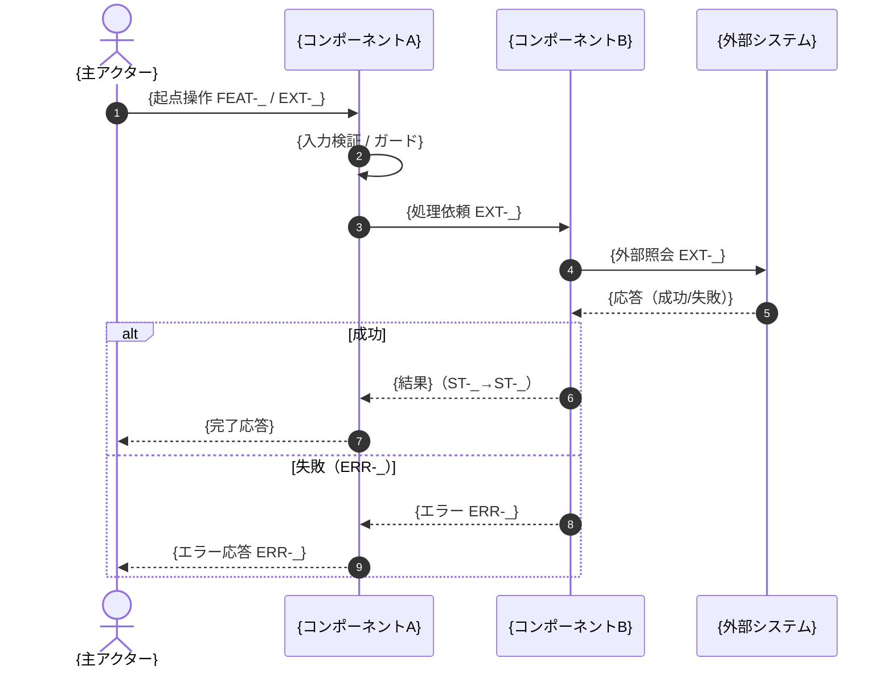

# シーケンス設計 — {機能名/ユースケース名}

> **目的**: 1つの機能（またはユースケース）の**設計視点の詳細フロー**を、コンポーネント間のシーケンス図とステップ詳細で固定する。要件視点の業務ジャーニーは `01_要件定義/03_ユースケース/` を正とし、本書は「どのコンポーネントが・どの順で・何を呼ぶか」を実装が迷わない粒度で示す。
> **書き方**:（記入例は example-suido-fax の対応ファイル参照）実データは書かず、`{ }` を自プロジェクトの語に置き換える。参照は必ずID（`FEAT-*`／`EXT-*`／`ST-*`／`ERR-*`）。コンポーネント名は `10_システム基本設計/01_構成要素.md`、IFは `30_データ・IF設計/02_API設計.md`、状態は `60_テスト設計/02_RED母集合_受入基準・状態・エラー.md` と一致させる。1ファイル＝1機能/ユースケース。

> 📖 ID（`FEAT-` `NFR-` `RULE-` 等）の意味は [ID早見表](../00_ID早見表.md) を参照。

## 目次
1. [対象・前提](#1-対象前提)
2. [登場コンポーネント](#2-登場コンポーネント)
3. [シーケンス図](#3-シーケンス図)
4. [ステップ詳細](#4-ステップ詳細)
5. [例外・分岐フロー](#5-例外分岐フロー)

## 1. 対象・前提
> 📝 ここに対象と前提を記載。{対象機能（FEAT-ID）／トリガ（起点イベント・IF）／前提状態（ST）／同期・非同期の別}

| 項目 | 内容 |
|---|---|
| 対象機能（FEAT） |  |
| トリガ（IF） |  |
| 前提状態（ST） |  |
| 同期/非同期 |  |

## 2. 登場コンポーネント
> 📝 ここにシーケンスに登場するコンポーネント（アクター含む）を記載。`10_システム基本設計/01_構成要素.md` の内部名と一致させる。{表示名／内部名／役割}

| 表示名 | 内部名 | 役割 |
|---|---|---|
| （記入） | （記入） | （記入） |

## 3. シーケンス図
> 📝 ここに設計視点のシーケンス図をMermaidで記載。コンポーネント間の呼び出し順・EXT-ID・状態遷移（ST）・分岐を明示する。ラベルに特殊文字を含む場合はノード/メッセージを簡潔に保つ。%% ここに記載（実データは書かない）

## 4. ステップ詳細
> 📝 ここに各ステップの詳細を記載。{#／呼び出し（From→To・EXT-ID）／処理内容／状態遷移（ST）／失敗時（ERR-ID）}。シーケンス図の autonumber と対応させる。

| # | 呼び出し（From→To / IF） | 処理内容 | 状態（ST） | 失敗時（ERR） |
|---|---|---|---|---|
| 1 | （記入） | （記入） | ST-_ | ERR-_ |
| 2 | （記入） | （記入） | ST-_→ST-_ | ERR-_ |

## 5. 例外・分岐フロー
> 📝 ここに主要な例外・分岐を記載。分岐の母集合は `60_テスト設計/02_RED母集合_受入基準・状態・エラー.md` のERR完全列挙を正とし、本書は発生ステップ・振る舞い・状態影響でまとめる。{例外／発生ステップ／関連ERR／システムの振る舞い／状態影響}

| 例外 | 発生ステップ | 関連ERR | 振る舞い | 状態影響（ST） |
|---|---|---|---|---|
| （記入） | （記入） | ERR-_ | （記入） | ST-_ |

> 関連: 要件視点のユースケース＝`01_要件定義/03_ユースケース/` / IF契約＝`30_データ・IF設計/02_API設計.md` / 状態イベント＝`30_データ・IF設計/03_ドメインイベント.md`。
