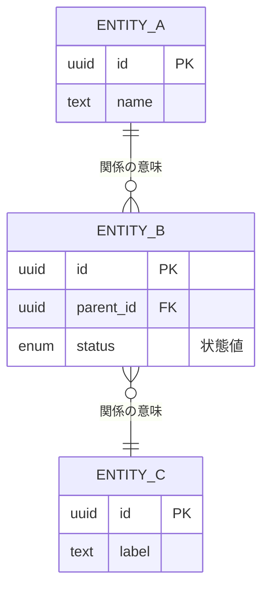

# DB物理設計（列定義・DDL・INDEX） — {システム名}

> **目的**: 論理データモデル（`30_データ・IF設計/01_データモデル.md`）と要件のデータ契約を、実装が迷わない**物理粒度**（列・型・NULL・制約・INDEX・FK・DDL）に具体化する。テーブルごとに1節で定義する。
> **書き方**:（記入例は example-suido-fax の対応ファイル参照）実データは書かず、`{ }` を自プロジェクトの語に置き換える。**列の詳細・enum全値・データ契約の正本はデータモデル側**とし、各項目 `[設計で確定]` は設計フェーズで確定させる枠（`../../意思決定_ADR/` 経由）。**本書は「全体ERD」（カラムレベル・型/PK/FK付き＝物理データモデル）とテーブル単位の列定義・DDLを担う**。概念/俯瞰ER（エンティティ＝箱のみ）は `30_データ・IF設計/01_データモデル.md §2` が正（抽象度が別）。

## 目次
- [全体ERD（カラムレベル・物理データモデル）](#全体erdカラムレベル物理データモデル)
1. [{テーブルA}](#1-テーブルa)
2. [{テーブルB} / {テーブルC}](#2-テーブルb--テーブルc)
3. [DDL・INDEX抜粋](#3-ddlindex抜粋)
4. [enum定義](#4-enum定義)

## 全体ERD（カラムレベル・物理データモデル）
> 📝 ここに**カラムレベルのER図（型/PK/FK付き）**を Mermaid erDiagram で記載。テーブル＝箱＋列で、関係・カーディナリティも付す。**概念/俯瞰ER（エンティティ＝箱のみ）は [`../30_データ・IF設計/01_データモデル.md §2`](../30_データ・IF設計/01_データモデル.md) が正**（抽象度が別：概念/俯瞰 ↔ 本書＝物理カラムレベル）。



## 1. {テーブルA} `[設計で確定]`
> 📝 ここに1テーブルの物理列定義を記載。**列 / 型 / NULL / 制約・既定 / 説明** を1列1行で。PK・FK・UNIQUE・CHECKを制約列に明示する。{列名／型／NULL可否／制約・既定／説明}

| 列 | 型 | NULL | 制約/既定 | 説明 |
|---|---|---|---|---|
| id |  | no | PK |  |
|  |  |  |  |  |

> 📝 ここに一意性・インデックス方針を記載。{自然キーのUNIQUE（部分ユニーク等）／resolve・検索用の複合INDEX（性能要件IDを併記）}

- 一意性: {UNIQUE制約の定義}
- インデックス: {複合INDEX・目的（性能要件 `NFR-__`）}

## 2. {テーブルB} / {テーブルC} `[設計で確定]`
> 📝 ここに関連する小テーブルをまとめて記載（テーブルごとに小見出し＋列定義表）。{テーブル名／列名／型／NULL可否／制約／説明}

**{テーブルB}**
| 列 | 型 | NULL | 制約 | 説明 |
|---|---|---|---|---|
| id |  | no | PK |  |
|  |  |  |  |  |

**{テーブルC}**
| 列 | 型 | NULL | 制約 | 説明 |
|---|---|---|---|---|
| id |  | no | PK |  |
|  |  |  |  |  |

## 3. DDL・INDEX抜粋
> 📝 ここに実装粒度のDDL（CREATE INDEX / ALTER TABLE ... CHECK / 部分ユニーク等）を記載。テナント分離（RLS）や関数射影など、列定義表に載らない物理設計もここに補足する。実データ値は書かない。

```sql
-- {テーブルA}: 一意性・検索INDEX
CREATE UNIQUE INDEX uq_{table}_{key} ON {table}({col1}, {col2}) WHERE {条件};
CREATE INDEX ix_{table}_{purpose}   ON {table}({col1}, {col2});   -- {目的（性能要件 NFR-__）}
-- 形式制約（CHECK・DEC-__）
ALTER TABLE {table} ADD CONSTRAINT ck_{col}
  CHECK ({col} IS NULL OR {col} ~ '{正規表現}');
```

- 追加列・派生列: {列名／用途}
- テナント分離（RLS・DEC-__）: {ポリシー方針／`SECURITY DEFINER`関数による1件射影など。正本は `30_データ・IF設計/01_データモデル.md`}

## 4. enum定義 `[設計で確定]`
> 📝 ここに本DBで使うenumの全値を列挙（表示名は別途日本語保持）。状態機械の正本は要件定義・`30_データ・IF設計/03_ドメインイベント.md`。{enum名／取り得る値}

- `{enum_a}`: `{VALUE_1}` / `{VALUE_2}` / `{VALUE_3}`
- `{enum_status}`: `{STATE_1}` / `{STATE_2}` / `{STATE_3}`（状態機械は要件定義／`30_データ・IF設計/03_ドメインイベント.md`）

> 関連: 概念/集約＝`30_データ・IF設計/01_データモデル.md` / バッチ＝`02_バッチ設計.md` / 外部連携のstatus写像＝`03_外部連携IF/README.md` / 物理ERD＝`30_データ・IF設計/02_索引`。
