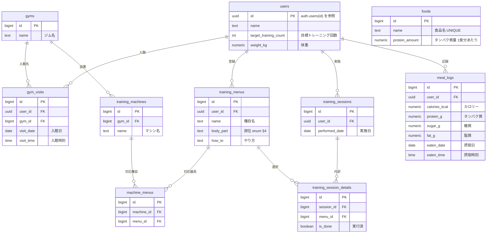

# DB物理設計（列定義・DDL・INDEX） — okada-fit

> **目的**: 論理データモデル（`30_データ・IF設計/01_データモデル.md`）と要件のデータ契約を、実装が迷わない**物理粒度**（列・型・NULL・制約・INDEX・FK・DDL）に具体化する。テーブルごとに1節で定義する。
> **書き方**:（記入例は example-suido-fax の対応ファイル参照）実データは書かず、`{ }` を自プロジェクトの語に置き換える。**列の詳細・enum全値・データ契約の正本はデータモデル側**とし、各項目 `[設計で確定]` は設計フェーズで確定させる枠（`../../意思決定_ADR/` 経由）。**本書は「全体ERD」（カラムレベル・型/PK/FK付き＝物理データモデル）とテーブル単位の列定義・DDLを担う**。概念/俯瞰ER（エンティティ＝箱のみ）は `30_データ・IF設計/01_データモデル.md §2` が正（抽象度が別）。

> ⚠️ **本書はたたき台（2026-07-25 生成／2026-08-08 改訂）**。岡田さんのレビューで最終確定する。
> 前提の既定値は次の5点。
> - `id` は `bigint` の自動採番（`GENERATED ALWAYS AS IDENTITY`）。例外は `users.id`（下記の2026-08-08 確定）
> - §8-9解決: `training_sessions` は `menu_id` を持たない。種目は `training_session_details` 側で保持する
> - §8-6解決: `gyms.machine` は削除。個々のマシンは `training_machines` で持つ
> - §8-3解決: `training_session_details` に `session_id`(FK) を持たせる中間テーブルとする
> - DB製品（DEC-B03）は PostgreSQL 前提。Supabase／Neon のどちらでも列定義は変わらない
>
> **2026-08-08 改訂（器具の複数部位対応）**: 1つの器具は1つ以上の部位に対応する。
> - 器具↔種目を**多対多**に変更した
> - 中間テーブル `machine_menus`（§1.6）を新設した
> - `training_machines.menu_id` を削除した（§1.4・§3）
> - `training_session_details.menu_id` は**変更なし**
>
> **2026-08-08 確定（A群スキーマ）**: `users.id` を uuid にして `auth.users(id)` を参照し（案A・ADR-0005）、各履歴の `user_id` も uuid にする。`foods.name` に UNIQUE（`uq_foods_name`）を張り、全FKの `ON DELETE`（§3.5）と RLS の3区分（§3.4）を確定した。
>
> **2026-08-08 確定（B群 業務判断）**: `meal_logs` の摂取数の列を削除し（§2.4・§3.1・ADR-0013）、`foods.protein_amount` を**1食分あたり**に確定した（§1.5・ADR-0012）。

> 📖 ID（`FEAT-` `NFR-` `RULE-` 等）の意味は [ID早見表](../00_ID早見表.md) を参照。

## 目次
- [全体ERD（カラムレベル・物理データモデル）](#全体erdカラムレベル物理データモデル)
1. [マスタ系テーブル](#1-マスタ系テーブル-設計で確定)
2. [履歴系テーブル](#2-履歴系テーブル-設計で確定)
3. [DDL・INDEX抜粋](#3-ddlindex抜粋)
4. [enum定義](#4-enum定義-設計で確定)

## 全体ERD（カラムレベル・物理データモデル）
> 📝 ここに**カラムレベルのER図（型/PK/FK付き）**を Mermaid erDiagram で記載。テーブル＝箱＋列で、関係・カーディナリティも付す。**概念/俯瞰ER（エンティティ＝箱のみ）は [`../30_データ・IF設計/01_データモデル.md §2`](../30_データ・IF設計/01_データモデル.md) が正**（抽象度が別：概念/俯瞰 ↔ 本書＝物理カラムレベル）。



**栄養値・体重の列型（2026-08-08 確定・ADR-0022）**

- 栄養値・体重は **`numeric(6,1)`**（ADR-0022・2026-08-08）。
- `float` は `0.1 + 0.2 = 0.30000000000000004` の誤差を出す。
- FEAT-09 は残量が 0 かどうかで表示を変えるため、**誤差が分岐に効く**。
- 精度は小数第1位まで。栄養表示の慣習に合わせた。

対象は6列。`users.weight_kg` / `meal_logs.calories_kcal` / `meal_logs.protein_g` / `meal_logs.sugar_g` / `meal_logs.fat_g` / `foods.protein_amount`。

- CHECK 制約（`> 0` / `>= 0`）と NULL 可否は変更しない。
- ER図では桁数を省略し `numeric` と表記する（正本は §1・§2 の列定義表）。
- `SUM()` の結果も `numeric` になる。集計側の型が揃う。
- **AI（EXT-01）の応答は小数第1位に丸めて保存する**（FEAT-08 §4）。

> ⚠️ 要確認（人間判断）: **`supabase_flutter` が `numeric` をどう返すか未確認（🟡 中）。**
> PostgreSQL の `numeric` は、ドライバによって**文字列で返る**ことがある。
> Dart 側で `double.parse` が要るかもしれない。
> **変換を1箇所に集約する**設計にしておき、実装初日に実挙動を確認する。

## 1. マスタ系テーブル `[設計で確定]`
> 📝 ここに1テーブルの物理列定義を記載。**列 / 型 / NULL / 制約・既定 / 説明** を1列1行で。PK・FK・UNIQUE・CHECKを制約列に明示する。{列名／型／NULL可否／制約・既定／説明}

`users.id` を除く全 `id` は `bigint GENERATED ALWAYS AS IDENTITY`（自動採番）。全テーブルに `created_at timestamptz not null default now()` を持たせる（監査用・下表では省略）。

`users.id` だけは uuid で、自動採番を持たない（§1.1）。これに伴い各履歴の `user_id` も uuid になる（§2）。

### 1.1 `users`（ユーザー）
| 列 | 型 | NULL | 制約/既定 | 説明 |
|---|---|---|---|---|
| id | uuid | no | PK, FK→auth.users(id) | **自動採番しない**。`auth.users.id` の値をそのまま入れる |
| name | text | no | | 表示名 |
| target_training_count | int | yes | CHECK(≥0) | 目標トレーニング回数（月） |
| weight_kg | numeric(6,1) | yes | CHECK(>0) | 体重(kg)。タンパク質目標＝体重×2g（DEC-B06）は算出 |

- 型: `id` は uuid（案A・ADR-0005）。`auth.users(id)` と同値のため RLS を `id = auth.uid()` の最短形で書ける（§3.4）
- 採番: 行は Supabase Auth のサインアップ時にトリガで作る（§3.1・FEAT-06 初期設定）。アプリから `id` を採番しない
- 一意性: PK が `auth.users(id)` と1対1に対応する。認証主体との紐付けはこれで一意になる（DEC-D03）
- 体重は**現在値1点のみ**を持つ。履歴テーブルは作らない（2026-08-08 確定・ADR-0009）

### 1.2 `gyms`（ジム）
| 列 | 型 | NULL | 制約/既定 | 説明 |
|---|---|---|---|---|
| id | bigint | no | PK, 自動採番 | |
| name | text | no | | ジム名（※手書きに無く追加。§8-6） |

- 所有: 共通マスタ。`user_id` を持たない（2026-08-08 確定）。RLS は §3.4 の「共通マスタ」区分
- 削除: `gym_visits.gym_id`・`training_machines.gym_id` が `NO ACTION` のため、履歴や器具が残るジムは削除できない（§3.5）

### 1.3 `training_menus`（トレーニングメニュー＝種目マスタ）
| 列 | 型 | NULL | 制約/既定 | 説明 |
|---|---|---|---|---|
| id | bigint | no | PK, 自動採番 | |
| user_id | uuid | no | FK→users(id) ON DELETE CASCADE | 所有者 |
| name | text | no | | 種目名 |
| body_part | text | no | CHECK(enum・§4) | 部位（胸/背中/脚/肩/腕・DEC-B04） |
| how_to | text | yes | | やり方メモ |

- 削除: `training_session_details.menu_id` の FK が `NO ACTION` のため、**履歴のある種目は物理削除できない**（2026-08-08 確定・ADR-0006・§3.5）
- 削除できるのは履歴を持たない種目だけ。`machine_menus` の対応行は CASCADE で同時に消える

### 1.4 `training_machines`（トレーニングマシーン＝器具マスタ）
| 列 | 型 | NULL | 制約/既定 | 説明 |
|---|---|---|---|---|
| id | bigint | no | PK, 自動採番 | |
| gym_id | bigint | no | FK→gyms(id) ON DELETE NO ACTION | 設置ジム |
| name | text | no | | マシン名 |

- 所有: 共通マスタ。`user_id` を持たない（2026-08-08 確定）。RLS は §3.4 の「共通マスタ」区分。
- 対応する種目は `machine_menus`（§1.6）で保持する。器具は複数の種目に対応でき、**部位は種目経由で複数になる**（2026-08-08 改訂）。
- `menu_id` は本表から削除した（旧: 種目への単一FK・NOT NULL）。器具の部位を1つに固定していた列のため（§3 の `ALTER TABLE ... DROP COLUMN`）。

### 1.5 `foods`（食品マスタ）
| 列 | 型 | NULL | 制約/既定 | 説明 |
|---|---|---|---|---|
| id | bigint | no | PK, 自動採番 | |
| name | text | no | UNIQUE（`uq_foods_name`） | 食品名。**正規化後の文字列を保存する** |
| protein_amount | numeric(6,1) | no | CHECK(≥0) | タンパク質量(g)。**1食分あたり**（ADR-0012）。不足分提示（FEAT-09） |

- 単位: **1食分あたりのグラム数**（2026-08-08 確定・ADR-0012）。100g あたり・1個あたりではない
- 「これを食べれば X g 取れる」という値。FEAT-09（タンパク質残量と不足分提示）の残量とそのまま比較できる
- 1食分の量は CSV の作成者が決める。DB は単位を検証しない（FEAT-10 食事マスタCSVインポート）
- 一意性: `name` を UNIQUE（`uq_foods_name`・§3.1）。同名の食品が二重に登録されるのを DB 側で防ぐ（2026-08-08 確定・ADR-0007）
- 正規化: 保存するのは**正規化後の文字列**。正規化は Flutter 側で行い、DB は正規化済みの値だけを受け取る（FEAT-10）
- 正規化の内容は「前後空白の除去／全角英数字→半角／英字→小文字／連続空白を1つへ」。カタカナの表記ゆれは吸収しない
- 所有: 共通マスタ。`user_id` を持たない（2026-08-08 確定）。RLS は §3.4 の「共通マスタ」区分
- 取込: `INSERT … ON CONFLICT (name) DO NOTHING` による追加＋重複スキップ方式（RPC `import_foods`・FEAT-10）

### 1.6 `machine_menus`（器具×種目）
| 列 | 型 | NULL | 制約/既定 | 説明 |
|---|---|---|---|---|
| id | bigint | no | PK, 自動採番 | |
| machine_id | bigint | no | FK→training_machines(id) ON DELETE CASCADE | 器具 |
| menu_id | bigint | no | FK→training_menus(id) ON DELETE CASCADE | 対応する種目 |

- 一意性: `(machine_id, menu_id)` を UNIQUE（`uq_mm_machine_menu`）。同一の組み合わせの重複行を防止
- 検索: `menu_id` に非一意INDEX（`ix_mm_menu`）。部位→種目→器具の絞り込み（FEAT-02 部位選択と器具絞り込み）で使う
- 器具の部位は本表を介して `training_menus.body_part` から導く。1台が複数部位を持てる
- 概念の正本は `../30_データ・IF設計/01_データモデル.md` の DM-10（machine_menus）

> ⚠️ 要確認（人間判断）: `machine_menus` の新設で挙げた3点のうち、#3 が未決のまま残る（#1・#2 は 2026-08-08 に確定）。

| # | 未決事項 | 何が問題か | 備考 |
|---|---|---|---|
| 1 | ~~**本表に `user_id` が無い**~~（**解決**） | ~~本人性は `menu_id`→`training_menus.user_id` 経由でしか担保できない~~ | RLS は「親経由」区分で確定（§3.4・DEC-D03）。述語は `training_menus` を辿る `EXISTS` にする |
| 2 | ~~**種目の削除時に本表の行も消す必要がある**~~（**解決**） | ~~`ON DELETE` 方針が全FKで未定~~ | `machine_menus` の2本のFKは `CASCADE` で確定（§3.5） |
| 3 | **器具に種目が0件の状態を許すか** | 許すとその器具は部位で引けず FEAT-02 の絞り込みに出ない | DB制約では「1件以上」を表現できない。許さないならアプリ側（FEAT-01）で担保する |

## 2. 履歴系テーブル `[設計で確定]`
> 📝 ここに関連する小テーブルをまとめて記載（テーブルごとに小見出し＋列定義表）。{テーブル名／列名／型／NULL可否／制約／説明}

### 2.1 `gym_visits`（入館履歴）
| 列 | 型 | NULL | 制約/既定 | 説明 |
|---|---|---|---|---|
| id | bigint | no | PK, 自動採番 | |
| user_id | uuid | no | FK→users(id) ON DELETE CASCADE | |
| gym_id | bigint | no | FK→gyms(id) ON DELETE NO ACTION | |
| visit_date | date | no | | 入館日 |
| visit_time | time | yes | | 入館時刻 |

### 2.2 `training_sessions`（トレーニング履歴）
| 列 | 型 | NULL | 制約/既定 | 説明 |
|---|---|---|---|---|
| id | bigint | no | PK, 自動採番 | |
| user_id | uuid | no | FK→users(id) ON DELETE CASCADE | |
| performed_date | date | no | | 実施日（ヒートマップの実施有無の集計元） |

> §8-9解決: 種目は本テーブルに持たず `training_session_details` 側で保持（1トレで複数種目のため）。

### 2.3 `training_session_details`（トレーニング明細）
| 列 | 型 | NULL | 制約/既定 | 説明 |
|---|---|---|---|---|
| id | bigint | no | PK, 自動採番 | |
| session_id | bigint | no | FK→training_sessions(id) ON DELETE CASCADE | 所属トレーニング（§8-3解決） |
| menu_id | bigint | no | FK→training_menus(id) ON DELETE NO ACTION | 実施種目 |
| is_done | boolean | no | 既定 false | 実行済フラグ |

- 一意性: `(session_id, menu_id)` を UNIQUE（同一トレで同一種目の重複行を防止）
- 本表は**実施有無（`is_done`）だけを持つ**。回数・重量は列を持たない（2026-08-08 確定・ADR-0008）
- `menu_id` の FK は `NO ACTION`。履歴のある種目の削除を DB 側で止める（ADR-0006・§3.5）
- 本人性は `session_id`→`training_sessions.user_id` 経由で判定する（§3.4 の「親経由」区分）

### 2.4 `meal_logs`（食事履歴）
| 列 | 型 | NULL | 制約/既定 | 説明 |
|---|---|---|---|---|
| id | bigint | no | PK, 自動採番 | |
| user_id | uuid | no | FK→users(id) ON DELETE CASCADE | |
| calories_kcal | numeric(6,1) | no | CHECK(≥0) | カロリー(kcal) |
| protein_g | numeric(6,1) | no | CHECK(≥0) | タンパク質(g) |
| sugar_g | numeric(6,1) | no | CHECK(≥0) | 糖質(g) |
| fat_g | numeric(6,1) | no | CHECK(≥0) | 脂質(g) |
| eaten_date | date | no | | 摂取日（端末TZでアプリが決めて渡す・ADR-0014） |
| eaten_time | time | yes | | 摂取時刻 |

> 食事写真・料理名は保持しない（ADR-0003）。AI出力の栄養4項目のみを保存。

- 摂取数の列は持たない（2026-08-08 確定・ADR-0013）。§3.1 の `ALTER TABLE` で削除した
- 日次のタンパク質合計は `SUM(protein_g)`（当日分）で導出する。列で持つと実データとずれるため
- 合計に係数を掛けない。FEAT-05（ダッシュボード）と FEAT-09 は同じ式で集計する

## 3. DDL・INDEX抜粋
> 📝 ここに実装粒度のDDL（CREATE INDEX / ALTER TABLE ... CHECK / 部分ユニーク等）を記載。テナント分離（RLS）や関数射影など、列定義表に載らない物理設計もここに補足する。実データ値は書かない。

### 3.1 DDL 抜粋

INDEX は **7本**（既存6本＋`uq_foods_name`）。テーブルは10本のまま。

| # | INDEX 名 | 対象 |
|---|---|---|
| 1 | `ix_gym_visits_user_date` | `gym_visits(user_id, visit_date)` |
| 2 | `ix_train_sessions_user_date` | `training_sessions(user_id, performed_date)` |
| 3 | `ix_meal_logs_user_date` | `meal_logs(user_id, eaten_date)` |
| 4 | `uq_tsd_session_menu` | `training_session_details(session_id, menu_id)` |
| 5 | `uq_mm_machine_menu` | `machine_menus(machine_id, menu_id)` |
| 6 | `ix_mm_menu` | `machine_menus(menu_id)` |
| 7 | `uq_foods_name` | `foods(name)`（2026-08-08 追加） |

```sql
-- users は auth.users を親に持つ（案A・ADR-0005・§1.1）
CREATE TABLE users (
  id                    uuid PRIMARY KEY REFERENCES auth.users(id) ON DELETE CASCADE,
  name                  text NOT NULL,
  target_training_count int  NULL CHECK (target_training_count >= 0),
  weight_kg             numeric(6,1) NULL CHECK (weight_kg > 0),
  created_at            timestamptz NOT NULL DEFAULT now()
);

-- サインアップ時に users 行を作る（FEAT-06・案a 確定）
CREATE FUNCTION handle_new_user() RETURNS trigger
LANGUAGE plpgsql SECURITY DEFINER AS $$
BEGIN
  INSERT INTO public.users (id, name)
  VALUES (NEW.id, COALESCE(NEW.raw_user_meta_data->>'name', ''));  -- [仮]
  RETURN NEW;
END; $$;

CREATE TRIGGER on_auth_user_created
AFTER INSERT ON auth.users
FOR EACH ROW EXECUTE FUNCTION handle_new_user();

-- 食品名の一意制約（ADR-0007・§1.5）。保存値は正規化済みの文字列
CREATE UNIQUE INDEX uq_foods_name ON foods(name);

-- ダッシュボード表示（NFR-PERF-01）用: user + 日付の複合INDEX
CREATE INDEX ix_gym_visits_user_date ON gym_visits(user_id, visit_date);
CREATE INDEX ix_train_sessions_user_date ON training_sessions(user_id, performed_date);
CREATE INDEX ix_meal_logs_user_date ON meal_logs(user_id, eaten_date);
-- 明細の重複防止
CREATE UNIQUE INDEX uq_tsd_session_menu ON training_session_details(session_id, menu_id);
-- 栄養値の非負制約（例）
ALTER TABLE meal_logs ADD CONSTRAINT ck_meal_nutrients
  CHECK (calories_kcal >= 0 AND protein_g >= 0 AND sugar_g >= 0 AND fat_g >= 0);
-- 部位のenum（CHECK方式。PostgreSQL CREATE TYPEでも可）
ALTER TABLE training_menus ADD CONSTRAINT ck_menu_body_part
  CHECK (body_part IN ('胸','背中','脚','肩','腕'));

-- 器具×種目の多対多（2026-08-08 改訂・§1.6）
CREATE TABLE machine_menus (
  id         bigint GENERATED ALWAYS AS IDENTITY PRIMARY KEY,
  machine_id bigint NOT NULL REFERENCES training_machines(id) ON DELETE CASCADE,
  menu_id    bigint NOT NULL REFERENCES training_menus(id) ON DELETE CASCADE,
  created_at timestamptz NOT NULL DEFAULT now()
);
CREATE UNIQUE INDEX uq_mm_machine_menu ON machine_menus(machine_id, menu_id);
CREATE INDEX ix_mm_menu ON machine_menus(menu_id);
-- 器具から種目への単一FKを削除（部位を1つに固定していた列・§1.4）
ALTER TABLE training_machines DROP COLUMN menu_id;

-- 摂取数の列を削除（合計は導出値・2026-08-08 確定・ADR-0013・§2.4）
ALTER TABLE meal_logs DROP COLUMN intake_count;
```

- `handle_new_user()` の `raw_user_meta_data` の読み方と `name` の既定値は `[仮]`。サインアップ画面の入力項目（FEAT-06 初期設定）で確定する。
- 上記の `CREATE TABLE users` は `users` のみ全文を載せる。他9表の列定義は §1・§2 の表が正本。

### 3.2 部位で器具を絞り込むクエリ（FEAT-02）

| 項目 | 内容 |
|---|---|
| 経路 | 部位 → `training_menus` → `machine_menus` → `training_machines` の3ホップ |
| 使うINDEX | `ix_mm_menu`（`machine_menus(menu_id)`） |
| 注意 | 1台の器具が同じ部位の種目を2つ以上持つと重複行が出る |
| 対策 | **`SELECT DISTINCT` が必須**。多対多化で新しく生じた注意点 |

### 3.3 監査列

| 対象 | 列 |
|---|---|
| 全テーブル | `created_at timestamptz not null default now()` |
| 更新頻度の高い表 | `updated_at` も検討する |

### 3.4 テナント分離（RLS・DEC-D03）

**本節がRLSポリシーの正本**（2026-08-08 確定・ADR-0005）。概念上の不変条件は `30_データ・IF設計/01_データモデル.md §7`、命名などの規約は `06_DB設計規約.md §4.1` を参照する。

前提は3つ。

| 項目 | 内容 |
|---|---|
| 有効化 | 全10表で `ALTER TABLE … ENABLE ROW LEVEL SECURITY` を必ず入れる |
| 本人ID | `auth.uid()`（uuid）。`users.id` と各 `user_id` が uuid なので直接比較できる |
| 対象ロール | `TO authenticated` を明示する。`anon` には権限を与えない（NFR-SEC-01） |

テーブルは3区分に分かれる。

| 区分 | テーブル | 述語 |
|---|---|---|
| **本人のみ** | `users` | `id = auth.uid()` |
| | `training_menus` / `gym_visits` / `training_sessions` / `meal_logs` | `user_id = auth.uid()` |
| **共通マスタ** | `gyms` / `training_machines` / `foods` | `TO authenticated USING (true)` |
| **親経由** | `machine_menus` | `training_menus` を `EXISTS` で辿る |
| | `training_session_details` | `training_sessions` を `EXISTS` で辿る |

ポリシー例。

```sql
-- 区分1: 本人のみ（users 自身）
ALTER TABLE users ENABLE ROW LEVEL SECURITY;
CREATE POLICY p_users_self ON users
  FOR ALL TO authenticated
  USING (id = auth.uid()) WITH CHECK (id = auth.uid());

-- 区分1: 本人のみ（user_id を持つ4表。meal_logs を例に示す）
ALTER TABLE meal_logs ENABLE ROW LEVEL SECURITY;
CREATE POLICY p_meal_logs_self ON meal_logs
  FOR ALL TO authenticated
  USING (user_id = auth.uid()) WITH CHECK (user_id = auth.uid());

-- 区分2: 共通マスタ（gyms / training_machines / foods。foods を例に示す）
ALTER TABLE foods ENABLE ROW LEVEL SECURITY;
CREATE POLICY p_foods_shared ON foods
  FOR ALL TO authenticated
  USING (true) WITH CHECK (true);

-- 区分3: 親経由（machine_menus）
ALTER TABLE machine_menus ENABLE ROW LEVEL SECURITY;
CREATE POLICY p_machine_menus_self ON machine_menus
  FOR ALL TO authenticated
  USING (EXISTS (SELECT 1 FROM training_menus m
                 WHERE m.id = machine_menus.menu_id AND m.user_id = auth.uid()))
  WITH CHECK (EXISTS (SELECT 1 FROM training_menus m
                      WHERE m.id = machine_menus.menu_id AND m.user_id = auth.uid()));

-- 区分3: 親経由（training_session_details）
ALTER TABLE training_session_details ENABLE ROW LEVEL SECURITY;
CREATE POLICY p_training_session_details_self ON training_session_details
  FOR ALL TO authenticated
  USING (EXISTS (SELECT 1 FROM training_sessions s
                 WHERE s.id = training_session_details.session_id AND s.user_id = auth.uid()))
  WITH CHECK (EXISTS (SELECT 1 FROM training_sessions s
                      WHERE s.id = training_session_details.session_id AND s.user_id = auth.uid()));
```

- ポリシーの分割（`FOR SELECT/INSERT/UPDATE/DELETE` に分けるか）と `WITH CHECK` の細部は `[仮]`。区分と述語は確定。
- ポリシー名は `p_<テーブル名>_<用途>`（`06_DB設計規約.md §4.1`）。
- **RLS が唯一の防御線**。Flutter が PostgREST を直接叩くため、サーバ側ハンドラでの二重チェックが無い。

> ⚠️ 要確認（人間判断）: **共通マスタ3表（`gyms` / `training_machines` / `foods`）は、認証済みなら誰でも読み書きできる。**
> 単一ユーザー運用では実害が無い。Phase2 のマルチユーザー化（NFR-SCALE-01）で書き込みを絞る必要がある。
> 絞り方は「書き込みを service role / `security definer` 関数に限定する」「管理者ロールを設ける」の2案がある。

### 3.5 FK の `ON DELETE` 方針

全FKの削除時挙動を確定した（2026-08-08・`06_DB設計規約.md §3` の未決を解消）。

| FK | ON DELETE | 理由 |
|---|---|---|
| `users.id` → `auth.users(id)` | CASCADE | 退会で本人データを消す |
| `gym_visits.user_id` → `users` | CASCADE | 同上 |
| `training_menus.user_id` → `users` | CASCADE | 同上 |
| `training_sessions.user_id` → `users` | CASCADE | 同上 |
| `meal_logs.user_id` → `users` | CASCADE | 同上 |
| `training_session_details.session_id` → `training_sessions` | CASCADE | セッションを消せば明細も消える |
| `machine_menus.machine_id` → `training_machines` | CASCADE | 紐づけだけが消える。履歴に影響しない |
| `machine_menus.menu_id` → `training_menus` | CASCADE | 同上 |
| **`training_session_details.menu_id` → `training_menus`** | **NO ACTION** | **案a。履歴がある種目は削除できない** |
| `gym_visits.gym_id` → `gyms` | NO ACTION | 履歴を守る |
| `training_machines.gym_id` → `gyms` | NO ACTION | 器具が残るジムは消せない |

- `NO ACTION` の3本は、削除時に外部キー違反のエラーになる。UI 側で「削除できない理由」を出す（FEAT-01 器具登録）。
- FK制約の命名は `06_DB設計規約.md §3` に従う。

## 4. enum定義 `[設計で確定]`
> 📝 ここに本DBで使うenumの全値を列挙（表示名は別途日本語保持）。状態機械の正本は要件定義・`30_データ・IF設計/03_ドメインイベント.md`。{enum名／取り得る値}

- `body_part`（部位・DEC-B04）: `胸` / `背中` / `脚` / `肩` / `腕`（CHECK制約 or `CREATE TYPE body_part AS ENUM(...)`）

> 関連: 概念/集約＝`30_データ・IF設計/01_データモデル.md` / バッチ＝`02_バッチ設計.md` / 外部連携のstatus写像＝`03_外部連携IF/README.md`。
