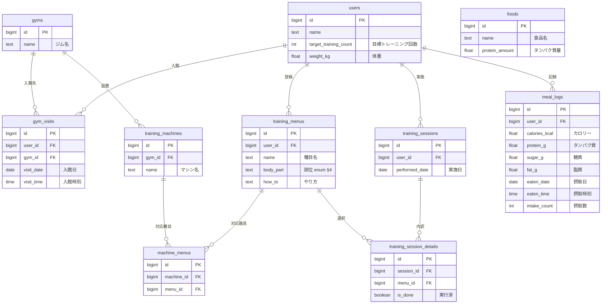

# DB物理設計（列定義・DDL・INDEX） — okada-fit

> **目的**: 論理データモデル（`30_データ・IF設計/01_データモデル.md`）と要件のデータ契約を、実装が迷わない**物理粒度**（列・型・NULL・制約・INDEX・FK・DDL）に具体化する。テーブルごとに1節で定義する。
> **書き方**:（記入例は example-suido-fax の対応ファイル参照）実データは書かず、`{ }` を自プロジェクトの語に置き換える。**列の詳細・enum全値・データ契約の正本はデータモデル側**とし、各項目 `[設計で確定]` は設計フェーズで確定させる枠（`../../意思決定_ADR/` 経由）。**本書は「全体ERD」（カラムレベル・型/PK/FK付き＝物理データモデル）とテーブル単位の列定義・DDLを担う**。概念/俯瞰ER（エンティティ＝箱のみ）は `30_データ・IF設計/01_データモデル.md §2` が正（抽象度が別）。

> ⚠️ **本書はたたき台（2026-07-25 生成／2026-08-08 改訂）**。岡田さんのレビューで最終確定する。
> 前提の既定値は次の5点。
> - `id` は `bigint` の自動採番（`GENERATED ALWAYS AS IDENTITY`）
> - §8-9解決: `training_sessions` は `menu_id` を持たない。種目は `training_session_details` 側で保持する
> - §8-6解決: `gyms.machine` は削除。個々のマシンは `training_machines` で持つ
> - §8-3解決: `training_session_details` に `session_id`(FK) を持たせる中間テーブルとする
> - DB製品（DEC-B03）は PostgreSQL 前提。Supabase／Neon のどちらでも列定義は変わらない
>
> **2026-08-08 改訂（器具の複数部位対応）**: 1つの器具は1つ以上の部位に対応する。
> - 器具↔種目を**多対多**に変更した
> - 中間テーブル `machine_menus`（§1.6）を新設した
> - `training_machines.menu_id` を削除した（§1.4・§3）
> - `training_session_details.menu_id` は**変更なし**

## 目次
- [全体ERD（カラムレベル・物理データモデル）](#全体erdカラムレベル物理データモデル)
1. [マスタ系テーブル](#1-マスタ系テーブル)
2. [履歴系テーブル](#2-履歴系テーブル)
3. [DDL・INDEX抜粋](#3-ddlindex抜粋)
4. [enum定義](#4-enum定義)

## 全体ERD（カラムレベル・物理データモデル）
> 📝 ここに**カラムレベルのER図（型/PK/FK付き）**を Mermaid erDiagram で記載。テーブル＝箱＋列で、関係・カーディナリティも付す。**概念/俯瞰ER（エンティティ＝箱のみ）は [`../30_データ・IF設計/01_データモデル.md §2`](../30_データ・IF設計/01_データモデル.md) が正**（抽象度が別：概念/俯瞰 ↔ 本書＝物理カラムレベル）。



## 1. マスタ系テーブル `[設計で確定]`
> 📝 ここに1テーブルの物理列定義を記載。**列 / 型 / NULL / 制約・既定 / 説明** を1列1行で。PK・FK・UNIQUE・CHECKを制約列に明示する。{列名／型／NULL可否／制約・既定／説明}

全 `id` は `bigint GENERATED ALWAYS AS IDENTITY`（自動採番）。全テーブルに `created_at timestamptz not null default now()` を持たせる（監査用・下表では省略）。

### 1.1 `users`（ユーザー）
| 列 | 型 | NULL | 制約/既定 | 説明 |
|---|---|---|---|---|
| id | bigint | no | PK, 自動採番 | |
| name | text | no | | 表示名 |
| target_training_count | int | yes | CHECK(≥0) | 目標トレーニング回数（月） |
| weight_kg | float | yes | CHECK(>0) | 体重(kg)。タンパク質目標＝体重×2g（DEC-B06）は算出 |

- 一意性: 単一ユーザー運用のため当面なし（将来のマルチユーザーは認証IDと紐付け・DEC-D03）

### 1.2 `gyms`（ジム）
| 列 | 型 | NULL | 制約/既定 | 説明 |
|---|---|---|---|---|
| id | bigint | no | PK, 自動採番 | |
| name | text | no | | ジム名（※手書きに無く追加。§8-6） |

### 1.3 `training_menus`（トレーニングメニュー＝種目マスタ）
| 列 | 型 | NULL | 制約/既定 | 説明 |
|---|---|---|---|---|
| id | bigint | no | PK, 自動採番 | |
| user_id | bigint | no | FK→users(id) | 所有者 |
| name | text | no | | 種目名 |
| body_part | text | no | CHECK(enum・§4) | 部位（胸/背中/脚/肩/腕・DEC-B04） |
| how_to | text | yes | | やり方メモ |

### 1.4 `training_machines`（トレーニングマシーン＝器具マスタ）
| 列 | 型 | NULL | 制約/既定 | 説明 |
|---|---|---|---|---|
| id | bigint | no | PK, 自動採番 | |
| gym_id | bigint | no | FK→gyms(id) | 設置ジム |
| name | text | no | | マシン名 |

- 対応する種目は `machine_menus`（§1.6）で保持する。器具は複数の種目に対応でき、**部位は種目経由で複数になる**（2026-08-08 改訂）。
- `menu_id` は本表から削除した（旧: 種目への単一FK・NOT NULL）。器具の部位を1つに固定していた列のため（§3 の `ALTER TABLE ... DROP COLUMN`）。

### 1.5 `foods`（食品マスタ）
| 列 | 型 | NULL | 制約/既定 | 説明 |
|---|---|---|---|---|
| id | bigint | no | PK, 自動採番 | |
| name | text | no | | 食品名 |
| protein_amount | float | no | CHECK(≥0) | タンパク質量(g)。不足分提示（FEAT-09） |

### 1.6 `machine_menus`（器具×種目）
| 列 | 型 | NULL | 制約/既定 | 説明 |
|---|---|---|---|---|
| id | bigint | no | PK, 自動採番 | |
| machine_id | bigint | no | FK→training_machines(id) | 器具 |
| menu_id | bigint | no | FK→training_menus(id) | 対応する種目 |

- 一意性: `(machine_id, menu_id)` を UNIQUE（`uq_mm_machine_menu`）。同一の組み合わせの重複行を防止
- 検索: `menu_id` に非一意INDEX（`ix_mm_menu`）。部位→種目→器具の絞り込み（FEAT-02）で使う
- 器具の部位は本表を介して `training_menus.body_part` から導く。1台が複数部位を持てる
- 概念の正本は `../30_データ・IF設計/01_データモデル.md` の DM-10

> ⚠️ 要確認（人間判断）: `machine_menus` の新設で次の3点が未決。

| # | 未決事項 | 何が問題か | 備考 |
|---|---|---|---|
| 1 | **本表に `user_id` が無い** | 本人性は `menu_id`→`training_menus.user_id` 経由でしか担保できない | RLS の述語が1段深いサブクエリになる（§3・DEC-D03） |
| 2 | **種目の削除時に本表の行も消す必要がある** | `ON DELETE` 方針が全FKで未定（`06_DB設計規約.md`） | 既存論点に本表が加わる |
| 3 | **器具に種目が0件の状態を許すか** | 許すとその器具は部位で引けず FEAT-02 の絞り込みに出ない | DB制約では「1件以上」を表現できない。許さないならアプリ側（FEAT-01）で担保する |

## 2. 履歴系テーブル `[設計で確定]`
> 📝 ここに関連する小テーブルをまとめて記載（テーブルごとに小見出し＋列定義表）。{テーブル名／列名／型／NULL可否／制約／説明}

### 2.1 `gym_visits`（入館履歴）
| 列 | 型 | NULL | 制約/既定 | 説明 |
|---|---|---|---|---|
| id | bigint | no | PK, 自動採番 | |
| user_id | bigint | no | FK→users(id) | |
| gym_id | bigint | no | FK→gyms(id) | |
| visit_date | date | no | | 入館日 |
| visit_time | time | yes | | 入館時刻 |

### 2.2 `training_sessions`（トレーニング履歴）
| 列 | 型 | NULL | 制約/既定 | 説明 |
|---|---|---|---|---|
| id | bigint | no | PK, 自動採番 | |
| user_id | bigint | no | FK→users(id) | |
| performed_date | date | no | | 実施日（ヒートマップの実施有無の集計元） |

> §8-9解決: 種目は本テーブルに持たず `training_session_details` 側で保持（1トレで複数種目のため）。

### 2.3 `training_session_details`（トレーニング明細）
| 列 | 型 | NULL | 制約/既定 | 説明 |
|---|---|---|---|---|
| id | bigint | no | PK, 自動採番 | |
| session_id | bigint | no | FK→training_sessions(id) | 所属トレーニング（§8-3解決） |
| menu_id | bigint | no | FK→training_menus(id) | 実施種目 |
| is_done | boolean | no | 既定 false | 実行済フラグ |

- 一意性: `(session_id, menu_id)` を UNIQUE（同一トレで同一種目の重複行を防止）

### 2.4 `meal_logs`（食事履歴）
| 列 | 型 | NULL | 制約/既定 | 説明 |
|---|---|---|---|---|
| id | bigint | no | PK, 自動採番 | |
| user_id | bigint | no | FK→users(id) | |
| calories_kcal | float | no | CHECK(≥0) | カロリー(kcal) |
| protein_g | float | no | CHECK(≥0) | タンパク質(g) |
| sugar_g | float | no | CHECK(≥0) | 糖質(g) |
| fat_g | float | no | CHECK(≥0) | 脂質(g) |
| eaten_date | date | no | | 摂取日 |
| eaten_time | time | yes | | 摂取時刻 |
| intake_count | int | yes | CHECK(≥1) | 摂取数（意味は §8-6 で要確認） |

> 食事写真・料理名は保持しない（ADR-0003）。AI出力の栄養4項目のみを保存。

## 3. DDL・INDEX抜粋
> 📝 ここに実装粒度のDDL（CREATE INDEX / ALTER TABLE ... CHECK / 部分ユニーク等）を記載。テナント分離（RLS）や関数射影など、列定義表に載らない物理設計もここに補足する。実データ値は書かない。

### 3.1 DDL 抜粋

```sql
-- ダッシュボード表示（NFR-PERF-01）用: user + 日付の複合INDEX
CREATE INDEX ix_gym_visits_user_date ON gym_visits(user_id, visit_date);
CREATE INDEX ix_train_sessions_user_date ON training_sessions(user_id, performed_date);
CREATE INDEX ix_meal_logs_user_date ON meal_logs(user_id, eaten_date);
-- 明細の重複防止
CREATE UNIQUE INDEX uq_tsd_session_menu ON training_session_details(session_id, menu_id);
-- 栄養値の非負制約（例）
ALTER TABLE meal_logs ADD CONSTRAINT ck_meal_nutrients
  CHECK (calories_kcal >= 0 AND protein_g >= 0 AND sugar_g >= 0 AND fat_g >= 0);
-- 部位のenum（CHECK方式。PostgreSQL CREATE TYPEでも可）
ALTER TABLE training_menus ADD CONSTRAINT ck_menu_body_part
  CHECK (body_part IN ('胸','背中','脚','肩','腕'));

-- 器具×種目の多対多（2026-08-08 改訂・§1.6）
CREATE TABLE machine_menus (
  id         bigint GENERATED ALWAYS AS IDENTITY PRIMARY KEY,
  machine_id bigint NOT NULL REFERENCES training_machines(id),
  menu_id    bigint NOT NULL REFERENCES training_menus(id),
  created_at timestamptz NOT NULL DEFAULT now()
);
CREATE UNIQUE INDEX uq_mm_machine_menu ON machine_menus(machine_id, menu_id);
CREATE INDEX ix_mm_menu ON machine_menus(menu_id);
-- 器具から種目への単一FKを削除（部位を1つに固定していた列・§1.4）
ALTER TABLE training_machines DROP COLUMN menu_id;
```

### 3.2 部位で器具を絞り込むクエリ（FEAT-02）

| 項目 | 内容 |
|---|---|
| 経路 | 部位 → `training_menus` → `machine_menus` → `training_machines` の3ホップ |
| 使うINDEX | `ix_mm_menu`（`machine_menus(menu_id)`） |
| 注意 | 1台の器具が同じ部位の種目を2つ以上持つと重複行が出る |
| 対策 | **`SELECT DISTINCT` が必須**。多対多化で新しく生じた注意点 |

### 3.3 監査列

| 対象 | 列 |
|---|---|
| 全テーブル | `created_at timestamptz not null default now()` |
| 更新頻度の高い表 | `updated_at` も検討する |

### 3.4 テナント分離（RLS・DEC-D03）

| 項目 | 内容 |
|---|---|
| 方針 | `user_id = auth.uid()` 相当のRLSポリシーで本人行のみに制限する |
| 適用 | 認証方式の確定後（Supabase採用時） |
| 正本 | `30_データ・IF設計/01_データモデル.md §7` |
| 例外 | `machine_menus`・`training_machines` は `user_id` を持たない |
| 例外の判定 | `menu_id`→`training_menus.user_id` のサブクエリで本人性を判定する（§1.6） |

## 4. enum定義 `[設計で確定]`
> 📝 ここに本DBで使うenumの全値を列挙（表示名は別途日本語保持）。状態機械の正本は要件定義・`30_データ・IF設計/03_ドメインイベント.md`。{enum名／取り得る値}

- `body_part`（部位・DEC-B04）: `胸` / `背中` / `脚` / `肩` / `腕`（CHECK制約 or `CREATE TYPE body_part AS ENUM(...)`）

> 関連: 概念/集約＝`30_データ・IF設計/01_データモデル.md` / バッチ＝`02_バッチ設計.md` / 外部連携のstatus写像＝`03_外部連携IF/README.md`。
