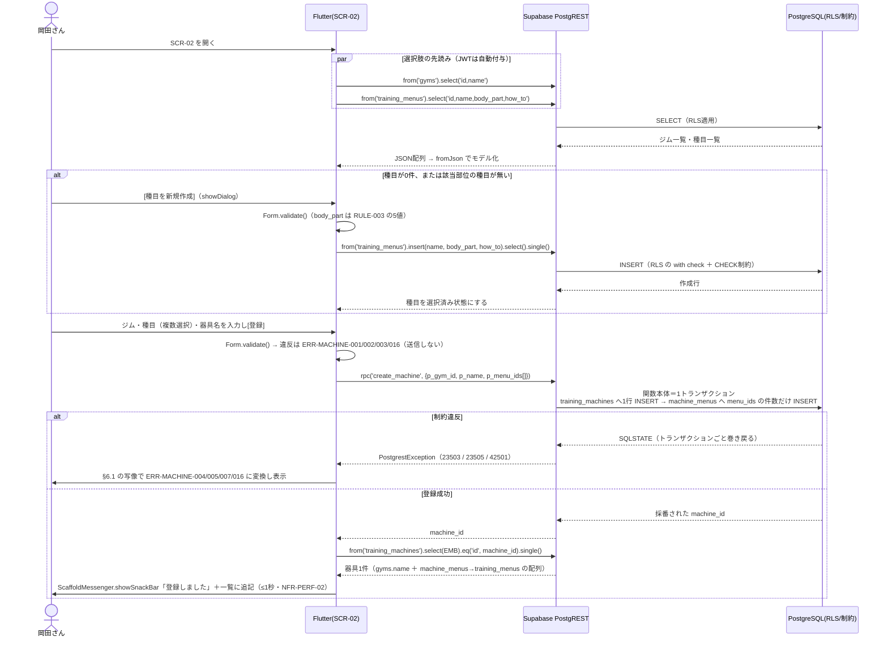

# FEAT-01 器具登録（部位タグ付与） 詳細設計

> **目的**: FEAT-01 を実装が迷わない粒度（入出力・バリデーション・クエリ・エラー・画面挙動・実装単位）まで具体化し、TDDの着手点を固定する。
> **書き方**: 実データは書かない。上位の正本（API契約＝`../../30_データ・IF設計/02_API設計.md` ／ 物理DB＝`../01_DB物理設計.md` ／ シーケンス＝`../../40_機能設計/01_シーケンス設計.md`）と矛盾させず、参照はIDで行う。横断方針（エラー分類・トランザクション・冪等・リトライ）は `../07_実装共通設計パターン.md` を正本とし本書では再定義しない。

> ⚠️ **本書はたたき台（2026-08-02 生成）**。岡田さんのレビューで確定する。

## 目次
1. [概要](#1-概要)
2. [処理フロー](#2-処理フロー)
3. [入出力仕様](#3-入出力仕様)
4. [業務ロジック](#4-業務ロジック)
5. [データアクセス](#5-データアクセス)
6. [エラー処理](#6-エラー処理)
7. [画面挙動・状態別表示](#7-画面挙動状態別表示)
8. [実装単位](#8-実装単位)
9. [テスト観点](#9-テスト観点)
10. [敵対的検証・要確認事項](#10-敵対的検証要確認事項)

## 1. 概要

| 項目 | 内容 |
|---|---|
| 対応要件 | FEAT-01（器具登録・部位タグ付与） |
| 対応画面 | SCR-02 器具登録 |
| 対応API | **PostgREST 直接 ＋ RPC**。`supabase.from('gyms')` ／ `supabase.from('training_menus')` ／ `supabase.from('training_machines')` ／ `supabase.from('machine_menus')` と、器具の登録・更新・削除の RPC。呼び出し一覧は §3 |
| 呼び出し方式 | Edge Function は使わない。参照と単一テーブル操作は PostgREST 直接。**器具の登録・更新・削除は `training_machines` と `machine_menus` の2テーブルに書くため RPC を採る**（原子性・`../07_実装共通設計パターン.md §2` の案A。§2・§5・§10 #1） |
| 関連ルール | RULE-003（部位タグ5種＝胸/背中/脚/肩/腕）／RULE-004（絞り込みは部位タグ一致のみ・利用側は FEAT-02） |
| 外部連携 | なし（AI不使用の決定的処理・DEC-B01） |
| 性能目標 | NFR-PERF-02（決定的処理 ≤1秒）／画面初期表示は NFR-PERF-01（≤2秒） |
| 状態 | 状態を持たない（ST-01/ST-02 は FEAT-04 の `training_session_details` に属する） |
| 優先度 | MUST（`../../30_データ・IF設計/02_API設計.md §2`） |

**旧構成からの変更点**: 旧設計では `/api/machines` `/api/menus` `/api/gyms` の Route Handler を経由していた。新構成では Flutter が PostgREST を直接呼ぶ（RPC も PostgREST の `/rpc/` 経由）。アプリとDBの間にサーバ実装は無い。旧パスは**廃止**する。

FEAT-01 は、岡田さんが通うジムの器具（マシン）を DB に登録する機能である。あわせて「その器具がどの部位を鍛えるものか」を判別できる状態にする。

ここで作られたデータは FEAT-02（部位→器具の絞り込み）と FEAT-03（AIメニュー提案）の入力になる。本機能は FEAT-02/03 の唯一のデータ供給源であり、両者の前提となる。

**1つの器具は1つ以上の部位に対応する**（2026-08-08 決定）。ケーブルマシンのように、1台でラットプルダウン（背中）・ケーブルフライ（胸）・トライセプス押し下げ（腕）を行える器具がある。したがって器具の登録は「種目を1つ選ぶ」ではなく **「種目を1件以上選ぶ」** 操作になる。

構造上の前提を先に述べる。**部位タグ（RULE-003）を保持するのは `training_menus.body_part` である。器具テーブル `training_machines` は部位列も種目への単一FKも持たない**（`../01_DB物理設計.md §1.3/§1.4`）。器具と種目は中間テーブル `machine_menus` による**多対多**である。

| 事実 | 帰結 |
|---|---|
| 器具の部位は `machine_menus` → `training_menus.body_part` を辿って導出する | 「器具に部位タグを付ける」操作の実体は、部位が確定済みの種目を**1件以上**選んで器具に結び付けること |
| 1つの器具に複数の種目が紐づく | 器具の部位は**集合**になる。紐づく種目の `body_part` を重複除去したものが器具の対応部位 |
| 部位は器具に持たない | FEAT-02 の絞り込みが3ホップ（`training_menus` → `machine_menus` → `training_machines`）になる |
| 器具の登録・更新が2テーブルにまたがる | 単一 INSERT では原子性を取れない。RPC に寄せる（§2・§5） |

この導出関係は §4・§5・§10 で扱う。

## 2. 処理フロー

`../../40_機能設計/01_シーケンス設計.md` に FEAT-01 のシーケンスは無い。本節で新規に定義する（FEAT-02 の絞り込みシーケンスは同ファイル §4 が正本）。

認証は `supabase_flutter` が保持する。サインイン済みセッションの JWT が全 PostgREST 呼び出しに自動付与される。アプリ側で明示的にトークンを載せる記述は要らない。



- 器具の登録は `training_machines` 1行 ＋ `machine_menus` 複数行の**2テーブル書き込み**である。PostgREST の `insert` を2回並べると別トランザクションになり、途中で失敗すると**種目が1件も紐づかない器具**が残る。部位で引けない器具＝FEAT-02 から見えない器具になるため、この中間状態は許容できない。
- したがって器具の登録・更新・削除は **RPC（Postgres 関数）に寄せる**。`../07_実装共通設計パターン.md §2` は「複数テーブルにまたがる書き込みは案A（RPC）」を横断方針として定めており、本機能はその2例目になる（1例目は FEAT-04）。関数本体は単一の暗黙トランザクションで走るため原子性が保証される。
- 登録後の表示用データは RPC の戻り（`machine_id`）を使って PostgREST で1回引き直す。関数から入れ子JSONを返す案もあるが、戻り値の形が §3.2 の埋め込み select と二重定義になるため採らない `[仮]`。
- 種目作成と器具登録は依然として **別の呼び出し**である。種目を作ってそのまま器具を登録する導線では中間失敗で種目だけが残る（§10 #1）。
- AI（EXT-01）は一切呼ばない。NFR-AVAIL-05 の縮退対象外である。AI不達時も本機能は完全に動作する。
- 中間層が無いため、**入力の強制点は DB の RLS・CHECK・FK と RPC 関数の中のみ**である。Flutter 側の検証は利用者体験のための先出しであり、防御ではない（§3.1・§10 #2）。

## 3. 入出力仕様

本機能に HTTP の契約は無い。定義するのは **PostgREST 呼び出し・RPC 呼び出しの引数と戻り値**である。

| 前提 | 内容 |
|---|---|
| 認証 | `supabase_flutter` のセッション JWT を自動付与。未サインインでは呼ばない（画面に到達しない） |
| テーブル名・列名 | DB の実体そのまま（snake_case）。`../01_DB物理設計.md` が正本 |
| 可視範囲 | RLS が決める。アプリ側で `user_id` を条件に足さない |
| 戻り値のモデル化 | Dart のモデルクラス＋`fromJson`。zod は使わない（Dart のため） |

### 3.1 呼び出し一覧

| # | 操作 | 呼び出し | 戻り値 | 主なERR |
|---|---|---|---|---|
| C-01 | 器具を1件登録（種目を1件以上紐づけ） | `rpc('create_machine', {p_gym_id, p_name, p_menu_ids})` | 採番された `machine_id` | 001〜005/007/016 |
| C-02 | 器具一覧（種目・部位を導出して同梱） | `from('training_machines').select(EMB)` ＋ `.eq()` | 器具の配列 | — |
| C-03 | 器具の紐づけ差し替え・改名 | `rpc('update_machine', {p_machine_id, p_gym_id, p_name, p_menu_ids})` | 更新した `machine_id`（不在は `null`） | 001〜007/016 |
| C-04 | 器具の削除（紐づけごと） | `rpc('delete_machine', {p_machine_id})` | 削除した `machine_id`（不在は `null`） | 006 |
| C-05 | 種目一覧 | `from('training_menus').select('id,name,body_part,how_to,created_at')` | 種目の配列 | — |
| C-06 | 種目を1件登録 | `from('training_menus').insert(値).select().single()` | 種目1件 | 008〜010/012 |
| C-07 | 種目の改名・部位変更 | `from('training_menus').update(値).eq('id',id).select()` | 更新行（0件なら不在） | 008〜012 |
| C-08 | 種目の削除 | `from('training_menus').delete().eq('id',id).select('id')` | 削除行（0件なら不在） | 011/013 |
| C-09 | ジム一覧 | `from('gyms').select('id,name,created_at')` | ジムの配列 | — |
| C-10 | ジムを1件登録 | `from('gyms').insert(値).select().single()` | ジム1件 | 014/015 |
| C-11 | 器具1件の再取得（登録・更新の直後） | `from('training_machines').select(EMB).eq('id',id).single()` | 器具1件 | 006 |

- `EMB` は器具の埋め込み select 文字列（§3.2）。ジムの更新・削除は現行契約に無い（§10 #7）。
- **C-01/C-03/C-04 は RPC である。** 器具1行と `machine_menus` の複数行を同一トランザクションで扱うため（§2）。関数の定義は `supabase/migrations/*.sql`（§8 #12）に置き、DDL の正本は `../01_DB物理設計.md`。
- C-02/C-11 は参照のみで PostgREST 直接のままとする。

### 3.2 器具（`training_machines`）

```dart
// C-01 登録（RPC＝1トランザクション。machine_menus への複数行 INSERT を含む）
final machineId = await supabase.rpc('create_machine', params: {
  'p_gym_id':   gymId,
  'p_name':     name,
  'p_menu_ids': menuIds,      // List<int>・1件以上・重複なし
}) as int;

// C-11 直後の再取得（表示用）
final row = await supabase
    .from('training_machines').select(EMB).eq('id', machineId).single();

// EMB: 部位は machine_menus → training_menus 経由でしか取れない（器具は部位列を持たない）
const EMB = 'id, name, created_at, '
            'gym_id, gyms!inner ( name ), '
            'machine_menus!inner ( menu_id, training_menus!inner ( name, body_part ) )';
```

**引数**（C-01。C-03 は `p_machine_id` が加わる）

| キー | 型 | 必須 | 規則 |
|---|---|---|---|
| `p_gym_id` | `int`（bigint） | 必須 | 正の整数。`gyms` に実在すること |
| `p_menu_ids` | `List<int>`（bigint[]） | 必須 | **1件以上**。重複なし。全要素が本人に可視な `training_menus` であること |
| `p_name` | `String` | 必須 | trim 後1〜100文字。制御文字を含まない |

- `p_menu_ids` が空配列のときは関数側で例外を投げる。0件の器具は部位で引けず FEAT-02 から見えないため作らせない（§10 #12）。
- 重複要素は `uq_mm_machine_menu`（`../01_DB物理設計.md §3`）で `23505` になる。関数に入る前に Dart 側でも弾く（§3.5）。

**戻り値**（C-01/C-03 は `int`（`machine_id`）。以下は C-02/C-11 が返す器具1件の形）

| キー | 型 | 備考 |
|---|---|---|
| `id` | `int` | 採番済み |
| `name` | `String` | 保存した原文 |
| `created_at` | `String`（ISO 8601） | — |
| `gym_id` | `int` | — |
| `gyms` | `{ "name": String }` | **入れ子**。旧構成の平坦な `gym_name` ではない |
| `machine_menus` | `[{ "menu_id": int, "training_menus": { "name": String, "body_part": String } }]` | **配列**。1件以上。部位タグの供給元 |

- 入れ子は `TrainingMachine.fromJson` で平坦化する。`menuNames`（配列）と `bodyParts`（重複除去した集合）はここで確定する（§4 L-01）。
- 旧構成の `gym_name` `menu_name` `body_part` というトップレベル列は**存在しない**。加えて `menu_id` `training_menus` という単数の入れ子も**存在しない**。器具の種目は常に配列である。応答形が変わる点は実装時の移植で注意する。

```dart
// C-02 一覧（フィルタは任意）
var q = supabase.from('training_machines').select(EMB);
if (gymId != null)    q = q.eq('gym_id', gymId);
if (bodyPart != null) q = q.eq('machine_menus.training_menus.body_part', bodyPart); // 埋め込み列での絞り込み
final rows = await q;   // 並び替えは §5 参照
```

- 埋め込み列での絞り込みには経路上の全段に `!inner` が要る（`machine_menus!inner` ＋ `training_menus!inner`）。外部結合のままだと親行が残る。
- 部位で絞ると、器具に紐づく種目のうち**一致した分だけ**が `machine_menus` 配列に残る。器具の対応部位の全体を出したい画面では絞り込みなしで引く。
- 部位フィルタの契約は FEAT-02 が正本。本書では呼び出し形のみ示す。

```dart
// C-03 更新（全置換。部分更新は設けない） / C-04 削除。いずれも RPC＝1トランザクション
final updatedId = await supabase.rpc('update_machine', params: {
  'p_machine_id': machineId, 'p_gym_id': gymId, 'p_name': name, 'p_menu_ids': menuIds,
});   // null → ERR-MACHINE-006

final deletedId = await supabase.rpc('delete_machine', params: {'p_machine_id': machineId});
// null → ERR-MACHINE-006。関数内で machine_menus の子行も削除する
```

**重要な挙動差**: 対象行が無い場合、PostgREST も RPC も**例外を投げない**。PostgREST は空配列、関数は `null` を返す。旧構成の 404 に相当する判定は `isEmpty` / `null` の明示チェックで行う（§6.1）。

### 3.3 種目（`training_menus`） — 部位タグ（RULE-003）の保持主体

```dart
// C-06 登録
final row = await supabase.from('training_menus')
    .insert({'name': name, 'body_part': bodyPart, 'how_to': howTo})  // how_to は null 可
    .select('id, name, body_part, how_to, created_at').single();
```

| キー | 型 | 必須 | 規則 |
|---|---|---|---|
| `name` | `String` | 必須 | trim 後1〜100文字 |
| `body_part` | `String` | 必須 | 胸/背中/脚/肩/腕。`../01_DB物理設計.md §4` の CHECK と同値 |
| `how_to` | `String?` | 任意 | 0〜1000文字。null 許容 |
| `user_id` | — | — | **アプリから送らない**。RLS の `with check` と DB 既定値で本人を強制する `[仮]` |

- `user_id` をクライアントが指定できると、他人の行を作れてしまう。列は送らず DB 側で決める（§10 #2）。
- C-07 は全置換。C-08 は参照中なら失敗する（§6.1・ERR-MACHINE-013）。

### 3.4 ジム（`gyms`）

```dart
// C-10 登録 / C-09 一覧
final row  = await supabase.from('gyms').insert({'name': name})
                 .select('id, name, created_at').single();
final rows = await supabase.from('gyms').select('id, name, created_at').order('name');
```

| キー | 型 | 必須 | 規則 |
|---|---|---|---|
| `name` | `String` | 必須 | trim 後1〜100文字 |

### 3.5 バリデーション規則（二層）

検証は **Flutter 側（先出し）** と **DB 側（強制）** の二層で行う。Flutter 側は体験のため、DB 側は防御のためである。

| 項目 | Flutter 側 | DB 側 | 違反時 |
|---|---|---|---|
| `training_machines.name` | `TextFormField.validator`（必須・trim・NFKC 後1〜100文字・制御文字排除） | なし（型は `text`） | ERR-MACHINE-001 |
| `gym_id` | `DropdownButtonFormField.validator`（未選択を弾く） | NOT NULL ＋ FK | ERR-MACHINE-002 |
| `menu_ids` の件数 | 選択件数が0のとき送信ボタンを無効化＋`errorText` | 関数内で空配列を拒否（`machine_menus` が0行のまま終わらせない） | ERR-MACHINE-003 |
| `menu_ids` の重複 | 選択UIが `Set<int>` のため構造的に起きない。手組みの呼び出し向けに送信前も検査 | `uq_mm_machine_menu` 違反（`23505`） | ERR-MACHINE-016 |
| `gym_id` の実在 | 先読み一覧から選ばせるため通常は発生しない | FK 違反（`23503`） | ERR-MACHINE-004 |
| `menu_ids` の各要素の実在・所有 | 同上 | FK 違反（`23503`）／RLS 違反（`42501`） | ERR-MACHINE-005 |
| `machine_id`（更新・削除） | — | RLS で不可視なら関数が `null` を返す | ERR-MACHINE-006 |
| 器具の重複 `[仮]` | 送信前 SELECT（同一 `gym_id` 内・正規化名） | **現状 UNIQUE 無し**（§10 #4） | ERR-MACHINE-007 |
| `training_menus.name` | `validator`（必須・trim・NFKC 後1〜100文字） | なし | ERR-MACHINE-008 |
| `body_part` | `SegmentedButton` で5値のみ選択可 | CHECK 制約（`23514`） | ERR-MACHINE-009 |
| `how_to` | `validator`（0〜1000文字） | なし | ERR-MACHINE-010 |
| `menu_id`（種目の更新・削除） | — | RLS で不可視なら 0件 | ERR-MACHINE-011 |
| 種目の重複 `[仮]` | 送信前 SELECT（本人の種目内・正規化名） | **現状 UNIQUE 無し**（§10 #4） | ERR-MACHINE-012 |
| 種目の削除可否 | 送信前 SELECT（参照件数の提示用） | FK 違反（`23503`・`ON DELETE NO ACTION`） | ERR-MACHINE-013 |
| `gyms.name` | `validator`（必須・trim・NFKC 後1〜100文字） | なし | ERR-MACHINE-014 |
| ジムの重複 `[仮]` | 送信前 SELECT（正規化名） | **現状 UNIQUE 無し**（§10 #4） | ERR-MACHINE-015 |
| 認証 | セッション有無で画面を出し分け | JWT 検証（`PGRST301`／401） | ERR-AUTH-001 |

- 文字列長の上限（100/1000）は `[仮]`。`../01_DB物理設計.md` の型は `text`（無制限）である。長さは Flutter 側でしか担保できない。
- **`menu_ids` の1件以上は関数側でも強制する。** 器具登録を RPC にしたことで、この検証だけは中間層（＝関数本体）に置ける。`machine_menus` へ直接 INSERT/DELETE できる経路を GRANT で塞げば、種目0件の器具は構造的に作れなくなる `[仮]`（§10 #12）。
- **クライアント検証は迂回できる**。JWT を持つ利用者は PostgREST を直接叩ける。長さ制限を要件とするなら DB 側の CHECK が要る（§10 #2）。
- 重複判定（`[仮]` 3件）は送信前 SELECT で行う。同時実行では取りこぼす。要否判断は §10 #4。

## 4. 業務ロジック

**L-01 部位タグの導出（RULE-003・本機能の中核）**

器具は部位列を持たない。器具1件の部位は次の一意な経路でのみ決まる。**結果は単一値ではなく集合**である。

```
menus(machine)      := { training_menus[mm.menu_id] | mm ∈ machine_menus, mm.machine_id = machine.id }
body_parts(machine) := { m.body_part | m ∈ menus(machine) }        // 重複除去した集合
```

| 事実 | 帰結 |
|---|---|
| `machine_menus` は器具1件につき1行以上（§3.5 で強制） | 部位タグ未設定の器具は作らせない。RULE-004 の絞り込みで取りこぼしが出ない根拠 |
| 器具↔種目は多対多 | 1つの器具は1つ以上の部位に属する。ケーブルマシン＝背中/胸/腕 のように3部位にもなる |
| 同じ器具に同一部位の種目が複数紐づく | 部位の集合は重複除去する。器具一覧・絞り込みで同じ器具が2回出ないようにする（FEAT-02 §5） |
| 1台で複数部位を鍛える器具（多機能ラック等） | **中間テーブルでそのまま表現できる**。器具行を部位ごとに複製する運用回避は不要になった（§10 #5） |

- 実体は埋め込み select の入れ子読み替えである。純関数として切り出す: `Set<BodyPart> resolveBodyParts(List<TrainingMenu> menus)`。単体テスト対象（NFR-QUAL-01）。
- 表示順は RULE-003 の並び（胸/背中/脚/肩/腕）に揃える。`Set` の反復順に依存させない。

**L-02 部位タグ値の検証（RULE-003）**

```
parseBodyPart(input) =
  input ∈ { 胸, 背中, 脚, 肩, 腕 } ? input : throw ERR-MACHINE-009
```

- 5値は `../01_DB物理設計.md §4` の CHECK 制約と同一集合。
- Dart の `enum BodyPart` と DB CHECK の二重防御とする。**値の正本はDB側**とし、アプリ側で値を増やさない。

**L-03 名称の正規化（重複判定・表記ゆれ対策）**

```
normalizeName(raw) = collapseSpaces( trim( NFKC(raw) ) )
```

- 全角/半角・連続空白の差を吸収した比較キーを作る純関数。
- **保存する値は正規化前の原文**とする。正規化結果は重複判定と検索時の比較にのみ使う。表示は利用者の入力どおり。
- Dart には NFKC 正規化が標準で無い。`characters` では足りず、外部パッケージまたは自前実装が要る `[仮]`。
- 大文字小文字の畳み込み（英字マシン名）を行うかは未定 → §10 #8。

**L-04 登録前提の判定（登録順序の依存）**

| 条件 | 画面の振る舞い |
|---|---|
| `gyms` が0件 | 器具登録フォームを無効化し、ジム登録へ誘導（§7） |
| `training_menus` が0件 | 器具登録フォームを無効化し、種目作成ダイアログを開く導線を出す |
| 選択中の部位に該当する種目が0件 | 種目リストを空で表示し、「この部位の種目を作成」を提示 |
| 種目を1件も選んでいない | [登録]を非活性にする（ERR-MACHINE-003 を出す前に押させない） |

- 判定は取得済みの一覧件数で行う純関数 `bool canRegisterMachine(int gymCount, int menuCount)` とする。
- DB 側の FK 違反（ERR-MACHINE-004/005）は最終防衛線に留める。

**L-05 種目選択の検証（多対多で新たに要る判定）**

```
validateMenuSelection(ids) =
  ids.isEmpty            → throw ERR-MACHINE-003
  ids.toSet().length < ids.length → throw ERR-MACHINE-016
  otherwise              → ids
```

| 事実 | 帰結 |
|---|---|
| 選択UIは `Set<int>` で保持する（§7） | 重複は構造的に起きない。ERR-MACHINE-016 は手組みの呼び出しに対する防御 |
| 件数の上限は設けない | 器具に紐づく種目数の上限は業務要件に無い。上限を置くなら §10 #12 で確定する |

- 純関数 `List<int> validateMenuSelection(List<int> ids)` として切り出す。単体テスト対象。
- 部位ごとに種目を絞って選ばせるが、**選択は部位をまたいで累積する**。ケーブルマシンの登録では「背中→ラットプルダウン」「胸→ケーブルフライ」を順に選べる（§7）。

## 5. データアクセス

PostgREST は呼び出しを SQL に変換して実行する。実装が書くのは Dart 側の呼び出しだが、性能とINDEXの議論には発行される SQL の形が要る。以下に対応を示す。

```dart
// L-04: SCR-02 初期表示。選択肢を2本の SELECT で先読み（いずれもRLS適用）
await supabase.from('gyms').select('id, name').order('name');
await supabase.from('training_menus')
    .select('id, name, body_part, how_to').order('body_part').order('name');

// C-01 器具の登録（RPC＝1トランザクション。2テーブルへ書く）
await supabase.rpc('create_machine',
    params: {'p_gym_id': g, 'p_name': n, 'p_menu_ids': ids});

// C-08 種目の削除可否の事前確認（利用者への参照件数提示用。強制は DB の FK）
await supabase.from('machine_menus')
    .select('id').eq('menu_id', menuId).count(CountOption.exact);
await supabase.from('training_session_details')
    .select('id').eq('menu_id', menuId).count(CountOption.exact);
```

```sql
-- C-01 create_machine の本体（1トランザクション。SECURITY INVOKER で RLS を効かせたまま）
INSERT INTO training_machines (gym_id, name) VALUES (p_gym_id, p_name) RETURNING id;
INSERT INTO machine_menus (machine_id, menu_id)
SELECT <採番されたid>, x FROM unnest(p_menu_ids) AS x;      -- 件数分の行を1文で入れる

-- C-03 update_machine の本体（紐づけは全置換）
UPDATE training_machines SET gym_id = p_gym_id, name = p_name WHERE id = p_machine_id;
DELETE FROM machine_menus WHERE machine_id = p_machine_id;
INSERT INTO machine_menus (machine_id, menu_id)
SELECT p_machine_id, x FROM unnest(p_menu_ids) AS x;

-- C-04 delete_machine の本体（子から先に消す）
DELETE FROM machine_menus     WHERE machine_id = p_machine_id;
DELETE FROM training_machines WHERE id = p_machine_id RETURNING id;
```

```sql
-- C-02 が PostgREST 内部で発行するクエリの形（部位は machine_menus 経由で導出＝3ホップ）
SELECT mc.id, mc.name, mc.created_at, mc.gym_id,
       g.name AS "gyms.name",
       mm.menu_id AS "machine_menus.menu_id",
       mn.name AS "training_menus.name", mn.body_part AS "training_menus.body_part"
  FROM training_machines mc
  JOIN gyms          g  ON g.id  = mc.gym_id
  JOIN machine_menus mm ON mm.machine_id = mc.id   -- 器具1件につき1行以上
  JOIN training_menus mn ON mn.id = mm.menu_id     -- ここが部位タグの供給元
 WHERE (mc.gym_id = $1 OR $1 IS NULL)
   AND (mn.body_part = $2 OR $2 IS NULL);
```

- 上の平坦形は**器具1件が種目の件数だけ行を返す**。PostgREST の埋め込み select はこれを器具1件のネスト形に畳んで返すため、アプリ側で重複行は見えない。ビュー化・RPC 化して平坦形を自分で書く場合は `DISTINCT` または集約が要る（FEAT-02 §5・§10 #13）。

| 観点 | 内容 |
|---|---|
| 対象テーブル | `training_machines`（INSERT/SELECT/UPDATE/DELETE）／`machine_menus`（INSERT/SELECT/DELETE）／`training_menus`（INSERT/SELECT/UPDATE/DELETE）／`gyms`（SELECT/INSERT）／`training_session_details`（SELECT・削除可否の件数提示のみ） |
| 使用INDEX | `machine_menus` は `uq_mm_machine_menu(machine_id, menu_id)` と `ix_mm_menu(menu_id)` を持つ（`../01_DB物理設計.md §3`）。前者は器具→種目の結合と重複防止、後者は種目→器具の逆引き（FEAT-02・種目の削除可否判定）に効く。一方 `training_machines(gym_id)` の INDEX は無い。PostgreSQL は FK列に自動でINDEXを作らない（§10 #6） |
| 並び順 | 「ジム名 → 部位 → 器具名」は**PostgREST の `order` では表現できない**（親テーブルの列でしか並べられない）。部位が集合になったため、器具の代表部位をどう決めて並べるかも Dart 側の判断になる。Dart 側でソートする `[仮]`。件数が増えるならビュー化を検討（§10 #11） |
| RLS | `training_menus` は `user_id` を持つため直接ポリシーを張れる。`training_machines`・`machine_menus`・`gyms` は所有者列を持たない。器具は `EXISTS (SELECT 1 FROM machine_menus mm JOIN training_menus m ON m.id = mm.menu_id WHERE mm.machine_id = training_machines.id AND m.user_id = <本人のusers.id>)` という**中間テーブル経由の間接ポリシー**になり、旧構成より1段深い。`gyms` は本人限定に絞る手段が無く全ユーザ共有マスタになる（§10 #2・#14） |
| トランザクション境界 | **器具の登録・更新・削除は RPC 1回＝1トランザクション**（`training_machines` ＋ `machine_menus`）。種目・ジムの登録は単一INSERTで完結するため PostgREST 直接のまま。SCR-02 の「種目を作ってそのまま器具を登録」は**2呼び出し＝2トランザクション**になる。中間失敗時は種目だけが残る（§10 #1） |
| 紐づけの差し替え方式 | **全置換（DELETE → INSERT）を採る**。§3 の更新契約が全置換であること、差分計算をアプリにも SQL にも持たせないことが理由。RPC の中なので中間の「種目0件の器具」は他から見えない。副作用は §10 #16 |
| 冪等性・リトライ | `../07_実装共通設計パターン.md` を正本とする。本機能はAI非依存で全操作が同期・低コストである。AI系のような自動リトライ禁止の制約は受けない |

紐づけ差し替えの2案を比較した結果は次のとおり。

| 案 | 内容 | 評価 |
|---|---|---|
| **A（採用）全置換** | `DELETE FROM machine_menus WHERE machine_id = ?` → `p_menu_ids` を全件 INSERT | 実装が1本道。器具の更新契約（全置換）と一致する。RPC 内なので原子性がある。`created_at` が毎回更新される（§10 #16） |
| B 差分 | 既存の `menu_id` 集合と比較し、削除分だけ DELETE・追加分だけ INSERT | `created_at` を保てるが、集合演算を SQL 側に書くことになる。保つ価値のある情報が無いため採らない |

> ⚠️ 要確認（人間判断）: RLSポリシー内の「本人」の表現（`auth.uid()`(uuid) と `users.id`(bigint) の写像）は未確定の既知論点であり、正本は `../06_DB設計規約.md`。本書では方式を決めず参照にとどめる。

## 6. エラー処理

中間層が無いため、エラーの一次表現は **`PostgrestException`** である。HTTP ステータスではない。写像は1箇所（§8 #10）に閉じ込め、画面には ERR-ID だけを渡す。

### 6.1 `PostgrestException` → ERR-ID の写像

| 検知 | SQLSTATE / code | 判別材料 | 写像先 ERR-ID |
|---|---|---|---|
| FK違反 | `23503` | 制約名 `training_machines_gym_id_fkey` `[仮]` | ERR-MACHINE-004 |
| FK違反 | `23503` | 制約名 `machine_menus_menu_id_fkey` `[仮]` | ERR-MACHINE-005 |
| FK違反 | `23503` | 削除時。参照元が `machine_menus` / `training_session_details` | ERR-MACHINE-013 |
| RLS違反 | `42501` | INSERT/UPDATE が `with check` を満たさない | ERR-MACHINE-005（他人所有の種目を指した） |
| CHECK違反 | `23514` | 制約名に `body_part` を含む `[仮]` | ERR-MACHINE-009 |
| 一意制約違反 | `23505` | 制約名 `uq_mm_machine_menu` | ERR-MACHINE-016（`p_menu_ids` に重複がある） |
| 一意制約違反 | `23505` | 制約名（`gyms`/`menus`/`machines` のどれか） | ERR-MACHINE-007 / 012 / 015 |
| 関数が投げた例外 | `P0001`（`RAISE EXCEPTION`） | メッセージ本文 `[仮]` | ERR-MACHINE-003（`p_menu_ids` が空） |
| 0件（`.single()`） | `PGRST116` | 対象テーブル | ERR-MACHINE-006 / 011 |
| **例外なしで空配列・`null`** | — | `delete` の戻りが `isEmpty`／RPC の戻りが `null` | ERR-MACHINE-006 / 011 |
| JWT 期限切れ・不正 | `PGRST301` / 401 | — | ERR-AUTH-001 |
| 通信断・タイムアウト | 例外型（`SocketException` 等） | — | `../07_実装共通設計パターン.md` の共通方針に従う（本書で新IDを起こさない） |

- **`23503` は code だけでは区別できない**。`gym_id`（`training_machines`）と `menu_id`（`machine_menus`）のどちらの FK かは制約名で判別する。制約名は DB の実体に依存するため `[仮]`。マイグレーションで明示命名するのが確実。
- **`23505` は `machine_menus` でのみ発火する**。`uq_mm_machine_menu` が唯一の一意制約であり、`gyms` `training_menus` `training_machines` には UNIQUE が無い（`../01_DB物理設計.md §3`）。当面 ERR-MACHINE-007/012/015 は送信前 SELECT でしか検知できない。DB に UNIQUE を足せば `23505` で確実に取れる（§10 #4）。
- **RPC の例外も `PostgrestException` として届く**。関数内の `RAISE EXCEPTION` は SQLSTATE `P0001` になる。メッセージ本文での判別は脆いため、関数側で独自 SQLSTATE を割り当てる案を `[仮]` とする（§10 #12）。
- **0件を例外にしない挙動に注意**。`delete` は対象が無くても成功扱いになり、RPC は `null` を返す。`.select()` を必ず付け、戻りの空判定・`null` 判定を書く。書き忘れると「消えたように見えて消えていない」不具合になる。

### 6.2 ERR-ID 一覧

| ERR-ID | 検知層 | 発生条件 | 利用者向けメッセージ（意図） | retryable | ログ |
|---|---|---|---|---|---|
| ERR-AUTH-001 | Supabase | セッション無効（共通契約） | 再ログインを促す | false | 認証失敗を記録（NFR-SEC-AUDIT-02） |
| ERR-MACHINE-001 | Flutter | 器具名が空・長さ超過・制御文字混入 | 器具名の入力し直しを促す | false | warn（値はマスクせず長さのみ） |
| ERR-MACHINE-002 | Flutter | `gym_id` が未選択 | ジムの選択し直しを促す | false | warn |
| ERR-MACHINE-003 | Flutter ＋ DB（`P0001`） | 種目が1件も選択されていない（`menu_ids` が空） | 種目を1件以上選ぶよう促す | false | warn |
| ERR-MACHINE-004 | DB（`23503`） | `gym_id` に該当するジムが無い | 選択したジムが見つからない旨と再読込を促す | false | warn（一覧の陳腐化が疑われる） |
| ERR-MACHINE-005 | DB（`23503`/`42501`） | `menu_ids` に該当する種目が無い、または本人所有でないものが含まれる | 選択した種目が見つからない旨と再読込を促す | false | warn（他人所有の存在を示唆しない） |
| ERR-MACHINE-006 | Flutter（空配列・`null`） | 更新・削除対象の器具が無い（RLS不可視を含む） | 対象が見つからない旨 | false | warn |
| ERR-MACHINE-007 | Flutter（事前SELECT） `[仮]` | 同一ジム内に同名の器具が既存 | 既に登録済みである旨と既存行への誘導 | false | info |
| ERR-MACHINE-008 | Flutter | 種目名が空・長さ超過 | 種目名の入力し直しを促す | false | warn |
| ERR-MACHINE-009 | Flutter ＋ DB（`23514`） | `body_part` が RULE-003 の5値以外 | 部位の選択し直しを促す | false | warn（enum外値を記録） |
| ERR-MACHINE-010 | Flutter | `how_to` が長さ超過 | やり方メモの短縮を促す | false | warn |
| ERR-MACHINE-011 | Flutter（空配列） | 更新・削除対象の種目が無い（RLS不可視を含む） | 対象が見つからない旨 | false | warn |
| ERR-MACHINE-012 | Flutter（事前SELECT） `[仮]` | 本人の種目に同名が既存 | 既に登録済みである旨 | false | info |
| ERR-MACHINE-013 | DB（`23503`） | 削除対象の種目が器具またはトレーニング明細から参照中 | 使用中のため削除できない旨と参照件数の提示 | false | warn（参照元と件数を記録） |
| ERR-MACHINE-014 | Flutter | ジム名が空・長さ超過 | ジム名の入力し直しを促す | false | warn |
| ERR-MACHINE-015 | Flutter（事前SELECT） `[仮]` | 同名のジムが既存 | 既に登録済みである旨 | false | info |
| ERR-MACHINE-016 | Flutter ＋ DB（`23505`） | `menu_ids` に同じ種目が2回以上含まれる | 同じ種目は1回だけ選べる旨 | false | warn（重複件数のみ記録） |

- 画面には ERR-ID とメッセージだけを渡す。`PostgrestException` を UI に露出させない。分類・握り潰し禁止の原則は `../07_実装共通設計パターン.md` を正本とする。
- ログは Flutter 側で出す。1行1JSON・`service` は `okada-fit-app`（`../05_ログ設計.md`）。**本機能は Edge Function を経由しないためサーバ側ログが残らない**。DB 側の失敗は Supabase の Postgres ログでしか追えない。
- 器具↔種目の多対多化で増えた検知は2件だけである。種目0件は既存の ERR-MACHINE-003 に統合し（「未選択」→「1件も選択されていない」）、重複のみ ERR-MACHINE-016 を新設した。
- ERR-MACHINE-001〜016 は 001〜019 の範囲に収める。020以降は FEAT-02 が使用する（ERRドメインを共有）。

> ERRの完全列挙の正本は `../../60_テスト設計/02_RED母集合_受入基準・状態・エラー.md`（段6で集約）。本表はその入力とする。

## 7. 画面挙動・状態別表示

SCR-02 は Flutter の1画面（`Scaffold`）である。ウィジェットは Material 3 を用いる。

| 状態 | 表示 | 操作可否 |
|---|---|---|
| 初期/空（ジム0件） | `MaterialBanner`（info）で「まずジムを登録してください」＋`FilledButton`「ジムを登録」→ `showDialog`（`TextFormField` name） | 器具登録フォームは無効（`enabled: false`） |
| 初期/空（種目0件） | `MaterialBanner`（info）で「まず種目を登録してください」＋`FilledButton`「種目を作成」→ `showDialog`（`TextFormField` name／`SegmentedButton` body_part／`TextFormField(maxLines: 4)` how_to） | 器具登録フォームは無効 |
| 読込中 | 一覧は `shimmer`（行数分）、ドロップダウンは `enabled: false`＋末尾に `CircularProgressIndicator(strokeWidth: 2)` | 入力不可 |
| 入力中 | `DropdownButtonFormField`（ジム）／`SegmentedButton`（部位・RULE-003 の5値）→ 部位で絞った種目リストを **`CheckboxListTile` で複数選択**／`TextFormField`（器具名）。選択済みの種目は入力欄の下に `Wrap` ＋ `InputChip`（`onDeleted` で解除）で常時表示する。`Form` ＋ `TextFormField.validator` でフィールド単位に即時検証（`autovalidateMode: onUserInteraction`） | 全項目充足かつ種目が1件以上で `FilledButton`「登録」が有効 |
| 種目未選択 | 種目リストの下に `Text`（エラー配色）「種目を1件以上選んでください」（ERR-MACHINE-003 に対応） | [登録]は非活性 |
| 送信中 | `FilledButton` の `onPressed` を `null` にし、ラベルを `CircularProgressIndicator` に差し替えて二重送信を防止 | 再送信不可 |
| 成功 | `ScaffoldMessenger.showSnackBar`（「登録しました」）＋一覧（`ListView`）に追記。各行は `ListTile` で、導出した部位を `Wrap` ＋ `Chip` の**複数**で表示 | 継続入力可（器具名と種目選択をクリア） |
| エラー（入力起因） | 該当 `TextFormField` / `DropdownButtonFormField` / 種目リストに `errorText` 相当を表示（ERR-MACHINE-001/002/003/008/009/010/014/016） | 修正して再送信可 |
| エラー（DB起因） | `ScaffoldMessenger.showSnackBar`（エラー配色）＋一覧の再取得（ERR-MACHINE-004〜007/011〜016） | 再送信可 |
| エラー（認証） | サインイン画面へ遷移（`../../30_データ・IF設計/03_ドメインイベント.md §4` の共通挙動） | 操作不可 |
| 削除確認 | `showDialog`（`AlertDialog` で確認）。種目削除で ERR-MACHINE-013 の場合は参照件数を提示して中止 | 参照中は削除不可 |

- SCR-02 は器具一覧の閲覧と登録を同一画面で行う。部位 `SegmentedButton` はここでは**種目リストの絞り込み用**である。一覧側の部位絞り込み（RULE-004）の契約は FEAT-02 が正本。
- **部位を切り替えても種目の選択は保持する**。ケーブルマシンのように部位をまたいで種目を選ぶ操作を1画面で完結させるため（§4 L-05）。選択済みチップは絞り込みの外に置く。
- 選択の内部表現は `Set<int>`。`CheckboxListTile` の `value` は `selected.contains(menu.id)`、`onChanged` は集合への追加・削除にする。これで重複（ERR-MACHINE-016）は UI からは起こらない。
- 種目の候補が多い場合に `FilterChip` の横並びに切り替える案もあるが、種目名は長くなりやすく折り返しが読みにくい。既定は `CheckboxListTile` の縦リストとする `[仮]`。
- 一覧の並びは ジム名 → 部位 → 器具名。**この並びは Dart 側で行う**（§5 の「並び順」）。器具が複数部位を持つため、並び順に使う部位は RULE-003 の並びで最も先に来るものを代表値とする `[仮]`。
- 一覧は表ではなく `ListView`＋`ListTile` にする。モバイル1カラムのため（`../../30_データ・IF設計/02_API設計.md` の応答形とは無関係の表示判断）。各行の `subtitle` には種目名と部位の `Chip` を `Wrap` で並べる。

## 8. 実装単位

| # | ファイル | 役割 | 主なシグネチャ |
|---|---|---|---|
| 1 | `app/lib/features/equipment/equipment_page.dart` | SCR-02 器具登録画面（一覧＋登録） | `class EquipmentPage extends StatelessWidget` |
| 2 | `app/lib/features/equipment/equipment_form.dart` | 登録フォーム（`Form` ＋ validator・§3.5 の Flutter 側） | `class EquipmentForm extends StatefulWidget` |
| 3 | `app/lib/features/equipment/menu_create_dialog.dart` | 種目作成ダイアログ（部位タグの確定） | `Future<TrainingMenu?> showMenuCreateDialog(BuildContext c)` |
| 4 | `app/lib/features/equipment/equipment_controller.dart` | 画面状態（読込中/送信中/エラー）と一覧のソート | `class EquipmentController extends ChangeNotifier` |
| 5 | `app/lib/data/machine_repository.dart` | 器具の書き込みは RPC（C-01/C-03/C-04）、参照は PostgREST（C-02/C-11） | `Future<TrainingMachine> insert({required int gymId, required List<int> menuIds, required String name})` / `Future<List<TrainingMachine>> fetch({int? gymId, String? bodyPart})` / `Future<TrainingMachine> update({required int id, required int gymId, required List<int> menuIds, required String name})` / `Future<void> delete(int id)` |
| 6 | `app/lib/data/menu_repository.dart` | `training_menus` の PostgREST アクセス（C-05〜C-08） | `Future<TrainingMenu> insert({required String name, required BodyPart bodyPart, String? howTo})` / `Future<int> countReferences(int menuId)` |
| 7 | `app/lib/data/gym_repository.dart` | `gyms` の PostgREST アクセス（C-09/C-10） | `Future<List<Gym>> fetchAll()` / `Future<Gym> insert({required String name})` |
| 8 | `app/lib/domain/models/training_machine.dart` | モデル＋`fromJson`（`machine_menus` の配列を平坦化し、種目と部位を集合で持つ） | `factory TrainingMachine.fromJson(Map<String, dynamic> json)` / `List<TrainingMenu> get menus` / `Set<BodyPart> get bodyParts` |
| 9 | `app/lib/domain/machines.dart` | 純関数（L-01〜L-05・単体テスト対象） | `Set<BodyPart> resolveBodyParts(List<TrainingMenu> menus)` / `String normalizeName(String raw)` / `bool canRegisterMachine(int gymCount, int menuCount)` / `List<int> validateMenuSelection(List<int> ids)` |
| 10 | `app/lib/data/postgrest_error_mapper.dart` | `PostgrestException` → ERR-ID の写像（§6.1 を単一ソース化）。RPC 由来の `P0001` も同じ入口で扱う | `AppError mapPostgrestError(Object e, {required PostgrestOp op})` |
| 11 | `app/lib/data/supabase_client.dart` | `SupabaseClient` の取得（既存・本機能では利用のみ） | `SupabaseClient get supabase` |
| 12 | `supabase/migrations/*.sql` | **器具の RPC 3本**（`create_machine` / `update_machine` / `delete_machine`・`SECURITY INVOKER`）＋ RLS ポリシー・制約命名。テーブルと INDEX の DDL の正本は `../01_DB物理設計.md`（本書ではスキーマを追加しない） | — |
| 13 | `app/lib/features/equipment/menu_multi_select.dart` | 種目の複数選択UI（`CheckboxListTile` ＋ 選択済み `InputChip`・§7） | `class MenuMultiSelect extends StatelessWidget { final Set<int> selected; final ValueChanged<Set<int>> onChanged; }` |

| 判断 | 内容 |
|---|---|
| 部位導出の正本 | **埋め込み select（SQL側のJOIN）**。`resolveBodyParts` は取得済みモデルからの読み替えに限定する。二重実装にしない |
| 検証ロジックの置き場 | 正規化・件数判定・種目選択の検証は #9 の純関数に集約する。ウィジェットに書かない |
| エラー写像の置き場 | #10 のみ。リポジトリもウィジェットも `PostgrestException` を直接見ない |
| 原子性の置き場 | #12 の RPC のみ。リポジトリ（#5）で INSERT を2回並べない。`machine_menus` を直接書くコードをアプリに置かない |

## 9. テスト観点

| TC-ID | 観点 | 期待 |
|---|---|---|
| TC-FEAT01-01 | 正常系: ジム・種目が既存の状態で器具を登録（種目1件） | 登録行が返る。`bodyParts` が選択した種目の `body_part` 1件と一致 |
| TC-FEAT01-02 | 部位導出（L-01） | 器具に部位列が無くても、一覧取得の全件に1件以上の `bodyParts` が付く |
| TC-FEAT01-03 | 器具名が空文字・空白のみ | ERR-MACHINE-001。`Form.validate()` で止まり PostgREST を呼ばない |
| TC-FEAT01-04 | `menu_ids` に他人所有の種目が含まれる | ERR-MACHINE-005（`23503` または `42501`）。存在有無を示唆しない文言。器具行も作られない |
| TC-FEAT01-05 | `gym_id` が存在しない | ERR-MACHINE-004（`23503`） |
| TC-FEAT01-06 | `body_part` が RULE-003 の5値以外（L-02） | ERR-MACHINE-009。UI からは選べず、直接呼び出しでも DB CHECK（`23514`）で弾かれる |
| TC-FEAT01-07 | 名称正規化（L-03） | 全角/半角・連続空白違いの同一名が重複と判定される |
| TC-FEAT01-08 | 同一ジム内の同名器具 `[仮]` | ERR-MACHINE-007。現状は事前SELECTでのみ検知（UNIQUE 未設定・§10 #4） |
| TC-FEAT01-09 | 器具から参照中の種目を削除 | ERR-MACHINE-013（`23503`）。`machine_menus` と `training_machines` の行が残る |
| TC-FEAT01-10 | トレーニング明細から参照中の種目を削除 | ERR-MACHINE-013（`23503`）。履歴（`training_session_details`）が壊れない |
| TC-FEAT01-11 | 存在しない id で更新・削除 | 例外は出ず空配列・`null` が返り、ERR-MACHINE-006/011 に写像される |
| TC-FEAT01-12 | 性能（NFR-PERF-02） | 器具登録・一覧取得が ≤1秒（AI呼び出しを含まないこと） |
| TC-FEAT01-13 | 登録順序の依存（L-04） | ジム0件・種目0件のとき登録フォームが無効化され、作成導線が出る |
| TC-FEAT01-14 | 種目作成→器具登録の中間失敗 | 器具登録が失敗しても種目は残り、再試行で重複を作らない |
| TC-FEAT01-15 | RLS の実効性 | 他人の JWT で本人の `training_menus` `machine_menus` を SELECT/UPDATE できない（クライアント直叩きを想定した検証） |
| TC-FEAT01-16 | 複数部位の器具を登録（本改訂の中核） | 背中・胸・腕の3種目を選んで1台を登録すると、`machine_menus` が3行作られ、`bodyParts` が3件になる |
| TC-FEAT01-17 | 種目を1件も選ばずに登録 | ERR-MACHINE-003。[登録]が非活性で押せず、RPC を直接叩いても関数が拒否する |
| TC-FEAT01-18 | `menu_ids` に同じ種目を2回渡す | ERR-MACHINE-016（`23505`・`uq_mm_machine_menu`）。器具行も作られない |
| TC-FEAT01-19 | 登録の原子性（RPC） | `machine_menus` の INSERT が失敗すると `training_machines` の行も残らない。**種目0件の器具が生まれない** |
| TC-FEAT01-20 | 紐づけの差し替え（全置換） | 3種目の器具を2種目に更新すると `machine_menus` が2行になる。外した種目の行が残らない |
| TC-FEAT01-21 | 器具の削除 | `machine_menus` の子行も同時に消える。孤児行が残らない |
| TC-FEAT01-22 | 同一部位の種目を2件持つ器具 | 一覧・絞り込みでその器具が1回だけ出る。`bodyParts` も1件に重複除去される |

受入基準（G/W/T）の候補:
- [AC] Given ジムと部位「胸」の種目が登録済み When 器具名とそのジム・種目を選んで登録する Then 器具が保存され、一覧で部位「胸」として表示される
- [AC] Given 部位「背中」「胸」「腕」の種目が登録済み When 1台の器具に3種目すべてを選んで登録する Then その器具は3部位すべてで絞り込みに現れる
- [AC] Given 器具名とジムを入力済み When 種目を1件も選ばずに登録しようとする Then 登録は実行されず ERR-MACHINE-003 が示される
- [AC] Given 種目が1件も無い状態 When SCR-02 を開く Then 器具登録フォームは無効で、種目作成への導線が表示される
- [AC] Given ある種目がトレーニング明細から参照されている When その種目を削除しようとする Then ERR-MACHINE-013 が返り、履歴が保持される
- [AC] Given 部位「脚」の種目に紐づく器具が登録済み When 部位「脚」で器具を照会する Then その器具が返る（絞り込み契約の正本は FEAT-02）

> 受入基準・ST・ERR の**正本は段6**（`../../60_テスト設計/02_RED母集合_受入基準・状態・エラー.md`・本PR対象外）。本節はその母集合への入力。

## 10. 敵対的検証・要確認事項
| # | 論点 | 内容 | 重大度 |
|---|---|---|---|
| 1 | 登録順序の依存が利用者に露出する | 器具を1件登録するには `gyms` と `training_menus` が先に存在しなければならない（`training_machines.gym_id` は NOT NULL FK、種目は `machine_menus` に1件以上）。初回利用時に「ジム登録→種目登録→器具登録」の3段階を強いる導線は離脱要因。本書 §7 では SCR-02 内のダイアログで種目・ジムを即時作成する案を採った。**器具登録そのものの原子性は本改訂で決着した**: 器具が2テーブルにまたがる書き込みになったため、§2/§5 のとおり `create_machine` / `update_machine` / `delete_machine` の RPC を採る（`../07_実装共通設計パターン.md §2` の案A）。残る未決は、**種目・ジムの作成まで同じ RPC に含めるか**（`create_menu_and_machine(...)` 相当）。含めなければ「種目を作ってそのまま器具を登録」は依然2呼び出し＝2トランザクションで、中間失敗時に種目だけが残る | 🔴 高 |
| 2 | 所有者が揃っていない（RLSが張れない） | `training_menus` は `user_id` を持つが、`training_machines`・`machine_menus`・`gyms` は所有者列を持たない（`../01_DB物理設計.md §1.2/§1.4`）。器具のRLSは `machine_menus` 経由の `EXISTS` サブクエリでしか書けない（#14）。`gyms` に至っては本人限定に絞る手段が無く**全ユーザ共有マスタ**になる。単一ユーザ運用では顕在化しないが、NFR-SCALE-01（マルチテナント適用外）の前提が外れた瞬間に他人のジム名が見える。加えて器具の可視性が「設置ジム」ではなく「種目の所有者」で決まるため、同じジムに通う別ユーザは同一の器具を各自登録することになり実体が重複する。**PostgREST 直接方式ではこの問題が深刻化する**: 中間層が消え、RLS が唯一の強制点になる。JWT を持つ利用者はテーブルを直接叩けるため、アプリ側の検証はすべて迂回できる | 🔴 高 |
| 3 | 種目の削除が履歴を壊しうる | `training_session_details.menu_id` は NOT NULL FK。参照中の `training_menus` を物理削除すると、FKの `ON DELETE` 既定（`NO ACTION`）なら削除が失敗し、`CASCADE` を張っていればトレーニング履歴の明細ごと消える。ヒートマップの種目名（FEAT-05）は session→details→menus 経由で解決するため、履歴の意味が失われる。本書は §6.1 で FK 違反（`23503`）を ERR-MACHINE-013 に写像する方針を採ったが、**論理削除（`deleted_at`）にするか物理削除＋参照禁止にするかは未決**。`../01_DB物理設計.md` に列を足す判断は行っていない。なお `ON DELETE` の指定は PostgREST 直接方式では**アプリから上書きできない**。DB の定義がそのまま挙動になる | 🔴 高 |
| 4 | 重複登録を防ぐ一意制約の要否 | 同名の器具・種目・ジムを何度でも登録できる。現行の物理設計に UNIQUE は `uq_tsd_session_menu` のみ。本書は §3.5 で送信前 SELECT による重複検知（ERR-MACHINE-007/012/015・すべて `[仮]`）を置いたが、事前SELECT方式は同時実行で取りこぼす。**PostgREST 直接方式では取りこぼしの窓がさらに広い**: 検知と INSERT が同一トランザクションに入らず、悪意ある呼び出しは検知自体を飛ばせる。DB側に `UNIQUE(gym_id, name)` / `UNIQUE(user_id, name)` を置くのが確実で、`23505` として §6.1 の写像に素直に乗る。ただし正規化（NFKC・空白畳み込み）を挟むと関数INDEXが必要になり、また「同じ名前の器具が同一ジムに2台ある」実運用を弾いてしまう | 🟡 中 |
| 5 | ~~1器具＝1部位しか表現できない~~（**解決**） | 旧構成では `training_machines.menu_id` が単一FKだったため、1台の器具はちょうど1つの種目・1つの部位に属していた。多機能ラックやケーブルマシンは器具行を部位ごとに複製する運用回避が必要で、#4 の重複検知と衝突していた。**2026-08-08 決定により中間テーブル `machine_menus` を新設し、器具↔種目を多対多にした**。1台の器具に複数種目・複数部位を紐づけられる（§1・§4 L-01）。派生して生じた論点は #12〜#16 | — |
| 6 | 3ホップJOINを支えるINDEXが無い | `../01_DB物理設計.md §3` の既存INDEXは `ix_gym_visits_user_date` / `ix_train_sessions_user_date` / `ix_meal_logs_user_date` / `uq_tsd_session_menu` に加え、本改訂で `uq_mm_machine_menu` / `ix_mm_menu` が入った。残る未整備は `training_machines(gym_id)` と `training_session_details(menu_id)`。PostgreSQLはFK列に自動でINDEXを作らない。器具一覧（§5）・種目の削除可否判定・FEAT-02 の絞り込みは中間テーブルを挟んで3ホップになり、経路が1段伸びた。NFR-PERF-02（≤1秒）はデータ量が増えると危うい。RLS の `EXISTS` サブクエリ（#2・#14）も同じ列を引くため、INDEX 不足の影響は全操作に及ぶ。個人利用の件数規模では当面顕在化しない見込み | 🟡 中 |
| 7 | ジムの更新・削除の契約が無い | `../../30_データ・IF設計/02_API設計.md §3` の `/api/gyms` は GET/POST のみで、誤登録したジム名を直す・消す手段が契約上存在しない。PostgREST 直接方式では**テーブル権限（GRANT）と RLS が実際の契約**になるため、「契約に無い」ことを担保するには `gyms` の UPDATE/DELETE を明示的に許可しない設定が要る。器具が参照中のジムを消せないようにする制約（ERR-MACHINE-013 相当）もあわせて必要になる | 🟡 中 |
| 8 | 名称正規化の範囲が未定 | L-03 は NFKC＋trim＋空白畳み込みまでを定義したが、英字マシン名の大文字小文字の畳み込み（`Lat Pulldown` と `lat pulldown`）を同一視するかは未定。重複判定と検索の双方に影響する。加えて Dart には NFKC 正規化が標準で無く、実装手段（外部パッケージ／自前）も未定 | 🟢 低 |
| 9 | 更新の競合を検知できない | 全テーブルに `updated_at` も `version` も無い（`../01_DB物理設計.md §3` は `created_at` のみ）。更新は全置換のため、2画面から同時に更新すると後勝ちで静かに上書きされる。単一ユーザ運用では影響は小さい | 🟢 低 |
| 10 | 器具の部位変更が履歴に遡及する | 器具の紐づけ種目（`machine_menus`）を差し替えると、その器具の部位が過去に遡って変わる（器具は部位を保持せず導出するため）。トレーニング履歴は `training_session_details.menu_id` を直接持つので履歴自体は壊れないが、付け替え前後で FEAT-02 の絞り込み結果が変わることは利用者に説明が要る。多対多になったことで「1種目だけ外す」操作が増え、遡及の頻度は上がる | 🟢 低 |
| 11 | 並び順が PostgREST の表現力に収まらない | 一覧の並び「ジム名 → 部位 → 器具名」は親テーブルの列だけでは表現できず、PostgREST の `order` では指定できない。§5 では Dart 側ソートを `[仮]` としたが、全件取得が前提になる。件数が増えたらページングと両立しない。加えて器具の部位が集合になったため、並びに使う「その器具の部位」を代表値（RULE-003 の並びで最初のもの）に決める判断が要る（§7 の `[仮]`）。対処はビュー（`v_training_machines`）の追加だが、`../01_DB物理設計.md` に無いオブジェクトの追加になる | 🟢 低 |
| 12 | 種目0件の器具を許すか | `machine_menus` は「器具1件につき1行以上」を DB の制約では表現できない（FK も UNIQUE も「0行」を禁止できない）。本書は §3.5 のとおり **RPC 関数の中で空配列を拒否**し、`machine_menus` への直接 INSERT/DELETE を GRANT で塞ぐ案を `[仮]` とした。塞がないと、器具を作った後に紐づけを全削除して種目0件の器具を作れる。その器具は部位で引けず FEAT-02 から永久に見えなくなる。関数が投げる例外の SQLSTATE（`P0001` のままか独自コードか）も未決 | 🟡 中 |
| 13 | 絞り込みクエリに `DISTINCT` が要る | 器具→種目が多対多になったため、平坦形の JOIN は**器具1件を種目の件数だけ返す**。1台が同じ部位の種目を2つ持つと、部位で絞っても同じ器具が2行出る。PostgREST の埋め込み select はネスト形なので構造的に畳まれるが、ビュー化・RPC 化・アプリ側の平坦化のいずれかで `DISTINCT`（または器具IDでの集約）を落とすと重複表示になる。検知しにくく、テストデータが「1器具1種目」だと再現しない（TC-FEAT01-22）。正本は FEAT-02 §5 | 🟡 中 |
| 14 | `machine_menus` に `user_id` が無い | 中間テーブルは所有者列を持たない。本人性は `menu_id` → `training_menus.user_id` を辿ってしか担保できず、#2 の RLS 論点が1段深くなる。器具の可視性ポリシーは `machine_menus` を経由する `EXISTS` の入れ子になり、`machine_menus` 自体にも別途ポリシーが要る。ポリシーを書き忘れると、他人の器具に自分の種目を勝手に紐づける・他人の紐づけを消す操作が通りうる。書き込み経路を RPC に一本化したことで面は狭まったが、テーブルへの直接 GRANT が残る限り塞がらない | 🟡 中 |
| 15 | 種目・器具の削除で中間テーブルの行が残りうる | 種目を削除するとき `machine_menus` の行も消す必要がある。FK の `ON DELETE` 方針は #3 のとおり未定で、`NO ACTION` なら「器具に紐づく種目は消せない」（ERR-MACHINE-013）、`CASCADE` なら紐づけだけ静かに消えて器具の対応部位が変わる。器具側は §5 の `delete_machine` で子から先に消す設計にしたが、`machine_menus.machine_id` に `ON DELETE CASCADE` を張るなら関数側の DELETE は不要になる。**どちらで担保するかを二重に決めない**こと | 🟡 中 |
| 16 | 紐づけ全置換の副作用 | §5 で採った全置換（DELETE → INSERT）は、器具名だけを直した場合でも `machine_menus` の全行を作り直す。`created_at` がそのたびに更新され、`id` の identity も消費する。紐づけの作成日時を業務で使わないため実害は無いと評価したが、将来「いつからこの器具でこの種目をやっているか」を出す要件が来ると成立しない | 🟢 低 |

> ⚠️ 要確認（人間判断）: #1 種目・ジムの作成まで器具登録の RPC に含めるか（器具単体の原子性は RPC 採用で決着）、#2 `gyms`・`training_machines`・`machine_menus` の所有者列およびRLSポリシーの方式、#3 種目削除を物理削除で禁止するか論理削除に切り替えるか（FKの `ON DELETE` の指定を含む）、#4 重複を DB の UNIQUE で防ぐかアプリ層に留めるか。#5 は多対多化で解決した。いずれも `../01_DB物理設計.md` のスキーマ変更を伴うため、本書では列・制約・INDEX・ビューを追加せず指摘に留めた。

> ⚠️ 要確認（人間判断）: #12 種目0件の器具を構造的に作れなくするか（`machine_menus` への直接 GRANT を外し、書き込みを RPC のみに限定するか）、#15 種目削除時に `machine_menus` の行を FK の `ON DELETE CASCADE` で消すか関数の中で消すか。器具の RPC 3本（`create_machine` / `update_machine` / `delete_machine`）は `../01_DB物理設計.md` に存在しないオブジェクトであり、採用するならマイグレーション（`../04_移行設計.md §3`）と DDL への追記が要る。

> ⚠️ 要確認（人間判断）: RLSポリシーで「本人」を表す述語は `auth.uid()`(uuid) と `users.id`(bigint) の紐付け方式が未確定のため書けない。正本は `../06_DB設計規約.md` とし、本書では方式を決めない。

> ⚠️ 要確認（人間判断）: 本書は Flutter + Supabase 構成（Vercel 不使用）で記述している。一方 ADR-0001（Vercel AI Gateway 採用）・ADR-0002（Next.js + Mantine 採用）・`../../30_データ・IF設計/02_API設計.md`（`/api/*` の Route Handler 契約）は Vercel 前提のまま。後継ADRの起票と段3の改訂が必要。

> ⚠️ 要確認（人間判断）: 段3 `../../30_データ・IF設計/02_API設計.md §2/§3` が定める `/api/machines`・`/api/machines/{machine_id}`・`/api/menus`・`/api/menus/{menu_id}`・`/api/gyms` の10エンドポイントは、本書の PostgREST 直接方式と RPC（§3.1 の C-01〜C-11）に置き換わる。段3の契約表・共通エラー契約（§5 の `{ error_code, message, retryable }`）はいずれも HTTP 前提で書かれており、そのままでは本書と対応しない。段3側の改訂が要る。あわせて `../07_実装共通設計パターン.md` のエラー写像・トランザクション境界の記述も、PostgREST 直接方式を含む形への更新が必要。

> 関連: API契約＝`../../30_データ・IF設計/02_API設計.md` / 物理DB＝`../01_DB物理設計.md` / 横断方針＝`../07_実装共通設計パターン.md` / シーケンス＝`../../40_機能設計/01_シーケンス設計.md` / ログ＝`../05_ログ設計.md`。
