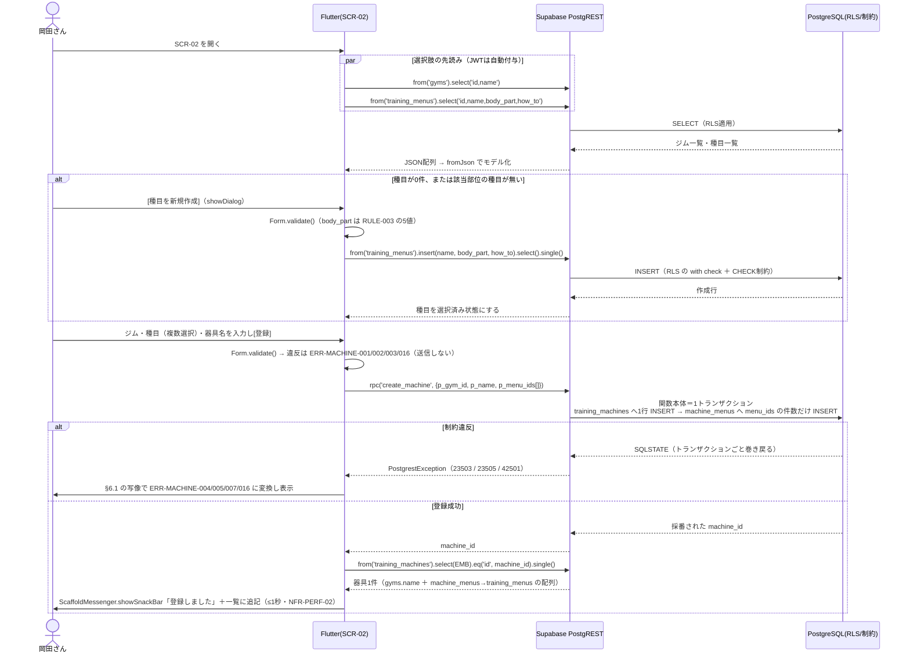

# FEAT-01 器具登録（部位タグ付与） 詳細設計

> **目的**: FEAT-01 を実装が迷わない粒度（入出力・バリデーション・クエリ・エラー・画面挙動・実装単位）まで具体化し、TDDの着手点を固定する。
> **書き方**: 実データは書かない。上位の正本（API契約＝`../../30_データ・IF設計/02_API設計.md` ／ 物理DB＝`../01_DB物理設計.md` ／ シーケンス＝`../../40_機能設計/01_シーケンス設計.md`）と矛盾させず、参照はIDで行う。横断方針（エラー分類・トランザクション・冪等・リトライ）は `../07_実装共通設計パターン.md` を正本とし本書では再定義しない。

> ⚠️ **本書はたたき台（2026-08-02 生成）**。岡田さんのレビューで確定する。

> 📖 ID（`FEAT-` `NFR-` `RULE-` 等）の意味は [ID早見表](../../00_ID早見表.md) を参照。

## 目次
1. [概要](#1-概要)
2. [処理フロー](#2-処理フロー)
3. [入出力仕様](#3-入出力仕様)
4. [業務ロジック](#4-業務ロジック)
5. [データアクセス](#5-データアクセス)
6. [エラー処理](#6-エラー処理)
7. [画面挙動・状態別表示](#7-画面挙動状態別表示)
8. [実装単位](#8-実装単位)
9. [テスト観点](#9-テスト観点)
10. [敵対的検証・要確認事項](#10-敵対的検証要確認事項)

## 1. 概要

| 項目 | 内容 |
|---|---|
| 対応要件 | FEAT-01（器具登録・部位タグ付与） |
| 対応画面 | SCR-02 器具登録 |
| 対応API | HTTP の契約は無い。**PostgREST 直接 ＋ RPC** |
| 対象テーブル | `gyms` ／ `training_menus` ／ `training_machines` ／ `machine_menus` |
| 呼び出し一覧 | §3.1（C-01〜C-11） |
| 呼び出し方式 | Edge Function は使わない |
| 参照・単一テーブル操作 | PostgREST 直接 |
| 器具の登録・更新・削除 | RPC。2テーブルに書くため（§2・§5・§10 #1） |
| RPC を採る根拠 | 原子性。`../07_実装共通設計パターン.md §2` の案A |
| 関連ルール | RULE-003（部位タグ5種＝胸/背中/脚/肩/腕） |
| 関連ルール | RULE-004（絞り込みは部位タグ一致のみ。利用側は FEAT-02） |
| 外部連携 | なし（AI不使用の決定的処理・DEC-B01） |
| 性能目標 | 決定的処理は ≤1秒（NFR-PERF-02） |
| 性能目標 | 画面初期表示は ≤2秒（NFR-PERF-01） |
| 状態 | 持たない。ST-01/ST-02 は FEAT-04 の `training_session_details` に属する |
| 優先度 | MUST（`../../30_データ・IF設計/02_API設計.md §2`） |

### 1.1 本機能の位置づけ

FEAT-01 は、岡田さんが通うジムの器具（マシン）を DB に登録する機能である。
あわせて「その器具がどの部位を鍛えるものか」を判別できる状態にする。

ここで作られたデータは FEAT-02（部位→器具の絞り込み）と FEAT-03（AIメニュー提案）の入力になる。
本機能は FEAT-02/03 の唯一のデータ供給源であり、両者の前提となる。
逆向きの経路も1つある。FEAT-03 の提案から［登録］された種目も本機能が作る（§3.3）。

### 1.2 器具と種目は多対多

**1つの器具は1つ以上の部位に対応する**（2026-08-08 決定）。
ケーブルマシンは1台でラットプルダウン（背中）・ケーブルフライ（胸）・トライセプス押し下げ（腕）を行える。
したがって器具の登録は「種目を1つ選ぶ」ではなく **「種目を1件以上選ぶ」** 操作になる。

構造上の前提を先に述べる。正本は `../01_DB物理設計.md §1.3/§1.4`。

| 項目 | 内容 |
|---|---|
| 部位タグ（RULE-003）の保持主体 | `training_menus.body_part` |
| `training_machines` が持たない列 | 部位列。種目への単一FK |
| 器具↔種目の関係 | 中間テーブル `machine_menus` による**多対多** |

| 事実 | 帰結 |
|---|---|
| 器具の部位は `machine_menus` → `training_menus.body_part` を辿って導出する | 「部位タグを付ける」操作の実体は、部位が確定済みの種目を**1件以上**選んで結び付けること |
| 1つの器具に複数の種目が紐づく | 器具の部位は**集合**になる。種目の `body_part` を重複除去したもの |
| 部位は器具に持たない | FEAT-02 の絞り込みが3ホップになる |
| 3ホップの経路 | `training_menus` → `machine_menus` → `training_machines` |
| 器具の登録・更新が2テーブルにまたがる | 単一 INSERT では原子性を取れない。RPC に寄せる（§2・§5） |

この導出関係は §4・§5・§10 で扱う。

### 1.3 旧構成からの変更点

| 項目 | 旧 | 新 |
|---|---|---|
| 経路 | `/api/machines` `/api/menus` `/api/gyms` の Route Handler | Flutter が PostgREST を直接呼ぶ |
| RPC | なし | `/rpc/` 経由で呼ぶ |
| サーバ実装 | あり | アプリとDBの間に無い |
| 旧パス | — | **廃止**する |

## 2. 処理フロー

`../../40_機能設計/01_シーケンス設計.md` に FEAT-01 のシーケンスは無い。本節で新規に定義する。
FEAT-02 の絞り込みシーケンスは同ファイル §4 が正本。

認証は `supabase_flutter` が保持する。
サインイン済みセッションの JWT が全 PostgREST 呼び出しに自動付与される。
アプリ側で明示的にトークンを載せる記述は要らない。



### 2.1 器具の登録を RPC にする理由

器具の登録は `training_machines` 1行 ＋ `machine_menus` 複数行の**2テーブル書き込み**である。

| 方式 | 起きること |
|---|---|
| PostgREST の `insert` を2回並べる | 別トランザクションになる |
| 同上・途中で失敗した場合 | **種目が1件も紐づかない器具**が残る |
| RPC（Postgres 関数）1回 | 単一の暗黙トランザクションで走る。原子性が保証される |

種目0件の器具は部位で引けない。FEAT-02 から見えない器具になるため、この中間状態は許容できない。
したがって器具の登録・更新・削除は **RPC に寄せる**。

`../07_実装共通設計パターン.md §2` は「複数テーブルにまたがる書き込みは案A（RPC）」を横断方針として定める。
本機能はその2例目になる（1例目は FEAT-04（トレーニング記録））。

### 2.2 本節で確定した前提

| 項目 | 内容 |
|---|---|
| 登録後の表示用データ | RPC の戻り（`machine_id`）で PostgREST から1回引き直す |
| 関数から入れ子JSONを返す案 | 採らない。戻り値の形が §3.2 の埋め込み select と二重定義になる `[仮]` |
| 種目作成と器具登録 | 依然として**別の呼び出し**である |
| 同上・中間失敗時 | 種目だけが残る（§10 #1） |
| AI（EXT-01） | 一切呼ばない。NFR-AVAIL-05 の縮退対象外。AI不達時も完全に動作する |
| 入力の強制点 | DB の RLS・CHECK・FK と RPC 関数の中のみ |
| Flutter 側の検証 | 利用者体験のための先出し。防御ではない（§3.5・§5.5） |

## 3. 入出力仕様

本機能に HTTP の契約は無い。定義するのは **PostgREST 呼び出し・RPC 呼び出しの引数と戻り値**である。

| 前提 | 内容 |
|---|---|
| 認証 | `supabase_flutter` のセッション JWT を自動付与 |
| 未サインイン時 | 呼ばない（画面に到達しない） |
| テーブル名・列名 | DB の実体そのまま（snake_case）。`../01_DB物理設計.md` が正本 |
| 可視範囲 | RLS が決める。アプリ側で `user_id` を条件に足さない |
| 戻り値のモデル化 | Dart のモデルクラス＋`fromJson`。zod は使わない（Dart のため） |

### 3.1 呼び出し一覧

まず**どの操作がどちらの方式か**を示す。

| 方式 | 対象の操作 | 理由 |
|---|---|---|
| **RPC**（`/rpc/`） | 器具の登録 C-01・更新 C-03・削除 C-04 | `training_machines` と `machine_menus` の2テーブルに書く（§2） |
| PostgREST 直接 | 器具の参照 C-02・C-11 | 参照のみ |
| PostgREST 直接 | 種目 C-05〜C-08 | 単一テーブルで完結する |
| PostgREST 直接 | ジム C-09・C-10 | 単一テーブルで完結する |

#### 器具（C-01〜C-04・C-11）

| # | 操作 | 呼び出し | 戻り値 | 主なERR |
|---|---|---|---|---|
| C-01 | 1件登録（種目を1件以上紐づけ） | `rpc('create_machine', {p_gym_id, p_name, p_menu_ids})` | 採番された `machine_id` | 001〜005/007/016 |
| C-02 | 一覧（種目・部位を導出して同梱） | `from('training_machines').select(EMB)` ＋ `.eq()`（`gym_id` / 部位） | 器具の配列 | — |
| C-03 | 紐づけ差し替え・改名 | `rpc('update_machine', {p_machine_id, p_gym_id, p_name, p_menu_ids})` | `machine_id`（不在は `null`） | 001〜007/016 |
| C-04 | 削除（紐づけごと） | `rpc('delete_machine', {p_machine_id})` | `machine_id`（不在は `null`） | 006 |
| C-11 | 1件の再取得（登録・更新の直後） | `from('training_machines').select(EMB).eq('id',id).single()` | 器具1件 | 006 |

#### 種目（C-05〜C-08）

| # | 操作 | 呼び出し | 戻り値 | 主なERR |
|---|---|---|---|---|
| C-05 | 一覧 | `from('training_menus').select('id,name,body_part,how_to,created_at')` | 種目の配列 | — |
| C-06 | 1件登録 | `from('training_menus').insert(値).select().single()` | 種目1件 | 008〜010/012 |
| C-07 | 改名・部位変更 | `from('training_menus').update(値).eq('id',id).select()` | 更新行（0件なら不在） | 008〜012 |
| C-08 | 削除（履歴が無い種目のみ） | `from('training_menus').delete().eq('id',id).select('id')` | 削除行（0件なら不在） | 011/013 |

#### ジム（C-09・C-10）

| # | 操作 | 呼び出し | 戻り値 | 主なERR |
|---|---|---|---|---|
| C-09 | 一覧 | `from('gyms').select('id,name,created_at')` | ジムの配列 | — |
| C-10 | 1件登録 | `from('gyms').insert(値).select().single()` | ジム1件 | 014/015 |

- `EMB` は器具の埋め込み select 文字列（§3.2）。
- ジムの更新・削除は現行契約に無い（§10 #7）。
- RPC 3本の定義は `supabase/migrations/*.sql`（§8 #12）に置く。DDL の正本は `../01_DB物理設計.md`。

### 3.2 器具（`training_machines`）

```dart
// C-01 登録（RPC＝1トランザクション。machine_menus への複数行 INSERT を含む）
final machineId = await supabase.rpc('create_machine', params: {
  'p_gym_id':   gymId,
  'p_name':     name,
  'p_menu_ids': menuIds,      // List<int>・1件以上・重複なし
}) as int;

// C-11 直後の再取得（表示用）
final row = await supabase
    .from('training_machines').select(EMB).eq('id', machineId).single();

// EMB: 部位は machine_menus → training_menus 経由でしか取れない（器具は部位列を持たない）
const EMB = 'id, name, created_at, '
            'gym_id, gyms!inner ( name ), '
            'machine_menus!inner ( menu_id, training_menus!inner ( name, body_part ) )';
```

**引数**（C-01。C-03 は `p_machine_id` が加わる）

| キー | 型 | 必須 | 規則 |
|---|---|---|---|
| `p_gym_id` | `int`（bigint） | 必須 | 正の整数。`gyms` に実在すること |
| `p_menu_ids` | `List<int>`（bigint[]） | 必須 | **1件以上**。重複なし |
| `p_menu_ids` の各要素 | — | — | 本人に可視な `training_menus` であること |
| `p_name` | `String` | 必須 | trim 後1〜100文字。制御文字を含まない |

- `p_menu_ids` が空配列のときは関数側で例外を投げる。
- 種目0件の器具は部位で引けず FEAT-02（部位選択と器具絞り込み）から見えない。作らせない（§10 #12）。
- 重複要素は `uq_mm_machine_menu`（`../01_DB物理設計.md §3`）で `23505` になる。
- 重複は関数に入る前に Dart 側でも弾く（§3.5）。

**戻り値**（C-01/C-03 は `int`（`machine_id`）。以下は C-02/C-11 が返す器具1件の形）

| キー | 型 | 備考 |
|---|---|---|
| `id` | `int` | 採番済み |
| `name` | `String` | 保存した原文 |
| `created_at` | `String`（ISO 8601） | — |
| `gym_id` | `int` | — |
| `gyms` | `{ "name": String }` | **入れ子**。旧構成の平坦な `gym_name` ではない |
| `machine_menus` | `[{ "menu_id": int, "training_menus": { "name": String, "body_part": String } }]` | **配列**。1件以上。部位タグの供給元 |

- 入れ子は `TrainingMachine.fromJson` で平坦化する。
- `menuNames`（配列）と `bodyParts`（重複除去した集合）はここで確定する（§4 L-01）。

旧構成との応答形の差は次のとおり。実装時の移植で注意する。

| 旧構成にあった形 | 新構成 |
|---|---|
| トップレベルの `gym_name` `menu_name` `body_part` | **存在しない** |
| 単数の入れ子 `menu_id` `training_menus` | **存在しない** |
| — | 器具の種目は常に配列である |

```dart
// C-02 一覧（ジムで絞り、部位はさらに任意で絞る）
var q = supabase.from('training_machines').select(EMB);
if (gymId != null)    q = q.eq('gym_id', gymId);                                    // ジム絞り込み（§7.3）
if (bodyPart != null) q = q.eq('machine_menus.training_menus.body_part', bodyPart); // 埋め込み列での絞り込み
final rows = await q;   // 並び替えは §5 参照
```

| 事項 | 内容 |
|---|---|
| `gym_id` の絞り込み | **2026-08-08 決定でジムを選んで絞る**（FEAT-02 §7）。親テーブルの列なので `!inner` は要らない |
| ジムが1件のとき | 選択UIを出さず `gymId` を渡さない `[仮]`。結果は同じになる |
| 埋め込み列での絞り込み | 経路上の全段に `!inner` が要る（`machine_menus!inner` ＋ `training_menus!inner`） |
| 外部結合のままだと | 親行が残る |
| 部位で絞ったとき | 器具に紐づく種目のうち**一致した分だけ**が `machine_menus` 配列に残る |
| 対応部位の全体を出す画面 | 絞り込みなしで引く |
| 部位・ジムのフィルタの契約 | FEAT-02 が正本。本書では呼び出し形のみ示す |

```dart
// C-03 更新（全置換。部分更新は設けない） / C-04 削除。いずれも RPC＝1トランザクション
final updatedId = await supabase.rpc('update_machine', params: {
  'p_machine_id': machineId, 'p_gym_id': gymId, 'p_name': name, 'p_menu_ids': menuIds,
});   // null → ERR-MACHINE-006

final deletedId = await supabase.rpc('delete_machine', params: {'p_machine_id': machineId});
// null → ERR-MACHINE-006。machine_menus の子行は FK の ON DELETE CASCADE で消える
```

**重要な挙動差**: 対象行が無い場合、PostgREST も RPC も**例外を投げない**。

| 呼び出し | 対象が無いときの戻り |
|---|---|
| PostgREST | 空配列 |
| RPC | `null` |

旧構成の 404 に相当する判定は `isEmpty` / `null` の明示チェックで行う（§6.1）。

### 3.3 種目（`training_menus`） — 部位タグ（RULE-003）の保持主体

```dart
// C-06 登録
final row = await supabase.from('training_menus')
    .insert({'name': name, 'body_part': bodyPart, 'how_to': howTo})  // how_to は null 可
    .select('id, name, body_part, how_to, created_at').single();
```

| キー | 型 | 必須 | 規則 |
|---|---|---|---|
| `name` | `String` | 必須 | trim 後1〜100文字 |
| `body_part` | `String` | 必須 | 胸/背中/脚/肩/腕。`../01_DB物理設計.md §4` の CHECK と同値 |
| `how_to` | `String?` | 任意 | 0〜1000文字。null 許容 |
| `user_id` | — | — | **アプリから送らない**。uuid（`auth.uid()` と同値）。RLS の `WITH CHECK (user_id = auth.uid())` で本人を強制する。既定値の指定は `[仮]` |

- `user_id` をクライアントが指定できると、他人の行を作れてしまう。
- したがって列は送らず DB 側で決める（§5.5）。
- **AI提案（FEAT-03）から［登録］された種目もこの C-06 で作る。** 種目の登録は本機能の責務である。
- 提案そのものは保存されない。登録した1件だけが `training_menus` に残る（FEAT-03 §7）。
- C-07 は全置換。
- **C-08 は履歴がある種目では失敗する**（`23503`・§6.1・ERR-MACHINE-013）。
- 器具との紐づけ（`machine_menus`）は CASCADE で消えるため、削除を止めない。

### 3.4 ジム（`gyms`）

```dart
// C-10 登録 / C-09 一覧
final row  = await supabase.from('gyms').insert({'name': name})
                 .select('id, name, created_at').single();
final rows = await supabase.from('gyms').select('id, name, created_at').order('name');
```

| キー | 型 | 必須 | 規則 |
|---|---|---|---|
| `name` | `String` | 必須 | trim 後1〜100文字 |

### 3.5 バリデーション規則（二層）

検証は **Flutter 側（先出し）** と **DB 側（強制）** の二層で行う。
Flutter 側は体験のため、DB 側は防御のためである。

| 項目 | Flutter 側 | DB 側 | 違反時 |
|---|---|---|---|
| `training_machines.name` | `TextFormField.validator`（必須・trim・NFKC 後1〜100文字・制御文字排除） | なし（型は `text`） | ERR-MACHINE-001 |
| `gym_id` | `DropdownButtonFormField.validator`（未選択を弾く） | NOT NULL ＋ FK | ERR-MACHINE-002 |
| `menu_ids` の件数 | 選択件数が0のとき送信ボタンを無効化＋`errorText` | 関数内で空配列を拒否（`machine_menus` が0行のまま終わらせない） | ERR-MACHINE-003 |
| `menu_ids` の重複 | 選択UIが `Set<int>` のため構造的に起きない。手組みの呼び出し向けに送信前も検査 | `uq_mm_machine_menu` 違反（`23505`） | ERR-MACHINE-016 |
| `gym_id` の実在 | 先読み一覧から選ばせるため通常は発生しない | FK 違反（`23503`） | ERR-MACHINE-004 |
| `menu_ids` の各要素の実在・所有 | 同上 | FK 違反（`23503`）／RLS 違反（`42501`） | ERR-MACHINE-005 |
| `machine_id`（更新・削除） | — | RLS で不可視なら関数が `null` を返す | ERR-MACHINE-006 |
| 器具の重複 `[仮]` | 送信前 SELECT（同一 `gym_id` 内・正規化名） | **現状 UNIQUE 無し**（§10 #4） | ERR-MACHINE-007 |
| `training_menus.name` | `validator`（必須・trim・NFKC 後1〜100文字） | なし | ERR-MACHINE-008 |
| `body_part` | `SegmentedButton` で5値のみ選択可 | CHECK 制約（`23514`） | ERR-MACHINE-009 |
| `how_to` | `validator`（0〜1000文字） | なし | ERR-MACHINE-010 |
| `menu_id`（種目の更新・削除） | — | RLS で不可視なら 0件 | ERR-MACHINE-011 |
| 種目の重複 `[仮]` | 送信前 SELECT（本人の種目内・正規化名） | **現状 UNIQUE 無し**（§10 #4） | ERR-MACHINE-012 |
| 種目の削除可否 | 送信前 SELECT（`training_session_details` の参照件数） | FK 違反（`23503`）。`training_session_details.menu_id` が `ON DELETE NO ACTION` | ERR-MACHINE-013 |
| `gyms.name` | `validator`（必須・trim・NFKC 後1〜100文字） | なし | ERR-MACHINE-014 |
| ジムの重複 `[仮]` | 送信前 SELECT（正規化名） | **現状 UNIQUE 無し**（§10 #4） | ERR-MACHINE-015 |
| 認証 | セッション有無で画面を出し分け | JWT 検証（`PGRST301`／401） | ERR-AUTH-001 |

補足を4点あげる。

| 事項 | 内容 |
|---|---|
| 文字列長の上限（100/1000） | `[仮]`。`../01_DB物理設計.md` の型は `text`（無制限） |
| 同上 | 長さは Flutter 側でしか担保できない |
| `menu_ids` の1件以上 | **関数側でも強制する。** RPC 化により、この検証だけは関数本体に置ける |
| 同上 | `machine_menus` への直接 INSERT/DELETE を GRANT で塞げば、種目0件の器具は構造的に作れなくなる `[仮]`（§10 #12） |
| クライアント検証 | **迂回できる。** JWT を持つ利用者は PostgREST を直接叩ける |
| 同上 | 長さ制限を要件とするなら DB 側の CHECK が要る（§10 #2） |
| 重複判定（`[仮]` 3件） | 送信前 SELECT で行う。同時実行では取りこぼす。要否判断は §10 #4 |

## 4. 業務ロジック

### L-01 部位タグの導出（RULE-003・本機能の中核）

器具は部位列を持たない。器具1件の部位は次の一意な経路でのみ決まる。
**結果は単一値ではなく集合**である。

```
menus(machine)      := { training_menus[mm.menu_id] | mm ∈ machine_menus, mm.machine_id = machine.id }
body_parts(machine) := { m.body_part | m ∈ menus(machine) }        // 重複除去した集合
```

| 事実 | 帰結 |
|---|---|
| `machine_menus` は器具1件につき1行以上（§3.5 で強制） | 部位タグ未設定の器具は作らせない |
| 同上 | RULE-004 の絞り込みで取りこぼしが出ない根拠になる |
| 器具↔種目は多対多 | 1つの器具は1つ以上の部位に属する |
| 同上 | ケーブルマシン＝背中/胸/腕 のように3部位にもなる |
| 同じ器具に同一部位の種目が複数紐づく | 部位の集合は重複除去する |
| 同上 | 器具一覧・絞り込みで同じ器具が2回出ないようにする（FEAT-02 §5） |
| 1台で複数部位を鍛える器具（多機能ラック等） | **中間テーブルでそのまま表現できる** |
| 同上 | 器具行を部位ごとに複製する運用回避は不要になった（§10 #5） |

- 実体は埋め込み select の入れ子読み替えである。
- 次の純関数として切り出し、単体テストの対象にする（NFR-QUAL-01）。
  `Set<BodyPart> resolveBodyParts(List<TrainingMenu> menus)`
- 表示順は RULE-003 の並び（胸/背中/脚/肩/腕）に揃える。`Set` の反復順に依存させない。

### L-02 部位タグ値の検証（RULE-003）

```
parseBodyPart(input) =
  input ∈ { 胸, 背中, 脚, 肩, 腕 } ? input : throw ERR-MACHINE-009
```

- 5値は `../01_DB物理設計.md §4` の CHECK 制約と同一集合。
- Dart の `enum BodyPart` と DB CHECK の二重防御とする。
- **値の正本はDB側**とし、アプリ側で値を増やさない。

### L-03 名称の正規化（重複判定・表記ゆれ対策）

```
normalizeName(raw) = collapseSpaces( trim( NFKC(raw) ) )
```

- 全角/半角・連続空白の差を吸収した比較キーを作る純関数。
- **保存する値は正規化前の原文**とする。表示は利用者の入力どおり。
- 正規化結果は重複判定と検索時の比較にのみ使う。
- Dart には NFKC 正規化が標準で無い。`characters` では足りず、外部パッケージまたは自前実装が要る `[仮]`。
- 大文字小文字の畳み込み（英字マシン名）を行うかは未定 → §10 #8。

### L-04 登録前提の判定（登録順序の依存）

| 条件 | 画面の振る舞い |
|---|---|
| `gyms` が0件 | 器具登録フォームを無効化し、ジム登録へ誘導（§7） |
| `training_menus` が0件 | 器具登録フォームを無効化し、種目作成ダイアログを開く導線を出す |
| 選択中の部位に該当する種目が0件 | 種目リストを空で表示し、「この部位の種目を作成」を提示 |
| 種目を1件も選んでいない | [登録]を非活性にする（ERR-MACHINE-003 を出す前に押させない） |

- 判定は取得済みの一覧件数で行う純関数 `bool canRegisterMachine(int gymCount, int menuCount)` とする。
- DB 側の FK 違反（ERR-MACHINE-004/005）は最終防衛線に留める。

### L-05 種目選択の検証（多対多で新たに要る判定）

```
validateMenuSelection(ids) =
  ids.isEmpty            → throw ERR-MACHINE-003
  ids.toSet().length < ids.length → throw ERR-MACHINE-016
  otherwise              → ids
```

| 事実 | 帰結 |
|---|---|
| 選択UIは `Set<int>` で保持する（§7） | 重複は構造的に起きない |
| 同上 | ERR-MACHINE-016 は手組みの呼び出しに対する防御 |
| 件数の上限は設けない | 器具に紐づく種目数の上限は業務要件に無い |
| 同上 | 上限を置くなら §10 #12 で確定する |

- 純関数 `List<int> validateMenuSelection(List<int> ids)` として切り出す。単体テスト対象。
- 部位ごとに種目を絞って選ばせるが、**選択は部位をまたいで累積する**。
- ケーブルマシンの登録では「背中→ラットプルダウン」「胸→ケーブルフライ」を順に選べる（§7）。

## 5. データアクセス

PostgREST は呼び出しを SQL に変換して実行する。
実装が書くのは Dart 側の呼び出しである。
ただし性能と INDEX の議論には、発行される SQL の形が要る。以下に対応を示す。

### 5.1 呼び出し（Dart）

```dart
// L-04: SCR-02 初期表示。選択肢を2本の SELECT で先読み（いずれもRLS適用）
await supabase.from('gyms').select('id, name').order('name');
await supabase.from('training_menus')
    .select('id, name, body_part, how_to').order('body_part').order('name');

// C-01 器具の登録（RPC＝1トランザクション。2テーブルへ書く）
await supabase.rpc('create_machine',
    params: {'p_gym_id': g, 'p_name': n, 'p_menu_ids': ids});

// C-08 種目の削除可否の事前確認（利用者への件数提示用。強制は DB の FK）
await supabase.from('training_session_details')     // 1件でもあれば削除できない（NO ACTION）
    .select('id').eq('menu_id', menuId).count(CountOption.exact);
await supabase.from('machine_menus')                // 削除は止めない。消える紐づけの台数を出すため
    .select('id').eq('menu_id', menuId).count(CountOption.exact);
```

| 参照元 | `ON DELETE` | 種目の削除への影響 |
|---|---|---|
| `training_session_details` | NO ACTION | **削除できない**。`23503` → ERR-MACHINE-013 |
| `machine_menus` | CASCADE | 紐づけだけが消える。削除は通る |

### 5.2 RPC 3本の本体（SQL）

```sql
-- C-01 create_machine の本体（1トランザクション。SECURITY INVOKER で RLS を効かせたまま）
INSERT INTO training_machines (gym_id, name) VALUES (p_gym_id, p_name) RETURNING id;
INSERT INTO machine_menus (machine_id, menu_id)
SELECT <採番されたid>, x FROM unnest(p_menu_ids) AS x;      -- 件数分の行を1文で入れる

-- C-03 update_machine の本体（紐づけは全置換）
UPDATE training_machines SET gym_id = p_gym_id, name = p_name WHERE id = p_machine_id;
DELETE FROM machine_menus WHERE machine_id = p_machine_id;
INSERT INTO machine_menus (machine_id, menu_id)
SELECT p_machine_id, x FROM unnest(p_menu_ids) AS x;

-- C-04 delete_machine の本体（machine_menus の子行は FK の ON DELETE CASCADE で消える）
DELETE FROM training_machines WHERE id = p_machine_id RETURNING id;
```

### 5.3 器具一覧が発行する SQL（3ホップ）

```sql
-- C-02 が PostgREST 内部で発行するクエリの形（部位は machine_menus 経由で導出＝3ホップ）
SELECT mc.id, mc.name, mc.created_at, mc.gym_id,
       g.name AS "gyms.name",
       mm.menu_id AS "machine_menus.menu_id",
       mn.name AS "training_menus.name", mn.body_part AS "training_menus.body_part"
  FROM training_machines mc
  JOIN gyms          g  ON g.id  = mc.gym_id
  JOIN machine_menus mm ON mm.machine_id = mc.id   -- 器具1件につき1行以上
  JOIN training_menus mn ON mn.id = mm.menu_id     -- ここが部位タグの供給元
 WHERE (mc.gym_id = $1 OR $1 IS NULL)
   AND (mn.body_part = $2 OR $2 IS NULL);
```

| 事項 | 内容 |
|---|---|
| 上の平坦形の性質 | **器具1件が種目の件数だけ行を返す** |
| PostgREST の埋め込み select | これを器具1件のネスト形に畳んで返す。アプリ側で重複行は見えない |
| 平坦形を自分で書く場合 | `DISTINCT` または集約が要る（FEAT-02 §5・§10 #13） |

### 5.4 対象テーブルと INDEX

| テーブル | 本機能での操作 |
|---|---|
| `training_machines` | INSERT / SELECT / UPDATE / DELETE |
| `machine_menus` | INSERT / SELECT / DELETE |
| `training_menus` | INSERT / SELECT / UPDATE / DELETE |
| `gyms` | SELECT / INSERT |
| `training_session_details` | SELECT（削除可否の件数提示のみ） |

INDEX の正本は `../01_DB物理設計.md §3`。

| INDEX | 効く場面 | 有無 |
|---|---|---|
| `uq_mm_machine_menu(machine_id, menu_id)` | 器具→種目の結合。重複防止 | あり |
| `ix_mm_menu(menu_id)` | 種目→器具の逆引き（FEAT-02・種目の削除可否判定） | あり |
| `training_machines(gym_id)` | ジムでの絞り込み（2026-08-08 決定で常用する） | **無い**（§10 #6） |

- PostgreSQL は FK列に自動でINDEXを作らない。

### 5.5 RLS

方針は ADR-0005 で確定した。正本は `../01_DB物理設計.md §3`。

| 区分 | 本機能で触るテーブル | ポリシー |
|---|---|---|
| 本人のみ | `training_menus` | `user_id = auth.uid()` |
| 共通マスタ | `gyms` / `training_machines` | `TO authenticated USING (true)` |
| 親経由 | `machine_menus` | `menu_id` の所有者が本人（`EXISTS`） |

- `users.id` は uuid で `auth.users.id` と一致する。`auth.uid()` と直接比較できる（案A）。
- したがって `training_menus.user_id` も uuid になる。
- 器具・ジムは所有者列を持たない。**共通マスタとして全員で共有する**（§10 #2）。
- 中間テーブル経由の間接ポリシーは器具には張らない。

`machine_menus` のポリシーだけが1段深い。

```sql
EXISTS (SELECT 1 FROM training_menus m
         WHERE m.id = machine_menus.menu_id
           AND m.user_id = auth.uid())
```

- `FOR SELECT/INSERT/UPDATE/DELETE` の分割と `WITH CHECK` の書き分けは `[仮]`。
- 全テーブルで `ENABLE ROW LEVEL SECURITY` を入れる。

> ⚠️ 要確認（人間判断）: 共通マスタは認証済みなら誰でも読み書きできる（🟡 中）。
>
> - 対象は `gyms` と `training_machines`。誤って他人の器具名を書き換えられる。
> - 単一ユーザー運用（NFR-SCALE-01）では実害が無いと評価した。
> - Phase2 でマルチユーザーにするなら、所有者列か更新権限の見直しが要る。

### 5.6 並び順・トランザクション境界・冪等性

**並び順**

| 事項 | 内容 |
|---|---|
| 望む並び | ジム名 → 部位 → 器具名 |
| PostgREST の `order` | **表現できない**。親テーブルの列でしか並べられない |
| 代表部位 | 部位が集合になったため、並びに使う値の決め方も Dart 側の判断 |
| 方針 | Dart 側でソートする `[仮]` |
| 件数が増えたら | ビュー化を検討（§10 #11） |

**トランザクション境界**

| 操作 | 境界 |
|---|---|
| 器具の登録・更新・削除 | **RPC 1回＝1トランザクション**（`training_machines` ＋ `machine_menus`） |
| 種目・ジムの登録 | 単一INSERTで完結。PostgREST 直接のまま |
| 種目を作ってそのまま器具を登録（SCR-02） | **2呼び出し＝2トランザクション**。中間失敗時は種目だけが残る（§10 #1） |

**冪等性・リトライ**

| 事項 | 内容 |
|---|---|
| 正本 | `../07_実装共通設計パターン.md` |
| 本機能の性質 | AI非依存。全操作が同期・低コスト |
| 制約 | AI系のような自動リトライ禁止の制約は受けない |

### 5.7 紐づけの差し替え方式

**全置換（DELETE → INSERT）を採る。** 理由は3つ。

- §3 の更新契約が全置換である。
- 差分計算をアプリにも SQL にも持たせない。
- RPC の中なので中間の「種目0件の器具」は他から見えない。

紐づけ差し替えの2案を比較した結果は次のとおり。

| 案 | 内容 |
|---|---|
| **A（採用）全置換** | `DELETE FROM machine_menus WHERE machine_id = ?` → `p_menu_ids` を全件 INSERT |
| B 差分 | 既存の `menu_id` 集合と比較し、削除分だけ DELETE・追加分だけ INSERT |

| 案 | 評価 |
|---|---|
| A | 実装が1本道。器具の更新契約（全置換）と一致する |
| A | RPC 内なので原子性がある |
| A | `created_at` が毎回更新される（§10 #16） |
| B | `created_at` を保てる |
| B | 集合演算を SQL 側に書くことになる |
| B | 保つ価値のある情報が無いため採らない |

> ~~要確認（人間判断）: RLSポリシー内の「本人」の表現は未確定の既知論点である。~~（**解決**）
>
> - ~~論点は `auth.uid()` と `users.id` の型が揃っていないことだった。~~
> - **案A で確定（ADR-0005）。** `users.id` を uuid にして `auth.users.id` と一致させた。
> - 「本人」は `auth.uid()` との直接比較で書ける（§5.5）。正本は `../01_DB物理設計.md §3`。

## 6. エラー処理

中間層が無いため、エラーの一次表現は **`PostgrestException`** である。HTTP ステータスではない。
写像は1箇所（§8 #10）に閉じ込め、画面には ERR-ID だけを渡す。

### 6.1 `PostgrestException` → ERR-ID の写像

| 検知 | SQLSTATE / code | 判別材料 | 写像先 ERR-ID |
|---|---|---|---|
| FK違反 | `23503` | 制約名 `training_machines_gym_id_fkey` `[仮]` | ERR-MACHINE-004 |
| FK違反 | `23503` | 制約名 `machine_menus_menu_id_fkey` `[仮]` | ERR-MACHINE-005 |
| FK違反 | `23503` | 種目の削除時。参照元は `training_session_details`（`NO ACTION`） | ERR-MACHINE-013 |
| RLS違反 | `42501` | INSERT/UPDATE が `with check` を満たさない | ERR-MACHINE-005（他人所有の種目を指した） |
| CHECK違反 | `23514` | 制約名に `body_part` を含む `[仮]` | ERR-MACHINE-009 |
| 一意制約違反 | `23505` | 制約名 `uq_mm_machine_menu` | ERR-MACHINE-016（`p_menu_ids` に重複がある） |
| 一意制約違反 | `23505` | 制約名（`gyms`/`menus`/`machines` のどれか） | ERR-MACHINE-007 / 012 / 015 |
| 関数が投げた例外 | `P0001`（`RAISE EXCEPTION`） | メッセージ本文 `[仮]` | ERR-MACHINE-003（`p_menu_ids` が空） |
| 0件（`.single()`） | `PGRST116` | 対象テーブル | ERR-MACHINE-006 / 011 |
| **例外なしで空配列・`null`** | — | `delete` の戻りが `isEmpty`／RPC の戻りが `null` | ERR-MACHINE-006 / 011 |
| JWT 期限切れ・不正 | `PGRST301` / 401 | — | ERR-AUTH-001 |
| 通信断・タイムアウト | 例外型（`SocketException` 等） | — | `../07_実装共通設計パターン.md` の共通方針に従う |

- 通信断・タイムアウトについて、本書で新しい ERR-ID は起こさない。
- SQLSTATE → HTTP の写像の正本は `../07_実装共通設計パターン.md §1`（2026-08-08 確定）。
- 本機能に関わる値は3つ。`23503` と `23505` は **409**、`42501` は **401 または 403** で返る。
- **`23503` を 400 系として扱わない。** 「使用中で削除できない」は業務エラーだが HTTP は 409 である。

#### 判別で注意する点

| 事項 | 内容 |
|---|---|
| `23503` は code だけでは区別できない | `gym_id`（`training_machines`）か `menu_id`（`machine_menus`）かは制約名で判別する |
| 制約名の入手元 | `PostgrestException.details`（2026-08-08 確定）。`code` には入らない |
| 設定に依存する | `client-error-verbosity` が `minimal` だと `details` が返らず判別できない（§10 #17） |
| 種目の削除で `23503` が出る先 | `training_session_details_menu_id_fkey` のみ `[仮]`。`machine_menus` は CASCADE で発火しない |
| 制約名は DB の実体に依存する | だから `[仮]`。マイグレーションで明示命名するのが確実 |
| `23505` は `machine_menus` でのみ発火する | `uq_mm_machine_menu` が唯一の一意制約 |
| UNIQUE が無いテーブル | `gyms` `training_menus` `training_machines`（`../01_DB物理設計.md §3`） |
| したがって ERR-MACHINE-007/012/015 | 当面は送信前 SELECT でしか検知できない |
| DB に UNIQUE を足せば | `23505` で確実に取れる（§10 #4） |
| RPC の例外も `PostgrestException` で届く | 関数内の `RAISE EXCEPTION` は SQLSTATE `P0001` になる |
| メッセージ本文での判別は脆い | 関数側で独自 SQLSTATE を割り当てる案を `[仮]` とする（§10 #12） |
| 独自 SQLSTATE の効き方 | `PTxyz` の **xyz 3桁がそのまま HTTP ステータス**になる（2026-08-08 確定）。`PT409` なら 409 |
| 同上・採否 | 仕組みは成立する。使うかどうかは §10 #12 の判断である |
| 0件を例外にしない挙動に注意 | `delete` は対象が無くても成功扱い。RPC は `null` を返す |
| 対策 | `.select()` を必ず付け、戻りの空判定・`null` 判定を書く |
| 書き忘れると | 「消えたように見えて消えていない」不具合になる |

### 6.2 ERR-ID 一覧

| ERR-ID | 検知層 | 発生条件 | 利用者向けメッセージ（意図） | retryable | ログ |
|---|---|---|---|---|---|
| ERR-AUTH-001 | Supabase | セッション無効（共通契約） | 再ログインを促す | false | 認証失敗を記録（NFR-SEC-AUDIT-02） |
| ERR-MACHINE-001 | Flutter | 器具名が空・長さ超過・制御文字混入 | 器具名の入力し直しを促す | false | warn（値はマスクせず長さのみ） |
| ERR-MACHINE-002 | Flutter | `gym_id` が未選択 | ジムの選択し直しを促す | false | warn |
| ERR-MACHINE-003 | Flutter ＋ DB（`P0001`） | 種目が1件も選択されていない（`menu_ids` が空） | 種目を1件以上選ぶよう促す | false | warn |
| ERR-MACHINE-004 | DB（`23503`） | `gym_id` に該当するジムが無い | 選択したジムが見つからない旨と再読込を促す | false | warn（一覧の陳腐化が疑われる） |
| ERR-MACHINE-005 | DB（`23503`/`42501`） | `menu_ids` に該当する種目が無い、または本人所有でないものが含まれる | 選択した種目が見つからない旨と再読込を促す | false | warn（他人所有の存在を示唆しない） |
| ERR-MACHINE-006 | Flutter（空配列・`null`） | 更新・削除対象の器具が無い（RLS不可視を含む） | 対象が見つからない旨 | false | warn |
| ERR-MACHINE-007 | Flutter（事前SELECT） `[仮]` | 同一ジム内に同名の器具が既存 | 既に登録済みである旨と既存行への誘導 | false | info |
| ERR-MACHINE-008 | Flutter | 種目名が空・長さ超過 | 種目名の入力し直しを促す | false | warn |
| ERR-MACHINE-009 | Flutter ＋ DB（`23514`） | `body_part` が RULE-003 の5値以外 | 部位の選択し直しを促す | false | warn（enum外値を記録） |
| ERR-MACHINE-010 | Flutter | `how_to` が長さ超過 | やり方メモの短縮を促す | false | warn |
| ERR-MACHINE-011 | Flutter（空配列） | 更新・削除対象の種目が無い（RLS で不可視な他人の種目を含む） | 対象が見つからない旨 | false | warn |
| ERR-MACHINE-012 | Flutter（事前SELECT） `[仮]` | 本人の種目に同名が既存 | 既に登録済みである旨 | false | info |
| ERR-MACHINE-013 | DB（`23503`） | 削除対象の種目がトレーニング明細（`training_session_details`）から参照中。FK 違反を検知して伝える | 履歴があるため削除できない旨と参照件数の提示 | false | warn（参照元と件数を記録） |
| ERR-MACHINE-014 | Flutter | ジム名が空・長さ超過 | ジム名の入力し直しを促す | false | warn |
| ERR-MACHINE-015 | Flutter（事前SELECT） `[仮]` | 同名のジムが既存 | 既に登録済みである旨 | false | info |
| ERR-MACHINE-016 | Flutter ＋ DB（`23505`） | `menu_ids` に同じ種目が2回以上含まれる | 同じ種目は1回だけ選べる旨 | false | warn（重複件数のみ記録） |

### 6.3 画面への渡し方とログ

| 事項 | 内容 |
|---|---|
| 画面へ渡すもの | ERR-ID とメッセージだけ |
| UI に出さないもの | `PostgrestException` そのもの |
| 分類・握り潰し禁止の原則 | `../07_実装共通設計パターン.md` が正本 |
| ログの出し先 | Flutter 側。1行1JSON・`service` は `okada-fit-app`（`../05_ログ設計.md`） |
| サーバ側ログ | **残らない**。本機能は Edge Function を経由しない |
| DB 側の失敗 | Supabase の Postgres ログでしか追えない |
| 多対多化で増えた検知 | 2件だけ。重複のみ ERR-MACHINE-016 を新設した |
| 種目0件 | 既存の ERR-MACHINE-003 に統合（「未選択」→「1件も選択されていない」） |
| 採番範囲 | ERR-MACHINE-001〜016 は 001〜019 に収める |
| 020以降 | FEAT-02 が使用する（ERRドメインを共有） |

> ERRの完全列挙の正本は `../../60_テスト設計/02_RED母集合_受入基準・状態・エラー.md`（段6で集約）。本表はその入力とする。

## 7. 画面挙動・状態別表示

SCR-02（器具登録）は Flutter の1画面（`Scaffold`）である。ウィジェットは Material 3 を用いる。

### 7.1 状態別の表示

| 状態 | 表示 | 操作可否 |
|---|---|---|
| 初期/空（ジム0件） | `MaterialBanner`（info）「まずジムを登録してください」＋`FilledButton`「ジムを登録」 | 器具登録フォームは無効（`enabled: false`） |
| 同上・押下時 | `showDialog`（`TextFormField` name） | — |
| 初期/空（種目0件） | `MaterialBanner`（info）「まず種目を登録してください」＋`FilledButton`「種目を作成」 | 器具登録フォームは無効 |
| 同上・押下時 | `showDialog`（`TextFormField` name／`SegmentedButton` body_part／`TextFormField(maxLines: 4)` how_to） | — |
| 読込中 | 一覧は `shimmer`（行数分）。ドロップダウンは `enabled: false`＋末尾に `CircularProgressIndicator(strokeWidth: 2)` | 入力不可 |
| 入力中 | ウィジェット構成は §7.2 | 全項目充足かつ種目が1件以上で `FilledButton`「登録」が有効 |
| 種目未選択 | 種目リストの下に `Text`（エラー配色）「種目を1件以上選んでください」（ERR-MACHINE-003 に対応） | [登録]は非活性 |
| 送信中 | `FilledButton` の `onPressed` を `null` にし、ラベルを `CircularProgressIndicator` に差し替える | 再送信不可（二重送信防止） |
| 成功 | `ScaffoldMessenger.showSnackBar`（「登録しました」）＋一覧（`ListView`）に追記 | 継続入力可（器具名と種目選択をクリア） |
| 同上・一覧の行 | `ListTile`。導出した部位を `Wrap` ＋ `Chip` の**複数**で表示 | — |
| 一覧（ジムが2件以上） | 一覧の上に `DropdownButtonFormField` を置き、選んだジムの器具だけを出す `[仮]` | ジム切替可 |
| 一覧（ジムが1件） | ジムの選択UIを出さない。そのジムの器具だけを出す `[仮]` | — |
| エラー（入力起因） | 該当ウィジェットに `errorText` 相当を表示（ERR-MACHINE-001/002/003/008/009/010/014/016） | 修正して再送信可 |
| エラー（DB起因） | `ScaffoldMessenger.showSnackBar`（エラー配色）＋一覧の再取得（ERR-MACHINE-004〜007/011〜016） | 再送信可 |
| エラー（認証） | サインイン画面へ遷移（`../../30_データ・IF設計/03_ドメインイベント.md §4` の共通挙動） | 操作不可 |
| 削除確認 | `showDialog`（`AlertDialog` で確認）。種目の削除では、同時に消える器具の紐づけ台数を併記する | — |
| 同上・履歴がある種目 | 「この種目は記録に使われているため削除できません」＋参照件数を提示して中止（ERR-MACHINE-013） | 削除は実行しない |

### 7.2 入力中のウィジェット構成

| 入力項目 | ウィジェット |
|---|---|
| ジム | `DropdownButtonFormField` |
| 部位 | `SegmentedButton`（RULE-003 の5値） |
| 種目 | 部位で絞ったリストを **`CheckboxListTile` で複数選択** |
| 選択済みの種目 | 入力欄の下に `Wrap` ＋ `InputChip`（`onDeleted` で解除）で常時表示 |
| 器具名 | `TextFormField` |
| 検証 | `Form` ＋ `TextFormField.validator` でフィールド単位に即時検証 |
| 検証タイミング | `autovalidateMode: onUserInteraction` |

### 7.3 画面設計の判断

| 事項 | 内容 |
|---|---|
| 画面の役割 | SCR-02 は器具一覧の閲覧と登録を同一画面で行う |
| 部位 `SegmentedButton` の役割 | ここでは**種目リストの絞り込み用**である |
| 一覧側の部位絞り込み（RULE-004） | 契約は FEAT-02 が正本 |
| 一覧側のジム絞り込み | **ジムを選んで絞る**（2026-08-08 決定）。UI は `DropdownButtonFormField` `[仮]` |
| 同上・ジムが1件のとき | 選択UIを出さない `[仮]`。挙動の正本は FEAT-02 §7 |
| 同上・登録フォームとの関係 | 一覧の絞り込みと登録フォームのジム欄は別物である（§7.2） |
| 同上・既定値 | 登録フォームのジムは、一覧で選んでいるジムを初期値にする `[仮]` |
| **部位を切り替えても種目の選択は保持する** | 部位をまたいで種目を選ぶ操作を1画面で完結させるため（§4 L-05） |
| 選択済みチップの置き場 | 絞り込みの外に置く |
| 選択の内部表現 | `Set<int>`。`value` は `selected.contains(menu.id)`、`onChanged` は集合への追加・削除 |
| 同上の効果 | 重複（ERR-MACHINE-016）は UI からは起こらない |
| `FilterChip` の横並び案 | 種目名は長くなりやすく折り返しが読みにくい |
| 既定 | `CheckboxListTile` の縦リストとする `[仮]` |
| 一覧の並び | ジム名 → 部位 → 器具名。**この並びは Dart 側で行う**（§5.6） |
| 並びに使う部位 | 器具が複数部位を持つため、RULE-003 の並びで最も先に来るものを代表値とする `[仮]` |
| 一覧の形 | 表ではなく `ListView`＋`ListTile`。モバイル1カラムのため |
| 各行の `subtitle` | 種目名と部位の `Chip` を `Wrap` で並べる |

## 8. 実装単位

| # | ファイル | 役割 | 主なシグネチャ |
|---|---|---|---|
| 1 | `app/lib/features/equipment/equipment_page.dart` | SCR-02 器具登録画面（一覧＋登録） | `class EquipmentPage extends StatelessWidget` |
| 2 | `app/lib/features/equipment/equipment_form.dart` | 登録フォーム（`Form` ＋ validator・§3.5 の Flutter 側） | `class EquipmentForm extends StatefulWidget` |
| 3 | `app/lib/features/equipment/menu_create_dialog.dart` | 種目作成ダイアログ（部位タグの確定） | `Future<TrainingMenu?> showMenuCreateDialog(BuildContext c)` |
| 4 | `app/lib/features/equipment/equipment_controller.dart` | 画面状態（読込中/送信中/エラー）と一覧のソート | `class EquipmentController extends ChangeNotifier` |
| 5 | `app/lib/data/machine_repository.dart` | 器具の書き込みは RPC（C-01/C-03/C-04）、参照は PostgREST（C-02/C-11） | `Future<TrainingMachine> insert({required int gymId, required List<int> menuIds, required String name})` / `Future<List<TrainingMachine>> fetch({int? gymId, String? bodyPart})` / `Future<TrainingMachine> update({required int id, required int gymId, required List<int> menuIds, required String name})` / `Future<void> delete(int id)` |
| 6 | `app/lib/data/menu_repository.dart` | `training_menus` の PostgREST アクセス（C-05〜C-08） | `Future<TrainingMenu> insert({required String name, required BodyPart bodyPart, String? howTo})` / `Future<int> countReferences(int menuId)` |
| 7 | `app/lib/data/gym_repository.dart` | `gyms` の PostgREST アクセス（C-09/C-10） | `Future<List<Gym>> fetchAll()` / `Future<Gym> insert({required String name})` |
| 8 | `app/lib/domain/models/training_machine.dart` | モデル＋`fromJson`（`machine_menus` の配列を平坦化し、種目と部位を集合で持つ） | `factory TrainingMachine.fromJson(Map<String, dynamic> json)` / `List<TrainingMenu> get menus` / `Set<BodyPart> get bodyParts` |
| 9 | `app/lib/domain/machines.dart` | 純関数（L-01〜L-05・単体テスト対象） | `Set<BodyPart> resolveBodyParts(List<TrainingMenu> menus)` / `String normalizeName(String raw)` / `bool canRegisterMachine(int gymCount, int menuCount)` / `List<int> validateMenuSelection(List<int> ids)` |
| 10 | `app/lib/data/postgrest_error_mapper.dart` | `PostgrestException` → ERR-ID の写像（§6.1 を単一ソース化）。RPC 由来の `P0001` も同じ入口で扱う | `AppError mapPostgrestError(Object e, {required PostgrestOp op})` |
| 11 | `app/lib/data/supabase_client.dart` | `SupabaseClient` の取得（既存・本機能では利用のみ） | `SupabaseClient get supabase` |
| 12 | `supabase/migrations/*.sql` | **器具の RPC 3本**（`create_machine` / `update_machine` / `delete_machine`・`SECURITY INVOKER`）＋ RLS ポリシー・制約命名 | — |
| 12 | 同上 | テーブルと INDEX の DDL の正本は `../01_DB物理設計.md`。本書ではスキーマを追加しない | — |
| 13 | `app/lib/features/equipment/menu_multi_select.dart` | 種目の複数選択UI（`CheckboxListTile` ＋ 選択済み `InputChip`・§7） | `class MenuMultiSelect extends StatelessWidget { final Set<int> selected; final ValueChanged<Set<int>> onChanged; }` |

| 判断 | 内容 |
|---|---|
| 部位導出の正本 | **埋め込み select（SQL側のJOIN）**。`resolveBodyParts` は取得済みモデルからの読み替えに限定する。二重実装にしない |
| 検証ロジックの置き場 | 正規化・件数判定・種目選択の検証は #9 の純関数に集約する。ウィジェットに書かない |
| エラー写像の置き場 | #10 のみ。リポジトリもウィジェットも `PostgrestException` を直接見ない |
| 原子性の置き場 | #12 の RPC のみ。リポジトリ（#5）で INSERT を2回並べない |
| 同上 | `machine_menus` を直接書くコードをアプリに置かない |

## 9. テスト観点

| TC-ID | 観点 | 期待 |
|---|---|---|
| TC-FEAT01-01 | 正常系: ジム・種目が既存の状態で器具を登録（種目1件） | 登録行が返る。`bodyParts` が選択した種目の `body_part` 1件と一致 |
| TC-FEAT01-02 | 部位導出（L-01） | 器具に部位列が無くても、一覧取得の全件に1件以上の `bodyParts` が付く |
| TC-FEAT01-03 | 器具名が空文字・空白のみ | ERR-MACHINE-001。`Form.validate()` で止まり PostgREST を呼ばない |
| TC-FEAT01-04 | `menu_ids` に他人所有の種目が含まれる | ERR-MACHINE-005（`23503` または `42501`）。存在有無を示唆しない文言。器具行も作られない |
| TC-FEAT01-05 | `gym_id` が存在しない | ERR-MACHINE-004（`23503`） |
| TC-FEAT01-06 | `body_part` が RULE-003 の5値以外（L-02） | ERR-MACHINE-009。UI からは選べず、直接呼び出しでも DB CHECK（`23514`）で弾かれる |
| TC-FEAT01-07 | 名称正規化（L-03） | 全角/半角・連続空白違いの同一名が重複と判定される |
| TC-FEAT01-08 | 同一ジム内の同名器具 `[仮]` | ERR-MACHINE-007。現状は事前SELECTでのみ検知（UNIQUE 未設定・§10 #4） |
| TC-FEAT01-09 | 器具から参照中（履歴は無い）の種目を削除 | 削除できる。`machine_menus` の行は CASCADE で消え、器具行は残る（種目0件になりうる・§10 #12） |
| TC-FEAT01-10 | トレーニング明細から参照中の種目を削除 | ERR-MACHINE-013（`23503`）。削除されず履歴（`training_session_details`）が壊れない |
| TC-FEAT01-11 | 存在しない id で更新・削除 | 例外は出ず空配列・`null` が返り、ERR-MACHINE-006/011 に写像される |
| TC-FEAT01-12 | 性能（NFR-PERF-02） | 器具登録・一覧取得が ≤1秒（AI呼び出しを含まないこと） |
| TC-FEAT01-13 | 登録順序の依存（L-04） | ジム0件・種目0件のとき登録フォームが無効化され、作成導線が出る |
| TC-FEAT01-14 | 種目作成→器具登録の中間失敗 | 器具登録が失敗しても種目は残り、再試行で重複を作らない |
| TC-FEAT01-15 | RLS の実効性 | 他人の JWT で本人の `training_menus` `machine_menus` を SELECT/UPDATE できない（クライアント直叩きを想定した検証） |
| TC-FEAT01-16 | 複数部位の器具を登録（本改訂の中核） | 背中・胸・腕の3種目を選んで1台を登録すると、`machine_menus` が3行作られ、`bodyParts` が3件になる |
| TC-FEAT01-17 | 種目を1件も選ばずに登録 | ERR-MACHINE-003。[登録]が非活性で押せず、RPC を直接叩いても関数が拒否する |
| TC-FEAT01-18 | `menu_ids` に同じ種目を2回渡す | ERR-MACHINE-016（`23505`・`uq_mm_machine_menu`）。器具行も作られない |
| TC-FEAT01-19 | 登録の原子性（RPC） | `machine_menus` の INSERT が失敗すると `training_machines` の行も残らない。**種目0件の器具が生まれない** |
| TC-FEAT01-20 | 紐づけの差し替え（全置換） | 3種目の器具を2種目に更新すると `machine_menus` が2行になる。外した種目の行が残らない |
| TC-FEAT01-21 | 器具の削除 | `machine_menus` の子行も同時に消える。孤児行が残らない |
| TC-FEAT01-22 | 同一部位の種目を2件持つ器具 | 一覧・絞り込みでその器具が1回だけ出る。`bodyParts` も1件に重複除去される |
| TC-FEAT01-23 | ジムでの一覧の絞り込み（C-02） | 選んだジムの器具だけが返る。他ジムの器具は含まれない |
| TC-FEAT01-24 | AI提案からの種目登録（C-06） | 提案の1件を［登録］すると `training_menus` に1行増える。他の提案は残らない |

受入基準（G/W/T）の候補:
- [AC] Given ジムと部位「胸」の種目が登録済み When 器具名とそのジム・種目を選んで登録する Then 器具が保存され、一覧で部位「胸」として表示される
- [AC] Given 部位「背中」「胸」「腕」の種目が登録済み When 1台の器具に3種目すべてを選んで登録する Then その器具は3部位すべてで絞り込みに現れる
- [AC] Given 器具名とジムを入力済み When 種目を1件も選ばずに登録しようとする Then 登録は実行されず ERR-MACHINE-003 が示される
- [AC] Given 種目が1件も無い状態 When SCR-02 を開く Then 器具登録フォームは無効で、種目作成への導線が表示される
- [AC] Given ある種目がトレーニング明細から参照されている When その種目を削除しようとする Then ERR-MACHINE-013 が返り、履歴が保持される
- [AC] Given 部位「脚」の種目に紐づく器具が登録済み When 部位「脚」で器具を照会する Then その器具が返る（絞り込み契約の正本は FEAT-02）
- [AC] Given ジムが2件登録済み When 一覧でジムを選ぶ Then そのジムの器具だけが一覧に表示される
- [AC] Given AI提案（FEAT-03）が表示されている When 1件を［登録］する Then その種目が種目マスタに追加される

> 受入基準・ST・ERR の**正本は段6**（`../../60_テスト設計/02_RED母集合_受入基準・状態・エラー.md`・本PR対象外）。本節はその母集合への入力。

## 10. 敵対的検証・要確認事項

| # | 論点 | 内容 | 重大度 |
|---|---|---|---|
| 1 | 登録順序の依存が利用者に露出する | 器具登録には `gyms` と `training_menus` が先に要る（`gym_id` は NOT NULL FK、種目は `machine_menus` に1件以上）。初回に3段階を強いる導線は離脱要因 | 🔴 高 |
| 1 | 〃 | 本書 §7 は SCR-02 内のダイアログで種目・ジムを即時作成する案を採った。**器具単体の原子性は RPC 3本で決着**（§2・§5・`../07_実装共通設計パターン.md §2` の案A） | 〃 |
| 1 | 〃 | 残る未決は、**種目・ジムの作成まで同じ RPC に含めるか**（`create_menu_and_machine(...)` 相当） | 〃 |
| 1 | 〃 | 含めなければ「種目を作ってそのまま器具を登録」は2呼び出し＝2トランザクションのまま。中間失敗時に種目だけが残る | 〃 |
| 2 | ~~所有者が揃っていない（RLSが張れない）~~（**解決**） | `training_menus` 以外（`training_machines`・`machine_menus`・`gyms`）は所有者列を持たない（`../01_DB物理設計.md §1.2/§1.4`） | — |
| 2 | 〃 | **2026-08-08 決定（ADR-0005）。`gyms` と `training_machines` は共通マスタで確定**（`TO authenticated USING (true)`）。所有者列は足さない | — |
| 2 | 〃 | `machine_menus` は**親経由**で確定。`menu_id` の所有者が本人かを `EXISTS` で確かめる（#14） | — |
| 2 | 〃 | 「本人」の述語も確定した。`users.id` を uuid にし、`auth.uid()` と直接比較する（案A・§5.5） | — |
| 2 | 〃 | 残る懸念は、共通マスタを認証済みなら誰でも書き換えられること。単一ユーザ運用では実害が無い。Phase2（NFR-SCALE-01）で見直す（§5.5 に要確認として残した） | — |
| 3 | ~~種目の削除が履歴を壊しうる~~（**解決**） | `training_session_details.menu_id` は NOT NULL FK。`ON DELETE` の指定次第で履歴の明細ごと消える恐れがあった | — |
| 3 | 〃 | **2026-08-08 決定（ADR-0006）。案a で確定。** `training_session_details.menu_id` を `ON DELETE NO ACTION` にし、**履歴がある種目は物理削除できない** | — |
| 3 | 〃 | 論理削除（`deleted_at`）は採らない。`../01_DB物理設計.md` に列を足さない | — |
| 3 | 〃 | 削除は `23503` で失敗する。§6.1 が ERR-MACHINE-013 に写像し、画面は参照件数を出して中止する（§7） | — |
| 4 | 重複登録を防ぐ一意制約の要否 | 同名の器具・種目・ジムを何度でも登録できる。現行 UNIQUE は `uq_tsd_session_menu` のみで、§3.5 は送信前 SELECT で検知する（ERR-MACHINE-007/012/015・すべて `[仮]`） | 🟡 中 |
| 4 | 〃 | 事前SELECT方式は同時実行で取りこぼす。**PostgREST 直接方式では窓がさらに広い。** 検知と INSERT が同一トランザクションに入らず、悪意ある呼び出しは検知自体を飛ばせる | 〃 |
| 4 | 〃 | DB側に `UNIQUE(gym_id, name)` / `UNIQUE(user_id, name)` を置けば `23505` として §6.1 の写像に乗る | 〃 |
| 4 | 〃 | ただし正規化（NFKC・空白畳み込み）を挟むと関数INDEXが要る。「同一ジムに同名の器具が2台」の実運用も弾いてしまう | 〃 |
| 5 | ~~1器具＝1部位しか表現できない~~（**解決**） | 旧構成では `training_machines.menu_id` が単一FKで、1台＝1種目・1部位だった。多機能ラック等は器具行を部位ごとに複製する運用回避が要り、#4 の重複検知と衝突していた | — |
| 5 | 〃 | **2026-08-08 決定で中間テーブル `machine_menus` を新設し多対多にした。** 1台に複数種目・複数部位を紐づけられる（§1・§4 L-01）。派生した論点は #12〜#16 | — |
| 6 | 3ホップJOINを支えるINDEXが無い | 既存INDEXは `ix_gym_visits_user_date` / `ix_train_sessions_user_date` / `ix_meal_logs_user_date` / `uq_tsd_session_menu` | 🟡 中 |
| 6 | 〃 | 本改訂で `uq_mm_machine_menu` / `ix_mm_menu` が入った（正本は `../01_DB物理設計.md §3`） | 〃 |
| 6 | 〃 | 残る未整備は `training_machines(gym_id)` と `training_session_details(menu_id)`。PostgreSQL は FK列に自動でINDEXを作らない | 〃 |
| 6 | 〃 | 器具一覧（§5）・種目の削除可否判定・FEAT-02 の絞り込みが3ホップになった。RLS の `EXISTS`（#2・#14）も同じ列を引く。NFR-PERF-02（≤1秒）はデータ量次第で危うい | 〃 |
| 6 | 〃 | 個人利用の件数規模では当面顕在化しない見込み | 〃 |
| 7 | ジムの更新・削除の契約が無い | `../../30_データ・IF設計/02_API設計.md §3` の `/api/gyms` は GET/POST のみ。誤登録したジム名を直す・消す手段が契約上存在しない | 🟡 中 |
| 7 | 〃 | PostgREST 直接方式では**テーブル権限（GRANT）と RLS が実際の契約**になる。「契約に無い」ことを担保するには `gyms` の UPDATE/DELETE を許可しない設定が要る | 〃 |
| 7 | 〃 | 器具が参照中のジムを消せないようにする制約（ERR-MACHINE-013 相当）もあわせて必要になる | 〃 |
| 8 | 名称正規化の範囲が未定 | L-03 は NFKC＋trim＋空白畳み込みまでを定義した。英字マシン名の大文字小文字を同一視するかは未定（`Lat Pulldown` と `lat pulldown`）。重複判定と検索の双方に影響する | 🟢 低 |
| 8 | 〃 | 加えて Dart には NFKC 正規化が標準で無く、実装手段（外部パッケージ／自前）も未定 | 〃 |
| 9 | 更新の競合を検知できない | 全テーブルに `updated_at` も `version` も無い（`../01_DB物理設計.md §3` は `created_at` のみ）。更新は全置換のため、2画面から同時に更新すると後勝ちで静かに上書きされる | 🟢 低 |
| 9 | 〃 | 単一ユーザ運用では影響は小さい | 〃 |
| 10 | 器具の部位変更が履歴に遡及する | 紐づけ種目（`machine_menus`）を差し替えると、器具の部位が過去に遡って変わる。器具が部位を保持せず導出するためである | 🟢 低 |
| 10 | 〃 | 履歴は `training_session_details.menu_id` を直接持つので壊れない。ただし付け替え前後で FEAT-02 の絞り込み結果が変わることは利用者に説明が要る | 〃 |
| 10 | 〃 | 多対多になったことで「1種目だけ外す」操作が増え、遡及の頻度は上がる | 〃 |
| 11 | 並び順が PostgREST の表現力に収まらない | 一覧の並び「ジム名 → 部位 → 器具名」は親テーブルの列だけでは表現できず、PostgREST の `order` では指定できない | 🟢 低 |
| 11 | 〃 | §5.6 は Dart 側ソートを `[仮]` としたが、全件取得が前提になる。件数が増えたらページングと両立しない | 〃 |
| 11 | 〃 | 器具の部位が集合になったため、並びに使う代表値を決める判断も要る（RULE-003 の並びで最初のもの・§7.3 の `[仮]`） | 〃 |
| 11 | 〃 | 対処はビュー（`v_training_machines`）の追加だが、`../01_DB物理設計.md` に無いオブジェクトの追加になる | 〃 |
| 12 | 種目0件の器具を許すか | `machine_menus` の「器具1件につき1行以上」は DB の制約では表現できない。FK も UNIQUE も「0行」を禁止できないためである | 🟡 中 |
| 12 | 〃 | 本書は §3.5 のとおり **RPC 関数の中で空配列を拒否**し、`machine_menus` への直接 INSERT/DELETE を GRANT で塞ぐ案を `[仮]` とした | 〃 |
| 12 | 〃 | 塞がないと、紐づけを全削除して種目0件の器具を作れる。その器具は部位で引けず FEAT-02 から永久に見えなくなる | 〃 |
| 12 | 〃 | 関数が投げる例外の SQLSTATE（`P0001` のままか独自コードか）も未決 | 〃 |
| 13 | 絞り込みクエリに `DISTINCT` が要る | 多対多になったため、平坦形の JOIN は**器具1件を種目の件数だけ返す**。1台が同じ部位の種目を2つ持つと、部位で絞っても同じ器具が2行出る | 🟡 中 |
| 13 | 〃 | PostgREST の埋め込み select はネスト形なので構造的に畳まれる。危ないのはビュー化・RPC 化・アプリ側の平坦化で、`DISTINCT`（または器具IDでの集約）を落とすと重複表示になる | 〃 |
| 13 | 〃 | 検知しにくく、テストデータが「1器具1種目」だと再現しない（TC-FEAT01-22）。正本は FEAT-02 §5 | 〃 |
| 14 | `machine_menus` に `user_id` が無い | 中間テーブルは所有者列を持たない。本人性は `menu_id` → `training_menus.user_id` を辿ってしか担保できず、#2 の RLS 論点が1段深くなる | 🟡 中 |
| 14 | 〃 | 器具は共通マスタになり入れ子の `EXISTS` は要らなくなったが、`machine_menus` 自体には別途ポリシーが要る（§5.5） | 〃 |
| 14 | 〃 | 書き忘れると、他人の器具に自分の種目を紐づける・他人の紐づけを消す操作が通りうる | 〃 |
| 14 | 〃 | 書き込み経路を RPC に一本化して面は狭まったが、テーブルへの直接 GRANT が残る限り塞がらない | 〃 |
| 15 | ~~種目・器具の削除で中間テーブルの行が残りうる~~（**解決**） | 種目を削除するとき `machine_menus` の行も消す必要がある。FK の `ON DELETE` 方針が未定だった | — |
| 15 | 〃 | **2026-08-08 決定。`machine_menus` の2本の FK（`machine_id`・`menu_id`）はいずれも `ON DELETE CASCADE`。** 紐づけだけが消え、履歴には影響しない | — |
| 15 | 〃 | 担保は FK に一本化した。§5.2 の `delete_machine` から子行の DELETE を外し、二重に持たせない | — |
| 15 | 〃 | 副作用として、種目を消すと器具の対応部位が静かに変わる。その種目にしか紐づいていない器具は種目0件になる（#12 は未決のまま） | — |
| 16 | 紐づけ全置換の副作用 | §5.7 の全置換（DELETE → INSERT）は、器具名だけを直した場合でも `machine_menus` の全行を作り直す。`created_at` が毎回更新され、`id` の identity も消費する | 🟢 低 |
| 16 | 〃 | 紐づけの作成日時を業務で使わないため実害は無いと評価した。ただし将来「いつからこの器具でこの種目をやっているか」を出す要件が来ると成立しない | 〃 |
| 17 | `client-error-verbosity` の設定が未確認（2026-08-08 新規） | §6.1 は制約名で `23503` の写像先を ERR-MACHINE-004 / 005 / 013 に分けている | 🟡 中 |
| 〃 | 〃 | 制約名は応答の `details` にしか入らない。`minimal` 設定では `code` と `message` しか返らない | 〃 |
| 〃 | 〃 | `verbose` にしないと3つを区別できず、FK 違反が一括の文言になる | 〃 |
| 〃 | 〃 | Supabase プロジェクト側の設定である。横断論点として `../07_実装共通設計パターン.md §5 #12` に載せた | 〃 |

> ⚠️ 要確認（人間判断）: #1 と #4 が判断待ち。#2・#3・#5 は解決した。
>
> - #1 種目・ジムの作成まで器具登録の RPC に含めるか（器具単体の原子性は RPC 採用で決着）。
> - ~~#2 `gyms`・`training_machines`・`machine_menus` の所有者列およびRLSポリシーの方式。~~（**解決**・ADR-0005）
> - ~~#3 種目削除を物理削除で禁止するか論理削除に切り替えるか（FKの `ON DELETE` の指定を含む）。~~（**解決**・ADR-0006）
> - #4 重複を DB の UNIQUE で防ぐかアプリ層に留めるか。
> - #4 は `../01_DB物理設計.md` のスキーマ変更を伴う。
> - 本書では列・制約・INDEX・ビューを追加せず指摘に留めた。

> ⚠️ 要確認（人間判断）: #12 と、RPC 3本の DDL 追記が判断待ち。#15 は解決した。
>
> - #12 種目0件の器具を構造的に作れなくするか。
> - #12 の具体案は、`machine_menus` への直接 GRANT を外し書き込みを RPC のみに限定すること。
> - ~~#15 種目削除時に `machine_menus` の行を FK の `ON DELETE CASCADE` で消すか関数の中で消すか。~~（**解決**・FK の `CASCADE` に一本化）
> - 器具の RPC 3本（`create_machine` / `update_machine` / `delete_machine`）を新設する。
> - この3本は `../01_DB物理設計.md` に存在しないオブジェクトである。
> - 採用するならマイグレーション（`../04_移行設計.md §3`）と DDL への追記が要る。

> ~~要確認（人間判断）: RLSポリシーで「本人」を表す述語がまだ書けない。~~（**解決**）
>
> - ~~理由は `auth.uid()` と `users.id` の紐付け方式が未確定なため。~~
> - **案A で確定（ADR-0005）。** `users.id` は uuid で `auth.users.id` と一致する。
> - 述語は `user_id = auth.uid()` になる。正本は `../01_DB物理設計.md §3`。

> ~~⚠️ 要確認（人間判断）: 本書と既存ADR・段3で前提が食い違っている。~~（**解決**・2026-08-08）
>
> - 本書は Flutter + Supabase 構成（Vercel 不使用）で記述している。
> - ~~ADR-0001（Vercel AI Gateway 採用）は Vercel 前提のまま。~~
> - ~~ADR-0002（Next.js + Mantine 採用）も Vercel 前提のまま。~~
> - ~~`../../30_データ・IF設計/02_API設計.md`（`/api/*` の Route Handler 契約）も同様。~~
> - ~~後継ADRの起票と段3の改訂が必要。~~
> - **ADR-0010**（Flutter + Supabase）と **ADR-0011**（Gemini API 直接）を起票した。
> - ADR-0001・ADR-0002 は Superseded にした。段3も改訂済み。

> ⚠️ 要確認（人間判断）: 段3 の HTTP 契約は本書の方式に置き換わる。段3側の改訂が要る。
>
> - 対象は `../../30_データ・IF設計/02_API設計.md §2/§3` が定める10エンドポイント。
> - パスは `/api/machines`・`/api/machines/{machine_id}`・`/api/menus`。
> - 同じく `/api/menus/{menu_id}`・`/api/gyms`。
> - 置き換え先は本書の PostgREST 直接方式と RPC（§3.1 の C-01〜C-11）。
> - 段3の契約表と共通エラー契約（§5 の `{ error_code, message, retryable }`）は HTTP 前提である。
> - そのままでは本書と対応しない。
> - `../07_実装共通設計パターン.md` のエラー写像・トランザクション境界の記述も更新が必要。

> 関連: API契約＝`../../30_データ・IF設計/02_API設計.md` / 物理DB＝`../01_DB物理設計.md` / 横断方針＝`../07_実装共通設計パターン.md` / シーケンス＝`../../40_機能設計/01_シーケンス設計.md` / ログ＝`../05_ログ設計.md`。
