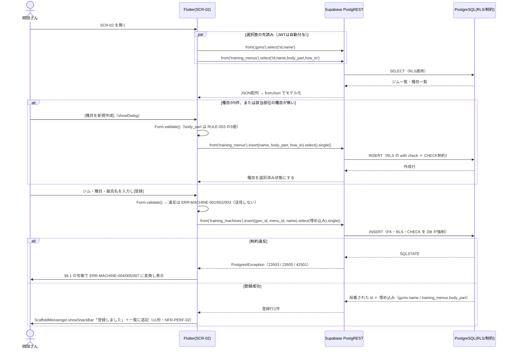

# FEAT-01 器具登録（部位タグ付与） 詳細設計

> **目的**: FEAT-01 を実装が迷わない粒度（入出力・バリデーション・クエリ・エラー・画面挙動・実装単位）まで具体化し、TDDの着手点を固定する。
> **書き方**: 実データは書かない。上位の正本（API契約＝`../../30_データ・IF設計/02_API設計.md` ／ 物理DB＝`../01_DB物理設計.md` ／ シーケンス＝`../../40_機能設計/01_シーケンス設計.md`）と矛盾させず、参照はIDで行う。横断方針（エラー分類・トランザクション・冪等・リトライ）は `../07_実装共通設計パターン.md` を正本とし本書では再定義しない。

> ⚠️ **本書はたたき台（2026-08-02 生成）**。岡田さんのレビューで確定する。

## 目次
1. [概要](#1-概要)
2. [処理フロー](#2-処理フロー)
3. [入出力仕様](#3-入出力仕様)
4. [業務ロジック](#4-業務ロジック)
5. [データアクセス](#5-データアクセス)
6. [エラー処理](#6-エラー処理)
7. [画面挙動・状態別表示](#7-画面挙動状態別表示)
8. [実装単位](#8-実装単位)
9. [テスト観点](#9-テスト観点)
10. [敵対的検証・要確認事項](#10-敵対的検証要確認事項)

## 1. 概要

| 項目 | 内容 |
|---|---|
| 対応要件 | FEAT-01（器具登録・部位タグ付与） |
| 対応画面 | SCR-02 器具登録 |
| 対応API | **PostgREST 直接**。`supabase.from('gyms')` ／ `supabase.from('training_menus')` ／ `supabase.from('training_machines')` の CRUD。呼び出し一覧は §3 |
| 呼び出し方式 | Edge Function は使わない。RPC も使わない（AI不使用・単一テーブル操作のため） |
| 関連ルール | RULE-003（部位タグ5種＝胸/背中/脚/肩/腕）／RULE-004（絞り込みは部位タグ一致のみ・利用側は FEAT-02） |
| 外部連携 | なし（AI不使用の決定的処理・DEC-B01） |
| 性能目標 | NFR-PERF-02（決定的処理 ≤1秒）／画面初期表示は NFR-PERF-01（≤2秒） |
| 状態 | 状態を持たない（ST-01/ST-02 は FEAT-04 の `training_session_details` に属する） |
| 優先度 | MUST（`../../30_データ・IF設計/02_API設計.md §2`） |

**旧構成からの変更点**: 旧設計では `/api/machines` `/api/menus` `/api/gyms` の Route Handler を経由していた。新構成では Flutter が PostgREST を直接呼ぶ。中間層は無い。旧パスは**廃止**する。

FEAT-01 は、岡田さんが通うジムの器具（マシン）を DB に登録する機能である。あわせて「その器具がどの部位を鍛えるものか」を判別できる状態にする。

ここで作られたデータは FEAT-02（部位→器具の絞り込み）と FEAT-03（AIメニュー提案）の入力になる。本機能は FEAT-02/03 の唯一のデータ供給源であり、両者の前提となる。

構造上の前提を先に述べる。**部位タグ（RULE-003）を保持するのは `training_menus.body_part` である。器具テーブル `training_machines` は部位列を持たない**（`../01_DB物理設計.md §1.3/§1.4`）。

| 事実 | 帰結 |
|---|---|
| 器具の部位は `training_machines.menu_id` → `training_menus.body_part` を辿って導出する | 「器具に部位タグを付ける」操作の実体は、部位が確定済みの種目を1件選んで器具に結び付けること |
| 部位は器具に持たない | FEAT-02 の絞り込みが2ホップ（`training_menus` → `training_machines`）になる |

この導出関係は §4・§5・§10 で扱う。

## 2. 処理フロー

`../../40_機能設計/01_シーケンス設計.md` に FEAT-01 のシーケンスは無い。本節で新規に定義する（FEAT-02 の絞り込みシーケンスは同ファイル §4 が正本）。

認証は `supabase_flutter` が保持する。サインイン済みセッションの JWT が全 PostgREST 呼び出しに自動付与される。アプリ側で明示的にトークンを載せる記述は要らない。



- 種目作成と器具登録は **2回の PostgREST 呼び出し**である。それぞれ別トランザクションになる。途中で失敗すると種目だけが残る（§10 #1）。
- AI（EXT-01）は一切呼ばない。NFR-AVAIL-05 の縮退対象外である。AI不達時も本機能は完全に動作する。
- 中間層が無いため、**入力の強制点は DB の RLS・CHECK・FK のみ**である。Flutter 側の検証は利用者体験のための先出しであり、防御ではない（§3.1・§10 #2）。

## 3. 入出力仕様

本機能に HTTP の契約は無い。定義するのは **PostgREST 呼び出しの引数と戻り値**である。

| 前提 | 内容 |
|---|---|
| 認証 | `supabase_flutter` のセッション JWT を自動付与。未サインインでは呼ばない（画面に到達しない） |
| テーブル名・列名 | DB の実体そのまま（snake_case）。`../01_DB物理設計.md` が正本 |
| 可視範囲 | RLS が決める。アプリ側で `user_id` を条件に足さない |
| 戻り値のモデル化 | Dart のモデルクラス＋`fromJson`。zod は使わない（Dart のため） |

### 3.1 呼び出し一覧

| # | 操作 | 呼び出し | 戻り値 | 主なERR |
|---|---|---|---|---|
| C-01 | 器具を1件登録 | `from('training_machines').insert(値).select(EMB).single()` | 器具1件 | 001〜005/007 |
| C-02 | 器具一覧（部位を導出して同梱） | `from('training_machines').select(EMB)` ＋ `.eq()` | 器具の配列 | — |
| C-03 | 器具の付け替え・改名 | `from('training_machines').update(値).eq('id',id).select(EMB)` | 更新行（0件なら不在） | 001〜003/006/007 |
| C-04 | 器具の削除 | `from('training_machines').delete().eq('id',id).select('id')` | 削除行（0件なら不在） | 006 |
| C-05 | 種目一覧 | `from('training_menus').select('id,name,body_part,how_to,created_at')` | 種目の配列 | — |
| C-06 | 種目を1件登録 | `from('training_menus').insert(値).select().single()` | 種目1件 | 008〜010/012 |
| C-07 | 種目の改名・部位変更 | `from('training_menus').update(値).eq('id',id).select()` | 更新行（0件なら不在） | 008〜012 |
| C-08 | 種目の削除 | `from('training_menus').delete().eq('id',id).select('id')` | 削除行（0件なら不在） | 011/013 |
| C-09 | ジム一覧 | `from('gyms').select('id,name,created_at')` | ジムの配列 | — |
| C-10 | ジムを1件登録 | `from('gyms').insert(値).select().single()` | ジム1件 | 014/015 |

`EMB` は器具の埋め込み select 文字列（§3.2）。ジムの更新・削除は現行契約に無い（§10 #7）。

### 3.2 器具（`training_machines`）

```dart
// C-01 登録
final row = await supabase
    .from('training_machines')
    .insert({'gym_id': gymId, 'menu_id': menuId, 'name': name})
    .select(EMB)
    .single();

// EMB: 部位は training_menus 経由でしか取れない（器具は部位列を持たない）
const EMB = 'id, name, created_at, '
            'gym_id, gyms!inner ( name ), '
            'menu_id, training_menus!inner ( name, body_part )';
```

**引数**

| キー | 型 | 必須 | 規則 |
|---|---|---|---|
| `gym_id` | `int`（bigint） | 必須 | 正の整数。`gyms` に実在すること |
| `menu_id` | `int`（bigint） | 必須 | 正の整数。本人に可視な `training_menus` であること |
| `name` | `String` | 必須 | trim 後1〜100文字。制御文字を含まない |

**戻り値**（`Map<String, dynamic>` 1件。C-02/C-03 の要素も同形）

| キー | 型 | 備考 |
|---|---|---|
| `id` | `int` | 採番済み |
| `name` | `String` | 保存した原文 |
| `created_at` | `String`（ISO 8601） | — |
| `gym_id` | `int` | — |
| `gyms` | `{ "name": String }` | **入れ子**。旧構成の平坦な `gym_name` ではない |
| `menu_id` | `int` | — |
| `training_menus` | `{ "name": String, "body_part": String }` | 部位タグの供給元 |

- 入れ子は `TrainingMachine.fromJson` で平坦化する。`bodyPart` はここで確定する（§4 L-01）。
- 旧構成の `gym_name` `menu_name` `body_part` というトップレベル列は**存在しない**。応答形が変わる点は実装時の移植で注意する。

```dart
// C-02 一覧（フィルタは任意）
var q = supabase.from('training_machines').select(EMB);
if (gymId != null)    q = q.eq('gym_id', gymId);
if (bodyPart != null) q = q.eq('training_menus.body_part', bodyPart); // 埋め込み列での絞り込み
final rows = await q;   // 並び替えは §5 参照
```

- 埋め込み列での絞り込みには `!inner` が要る。外部結合のままだと親行が残る。
- 部位フィルタの契約は FEAT-02 が正本。本書では呼び出し形のみ示す。

```dart
// C-03 更新（全置換。部分更新は設けない） / C-04 削除
final updated = await supabase.from('training_machines')
    .update({'gym_id': gymId, 'menu_id': menuId, 'name': name})
    .eq('id', machineId).select(EMB);      // updated.isEmpty → ERR-MACHINE-006

final deleted = await supabase.from('training_machines')
    .delete().eq('id', machineId).select('id');  // deleted.isEmpty → ERR-MACHINE-006
```

**重要な挙動差**: 対象行が無い場合、PostgREST は**例外を投げない**。空配列が返る。旧構成の 404 に相当する判定は `isEmpty` の明示チェックで行う（§6.1）。

### 3.3 種目（`training_menus`） — 部位タグ（RULE-003）の保持主体

```dart
// C-06 登録
final row = await supabase.from('training_menus')
    .insert({'name': name, 'body_part': bodyPart, 'how_to': howTo})  // how_to は null 可
    .select('id, name, body_part, how_to, created_at').single();
```

| キー | 型 | 必須 | 規則 |
|---|---|---|---|
| `name` | `String` | 必須 | trim 後1〜100文字 |
| `body_part` | `String` | 必須 | 胸/背中/脚/肩/腕。`../01_DB物理設計.md §4` の CHECK と同値 |
| `how_to` | `String?` | 任意 | 0〜1000文字。null 許容 |
| `user_id` | — | — | **アプリから送らない**。RLS の `with check` と DB 既定値で本人を強制する `[仮]` |

- `user_id` をクライアントが指定できると、他人の行を作れてしまう。列は送らず DB 側で決める（§10 #2）。
- C-07 は全置換。C-08 は参照中なら失敗する（§6.1・ERR-MACHINE-013）。

### 3.4 ジム（`gyms`）

```dart
// C-10 登録 / C-09 一覧
final row  = await supabase.from('gyms').insert({'name': name})
                 .select('id, name, created_at').single();
final rows = await supabase.from('gyms').select('id, name, created_at').order('name');
```

| キー | 型 | 必須 | 規則 |
|---|---|---|---|
| `name` | `String` | 必須 | trim 後1〜100文字 |

### 3.5 バリデーション規則（二層）

検証は **Flutter 側（先出し）** と **DB 側（強制）** の二層で行う。Flutter 側は体験のため、DB 側は防御のためである。

| 項目 | Flutter 側 | DB 側 | 違反時 |
|---|---|---|---|
| `training_machines.name` | `TextFormField.validator`（必須・trim・NFKC 後1〜100文字・制御文字排除） | なし（型は `text`） | ERR-MACHINE-001 |
| `gym_id` | `DropdownButtonFormField.validator`（未選択を弾く） | NOT NULL ＋ FK | ERR-MACHINE-002 |
| `menu_id` | `DropdownButtonFormField.validator`（未選択を弾く） | NOT NULL ＋ FK | ERR-MACHINE-003 |
| `gym_id` の実在 | 先読み一覧から選ばせるため通常は発生しない | FK 違反（`23503`） | ERR-MACHINE-004 |
| `menu_id` の実在・所有 | 同上 | FK 違反（`23503`）／RLS 違反（`42501`） | ERR-MACHINE-005 |
| `machine_id`（更新・削除） | — | RLS で不可視なら 0件 | ERR-MACHINE-006 |
| 器具の重複 `[仮]` | 送信前 SELECT（同一 `gym_id` 内・正規化名） | **現状 UNIQUE 無し**（§10 #4） | ERR-MACHINE-007 |
| `training_menus.name` | `validator`（必須・trim・NFKC 後1〜100文字） | なし | ERR-MACHINE-008 |
| `body_part` | `SegmentedButton` で5値のみ選択可 | CHECK 制約（`23514`） | ERR-MACHINE-009 |
| `how_to` | `validator`（0〜1000文字） | なし | ERR-MACHINE-010 |
| `menu_id`（更新・削除） | — | RLS で不可視なら 0件 | ERR-MACHINE-011 |
| 種目の重複 `[仮]` | 送信前 SELECT（本人の種目内・正規化名） | **現状 UNIQUE 無し**（§10 #4） | ERR-MACHINE-012 |
| 種目の削除可否 | 送信前 SELECT（参照件数の提示用） | FK 違反（`23503`・`ON DELETE NO ACTION`） | ERR-MACHINE-013 |
| `gyms.name` | `validator`（必須・trim・NFKC 後1〜100文字） | なし | ERR-MACHINE-014 |
| ジムの重複 `[仮]` | 送信前 SELECT（正規化名） | **現状 UNIQUE 無し**（§10 #4） | ERR-MACHINE-015 |
| 認証 | セッション有無で画面を出し分け | JWT 検証（`PGRST301`／401） | ERR-AUTH-001 |

- 文字列長の上限（100/1000）は `[仮]`。`../01_DB物理設計.md` の型は `text`（無制限）である。長さは Flutter 側でしか担保できない。
- **クライアント検証は迂回できる**。JWT を持つ利用者は PostgREST を直接叩ける。長さ制限を要件とするなら DB 側の CHECK が要る（§10 #2）。
- 重複判定（`[仮]` 3件）は送信前 SELECT で行う。同時実行では取りこぼす。要否判断は §10 #4。

## 4. 業務ロジック

**L-01 部位タグの導出（RULE-003・本機能の中核）**

器具は部位列を持たない。器具1件の部位は次の一意な経路でのみ決まる。

```
body_part(machine) := training_menus[ machine.menu_id ].body_part
```

| 事実 | 帰結 |
|---|---|
| `training_machines.menu_id` は NOT NULL（`../01_DB物理設計.md §1.4`） | 部位タグ未設定の器具は構造上存在しえない。RULE-004 の絞り込みで取りこぼしが出ない根拠 |
| `menu_id` は単一FK | 1つの器具は必ずちょうど1つの部位に属する |
| 1台で複数部位を鍛える器具（多機能ラック等） | 現行スキーマでは表現できない。部位ごとに器具行を複数登録する運用回避（§10 #5） |

- 実体は埋め込み select の入れ子読み替えである。純関数として切り出す: `BodyPart resolveBodyPart(TrainingMenu menu)`。単体テスト対象（NFR-QUAL-01）。

**L-02 部位タグ値の検証（RULE-003）**

```
parseBodyPart(input) =
  input ∈ { 胸, 背中, 脚, 肩, 腕 } ? input : throw ERR-MACHINE-009
```

- 5値は `../01_DB物理設計.md §4` の CHECK 制約と同一集合。
- Dart の `enum BodyPart` と DB CHECK の二重防御とする。**値の正本はDB側**とし、アプリ側で値を増やさない。

**L-03 名称の正規化（重複判定・表記ゆれ対策）**

```
normalizeName(raw) = collapseSpaces( trim( NFKC(raw) ) )
```

- 全角/半角・連続空白の差を吸収した比較キーを作る純関数。
- **保存する値は正規化前の原文**とする。正規化結果は重複判定と検索時の比較にのみ使う。表示は利用者の入力どおり。
- Dart には NFKC 正規化が標準で無い。`characters` では足りず、外部パッケージまたは自前実装が要る `[仮]`。
- 大文字小文字の畳み込み（英字マシン名）を行うかは未定 → §10 #8。

**L-04 登録前提の判定（登録順序の依存）**

| 条件 | 画面の振る舞い |
|---|---|
| `gyms` が0件 | 器具登録フォームを無効化し、ジム登録へ誘導（§7） |
| `training_menus` が0件 | 器具登録フォームを無効化し、種目作成ダイアログを開く導線を出す |
| 選択中の部位に該当する種目が0件 | 種目ドロップダウンを空で表示し、「この部位の種目を作成」を提示 |

- 判定は取得済みの一覧件数で行う純関数 `bool canRegisterMachine(int gymCount, int menuCount)` とする。
- DB 側の FK 違反（ERR-MACHINE-004/005）は最終防衛線に留める。

## 5. データアクセス

PostgREST は呼び出しを SQL に変換して実行する。実装が書くのは Dart 側の呼び出しだが、性能とINDEXの議論には発行される SQL の形が要る。以下に対応を示す。

```dart
// L-04: SCR-02 初期表示。選択肢を2本の SELECT で先読み（いずれもRLS適用）
await supabase.from('gyms').select('id, name').order('name');
await supabase.from('training_menus')
    .select('id, name, body_part, how_to').order('body_part').order('name');

// C-01 器具の登録（単一INSERT＝暗黙トランザクション）
await supabase.from('training_machines')
    .insert({'gym_id': g, 'menu_id': m, 'name': n}).select(EMB).single();

// C-08 種目の削除可否の事前確認（利用者への参照件数提示用。強制は DB の FK）
await supabase.from('training_machines')
    .select('id').eq('menu_id', menuId).count(CountOption.exact);
await supabase.from('training_session_details')
    .select('id').eq('menu_id', menuId).count(CountOption.exact);
```

```sql
-- C-02 が PostgREST 内部で発行するクエリの形（部位は menu_id 経由で導出＝2ホップ）
SELECT mc.id, mc.name, mc.created_at, mc.gym_id, mc.menu_id,
       g.name AS "gyms.name",
       mn.name AS "training_menus.name", mn.body_part AS "training_menus.body_part"
  FROM training_machines mc
  JOIN training_menus    mn ON mn.id = mc.menu_id     -- ここが部位タグの供給元
  JOIN gyms              g  ON g.id  = mc.gym_id
 WHERE (mc.gym_id = $1 OR $1 IS NULL)
   AND (mn.body_part = $2 OR $2 IS NULL);
```

| 観点 | 内容 |
|---|---|
| 対象テーブル | `training_machines`（INSERT/SELECT/UPDATE/DELETE）／`training_menus`（同左）／`gyms`（SELECT/INSERT）／`training_session_details`（SELECT・削除可否の件数提示のみ） |
| 使用INDEX | 現状 PK のみ。`training_machines(menu_id)` `training_machines(gym_id)` の INDEX は `../01_DB物理設計.md §3` に存在しない。PostgreSQL は FK列に自動でINDEXを作らない。器具一覧の2ホップJOINと削除可否判定は全表走査になる（§10 #6） |
| 並び順 | 「ジム名 → 部位 → 器具名」は**PostgREST の `order` では表現できない**（親テーブルの列でしか並べられない）。Dart 側でソートする `[仮]`。件数が増えるならビュー化を検討（§10 #11） |
| RLS | `training_menus` は `user_id` を持つため直接ポリシーを張れる。`training_machines` と `gyms` は所有者列を持たない。器具は `EXISTS (SELECT 1 FROM training_menus m WHERE m.id = training_machines.menu_id AND m.user_id = <本人のusers.id>)` という**menu経由の間接ポリシー**になる。`gyms` は本人限定に絞る手段が無く全ユーザ共有マスタになる（§10 #2） |
| トランザクション境界 | **1 PostgREST 呼び出し＝1トランザクション**。器具登録・種目登録はいずれも単一INSERTで完結する。SCR-02 の「種目を作ってそのまま器具を登録」は**2呼び出し＝2トランザクション**になる。中間失敗時は種目だけが残る（§10 #1） |
| 冪等性・リトライ | `../07_実装共通設計パターン.md` を正本とする。本機能はAI非依存で全操作が同期・低コストである。AI系のような自動リトライ禁止の制約は受けない |

> ⚠️ 要確認（人間判断）: RLSポリシー内の「本人」の表現（`auth.uid()`(uuid) と `users.id`(bigint) の写像）は未確定の既知論点であり、正本は `../06_DB設計規約.md`。本書では方式を決めず参照にとどめる。

## 6. エラー処理

中間層が無いため、エラーの一次表現は **`PostgrestException`** である。HTTP ステータスではない。写像は1箇所（§8 #10）に閉じ込め、画面には ERR-ID だけを渡す。

### 6.1 `PostgrestException` → ERR-ID の写像

| 検知 | SQLSTATE / code | 判別材料 | 写像先 ERR-ID |
|---|---|---|---|
| FK違反 | `23503` | 制約名 `training_machines_gym_id_fkey` `[仮]` | ERR-MACHINE-004 |
| FK違反 | `23503` | 制約名 `training_machines_menu_id_fkey` `[仮]` | ERR-MACHINE-005 |
| FK違反 | `23503` | 削除時。参照元が `training_machines` / `training_session_details` | ERR-MACHINE-013 |
| RLS違反 | `42501` | INSERT/UPDATE が `with check` を満たさない | ERR-MACHINE-005（他人所有の種目を指した） |
| CHECK違反 | `23514` | 制約名に `body_part` を含む `[仮]` | ERR-MACHINE-009 |
| 一意制約違反 | `23505` | 制約名（`gyms`/`menus`/`machines` のどれか） | ERR-MACHINE-007 / 012 / 015 |
| 0件（`.single()`） | `PGRST116` | 対象テーブル | ERR-MACHINE-006 / 011 |
| **例外なしで空配列** | — | `update`/`delete` の戻りが `isEmpty` | ERR-MACHINE-006 / 011 |
| JWT 期限切れ・不正 | `PGRST301` / 401 | — | ERR-AUTH-001 |
| 通信断・タイムアウト | 例外型（`SocketException` 等） | — | `../07_実装共通設計パターン.md` の共通方針に従う（本書で新IDを起こさない） |

- **`23503` は code だけでは区別できない**。`gym_id` と `menu_id` のどちらの FK かは制約名で判別する。制約名は DB の実体に依存するため `[仮]`。マイグレーションで明示命名するのが確実。
- **`23505` は現行スキーマでは発火しない**。`gyms` `training_menus` `training_machines` に UNIQUE が無いためである（`../01_DB物理設計.md §3`）。当面 ERR-MACHINE-007/012/015 は送信前 SELECT でしか検知できない。DB に UNIQUE を足せば `23505` で確実に取れる（§10 #4）。
- **0件を例外にしない挙動に注意**。`update`/`delete` は対象が無くても成功扱いになる。`.select()` を必ず付け、戻りの空判定を書く。書き忘れると「消えたように見えて消えていない」不具合になる。

### 6.2 ERR-ID 一覧

| ERR-ID | 検知層 | 発生条件 | 利用者向けメッセージ（意図） | retryable | ログ |
|---|---|---|---|---|---|
| ERR-AUTH-001 | Supabase | セッション無効（共通契約） | 再ログインを促す | false | 認証失敗を記録（NFR-SEC-AUDIT-02） |
| ERR-MACHINE-001 | Flutter | 器具名が空・長さ超過・制御文字混入 | 器具名の入力し直しを促す | false | warn（値はマスクせず長さのみ） |
| ERR-MACHINE-002 | Flutter | `gym_id` が未選択 | ジムの選択し直しを促す | false | warn |
| ERR-MACHINE-003 | Flutter | `menu_id` が未選択 | 種目の選択し直しを促す | false | warn |
| ERR-MACHINE-004 | DB（`23503`） | `gym_id` に該当するジムが無い | 選択したジムが見つからない旨と再読込を促す | false | warn（一覧の陳腐化が疑われる） |
| ERR-MACHINE-005 | DB（`23503`/`42501`） | `menu_id` に該当する種目が無い、または本人所有でない | 選択した種目が見つからない旨と再読込を促す | false | warn（他人所有の存在を示唆しない） |
| ERR-MACHINE-006 | Flutter（空配列） | 更新・削除対象の器具が無い（RLS不可視を含む） | 対象が見つからない旨 | false | warn |
| ERR-MACHINE-007 | Flutter（事前SELECT） `[仮]` | 同一ジム内に同名の器具が既存 | 既に登録済みである旨と既存行への誘導 | false | info |
| ERR-MACHINE-008 | Flutter | 種目名が空・長さ超過 | 種目名の入力し直しを促す | false | warn |
| ERR-MACHINE-009 | Flutter ＋ DB（`23514`） | `body_part` が RULE-003 の5値以外 | 部位の選択し直しを促す | false | warn（enum外値を記録） |
| ERR-MACHINE-010 | Flutter | `how_to` が長さ超過 | やり方メモの短縮を促す | false | warn |
| ERR-MACHINE-011 | Flutter（空配列） | 更新・削除対象の種目が無い（RLS不可視を含む） | 対象が見つからない旨 | false | warn |
| ERR-MACHINE-012 | Flutter（事前SELECT） `[仮]` | 本人の種目に同名が既存 | 既に登録済みである旨 | false | info |
| ERR-MACHINE-013 | DB（`23503`） | 削除対象の種目が器具またはトレーニング明細から参照中 | 使用中のため削除できない旨と参照件数の提示 | false | warn（参照元と件数を記録） |
| ERR-MACHINE-014 | Flutter | ジム名が空・長さ超過 | ジム名の入力し直しを促す | false | warn |
| ERR-MACHINE-015 | Flutter（事前SELECT） `[仮]` | 同名のジムが既存 | 既に登録済みである旨 | false | info |

- 画面には ERR-ID とメッセージだけを渡す。`PostgrestException` を UI に露出させない。分類・握り潰し禁止の原則は `../07_実装共通設計パターン.md` を正本とする。
- ログは Flutter 側で出す。1行1JSON・`service` は `okada-fit-app`（`../05_ログ設計.md`）。**本機能は Edge Function を経由しないためサーバ側ログが残らない**。DB 側の失敗は Supabase の Postgres ログでしか追えない。
- ERR-MACHINE-001〜015 は 001〜019 の範囲に収める。020以降は FEAT-02 が使用する（ERRドメインを共有）。

> ERRの完全列挙の正本は `../../60_テスト設計/02_RED母集合_受入基準・状態・エラー.md`（段6で集約）。本表はその入力とする。

## 7. 画面挙動・状態別表示

SCR-02 は Flutter の1画面（`Scaffold`）である。ウィジェットは Material 3 を用いる。

| 状態 | 表示 | 操作可否 |
|---|---|---|
| 初期/空（ジム0件） | `MaterialBanner`（info）で「まずジムを登録してください」＋`FilledButton`「ジムを登録」→ `showDialog`（`TextFormField` name） | 器具登録フォームは無効（`enabled: false`） |
| 初期/空（種目0件） | `MaterialBanner`（info）で「まず種目を登録してください」＋`FilledButton`「種目を作成」→ `showDialog`（`TextFormField` name／`SegmentedButton` body_part／`TextFormField(maxLines: 4)` how_to） | 器具登録フォームは無効 |
| 読込中 | 一覧は `shimmer`（行数分）、ドロップダウンは `enabled: false`＋末尾に `CircularProgressIndicator(strokeWidth: 2)` | 入力不可 |
| 入力中 | `DropdownButtonFormField`（ジム）／`SegmentedButton`（部位・RULE-003 の5値）→ 部位で絞った `DropdownButtonFormField`（種目）／`TextFormField`（器具名）。`Form` ＋ `TextFormField.validator` でフィールド単位に即時検証（`autovalidateMode: onUserInteraction`） | 全項目充足で `FilledButton`「登録」が有効 |
| 送信中 | `FilledButton` の `onPressed` を `null` にし、ラベルを `CircularProgressIndicator` に差し替えて二重送信を防止 | 再送信不可 |
| 成功 | `ScaffoldMessenger.showSnackBar`（「登録しました」）＋一覧（`ListView`）に追記。各行は `ListTile` で、導出した部位を `Chip` で表示 | 継続入力可（器具名のみクリア） |
| エラー（入力起因） | 該当 `TextFormField` / `DropdownButtonFormField` に `errorText` を表示（ERR-MACHINE-001/002/003/008/009/010/014） | 修正して再送信可 |
| エラー（DB起因） | `ScaffoldMessenger.showSnackBar`（エラー配色）＋一覧の再取得（ERR-MACHINE-004〜007/011〜015） | 再送信可 |
| エラー（認証） | サインイン画面へ遷移（`../../30_データ・IF設計/03_ドメインイベント.md §4` の共通挙動） | 操作不可 |
| 削除確認 | `showDialog`（`AlertDialog` で確認）。種目削除で ERR-MACHINE-013 の場合は参照件数を提示して中止 | 参照中は削除不可 |

- SCR-02 は器具一覧の閲覧と登録を同一画面で行う。部位 `SegmentedButton` はここでは**種目ドロップダウンの絞り込み用**である。一覧側の部位絞り込み（RULE-004）の契約は FEAT-02 が正本。
- 一覧の並びは ジム名 → 部位 → 器具名。**この並びは Dart 側で行う**（§5 の「並び順」）。
- 一覧は表ではなく `ListView`＋`ListTile` にする。モバイル1カラムのため（`../../30_データ・IF設計/02_API設計.md` の応答形とは無関係の表示判断）。

## 8. 実装単位

| # | ファイル | 役割 | 主なシグネチャ |
|---|---|---|---|
| 1 | `app/lib/features/equipment/equipment_page.dart` | SCR-02 器具登録画面（一覧＋登録） | `class EquipmentPage extends StatelessWidget` |
| 2 | `app/lib/features/equipment/equipment_form.dart` | 登録フォーム（`Form` ＋ validator・§3.5 の Flutter 側） | `class EquipmentForm extends StatefulWidget` |
| 3 | `app/lib/features/equipment/menu_create_dialog.dart` | 種目作成ダイアログ（部位タグの確定） | `Future<TrainingMenu?> showMenuCreateDialog(BuildContext c)` |
| 4 | `app/lib/features/equipment/equipment_controller.dart` | 画面状態（読込中/送信中/エラー）と一覧のソート | `class EquipmentController extends ChangeNotifier` |
| 5 | `app/lib/data/machine_repository.dart` | `training_machines` の PostgREST アクセス（C-01〜C-04） | `Future<TrainingMachine> insert({required int gymId, required int menuId, required String name})` / `Future<List<TrainingMachine>> fetch({int? gymId, String? bodyPart})` / `Future<void> update(...)` / `Future<void> delete(int id)` |
| 6 | `app/lib/data/menu_repository.dart` | `training_menus` の PostgREST アクセス（C-05〜C-08） | `Future<TrainingMenu> insert({required String name, required BodyPart bodyPart, String? howTo})` / `Future<int> countReferences(int menuId)` |
| 7 | `app/lib/data/gym_repository.dart` | `gyms` の PostgREST アクセス（C-09/C-10） | `Future<List<Gym>> fetchAll()` / `Future<Gym> insert({required String name})` |
| 8 | `app/lib/domain/models/training_machine.dart` | モデル＋`fromJson`（埋め込みの入れ子を平坦化） | `factory TrainingMachine.fromJson(Map<String, dynamic> json)` |
| 9 | `app/lib/domain/machines.dart` | 純関数（L-01〜L-04・単体テスト対象） | `BodyPart resolveBodyPart(TrainingMenu menu)` / `String normalizeName(String raw)` / `bool canRegisterMachine(int gymCount, int menuCount)` |
| 10 | `app/lib/data/postgrest_error_mapper.dart` | `PostgrestException` → ERR-ID の写像（§6.1 を単一ソース化） | `AppError mapPostgrestError(Object e, {required PostgrestOp op})` |
| 11 | `app/lib/data/supabase_client.dart` | `SupabaseClient` の取得（既存・本機能では利用のみ） | `SupabaseClient get supabase` |
| 12 | `supabase/migrations/*.sql` | RLS ポリシー・制約命名（**本書ではスキーマを追加しない**。正本は `../01_DB物理設計.md`） | — |

| 判断 | 内容 |
|---|---|
| 部位導出の正本 | **埋め込み select（SQL側のJOIN）**。`resolveBodyPart` は取得済みモデルからの読み替えに限定する。二重実装にしない |
| 検証ロジックの置き場 | 正規化・件数判定は #9 の純関数に集約する。ウィジェットに書かない |
| エラー写像の置き場 | #10 のみ。リポジトリもウィジェットも `PostgrestException` を直接見ない |

## 9. テスト観点

| TC-ID | 観点 | 期待 |
|---|---|---|
| TC-FEAT01-01 | 正常系: ジム・種目が既存の状態で器具を登録 | 登録行が返る。`bodyPart` が選択した種目の `body_part` と一致 |
| TC-FEAT01-02 | 部位導出（L-01） | 器具に部位列が無くても、一覧取得の全件に `bodyPart` が付く |
| TC-FEAT01-03 | 器具名が空文字・空白のみ | ERR-MACHINE-001。`Form.validate()` で止まり PostgREST を呼ばない |
| TC-FEAT01-04 | `menu_id` が他人所有の種目 | ERR-MACHINE-005（`23503` または `42501`）。存在有無を示唆しない文言 |
| TC-FEAT01-05 | `gym_id` が存在しない | ERR-MACHINE-004（`23503`） |
| TC-FEAT01-06 | `body_part` が RULE-003 の5値以外（L-02） | ERR-MACHINE-009。UI からは選べず、直接呼び出しでも DB CHECK（`23514`）で弾かれる |
| TC-FEAT01-07 | 名称正規化（L-03） | 全角/半角・連続空白違いの同一名が重複と判定される |
| TC-FEAT01-08 | 同一ジム内の同名器具 `[仮]` | ERR-MACHINE-007。現状は事前SELECTでのみ検知（UNIQUE 未設定・§10 #4） |
| TC-FEAT01-09 | 器具から参照中の種目を削除 | ERR-MACHINE-013（`23503`）。`training_machines` の行が残る |
| TC-FEAT01-10 | トレーニング明細から参照中の種目を削除 | ERR-MACHINE-013（`23503`）。履歴（`training_session_details`）が壊れない |
| TC-FEAT01-11 | 存在しない id で更新・削除 | 例外は出ず空配列が返り、ERR-MACHINE-006/011 に写像される |
| TC-FEAT01-12 | 性能（NFR-PERF-02） | 器具登録・一覧取得が ≤1秒（AI呼び出しを含まないこと） |
| TC-FEAT01-13 | 登録順序の依存（L-04） | ジム0件・種目0件のとき登録フォームが無効化され、作成導線が出る |
| TC-FEAT01-14 | 種目作成→器具登録の中間失敗 | 器具登録が失敗しても種目は残り、再試行で重複を作らない |
| TC-FEAT01-15 | RLS の実効性 | 他人の JWT で本人の `training_menus` を SELECT/UPDATE できない（クライアント直叩きを想定した検証） |

受入基準（G/W/T）の候補:
- [AC] Given ジムと部位「胸」の種目が登録済み When 器具名とそのジム・種目を選んで登録する Then 器具が保存され、一覧で部位「胸」として表示される
- [AC] Given 種目が1件も無い状態 When SCR-02 を開く Then 器具登録フォームは無効で、種目作成への導線が表示される
- [AC] Given ある種目がトレーニング明細から参照されている When その種目を削除しようとする Then ERR-MACHINE-013 が返り、履歴が保持される
- [AC] Given 部位「脚」の種目に紐づく器具が登録済み When 部位「脚」で器具を照会する Then その器具が返る（絞り込み契約の正本は FEAT-02）

> 受入基準・ST・ERR の**正本は段6**（`../../60_テスト設計/02_RED母集合_受入基準・状態・エラー.md`・本PR対象外）。本節はその母集合への入力。

## 10. 敵対的検証・要確認事項
| # | 論点 | 内容 | 重大度 |
|---|---|---|---|
| 1 | 登録順序の依存が利用者に露出する | 器具を1件登録するには `gyms` と `training_menus` が先に存在しなければならない（`training_machines` は両方 NOT NULL FK）。初回利用時に「ジム登録→種目登録→器具登録」の3段階を強いる導線は離脱要因。本書 §7 では SCR-02 内のダイアログで種目・ジムを即時作成する案を採った。その場合 §5 のとおり**2呼び出し＝2トランザクション**になり、中間失敗で種目だけが残る。**新構成では原子性の担保が容易になる**: `create_menu_and_machine(...)` のような PostgreSQL 関数を1本足し、`supabase.rpc()` で呼べば1トランザクションに束ねられる（Edge Function は不要）。採否は未決 | 🔴 高 |
| 2 | 所有者が揃っていない（RLSが張れない） | `training_menus` は `user_id` を持つが、`training_machines` と `gyms` は所有者列を持たない（`../01_DB物理設計.md §1.2/§1.4`）。器具のRLSは `menu_id` 経由の `EXISTS` サブクエリでしか書けない。`gyms` に至っては本人限定に絞る手段が無く**全ユーザ共有マスタ**になる。単一ユーザ運用では顕在化しないが、NFR-SCALE-01（マルチテナント適用外）の前提が外れた瞬間に他人のジム名が見える。加えて器具の可視性が「設置ジム」ではなく「種目の所有者」で決まるため、同じジムに通う別ユーザは同一の器具を各自登録することになり実体が重複する。**PostgREST 直接方式ではこの問題が深刻化する**: 中間層が消え、RLS が唯一の強制点になる。JWT を持つ利用者はテーブルを直接叩けるため、アプリ側の検証はすべて迂回できる | 🔴 高 |
| 3 | 種目の削除が履歴を壊しうる | `training_session_details.menu_id` は NOT NULL FK。参照中の `training_menus` を物理削除すると、FKの `ON DELETE` 既定（`NO ACTION`）なら削除が失敗し、`CASCADE` を張っていればトレーニング履歴の明細ごと消える。ヒートマップの種目名（FEAT-05）は session→details→menus 経由で解決するため、履歴の意味が失われる。本書は §6.1 で FK 違反（`23503`）を ERR-MACHINE-013 に写像する方針を採ったが、**論理削除（`deleted_at`）にするか物理削除＋参照禁止にするかは未決**。`../01_DB物理設計.md` に列を足す判断は行っていない。なお `ON DELETE` の指定は PostgREST 直接方式では**アプリから上書きできない**。DB の定義がそのまま挙動になる | 🔴 高 |
| 4 | 重複登録を防ぐ一意制約の要否 | 同名の器具・種目・ジムを何度でも登録できる。現行の物理設計に UNIQUE は `uq_tsd_session_menu` のみ。本書は §3.5 で送信前 SELECT による重複検知（ERR-MACHINE-007/012/015・すべて `[仮]`）を置いたが、事前SELECT方式は同時実行で取りこぼす。**PostgREST 直接方式では取りこぼしの窓がさらに広い**: 検知と INSERT が同一トランザクションに入らず、悪意ある呼び出しは検知自体を飛ばせる。DB側に `UNIQUE(gym_id, name)` / `UNIQUE(user_id, name)` を置くのが確実で、`23505` として §6.1 の写像に素直に乗る。ただし正規化（NFKC・空白畳み込み）を挟むと関数INDEXが必要になり、また「同じ名前の器具が同一ジムに2台ある」実運用を弾いてしまう | 🟡 中 |
| 5 | 1器具＝1部位しか表現できない | `training_machines.menu_id` は単一FKのため、1台の器具は必ずちょうど1つの種目・1つの部位に属する。多機能ラックやケーブルマシンのように複数種目・複数部位に使える器具は、器具行を部位ごとに複製して登録する運用回避になり、§10 #4 の重複検知と衝突する。中間テーブル化は後戻りコストが大きいスキーマ変更 | 🔴 高 |
| 6 | 2ホップJOINを支えるINDEXが無い | `../01_DB物理設計.md §3` の既存INDEXは `ix_gym_visits_user_date` / `ix_train_sessions_user_date` / `ix_meal_logs_user_date` / `uq_tsd_session_menu` のみ。PostgreSQLはFK列に自動でINDEXを作らないため、`training_machines(menu_id)` `training_machines(gym_id)` `training_session_details(menu_id)` はいずれも未整備。器具一覧（§5）・種目の削除可否判定・FEAT-02 の絞り込みが全表走査になり、NFR-PERF-02（≤1秒）はデータ量が増えると危うい。RLS の `EXISTS` サブクエリ（#2）も同じ列を引くため、INDEX 不足の影響は全操作に及ぶ。個人利用の件数規模では当面顕在化しない見込み | 🟡 中 |
| 7 | ジムの更新・削除の契約が無い | `../../30_データ・IF設計/02_API設計.md §3` の `/api/gyms` は GET/POST のみで、誤登録したジム名を直す・消す手段が契約上存在しない。PostgREST 直接方式では**テーブル権限（GRANT）と RLS が実際の契約**になるため、「契約に無い」ことを担保するには `gyms` の UPDATE/DELETE を明示的に許可しない設定が要る。器具が参照中のジムを消せないようにする制約（ERR-MACHINE-013 相当）もあわせて必要になる | 🟡 中 |
| 8 | 名称正規化の範囲が未定 | L-03 は NFKC＋trim＋空白畳み込みまでを定義したが、英字マシン名の大文字小文字の畳み込み（`Lat Pulldown` と `lat pulldown`）を同一視するかは未定。重複判定と検索の双方に影響する。加えて Dart には NFKC 正規化が標準で無く、実装手段（外部パッケージ／自前）も未定 | 🟢 低 |
| 9 | 更新の競合を検知できない | 全テーブルに `updated_at` も `version` も無い（`../01_DB物理設計.md §3` は `created_at` のみ）。更新は全置換のため、2画面から同時に更新すると後勝ちで静かに上書きされる。単一ユーザ運用では影響は小さい | 🟢 低 |
| 10 | 器具の部位変更が履歴に遡及する | 器具の `menu_id` を別部位の種目に付け替えると、その器具の部位が過去に遡って変わる（器具は部位を保持せず導出するため）。トレーニング履歴は `training_session_details.menu_id` を直接持つので履歴自体は壊れないが、器具の付け替え前後で FEAT-02 の絞り込み結果が変わることは利用者に説明が要る | 🟢 低 |
| 11 | 並び順が PostgREST の表現力に収まらない | 一覧の並び「ジム名 → 部位 → 器具名」は親テーブルの列だけでは表現できず、PostgREST の `order` では指定できない。§5 では Dart 側ソートを `[仮]` としたが、全件取得が前提になる。件数が増えたらページングと両立しない。対処はビュー（`v_training_machines`）の追加だが、`../01_DB物理設計.md` に無いオブジェクトの追加になる | 🟢 低 |

> ⚠️ 要確認（人間判断）: #1 種目・ジムの作成を器具登録フォーム内に入れるか（入れる場合、原子性を RPC で担保するか）、#2 `gyms` と `training_machines` の所有者列およびRLSポリシーの方式、#3 種目削除を物理削除で禁止するか論理削除に切り替えるか（FKの `ON DELETE` の指定を含む）、#4 重複を DB の UNIQUE で防ぐかアプリ層に留めるか、#5 1器具＝複数部位を将来サポートするか。いずれも `../01_DB物理設計.md` のスキーマ変更を伴うため、本書では列・制約・INDEX・ビューを追加せず指摘に留めた。

> ⚠️ 要確認（人間判断）: RLSポリシーで「本人」を表す述語は `auth.uid()`(uuid) と `users.id`(bigint) の紐付け方式が未確定のため書けない。正本は `../06_DB設計規約.md` とし、本書では方式を決めない。

> ⚠️ 要確認（人間判断）: 本書は Flutter + Supabase 構成（Vercel 不使用）で記述している。一方 ADR-0001（Vercel AI Gateway 採用）・ADR-0002（Next.js + Mantine 採用）・`../../30_データ・IF設計/02_API設計.md`（`/api/*` の Route Handler 契約）は Vercel 前提のまま。後継ADRの起票と段3の改訂が必要。

> ⚠️ 要確認（人間判断）: 段3 `../../30_データ・IF設計/02_API設計.md §2/§3` が定める `/api/machines`・`/api/machines/{machine_id}`・`/api/menus`・`/api/menus/{menu_id}`・`/api/gyms` の10エンドポイントは、本書の PostgREST 直接方式（§3.1 の C-01〜C-10）に置き換わる。段3の契約表・共通エラー契約（§5 の `{ error_code, message, retryable }`）はいずれも HTTP 前提で書かれており、そのままでは本書と対応しない。段3側の改訂が要る。あわせて `../07_実装共通設計パターン.md` のエラー写像・トランザクション境界の記述も、PostgREST 直接方式を含む形への更新が必要。

> 関連: API契約＝`../../30_データ・IF設計/02_API設計.md` / 物理DB＝`../01_DB物理設計.md` / 横断方針＝`../07_実装共通設計パターン.md` / シーケンス＝`../../40_機能設計/01_シーケンス設計.md` / ログ＝`../05_ログ設計.md`。
