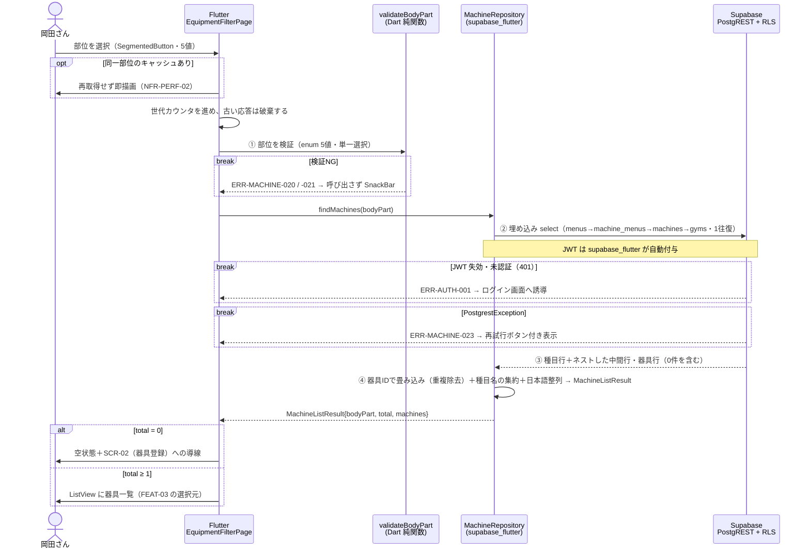

# FEAT-02 部位選択と器具の絞り込み 詳細設計

> **目的**: FEAT-02 を実装が迷わない粒度（入出力・バリデーション・クエリ・エラー・画面挙動・実装単位）まで具体化し、TDDの着手点を固定する。
> **書き方**: 実データは書かない。上位の正本（API契約＝`../../30_データ・IF設計/02_API設計.md` ／ 物理DB＝`../01_DB物理設計.md` ／ シーケンス＝`../../40_機能設計/01_シーケンス設計.md`）と矛盾させず、参照はIDで行う。横断方針（エラー分類・トランザクション・冪等・リトライ）は `../07_実装共通設計パターン.md` を正本とし本書では再定義しない。

> ⚠️ **本書はたたき台（2026-08-02 生成）**。岡田さんのレビューで確定する。

## 目次
1. [概要](#1-概要)
2. [処理フロー](#2-処理フロー)
3. [入出力仕様](#3-入出力仕様)
4. [業務ロジック](#4-業務ロジック)
5. [データアクセス](#5-データアクセス)
6. [エラー処理](#6-エラー処理)
7. [画面挙動・状態別表示](#7-画面挙動状態別表示)
8. [実装単位](#8-実装単位)
9. [テスト観点](#9-テスト観点)
10. [敵対的検証・要確認事項](#10-敵対的検証要確認事項)

## 1. 概要

| 項目 | 内容 |
|---|---|
| 対応要件 | FEAT-02（部位選択と器具の絞り込み） |
| 対応画面 | SCR-02 器具登録（登録済み器具の部位フィルタ） / SCR-03 トレーニング（メニュー生成の前段） |
| 対応API | **PostgREST 直接**。`supabase.from('training_menus').select('id, name, body_part, machine_menus(training_machines(id, name, gym_id, gyms(id, name)))').eq('body_part', …)` |
| 実行主体 | Flutter アプリ（`supabase_flutter`）。サーバ実装（Edge Function・RPC）は持たない |
| 関連ルール | RULE-003（部位タグ5種）/ RULE-004（器具絞り込みは部位タグ一致のみ・AI不使用） |
| 外部連携 | なし（EXT-01 を呼ばない決定的処理） |
| 性能目標 | NFR-PERF-02（決定的処理 ≤1秒）。画面全体は NFR-PERF-01（≤2秒） |
| 状態 | 状態を持たない（ST-01/ST-02 は FEAT-04 の `training_session_details` に属する） |

機能の骨子は次の4点。

| # | 内容 | 根拠 |
|---|---|---|
| 1 | 利用者が部位（5値）を1つ選ぶ。その部位の種目に対応する器具一覧を返す | RULE-003 |
| 2 | 絞り込みは等値一致だけ。AI（EXT-01）は呼ばない | RULE-004 |
| 3 | `training_machines` は部位列を持たない。部位は `training_menus.body_part` にある。器具↔種目は中間テーブル `machine_menus` の多対多で、**種目→中間→器具の3ホップ**で辿る | `../../30_データ・IF設計/01_データモデル.md §8-1` |
| 4 | 結果は `training_machines.id` を必ず含む。SCR-03 で FEAT-03 に渡す `machine_ids` の供給源になる | FEAT-03 |
| 5 | **1台の器具は複数の種目・複数の部位に対応する**（2026-08-08 決定）。同じ器具が結果に2回出ないよう重複を落とす | FEAT-01 §1 |

書き込みを伴わない。冪等でリトライ安全。

3ホップは PostgREST の**埋め込み select**（`training_menus` に `machine_menus` を、その中に `training_machines` をネストする）で1往復にできる。サーバ実装を置かない理由は次のとおり。

| 理由 | 根拠 |
|---|---|
| 加工が「畳み込みと整列」だけ。サーバでしかできない処理が無い | RULE-004 |
| 遮断は RLS が行う。認可のためのサーバ層が要らない | NFR-SEC-01 |
| 層を1つ減らすと個人保守の対象が減る | NFR-MAINT-01 |

## 2. 処理フロー

`../../40_機能設計/01_シーケンス設計.md §4` を正本とし、本節はバリデーション位置・クエリ発行点・0件分岐まで踏み込んで詳細化する。



順序と責務は次のとおり。

| 段 | 場所 | 内容 |
|---|---|---|
| ① 検証 | Flutter（`validateBodyPart`） | enum 5値のみ通す。NG なら送信しない |
| ② 送信 | `supabase_flutter` | JWT を自動付与。1往復のみ発行する |
| ③ 認可 | Supabase（RLS） | 本人行だけを返す。**遮断の唯一の境界**（§10 #6） |
| ④ 整形 | Flutter（純関数） | ネスト構造を器具IDで畳み込み、種目名を集約し、整列して返す |

- ①で弾いた値は送信しない。無駄な往復を作らない。
- ②は1回で完結させる。器具ごとに種目・ジムを引き直す N+1 を作らない。
- ④は**単なる平坦化ではない**。器具↔種目が多対多になったため、1台の器具が同じ部位の種目を2つ持つと同じ器具が2回現れる。器具IDで畳み込まないと重複表示になる（§5・§10 #10）。
- ①はUXのための前段検証であり、**セキュリティ境界ではない**。境界は RLS と DB の CHECK 制約（`../01_DB物理設計.md §3`）。
- 書き込み・外部送信がないためトランザクションもリトライ制御も持たない（横断方針は `../07_実装共通設計パターン.md`）。

## 3. 入出力仕様

### PostgREST `training_menus` → `training_machines`（埋め込み select）

| 項目 | 内容 |
|---|---|
| 方式 | PostgREST 直接（`supabase.from(...).select(...)`） |
| 対象 | `training_menus`（起点）→ `machine_menus`（中間・埋め込み）→ `training_machines`（ネスト埋め込み）→ `gyms`（さらにネスト） |
| 認証 | 必須。`supabase_flutter` が保持する JWT を自動付与（`Authorization: Bearer`） |
| 冪等 | 冪等（参照系）。往復は1回 |
| キャッシュ | HTTP キャッシュに頼らない。Flutter 側で部位をキーに保持する（§7） |

```dart
// app/lib/data/machine_repository.dart
final rows = await supabase
    .from('training_menus')
    .select('id, name, body_part, '
            'machine_menus ( training_machines ( id, name, gym_id, gyms ( id, name ) ) )')
    .eq('body_part', bodyPart.label)   // 未指定時はこの行を付けない（絞り込みなし）
    .order('name');
```

| 引数 | 必須 | 規則 |
|---|---|---|
| `bodyPart` | 任意 | `BodyPart` enum（RULE-003 の5値）。`null` = 絞り込みなし（FEAT-01 の一覧用途と共用） |
| `gymId` | 任意 | `[仮]` 正の整数。複数ジム運用時の追加絞り込み（§10 #3） |

- `user_id` は引数に取らない。RLS が本人行に限定する（§10 #6・#7）。
- `gymId` を使う場合は埋め込み側へのフィルタになる。中間テーブルを挟んだぶん経路が伸び、`machine_menus!inner(training_machines!inner(...))` と `.eq('machine_menus.training_machines.gym_id', gymId)` の組み合わせが要る `[仮]`。
- 起点を `training_machines` にして器具駆動で引く案もある。器具1件が1行になり畳み込みが不要になるが、部位フィルタが埋め込み側の条件になり `!inner` の指定漏れで全器具が返る危険がある。**起点は `training_menus` のまま**とし、重複はアプリ側で畳む（§4）。

#### 戻り値（PostgREST の生JSON・ネスト形）

```jsonc
// supabase.from('training_menus').select(...) の生の戻り
[
  {
    "id": "bigint",                    // training_menus.id
    "name": "string",                  // 種目名
    "body_part": "胸|背中|脚|肩|腕",
    "machine_menus": [                 // 0件のとき空配列（その種目に器具が無い）
      {
        "training_machines": {         // 中間行1つに器具1台
          "id":     "bigint",          // training_machines.id
          "name":   "string",          // マシン名
          "gym_id": "bigint",
          "gyms":   { "id": "bigint", "name": "string" }
        }
      }
    ]
  }
]
```

- **同じ器具が複数の種目行の下に現れる。** ケーブルマシンが「ラットプルダウン」と「ベントオーバーロー」の両方に紐づいていれば、部位「背中」で引いたとき2つの種目行に同じ `training_machines.id` が入る。畳み込みは §4 の責務。

#### Dart モデル（アプリ内の契約）

リポジトリはネスト形を**器具単位に畳み込んだ封筒**に変換して返す。`{body_part, total, machines[]}` の形は維持する。

```dart
// app/lib/data/machine_repository.dart
class MachineListResult {
  final BodyPart? bodyPart;         // 要求のエコーバック（未指定時 null）
  final int total;                  // machines.length（重複除去後・0 を含む）
  final List<MachineItem> machines;
}

class MachineItem {
  final int id;            // training_machines.id（FEAT-03 の machineIds に渡す値）
  final String name;       // マシン名
  final int gymId;
  final String gymName;    // gyms.name（複数ジム運用時の識別用）
  final List<MachineMenuRef> menus;  // 対応する種目（1件以上・machine_menus 経由）

  List<String> get menuNames => menus.map((m) => m.menuName).toList();
  Set<BodyPart> get bodyParts => menus.map((m) => m.bodyPart).toSet();
}

class MachineMenuRef {
  final int menuId;        // training_menus.id
  final String menuName;   // training_menus.name
  final BodyPart bodyPart; // training_menus.body_part
}
```

形の設計判断（`../../30_データ・IF設計/02_API設計.md` に明示が無いため本書で確定案とする）:

| 判断 | 理由 |
|---|---|
| 配列直返しではなく封筒（`MachineListResult`） | `bodyPart` のエコーバックで、切替中の部位と応答の取り違えを検出できる |
| 封筒に `total` を持たせる | 0件分岐（§7）の判定を1箇所にする |
| **`menuName` `bodyPart` の単数フィールドを廃止し `menus` の配列にする** | 1台の器具が複数の種目に対応するようになった。単数では表現できない（本改訂の中核） |
| ネストではなく器具単位のリストを返す | 画面は器具単位に並べる。種目単位のネストのままだと UI 側で毎回畳み込みが要る |
| `menus` を含める | 器具に何ができるかを画面に出せる。FEAT-03 のプロンプト組み立てにも種目名が要る |
| `bodyParts` を派生プロパティにする | 部位は種目から導出される値であり、独立に保持すると `menus` と食い違う余地ができる |
| `gymName` を含める | 複数ジム運用時にどのジムの器具かを示す（§10 #3）。`gyms` の再照会（N+1）を避ける |
| ページングを持たない | データ小規模のため当面ページングなし（`../../30_データ・IF設計/02_API設計.md §1`） |

- 部位で絞ったときの `menus` には**一致した種目だけ**が入る。その器具が他部位でも使えることは、絞り込みなしで引き直さないと分からない（§10 #11）。
- PostgREST の JSON キーは DB 列名（snake_case）に一致する（`../06_DB設計規約.md §5`）。Dart 側は lowerCamelCase にする。変換は `groupMachines`（§4）に閉じる。
- Flutter 側は Dart のため zod を使わない。`groupMachines` で型と必須を検証する。

### 3.1 バリデーション規則
| 項目 | 規則 | 違反時 |
|---|---|---|
| 認証 | Supabase セッションが有効であること（JWT 失効なし） | ERR-AUTH-001 |
| `bodyPart` | 任意。指定時は RULE-003 の5値と完全一致（前後空白トリム後・部分一致や別名は許可しない） | ERR-MACHINE-020 |
| `bodyPart` | 単一選択のみ。複数値を渡せない（`SegmentedButton` の単一選択＋enum 型で構造的に担保） | ERR-MACHINE-021 |
| `gymId` | `[仮]` 任意。指定時は 1 以上の整数 | ERR-MACHINE-022 |
| 未知の追加条件 | 無視する（呼び出しを失敗させない。将来の条件追加でアプリが壊れないようにする） | — |
| 結果件数 | 0件はエラーとしない（`total: 0`・§10 #1） | — |

## 4. 業務ロジック

RULE-004（器具絞り込みは部位タグ一致のみ）を、等値一致の1条件として実装する。優先度・距離・利用頻度などのスコアリングは持たない。

```dart
// app/lib/domain/body_part.dart（RULE-003・DEC-B04 / enum の正本は ../01_DB物理設計.md §4）
enum BodyPart {
  chest('胸'), back('背中'), legs('脚'), shoulders('肩'), arms('腕');
  const BodyPart(this.label);
  final String label;   // DB 格納値（日本語・§10 #8）

  static BodyPart? tryParse(String? raw) =>
      values.where((e) => e.label == raw?.trim()).firstOrNull;
}
```

| 判定条件 | 挙動 | 根拠 |
|---|---|---|
| `bodyPart` 未指定 | `.eq('body_part', …)` を付けず、本人の全器具を返す | FEAT-01 の一覧用途と共用 |
| `bodyPart` が5値のいずれか | `training_menus.body_part` の等値一致のみ | RULE-004 |
| `bodyPart` が5値以外 | `tryParse` が `null` を返す。**呼び出しを発行しない** | ERR-MACHINE-020 |
| 一致行が0件 | 空リストを返す（正常系） | §10 #1 |
| 器具が0件の種目 | `machine_menus` が空配列。畳み込みで消える | 仕様どおり |
| **同一の器具が複数の種目行に現れる** | `training_machines.id` で畳み込み、1件にまとめる。種目は `menus` に集約する | §5・§10 #10 |
| 同一 `name` の別マシンが複数件 | 畳み込まずそのまま返す（`id` が異なる別の器具・FEAT-03 に必要なため） | FEAT-01 §10 #4 |

境界値・整列規則:

- 部位は5値ちょうど。5値以外（「腹」「全身」等）は DB の CHECK 制約（`../01_DB物理設計.md §3`）でも拒否される。アプリと DB の二重防御になる。
- **畳み込みのキーは `training_machines.id`。名前で畳まない。** 同名の別マシンが同一ジムに2台ある運用を潰さないため（FEAT-01 §10 #4）。
- 整列は `gymName` → `name` → `id` の昇順。器具が複数の種目を持つようになり、`menuName` を第2キーにできなくなったため。
- 器具内の `menus` の整列は RULE-003 の部位順 → 種目名の昇順とする。`Set` や取得順に依存させない。
- PostgREST の `.order()` は DB の照合順序（`lc_collate`）に依存する。環境差が出るため、**畳み込み後に Dart 側で再整列**して決定性を担保する（NFR-QUAL-01 の単体テスト対象）。
- Dart の `String.compareTo` は UTF-16 コード単位の比較で、日本語の読み順にはならない `[仮]`。順序が安定していれば要件は満たすと評価する（§10 #8）。
- 純関数として切り出す: `BodyPart.tryParse(String?)` ／ `groupMachines(List<dynamic>): List<MachineItem>` ／ `sortMachines(List<MachineItem>): List<MachineItem>`。

## 5. データアクセス

PostgREST の埋め込み select は、内部的に次の3ホップ結合と等価な結果を1往復で返す。

```sql
-- FEAT-02: 部位 → 種目(training_menus) → 中間(machine_menus) → 器具(training_machines) の3ホップ絞り込み
-- （RULE-004・AI不使用）
-- $1 = 認証済みユーザーの識別子（RLS が適用）, $2 = body_part（NULL のとき絞り込みなし）, $3 = gym_id（[仮]・NULL 可）
SELECT DISTINCT
       m.id     AS id,
       m.name   AS name,
       m.gym_id AS gym_id,
       g.name   AS gym_name
FROM   training_machines m
JOIN   machine_menus  mm ON mm.machine_id = m.id
JOIN   training_menus tm ON tm.id = mm.menu_id
JOIN   gyms           g  ON g.id  = m.gym_id
WHERE  tm.user_id = $1
  AND  ($2 IS NULL OR tm.body_part = $2)
  AND  ($3 IS NULL OR m.gym_id     = $3)
ORDER BY g.name, m.name, m.id;
```

**`DISTINCT` が必須になった。** 器具↔種目が多対多になったため、1台の器具は紐づく種目の件数だけ行を返す。ケーブルマシンが「ラットプルダウン」と「ベントオーバーロー」（どちらも背中）に紐づいていれば、部位「背中」で引くと**同じ器具が2行**出る。旧構成では `training_machines.menu_id` が単一FKで、器具1件は必ず1行だったため `DISTINCT` は不要だった。**この差分が今回の改訂で最も見落としやすい点**である（§10 #10）。

種目名を一緒に返す場合は `DISTINCT` では足りない。器具IDで集約する。

```sql
-- 器具ごとに種目名を配列で返す形（§3 の MachineItem.menus に対応）
SELECT m.id, m.name, m.gym_id, g.name AS gym_name,
       array_agg(tm.name ORDER BY tm.name) AS menu_names
FROM   training_machines m
JOIN   machine_menus  mm ON mm.machine_id = m.id
JOIN   training_menus tm ON tm.id = mm.menu_id
JOIN   gyms           g  ON g.id  = m.gym_id
WHERE  tm.user_id = $1
  AND  ($2 IS NULL OR tm.body_part = $2)
GROUP BY m.id, m.name, m.gym_id, g.name;
```

| 観点 | 内容 |
|---|---|
| 発行元 | Flutter（`supabase_flutter`）。ビューも RPC も作らない |
| 往復回数 | **1回**。埋め込み select が種目・中間・器具・ジムを一度に返す |
| SQL との差 | 上記は器具駆動の平坦形。埋め込み select は種目駆動のネスト形を返す。**`DISTINCT` / `GROUP BY` に相当する畳み込みはアプリ側で行う**（§4 `groupMachines`） |
| 対象テーブル | `training_machines`（SELECT）/ `machine_menus`（SELECT・多対多の中間）/ `training_menus`（SELECT・絞り込みの起点）/ `gyms`（SELECT・表示名） |
| トランザクション境界 | なし。単一 SELECT のみで、明示トランザクションを張らない。書き込み・外部送信を含まないため補償も不要 |

```sql
-- machine_menus の2本は ../01_DB物理設計.md §3 に反映済み（今回の改訂で新設）
CREATE UNIQUE INDEX uq_mm_machine_menu ON machine_menus(machine_id, menu_id);
CREATE INDEX        ix_mm_menu         ON machine_menus(menu_id);

-- ⚠️ 提案（../01_DB物理設計.md §3 には未反映・本書では追加しない）
CREATE INDEX ix_train_menus_user_body_part ON training_menus(user_id, body_part);
CREATE INDEX ix_train_machines_gym         ON training_machines(gym_id);
```

| INDEX | 役割 |
|---|---|
| `ix_train_menus_user_body_part` | WHERE の駆動表。埋め込み select の起点になる（提案） |
| `ix_mm_menu` | **本改訂で必須**。種目 → 中間テーブルの結合キー。絞り込みの経路が `training_menus` 起点のため、この方向の逆引きが毎回走る |
| `uq_mm_machine_menu` | 中間 → 器具の結合に効く（先頭列が `machine_id`）。同時に器具↔種目の重複行を防ぐ |
| `ix_train_machines_gym` | `gym_id` 絞り込みを採用する場合（§10 #3・提案） |

旧構成で提案していた `ix_train_machines_menu`（`training_machines(menu_id)`）は、列そのものが無くなったため**不要になった**。代わりに `ix_mm_menu` が同じ役割を担う。提案のまま残っている2本は物理設計に未反映（既存は `ix_gym_visits_user_date` / `ix_train_sessions_user_date` / `ix_meal_logs_user_date` / `uq_tsd_session_menu` ＋ 上記 `machine_menus` の2本）。

RLS と性能の評価:

| 観点 | 内容 |
|---|---|
| RLS | `training_menus` は `user_id = auth.uid()` 相当で本人行のみ。**`training_machines`・`machine_menus`・`gyms` は `user_id` 列を持たない**ため同形のポリシーを書けない。`training_menus` 経由の EXISTS ポリシー、または全ユーザー共有マスタ扱いのいずれかを選ぶ必要がある（§10 #6）。中間テーブルが増えたぶん EXISTS が1段深くなる（FEAT-01 §10 #14） |
| 埋め込み select と RLS | 埋め込み先にも RLS が個別に効く。経路が `machine_menus` → `training_machines` の2段になったため、**ポリシーを張る対象も2つに増えた**。どちらかが未整備だと、種目は本人行に絞られても器具が絞られない可能性がある。サーバ層が無いぶん RLS の設計が必須になる（§10 #6） |
| 性能見積 | 個人利用（NFR-SCALE-01：マルチテナント適用外）で種目は数十件・器具は数百件・中間行は数百件想定のため、`machine_menus` の2本の INDEX があれば NFR-PERF-02（≤1秒）は余裕をもって満たす |
| 将来 | マルチユーザー化（`../../30_データ・IF設計/01_データモデル.md §8-8`）で `training_menus` が全ユーザー分に膨らむと駆動表のフルスキャンが効く。INDEX は先に張る判断が妥当（§10 #5） |

## 6. エラー処理
| ERR-ID | 検出層 | 発生条件 | 利用者向けメッセージ（意図） | retryable | ログ |
|---|---|---|---|---|---|
| ERR-AUTH-001 | Supabase Auth / PostgREST 401 | JWT が失効・無効（`AuthException` または `PostgrestException(code: '401'/PGRST301')` `[仮]`） | 再ログインを促す（共通契約） | false | 認証失敗として記録（NFR-SEC-AUDIT-02） |
| ERR-MACHINE-020 | Flutter（`BodyPart.tryParse`） | 部位が RULE-003 の5値以外 | 部位の指定が不正である旨を伝え、部位を選び直させる | false | WARN。受領値と相関IDを記録（`../05_ログ設計.md`） |
| ERR-MACHINE-021 | Flutter（`SegmentedButton` 単一選択） | 部位が複数指定されている | 部位は1つだけ選べる旨を伝える | false | WARN。相関IDを記録 |
| ERR-MACHINE-022 | Flutter | `[仮]` `gymId` が正の整数でない（`gymId` 採用時のみ・§10 #3） | ジムの指定が不正である旨を伝える | false | WARN。相関IDを記録 |
| ERR-MACHINE-023 | PostgREST（`PostgrestException`）／通信断 | DB照会が例外・タイムアウトで失敗 | 器具の取得に失敗した旨を伝え、再試行を促す | true | ERROR。例外内容と相関IDを記録（利用者には返さない） |

- ERR-MACHINE-020 / -021 / -022 は**呼び出し前**に検出する。往復を発生させない。
- ERR-MACHINE-021 は `SegmentedButton` の単一選択と `BodyPart` 型により構造的に起きない。ID は将来のUI変更（複数選択化）に備えて予約する。
- `PostgrestException` は `code` / `message` / `details` を持つ。`code` で ERR-AUTH-001 と ERR-MACHINE-023 を分岐する。分岐値の確定は実装時 `[仮]`。
- ERRドメイン `ERR-MACHINE-*` は FEAT-01 と共有する。**FEAT-02 は 020〜039 の範囲のみ**を使う（001〜019 は FEAT-01）。中間テーブル化で FEAT-02 側の ERR は増えない。参照系のままで、追加の検証が生じないため。
- 器具0件は**エラーではない**（`total: 0`）。`ERR-MACHINE-*` を割り当てない（§10 #1）。
- 同じ器具が重複して返る事象も**エラーではない**。畳み込み漏れの実装バグであり、ERR ではなくテスト（TC-FEAT02-14）で検出する（§10 #10）。
- 分類（業務エラー／システムエラー／一時失敗）とリトライ方針の正本は `../07_実装共通設計パターン.md`。本書では再定義しない。

> ERRの完全列挙の正本は `../../60_テスト設計/02_RED母集合_受入基準・状態・エラー.md`（段6で集約）。本表はその入力とする。

## 7. 画面挙動・状態別表示
| 状態 | 表示 | 操作可否 |
|---|---|---|
| 初期/空（部位未選択） | `SegmentedButton<BodyPart>`（胸/背中/脚/肩/腕）のみ表示。器具エリアは淡色の `Text`「部位を選ぶと器具が表示されます」 | 部位選択のみ可 |
| 読込中 | 器具エリアに `CircularProgressIndicator`（または `shimmer` のカード3枚）。`SegmentedButton` は活性のまま（連打時は世代カウンタで最後の選択の応答だけを描画） | 部位切替可・[メニュー生成]は非活性 |
| 成功（`total` ≥ 1） | `ListView.builder` に `Card` ＋ `ListTile`。`title` はマシン名、`subtitle` は `Wrap` に **種目名の `Chip` を件数分**＋部位の `Chip`（重複除去後・RULE-003 の並び）＋ジム名の `Chip`。SCR-03 では `CheckboxListTile` で複数選択 | 全操作可。SCR-03 は1件以上選択で[メニュー生成]活性 |
| 成功（`total` = 0） | 空状態。`Icon` ＋ `Text`「この部位の器具はまだ登録されていません」＋ SCR-02 への `FilledButton`「器具を登録する」 | [メニュー生成]は非活性（`[仮]`・§10 #1） |
| エラー | `ScaffoldMessenger.showSnackBar`（赤系）で通知。器具エリアは `Text` ＋ `FilledButton.tonal`「再試行」（`retryable: true` のときのみ表示） | 再試行・部位切替可 |

- 種目名の `Chip` は件数が増えると1台のカードが縦に伸びる。3件を超える分は `+N` の `Chip` に畳み、タップで全件を `showModalBottomSheet` に出す `[仮]`。
- 部位で絞った結果のカードには、**その部位に一致した種目だけ**が出る。器具が他部位でも使えることはこの画面では分からない（§10 #11）。
- 部位ごとの結果は Flutter 側で部位をキーにキャッシュし、同一部位の再選択では再取得しない（NFR-PERF-02 の体感短縮）。FEAT-01 の器具登録・更新・削除が成功したらキャッシュを全破棄する。器具の紐づけ差し替え（FEAT-01 C-03）は**選択中の部位以外の結果も変える**ため、部分破棄にしない。
- 部位の高速切替は `AbortController` に相当する仕組みが Dart に無い。**世代カウンタ**（要求ごとに採番し、応答時に最新かを照合）で古い応答を捨てる。往復自体は中断しない。
- SCR-02 と SCR-03 で `BodyPartFilter` と `MachineListView` を共有し、選択UI（チェックボックスの有無）だけを `selectable` フラグで切り替える。

## 8. 実装単位
| # | ファイル | 役割 | 主なシグネチャ |
|---|---|---|---|
| 1 | `app/lib/features/equipment/equipment_filter_page.dart` | 部位フィルタ画面。SCR-02/SCR-03 で共用し、状態（初期/読込中/成功/0件/エラー）を保持する | `class EquipmentFilterPage extends StatefulWidget` |
| 2 | `app/lib/features/equipment/body_part_filter.dart` | 部位選択UI（`SegmentedButton`）。RULE-003 の5値を表示 | `class BodyPartFilter extends StatelessWidget { final BodyPart? value; final ValueChanged<BodyPart> onChanged; }` |
| 3 | `app/lib/features/equipment/machine_list_view.dart` | 器具リスト表示。読込中/0件/エラーの3状態を内包し、`selectable` で選択UIを切替。1台に複数の種目 `Chip` を並べる（§7） | `class MachineListView extends StatelessWidget { final MachineListResult? result; final bool selectable; }` |
| 4 | `app/lib/data/machine_repository.dart` | §3.0 の埋め込み select を発行し、器具IDで畳み込み・整列して `MachineListResult` を返す。`SupabaseClient` をコンストラクタで受け、テストで差し替え可能にする | `Future<MachineListResult> findMachines({BodyPart? bodyPart, int? gymId})` |
| 5 | `app/lib/domain/body_part.dart` | 部位 enum の定義（RULE-003）。SCR-02/SCR-03/FEAT-03 から共用 | `enum BodyPart` / `static BodyPart? tryParse(String?)` |
| 6 | `app/lib/domain/machine_mapping.dart` | ネスト形の畳み込み（`training_machines.id` で重複除去・種目を集約）と整列の純関数（単体テスト対象・NFR-QUAL-01） | `List<MachineItem> groupMachines(List<dynamic> rows)` / `List<MachineItem> sortMachines(List<MachineItem> items)` |
| 7 | `app/lib/data/supabase_client_provider.dart` | `SupabaseClient` の供給（既存・全機能共用） | `SupabaseClient get supabase` |

## 9. テスト観点
| TC-ID | 観点 | 期待 |
|---|---|---|
| TC-FEAT02-01 | 部位一致の絞り込み（RULE-004） | 指定部位の種目に紐づく器具だけが返る。他部位の器具は含まれない |
| TC-FEAT02-02 | 3ホップの結合 | 器具の `menuNames` と `bodyParts` が `machine_menus` 経由で紐づく種目の値と一致する |
| TC-FEAT02-03 | 0件 | 例外を投げず `total: 0`・`machines: []` を返す |
| TC-FEAT02-04 | `bodyPart` 未指定 | 本人の全器具が返る（例外にしない） |
| TC-FEAT02-05 | `bodyPart` が enum 外 | `tryParse` が `null`。ERR-MACHINE-020 として扱い、**PostgREST 呼び出しが発行されない** |
| TC-FEAT02-06 | 部位の単一選択 | `SegmentedButton` から複数値が渡らない（ERR-MACHINE-021 の構造的担保） |
| TC-FEAT02-07 | 未認証 | ERR-AUTH-001。ログイン画面へ誘導する |
| TC-FEAT02-08 | 他ユーザーの器具の遮断 | 他ユーザーの `training_menus` に紐づく器具が返らない。**RLS が唯一の遮断機構**のため統合テストで検証する（§10 #6 の方式確定後に有効化） |
| TC-FEAT02-09 | 整列の決定性 | 同一データで常に `gymName`→`name`→`id` の順。DB の照合順序に依存しない |
| TC-FEAT02-10 | 同名マシンの複数件 | 同名でも `id` が異なる器具は畳まれず件数分返る |
| TC-FEAT02-11 | 性能（NFR-PERF-02） | 想定データ量で応答が1秒以内。往復が1回（N+1 が無い） |
| TC-FEAT02-12 | 部位の高速切替 | 連続切替で最後に選んだ部位の結果だけが描画される（世代カウンタ） |
| TC-FEAT02-13 | 器具0件の種目 | `machine_menus` が空配列の種目は畳み込みで消え、件数に加算されない |
| TC-FEAT02-14 | **重複の畳み込み（本改訂の中核）** | 1台の器具が同じ部位の種目を2つ持つとき、その部位で絞ると器具は**1件だけ**返る。`menus` には2件入る（§5 の `DISTINCT`・§10 #10） |
| TC-FEAT02-15 | 複数部位の器具 | 背中・胸の2種目に紐づく器具は、部位「背中」でも「胸」でも返る。`id` は同一 |
| TC-FEAT02-16 | 絞り込みなしの `menus` | `bodyPart` 未指定で引くと、各器具の `menus` に全部位分の種目が入る |

受入基準（G/W/T）の候補:
- [AC] Given 部位に器具が登録済み When 利用者がその部位を選ぶ Then 該当する器具だけが1秒以内に一覧表示される
- [AC] Given その部位に器具が1件も無い When 利用者がその部位を選ぶ Then エラーではなく空状態と器具登録（SCR-02）への導線が表示される
- [AC] Given 部位に5値以外の値が渡された When 絞り込みを実行する Then ERR-MACHINE-020 となり、Supabase への照会は発行されない
- [AC] Given 未認証 When 絞り込みを実行する Then ERR-AUTH-001 が返る
- [AC] Given 複数ジムの器具が登録済み When 部位で絞り込む Then 各器具にジム名が付いて識別できる
- [AC] Given 1台の器具が同じ部位の種目を2つ持つ When その部位で絞り込む Then その器具は一覧に1件だけ表示され、対応する種目名が2つ並ぶ
- [AC] Given 1台の器具が背中と胸の種目を持つ When 部位「背中」で絞り込み、次に「胸」で絞り込む Then どちらの結果にもその器具が現れる

> 受入基準・ST・ERR の**正本は段6**（`../../60_テスト設計/02_RED母集合_受入基準・状態・エラー.md`・本PR対象外）。本節はその母集合への入力。

## 10. 敵対的検証・要確認事項
| # | 論点 | 内容 | 重大度 |
|---|---|---|---|
| 1 | 該当器具0件のときの挙動 | 本書は「例外にせず空配列」を確定案とした（絞り込み結果0件は正常系）。残る判断は SCR-03 の導線：器具0件でも FEAT-03（Edge Function `generate-menu`）へ進めてよいか。器具が空だと AI は自重種目など「持っていない器具を前提にしないメニュー」しか出せず、EXT-01 の課金だけが発生する。本書は[メニュー生成]を非活性にする案を`[仮]`とする | 🔴 高 |
| 2 | 責務境界（どの層が何を持つか） | 未指定を「全件（FEAT-01 の一覧用途）」、enum外を拒否とする案を確定案とした。PostgREST 直接にしたことで**サーバ側のハンドラが消え、責務境界は `machine_repository.dart` のメソッド分割に移った**。FEAT-01 の一覧取得と FEAT-02 の絞り込みを同一メソッドで兼ねるか分けるか、ERR連番をどちらが使うかを実装着手前に決める必要がある。あわせて、アプリ側検証は境界ではない（§2）ため、5値の強制は DB の CHECK 制約に必ず残すこと | 🟡 中 |
| 3 | 複数ジム運用時にどのジムの器具を出すか | 現状は全ジムの器具が混在して返る。本書は `gymName` を返して識別可能にし、`gymId` 引数を`[仮]`で提案した。PostgREST では埋め込み側のフィルタになるため `machine_menus!inner(training_machines!inner(...))` が要る点も確認が要る（中間テーブル化で `!inner` を付ける段が1つ増えた）。「今日行くジム」を選ぶUIを SCR-03 に置くか、`gym_visits` の直近入館ジムを既定にするかは業務判断 | 🔴 高 |
| 4 | ~~重複行（マシンと種目の対応関係）~~（**解決**） | 旧構成では `training_machines.menu_id` が**単一FK**のため、1台の物理マシンが複数種目に対応する状況（ケーブル系・多目的マシン等）を表現できなかった。運用上は同名マシンを種目ごとに複数行登録することになり、絞り込み結果に同名行が並んでいた。**2026-08-08 決定により machine と menu の多対多中間テーブル `machine_menus` を導入した**（`../01_DB物理設計.md`）。1台の器具が複数種目に対応でき、同名の重複登録は不要になった。代わりに JOIN が重複行を生むため `DISTINCT` が要る（#10） | — |
| 5 | 3ホップJOINの性能とINDEX設計 | `../../30_データ・IF設計/01_データモデル.md §8-1` が「物理設計でインデックス等を要考慮」と明記している。中間テーブルの新設により経路は3ホップに伸びたが、`uq_mm_machine_menu` と `ix_mm_menu` は `../01_DB物理設計.md §3` に反映済みで、結合の両方向は張れている。残る提案は `ix_train_menus_user_body_part`（駆動表）と `ix_train_machines_gym`（#3 を採る場合）の2本で、いずれも未反映。MVP のデータ量では未整備でも NFR-PERF-02 を満たす見込みだが、後付けINDEXは移行スクリプト（NFR-MIGR-03）が増えるため初期DDLに含める判断が妥当 | 🟡 中 |
| 6 | `training_machines`・`machine_menus`・`gyms` のRLS | いずれも `user_id` 列が無いため、`user_id = auth.uid()` 形のRLSポリシーを直接書けない。`training_menus` 経由の EXISTS ポリシーにするか、器具・ジムを全ユーザー共有マスタとみなすかで、将来のマルチユーザー化時のデータ可視範囲が変わる。**PostgREST 直接に変えたことで重大度が上がり、中間テーブルの新設でポリシー対象が1つ増えた**。サーバ層で絞り込む逃げ道が無く、埋め込み select は埋め込み先にも個別に RLS を効かせるため、`machine_menus` か `training_machines` のどちらかが未整備だと器具が絞られない。単一ユーザー運用では顕在化しないが、後から変えるとポリシーとデータ両方の移行が要る | 🔴 高 |
| 7 | ユーザー識別子の紐付け | §5 のクエリの `$1`（`training_menus.user_id`）に何を渡すかは、`users.id`(bigint) と Supabase `auth.uid()`(uuid) の紐付け方式が未確定なため決まらない。PostgREST 直接では**この紐付けが RLS ポリシーの述語そのもの**になるため、#6 と同時に決める必要がある。本書では方式を決めない | 🟡 中 |
| 8 | 部位enum値が日本語であること | `body_part` の格納値・クエリ値がともに日本語（RULE-003・DEC-B04）。URLエンコードは `supabase_flutter` が処理するため実装上の負担は無い。残る課題は2つ。(a) 表示名と識別子が同一なので、将来の表記変更（例：「脚」→「下半身」）が既存データのマイグレーションを伴う。(b) Dart の `String.compareTo` はコード単位比較で、日本語の読み順にならない（§4）。MVP では許容と評価 | 🟢 低 |
| 9 | 横断方針の正本が未確定 | `../07_実装共通設計パターン.md` は本書執筆時点でテンプレートのままで、エラー分類・リトライ方針の値スロットが埋まっていない。本書は「再定義しない」方針に従ったため、ERR-MACHINE-023 の retryable 判定などが正本側の確定待ちになっている | 🟡 中 |
| 10 | `DISTINCT`（畳み込み）の付け忘れ | #4 の解決と引き換えに生じた論点。器具↔種目が多対多になったため、平坦形の JOIN は**器具1件を紐づく種目の件数だけ返す**。1台が同じ部位の種目を2つ持つと、部位で絞ったとき同じ器具が2行出る。§5 の SQL には `DISTINCT` を、アプリ側には `groupMachines`（§4）を置いたが、**付け忘れても例外は出ず、画面に同じ器具が並ぶだけ**で気付きにくい。さらに「1器具1種目」のテストデータでは再現しないため、TC-FEAT02-14 のように**同一部位の種目を2つ持つ器具**を必ず母集合に含める必要がある。将来ビュー化・RPC 化する場合も同じ罠が再発する | 🟡 中 |
| 11 | 絞り込み時に返す種目の範囲 | 部位で絞ると、`menus` にはその部位に一致した種目だけが入る（埋め込み select の挙動）。一方 FEAT-01 の器具一覧では全種目を出したい。同じ `MachineItem` が文脈によって中身の粒度を変えることになり、FEAT-03 のプロンプト組み立てで「この器具でできること」を全部渡したい場合に足りない。案は2つ。(a) 現状のまま、必要な画面が絞り込みなしで引き直す。(b) `menus` は常に全種目とし、一致の有無をフラグで持つ。本書は (a) を`[仮]`とする | 🟡 中 |

> ⚠️ 要確認（人間判断）: 本書は Flutter + Supabase 構成（Vercel 不使用）で記述している。一方 ADR-0001（Vercel AI Gateway 採用）・ADR-0002（Next.js + Mantine 採用）・`30_データ・IF設計/02_API設計.md`（`/api/*` の Route Handler 契約）は Vercel 前提のまま。後継ADRの起票と段3の改訂が必要。
> ⚠️ 要確認（人間判断）: 段3の `GET /api/machines?body_part=` は本書で PostgREST 直接（`training_menus` の埋め込み select）に置き換えた。段3の契約表から本エンドポイントを削除し、テーブル直アクセスとして書き直す改訂が要る。HTTPステータス（400/401/500）を前提としたERR定義も、`PostgrestException` ベースへの読み替えが要る。
> ⚠️ 要確認（人間判断）: #1 器具0件のとき FEAT-03（AIメニュー生成）へ進ませるか。進ませる場合、AIに「器具なし」をどう伝え、EXT-01 の課金をどう正当化するか。
> ⚠️ 要確認（人間判断）: #3 絞り込みに `gymId` を追加するか。追加しない場合、複数ジムの器具が混在する挙動を仕様として認めるか。
> ⚠️ 要確認（人間判断）: #5 §5 に提案として残した2本のINDEX（`ix_train_menus_user_body_part` / `ix_train_machines_gym`）を `../01_DB物理設計.md §3` に反映するか。本書ではDDLを追加していない（`machine_menus` の2本は物理設計側で反映済み）。
> ⚠️ 要確認（人間判断）: #6 `training_machines`・`machine_menus`・`gyms` のRLSポリシー方式（`training_menus` 経由の EXISTS か、共有マスタ扱いか）。PostgREST 直接のため、これが唯一の遮断機構になる。
> ⚠️ 要確認（人間判断）: #11 部位で絞ったときに返す種目を「一致した分だけ」にするか「その器具の全種目」にするか。FEAT-03 に渡す情報量が変わる。
> ⚠️ 要確認（人間判断）: #2 器具一覧の取得（FEAT-01）と部位絞り込み（FEAT-02）を `machine_repository.dart` の同一メソッドで兼ねるか分けるか。

> 関連: API契約＝`../../30_データ・IF設計/02_API設計.md` / 物理DB＝`../01_DB物理設計.md` / 横断方針＝`../07_実装共通設計パターン.md` / シーケンス＝`../../40_機能設計/01_シーケンス設計.md`。
