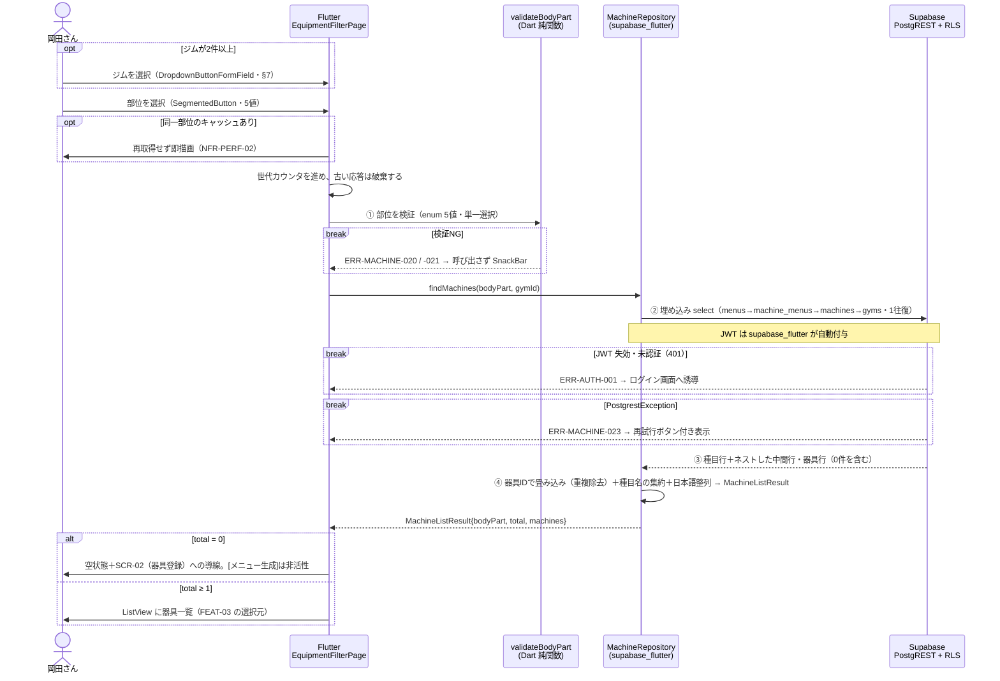

# FEAT-02 部位選択と器具の絞り込み 詳細設計

> **目的**: FEAT-02 を実装が迷わない粒度（入出力・バリデーション・クエリ・エラー・画面挙動・実装単位）まで具体化し、TDDの着手点を固定する。
> **書き方**: 実データは書かない。上位の正本（API契約＝`../../30_データ・IF設計/02_API設計.md` ／ 物理DB＝`../01_DB物理設計.md` ／ シーケンス＝`../../40_機能設計/01_シーケンス設計.md`）と矛盾させず、参照はIDで行う。横断方針（エラー分類・トランザクション・冪等・リトライ）は `../07_実装共通設計パターン.md` を正本とし本書では再定義しない。

> ⚠️ **本書はたたき台（2026-08-02 生成）**。岡田さんのレビューで確定する。

> 📖 ID（`FEAT-` `NFR-` `RULE-` 等）の意味は [ID早見表](../../00_ID早見表.md) を参照。

## 目次
1. [概要](#1-概要)
2. [処理フロー](#2-処理フロー)
3. [入出力仕様](#3-入出力仕様)
4. [業務ロジック](#4-業務ロジック)
5. [データアクセス](#5-データアクセス)
6. [エラー処理](#6-エラー処理)
7. [画面挙動・状態別表示](#7-画面挙動状態別表示)
8. [実装単位](#8-実装単位)
9. [テスト観点](#9-テスト観点)
10. [敵対的検証・要確認事項](#10-敵対的検証要確認事項)

## 1. 概要

| 項目 | 内容 |
|---|---|
| 対応要件 | FEAT-02（部位選択と器具の絞り込み） |
| 対応画面 | SCR-02 器具登録（登録済み器具の部位フィルタ） / SCR-03 トレーニング（メニュー生成の前段） |
| 対応API | **PostgREST 直接**。`supabase.from('training_menus').select('id, name, body_part, machine_menus(training_machines(id, name, gym_id, gyms(id, name)))')` |
| 絞り込み条件 | `.eq('body_part', …)` ＋ `.eq('machine_menus.training_machines.gym_id', …)`（§3） |
| 実行主体 | Flutter アプリ（`supabase_flutter`）。サーバ実装（Edge Function・RPC）は持たない |
| 関連ルール | RULE-003（部位タグ5種）/ RULE-004（器具絞り込みは部位タグ一致のみ・AI不使用） |
| 外部連携 | なし（EXT-01 を呼ばない決定的処理） |
| 性能目標 | NFR-PERF-02（決定的処理 ≤1秒）。画面全体は NFR-PERF-01（≤2秒） |
| 状態 | 状態を持たない（ST-01/ST-02 は FEAT-04 の `training_session_details` に属する） |

機能の骨子は次のとおり。

| # | 内容 | 根拠 |
|---|---|---|
| 1 | 利用者が部位（5値）を1つ選ぶ。その部位の種目に対応する器具一覧を返す | RULE-003 |
| 2 | 絞り込みは等値一致だけ。AI（EXT-01）は呼ばない | RULE-004 |
| 3 | 部位は `training_menus.body_part` にある。`training_machines` は部位列を持たない | `../../30_データ・IF設計/01_データモデル.md §8-1` |
| 3-b | 器具↔種目は中間テーブル `machine_menus` の多対多。**種目→中間→器具の3ホップ**で辿る | 同上 |
| 4 | 結果は `training_machines.id` を必ず含む。SCR-03 で FEAT-03 に渡す `machine_ids` の供給源になる | FEAT-03 |
| 5 | **1台の器具は複数の種目・複数の部位に対応する**（2026-08-08 決定）。同じ器具が結果に2回出ないよう重複を落とす | FEAT-01 §1 |
| 6 | **ジムを選んで絞り込む**（2026-08-08 決定）。クエリに `gym_id` の条件が加わる | §3・§5・§7 |
| 6-b | ジムが1件のときは選択UIを出さない。自動的にそのジムで絞る `[仮]` | §7 |

書き込みを伴わない。冪等でリトライ安全。

3ホップは PostgREST の**埋め込み select**で1往復にできる。`training_menus` に `machine_menus` を、その中に `training_machines` をネストする。

サーバ実装（Edge Function・RPC）は置かない。理由は次のとおり。

| 理由 | 根拠 |
|---|---|
| 加工が「畳み込みと整列」だけ。サーバでしかできない処理が無い | RULE-004 |
| 遮断は RLS が行う。認可のためのサーバ層が要らない | NFR-SEC-01 |
| 層を1つ減らすと個人保守の対象が減る | NFR-MAINT-01 |

## 2. 処理フロー

`../../40_機能設計/01_シーケンス設計.md §4` を正本とし、本節はバリデーション位置・クエリ発行点・0件分岐まで踏み込んで詳細化する。



順序と責務は次のとおり。

| 段 | 場所 | 内容 |
|---|---|---|
| ① 検証 | Flutter（`validateBodyPart`） | enum 5値のみ通す。NG なら送信しない |
| ② 送信 | `supabase_flutter` | JWT を自動付与。1往復のみ発行する |
| ③ 認可 | Supabase（RLS） | 起点の `training_menus` と中間の `machine_menus` で本人行だけを返す。**遮断の唯一の境界**（§5） |
| ④ 整形 | Flutter（純関数） | ネスト構造を器具IDで畳み込み、種目名を集約し、整列して返す |

- ①で弾いた値は送信しない。無駄な往復を作らない。
- ②は1回で完結させる。器具ごとに種目・ジムを引き直す N+1 を作らない。
- ④は**単なる平坦化ではない**。器具IDで畳み込まないと同じ器具が2回並ぶ。
- 重複が起きる理由は §5「`DISTINCT` が要る理由」に1か所でまとめた（§10 #10）。
- ①はUXのための前段検証であり、**セキュリティ境界ではない**。境界は RLS と DB の CHECK 制約（`../01_DB物理設計.md §3`）。
- 書き込み・外部送信がないためトランザクションもリトライ制御も持たない（横断方針は `../07_実装共通設計パターン.md`）。

## 3. 入出力仕様

### PostgREST `training_menus` → `training_machines`（埋め込み select）

| 項目 | 内容 |
|---|---|
| 方式 | PostgREST 直接（`supabase.from(...).select(...)`） |
| 対象 | `training_menus`（起点）→ `machine_menus`（中間・埋め込み）→ `training_machines`（ネスト埋め込み）→ `gyms`（さらにネスト） |
| 認証 | 必須。`supabase_flutter` が保持する JWT を自動付与（`Authorization: Bearer`） |
| 冪等 | 冪等（参照系）。往復は1回 |
| キャッシュ | HTTP キャッシュに頼らない。Flutter 側でジムと部位をキーに保持する（§7） |

```dart
// app/lib/data/machine_repository.dart
final rows = await supabase
    .from('training_menus')
    .select('id, name, body_part, '
            'machine_menus ( training_machines ( id, name, gym_id, gyms ( id, name ) ) )')
    // ジム指定時は上を machine_menus!inner ( training_machines!inner ( … ) ) にする（下表）
    .eq('body_part', bodyPart.label)   // 未指定時はこの行を付けない（絞り込みなし）
    .eq('machine_menus.training_machines.gym_id', gymId)  // ジム指定時のみ（下表・§7）
    .order('name');
```

| 引数 | 必須 | 規則 |
|---|---|---|
| `bodyPart` | 任意 | `BodyPart` enum（RULE-003 の5値）。`null` = 絞り込みなし（FEAT-01 の一覧用途と共用） |
| `gymId` | 任意 | 正の整数。ジムでの絞り込み（2026-08-08 決定・§7 の選択UI） |

- `user_id` は引数に取らない。RLS が本人行に限定する（§5・ADR-0005）。
- `gymId` は埋め込み側へのフィルタになる。中間テーブルを挟むぶん経路が伸びる。
- そのとき要る指定は2つ。

| 指定 | 内容 |
|---|---|
| 埋め込みの内部結合 | `machine_menus!inner(training_machines!inner(...))` |
| フィルタ | `.eq('machine_menus.training_machines.gym_id', gymId)` |

- `!inner` を落とすと器具が0台の種目行が残る。ジム指定時は必ず2段とも付ける。
- ジムが1件のときは `gymId` を渡さない `[仮]`。結果は同じになる（§7）。

起点は2案ある。**`training_menus` を起点にする**。重複はアプリ側で畳む（§4）。

| 起点 | 利点 | 難点 |
|---|---|---|
| `training_menus`（採用） | 部位フィルタが起点の条件になる | 同じ器具が複数行に現れる。畳み込みが要る |
| `training_machines` | 器具1件が1行。畳み込みが不要 | 部位フィルタが埋め込み側になる。`!inner` の漏れで全器具が返る |

#### 戻り値（PostgREST の生JSON・ネスト形）

```jsonc
// supabase.from('training_menus').select(...) の生の戻り
[
  {
    "id": "bigint",                    // training_menus.id
    "name": "string",                  // 種目名
    "body_part": "胸|背中|脚|肩|腕",
    "machine_menus": [                 // 0件のとき空配列（その種目に器具が無い）
      {
        "training_machines": {         // 中間行1つに器具1台
          "id":     "bigint",          // training_machines.id
          "name":   "string",          // マシン名
          "gym_id": "bigint",
          "gyms":   { "id": "bigint", "name": "string" }
        }
      }
    ]
  }
]
```

- **同じ器具が複数の種目行の下に現れる。** 理由と具体例は §5「`DISTINCT` が要る理由」に集約した。
- 畳み込みは §4 の責務。`groupMachines` が担う。

#### Dart モデル（アプリ内の契約）

リポジトリはネスト形を**器具単位に畳み込んだ封筒**に変換して返す。`{body_part, total, machines[]}` の形は維持する。

```dart
// app/lib/data/machine_repository.dart
class MachineListResult {
  final BodyPart? bodyPart;         // 要求のエコーバック（未指定時 null）
  final int total;                  // machines.length（重複除去後・0 を含む）
  final List<MachineItem> machines;
}

class MachineItem {
  final int id;            // training_machines.id（FEAT-03 の machineIds に渡す値）
  final String name;       // マシン名
  final int gymId;
  final String gymName;    // gyms.name（複数ジム運用時の識別用）
  final List<MachineMenuRef> menus;  // 対応する種目（1件以上・machine_menus 経由）

  List<String> get menuNames => menus.map((m) => m.menuName).toList();
  Set<BodyPart> get bodyParts => menus.map((m) => m.bodyPart).toSet();
}

class MachineMenuRef {
  final int menuId;        // training_menus.id
  final String menuName;   // training_menus.name
  final BodyPart bodyPart; // training_menus.body_part
}
```

形の設計判断（`../../30_データ・IF設計/02_API設計.md` に明示が無いため本書で確定案とする）:

| 判断 | 理由 |
|---|---|
| 配列直返しではなく封筒（`MachineListResult`） | `bodyPart` のエコーバックで、切替中の部位と応答の取り違えを検出できる |
| 封筒に `total` を持たせる | 0件分岐（§7）の判定を1箇所にする |
| **`menuName` `bodyPart` の単数フィールドを廃止し `menus` の配列にする** | 1台の器具が複数の種目に対応するようになった。単数では表現できない（本改訂の中核） |
| ネストではなく器具単位のリストを返す | 画面は器具単位に並べる。種目単位のネストのままだと UI 側で毎回畳み込みが要る |
| `menus` を含める | 器具に何ができるかを画面に出せる。FEAT-03 のプロンプト組み立てにも種目名が要る |
| `bodyParts` を派生プロパティにする | 部位は種目から導出される値であり、独立に保持すると `menus` と食い違う余地ができる |
| `gymName` を含める | ジム選択を出さないとき（1件）もどのジムの器具か示せる。`gyms` の再照会（N+1）を避ける |
| ページングを持たない | データ小規模のため当面ページングなし（`../../30_データ・IF設計/02_API設計.md §1`） |

- 部位で絞ったときの `menus` には**一致した種目だけ**が入る。
- その器具が他部位でも使えることは、絞り込みなしで引き直さないと分からない（§10 #11）。
- PostgREST の JSON キーは DB 列名（snake_case）に一致する（`../06_DB設計規約.md §5`）。
- Dart 側は lowerCamelCase にする。変換は `groupMachines`（§4）に閉じる。
- Flutter 側は Dart のため zod を使わない。`groupMachines` で型と必須を検証する。

### 3.1 バリデーション規則
| 項目 | 規則 | 違反時 |
|---|---|---|
| 認証 | Supabase セッションが有効であること（JWT 失効なし） | ERR-AUTH-001 |
| `bodyPart` | 任意。指定時は RULE-003 の5値と完全一致（前後空白トリム後）。部分一致・別名は不可 | ERR-MACHINE-020 |
| `bodyPart` | 単一選択のみ。`SegmentedButton` と enum 型で構造的に担保する | ERR-MACHINE-021 |
| `gymId` | 任意。指定時は 1 以上の整数 | ERR-MACHINE-022 |
| 未知の追加条件 | 無視する（呼び出しを失敗させない。将来の条件追加でアプリが壊れないようにする） | — |
| 結果件数 | 0件はエラーとしない（`total: 0`・§10 #1） | — |
| 結果件数 | 0件のとき［メニュー生成］を非活性にする（§7・§10 #1） | — |

## 4. 業務ロジック

RULE-004（器具絞り込みは部位タグ一致のみ）を、等値一致の1条件として実装する。優先度・距離・利用頻度などのスコアリングは持たない。

```dart
// app/lib/domain/body_part.dart（RULE-003・DEC-B04 / enum の正本は ../01_DB物理設計.md §4）
enum BodyPart {
  chest('胸'), back('背中'), legs('脚'), shoulders('肩'), arms('腕');
  const BodyPart(this.label);
  final String label;   // DB 格納値（日本語・§10 #8）

  static BodyPart? tryParse(String? raw) =>
      values.where((e) => e.label == raw?.trim()).firstOrNull;
}
```

| 判定条件 | 挙動 | 根拠 |
|---|---|---|
| `bodyPart` 未指定 | `.eq('body_part', …)` を付けず、本人の全器具を返す | FEAT-01 の一覧用途と共用 |
| `bodyPart` が5値のいずれか | `training_menus.body_part` の等値一致のみ | RULE-004 |
| `bodyPart` が5値以外 | `tryParse` が `null` を返す。**呼び出しを発行しない** | ERR-MACHINE-020 |
| `gymId` 指定 | 埋め込み側の `training_machines.gym_id` を等値一致で絞る | §3 |
| `gymId` 未指定 | ジムで絞らない。ジムが1件のときの既定 | §7 |
| 一致行が0件 | 空リストを返す（正常系）。［メニュー生成］は非活性にする | §10 #1 |
| 器具が0件の種目 | `machine_menus` が空配列。畳み込みで消える | 仕様どおり |
| **同一の器具が複数の種目行に現れる** | `training_machines.id` で畳み込み、1件にまとめる。種目は `menus` に集約する | §5・§10 #10 |
| 同一 `name` の別マシンが複数件 | 畳み込まずそのまま返す（`id` が異なる別の器具・FEAT-03 に必要なため） | FEAT-01 §10 #4 |

境界値・整列規則:

- 部位は5値ちょうど。5値以外（「腹」「全身」等）は DB の CHECK 制約でも拒否される（`../01_DB物理設計.md §3`）。
- アプリと DB の二重防御になる。
- **畳み込みのキーは `training_machines.id`。名前で畳まない。** 同名の別マシンが同一ジムに2台ある運用を潰さないため（FEAT-01（器具登録）§10 #4）。
- 整列は `gymName` → `name` → `id` の昇順。器具が複数の種目を持つため、`menuName` を第2キーにできない。
- 器具内の `menus` の整列は RULE-003 の部位順 → 種目名の昇順とする。`Set` や取得順に依存させない。
- PostgREST の `.order()` は DB の照合順序（`lc_collate`）に依存し、環境差が出る。
- そのため**畳み込み後に Dart 側で再整列**して決定性を担保する（NFR-QUAL-01 の単体テスト対象）。
- Dart の `String.compareTo` は UTF-16 コード単位の比較で、日本語の読み順にはならない `[仮]`。
- 順序が安定していれば要件は満たすと評価する（§10 #8）。

純関数として切り出す（単体テスト対象・NFR-QUAL-01）。

| 役割 | シグネチャ |
|---|---|
| 部位のパース | `BodyPart.tryParse(String?)` |
| 畳み込み | `groupMachines(List<dynamic>): List<MachineItem>` |
| 整列 | `sortMachines(List<MachineItem>): List<MachineItem>` |

## 5. データアクセス

PostgREST の埋め込み select は、内部的に3ホップ結合と等価な結果を1往復で返す。

SQL を2本載せるが、**実装が範とするのは (1) の平坦形**である。(2) は集約を SQL 側で行った場合の対照で、本書では採らない。

| # | 形 | 用途 | 採否 |
|---|---|---|---|
| (1) | `DISTINCT` の平坦形 | 器具の一覧を得る | **採用**。等価な埋め込み select を発行する |
| (2) | `array_agg` の集約形 | 種目名を SQL 側で配列にする | 採らない。畳み込みは Dart 側（§4） |

### (1) 3ホップの絞り込み（採用形）

```sql
-- FEAT-02: 部位 → 種目(training_menus) → 中間(machine_menus) → 器具(training_machines) の3ホップ絞り込み
-- （RULE-004・AI不使用）
-- $1 = auth.uid()（uuid・RLS が適用）, $2 = body_part（NULL のとき絞り込みなし）, $3 = gym_id（同上）
SELECT DISTINCT
       m.id     AS id,
       m.name   AS name,
       m.gym_id AS gym_id,
       g.name   AS gym_name
FROM   training_machines m
JOIN   machine_menus  mm ON mm.machine_id = m.id
JOIN   training_menus tm ON tm.id = mm.menu_id
JOIN   gyms           g  ON g.id  = m.gym_id
WHERE  tm.user_id = $1
  AND  ($2 IS NULL OR tm.body_part = $2)
  AND  ($3 IS NULL OR m.gym_id     = $3)
ORDER BY g.name, m.name, m.id;
```

### `DISTINCT` が要る理由

**重複除去の根拠は本項に集約する。** §1・§2・§3・§4・§10 #10 からは本項を参照する。

| 項目 | 内容 |
|---|---|
| 何が起きるか | 1台の器具は、紐づく種目の件数だけ行を返す |
| 原因 | 器具↔種目が多対多（`machine_menus`）になったため |
| 例 | ケーブルマシンが「ラットプルダウン」「ベントオーバーロー」に紐づく（どちらも背中） |
| 結果 | 部位「背中」で引くと**同じ器具が2行**出る |
| 旧構成 | `training_machines.menu_id` が単一FK。器具1件は必ず1行で `DISTINCT` は不要だった |
| 位置づけ | **この差分が今回の改訂で最も見落としやすい**（§10 #10） |

埋め込み select 自体は `DISTINCT` を持たない。**同じ役割をアプリ側の `groupMachines`（§4）が担う。**

### (2) 器具単位への畳み込み（種目名の配列・対照形）

種目名を一緒に返す場合は `DISTINCT` では足りない。器具IDで集約する。

```sql
-- 器具ごとに種目名を配列で返す形（§3 の MachineItem.menus に対応）
SELECT m.id, m.name, m.gym_id, g.name AS gym_name,
       array_agg(tm.name ORDER BY tm.name) AS menu_names
FROM   training_machines m
JOIN   machine_menus  mm ON mm.machine_id = m.id
JOIN   training_menus tm ON tm.id = mm.menu_id
JOIN   gyms           g  ON g.id  = m.gym_id
WHERE  tm.user_id = $1
  AND  ($2 IS NULL OR tm.body_part = $2)
  AND  ($3 IS NULL OR m.gym_id     = $3)
GROUP BY m.id, m.name, m.gym_id, g.name;
```

この形が返すのは、**器具1件＝1行**で種目名を配列に持つ構造である。

| 観点 | 内容 |
|---|---|
| 対応する型 | §3 の `MachineItem`。`menu_names` が `menus` に相当する |
| 本書の採否 | 採らない。畳み込みは Dart の `groupMachines`（§4）で行う |
| 採る場合 | ビューか RPC を作ることになる |
| 採っても消えないもの | 付け忘れの罠が SQL 側に移るだけ（§10 #10） |

### 発行方法とテーブル

| 観点 | 内容 |
|---|---|
| 発行元 | Flutter（`supabase_flutter`）。ビューも RPC も作らない |
| 往復回数 | **1回**。埋め込み select が種目・中間・器具・ジムを一度に返す |
| SQL との差 | 上記2本は器具駆動。埋め込み select は種目駆動のネスト形を返す |
| 畳み込みの担当 | **`DISTINCT` / `GROUP BY` 相当はアプリ側**（§4 `groupMachines`） |
| 対象テーブル | `training_machines`（SELECT）/ `machine_menus`（SELECT・多対多の中間） |
| 対象テーブル | `training_menus`（SELECT・絞り込みの起点）/ `gyms`（SELECT・表示名） |
| トランザクション境界 | なし。単一 SELECT のみで、明示トランザクションを張らない |
| 補償 | 不要。書き込み・外部送信を含まない |

```sql
-- machine_menus の2本は ../01_DB物理設計.md §3 に反映済み（今回の改訂で新設）
CREATE UNIQUE INDEX uq_mm_machine_menu ON machine_menus(machine_id, menu_id);
CREATE INDEX        ix_mm_menu         ON machine_menus(menu_id);

-- ⚠️ 提案（../01_DB物理設計.md §3 には未反映・本書では追加しない）
CREATE INDEX ix_train_menus_user_body_part ON training_menus(user_id, body_part);
CREATE INDEX ix_train_machines_gym         ON training_machines(gym_id);
```

| INDEX | 役割 |
|---|---|
| `ix_train_menus_user_body_part` | WHERE の駆動表。埋め込み select の起点になる（提案） |
| `ix_mm_menu` | **本改訂で必須**。種目 → 中間テーブルの結合キー。絞り込みの経路が `training_menus` 起点のため、この方向の逆引きが毎回走る |
| `uq_mm_machine_menu` | 中間 → 器具の結合に効く（先頭列が `machine_id`）。同時に器具↔種目の重複行を防ぐ |
| `ix_train_machines_gym` | ジム絞り込みの駆動列（2026-08-08 採用・DDL は提案のまま） |

- 旧構成の提案 `ix_train_machines_menu`（`training_machines(menu_id)`）は**不要になった**。列そのものが無くなったため。
- 代わりに `ix_mm_menu` が同じ役割を担う。
- 提案の2本は `../01_DB物理設計.md §3` に未反映。
- 既存は `ix_gym_visits_user_date` / `ix_train_sessions_user_date` / `ix_meal_logs_user_date` / `uq_tsd_session_menu` ＋ 上記 `machine_menus` の2本。

### RLS と性能の評価

方針は ADR-0005 で確定した。正本は `../01_DB物理設計.md §3`。

| 区分 | テーブル | ポリシー |
|---|---|---|
| 本人のみ | `training_menus`（起点） | `user_id = auth.uid()` |
| 共通マスタ | `training_machines` / `gyms` | `TO authenticated USING (true)` |
| 親経由 | `machine_menus` | `menu_id` の所有者が本人（`EXISTS`） |

| 観点 | 内容 |
|---|---|
| 「本人」の述語 | `users.id` は uuid で `auth.users.id` と一致する。`auth.uid()` と直接比較できる |
| 他3テーブル | `training_machines`・`machine_menus`・`gyms` は `user_id` 列を持たない |
| 帰結 | 同形のポリシーは書けない。共通マスタと親経由に分けた |
| EXISTS の深さ | `machine_menus` の1段だけ。器具に入れ子の EXISTS は張らない |
| 埋め込み先の RLS | **埋め込み先にも個別に効く。** 経路が `machine_menus` → `training_machines` の2段 |
| 絞り込みの担い手 | 起点の `training_menus` と中間の `machine_menus`。この2つが本人行に限定する |
| `machine_menus` が未整備だと | 他人の紐づけ経由で他人の器具が混ざる |
| サーバ層 | 無い。RLS が唯一の遮断機構になる |
| 性能の前提 | 個人利用（NFR-SCALE-01：マルチテナント適用外） |
| 想定件数 | 種目は数十件・器具は数百件・中間行は数百件 |
| 性能見積 | `machine_menus` の2本の INDEX があれば NFR-PERF-02（≤1秒）を余裕で満たす |
| 将来 | マルチユーザー化で `training_menus` が全ユーザー分に膨らむ（`../../30_データ・IF設計/01_データモデル.md §8-8`） |
| 将来の影響 | 駆動表のフルスキャンが効く。INDEX は先に張る判断が妥当（§10 #5） |

> ⚠️ 要確認（人間判断）: 共通マスタは認証済みなら誰でも読み書きできる（🟡 中）。
>
> - 対象は `training_machines` と `gyms`。器具そのものは他人からも見える。
> - 本機能の絞り込みは `training_menus` 起点のため、**一覧に他人の器具は出ない**。
> - 単一ユーザー運用（NFR-SCALE-01）では実害が無いと評価した。Phase2 で見直す。

## 6. エラー処理
| ERR-ID | 検出層 | 発生条件 | 利用者向けメッセージ（意図） | retryable | ログ |
|---|---|---|---|---|---|
| ERR-AUTH-001 | Supabase Auth / PostgREST 401・403 | JWT が失効・無効（`AuthException`／`PostgrestException` の `PGRST301`・`42501`） | 再ログインを促す（共通契約） | false | 認証失敗として記録（NFR-SEC-AUDIT-02） |
| ERR-MACHINE-020 | Flutter（`BodyPart.tryParse`） | 部位が RULE-003 の5値以外 | 部位の指定が不正である旨を伝え、部位を選び直させる | false | WARN。受領値と相関IDを記録（`../05_ログ設計.md`） |
| ERR-MACHINE-021 | Flutter（`SegmentedButton` 単一選択） | 部位が複数指定されている | 部位は1つだけ選べる旨を伝える | false | WARN。相関IDを記録 |
| ERR-MACHINE-022 | Flutter | `gymId` が正の整数でない（§7 のジム選択） | ジムの指定が不正である旨を伝える | false | WARN。相関IDを記録 |
| ERR-MACHINE-023 | PostgREST（`PostgrestException`）／通信断 | DB照会が例外・タイムアウトで失敗 | 器具の取得に失敗した旨を伝え、再試行を促す | true | ERROR。例外内容と相関IDを記録（利用者には返さない） |

- ERR-MACHINE-020 / -021 / -022 は**呼び出し前**に検出する。往復を発生させない。
- ERR-MACHINE-021 は `SegmentedButton` の単一選択と `BodyPart` 型により構造的に起きない。ID は将来のUI変更（複数選択化）に備えて予約する。
- `PostgrestException` は `code` / `message` / `details` / `hint` の4フィールドを持つ。
- `code` で ERR-AUTH-001 と ERR-MACHINE-023 を分岐する（2026-08-08 確定）。
- `PGRST301`（JWT 失効）と `42501`（権限不足・RLS 拒否）が ERR-AUTH-001。それ以外は ERR-MACHINE-023。
- `42501` の HTTP は認証済みなら 403、未認証なら 401 になる。どちらも同じ ERR に写す。
- 写像の正本は `../07_実装共通設計パターン.md §1`。本書では再定義しない。
- `details`・`hint` が返るかは `client-error-verbosity` 設定に依る（同 §1）。本機能は使わない。
- ERRドメイン `ERR-MACHINE-*` は FEAT-01（器具登録）と共有する。**FEAT-02 は 020〜039 の範囲のみ**を使う（001〜019 は FEAT-01）。
- 中間テーブル化で FEAT-02 側の ERR は増えない。参照系のままで、追加の検証が生じないため。
- ジム絞り込みでも ERR は増えない。既存の ERR-MACHINE-022 を確定にしただけである。
- 器具0件は**エラーではない**（`total: 0`）。`ERR-MACHINE-*` を割り当てない（§10 #1）。
- 0件のときは［メニュー生成］を非活性にする。エラー表示ではなく空状態で扱う（§7）。
- 同じ器具が重複して返る事象も**エラーではない**。畳み込み漏れの実装バグである。
- そのためテスト（TC-FEAT02-14）で検出する。ERR は割り当てない（§10 #10）。
- 分類（業務エラー／システムエラー／一時失敗）とリトライ方針の正本は `../07_実装共通設計パターン.md`。本書では再定義しない。

> ERRの完全列挙の正本は `../../60_テスト設計/02_RED母集合_受入基準・状態・エラー.md`（段6で集約）。本表はその入力とする。

## 7. 画面挙動・状態別表示
| 状態 | 表示 | 操作可否 |
|---|---|---|
| 初期/空（部位未選択） | ジム選択（下表）＋ `SegmentedButton<BodyPart>`（胸/背中/脚/肩/腕）。器具エリアは淡色の `Text`「部位を選ぶと器具が表示されます」 | ジム・部位の選択のみ可 |
| 読込中 | 器具エリアに `CircularProgressIndicator`（または `shimmer` のカード3枚）。`SegmentedButton` は活性のまま | 部位切替可・[メニュー生成]は非活性 |
| 成功（`total` ≥ 1） | `ListView.builder` に `Card` ＋ `ListTile`（内訳は下表） | 全操作可。SCR-03 は1件以上選択で[メニュー生成]活性 |
| 成功（`total` = 0） | 空状態。`Icon` ＋ `Text`「この部位の器具はまだ登録されていません」＋ SCR-02 への `FilledButton`「器具を登録する」 | **[メニュー生成]は非活性**（§10 #1） |
| エラー | `ScaffoldMessenger.showSnackBar`（赤系）で通知。器具エリアは `Text` ＋ `FilledButton.tonal`「再試行」 | 再試行・部位切替可 |

- 「再試行」ボタンは `retryable: true` のときだけ出す。
- 0件で［メニュー生成］を押せなくする理由は、AI に渡す情報が無いためである。
- 呼んでも自重種目しか出ず、EXT-01（Google Gemini API）の課金だけが発生する（FEAT-03 §7）。

### ジムの選択

| 条件 | 表示 |
|---|---|
| ジムが2件以上 | `DropdownButtonFormField<int>` でジムを選ぶ `[仮]`。器具エリアの上に置く |
| ジムが1件 | **選択UIを出さない。** そのジムで自動的に絞る `[仮]` |
| ジムが0件 | 器具も0件になる。SCR-02 のジム登録へ誘導する |

- ジムを切り替えたら器具一覧を引き直す。部位の選択は保持する。
- 未選択のまま部位だけ選ばせない。ジムは初期表示時に既定値を入れる `[仮]`。
- ジム一覧は `gyms` から取得する（FEAT-01 C-09）。

### 成功時のカードの内訳

| 位置 | 内容 |
|---|---|
| `title` | マシン名 |
| `subtitle` | `Wrap` に **種目名の `Chip` を件数分** |
| `subtitle` | 続けて部位の `Chip`（重複除去後・RULE-003 の並び） |
| `subtitle` | 続けてジム名の `Chip` |
| SCR-03 のみ | `CheckboxListTile` で複数選択できるようにする |

- 種目名の `Chip` は件数が増えると1台のカードが縦に伸びる。
- 3件を超える分は `+N` の `Chip` に畳む。タップで全件を `showModalBottomSheet` に出す `[仮]`。
- 部位で絞った結果のカードには、**その部位に一致した種目だけ**が出る。
- 器具が他部位でも使えることはこの画面では分からない（§10 #11）。

### キャッシュと高速切替

| 項目 | 内容 |
|---|---|
| キャッシュ単位 | ジムと部位の組をキーに Flutter 側で保持する |
| 効果 | 同じジム・同じ部位の再選択では再取得しない（NFR-PERF-02 の体感短縮） |
| 破棄 | FEAT-01 の器具登録・更新・削除が成功したら**全破棄**する |
| 部分破棄にしない理由 | 紐づけ差し替え（FEAT-01 C-03）は選択中以外の部位の結果も変えるため |
| 高速切替の課題 | `AbortController` に相当する仕組みが Dart に無い |
| 対処 | **世代カウンタ**で古い応答を捨てる。要求ごとに採番し、応答時に最新かを照合する |
| 往復 | 中断しない。捨てるのは描画だけ |

- SCR-02（器具登録）と SCR-03（トレーニング）で `BodyPartFilter` と `MachineListView` を共有する。
- 違いは選択UI（チェックボックスの有無）だけ。`selectable` フラグで切り替える。

## 8. 実装単位
| # | ファイル | 役割 | 主なシグネチャ |
|---|---|---|---|
| 1 | `app/lib/features/equipment/equipment_filter_page.dart` | 部位フィルタ画面。SCR-02/SCR-03 で共用し、状態（初期/読込中/成功/0件/エラー）を保持する | `class EquipmentFilterPage extends StatefulWidget` |
| 2 | `app/lib/features/equipment/body_part_filter.dart` | 部位選択UI（`SegmentedButton`）。RULE-003 の5値を表示 | `class BodyPartFilter extends StatelessWidget { final BodyPart? value; final ValueChanged<BodyPart> onChanged; }` |
| 3 | `app/lib/features/equipment/machine_list_view.dart` | 器具リスト表示。読込中/0件/エラーの3状態を内包し、`selectable` で選択UIを切替。1台に複数の種目 `Chip` を並べる（§7） | `class MachineListView extends StatelessWidget { final MachineListResult? result; final bool selectable; }` |
| 4 | `app/lib/data/machine_repository.dart` | §3 の埋め込み select を発行し、器具IDで畳み込み・整列して `MachineListResult` を返す。`SupabaseClient` をコンストラクタで受け、テストで差し替え可能にする | `Future<MachineListResult> findMachines({BodyPart? bodyPart, int? gymId})` |
| 5 | `app/lib/domain/body_part.dart` | 部位 enum の定義（RULE-003）。SCR-02/SCR-03/FEAT-03 から共用 | `enum BodyPart` / `static BodyPart? tryParse(String?)` |
| 6 | `app/lib/domain/machine_mapping.dart` | ネスト形の畳み込み（`training_machines.id` で重複除去・種目を集約）と整列の純関数（単体テスト対象・NFR-QUAL-01） | `List<MachineItem> groupMachines(List<dynamic> rows)` / `List<MachineItem> sortMachines(List<MachineItem> items)` |
| 7 | `app/lib/data/supabase_client_provider.dart` | `SupabaseClient` の供給（既存・全機能共用） | `SupabaseClient get supabase` |
| 8 | `app/lib/features/equipment/gym_filter.dart` | ジム選択UI（`DropdownButtonFormField`）。ジムが1件のときは何も描画しない（§7） | `class GymFilter extends StatelessWidget { final List<Gym> gyms; final int? value; final ValueChanged<int> onChanged; }` |

## 9. テスト観点
| TC-ID | 観点 | 期待 |
|---|---|---|
| TC-FEAT02-01 | 部位一致の絞り込み（RULE-004） | 指定部位の種目に紐づく器具だけが返る。他部位の器具は含まれない |
| TC-FEAT02-02 | 3ホップの結合 | 器具の `menuNames` と `bodyParts` が `machine_menus` 経由で紐づく種目の値と一致する |
| TC-FEAT02-03 | 0件 | 例外を投げず `total: 0`・`machines: []` を返す |
| TC-FEAT02-04 | `bodyPart` 未指定 | 本人の全器具が返る（例外にしない） |
| TC-FEAT02-05 | `bodyPart` が enum 外 | `tryParse` が `null`。ERR-MACHINE-020 として扱い、**PostgREST 呼び出しが発行されない** |
| TC-FEAT02-06 | 部位の単一選択 | `SegmentedButton` から複数値が渡らない（ERR-MACHINE-021 の構造的担保） |
| TC-FEAT02-07 | 未認証 | ERR-AUTH-001。ログイン画面へ誘導する |
| TC-FEAT02-08 | 他ユーザーの器具の遮断 | 他ユーザーの `training_menus` に紐づく器具が返らない。**RLS が唯一の遮断機構**のため統合テストで検証する（方式は ADR-0005 で確定・§5） |
| TC-FEAT02-09 | 整列の決定性 | 同一データで常に `gymName`→`name`→`id` の順。DB の照合順序に依存しない |
| TC-FEAT02-10 | 同名マシンの複数件 | 同名でも `id` が異なる器具は畳まれず件数分返る |
| TC-FEAT02-11 | 性能（NFR-PERF-02） | 想定データ量で応答が1秒以内。往復が1回（N+1 が無い） |
| TC-FEAT02-12 | 部位の高速切替 | 連続切替で最後に選んだ部位の結果だけが描画される（世代カウンタ） |
| TC-FEAT02-13 | 器具0件の種目 | `machine_menus` が空配列の種目は畳み込みで消え、件数に加算されない |
| TC-FEAT02-14 | **重複の畳み込み（本改訂の中核）** | 1台の器具が同じ部位の種目を2つ持つとき、その部位で絞ると器具は**1件だけ**返る。`menus` には2件入る（§5 の `DISTINCT`・§10 #10） |
| TC-FEAT02-15 | 複数部位の器具 | 背中・胸の2種目に紐づく器具は、部位「背中」でも「胸」でも返る。`id` は同一 |
| TC-FEAT02-16 | 絞り込みなしの `menus` | `bodyPart` 未指定で引くと、各器具の `menus` に全部位分の種目が入る |
| TC-FEAT02-17 | ジムでの絞り込み | 指定したジムの器具だけが返る。他ジムの器具は含まれない |
| TC-FEAT02-18 | ジムが1件 | ジム選択UIを描画しない。`gymId` 未指定でもそのジムの器具だけが返る |
| TC-FEAT02-19 | 器具0件時の生成ボタン | `total: 0` のとき［メニュー生成］が非活性で、SCR-02 への導線が出る |

受入基準（G/W/T）の候補:
- [AC] Given 部位に器具が登録済み When 利用者がその部位を選ぶ Then 該当する器具だけが1秒以内に一覧表示される
- [AC] Given その部位に器具が1件も無い When 利用者がその部位を選ぶ Then エラーではなく空状態と器具登録（SCR-02）への導線が表示される
- [AC] Given その部位に器具が1件も無い When SCR-03 を表示する Then ［メニュー生成］は押せない
- [AC] Given ジムが2件登録済み When ジムを選んで部位で絞り込む Then そのジムの器具だけが表示される
- [AC] Given ジムが1件だけ登録済み When SCR-02 を開く Then ジムの選択UIは表示されない
- [AC] Given 部位に5値以外の値が渡された When 絞り込みを実行する Then ERR-MACHINE-020 となり、Supabase への照会は発行されない
- [AC] Given 未認証 When 絞り込みを実行する Then ERR-AUTH-001 が返る
- [AC] Given 複数ジムの器具が登録済み When 部位で絞り込む Then 各器具にジム名が付いて識別できる
- [AC] Given 1台の器具が同じ部位の種目を2つ持つ When その部位で絞り込む Then その器具は一覧に1件だけ表示され、対応する種目名が2つ並ぶ
- [AC] Given 1台の器具が背中と胸の種目を持つ When 部位「背中」で絞り込み、次に「胸」で絞り込む Then どちらの結果にもその器具が現れる

> 受入基準・ST・ERR の**正本は段6**（`../../60_テスト設計/02_RED母集合_受入基準・状態・エラー.md`・本PR対象外）。本節はその母集合への入力。

## 10. 敵対的検証・要確認事項
| # | 論点 | 内容 | 重大度 |
|---|---|---|---|
| 1 | ~~該当器具0件のときの挙動~~（**解決**） | 0件は正常系（空配列）で確定。**2026-08-08 決定で［メニュー生成］を非活性にする。** 代わりに SCR-02 への導線を出す（§7） | — |
| 〃 | 〃 | 理由は AI に渡す情報が無いこと。呼んでも自重種目しか出ず EXT-01 の課金だけが発生する | — |
| 2 | 責務境界（どの層が何を持つか） | 未指定は全件、enum外は拒否で確定。責務境界は PostgREST 直接化で `machine_repository.dart` のメソッド分割に移った。FEAT-01 との兼務可否・ERR連番・CHECK 強制（§2）を着手前に決める | 🟡 中 |
| 3 | ~~複数ジム運用時にどのジムの器具を出すか~~（**解決**） | **2026-08-08 決定。ジムを選んで絞り込む。** クエリに `gym_id` を足し（§3・§5）、画面にジム選択UIを置く（§7） | — |
| 〃 | 〃 | `!inner` は2段とも要る（§3）。ジムが1件のときは選択UIを出さず、そのジムで絞る `[仮]` | — |
| 4 | ~~重複行（マシンと種目の対応関係）~~（**解決**） | 旧構成は単一FK `training_machines.menu_id` で1台が複数種目を持てず、同名マシンの重複登録を招いた。2026-08-08 に `machine_menus` を導入し解消。`DISTINCT` が要る（#10） | — |
| 5 | 3ホップJOINの性能とINDEX設計 | データモデル §8-1 がINDEX考慮を明記。`uq_mm_machine_menu`・`ix_mm_menu` は反映済みで両方向が張れている。§5 の提案2本は未反映で、後付けを避け初期DDLに含めるのが妥当（NFR-MIGR-03） | 🟡 中 |
| 〃 | 〃 | ジム絞り込みの採用で `ix_train_machines_gym` は実際に使われる。反映の要否がより効く | 〃 |
| 6 | ~~`training_machines`・`machine_menus`・`gyms` のRLS~~（**解決**） | **2026-08-08 決定（ADR-0005）。** `training_machines`・`gyms` は共通マスタ（`TO authenticated USING (true)`）、`machine_menus` は親経由の `EXISTS`、起点の `training_menus` は `user_id = auth.uid()` で確定（§5） | — |
| 〃 | 〃 | 埋め込み先にも個別にRLSが効く点は変わらない。`machine_menus` のポリシーを落とすと器具が絞られない | — |
| 7 | ~~ユーザー識別子の紐付け~~（**解決**） | **案A で確定（ADR-0005）。** `users.id` を uuid にして `auth.users.id` と一致させた。§5 の `$1` は `auth.uid()` になる | — |
| 〃 | 〃 | RLS 述語は `training_menus.user_id = auth.uid()`。#6 と同時に決着した | — |
| 8 | 部位enum値が日本語であること | 格納値・クエリ値が日本語（RULE-003・DEC-B04）。URLエンコードは `supabase_flutter` 任せ | 🟢 低 |
| 〃 | 〃 | 課題は表記変更が移行を伴う点と `String.compareTo` が読み順でない点（§4）。MVP では許容 | 〃 |
| 9 | 横断方針の正本が未確定 | `../07_実装共通設計パターン.md` はテンプレートのままでエラー分類・リトライ方針の値スロットが空。本書は「再定義しない」方針のため、ERR-MACHINE-023 の retryable 判定などが正本側の確定待ち | 🟡 中 |
| 10 | `DISTINCT`（畳み込み）の付け忘れ | #4 と引き換えに生じた論点。対策は §5 の `DISTINCT` と §4 の `groupMachines` だが、付け忘れても例外は出ず同じ器具が並ぶだけで気付きにくい。再現には同一部位2種目の器具が要る（TC-FEAT02-14） | 🟡 中 |
| 11 | 絞り込み時に返す種目の範囲 | 部位で絞ると `menus` は一致した種目だけになり、全種目が要る FEAT-01・FEAT-03 に足りない | 🟡 中 |
| 〃 | 〃 | 案は (a) 絞り込みなしで引き直す、(b) 常に全種目とし一致をフラグで持つ。本書は (a) を`[仮]` | 〃 |

> ~~⚠️ 要確認（人間判断）: **後継ADRの起票と段3の改訂が必要。**~~（**解決**・2026-08-08）
> - 本書は Flutter + Supabase 構成（Vercel 不使用）で記述している。
> - ~~ADR-0001（Vercel AI Gateway 採用）・ADR-0002（Next.js + Mantine 採用）は Vercel 前提のまま。~~
> - ~~`30_データ・IF設計/02_API設計.md`（`/api/*` の Route Handler 契約）も同じ。~~
> - **ADR-0010**（Flutter + Supabase）と **ADR-0011**（Gemini API 直接）を起票した。
> - ADR-0001・ADR-0002 は Superseded にした。段3も改訂済み。
> ⚠️ 要確認（人間判断）: **段3の `GET /api/machines?body_part=` は改訂が要る。**
> - 本書では PostgREST 直接（`training_menus` の埋め込み select）に置き換えた。
> - 段3の契約表から本エンドポイントを削除し、テーブル直アクセスとして書き直す。
> - 絞り込み条件に `gym_id` を加える（2026-08-08 決定・#3）。
> - HTTPステータス（400/401/500）前提のERR定義も `PostgrestException` ベースへ読み替える。
> ~~要確認（人間判断）: #1 器具0件のとき FEAT-03（AIメニュー生成）へ進ませるか。~~（**解決**・2026-08-08）
> - **進ませない。** 器具0件のとき［メニュー生成］を非活性にする（§7）。
> - 代わりに器具登録（SCR-02）への導線を出す。
> - AI に渡す情報が無く、呼んでも EXT-01 の課金だけが発生するため。
> ~~要確認（人間判断）: #3 絞り込みに `gymId` を追加するか。~~（**解決**・2026-08-08）
> - **追加する。** ジムを選んで絞り込む方式で確定した。
> - クエリは §3・§5、画面は §7 のジム選択UIが正本。
> - ジムが1件のときは選択UIを出さない `[仮]`。
> ⚠️ 要確認（人間判断）: #5 §5 に提案として残した2本のINDEX（`ix_train_menus_user_body_part` / `ix_train_machines_gym`）を `../01_DB物理設計.md §3` に反映するか。本書ではDDLを追加していない（`machine_menus` の2本は物理設計側で反映済み）。
> ~~要確認（人間判断）: #6 `training_machines`・`machine_menus`・`gyms` のRLSポリシー方式（`training_menus` 経由の EXISTS か、共有マスタ扱いか）。~~（**解決**・ADR-0005）
> - 共通マスタ（`training_machines`・`gyms`）と親経由（`machine_menus`）に分けて確定した。§5 が詳細。
> - 残る要確認は「共通マスタを誰でも書き換えられる」点のみ（§5・Phase2）。
> ⚠️ 要確認（人間判断）: #11 部位で絞ったときに返す種目を「一致した分だけ」にするか「その器具の全種目」にするか。FEAT-03 に渡す情報量が変わる。
> ⚠️ 要確認（人間判断）: #2 器具一覧の取得（FEAT-01）と部位絞り込み（FEAT-02）を `machine_repository.dart` の同一メソッドで兼ねるか分けるか。

> 関連: API契約＝`../../30_データ・IF設計/02_API設計.md` / 物理DB＝`../01_DB物理設計.md` / 横断方針＝`../07_実装共通設計パターン.md` / シーケンス＝`../../40_機能設計/01_シーケンス設計.md`。
