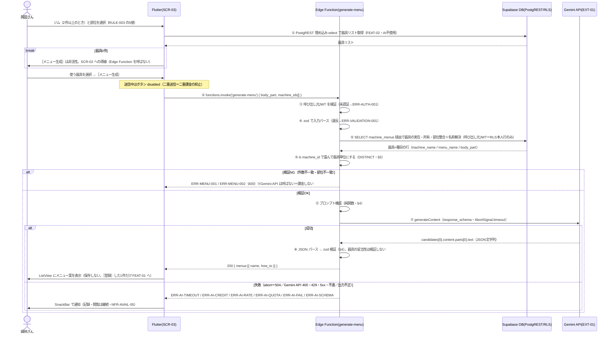

# FEAT-03 AIメニュー提案 詳細設計

> **目的**: FEAT-03 を実装が迷わない粒度（入出力・バリデーション・クエリ・エラー・画面挙動・実装単位）まで具体化し、TDDの着手点を固定する。
> **書き方**: 実データは書かない。上位の正本（API契約＝`../../30_データ・IF設計/02_API設計.md` ／ 物理DB＝`../01_DB物理設計.md` ／ シーケンス＝`../../40_機能設計/01_シーケンス設計.md`）と矛盾させず、参照はIDで行う。横断方針（エラー分類・トランザクション・冪等・リトライ）は `../07_実装共通設計パターン.md` を正本とし本書では再定義しない。

> ⚠️ **本書はたたき台（2026-08-02 生成）**。岡田さんのレビューで確定する。

> ~~⚠️ 要確認（人間判断）: **本機能の設計を確定させる前に、後継ADRを起票すること。**~~（**解決**・2026-08-08）
> - **ADR-0011**（Gemini API 直接）を起票し Accepted にした。本機能の根拠ADRはこれになる。
> - 内容は Gemini API 直接呼び出し・モデル選定・フォールバック不在の受容。
> - ADR-0001 は `Superseded by ADR-0011`、ADR-0002 は `Superseded by ADR-0010` に遷移済み。
> - 段3（`30_データ・IF設計/02_API設計.md`）も改訂済み。経緯は §10 #12。

## 目次
1. [概要](#1-概要)
2. [処理フロー](#2-処理フロー)
3. [入出力仕様](#3-入出力仕様)
4. [業務ロジック](#4-業務ロジック)
5. [データアクセス](#5-データアクセス)
6. [エラー処理](#6-エラー処理)
7. [画面挙動・状態別表示](#7-画面挙動状態別表示)
8. [実装単位](#8-実装単位)
9. [テスト観点](#9-テスト観点)
10. [敵対的検証・要確認事項](#10-敵対的検証要確認事項)

## 1. 概要

| 項目 | 内容 |
|---|---|
| 対応要件 | FEAT-03（AIメニュー提案。選択部位＋利用可能な器具からトレーニングメニュー案を生成する） |
| 対応画面 | SCR-03 トレーニング |
| 対応API | Edge Function `generate-menu`（`supabase.functions.invoke('generate-menu')`）。本書の主対象 |
| 前段 | 器具一覧の取得は FEAT-02 の責務。Flutter から PostgREST を直接叩く（AI を通さない・RULE-004） |
| 前段の絞り込み | ジム＋部位で絞る（FEAT-02 §3・§7）。ジムが1件のときは選択UIを出さない `[仮]` |
| 前段が0件のとき | ［メニュー生成］は非活性。**本機能は呼ばれない**（FEAT-02 §10 #1） |
| 関連ルール | RULE-003（部位タグ5種）／RULE-004（器具の絞り込みは部位タグ一致のみ・AI不使用）／RULE-006（メニュー提案は AI＝EXT-01 を使う） |
| 外部連携 | EXT-01（Google Gemini API を Edge Function から直接呼ぶ） |
| 性能目標 | NFR-PERF-03（AIメニュー提案 ≤15秒）。不達時は NFR-AVAIL-05 の縮退（記録・閲覧は継続） |
| 状態 | 状態を持たない（ST-01/ST-02 は FEAT-04 のトレーニング明細が持つ） |
| 優先度 | MUST |
| AI利用 | あり（生成のみ）。部位→器具の絞り込みは決定的処理で AI 不使用（RULE-004） |

利用者の操作は4ステップ。

| # | 操作 | 処理 |
|---|---|---|
| 1 | SCR-03 でジムと部位を選ぶ | FEAT-02 が該当する器具リストを返す（PostgREST・AI不使用） |
| 2 | 使う器具を選ぶ | Flutter 内の選択状態のみ。通信しない |
| 3 | ［メニュー生成］を押す | Edge Function `generate-menu` を1回だけ呼ぶ |
| 4 | 提案から［登録］を押す | その1件だけ `training_menus` に INSERT する（FEAT-01 C-06） |

- 器具が0件のとき③は押せない。前段で非活性にする（§7・FEAT-02 §10 #1）。

Edge Function 側の要点。

| 項目 | 内容 |
|---|---|
| AI 呼び出し前に必ず DB 検証する | 器具の実在・所有・部位整合を確認する（§4・§5） |
| 器具↔種目は多対多 | 中間テーブル `machine_menus` で結ぶ。1台の器具が複数の種目・複数の部位に対応する |
| AI に渡すのは器具IDではない | DB で解決した器具名・対応種目名（器具ごとに複数）・部位を渡す（§3.2） |
| 生成結果は永続化しない | **Edge Function は保存しない。応答を返すだけ**（2026-08-08 決定・§10 #1） |
| 提案の行き先 | 画面に一覧を出す。利用者が［登録］した1件だけ `training_menus` へ INSERT する |
| 提案履歴 | **テーブルを作らない。** 画面を離れると提案は消える |
| 非冪等・自動リトライなし | EXT-01 は従量課金。1リクエスト＝1課金 |
| 二重送信を抑止する | UI の disabled のみで持つ。アプリ側のレート制限は実装しない（§10 #4） |
| コスト上限の担保 | Gemini API の日次クォータに委ねる。超過は `ERR-AI-QUOTA`（§6） |

## 2. 処理フロー

`../../40_機能設計/01_シーケンス設計.md §2` を正本とし、本節はそれを**バリデーション位置・クエリ発行点・タイムアウト境界**まで詳細化したもの。



| 設計判断 | 理由 |
|---|---|
| トランザクションを張らない | 書き込みが無い。EXT-01 呼び出しは DB 接続を保持したまま行わない |
| ⑤ を ⑦ より先に置く | 無効な入力で課金しないため。AI 呼び出しは検証を全通過後に1回だけ |
| 出力の器具を検証しない | 提案は参考情報と割り切る。除外処理を持たない（§10 #3） |
| ① を Edge Function に通さない | 器具の絞り込みは決定的処理（RULE-004）。AI も Function も要らない |
| ① が0件なら②を発行しない | AI に渡す情報が無い。呼んでも課金だけが発生する（FEAT-02 §10 #1） |
| 応答を保存しない | 提案は画面の状態にすぎない。採用した1件だけが永続化の対象になる |

エラーの分岐条件と ERR 対応は §6 が詳細。

## 3. 入出力仕様

2層で定義する。

| 節 | 層 | 位置づけ |
|---|---|---|
| §3.1 | Flutter → Edge Function | Flutter から見える契約 |
| §3.2 | Edge Function → Gemini API | Edge Function 内部の実装仕様（EXT-01） |
| §3.3 | 両層に共通 | バリデーション規則 |

### 3.1 Flutter → Edge Function（呼び出し契約）

| 項目 | 内容 |
|---|---|
| 呼び出し | `supabase.functions.invoke('generate-menu')`（`body` は下記 Request body） |
| 実体 | `POST {SUPABASE_URL}/functions/v1/generate-menu` |
| 認証 | 必須。`supabase_flutter` が現行セッションの JWT を `Authorization: Bearer` で自動付与（ADR-0004） |
| Content-Type | `application/json`（リクエスト・レスポンスとも） |
| 冪等性 | 非冪等。自動リトライなし（従量課金） |
| タイムアウト | Edge Function 側 ≤15秒（NFR-PERF-03）。超過は 504 |
| ステータス | 200 / 400 / 401 / 402 / 409 / 429 / 500 / 502 / 504 |
| 失敗時の受け取り | `FunctionException`（`status` ＋ ボディの `error_code`）`[仮]`。Dart 側でモデルクラスに `fromJson` して分岐する |

```jsonc
// Request body（invoke の body）
{
  "body_part": "胸|背中|脚|肩|腕",   // 必須・enum（RULE-003）
  "machine_ids": [1, 2]              // 必須・整数配列・1件以上・重複なし
}

// Response 200
{
  "menus": [ { "name": "string", "how_to": "string" } ]
}

// Error（共通契約に準拠）
{ "error_code": "ERR-...", "message": "string", "retryable": true }
```

- Dart 側に zod は無い。`AiMenu` モデルクラス＋`fromJson` で検証する。
- **応答に ID は無い。** Edge Function が保存しないため、提案を指す永続的な識別子が存在しない。
- 提案は Flutter の画面状態としてのみ保持する。画面を離れると消える（§7）。
- 旧契約 `POST /api/menus/generate`（段3 `02_API設計.md §4.2`）は**廃止**。Edge Function `generate-menu` に置き換わる。
- 段3の契約表の改訂が要る（§10 #12）。
- 前段（FEAT-02）で器具が0件のとき、この呼び出しは発行されない（§1・§7）。

### 3.2 Edge Function → Gemini API（EXT-01・実装仕様）

Deno の `fetch` で直接呼ぶ。SDK は使わない。API 仕様は **2026-08-08 に公式ドキュメントで確認済み**。

**REST の JSON は snake_case。** 正本は `../03_外部連携IF/10_GeminiAPI連携.md §1`。

| 項目 | 値 | 根拠 |
|---|---|---|
| エンドポイント | `POST https://generativelanguage.googleapis.com/v1beta/{model=models/*}:generateContent` | EXT-01 |
| モデル | 環境変数 `GEMINI_MODEL`（既定 `gemini-3.5-flash`）。**ハードコードしない** | EXT-01 |
| 認証 | ヘッダ `x-goog-api-key: $GEMINI_API_KEY`。Edge Function の環境変数のみ。Flutter 側には置かない | NFR-SEC-02 |
| 構造化出力 | `generationConfig.response_mime_type: "application/json"` ＋ `generationConfig.response_schema` | EXT-01 |
| 入力 | `contents[].parts[].text`（system 相当は `systemInstruction: { parts: [{ text }] }`）。画像入力は使わない（FEAT-08 のみ） | §4 L2 |
| 思考量 | **`thinking_level: medium`**（確定・ADR-0018）。取り得る値は `minimal`／`low`／`medium`（既定）／`high`。**`thinkingConfig` は誤り** | EXT-01 |
| 同上・併用禁止 | `thinking_budget`（旧）と併用すると 400 エラーになる。本PJは併用しない | EXT-01 |
| 同上・本PJの値 | 未確定。`medium` と `high` を実装時に比較する | §10 #19 |
| タイムアウト | `AbortSignal.timeout(AI_MENU_TIMEOUT_MS)`。既定 13000ms `[仮]`（15秒枠から DB 照会・整形の余白を差し引く） | NFR-PERF-03 |
| リトライ | 自動リトライなし。`fetch` は1回だけ発行する（二重課金防止） | §1 |
| 応答の取り出し | `candidates[0].content.parts[0].text` を `JSON.parse` | EXT-01 |
| 応答の付帯情報 | `candidates[0].finishReason`／`usageMetadata`／`promptFeedback`（ログ用・§6） | EXT-01 |
| 応答検証 | パース結果を zod（Deno/TS）で検証。失敗は ERR-AI-SCHEMA（ADR-0011） | §3.3 |
| フォールバック | **持たない**。縮退のみで確定（2026-08-08・§10 #6）。代替プロバイダもモデル切替も置かない | §10 #6 |
| 連携先 | EXT-01 の1件のみ。**EXT-ID は追加しない** | §10 #6 |

#### 3.2.1 入力（プロンプトの素材）

プロンプトに含める要素。本文の実データは書かない。構造のみを示す。

| 区分 | 含めるもの | 由来 |
|---|---|---|
| system | 役割（トレーニング指導）。出力は日本語 | 実装方針 |
| system | **与えた器具リスト内の器具だけを使う**。リストに無い器具・自重種目を提案しない | 実装方針 |
| system | 件数上限 MENU_MAX。`how_to` は手順とセット・回数の目安を含む粒度 | 実装方針 |
| 入力: 部位 | `body_part`（RULE-003 の5値のうち1つ） | リクエスト |
| 入力: 器具 | `machine_ids` から DB で解決した `{ machine_id, machine_name, menu_names[] }` の配列 | `training_machines` / `machine_menus` / `training_menus` |
| 入力: 器具 | **IDだけを渡さず名称を併せて渡す**。IDはモデルにとって意味を持たないため | 同上 |
| 入力: 既存種目 | 本人・同一部位の `training_menus.name` 一覧（重複提案の抑止用）`[仮]` | `training_menus` |
| 含めないもの | 体重・氏名等の個人属性、`GEMINI_API_KEY`、他ユーザーのデータ | NFR-SEC-02 |

器具1台は複数の種目に対応する（`machine_menus`）。そのため種目名は**器具ごとの配列**になる。

```jsonc
// 入力: 器具（DBで解決したプロンプト素材。型のみ・実データは書かない）
[
  {
    "machine_id":   "bigint",
    "machine_name": "string",
    "menu_names":   ["string"]   // 指定 body_part の種目のみ。1件以上（0件の器具は §5 の検証で落ちる）
  }
]
```

| 観点 | 扱い |
|---|---|
| 配列の中身 | 要求 `body_part` に一致する種目名だけを入れる。他部位の種目名は渡さない |
| 順序 | `machine_id` 昇順・`menu_name` 昇順で固定する（プロンプトの再現性のため） |
| 重複 | 同一器具の同一種目名は1つに畳む（§5 の `DISTINCT`） |

> ⚠️ 要確認（人間判断）: **FEAT-03 に期待する価値を確定させたい（§10 #2）。**
> - 「器具名＋対応種目名」を渡す設計では、`machine_menus` から既に種目名が引ける。
> - そのため AI の付加価値が実質 `how_to` の文章生成と組合せ提案に限定される。
> - 確定させる論点は、新種目の発見か／やり方の説明か。

#### 3.2.2 出力（`response_schema`）

構造化出力で受ける。**形の正本はこのコードブロック**とし、散文では繰り返さない。

```jsonc
// generationConfig.response_schema（形のみ。実データは書かない）
{
  "type": "object",
  "properties": {
    "menus": {                        // array: 1件以上・上限は MENU_MAX（既定5 [仮]）
      "type": "array",
      "items": {
        "type": "object",
        "properties": {
          "name":   { "type": "string" },       // 種目名・1〜60文字 [仮]
          "how_to": { "type": "string" }        // やり方・1〜400文字 [仮]
        },
        "required": ["name", "how_to"]
      }
    }
  },
  "required": ["menus"]
}
```

- **検証用の `machine_id` は返させない**（2026-08-08 決定・§10 #3）。器具の妥当性は検証しない。
- そのため `response_schema` は §3.1 の Response 200 と同じ形になる。
- 件数上限 MENU_MAX の決め方は §4 L3 が正本。

### 3.3 バリデーション規則
| 項目 | 規則 | 違反時 |
|---|---|---|
| 認証 | 呼び出し元 JWT が有効な Supabase セッションであること | ERR-AUTH-001 (401) |
| `body_part` | 必須・文字列・RULE-003 の5値（`胸`/`背中`/`脚`/`肩`/`腕`）のいずれか | ERR-VALIDATION-001 (400) |
| `machine_ids` | 必須・整数配列・1件以上・上限 MACHINE_MAX（既定10 `[仮]`）・重複なし | ERR-VALIDATION-001 (400) |
| `machine_ids` の実在・所有 | 全IDが本人参照可能な `training_machines` に存在（RLS 経由で件数一致） | ERR-MENU-001 (400) |
| `machine_ids` と `body_part` の整合 | 全器具が `machine_menus` 経由で**指定部位の種目を1つ以上持つ**（RULE-004）。全種目が指定部位である必要はない | ERR-MENU-002 (400) |
| AI出力 | `JSON.parse` に成功し、zod スキーマを満たす | ERR-AI-SCHEMA (502) |

Edge Function 側で行わない検証を明示する。

| 行わない検証 | 理由 | ERR-ID |
|---|---|---|
| 生成回数の上限 | アプリ側のレート制限を実装しない（§10 #4） | ERR-MENU-003 は**欠番** |
| AI出力の器具整合 | 幻覚を除外しない（§10 #3）。提案は参考情報とする | ERR-MENU-005 は**欠番** |
| 多重実行の検知 | UI の disabled で抑止する（§7） | ERR-MENU-006 は**欠番** |

- 上の3件は**採番を変えずに残す。** 他の ERR-ID を繰り上げない（§6）。
- `ERR-MENU-004` も**欠番**。構造化出力の失敗は共通の `ERR-AI-SCHEMA` で受ける（ADR-0011・§6）。

## 4. 業務ロジック

| # | ロジック | 内容 | 対応 |
|---|---|---|---|
| L1 | 部位・器具の整合判定 | 選択器具が `machine_menus` 経由で要求部位の種目を**1つ以上持つ**ことを DB 照会結果で判定。AI は使わない。判定は器具単位に畳んでから行う（§5） | RULE-004 |
| L2 | プロンプト構成 | 部位・器具名・対応種目名（器具ごとの配列）・既存種目名を素材に system/prompt を組む。件数上限と「与えた器具のみ使用」制約を明示 | RULE-006 |
| L3 | 生成件数の決定 | `提案件数上限 = min(選択器具数, MENU_MAX)`（MENU_MAX 既定5 `[仮]`）。器具数を超える提案は求めない | NFR-PERF-03（トークン量抑制） |

持たないロジックを明示する。**L4・L5 は欠番**とし、以降の採番を繰り上げない。

| # | 持たないロジック | 理由 |
|---|---|---|
| L4 | 幻覚フィルタ（AI出力の器具整合による除去） | 除外しない方針で確定（§10 #3） |
| L5 | 再生成抑止キー（同一入力のキャッシュ） | 保存先を持たない。抑止は UI と日次クォータに委ねる（§10 #4） |

境界値:

| 対象 | 値 | 期待 |
|---|---|---|
| `machine_ids` 件数 | 0 / 1 / MACHINE_MAX / MACHINE_MAX+1 | 400 / OK / OK / 400 |
| AI 出力 `menus` 件数 | 0 / 1 / MENU_MAX / MENU_MAX+1 | ERR-AI-SCHEMA / OK / OK / ERR-AI-SCHEMA |
| AI 応答時間 | timeout 未満 / 超過 | 200 / ERR-AI-TIMEOUT |

純関数として切り出す（Deno 側・単体テスト対象・NFR-QUAL-01）:
- `groupMachineMenus(rows: MachineMenuRow[]): MachinePromptItem[]`（器具×種目の行を `machine_id` で畳み `menu_names[]` にする・L1/L2 の前段）
- `buildMenuPrompt(input: MenuPromptInput): { system: string; prompt: string }`（L2）
- `resolveSuggestionCount(machineCount: number): number`（L3）

## 5. データアクセス

```sql
-- (1) machine_ids の実在・所有・部位整合をまとめて検証し、プロンプト素材（名称）を解決する
--     器具↔種目は多対多（machine_menus）。1台が同一部位の種目を複数持つと行が複数返る
--     DISTINCT machine_id の件数が $1 の要素数と一致しなければ ERR-MENU-001 / ERR-MENU-002
SELECT DISTINCT
       tm.id   AS machine_id,
       tm.name AS machine_name,
       m.id    AS menu_id,
       m.name  AS menu_name,
       m.body_part
FROM   training_machines tm
JOIN   machine_menus     mm ON mm.machine_id = tm.id
JOIN   training_menus    m  ON m.id = mm.menu_id
WHERE  tm.id       = ANY($1::bigint[])
  AND  m.user_id   = $2
  AND  m.body_part = $3
ORDER BY tm.id, m.name;

-- (2) 重複提案の抑止用に、本人・同一部位の既存種目名を取得する [仮]
SELECT name
FROM   training_menus
WHERE  user_id   = $1
  AND  body_part = $2;
```

Edge Function 内では上記2本を PostgREST 経由の埋め込み select として発行する `[仮]`（SQL は意図の記述であり、生SQLを発行するという意味ではない）。

(1) は**器具×種目の行**を返す。器具単位の判定は畳んでから行う。

| 判定 | 条件 | 違反時 |
|---|---|---|
| 実在・所有 | `machine_ids` の全IDが本人参照可能な `training_machines` に存在する | ERR-MENU-001 |
| 部位整合 | 各器具が指定部位の種目を**1つ以上**持つ（RULE-004） | ERR-MENU-002 |

- 判定式は `DISTINCT machine_id の件数 = machine_ids の要素数`。行数そのものと比較しない。
- **従来の「器具の種目の部位＝指定部位」という1対1の判定は成立しない。** 器具は複数部位に対応するため。
- 指定部位の種目を1つ以上持てば整合とみなす。他部位の種目を併せ持つことは違反ではない。
- 種目を1件も持たない器具（`machine_menus` に行が無い）は、どの部位でも0行になる。
- そのため ERR-MENU-001 相当の扱いになる（§10 #14）。
- 上の2判定はこのクエリ単独では切り分けられない。どちらも「畳んだ件数が足りない」として現れる。
- 切り分けが要るなら (1) を実在確認と部位確認の2本に分ける（§10 #15）。

`ORDER BY` は §3.2 のプロンプト素材の順序を固定するために置く。

| 観点 | 内容 |
|---|---|
| 認証コンテキスト | Edge Function は **service role key を使わない** |
| 渡すもの | 呼び出し元の `Authorization` ヘッダ（利用者JWT）をそのまま Supabase クライアントに渡す（ADR-0004） |
| 狙い | RLS を効かせるため |
| service role を避ける理由 | service role は RLS を素通りする |
| 重なるとどうなるか | RLS を素通りすると、他人の `training_menus` と `machine_menus` まで読める。`training_machines` は共通マスタで誰でも読めるため、絞り込みが一切効かなくなる |
| 対象テーブル | `training_machines`／`machine_menus`／`training_menus`（いずれも SELECT のみ） |
| 書き込み | **INSERT/UPDATE/DELETE は行わない**。提案を保存しないため（§10 #1） |
| 使用INDEX | `training_menus` は PK と `user_id`・`body_part` の絞り込み |
| 使用INDEX | `machine_menus` は `uq_mm_machine_menu`（`machine_id, menu_id`）と `ix_mm_menu`（`menu_id`） |
| INDEX の正本 | `../01_DB物理設計.md §3` |
| RLS（本人のみ） | `training_menus` は `user_id = auth.uid()`。`users.id` は uuid（ADR-0005） |
| RLS（共通マスタ） | `training_machines` は所有者列を持たない。`TO authenticated USING (true)` |
| RLS（親経由） | `machine_menus` は `menu_id` の所有者が本人であることを `EXISTS` で確かめる |
| 本人性の担保 | **`training_menus` の RLS が担保点。** JOIN 条件だけに頼らない（§10 #8） |
| 多対多化の影響 | 経路が1段深くなった。`machine_menus` のポリシーも担保点に加わる |
| トランザクション境界 | なし（参照のみ）。EXT-01 呼び出しは DB 接続を保持したまま行わない |
| 永続化 | **提案結果は保存しない**（2026-08-08 決定・§10 #1） |
| 提案履歴のテーブル | **作らない。** 画面を離れると提案は消える |
| 採用時の委譲先 | FEAT-01（`training_menus` への PostgREST insert）／FEAT-04（RPC `create_training_session`） |
| 採用の単位 | 利用者が［登録］した1件ずつ。一括保存は行わない |

- (1) の `$2` は `auth.uid()`（uuid）。RLS が同じ条件を強制するため、JOIN 条件は二重防御になる。

> ⚠️ 要確認（人間判断）: 共通マスタは認証済みなら誰でも読み書きできる（🟡 中）。
>
> - 対象は `training_machines`。他人の器具IDを渡しても器具行そのものは読める。
> - ただし (1) は `training_menus` を JOIN するため、他人の器具は0行になり ERR-MENU-001 になる。
> - 単一ユーザー運用（NFR-SCALE-01）では実害が無いと評価した。Phase2 で見直す。

## 6. エラー処理
| ERR-ID | HTTP | 発生条件 | 利用者向けメッセージ（意図） | retryable | ログ |
|---|---|---|---|---|---|
| ERR-AUTH-001 | 401 | 未認証・セッション切れ（JWT 不正・失効） | 再ログインを促す | false | 認証失敗（NFR-SEC-AUDIT-02） |
| ERR-VALIDATION-001 | 400 | `body_part` が enum 外／`machine_ids` が空・上限超・重複 | 入力の選び直しを促す | false | warn（入力要約のみ） |
| ERR-MENU-001 | 400 | 指定器具が存在しない、本人が参照できない、または対応種目が1件も無い | 器具の選び直しを促す | false | warn（要求件数と畳んだ後の件数） |
| ERR-MENU-002 | 400 | 器具が選択部位の種目を1つも持たない（RULE-004違反） | 部位と器具の組合せを直す旨 | false | warn |
| ERR-MENU-003 | — | **欠番。** アプリ側レート制限を実装しないため使わない（§10 #4） | — | — | — |
| ERR-MENU-004 | — | **欠番。** 構造化出力の失敗は共通の `ERR-AI-SCHEMA` で受ける（ADR-0011・§10 #7） | — | — | — |
| ERR-MENU-005 | — | **欠番。** 幻覚を除外しないため使わない（§10 #3） | — | — | — |
| ERR-MENU-006 | — | **欠番。** 多重実行の検知を実装しないため使わない（§10 #4） | — | — | — |
| ERR-AI-CREDIT | 402 | Gemini API が課金無効・請求未設定で拒否（**400 `failed_precondition`**・ADR-0011） | 一時的に利用できない旨 | false | error（要運用通知） |
| ERR-AI-RATE | 429 | Gemini API の分/秒あたりのレート制限（**429 `rate_limit_exceeded`**・ADR-0011） | 時間をおいて再試行する旨 | true（指数バックオフ） | warn |
| ERR-AI-QUOTA | 429 | Gemini API の日次クォータ超過（429 `quota_exceeded`・ADR-0011）。**コスト暴走を止める唯一の層** | 当日は回復しない旨 | false | error（要運用通知） |
| ERR-AI-TIMEOUT | 504 | `AbortSignal.timeout` 到達（NFR-PERF-03 超過）、または 504 `deadline_exceeded`・接続断 | 時間内に生成できなかった旨 | false（自動リトライしない） | error（経過ms） |
| ERR-AI-FAIL | 500 | キー無効・権限なし（401 `authentication`／403 `permission_denied`）、モデル不明（404 `model_not_found`）、API側の障害（500 `api_error`／503 `service_unavailable`）、不達。**フォールバック先は無い**（§10 #6） | AI機能のみ一時停止・記録と閲覧は継続（NFR-AVAIL-05） | false | error（HTTPステータス） |
| ERR-AI-SCHEMA | 502 | 200 だが AI 出力が `JSON.parse` 不能、または zod スキーマ不適合（件数0・型不一致等）。呼び出し自体は成功している（ADR-0011） | 生成に失敗した旨 | false | error（`finishReason`・`promptFeedback`。本文は残さない） |

| 方針 | 内容 |
|---|---|
| 監査ログ | EXT-01 への送信は「いつ・どのモデルへ・何トークン」を残す（NFR-SEC-AUDIT-01）。プロンプト本文・出力本文は残さない |
| 出力先 | Supabase Edge Function ログ（`console.log` の1行1JSON）。`service` は `okada-fit-fn` |
| 縮退 | 402/429/500/502/504 のいずれでも、SCR-03 の記録・閲覧機能は動作を継続する（NFR-AVAIL-05） |
| 欠番 | ERR-MENU-003 / 004 / 005 / 006 は**採番を残したまま使わない**。他の ERR-ID を繰り上げない |
| 429 の2種 | `rate_limit_exceeded` は待てば通る。`quota_exceeded` は当日回復しない。`error.status` で判別する |
| 縮退の範囲 | 代替経路を持たない。Gemini API が落ちれば FEAT-03 は全停止する（§10 #6） |

> ERRの完全列挙の正本は `../../60_テスト設計/02_RED母集合_受入基準・状態・エラー.md`（段6で集約）。本表はその入力とする。

> ~~⚠️ 要確認（人間判断）: **ERR-AI-CREDIT と ERR-AI-RATE の切り分け条件。**~~（**解決**・ADR-0011）
> - ~~Gemini API はクォータ超過も一時的レート超過も 429 `RESOURCE_EXHAUSTED` を返し得る。~~
> - ~~そのため HTTP ステータスだけでは分離できない。~~
> - **この想定は誤りだった。** 公式のエラーコード仕様で**区別できる**ことを確認した。
> - 課金無効は 400 `failed_precondition`、レート制限は 429 `rate_limit_exceeded`。
> - 日次クォータは 429 `quota_exceeded` で返る。判別は `error.status` で行う。
> - 写像の正本は `../03_外部連携IF/10_GeminiAPI連携.md` の「ERRマッピング」。

## 7. 画面挙動・状態別表示

Flutter ウィジェットで記述する。

| 状態 | 表示 | 操作可否 |
|---|---|---|
| 初期/空（部位未選択） | ジム選択（FEAT-02 §7）＋ `SegmentedButton`（Material 3）で部位5種。提案領域は非表示 | ［メニュー生成］は `onPressed: null` |
| 器具0件（部位選択済・該当器具なし） | `MaterialBanner`（黄系）で器具未登録を案内し、SCR-02 器具登録への導線を出す | **［メニュー生成］は `onPressed: null`**（2026-08-08 決定・無駄な課金を防ぐ） |
| 器具選択済 | `Wrap` に `FilterChip` を並べ複数選択。選択数を表示 | ［メニュー生成］有効 |
| 読込中 | ボタン内を `CircularProgressIndicator`（サイズ固定）に差し替え、提案領域中央にも `CircularProgressIndicator`。最長15秒（NFR-PERF-03） | ボタンは `onPressed: null`（二重送信＝二重課金の抑止） |
| 成功 | `ListView.builder` ＋ `ExpansionTile`（`name` をタイトル、`how_to` を展開内容）。件数が MENU_MAX 未満でもそのまま表示 | 各行に［登録］（FEAT-01 C-06）／［今日の記録に追加］（FEAT-04）。［再生成］は課金する旨を添える |
| エラー | `ScaffoldMessenger.showSnackBar`（赤系・`message` は §6 の利用者向けメッセージ）。提案領域は直前の状態を保持 | 再試行可否は `retryable` に従う。器具選択・記録操作は継続可（NFR-AVAIL-05） |
| クォータ超過 | `ScaffoldMessenger.showSnackBar`（橙系）で当日は回復しない旨（ERR-AI-QUOTA） | ボタンは押せるが再び失敗する。記録・閲覧は継続可 |

- **アプリ側で回数を数えて止めることはしない**（§10 #4）。抑止は disabled と日次クォータの2層。
- 提案に器具の妥当性の保証は無い。参考情報である旨を一覧の先頭に添える `[仮]`（§10 #17）。
- 進捗率は出せない（Edge Function がストリームを返さないため）。`CircularProgressIndicator` は不定形（`value: null`）で使う。
- 画面遷移は起こさない。SCR-03 内で完結する。

### 提案の寿命

| 事項 | 内容 |
|---|---|
| 保持場所 | `MenuGeneratePanel` の `State` のみ。DB にも端末にも保存しない |
| 消えるとき | 画面を離れたとき・再生成したとき |
| 残るもの | 利用者が［登録］した種目だけ（`training_menus` の1行） |
| 復元 | できない。同じ提案を得るには再生成＝再課金になる |

- ［登録］は行ごとに1回。押した行にはチェックを表示し、二重登録を防ぐ `[仮]`。
- 未登録の提案が残ったまま画面を離れるとき、確認を出すかは `[仮]`。

## 8. 実装単位
| # | ファイル | 役割 | 主なシグネチャ |
|---|---|---|---|
| 1 | `supabase/functions/generate-menu/index.ts` | Edge Function 本体。JWT検証→入力検証→DB検証→Gemini→整形 | `Deno.serve(async (req: Request): Promise<Response> => { ... })` |
| 2 | `supabase/functions/generate-menu/schema.ts` | 入力 zod スキーマ・AI出力 zod スキーマ・`response_schema` 定義 | `export const GenerateMenuRequestSchema` / `export const AiMenuOutputSchema` / `export const AI_MENU_RESPONSE_SCHEMA` |
| 3 | `supabase/functions/generate-menu/prompt.ts` | プロンプト構成（純関数・§4 L2） | `export function buildMenuPrompt(input: MenuPromptInput): { system: string; prompt: string }` |
| 4 | `supabase/functions/generate-menu/validate.ts` | 器具×種目行の畳み込み・件数決定（純関数・§4 L1/L3） | `export function groupMachineMenus(rows: MachineMenuRow[]): MachinePromptItem[]` / `export function resolveSuggestionCount(machineCount: number): number` |
| 5 | `supabase/functions/_shared/gemini.ts` | Gemini API 呼び出しの共通ラッパ（モデル設定値・`AbortSignal.timeout`・エラー写像）。**FEAT-08 と共有し重複実装しない** | `export async function generateStructured<T>(args: GenerateStructuredArgs<T>): Promise<T>` |
| 6 | `supabase/functions/_shared/supabase-client.ts` | 呼び出し元 JWT を引き継いだクライアント生成（§5） | `export function createUserClient(req: Request): SupabaseClient` |
| 7 | `app/lib/features/training/menu_generate_panel.dart` | SCR-03 の生成パネル（§7 の状態遷移） | `class MenuGeneratePanel extends StatefulWidget` |
| 8 | `app/lib/features/training/ai_menu.dart` | 応答のモデルクラス（Dart 側の検証）。**永続化しない画面状態**（§7） | `class AiMenu { factory AiMenu.fromJson(Map<String, dynamic> json); }` |
| 9 | `app/lib/data/menu_repository.dart` | `functions.invoke('generate-menu')` の呼び出しと `FunctionException` の写像 | `Future<List<AiMenu>> generateMenu({required BodyPart bodyPart, required List<int> machineIds})` |

- **レート制限のモジュールは作らない**（旧 `_shared/rate-limit.ts`）。実装しない方針で確定（§10 #4）。

## 9. テスト観点
| TC-ID | 観点 | 期待 |
|---|---|---|
| TC-FEAT03-01 | 正常系（部位＋器具1件以上、AIが有効な出力を返す） | 200・`menus` が1件以上・各要素に `name` と `how_to` |
| TC-FEAT03-02 | 未認証（JWT 無し・失効） | 401・ERR-AUTH-001・**EXT-01 を呼ばない** |
| TC-FEAT03-03 | 入力不正（`body_part` enum 外／`machine_ids` が空・重複・上限超） | 400・ERR-VALIDATION-001・EXT-01 を呼ばない |
| TC-FEAT03-04 | 他人所有の器具ID／存在しないID | 400・ERR-MENU-001・EXT-01 を呼ばない |
| TC-FEAT03-05 | 選択部位の種目を1つも持たない器具を指定（RULE-004） | 400・ERR-MENU-002・EXT-01 を呼ばない |
| TC-FEAT03-07 | AI 出力が JSON として不正／スキーマ不一致 | 502・ERR-AI-SCHEMA・自動リトライしない |
| TC-FEAT03-08 | AI 応答がタイムアウト閾値を超える | 504・ERR-AI-TIMEOUT・`fetch` は1回のみ |
| TC-FEAT03-09 | Gemini API が 429 の2種／400 `failed_precondition` を返す | ERR-AI-RATE（true）／ERR-AI-QUOTA（false）／ERR-AI-CREDIT（false） |
| TC-FEAT03-10 | Gemini API へ不達（DNS・接続失敗・5xx） | 500・ERR-AI-FAIL。同一セッションで記録・閲覧は 200（NFR-AVAIL-05） |
| TC-FEAT03-12 | 応答時間・副作用 | 正常系 ≤15秒（NFR-PERF-03）。成功/失敗いずれでも `training_menus` の行数が増えない |
| TC-FEAT03-13 | 純関数 `buildMenuPrompt` | 器具名・種目名・部位・件数上限が構成物に含まれ、個人属性が含まれない |
| TC-FEAT03-14 | service role の不使用 | Edge Function が他人の `machine_ids` を渡されたとき ERR-MENU-001 になる（RLS が効いている） |
| TC-FEAT03-15 | 複数部位に対応する器具（指定部位の種目と他部位の種目を併せ持つ） | 200。プロンプト素材の `menu_names` は**指定部位の種目のみ**を含む |
| TC-FEAT03-16 | 1台が同一部位の種目を複数持つ | 器具は重複せず1件として扱われる（`DISTINCT machine_id` で畳む・§5） |
| TC-FEAT03-17 | 対応種目が0件の器具を指定 | 400・ERR-MENU-001・EXT-01 を呼ばない |
| TC-FEAT03-18 | 前段の器具が0件 | ［メニュー生成］が非活性。`functions.invoke` が発行されない（FEAT-02 §10 #1） |
| TC-FEAT03-19 | 提案を保存しない | 200 の後も `training_menus` の行数が増えない。提案履歴のテーブルも参照しない |
| TC-FEAT03-20 | 提案から［登録］ | 押した1件だけが `training_menus` に INSERT される。他の提案は保存されない |
| TC-FEAT03-21 | 画面を離れる | 再表示しても提案は残らない。復元の経路が無い |
| TC-FEAT03-22 | AI 出力が要求外の器具に言及する | **除去しない。** そのまま 200 で返る（§10 #3） |
| TC-FEAT03-23 | 送信中の二重タップ | `functions.invoke` は1回しか発行されない（§7・UI の disabled） |

- **TC-FEAT03-06（幻覚の除去）と TC-FEAT03-11（レート制限到達）は欠番。** 該当処理を実装しない。
- 欠番の分を繰り上げず、以降の TC-ID もそのまま維持する。

受入基準（G/W/T）の候補:
- [AC] Given 部位「胸」に対応する器具が登録済み When 器具を選んで［メニュー生成］を押す Then 15秒以内にメニュー案が1件以上表示される
- [AC] Given 選択部位に対応する器具が0件 When SCR-03 を表示する Then ［メニュー生成］は押せず、器具登録（SCR-02）への導線が表示される
- [AC] Given 選択した器具が要求部位の種目を1つも持たない When 生成を要求する Then ERR-MENU-002 が返り AI は呼び出されない
- [AC] Given 1台で複数部位に対応する器具を選んでいる When 部位「胸」で生成を要求する Then 胸の種目だけを素材にメニュー案が生成される
- [AC] Given Gemini API が不達 When 生成を要求する Then エラーが通知されるが、トレーニング記録と閲覧は継続して行える
- [AC] Given メニュー案が表示された When 何も採用操作をしない Then 種目マスタには何も追加されない
- [AC] Given メニュー案が表示された When 1件だけ［登録］を押す Then その1件だけが種目マスタに追加される
- [AC] Given メニュー案が表示された When 画面を離れて戻る Then 提案は残っていない

> 受入基準・ST・ERR の**正本は段6**（`../../60_テスト設計/02_RED母集合_受入基準・状態・エラー.md`・本PR対象外）。本節はその母集合への入力。

## 10. 敵対的検証・要確認事項
| # | 論点 | 内容 | 重大度 |
|---|---|---|---|
| 1 | ~~提案メニューの保存先が未定義~~（**解決**） | **2026-08-08 決定。保存しない。** Edge Function は応答を返すだけで、DB に書かない（§5） | — |
| 〃 | 〃 | 画面に一覧を出し、利用者が［登録］した1件だけ `training_menus` に INSERT する（§7・FEAT-01 C-06） | — |
| 〃 | 〃 | **提案履歴のテーブルは作らない。** 画面を離れると提案は消える。マスタ汚染は採用操作を挟むことで避ける | — |
| 2 | AI に渡す情報の粒度 | `machine_menus` から種目名を逆引きできるため、「部位＋器具名＋既存種目名」を渡すと既知種目の再掲になりやすい。多対多化で1器具あたりの種目名が増え傾向は強まる。渡す粒度で出力の性格が変わるが FEAT-03 の狙いが未定義 | 🟡 中 |
| 3 | ~~幻覚の残存~~（**解決**） | **2026-08-08 決定。除外しない。** 提案は参考情報として扱う。検証用 `machine_id` も事後フィルタも持たない（§3.2.2・§4） | — |
| 〃 | 〃 | 利用者は自分のジムの器具を知っている。使えない提案は無視できるため、除去の実装に見合わないと判断した | — |
| 4 | ~~生成のたびに課金される／カウンタの置き場所が無い~~（**解決**） | **2026-08-08 決定。レート制限を実装しない。** カウンタ用テーブルも閾値も持たない（§3.3・§5） | — |
| 〃 | 〃 | 防御は2層。**UI は送信中にボタンを無効化**し、**Gemini API の日次クォータ**が超過を `ERR-AI-QUOTA` で止める（§6・§7） | — |
| 〃 | 〃 | 想定利用は1日3〜5回、コストは月$1前後。再生成のたびに課金される点は残るが、金額として許容する | — |
| 5 | ~~タイムアウトと Edge Function 実行時間上限の関係~~（**解決**） | 公式 Limits で確認済み（2026-08-08）。実行時間は**無料150秒／有料400秒**、CPU時間2秒は非同期I/Oを含まない。NFR-PERF-03 の15秒目標に対し十分な余裕がある | — |
| 〃 | 〃 | 残る注意点は1つ。`AbortSignal` で中断してもトークンは消費済みのことがあり、**タイムアウト＝無課金ではない** | 〃 |
| 6 | ~~単一プロバイダ依存・フォールバック手段が無い~~（**解決**） | **2026-08-08 決定。縮退のみで確定。** 代替プロバイダもモデル切替も持たない。**EXT-ID は EXT-01 の1件のみで追加しない**（§3.2） | — |
| 〃 | 〃 | Gemini API が落ちると FEAT-03 は全停止する。トレーニング記録と閲覧は継続する（NFR-AVAIL-05・§6） | — |
| 〃 | 〃 | 個人利用・日次の用途のため、復旧後にやり直せばよい。数時間の停止を許容する | — |
| 7 | ~~構造化出力の失敗が共通エラー契約に無い~~（**解決**） | ~~本書は `ERR-MENU-004` を`[仮]`採用したが追加が要る~~。**`ERR-AI-SCHEMA`(502) を共通契約に新設して確定した**（ADR-0011） | — |
| 〃 | 〃 | `ERR-AI-FAIL` と分けたのは、呼び出し自体は成功しており原因が違うため。自動再試行はしない | — |
| 〃 | 〃 | FEAT-08 も同じ分岐を持つ。機能別ではなく共通側に寄せたため `ERR-MENU-004` は欠番になった（§3.3・§6） | — |
| 8 | ~~`training_machines` に `user_id` が無い~~（**解決**） | **2026-08-08 決定（ADR-0005）。共通マスタで確定**（`TO authenticated USING (true)`）。所有者列は足さない。本人性は `training_menus` の RLS（`user_id = auth.uid()`）と `machine_menus` の親経由ポリシーが担保する（§5） | — |
| 〃 | 〃 | JOIN を落とすと他人の器具が読める点は変わらない。**service role key で即座に露出する**ため呼び出し元JWTを使う（§5） | — |
| 9 | ~~`training_machines.menu_id` の INDEX 未定義~~（解決） | ~~`menu_id` の INDEX が未定義~~。多対多化で `menu_id` は廃止され `machine_menus` の INDEX 2本に置き換わった（§5）。両方向とも効き、件数規模の論点は FEAT-02 と共通 | 🟢 低 |
| 10 | 横断方針の正本が未記入 | `../07_実装共通設計パターン.md` はテンプレートのままでエラー分類・リトライ・多重制御の値が空。加えて同書は旧構成前提のまま。本書は暫定的に「非冪等・自動リトライなし・429のみバックオフ」を拠り所にしている | 🟡 中 |
| 11 | ~~認証IDと `users.id` の紐付け~~（**解決**） | **案A で確定（ADR-0005）。** `users.id` を uuid にして `auth.users.id` と一致させた。RLS は `user_id = auth.uid()` の直接比較になる（正本は `../01_DB物理設計.md §3`） | — |
| 12 | ~~上位文書が旧構成のまま~~（**解決**） | **ADR-0011 が根拠になった**（Gemini API 直接・モデル選定・フォールバック不在の受容）。§3.2・§6・#6 はこれを根拠とする。ADR-0001 は Superseded、ADR-0002 は **ADR-0010** で置換。段3の API 契約も改訂済み | — |
| 13 | ~~Gemini API 仕様の未確認箇所~~（**解決**） | **2026-08-08 公式ドキュメントで確認した**（§3.2）。エンドポイント・`inline_data`・`response_mime_type`／`response_schema`・`systemInstruction`・応答の取り出しが確定。**REST の JSON は snake_case**。`thinkingConfig` は誤りで、正しくは `thinking_level` | — |
| 14 | 部位整合の判定条件が変わった | 多対多化で RULE-004 の判定が「**指定部位の種目を1つ以上持つ**」に変わり（§5）、他部位の併せ持ちは違反でない。原文は1対1とも読め追認が要る。対応種目0件の器具の登録可否も未定（許すと ERR-MENU-001） | 🟡 中 |
| 15 | 絞り込みの `DISTINCT` と件数照合 | 同一部位の種目を複数持つ器具は複数行出るため、照合は行数でなく `DISTINCT machine_id` 件数で行う。落とすと L3 の器具数も過大になる。ERR-MENU-001 と ERR-MENU-002 の切り分けには2本要る | 🟡 中 |
| 16 | `machine_menus` に `user_id` が無い | 中間テーブルも `user_id` を持たず、本人性は親（`training_menus`）を辿ってしか担保できない | 🟡 中 |
| 〃 | 〃 | #8 の弱点が1段深くなった。JOIN を1つ落とすと他人の器具が混ざる。RLS は親経由（`menu_id` の所有者が本人）で確定した（ADR-0005） | 〃 |
| 17 | 提案の信頼度が担保されない（#3 の確定に伴う新規） | 除去処理を持たないため、渡していない器具のメニューがそのまま表示されうる。**利用者が毎回、自分の器具かどうかを判断する必要がある**。判断を誤ると実行できないメニューを登録する | 🟡 中 |
| 18 | NFR-SEC-05 を掲げながら実装しない（#4 の確定に伴う新規） | レート制限は要件化されているが実装しない。**要件側の見直しが要る**。`GEMINI_API_KEY` が漏れた場合、日次クォータを使い切られるまで止められない | 🟡 中 |
| 19 | ~~`thinking_level` の値に根拠が無い~~（**解決**） | ~~ADR-0001 の `high` は旧パラメータ体系の実測で根拠が失われた~~ → **`medium` を採用**（2026-08-08・ADR-0018）。既定であり公式の推奨。`high` を選び直す根拠が無い。精度が足りなければ `high` へ上げる（1行の変更で戻せる。ADR-0018 の ⚠️ に残課題） | — |
| 20 | 構造化出力と思考の併用（参考情報） | 応答が空になる・トークン消費が膨らむという報告がある。ただし File Search 併用時の事例で、本PJ（`generateContent` 単体・File Search なし）とは条件が違う。現時点で本PJに影響するとは言えない。実装時に構造化出力が正しく返るかを確認する | 🟢 低 |

> ~~要確認（人間判断）: #1 AI提案メニューの保存先と保存タイミング。~~（**解決**・2026-08-08）
> - **保存しない。** Edge Function は応答を返すだけである。
> - 採用時のみ `training_menus` に INSERT する（利用者が［登録］した1件だけ）。
> - 別テーブル（提案履歴）は作らない。
> ⚠️ 要確認（人間判断）: #2 AI に渡す入力の粒度と、FEAT-03 が提供する価値の定義（新種目の発見か、既知種目の `how_to` 生成か）。
> ~~⚠️ 要確認（人間判断）: #4 レート制限（NFR-SEC-05）の閾値・集計単位（時間/日）、カウンタ用テーブルの採否とスキーマ、および同一入力キャッシュの採否と TTL。~~（**解決**・2026-08-08）
> - **実装しない。** 閾値もカウンタ用テーブルも同一入力キャッシュも持たない。
> - 防御は UI の disabled と Gemini API の日次クォータの2層に委ねる（§6・§7）。
> - `ERR-MENU-003` と `ERR-MENU-006` は欠番として残す（§3.3・§6）。
> ⚠️ 要確認（人間判断）: #5 Supabase Edge Function の実行時間上限（実値）と、`AI_MENU_TIMEOUT_MS` の確定値（本書は 13000ms `[仮]`）。上限が15秒未満なら NFR-PERF-03 の再定義が要る。
> ~~⚠️ 要確認（人間判断）: #6 フォールバック不在を受容するか、Edge Function 内に自前のモデル切替を実装するか。~~（**解決**・2026-08-08）
> - **受容する。縮退のみとする。** 自前のモデル切替は実装しない。
> - **EXT-ID の追加も行わない。** 連携先は EXT-01 の1件のままである。
> - NFR-AVAIL-05 の縮退範囲に「FEAT-03 全停止」を明記する扱いは変わらない。
> ~~⚠️ 要確認（人間判断）: #7 構造化出力の失敗に割り当てる ERR-ID と HTTP の共通契約への追加。~~（**解決**・ADR-0011）
> - **共通側で決めた。** `ERR-AI-SCHEMA`(502) を新設し、FEAT-08 と共有する。
> - `ERR-MENU-004` は使わない。**採番は変えず欠番として残す**（§3.3・§6）。
> ~~要確認（人間判断）: #8 `training_machines` の本人性担保方式（JOIN 条件のみで足りるか、RLS ポリシーをどう書くか）。~~（**解決**・ADR-0005）
> - `training_machines` は共通マスタ、`machine_menus` は親経由、`training_menus` は `user_id = auth.uid()`（§5）。
> - 残る要確認は「共通マスタを誰でも書き換えられる」点のみ（§5・Phase2）。
> ~~⚠️ 要確認（人間判断）: #12 後継ADRの起票（Gemini API 直接呼び出し・モデル選定・フォールバック不在の受容）。~~（**解決**・2026-08-08）
> - **ADR-0011** を起票し Accepted にした。ADR-0001 は Superseded。段3も改訂済み。
> ⚠️ 要確認（人間判断）: #14 RULE-004 の判定条件を「器具が指定部位の種目を1つ以上持つ」に確定してよいか。あわせて対応種目0件の器具を登録できるかを FEAT-01 と揃えて決める必要がある。
> ⚠️ 要確認（人間判断）: #15 ERR-MENU-001 と ERR-MENU-002 を切り分けるためにクエリを2本に分けるか、1本のまま両者を統合した1つのエラーにするか。
> ⚠️ 要確認（人間判断）: #18 NFR-SEC-05（レート制限）の要件文を見直してください。
> - 実装しない方針で確定したため、要件と実装が食い違っています。
> - 要件を取り下げるか、「日次クォータに委ねる」と書き換えるかを決めてください。
> ~~⚠️ 要確認（人間判断）: `thinking_level` を `medium` と `high` のどちらにするか。~~（**解決**・2026-08-08・ADR-0018）
> **`medium` を採用する。** 既定であり公式の推奨。`high` を選び直す根拠が無い。
> ADR-0001 の実測は旧パラメータ体系のもので、新体系の `high` を正当化しない。
> **精度が足りなければ `high` へ上げる。** 1行の変更で戻せる（ADR-0018 の ⚠️）。

> 関連: API契約＝`../../30_データ・IF設計/02_API設計.md` / 物理DB＝`../01_DB物理設計.md` / 横断方針＝`../07_実装共通設計パターン.md` / シーケンス＝`../../40_機能設計/01_シーケンス設計.md`。
