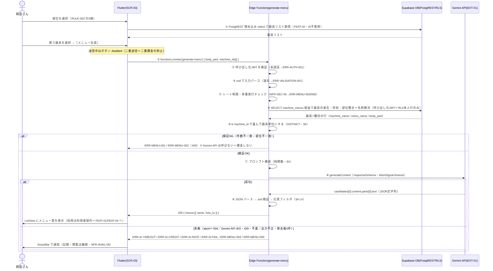

# FEAT-03 AIメニュー提案 詳細設計

> **目的**: FEAT-03 を実装が迷わない粒度（入出力・バリデーション・クエリ・エラー・画面挙動・実装単位）まで具体化し、TDDの着手点を固定する。
> **書き方**: 実データは書かない。上位の正本（API契約＝`../../30_データ・IF設計/02_API設計.md` ／ 物理DB＝`../01_DB物理設計.md` ／ シーケンス＝`../../40_機能設計/01_シーケンス設計.md`）と矛盾させず、参照はIDで行う。横断方針（エラー分類・トランザクション・冪等・リトライ）は `../07_実装共通設計パターン.md` を正本とし本書では再定義しない。

> ⚠️ **本書はたたき台（2026-08-02 生成）**。岡田さんのレビューで確定する。

> ⚠️ 要確認（人間判断）: **本機能の設計を確定させる前に、後継ADRを起票すること。** FEAT-03 は ADR-0001 が根拠ADRそのものだからである。
> - 本書は Flutter + Supabase 構成（Vercel 不使用）で記述している。
> - 一方 ADR-0001（Vercel AI Gateway 採用）・ADR-0002（Next.js + Mantine 採用）は Vercel 前提のまま。
> - `30_データ・IF設計/02_API設計.md`（`/api/*` の Route Handler 契約）も同じ。段3の改訂が要る。
> - ADR-0001 に依存していたのは、EXT-01 の実体・モデル選定・フォールバック方針・コスト按分タグ。
> - Gemini API 直接呼び出しへの切替は、ADR-0001 の前提を丸ごと置き換える。
> - 起票する後継ADRの内容は、Gemini API 直接呼び出し・モデル選定・フォールバック不在の受容。
> - 後継ADRが無い限り、本書 §3.2・§6・§10 #6 は根拠を持たない。

## 目次
1. [概要](#1-概要)
2. [処理フロー](#2-処理フロー)
3. [入出力仕様](#3-入出力仕様)
4. [業務ロジック](#4-業務ロジック)
5. [データアクセス](#5-データアクセス)
6. [エラー処理](#6-エラー処理)
7. [画面挙動・状態別表示](#7-画面挙動状態別表示)
8. [実装単位](#8-実装単位)
9. [テスト観点](#9-テスト観点)
10. [敵対的検証・要確認事項](#10-敵対的検証要確認事項)

## 1. 概要

| 項目 | 内容 |
|---|---|
| 対応要件 | FEAT-03（AIメニュー提案。選択部位＋利用可能な器具からトレーニングメニュー案を生成する） |
| 対応画面 | SCR-03 トレーニング |
| 対応API | Edge Function `generate-menu`（`supabase.functions.invoke('generate-menu')`）。本書の主対象 |
| 前段 | 器具一覧の取得は FEAT-02 の責務。Flutter から PostgREST を直接叩く（AI を通さない・RULE-004） |
| 関連ルール | RULE-003（部位タグ5種）／RULE-004（器具の絞り込みは部位タグ一致のみ・AI不使用）／RULE-006（メニュー提案は AI＝EXT-01 を使う） |
| 外部連携 | EXT-01（Google Gemini API を Edge Function から直接呼ぶ） |
| 性能目標 | NFR-PERF-03（AIメニュー提案 ≤15秒）。不達時は NFR-AVAIL-05 の縮退（記録・閲覧は継続） |
| 状態 | 状態を持たない（ST-01/ST-02 は FEAT-04 のトレーニング明細が持つ） |
| 優先度 | MUST |
| AI利用 | あり（生成のみ）。部位→器具の絞り込みは決定的処理で AI 不使用（RULE-004） |

利用者の操作は3ステップ。

| # | 操作 | 処理 |
|---|---|---|
| 1 | SCR-03 で部位を1つ選ぶ | FEAT-02 が部位タグ一致の器具リストを返す（PostgREST・AI不使用） |
| 2 | 使う器具を選ぶ | Flutter 内の選択状態のみ。通信しない |
| 3 | ［メニュー生成］を押す | Edge Function `generate-menu` を1回だけ呼ぶ |

Edge Function 側の要点。

| 項目 | 内容 |
|---|---|
| AI 呼び出し前に必ず DB 検証する | 器具の実在・所有・部位整合を確認する（§4・§5） |
| 器具↔種目は多対多 | 中間テーブル `machine_menus` で結ぶ。1台の器具が複数の種目・複数の部位に対応する |
| AI に渡すのは器具IDではない | DB で解決した器具名・対応種目名（器具ごとに複数）・部位を渡す（§3.2） |
| 生成結果は永続化しない | その場の提案。採用は利用者操作で FEAT-01／FEAT-04 に引き渡す `[仮]`（保存先未定義・§10 #1） |
| 非冪等・自動リトライなし | EXT-01 は従量課金。1リクエスト＝1課金 |
| 二重送信を抑止する | レート制限（NFR-SEC-05）と UI の disabled の二段で持つ |

## 2. 処理フロー

`../../40_機能設計/01_シーケンス設計.md §2` を正本とし、本節はそれを**バリデーション位置・クエリ発行点・タイムアウト境界**まで詳細化したもの。



| 設計判断 | 理由 |
|---|---|
| トランザクションを張らない | 書き込みが無い。EXT-01 呼び出しは DB 接続を保持したまま行わない |
| ⑥ を ⑧ より先に置く | 無効な入力で課金しないため。AI 呼び出しは検証を全通過後に1回だけ |
| ① を Edge Function に通さない | 器具の絞り込みは決定的処理（RULE-004）。AI も Function も要らない |

エラーの分岐条件と ERR 対応は §6 が詳細。

## 3. 入出力仕様

2層で定義する。

| 節 | 層 | 位置づけ |
|---|---|---|
| §3.1 | Flutter → Edge Function | Flutter から見える契約 |
| §3.2 | Edge Function → Gemini API | Edge Function 内部の実装仕様（EXT-01） |
| §3.3 | 両層に共通 | バリデーション規則 |

### 3.1 Flutter → Edge Function（呼び出し契約）

| 項目 | 内容 |
|---|---|
| 呼び出し | `supabase.functions.invoke('generate-menu')`（`body` は下記 Request body） |
| 実体 | `POST {SUPABASE_URL}/functions/v1/generate-menu` |
| 認証 | 必須。`supabase_flutter` が現行セッションの JWT を `Authorization: Bearer` で自動付与（ADR-0004） |
| Content-Type | `application/json`（リクエスト・レスポンスとも） |
| 冪等性 | 非冪等。自動リトライなし（従量課金） |
| タイムアウト | Edge Function 側 ≤15秒（NFR-PERF-03）。超過は 504 |
| ステータス | 200 / 400 / 401 / 402 / 409 / 429 / 500 / 504 |
| 失敗時の受け取り | `FunctionException`（`status` ＋ ボディの `error_code`）`[仮]`。Dart 側でモデルクラスに `fromJson` して分岐する |

```jsonc
// Request body（invoke の body）
{
  "body_part": "胸|背中|脚|肩|腕",   // 必須・enum（RULE-003）
  "machine_ids": [1, 2]              // 必須・整数配列・1件以上・重複なし
}

// Response 200
{
  "menus": [ { "name": "string", "how_to": "string" } ]
}

// Error（共通契約に準拠）
{ "error_code": "ERR-...", "message": "string", "retryable": true }
```

- Dart 側に zod は無い。`AiMenu` モデルクラス＋`fromJson` で検証する。
- 旧契約 `POST /api/menus/generate`（段3 `02_API設計.md §4.2`）は**廃止**。Edge Function `generate-menu` に置き換わる。
- 段3の契約表の改訂が要る（§10 #12）。

### 3.2 Edge Function → Gemini API（EXT-01・実装仕様）

Deno の `fetch` で直接呼ぶ。SDK は使わない。API 仕様の細部（パス・フィールド名）は `[仮]`。実装時に公式ドキュメントで確認する。

| 項目 | 値 | 根拠 |
|---|---|---|
| エンドポイント | `POST https://generativelanguage.googleapis.com/v1beta/models/{model}:generateContent` `[仮]` | EXT-01 |
| モデル | 環境変数 `GEMINI_MODEL`（既定 `gemini-3.5-flash`）。**ハードコードしない** | EXT-01 |
| 認証 | ヘッダ `x-goog-api-key: $GEMINI_API_KEY`。Edge Function の環境変数のみ。Flutter 側には置かない | NFR-SEC-02 |
| 構造化出力 | `generationConfig.responseMimeType: "application/json"` ＋ `generationConfig.responseSchema` `[仮]` | EXT-01 |
| 入力 | `contents[].parts[].text`（system 相当は `systemInstruction` `[仮]`）。画像入力は使わない（FEAT-08 のみ） | §4 L2 |
| 思考量 | `generationConfig.thinkingConfig` `[仮]`（フィールド名・指定値とも要確認） | §10 #13 |
| タイムアウト | `AbortSignal.timeout(AI_MENU_TIMEOUT_MS)`。既定 13000ms `[仮]`（15秒枠から DB 照会・整形の余白を差し引く） | NFR-PERF-03 |
| リトライ | 自動リトライなし。`fetch` は1回だけ発行する（二重課金防止） | §1 |
| 応答の取り出し | `candidates[0].content.parts[0].text` を `JSON.parse` `[仮]` | 実装方針 |
| 応答検証 | パース結果を zod（Deno/TS）で検証。失敗は ERR-MENU-004 | §3.3 |
| フォールバック | **無い**。モデル自動切替の手段が無いため単一プロバイダ依存になる（§10 #6） | §10 #6 |

#### 3.2.1 入力（プロンプトの素材）

プロンプトに含める要素。本文の実データは書かない。構造のみを示す。

| 区分 | 含めるもの | 由来 |
|---|---|---|
| system | 役割（トレーニング指導）。出力は日本語 | 実装方針 |
| system | **与えた器具リスト内の器具だけを使う**。リストに無い器具・自重種目を提案しない | 実装方針 |
| system | 件数上限 MENU_MAX。`how_to` は手順とセット・回数の目安を含む粒度 | 実装方針 |
| 入力: 部位 | `body_part`（RULE-003 の5値のうち1つ） | リクエスト |
| 入力: 器具 | `machine_ids` から DB で解決した `{ machine_id, machine_name, menu_names[] }` の配列 | `training_machines` / `machine_menus` / `training_menus` |
| 入力: 器具 | **IDだけを渡さず名称を併せて渡す**。IDはモデルにとって意味を持たないため | 同上 |
| 入力: 既存種目 | 本人・同一部位の `training_menus.name` 一覧（重複提案の抑止用）`[仮]` | `training_menus` |
| 含めないもの | 体重・氏名等の個人属性、`GEMINI_API_KEY`、他ユーザーのデータ | NFR-SEC-02 |

器具1台は複数の種目に対応する（`machine_menus`）。そのため種目名は**器具ごとの配列**になる。

```jsonc
// 入力: 器具（DBで解決したプロンプト素材。型のみ・実データは書かない）
[
  {
    "machine_id":   "bigint",
    "machine_name": "string",
    "menu_names":   ["string"]   // 指定 body_part の種目のみ。1件以上（0件の器具は §5 の検証で落ちる）
  }
]
```

| 観点 | 扱い |
|---|---|
| 配列の中身 | 要求 `body_part` に一致する種目名だけを入れる。他部位の種目名は渡さない |
| 順序 | `machine_id` 昇順・`menu_name` 昇順で固定する（プロンプトの再現性のため） |
| 重複 | 同一器具の同一種目名は1つに畳む（§5 の `DISTINCT`） |

> ⚠️ 要確認（人間判断）: **FEAT-03 に期待する価値を確定させたい（§10 #2）。**
> - 「器具名＋対応種目名」を渡す設計では、`machine_menus` から既に種目名が引ける。
> - そのため AI の付加価値が実質 `how_to` の文章生成と組合せ提案に限定される。
> - 確定させる論点は、新種目の発見か／やり方の説明か。

#### 3.2.2 出力（`responseSchema`）

構造化出力で受ける。**形の正本はこのコードブロック**とし、散文では繰り返さない。

```jsonc
// generationConfig.responseSchema（形のみ。実データは書かない）[仮]
{
  "type": "object",
  "properties": {
    "menus": {                        // array: 1件以上・上限は MENU_MAX（既定5 [仮]）
      "type": "array",
      "items": {
        "type": "object",
        "properties": {
          "name":       { "type": "string" },   // 種目名・1〜60文字 [仮]
          "how_to":     { "type": "string" },   // やり方・1〜400文字 [仮]
          "machine_id": { "type": "integer" }   // 使用器具。幻覚検出のためAIに返させる検証用 [仮]
        },                                      //   → 除去処理後、Flutter への応答からは落とす
        "required": ["name", "how_to", "machine_id"]
      }
    }
  },
  "required": ["menus"]
}
```

- `machine_id` は検証専用。§3.1 の Response 200 には含めない。
- 件数上限 MENU_MAX の決め方は §4 L3 が正本。

### 3.3 バリデーション規則
| 項目 | 規則 | 違反時 |
|---|---|---|
| 認証 | 呼び出し元 JWT が有効な Supabase セッションであること | ERR-AUTH-001 (401) |
| `body_part` | 必須・文字列・RULE-003 の5値（`胸`/`背中`/`脚`/`肩`/`腕`）のいずれか | ERR-VALIDATION-001 (400) |
| `machine_ids` | 必須・整数配列・1件以上・上限 MACHINE_MAX（既定10 `[仮]`）・重複なし | ERR-VALIDATION-001 (400) |
| `machine_ids` の実在・所有 | 全IDが本人参照可能な `training_machines` に存在（RLS 経由で件数一致） | ERR-MENU-001 (400) |
| `machine_ids` と `body_part` の整合 | 全器具が `machine_menus` 経由で**指定部位の種目を1つ以上持つ**（RULE-004）。全種目が指定部位である必要はない | ERR-MENU-002 (400) |
| 生成回数 | 単位時間あたりの生成回数が上限以内（NFR-SEC-05・閾値未確定） | ERR-MENU-003 (429) |
| 多重実行 | 同一ユーザーの生成が同時に走っていない `[仮]` | ERR-MENU-006 (409) |
| AI出力 | `JSON.parse` に成功し、zod スキーマを満たす | ERR-MENU-004 (500) |
| AI出力の器具整合 | `machine_id` が要求した `machine_ids` に含まれる（幻覚フィルタ後に1件以上残る） | ERR-MENU-005 (500) |

## 4. 業務ロジック

| # | ロジック | 内容 | 対応 |
|---|---|---|---|
| L1 | 部位・器具の整合判定 | 選択器具が `machine_menus` 経由で要求部位の種目を**1つ以上持つ**ことを DB 照会結果で判定。AI は使わない。判定は器具単位に畳んでから行う（§5） | RULE-004 |
| L2 | プロンプト構成 | 部位・器具名・対応種目名（器具ごとの配列）・既存種目名を素材に system/prompt を組む。件数上限と「与えた器具のみ使用」制約を明示 | RULE-006 |
| L3 | 生成件数の決定 | `提案件数上限 = min(選択器具数, MENU_MAX)`（MENU_MAX 既定5 `[仮]`）。器具数を超える提案は求めない | NFR-PERF-03（トークン量抑制） |
| L4 | 幻覚フィルタ | AI 出力の各行の `machine_id` が要求 `machine_ids` に含まれない行を除去。除去件数はログに残す | §10 #3 |
| L5 | 再生成抑止キー | `user_id` ＋ `body_part` ＋ ソート済 `machine_ids` からキャッシュキーを作り、短時間の同一入力再生成を抑止する `[仮]` | §10 #4 |

境界値:

| 対象 | 値 | 期待 |
|---|---|---|
| `machine_ids` 件数 | 0 / 1 / MACHINE_MAX / MACHINE_MAX+1 | 400 / OK / OK / 400 |
| AI 出力 `menus` 件数 | 0 / 1 / MENU_MAX / MENU_MAX+1 | ERR-MENU-004 / OK / OK / ERR-MENU-004 |
| 幻覚フィルタ後の残件数 | 0 / 1件以上 | ERR-MENU-005 / 200 |
| AI 応答時間 | timeout 未満 / 超過 | 200 / ERR-AI-TIMEOUT |

純関数として切り出す（Deno 側・単体テスト対象・NFR-QUAL-01）:
- `groupMachineMenus(rows: MachineMenuRow[]): MachinePromptItem[]`（器具×種目の行を `machine_id` で畳み `menu_names[]` にする・L1/L2 の前段）
- `buildMenuPrompt(input: MenuPromptInput): { system: string; prompt: string }`（L2）
- `resolveSuggestionCount(machineCount: number): number`（L3）
- `filterHallucinatedMenus(menus: AiMenu[], allowedMachineIds: number[]): { kept: AiMenu[]; dropped: AiMenu[] }`（L4）
- `buildGenerateCacheKey(userId: string, bodyPart: BodyPart, machineIds: number[]): string`（L5）

## 5. データアクセス

```sql
-- (1) machine_ids の実在・所有・部位整合をまとめて検証し、プロンプト素材（名称）を解決する
--     器具↔種目は多対多（machine_menus）。1台が同一部位の種目を複数持つと行が複数返る
--     DISTINCT machine_id の件数が $1 の要素数と一致しなければ ERR-MENU-001 / ERR-MENU-002
SELECT DISTINCT
       tm.id   AS machine_id,
       tm.name AS machine_name,
       m.id    AS menu_id,
       m.name  AS menu_name,
       m.body_part
FROM   training_machines tm
JOIN   machine_menus     mm ON mm.machine_id = tm.id
JOIN   training_menus    m  ON m.id = mm.menu_id
WHERE  tm.id       = ANY($1::bigint[])
  AND  m.user_id   = $2
  AND  m.body_part = $3
ORDER BY tm.id, m.name;

-- (2) 重複提案の抑止用に、本人・同一部位の既存種目名を取得する [仮]
SELECT name
FROM   training_menus
WHERE  user_id   = $1
  AND  body_part = $2;
```

Edge Function 内では上記2本を PostgREST 経由の埋め込み select として発行する `[仮]`（SQL は意図の記述であり、生SQLを発行するという意味ではない）。

(1) は**器具×種目の行**を返す。器具単位の判定は畳んでから行う。

| 判定 | 条件 | 違反時 |
|---|---|---|
| 実在・所有 | `machine_ids` の全IDが本人参照可能な `training_machines` に存在する | ERR-MENU-001 |
| 部位整合 | 各器具が指定部位の種目を**1つ以上**持つ（RULE-004） | ERR-MENU-002 |

- 判定式は `DISTINCT machine_id の件数 = machine_ids の要素数`。行数そのものと比較しない。
- **従来の「器具の種目の部位＝指定部位」という1対1の判定は成立しない。** 器具は複数部位に対応するため。
- 指定部位の種目を1つ以上持てば整合とみなす。他部位の種目を併せ持つことは違反ではない。
- 種目を1件も持たない器具（`machine_menus` に行が無い）は、どの部位でも0行になる。
- そのため ERR-MENU-001 相当の扱いになる（§10 #14）。
- 上の2判定はこのクエリ単独では切り分けられない。どちらも「畳んだ件数が足りない」として現れる。
- 切り分けが要るなら (1) を実在確認と部位確認の2本に分ける（§10 #15）。

`ORDER BY` は §3.2 のプロンプト素材の順序を固定するために置く。

| 観点 | 内容 |
|---|---|
| 認証コンテキスト | Edge Function は **service role key を使わない** |
| 渡すもの | 呼び出し元の `Authorization` ヘッダ（利用者JWT）をそのまま Supabase クライアントに渡す（ADR-0004） |
| 狙い | RLS を効かせるため |
| service role を避ける理由 | service role は RLS を素通りする |
| 重なるとどうなるか | §10 #8 の「JOIN 条件だけが本人性の担保」と重なると、他人のジムの器具が読める |
| 対象テーブル | `training_machines`／`machine_menus`／`training_menus`（いずれも SELECT のみ） |
| 書き込み | **INSERT/UPDATE/DELETE は行わない** |
| 使用INDEX | `training_menus` は PK と `user_id`・`body_part` の絞り込み |
| 使用INDEX | `machine_menus` は `uq_mm_machine_menu`（`machine_id, menu_id`）と `ix_mm_menu`（`menu_id`） |
| INDEX の正本 | `../01_DB物理設計.md §3` |
| RLS | `user_id = auth.uid()` 相当で本人行のみ |
| RLS の弱点 | `training_machines` も `machine_menus` も `user_id` 列を持たない |
| 本人性の担保 | `machine_menus` を挟んだ `training_menus` への JOIN 条件のみ（§10 #8・#16） |
| 多対多化の影響 | 経路が1段深くなった |
| トランザクション境界 | なし（参照のみ）。EXT-01 呼び出しは DB 接続を保持したまま行わない |
| 永続化 | 提案結果は保存しない `[仮]`（§10 #1） |
| 採用時の委譲先 | FEAT-01（`training_menus` への PostgREST insert）／FEAT-04（RPC `create_training_session`） |

## 6. エラー処理
| ERR-ID | HTTP | 発生条件 | 利用者向けメッセージ（意図） | retryable | ログ |
|---|---|---|---|---|---|
| ERR-AUTH-001 | 401 | 未認証・セッション切れ（JWT 不正・失効） | 再ログインを促す | false | 認証失敗（NFR-SEC-AUDIT-02） |
| ERR-VALIDATION-001 | 400 | `body_part` が enum 外／`machine_ids` が空・上限超・重複 | 入力の選び直しを促す | false | warn（入力要約のみ） |
| ERR-MENU-001 | 400 | 指定器具が存在しない、本人が参照できない、または対応種目が1件も無い | 器具の選び直しを促す | false | warn（要求件数と畳んだ後の件数） |
| ERR-MENU-002 | 400 | 器具が選択部位の種目を1つも持たない（RULE-004違反） | 部位と器具の組合せを直す旨 | false | warn |
| ERR-MENU-003 | 429 | アプリ側レート制限に到達（NFR-SEC-05・閾値未確定） | 時間をおいて再試行する旨 | true | warn（user・期間内回数） |
| ERR-MENU-004 | 500 | AI 出力が `JSON.parse` 不能、または zod スキーマ不適合（件数0・型不一致等） | 生成に失敗した旨 | false | error（`finishReason`・`promptFeedback`。本文は残さない） |
| ERR-MENU-005 | 500 | 幻覚フィルタ（L4）で全件除去され残0件 | 生成に失敗した旨 | false | error（除去件数） |
| ERR-MENU-006 | 409 | 同一ユーザーの生成が実行中に再送信された `[仮]` | 処理中である旨 | false | info |
| ERR-AI-CREDIT | 402 | Gemini API がクォータ・課金起因で拒否（HTTP 403 `PERMISSION_DENIED`／日次上限の 429）`[仮]` | 一時的に利用できない旨 | false | error（要運用通知） |
| ERR-AI-RATE | 429 | Gemini API のレート制限（HTTP 429 `RESOURCE_EXHAUSTED`）`[仮]` | 時間をおいて再試行する旨 | true（指数バックオフ） | warn |
| ERR-AI-TIMEOUT | 504 | `AbortSignal.timeout` 到達（NFR-PERF-03 超過） | 時間内に生成できなかった旨 | false（自動リトライしない） | error（経過ms） |
| ERR-AI-FAIL | 500 | Gemini API へ不達、または 5xx。**フォールバック先は無い**（§10 #6） | AI機能のみ一時停止・記録と閲覧は継続（NFR-AVAIL-05） | false | error（HTTPステータス） |

| 方針 | 内容 |
|---|---|
| 監査ログ | EXT-01 への送信は「いつ・どのモデルへ・何トークン」を残す（NFR-SEC-AUDIT-01）。プロンプト本文・出力本文は残さない |
| 出力先 | Supabase Edge Function ログ（`console.log` の1行1JSON）。`service` は `okada-fit-fn` |
| 縮退 | 402/429/500/504 のいずれでも、SCR-03 の記録・閲覧機能は動作を継続する（NFR-AVAIL-05） |

> ERRの完全列挙の正本は `../../60_テスト設計/02_RED母集合_受入基準・状態・エラー.md`（段6で集約）。本表はその入力とする。

> ⚠️ 要確認（人間判断）: **ERR-AI-CREDIT と ERR-AI-RATE の切り分け条件。**
> - Gemini API はクォータ超過も一時的レート超過も 429 `RESOURCE_EXHAUSTED` を返し得る。
> - そのため HTTP ステータスだけでは分離できない `[仮]`。
> - エラーボディの `status`／`reason` で判定するか、両者を1つに統合するかを決める。

## 7. 画面挙動・状態別表示

Flutter ウィジェットで記述する。

| 状態 | 表示 | 操作可否 |
|---|---|---|
| 初期/空（部位未選択） | `SegmentedButton`（Material 3）で部位5種のみ表示。提案領域は非表示 | ［メニュー生成］は `onPressed: null` |
| 器具0件（部位選択済・該当器具なし） | `MaterialBanner`（黄系）で器具未登録を案内し、SCR-02 器具登録への導線を出す `[仮]` | ［メニュー生成］は `onPressed: null`（無駄な課金を防ぐ） |
| 器具選択済 | `Wrap` に `FilterChip` を並べ複数選択。選択数を表示 | ［メニュー生成］有効 |
| 読込中 | ボタン内を `CircularProgressIndicator`（サイズ固定）に差し替え、提案領域中央にも `CircularProgressIndicator`。最長15秒（NFR-PERF-03） | ボタンは `onPressed: null`（二重送信＝二重課金の抑止） |
| 成功 | `ListView.builder` ＋ `ExpansionTile`（`name` をタイトル、`how_to` を展開内容）。件数が MENU_MAX 未満でもそのまま表示 | 各行に［種目マスタに追加］（FEAT-01）／［今日の記録に追加］（FEAT-04）`[仮]`。［再生成］は課金する旨を添える |
| エラー | `ScaffoldMessenger.showSnackBar`（赤系・`message` は §6 の利用者向けメッセージ）。提案領域は直前の状態を保持 | 再試行可否は `retryable` に従う。器具選択・記録操作は継続可（NFR-AVAIL-05） |
| レート上限 | `ScaffoldMessenger.showSnackBar`（橙系）で時間をおく旨 | ［メニュー生成］を一定時間 `onPressed: null` |

- 進捗率は出せない（Edge Function がストリームを返さないため）。`CircularProgressIndicator` は不定形（`value: null`）で使う。
- 画面遷移は起こさない。SCR-03 内で完結する。

## 8. 実装単位
| # | ファイル | 役割 | 主なシグネチャ |
|---|---|---|---|
| 1 | `supabase/functions/generate-menu/index.ts` | Edge Function 本体。JWT検証→入力検証→レート制限→DB検証→Gemini→フィルタ→整形 | `Deno.serve(async (req: Request): Promise<Response> => { ... })` |
| 2 | `supabase/functions/generate-menu/schema.ts` | 入力 zod スキーマ・AI出力 zod スキーマ・`responseSchema` 定義 | `export const GenerateMenuRequestSchema` / `export const AiMenuOutputSchema` / `export const AI_MENU_RESPONSE_SCHEMA` |
| 3 | `supabase/functions/generate-menu/prompt.ts` | プロンプト構成（純関数・§4 L2） | `export function buildMenuPrompt(input: MenuPromptInput): { system: string; prompt: string }` |
| 4 | `supabase/functions/generate-menu/validate.ts` | 器具×種目行の畳み込み・件数決定・幻覚フィルタ（純関数・§4 L1/L3/L4） | `export function groupMachineMenus(rows: MachineMenuRow[]): MachinePromptItem[]` / `export function filterHallucinatedMenus(menus: AiMenu[], allowedMachineIds: number[]): FilterResult` |
| 5 | `supabase/functions/_shared/gemini.ts` | Gemini API 呼び出しの共通ラッパ（モデル設定値・`AbortSignal.timeout`・エラー写像）。**FEAT-08 と共有し重複実装しない** | `export async function generateStructured<T>(args: GenerateStructuredArgs<T>): Promise<T>` |
| 6 | `supabase/functions/_shared/rate-limit.ts` | AI呼び出しの回数制限・多重実行抑止（NFR-SEC-05・§10 #4） | `export async function consumeAiQuota(userId: string, feature: string): Promise<QuotaResult>` |
| 7 | `supabase/functions/_shared/supabase-client.ts` | 呼び出し元 JWT を引き継いだクライアント生成（§5） | `export function createUserClient(req: Request): SupabaseClient` |
| 8 | `app/lib/features/training/menu_generate_panel.dart` | SCR-03 の生成パネル（§7 の状態遷移） | `class MenuGeneratePanel extends StatefulWidget` |
| 9 | `app/lib/features/training/ai_menu.dart` | 応答のモデルクラス（Dart 側の検証） | `class AiMenu { factory AiMenu.fromJson(Map<String, dynamic> json); }` |
| 10 | `app/lib/data/menu_repository.dart` | `functions.invoke('generate-menu')` の呼び出しと `FunctionException` の写像 | `Future<List<AiMenu>> generateMenu({required BodyPart bodyPart, required List<int> machineIds})` |

## 9. テスト観点
| TC-ID | 観点 | 期待 |
|---|---|---|
| TC-FEAT03-01 | 正常系（部位＋器具1件以上、AIが有効な出力を返す） | 200・`menus` が1件以上・各要素に `name` と `how_to` |
| TC-FEAT03-02 | 未認証（JWT 無し・失効） | 401・ERR-AUTH-001・**EXT-01 を呼ばない** |
| TC-FEAT03-03 | 入力不正（`body_part` enum 外／`machine_ids` が空・重複・上限超） | 400・ERR-VALIDATION-001・EXT-01 を呼ばない |
| TC-FEAT03-04 | 他人所有の器具ID／存在しないID | 400・ERR-MENU-001・EXT-01 を呼ばない |
| TC-FEAT03-05 | 選択部位の種目を1つも持たない器具を指定（RULE-004） | 400・ERR-MENU-002・EXT-01 を呼ばない |
| TC-FEAT03-06 | AI 出力が要求外の `machine_id` を含む（幻覚） | 該当行が除去される。残1件以上なら 200、全滅なら ERR-MENU-005 |
| TC-FEAT03-07 | AI 出力が JSON として不正／スキーマ不一致 | 500・ERR-MENU-004・自動リトライしない |
| TC-FEAT03-08 | AI 応答がタイムアウト閾値を超える | 504・ERR-AI-TIMEOUT・`fetch` は1回のみ |
| TC-FEAT03-09 | Gemini API が 429／403 を返す | ERR-AI-RATE（retryable=true）／ERR-AI-CREDIT（false） |
| TC-FEAT03-10 | Gemini API へ不達（DNS・接続失敗・5xx） | 500・ERR-AI-FAIL。同一セッションで記録・閲覧は 200（NFR-AVAIL-05） |
| TC-FEAT03-11 | レート制限到達 | 429・ERR-MENU-003・EXT-01 を呼ばない |
| TC-FEAT03-12 | 応答時間・副作用 | 正常系 ≤15秒（NFR-PERF-03）。成功/失敗いずれでも `training_menus` の行数が増えない |
| TC-FEAT03-13 | 純関数 `buildMenuPrompt` | 器具名・種目名・部位・件数上限が構成物に含まれ、個人属性が含まれない |
| TC-FEAT03-14 | service role の不使用 | Edge Function が他人の `machine_ids` を渡されたとき ERR-MENU-001 になる（RLS が効いている） |
| TC-FEAT03-15 | 複数部位に対応する器具（指定部位の種目と他部位の種目を併せ持つ） | 200。プロンプト素材の `menu_names` は**指定部位の種目のみ**を含む |
| TC-FEAT03-16 | 1台が同一部位の種目を複数持つ | 器具は重複せず1件として扱われる（`DISTINCT machine_id` で畳む・§5） |
| TC-FEAT03-17 | 対応種目が0件の器具を指定 | 400・ERR-MENU-001・EXT-01 を呼ばない |

受入基準（G/W/T）の候補:
- [AC] Given 部位「胸」に対応する器具が登録済み When 器具を選んで［メニュー生成］を押す Then 15秒以内にメニュー案が1件以上表示される
- [AC] Given 選択部位に対応する器具が0件 When SCR-03 を表示する Then ［メニュー生成］は押せず、器具登録（SCR-02）への導線が表示される
- [AC] Given 選択した器具が要求部位の種目を1つも持たない When 生成を要求する Then ERR-MENU-002 が返り AI は呼び出されない
- [AC] Given 1台で複数部位に対応する器具を選んでいる When 部位「胸」で生成を要求する Then 胸の種目だけを素材にメニュー案が生成される
- [AC] Given Gemini API が不達 When 生成を要求する Then エラーが通知されるが、トレーニング記録と閲覧は継続して行える
- [AC] Given メニュー案が表示された When 何も採用操作をしない Then 種目マスタには何も追加されない

> 受入基準・ST・ERR の**正本は段6**（`../../60_テスト設計/02_RED母集合_受入基準・状態・エラー.md`・本PR対象外）。本節はその母集合への入力。

## 10. 敵対的検証・要確認事項
| # | 論点 | 内容 | 重大度 |
|---|---|---|---|
| 1 | 提案メニューの保存先が未定義 | §4.2（`02_API設計.md`）に保存先の定義が無い。種目マスタ `training_menus` にそのまま INSERT すると同名重複・マスタ汚染・FEAT-02/FEAT-05 へ波及する。保存せず採用は利用者操作`[仮]` | 🔴 高 |
| 2 | AI に渡す情報の粒度 | `machine_menus` から種目名を逆引きできるため、「部位＋器具名＋既存種目名」を渡すと既知種目の再掲になりやすい。多対多化で1器具あたりの種目名が増え傾向は強まる。渡す粒度で出力の性格が変わるが FEAT-03 の狙いが未定義 | 🟡 中 |
| 3 | 幻覚の残存 | zod と `responseSchema` は型・件数しか保証せず、存在しない器具のメニューを防げない。事後フィルタ（§4 L4）は`[仮]`。`how_to` 本文中の別器具言及は検出できず目視評価が要る | 🔴 高 |
| 4 | 生成のたびに課金される／カウンタの置き場所が無い | 同一入力でも毎回課金。抑止策は §4 L5 のキャッシュと回数上限だが、**旧構成の Vercel Firewall は使えず** KV/Redis も無い。カウンタ用テーブル `ai_usage_counters` `[仮]` が要る | 🔴 高 |
| 5 | タイムアウトと Edge Function 実行時間上限の関係 | NFR-PERF-03 の15秒は UX 目標で、**Edge Function 自体の実行時間上限**は別に存在し未確認`[仮]`。15秒未満なら設計が成立せず確定前に実測が要る。中断してもトークンは消費済みのことがある | 🔴 高 |
| 6 | 単一プロバイダ依存・フォールバック手段が無い | 直接呼び出しで**モデル自動切替が無くなり**、旧構成のフォールバックは失われた。自前の切替は二重課金・レイテンシ倍増の risk があり採らない。障害＝FEAT-03 全停止のため SCR-03 に手動記録の経路を残す | 🔴 高 |
| 7 | 構造化出力の失敗が共通エラー契約に無い | `responseSchema` 不適合・JSON 破損に対応する ERR も HTTP も共通契約に無い。再試行しても同じ結果になりやすく既存4種と性質が違う。本書は `ERR-MENU-004` を`[仮]`採用したが追加が要る | 🟡 中 |
| 8 | `training_machines` に `user_id` が無い | `gym_id` 所有で RLS を直接適用できず、本人性は §5 の JOIN 条件だけが担保する。JOIN を落とすと他人のジムの器具が読める。**service role key で即座に露出する**ため呼び出し元JWTを使う | 🔴 高 |
| 9 | ~~`training_machines.menu_id` の INDEX 未定義~~（解決） | ~~`menu_id` の INDEX が未定義~~。多対多化で `menu_id` は廃止され `machine_menus` の INDEX 2本に置き換わった（§5）。両方向とも効き、件数規模の論点は FEAT-02 と共通 | 🟢 低 |
| 10 | 横断方針の正本が未記入 | `../07_実装共通設計パターン.md` はテンプレートのままでエラー分類・リトライ・多重制御の値が空。加えて同書は旧構成前提のまま。本書は暫定的に「非冪等・自動リトライなし・429のみバックオフ」を拠り所にしている | 🟡 中 |
| 11 | 認証IDと `users.id` の紐付け | RLS の `user_id = auth.uid()` を成立させる `users.id`(bigint) と `auth.uid()`(uuid) の紐付けが未確定（正本は `../06_DB設計規約.md`）。本書は方式を決めない | 🟡 中 |
| 12 | 上位文書が旧構成のまま | ADR-0001・ADR-0002・段3の API 契約が旧構成前提。**FEAT-03 は ADR-0001 が根拠ADRそのもの**で、後継ADRが無い状態では §3.2・§6・#6 が根拠を持たない。後継ADRの起票が本機能の確定条件 | 🔴 高 |
| 13 | Gemini API 仕様の未確認箇所 | `responseSchema` の対応範囲（`enum`・`minItems` 等）、`systemInstruction` のフィールド名、`thinkingConfig` の指定が未確認で全て`[仮]`。差分は §3.2 に反映する | 🟡 中 |
| 14 | 部位整合の判定条件が変わった | 多対多化で RULE-004 の判定が「**指定部位の種目を1つ以上持つ**」に変わり（§5）、他部位の併せ持ちは違反でない。原文は1対1とも読め追認が要る。対応種目0件の器具の登録可否も未定（許すと ERR-MENU-001） | 🟡 中 |
| 15 | 絞り込みの `DISTINCT` と件数照合 | 同一部位の種目を複数持つ器具は複数行出るため、照合は行数でなく `DISTINCT machine_id` 件数で行う。落とすと L3 の器具数も過大になる。ERR-MENU-001 と ERR-MENU-002 の切り分けには2本要る | 🟡 中 |
| 16 | `machine_menus` に `user_id` が無い | 中間テーブルも `user_id` を持たず、本人性は `training_menus` への JOIN 条件だけが担保する | 🟡 中 |
| 〃 | 〃 | #8 の弱点が1段深くなった。JOIN を1つ落とすと他人の器具が混ざる。RLS ポリシーは未定 | 〃 |

> ⚠️ 要確認（人間判断）: #1 AI提案メニューの保存先と保存タイミング（保存しない／採用時のみ `training_menus` へ／別テーブルを設ける）。別テーブル案は新規テーブル追加になるため本書では採らない。
> ⚠️ 要確認（人間判断）: #2 AI に渡す入力の粒度と、FEAT-03 が提供する価値の定義（新種目の発見か、既知種目の `how_to` 生成か）。
> ⚠️ 要確認（人間判断）: #4 レート制限（NFR-SEC-05）の閾値・集計単位（時間/日）、カウンタ用テーブルの採否とスキーマ、および同一入力キャッシュの採否と TTL。
> ⚠️ 要確認（人間判断）: #5 Supabase Edge Function の実行時間上限（実値）と、`AI_MENU_TIMEOUT_MS` の確定値（本書は 13000ms `[仮]`）。上限が15秒未満なら NFR-PERF-03 の再定義が要る。
> ⚠️ 要確認（人間判断）: #6 フォールバック不在を受容するか、Edge Function 内に自前のモデル切替を実装するか。
> - 受容する場合は NFR-AVAIL-05 の縮退範囲に「FEAT-03 全停止」を明記する。
> ⚠️ 要確認（人間判断）: #7 構造化出力の失敗（スキーマ不適合・JSON破損）に割り当てる ERR-ID と HTTP ステータスの共通契約への追加。FEAT-08 も同じ分岐を持つため、機能別ではなく共通側で決めるべき。
> ⚠️ 要確認（人間判断）: #8 `training_machines` の本人性担保方式（JOIN 条件のみで足りるか、RLS ポリシーをどう書くか）。
> ⚠️ 要確認（人間判断）: #12 後継ADRの起票（Gemini API 直接呼び出し・モデル選定・フォールバック不在の受容）。本機能の設計確定より前に必要。
> ⚠️ 要確認（人間判断）: #14 RULE-004 の判定条件を「器具が指定部位の種目を1つ以上持つ」に確定してよいか。あわせて対応種目0件の器具を登録できるかを FEAT-01 と揃えて決める必要がある。
> ⚠️ 要確認（人間判断）: #15 ERR-MENU-001 と ERR-MENU-002 を切り分けるためにクエリを2本に分けるか、1本のまま両者を統合した1つのエラーにするか。

> 関連: API契約＝`../../30_データ・IF設計/02_API設計.md` / 物理DB＝`../01_DB物理設計.md` / 横断方針＝`../07_実装共通設計パターン.md` / シーケンス＝`../../40_機能設計/01_シーケンス設計.md`。
