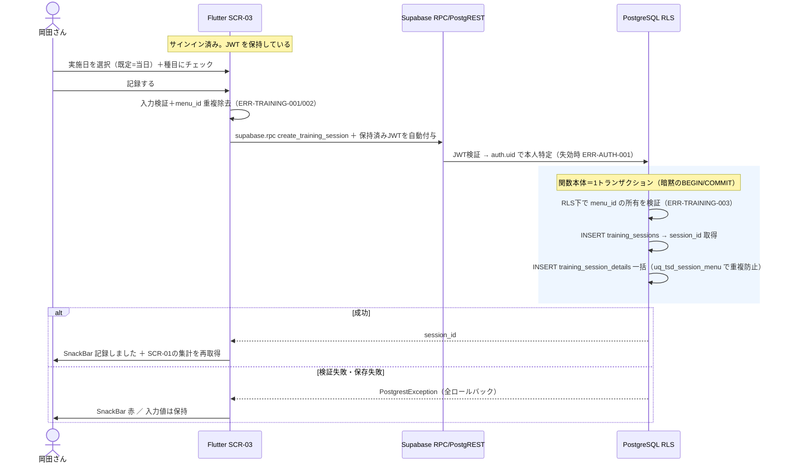
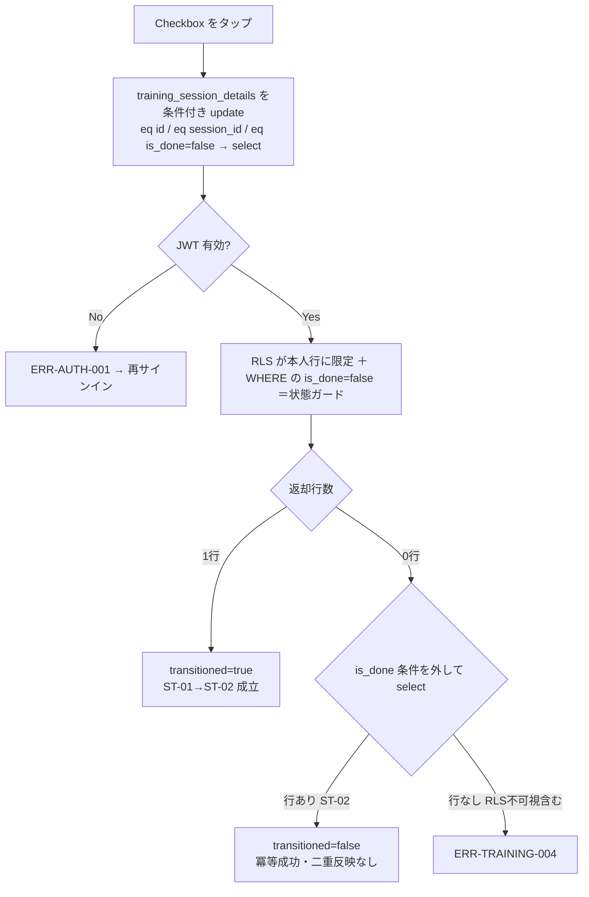

# FEAT-04 トレーニング記録 詳細設計

> **目的**: FEAT-04 を実装が迷わない粒度（入出力・バリデーション・クエリ・エラー・画面挙動・実装単位）まで具体化し、TDDの着手点を固定する。
> **書き方**: 実データは書かない。上位の正本（API契約＝`../../30_データ・IF設計/02_API設計.md` ／ 物理DB＝`../01_DB物理設計.md` ／ シーケンス＝`../../40_機能設計/01_シーケンス設計.md`）と矛盾させず、参照はIDで行う。横断方針（エラー分類・トランザクション・冪等・リトライ）は `../07_実装共通設計パターン.md` を正本とし本書では再定義しない。

> ⚠️ **本書はたたき台（2026-08-02 生成）**。岡田さんのレビューで確定する。

## 目次
1. [概要](#1-概要)
2. [処理フロー](#2-処理フロー)
3. [入出力仕様](#3-入出力仕様)
4. [業務ロジック](#4-業務ロジック)
5. [データアクセス](#5-データアクセス)
6. [エラー処理](#6-エラー処理)
7. [画面挙動・状態別表示](#7-画面挙動状態別表示)
8. [実装単位](#8-実装単位)
9. [テスト観点](#9-テスト観点)
10. [敵対的検証・要確認事項](#10-敵対的検証要確認事項)

## 1. 概要

| 項目 | 内容 |
|---|---|
| 対応要件 | FEAT-04 トレーニング記録（実施日＋明細＝種目×実行済／入館記録） |
| 対応画面 | SCR-03 トレーニング |
| 対応API | RPC `create_training_session`（T01）／`training_session_details` の PostgREST update（T02）／`gym_visits` の PostgREST insert（入館） |
| 関連ルール | RULE-003（部位タグ5種・種目マスタ側の制約）。算出ルールは持たない |
| 外部連携 | なし（AI不使用の決定的処理） |
| 性能目標 | NFR-PERF-02（決定的処理 ≤1秒）。画面表示は NFR-PERF-01（≤2秒） |
| 状態 | ST-01 `not_done` ／ ST-02 `done`（遷移 T01・T02。正本＝`../../30_データ・IF設計/03_ドメインイベント.md`） |

本機能は、ある日に実施したトレーニングを2階層で記録する。

| 階層 | テーブル | 意味 |
|---|---|---|
| セッション | `training_sessions` | 実施日 |
| 明細 | `training_session_details` | 種目×実行済（`is_done`） |

`is_done` は本PJで**唯一の永続状態**（ST-01/ST-02）。FEAT-05 ダッシュボードのヒートマップ（実施有無）と種目名ツールチップの集計元になる。

入館記録（`gym_visits`）は同じ SCR-03 から行う。ただし `training_sessions` とは独立に扱う。

| 観点 | 扱い |
|---|---|
| FK | 相互参照なし |
| トランザクション | 別（片方の失敗が他方を巻き戻さない） |
| 状態 | 持たない一過性イベント（`../../30_データ・IF設計/03_ドメインイベント.md §2`） |

`../../40_機能設計/01_シーケンス設計.md` に FEAT-04 のシーケンスは無い。本書 §2 が処理フローの一次記述となる（同ファイルへの追記は別PRで行う）。

## 2. 処理フロー

### 2.1 認証の位置づけ（記録のたびに認証はしない）

**「記録の前に認証が入る」のは毎回のログインではない。保持済み JWT による本人特定と RLS の適用である。**

| タイミング | 起きること | 利用者の操作 |
|---|---|---|
| 初回サインイン（1回だけ） | Supabase Auth が JWT を発行。`supabase_flutter` が端末に保持する | 要（ID/パスワード入力） |
| 記録・トグル・入館のたび | 保持済み JWT が呼び出しに自動で付く | **不要** |
| サーバ側（Postgres） | JWT から `auth.uid()` を得て本人を特定する | — |
| サーバ側（RLS） | ポリシーが本人行だけに絞る。他人の行は読めず書けない | — |
| JWT の期限切れ | `supabase_flutter` が自動更新する。更新も失敗したときだけ ERR-AUTH-001 | 再サインイン |

- 以降の図中の「認証」は、**JWT を新規取得する処理ではない**。保持済み JWT の検証を指す。
- 本人チェックの実体は RLS。アプリ側で `user_id` を組み立てて送ることはしない（§3）。

### 2.2 セッション＋明細の登録（T01）

トランザクション境界は「`training_sessions` INSERT → `training_session_details` 一括 INSERT」の1単位。

PostgREST は複数リクエストをまたぐトランザクションを張れない。そのため **Postgres 関数（RPC）1回の呼び出しに閉じる**（設計判断は §5.1）。



### 2.3 実行済のトグル（T02・ST-01→ST-02）



### 2.4 入館記録

状態を持たない一過性イベントのため分岐は無い。直線フローで扱う。

| 順 | 処理 |
|---|---|
| 1 | `showModalBottomSheet` でジム・日付・時刻を選ぶ |
| 2 | Flutter 側で日付・時刻を検証（ERR-TRAINING-008） |
| 3 | `supabase.from('gym_visits').insert(...)`（JWT 自動付与） |
| 4 | RLS が本人行として受理。`gym_id` の実在は FK 違反で弾く（ERR-TRAINING-007） |
| 5 | 成功 `SnackBar` |

§2.2 とは**別トランザクション**。入館記録の失敗はトレーニング記録を巻き戻さない。

## 3. 入出力仕様

引数名・列名は snake_case（DB列名と一致・`../06_DB設計規約.md §5`）。

呼び出しは3種類。いずれも `supabase_flutter` が保持済み JWT を自動付与する（§2.1）。`user_id` は**引数で渡さない**。サーバ側が JWT から解決する。

| 遷移 | 操作 | 方式 | 名前 |
|---|---|---|---|
| T01 | セッション＋明細の登録 | RPC | `create_training_session` |
| T02 | 実行済トグル | PostgREST update | `training_session_details` |
| — | 入館記録 | PostgREST insert | `gym_visits` |

### 3.1 RPC `create_training_session`（T01）

| 項目 | 内容 |
|---|---|
| 認証 | 保持済み JWT。無効かつ更新失敗のみ ERR-AUTH-001 |
| 引数 | `p_performed_date` date ／ `p_menu_ids` bigint[] ／ `p_is_done` boolean[] |
| 戻り | `session_id`（bigint） |
| 冪等性 | **非冪等**（同一 `performed_date` の再送の扱いは §10-2 の未決事項） |
| 失敗 | `PostgrestException`。全ロールバック（§6） |

```dart
// app/lib/data/training_repository.dart
final sessionId = await supabase.rpc(
  'create_training_session',
  params: {
    'p_performed_date': performedDate, // ISO 8601 date 文字列・未来日不可
    'p_menu_ids': menuIds,             // bigint[]・1件以上・本人所有・重複不可
    'p_is_done': isDoneFlags,          // boolean[]・p_menu_ids と同順同数・既定 false
  },
) as int;
```

### 3.2 実行済トグル（T02）— `training_session_details` の条件付き update

| 項目 | 内容 |
|---|---|
| 認証 | 保持済み JWT。本人行への限定は RLS |
| 更新値 | `is_done = true` のみ許可（許可遷移 T02。`false` は §10-3 の未決事項） |
| 状態ガード | `.eq('is_done', false)` を WHERE に含める（§4.2） |
| 判定 | `select()` の返却行数（1行＝遷移成立／0行＝冪等成功か不在） |
| 冪等性 | **冪等**（ST-02 への再適用は無効果） |

```dart
final rows = await supabase
    .from('training_session_details')
    .update({'is_done': true})
    .eq('id', detailId)
    .eq('session_id', sessionId)
    .eq('is_done', false)        // ← 状態ガード（二重反映防止）
    .select('id, is_done');      // 返却0行のときだけ §4.2 の存在確認へ
```

> ⚠️ 要確認（人間判断）: T02 の更新方式が `../../30_データ・IF設計/02_API設計.md §3` に無い。PostgREST の直接 update（本書の `[仮]` 案）にするか、`create_training_session` の再送（`uq_tsd_session_menu` を使った upsert）に吸収するかを確定し、段3の契約へ反映する必要がある。

### 3.3 入館記録 — `gym_visits` の insert

| 列 | 型 | 必須 | 規則 |
|---|---|---|---|
| `gym_id` | bigint | 必須 | `gyms.id`（NOT NULL FK） |
| `visit_date` | date | 必須 | ISO 8601 date・未来日不可 |
| `visit_time` | time | 任意 | `HH:MM` または `HH:MM:SS`・null 可 |

```dart
await supabase.from('gym_visits').insert({
  'gym_id': gymId,
  'visit_date': visitDate,
  'visit_time': visitTime,   // 未入力なら null
});
```

### 3.4 バリデーション規則

| 項目 | 規則 | 検証場所 | 違反時 |
|---|---|---|---|
| `p_performed_date` / `visit_date` | 必須・ISO 8601 date・未来日不可 | Flutter | ERR-TRAINING-001 / ERR-TRAINING-008 |
| `p_menu_ids` | 必須・1件以上 | Flutter | ERR-TRAINING-002 |
| `p_menu_ids` の要素 | 正の整数。**同一呼び出し内で重複不可**（`uq_tsd_session_menu` と整合） | Flutter＋DB制約 | ERR-TRAINING-002 |
| `p_menu_ids` の所有 | 本人の `training_menus` に実在（RLSで不可視な行は「存在しない」と同義） | RPC 内（RLS下） | ERR-TRAINING-003 |
| `p_is_done` | boolean[]・`p_menu_ids` と同順同数・既定 false（ST-01） | Flutter | ERR-VALIDATION-001 |
| `is_done`（T02） | `true` のみ受理（許可遷移 T02） | Flutter | ERR-TRAINING-006 |
| `gym_id` | 必須・`gyms` に実在 | DB制約（FK） | ERR-TRAINING-007 |
| `visit_time` | 任意・`HH:MM` または `HH:MM:SS` | Flutter | ERR-TRAINING-008 |

## 4. 業務ロジック

本機能に算出式（RULE-001/002 のような計算）は無い。ロジックの中心は2点。

1. 状態遷移のガード
2. 明細の正規化

### 4.1 状態遷移（ST-01/ST-02）

許可遷移は `../../30_データ・IF設計/03_ドメインイベント.md §2` の T01・T02 のみ。

| 遷移 | 前状態 | 後状態 | トリガ | 実装場所 |
|---|---|---|---|---|
| T01 | （新規） | ST-01 `not_done` | セッション作成時に明細を登録 | **RPC 内の INSERT**（`is_done` 既定 false・§5.2） |
| T02 | ST-01 `not_done` | ST-02 `done` | 明細の実行済をチェック | **PostgREST の条件付き update**（§3.2） |
| （未定義） | ST-02 `done` | ST-01 `not_done` | チェックの取り消し | **実装しない**（§10-3 の未決事項） |

### 4.2 状態ガード（二重反映の防止）

横断方針（冪等・リトライ・トランザクション）は `../07_実装共通設計パターン.md` を正本とする。本節は FEAT-04 固有の適用のみ書く。

**ガードは事前 SELECT ではなく、update の WHERE 句に埋め込む**（`.eq('is_done', false)`）。

| 案 | 評価 |
|---|---|
| 事前 select → 判定 → update の3手順 | 判定と更新の間に割り込む余地が残る。**不採用** |
| **1文の条件付き update（採用）** | 行ロックが遷移判定と同一の原子操作になる |

返却行数が0のときの切り分け。

| 状況 | 扱い |
|---|---|
| 行はある（既に ST-02） | **冪等成功**（`transitioned=false`） |
| 行が無い（他人の行＝RLSで不可視を含む） | ERR-TRAINING-004 |

- 切り分けには、`is_done` 条件を外した select を1回だけ追加する。
- `is_done` は boolean で累積しない。この扱いで二重反映は起こらない。
- ST-02 の行への `is_done=false` は許可遷移に無い。受理しない（ERR-TRAINING-006）。

### 4.3 純関数として切り出す単位

`app/lib/domain/` に置く。Supabase に依存させず単体テスト対象にする（NFR-QUAL-01）。

| 関数 | 責務 | 備考 |
|---|---|---|
| `normalizeTrainingDetails(details)` | `menu_id` の重複検知（重複時は例外）・入力順の保持・`is_done` の既定値補完 | RPC 引数の2配列へ展開する前段 |
| `isFutureDate(target, today)` | 実施日／入館日の未来日判定 | 端末のローカル日付基準 |
| `resolveToggleResult(returnedRowCount, exists)` | §4.2 の3分岐（遷移成立／冪等成功／不在）の決定 | 副作用なし |

## 5. データアクセス

### 5.1 トランザクション実行手段の設計判断

| 案 | 内容 | 評価 |
|---|---|---|
| A. Postgres 関数（RPC）`[仮]`**採用** | `create_training_session()` を `supabase.rpc()` で1回呼ぶ。関数本体は暗黙の単一トランザクション。例外時は全ロールバック | セッションだけ残る中途半端な行が原理的に発生しない。往復1回で NFR-PERF-02 に有利 |
| B. PostgREST を2回呼ぶ | `insert(training_sessions)` → `insert(training_session_details)` | PostgREST はリクエスト単位でしかトランザクションを張れない。**2回目が失敗すると明細0件のセッションが残る**。補償削除も失敗しうる。不採用 |

> ⚠️ 要確認（人間判断）: 案Aの Postgres 関数は `../01_DB物理設計.md` に無いDBオブジェクト。関数の追加（マイグレーション管理・`SECURITY INVOKER` でRLSを維持する方針）を物理設計の正本へ反映してよいか確定が必要。案Bを採る場合は「明細0件セッション」の許容とクリーンアップ方針を決める必要がある。

### 5.2 SQL相当

```sql
-- T01: セッション＋明細を1トランザクションで作成（RPC・SECURITY INVOKER でRLSを維持）
-- p_performed_date=実施日, p_menu_ids=種目ID配列, p_is_done=実行済配列（p_menu_ids と同順・同要素数）
CREATE FUNCTION create_training_session(
  p_performed_date date, p_menu_ids bigint[], p_is_done boolean[]
) RETURNS bigint LANGUAGE plpgsql SECURITY INVOKER AS $$
DECLARE v_session_id bigint;
BEGIN
  -- 所有者検証: 本人の training_menus に無いIDが混ざっていたら中断（ERR-TRAINING-003）
  IF (SELECT count(*) FROM training_menus m WHERE m.id = ANY(p_menu_ids)) <> array_length(p_menu_ids, 1) THEN
    RAISE EXCEPTION 'ERR-TRAINING-003';
  END IF;

  INSERT INTO training_sessions (user_id, performed_date)
  VALUES (current_app_user_id(), p_performed_date)
  RETURNING id INTO v_session_id;

  INSERT INTO training_session_details (session_id, menu_id, is_done)
  SELECT v_session_id, t.menu_id, t.is_done
  FROM unnest(p_menu_ids, p_is_done) AS t(menu_id, is_done);   -- uq_tsd_session_menu が重複を拒否

  RETURN v_session_id;   -- 例外発生時は関数全体がロールバック
END;
$$;
```

```sql
-- T02: §3.2 の条件付き update が発行する SQL 相当（ST-01→ST-02 のみ通す。所有はRLSが担保）
UPDATE training_session_details SET is_done = true
 WHERE id = $1 AND session_id = $2
   AND is_done = false        -- ← 許可遷移のガード（二重反映防止）
RETURNING id, is_done;

-- 返却0行のときだけ、不在と冪等成功を切り分けるための存在確認
SELECT id, is_done FROM training_session_details WHERE id = $1 AND session_id = $2;

-- 同一日の既存セッション確認（ix_train_sessions_user_date を使用・§10-2 の扱いに依存）
SELECT id FROM training_sessions WHERE user_id = $1 AND performed_date = $2;

-- 入館記録（§3.3 の insert 相当）
INSERT INTO gym_visits (user_id, gym_id, visit_date, visit_time)
VALUES ($1, $2, $3, $4) RETURNING id;
```

| 観点 | 内容 |
|---|---|
| 対象テーブル | `training_sessions`（INSERT/SELECT）・`training_session_details`（INSERT/UPDATE/SELECT）・`training_menus`（SELECT・所有者検証）・`gym_visits`（INSERT）・`gyms`（FK参照） |
| 使用INDEX | `ix_train_sessions_user_date`（同日確認・SCR-03の当日分再表示・FEAT-05集計）／`uq_tsd_session_menu`（明細重複拒否。先頭列が `session_id` のため明細のセッション単位取得にも効く＝専用INDEXの追加は不要）／`ix_gym_visits_user_date`（入館の日次参照） |
| RLS | `user_id = auth.uid()` 相当で本人行のみ。`training_session_details` は `user_id` を持たないため、`session_id` 経由で親 `training_sessions` の所有を確認するポリシーが要る（`../01_DB物理設計.md` の RLS 方針に従う） |
| トランザクション境界 | **T01＝RPC 1回＝1トランザクション**（`training_sessions` INSERT → `training_session_details` 一括 INSERT）。T02＝条件付き update 1文で完結（明示トランザクション不要）。入館記録は INSERT 1文で完結し、T01 とは**別トランザクション**（片方の失敗が他方を巻き戻さない） |

> ⚠️ 要確認（人間判断）: SQL中の `current_app_user_id()` は「`users.id`(bigint) と `auth.uid()`(uuid) の紐付け」に依存する仮の呼称。方式の正本は `../06_DB設計規約.md` で、本機能では方式を決めない。あわせて、PostgREST 直接 insert となる `gym_visits.user_id` を「列 DEFAULT で埋める」か「RLS の WITH CHECK 前提でクライアントが渡す」かも同時に決める必要がある。

## 6. エラー処理

### 6.1 例外・戻り値から ERR-ID への写像

Supabase の Dart クライアントは失敗時に `PostgrestException` を投げる。ERR-ID は次の材料で決める。

| 材料 | 判定 | ERR-ID |
|---|---|---|
| `AuthException` ／ JWT 更新も失敗 | セッション失効 | ERR-AUTH-001 |
| `PostgrestException.code = 'P0001'`（`message` に ERR-ID） | RPC の `RAISE EXCEPTION` | ERR-TRAINING-003 |
| `PostgrestException.code = '23505'` | `uq_tsd_session_menu` 違反 | ERR-TRAINING-002 |
| `PostgrestException.code = '23503'` | `gym_visits.gym_id` の FK 違反 | ERR-TRAINING-007 |
| `PostgrestException.code = '42501'` | RLS ポリシー違反 | ERR-TRAINING-004 |
| update の返却0行 → 存在確認も0行 | §4.2 の分岐 | ERR-TRAINING-004 |
| 上記以外の `PostgrestException` | 予期しない失敗 | ERR-TRAINING-009 |

### 6.2 ERR一覧

| ERR-ID | 検出箇所 | 発生条件 | 利用者向けメッセージ（意図） | retryable | ログ |
|---|---|---|---|---|---|
| ERR-AUTH-001 | Flutter | JWT 失効かつ自動更新も失敗 | 再ログインを促す | false | 認証失敗（NFR-SEC-AUDIT-02） |
| ERR-TRAINING-001 | Flutter | `p_performed_date` が日付形式でない／未来日 | 実施日を選び直す必要があると伝える | false | warn（入力値は日付のみ記録） |
| ERR-TRAINING-002 | Flutter／DB | `p_menu_ids` が空／同一 `menu_id` の重複 | 種目を1つ以上・重複なく選ぶよう促す | false | warn |
| ERR-TRAINING-003 | RPC 内 | `menu_id` が本人の `training_menus` に存在しない | 種目が見つからない旨と再読込を促す | false | warn（menu_id を記録） |
| ERR-TRAINING-004 | Flutter | 対象の session/detail が存在しない（RLSで不可視を含む） | 記録が見つからない旨を伝える | false | warn |
| ERR-TRAINING-005 | Flutter | 同一 `performed_date` のセッションが既に存在 `[仮]` | 同じ日の記録が既にあると伝え、既存へ追記する導線を出す | false | info |
| ERR-TRAINING-006 | Flutter | 許可されない遷移要求（ST-02→ST-01 の `is_done=false` 等） | チェックの取り消しは未対応であると伝える | false | warn |
| ERR-TRAINING-007 | DB（FK） | `gym_id` が `gyms` に存在しない | 先にジムを登録する必要があると伝える | false | warn |
| ERR-TRAINING-008 | Flutter | `visit_date`／`visit_time` の形式不正・未来日 | 入館日時を選び直すよう促す | false | warn |
| ERR-TRAINING-009 | Flutter | RPC 内での予期しない失敗（全ロールバック） | 保存できなかったこと・再試行できることを伝える | true（利用者操作での再送） | error（スタック・相関ID） |
| ERR-VALIDATION-001 | Flutter | 型不一致など ERR-TRAINING-001〜009 のいずれにも該当しない入力違反 | 入力内容の確認を促す | false | warn |

- 利用者向けメッセージに `PostgrestException` の `message` や SQLSTATE を転記しない（`../07_実装共通設計パターン.md`）。
- `PostgrestException` を握り潰さない。必ず上表のいずれかへ写像する。

> ERRの完全列挙の正本は `../../60_テスト設計/02_RED母集合_受入基準・状態・エラー.md`（段6で集約）。本表はその入力とする。

> ⚠️ 要確認（人間判断）: ERR-TRAINING-005 は §10-2（同一日に複数セッションを許すか）の決着に依存する暫定定義。許容する結論なら本エラーは削除する。また `training_sessions` に日付のUNIQUE制約が無いため、重複検知はクライアント側チェックでしか実現できず、同時実行時の重複挿入は防げない。

## 7. 画面挙動・状態別表示

対象は SCR-03 トレーニング。ウィジェットは Flutter 標準（Material 3）に限る。

| 状態 | 表示 | 操作可否 |
|---|---|---|
| 初期/空（当日の記録なし） | 実施日入力（既定=当日）＋部位別の種目 `CheckboxListTile` 一覧。種目が0件なら `MaterialBanner` で SCR-02 の種目登録へ誘導 | [記録する] は種目未選択のとき `onPressed: null` |
| 読込中（種目一覧の取得） | `shimmer` のプレースホルダを種目リストの行数分 | 全操作不可 |
| 送信中 | ボタンを `CircularProgressIndicator` に差し替え＋`Checkbox` を無効化 | 二重送信不可（クライアント側のガード。サーバ側の担保は §4.2） |
| 成功（T01） | `ScaffoldMessenger.showSnackBar`「記録しました」。登録済み明細を `Checkbox` の実行済み状態で再描画 | 明細のチェック（T02）が可能になる |
| 成功（T02） | 対象 `Checkbox` のみ即時に実行済み表示（楽観更新）＋成功 `SnackBar` | 同一明細の再チェックは無反応（冪等成功） |
| エラー | `SnackBar`（`backgroundColor` を警告色）にERRのメッセージ。入力値は保持し、再送できる状態を維持 | 再操作可 |
| 入館記録 | `showModalBottomSheet` 内に `DropdownButtonFormField`（ジム）＋日付・時刻入力＋[記録する] | `gyms` が0件のとき候補が空になるため、ジム登録への導線をシート内に出す（§10-5） |

- 実施日・入館日時の入力は `showDatePicker` / `showTimePicker` を使う。手入力の書式ゆれを避けるため `TextFormField` の直接入力は採らない。
- T02 のトグルは楽観更新とする。失敗時にチェック状態を元へ戻す。
- 決定的処理のため応答は ≤1秒（NFR-PERF-02）を前提にスピナーは出さない。

## 8. 実装単位

| # | ファイル | 役割 | 主なシグネチャ |
|---|---|---|---|
| 1 | `supabase/migrations/YYYYMMDDHHMMSS_fn_create_training_session.sql` | §5.2 の RPC 定義（新設DBオブジェクト・要確認） | `create_training_session(date, bigint[], boolean[]) RETURNS bigint` |
| 2 | `supabase/migrations/YYYYMMDDHHMMSS_rls_training.sql` | `training_sessions` / `training_session_details` / `gym_visits` の RLS ポリシー | `CREATE POLICY ... USING (...)` |
| 3 | `app/lib/data/training_repository.dart` | T01 の RPC 呼び出しと T02 の条件付き update | `Future<int> createSession(...)` / `Future<ToggleResult> markDone(int detailId, int sessionId)` |
| 4 | `app/lib/data/gym_visit_repository.dart` | 入館記録の insert | `Future<void> addVisit(int gymId, String visitDate, String? visitTime)` |
| 5 | `app/lib/domain/training_session.dart` | §4.3 の純関数群（単体テスト対象） | `List<DetailInput> normalizeTrainingDetails(List<DetailInput> d)` / `ToggleResult resolveToggleResult(int n, bool exists)` |
| 6 | `app/lib/domain/date_util.dart` | 未来日判定などの日付ユーティリティ（他FEATと共有） | `bool isFutureDate(DateTime target, DateTime today)` |
| 7 | `app/lib/features/training/training_page.dart` | SCR-03。種目一覧・チェック・入館導線 | `class TrainingPage extends StatefulWidget` |
| 8 | `app/lib/features/training/gym_visit_sheet.dart` | 入館記録のボトムシート | `Future<void> showGymVisitSheet(BuildContext context)` |

## 9. テスト観点

| TC-ID | 観点 | 期待 |
|---|---|---|
| TC-FEAT04-01 | 実施日＋明細1件以上で RPC 呼び出し | `training_sessions` 1行と `training_session_details` n行が同時に存在（T01・ST-01） |
| TC-FEAT04-02 | 明細の一括INSERTが途中で失敗（重複 `menu_id` をDBまで通した場合） | 全ロールバック。`training_sessions` にも行が残らない |
| TC-FEAT04-03 | `p_menu_ids` が空配列 | ERR-TRAINING-002。DBは無変更 |
| TC-FEAT04-04 | 同一呼び出し内で `menu_id` が重複 | ERR-TRAINING-002（`uq_tsd_session_menu` に到達する前に Flutter 側で弾く） |
| TC-FEAT04-05 | 他人所有の `menu_id` を指定 | ERR-TRAINING-003。RLSで他人の種目は不可視 |
| TC-FEAT04-06 | `p_performed_date` に未来日 | ERR-TRAINING-001 |
| TC-FEAT04-07 | ST-01 の明細を実行済にする | 返却1行。`transitioned=true`。ST-02 へ遷移（T02） |
| TC-FEAT04-08 | ST-02 の明細に同じ update を再送（二重送信） | 返却0行＋存在確認あり。`transitioned=false`。DBは無変更（冪等・二重反映なし） |
| TC-FEAT04-09 | ST-02 の明細に `is_done=false` を要求 | ERR-TRAINING-006（逆遷移は未定義） |
| TC-FEAT04-10 | 他人の明細IDを update | 返却0行＋存在確認も0行 → ERR-TRAINING-004（存在有無を漏らさない） |
| TC-FEAT04-11 | JWT 失効状態で RPC／update を実行 | ERR-AUTH-001。DBは無変更 |
| TC-FEAT04-12 | `gyms` 未登録の `gym_id` で入館記録 | ERR-TRAINING-007（FK違反） |
| TC-FEAT04-13 | 入館記録の失敗がトレーニング記録に影響しないこと | `training_sessions` の行は保持される（別トランザクション） |
| TC-FEAT04-14 | 明細20件の RPC 応答時間 | ≤1秒（NFR-PERF-02） |

受入基準（G/W/T）の候補:
- [AC] Given 本人の種目が登録済み When 実施日と種目を選んで[記録する]を押す Then セッションと明細が同時に保存され、明細は ST-01 になる
- [AC] Given 明細の一括保存が失敗する状況 When 記録を送信する Then セッションも明細も保存されず、エラーが通知される
- [AC] Given ST-01 の明細 When 実行済にチェックする Then ST-02 へ遷移し、ダッシュボードの実施有無に反映される
- [AC] Given 既に ST-02 の明細 When 同じチェック操作が再送される Then 状態は変わらず、エラーにもならない
- [AC] Given ジムが1件も登録されていない When 入館記録を開く Then ジム登録への導線が示され、入館記録は保存されない

> 受入基準・ST・ERR の**正本は段6**（`../../60_テスト設計/02_RED母集合_受入基準・状態・エラー.md`・本PR対象外）。本節はその母集合への入力。

## 10. 敵対的検証・要確認事項

| # | 論点 | 内容 | 重大度 |
|---|---|---|---|
| 1 | **回数・重量を保存できない** | FEAT-04 の概要（REQ-03）は「トレーニング記録（回数・重量・メニュー）」。しかし `training_session_details` は `session_id`/`menu_id`/`is_done` のみで、**回数（reps/sets）・重量（kg）を保存する列が無い**。現物理設計のままでは要件の一部が実装不能。本書の RPC も `is_done` しか受け取れない。列は勝手に追加せず指摘に留める | 🔴 高 |
| 2 | 同一日に複数セッションを作れる | `training_sessions` に `(user_id, performed_date)` のUNIQUEが無い。同じ日に複数セッションが作れる。FEAT-05 のヒートマップは「実施有無」の2値なので日単位の集計は壊れない。ただし種目名ツールチップが複数セッションにまたがって重複表示されうる。「1日1セッション」なら UNIQUE 制約、「1日複数可」なら §6 の ERR-TRAINING-005 を削除、と結論で設計が分岐する | 🟡 中 |
| 3 | ST-02→ST-01 の逆遷移が未定義 | `../../30_データ・IF設計/03_ドメインイベント.md §3` は T02 の逆方向を持たない。一方 SCR-03 の `Checkbox` は「誤ってチェックした場合に外す」操作を利用者に期待させる。本書は逆遷移を実装せず ERR-TRAINING-006 とした `[仮]`。UX上は取り消し不可が受け入れられるか要確認。許すなら遷移ID（T03相当）をドメインイベントの正本に追加する必要がある | 🟡 中 |
| 4 | ヒートマップの実施有無の集計元が2説ある | `../../30_データ・IF設計/02_API設計.md §3` は入館記録（`gym_visits`）を「ヒートマップの実施有無元」と書く。一方、同 §4.3 と `../../40_機能設計/01_シーケンス設計.md §3` は `training_sessions`/`details` から集計すると書く。`../../10_システム基本設計/01_構成要素.md` は入館を補助扱い。**入館だけした日／記録だけした日**の表示が食い違う。FEAT-05 の実装前に一方へ確定が必要 | 🟡 中 |
| 5 | `gyms` 未登録だと入館記録ができない | `gym_visits.gym_id` は NOT NULL FK。`gyms` が0件の初回利用時は入館記録が一切できない。SCR-03 からジム登録（FEAT-01 の `gyms` 登録）へ遷移する導線か、初回のジム登録を促す初期設定フロー（FEAT-06）が必要 | 🟡 中 |
| 6 | T01 の「`not_done` で登録」と上位仕様の食い違い | ドメインイベント T01 は「明細を `not_done` で登録」と定義する。一方 `../../30_データ・IF設計/02_API設計.md §3` の記録操作は「実施日＋明細=種目×**実行済**」で、作成時に `is_done=true` を受け取れる読み方になる。本書は「既定 false・`true` 指定時は同一トランザクション内で T01→T02 が連続したものとみなす」`[仮]` とした。状態機械の正本の記述とは厳密に一致しない | 🟡 中 |
| 7 | T02 の更新方式が API 正本に無い | §3.2 の PostgREST 直接 update は `../../30_データ・IF設計/02_API設計.md §3` の一覧に無い。段3の契約は旧構成のHTTPエンドポイント一覧のままで、PostgREST 直接更新の記述を持たない。直接 update にするか `create_training_session` の upsert に吸収するかで、状態ガードの書き方（条件付き update か `ON CONFLICT DO UPDATE` か）も変わる | 🟡 中 |
| 8 | 記録の訂正・削除手段が無い | セッション・明細の delete／種目の差し替え手段が定義されていない。誤登録した日のデータを利用者が消せず、ヒートマップに残り続ける。MVPの範囲外とするか要確認 | 🟢 低 |
| 9 | RPC 追加が物理設計の正本に無い | §5.1 で採用した Postgres 関数は `../01_DB物理設計.md` に記載が無いDBオブジェクト。RLS（`SECURITY INVOKER`）とマイグレーション管理の方針も未定。加えて `users.id`(bigint) と `auth.uid()`(uuid) の紐付け未確定（正本＝`../06_DB設計規約.md`）が解決するまで、関数内の `user_id` 解決は確定できない | 🟡 中 |

> ⚠️ 要確認（人間判断）: #1 は要件（回数・重量の記録）と物理設計（`is_done` boolean のみ）の乖離であり、FEAT-04 の実装可否そのものに関わる。(a) 要件側を「実施有無のみ」に縮退させる、(b) `training_session_details` に回数・重量の列を追加する、のどちらかを岡田さんの判断で確定してほしい。(b) を採る場合は `../01_DB物理設計.md §2.3` と `../../30_データ・IF設計/01_データモデル.md` の改訂が先行する。

> ⚠️ 要確認（人間判断）: #2 #3 #4 #6 #7 は、いずれも `../../30_データ・IF設計/03_ドメインイベント.md` または `../../30_データ・IF設計/02_API設計.md` の正本側を改訂しないと本書の `[仮]` を確定にできない。特に #4 は FEAT-05 の集計仕様と直結するため、FEAT-04/FEAT-05 の詳細設計をまたいで1つの結論に揃える必要がある。

> ⚠️ 要確認（人間判断）: 本書は Flutter + Supabase 構成（Vercel 不使用）で記述している。一方 ADR-0001（Vercel AI Gateway 採用）・ADR-0002（Next.js + Mantine 採用）・`30_データ・IF設計/02_API設計.md`（`/api/*` の Route Handler 契約）は Vercel 前提のまま。後継ADRの起票と段3の改訂が必要。FEAT-04 では、旧 `POST /api/training-sessions` は RPC `create_training_session` に、旧 `PATCH /api/training-sessions/{session_id}/details/{detail_id}` は `training_session_details` の PostgREST update に、旧 `POST /api/gym-visits` は `gym_visits` の PostgREST insert に置き換わる。段3の契約表の改訂が要る。

> 関連: API契約＝`../../30_データ・IF設計/02_API設計.md` / 物理DB＝`../01_DB物理設計.md` / 横断方針＝`../07_実装共通設計パターン.md` / シーケンス＝`../../40_機能設計/01_シーケンス設計.md`。
