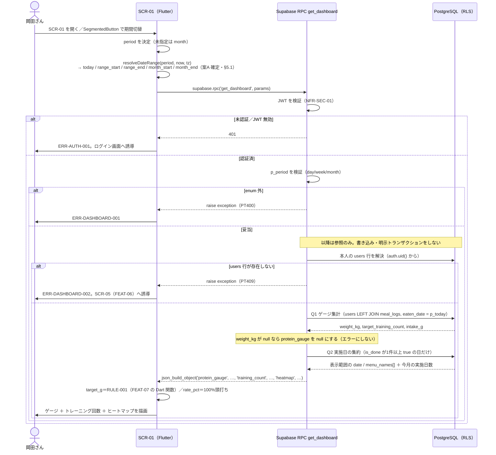

# FEAT-05 ダッシュボード 詳細設計

> **目的**: FEAT-05 を実装が迷わない粒度（入出力・バリデーション・クエリ・エラー・画面挙動・実装単位）まで具体化し、TDDの着手点を固定する。
> **書き方**: 実データは書かない。上位の正本（API契約＝`../../30_データ・IF設計/02_API設計.md` ／ 物理DB＝`../01_DB物理設計.md` ／ シーケンス＝`../../40_機能設計/01_シーケンス設計.md`）と矛盾させず、参照はIDで行う。横断方針（エラー分類・トランザクション・冪等・リトライ）は `../07_実装共通設計パターン.md` を正本とし本書では再定義しない。

> ⚠️ **本書はたたき台（2026-08-02 生成）**。岡田さんのレビューで確定する。

## 目次
1. [概要](#1-概要)
2. [処理フロー](#2-処理フロー)
3. [入出力仕様](#3-入出力仕様)
4. [業務ロジック](#4-業務ロジック)
5. [データアクセス](#5-データアクセス)
6. [エラー処理](#6-エラー処理)
7. [画面挙動・状態別表示](#7-画面挙動状態別表示)
8. [実装単位](#8-実装単位)
9. [テスト観点](#9-テスト観点)
10. [敵対的検証・要確認事項](#10-敵対的検証要確認事項)

## 1. 概要

| 項目 | 内容 |
|---|---|
| 対応要件 | FEAT-05（ダッシュボード表示：タンパク質ゲージ＋トレーニング実施ヒートマップ） |
| 対応画面 | SCR-01 ダッシュボード |
| 対応API | RPC `get_dashboard`（Postgres 関数）。呼び出しは `supabase.rpc('get_dashboard', params: { ... })` |
| 関連ルール | RULE-001（必要量＝体重×2g。**算出ロジックの正本は FEAT-07**、本書では再定義せず共有関数を呼ぶ） |
| 関連ルール | RULE-007（目標トレーニング回数の既定＝月12回）。`users.target_training_count` を今月の目標として表示する |
| 外部連携 | なし（AI不使用。決定的なDB集計のみ） |
| 性能目標 | NFR-PERF-01（初期表示 ≤2秒）／NFR-PERF-02（決定的処理 ≤1秒） |
| 状態 | 本機能は状態を持たない（参照系）。ただし ST-01 `not_done` / ST-02 `done` を**集計対象として読む** |
| 優先度 | MUST |

SCR-01 を開いた時点で、当日のタンパク質達成状況・今月のトレーニング回数・選択期間の実施状況を表示する。取得は RPC 1回。

| 観点 | 方針 |
|---|---|
| 書き込み | 一切しない。読み取り専用 |
| 集計場所 | すべて RPC 内の SQL。Flutter 側で再集計しない |
| 期間切替 | 同じ RPC を `p_period` を変えて呼び直す。表示範囲だけが変わる |
| `period` の意味 | 「表示範囲」のみ。保持範囲ではない（全履歴保持・`../../30_データ・IF設計/01_データモデル.md §7`） |
| `period` の適用先 | ヒートマップだけ。ゲージとトレーニング回数は影響を受けない（確定・§3） |
| ゲージの期間 | 常に当日（`p_today`）。トレーニング回数は常に今月 |
| 例外 | `target_g` と `rate_pct` だけは Flutter 側で算出する。理由は §10-12 |

- 旧構成の `GET /api/dashboard?period=` は廃止する。
- 段3（`../../30_データ・IF設計/02_API設計.md §4.3`）の契約表は RPC 契約への改訂が要る。

## 2. 処理フロー

`../../40_機能設計/01_シーケンス設計.md §3` を正本とし、本節はそれを **バリデーション位置・日付範囲の解決点・クエリ発行点** まで詳細化する。



- 往復は**常に1回**。Q1・Q2 は RPC の中で連続実行される。
- クエリは**常に2本以内**（Q1・Q2）。日数やセル数に比例してクエリが増えない（N+1回避は §5）。
- 本人行が無い時点で `raise exception` する。Q1・Q2 とも発行されない（無駄な集計を打ち切る）。

## 3. 入出力仕様

呼び出しは RPC `get_dashboard` の1本のみ。HTTP エンドポイントは持たない。

| 項目 | 内容 |
|---|---|
| 呼び出し | `supabase.rpc('get_dashboard', params: { ... })` |
| 実体 | Postgres 関数 `public.get_dashboard`（`supabase/migrations/*.sql` で版管理） |
| 認証 | 要。JWT は `supabase_flutter` が自動付与（`../../30_データ・IF設計/02_API設計.md §1`） |
| 権限 | `security invoker`。RLS が本人行のみに絞る |
| 冪等性 | 冪等（参照系）。リトライ安全 |
| キャッシュ | しない。呼び出しごとに再集計する（当日値が変わるため） |
| 失敗の返し方 | `raise exception` ＋ `errcode`。PostgREST が HTTP ステータスへ写す（§6） |

### 引数

| 引数 | 型 | 必須 | 内容 |
|---|---|---|---|
| `p_period` | `text` | 任意（既定 `month`） | `day` / `week` / `month`。未指定時は `month`（[仮]・§10-7） |
| `p_today` | `date` | 必須 | 「当日」の暦日。Flutter が端末TZで解決して渡す |
| `p_range_start` | `date` | 必須 | ヒートマップ表示範囲の開始日（閉区間） |
| `p_range_end` | `date` | 必須 | ヒートマップ表示範囲の終了日（閉区間） |
| `p_month_start` | `date` | 必須 | 今月の初日。トレーニング回数の集計に使う |
| `p_month_end` | `date` | 必須 | 今月の末日。同上 |

- 日付は**すべて Flutter が端末TZで解決して渡す**（案A 確定・2026-08-08）。
- RPC 内で `CURRENT_DATE` / `now()::date` を使わない。比較と採否は §5.1。

```dart
// 呼び出し例（案A・確定）
final json = await supabase.rpc('get_dashboard', params: {
  'p_period': 'month',
  'p_today': '2026-08-07',
  'p_range_start': '2026-08-01',
  'p_range_end': '2026-08-31',
  'p_month_start': '2026-08-01',
  'p_month_end': '2026-08-31',
}) as Map<String, dynamic>;
```

### 戻り値（`json` 1値）

```jsonc
{
  "protein_gauge": {            // 体重未設定なら、この階層ごと null（[仮]・§10-4）
    "weight_kg": "float",       // users.weight_kg。常に当日の値で period に依存しない
    "intake_g": "float"         // 当日の meal_logs.protein_g 合計。記録なしは 0
  },
  "training_count": {           // 常に今月。period に依存しない
    "done_days": "int",         // 今月の実施日数（heatmap と同一条件）
    "target": "int"             // users.target_training_count（既定12・RULE-007）
  },
  "heatmap": [
    {
      "date": "date",           // ISO 8601（YYYY-MM-DD）
      "done": "boolean",        // 返る要素は常に true（塗る日だけを返すため）
      "menu_names": ["string"]  // ツールチップ用の種目名（重複排除・名前昇順）
    }
  ]
}
```

画面 DTO は Flutter が組み立てる。`{ protein_gauge, training_count, heatmap[] }` という形にする。

| フィールド | 由来 |
|---|---|
| `protein_gauge.target_g` | `weight_kg` を FEAT-07 の Dart 関数（RULE-001）に渡して算出 |
| `protein_gauge.intake_g` | RPC の値をそのまま使う |
| `protein_gauge.rate_pct` | `calcGaugeRatePct`（L3・L4）で算出 |
| `protein_gauge` が null | ゲージを描かず、体重登録の誘導に切り替える（§7） |
| `training_count` | RPC の値をそのまま使う。「N / 12 回」の形で表示する |
| `heatmap[]` | RPC の値をそのまま使う |

- `target_g` / `rate_pct` を SQL で計算しない。RULE-001 を SQL に複製しないため（§10-12）。
- `heatmap` は **`is_done` が1件以上 true の日だけ**を返す（塗らない日は要素を返さない）。
- 未実施セルは Flutter が表示範囲から補完する。
- `protein_gauge` は `p_period` に依存しない。**常に `p_today` の1日分**（確定・§10-5）。
- `training_count` も `p_period` に依存しない。**常に今月**。
- 表示範囲（`range_start`〜`range_end`）は戻り値に含めない。Flutter が自分の渡した値を使う（§10-8）。

### エラー時の戻り

```jsonc
// PostgREST 形式（[仮]・実装時に確認）
{ "code": "PT400", "message": "ERR-DASHBOARD-001", "details": "string", "hint": null }
```

- 旧構成の共通エラー契約 `{ error_code, message, retryable }` とは形が違う。
- Flutter 側で `PostgrestException` を捕まえ、共通のエラーモデルへ変換する。
- 変換規則の正本は `../07_実装共通設計パターン.md`。

### 3.1 バリデーション規則

| 項目 | 規則 | 違反時 |
|---|---|---|
| `p_period` | 省略可。指定時は `day` / `week` / `month` のいずれか | ERR-DASHBOARD-001 (400) |
| `p_period` 未指定 | 既定値 `month` を適用（関数の `default`）。エラーにしない | — |
| `p_range_start` / `p_range_end` | `date` として解釈できること | ERR-DASHBOARD-001 (400)（[仮]） |
| `p_range_start` / `p_range_end` | `range_start <= range_end` であること | ERR-DASHBOARD-001 (400) |
| `p_month_start` / `p_month_end` | `month_start <= month_end` であること | ERR-DASHBOARD-001 (400) |
| 未知の引数 | 関数シグネチャに無い引数は PostgREST が弾く。Flutter から送らない | — |
| 認証セッション | JWT が有効であること | ERR-AUTH-001 (401) |
| プロフィール存在 | `users` に本人行が存在すること | ERR-DASHBOARD-002 (409) |
| `users.weight_kg` | NULL 可。NULL でもエラーにせず `protein_gauge: null` で返す（[仮]） | — |

- Flutter 側は `Period` enum で値域を保証する。RPC 側でも同じ検証を行う（二重）。
- 二重にする理由は、RPC が Flutter 以外のクライアントからも呼べるため。検証をクライアントに委ねない。
- Dart には zod が無い。戻り値の検証はモデルクラスの `fromJson` で行う。

## 4. 業務ロジック

| # | ロジック | 定義 | 対応 |
|---|---|---|---|
| L1 | 目標タンパク質量 `target_g` | RULE-001（体重×2g）。**算出の正本は FEAT-07** の Dart 純関数を呼ぶ。本機能では再実装しない | RULE-001 / FEAT-07 |
| L2 | 当日摂取量 `intake_g` | 当日（`eaten_date = p_today`）の `meal_logs.protein_g` の合計。行が無ければ 0 | DM-08 |
| L3 | 達成率 `rate_pct` | `min(100, intake_g / target_g * 100)` を小数第1位に丸める。**100%で頭打ち** | ADR-0002 |
| L4 | 0除算・未設定ガード | `protein_gauge` が null ならゲージを描かない。`target_g` が `0` 以下でも除算しない | §10-4 |
| L5 | 日付範囲 `resolveDateRange` | `day`＝当日のみ／`week`＝当日を含む週の月曜〜日曜／`month`＝当月1日〜末日（[仮]）。**解決するのは Flutter**（案A 確定・§5.1） | §10-8 |
| L6 | 実施日 `done` | その日の `is_done` が **1件以上 true**（＝ST-02 到達）なら実施日。**塗る日だけを `heatmap` に返す** | ST-01 / ST-02 |
| L7 | 種目名 `menu_names` | 実施日の `is_done = true` の明細から `training_menus.name` を重複排除し名前昇順で返す | ST-02 |
| L8 | 今月の実施日数 `done_days` | L6 と同じ条件で数えた今月の日数。1日に複数実施しても 1 と数える | RULE-007 |
| L9 | 目標回数 `target` | `users.target_training_count` をそのまま返す。既定は 12 | RULE-007 / FEAT-06 |

実行場所の割り当て:

| ロジック | 実行場所 |
|---|---|
| L2・L6・L7・L8・L9 | RPC（SQL） |
| L1・L3・L4 | Flutter（Dart 純関数・単体テスト対象） |
| L5 | Flutter（Dart 純関数・案A 確定） |

疑似コード（純関数として切り出す部分）:

```text
calcGaugeRatePct(intake_g, target_g):
  if target_g is null or target_g <= 0: return null        # L4
  return round(min(100, intake_g / target_g * 100), 1)     # L3

resolveDateRange(period, now, timeZone):                    # L5・案A（確定）
  today = 「timeZone における now の暦日」（YYYY-MM-DD）
  day   -> { start: today,               end: today }
  week  -> { start: todayを含む週の月曜, end: todayを含む週の日曜 }
  month -> { start: 当月1日,             end: 当月末日 }
  monthStart = 当月1日 / monthEnd = 当月末日            # period に依らず今月
  return { today, start, end, monthStart, monthEnd }
```

- `intake_g` は `protein_g` の**単純合計**とする。掛ける係数は無い。
- `meal_logs` に個数・倍率の列は存在しない（ADR-0013）。合計は導出値として都度算出する。
- FEAT-09 と同じ式を使う。画面ごとに違う値にならない。
- AI（EXT-01）は使用しない。全てDB集計の決定的処理（NFR-PERF-02）。

## 5. データアクセス

構成は3段。**Q1 と Q2 を1つの RPC にまとめ、往復を1回にする**。

| 段 | 節 | 内容 |
|---|---|---|
| 前提 | §5.1 | 日付範囲とタイムゾーンの決め方（案A で確定） |
| Q1 | §5.2 | タンパク質ゲージ（当日 SUM）と目標回数の取得 |
| Q2 | §5.3 | ヒートマップ（期間集約・N+1回避）。今月の実施日数も同じ集約から取る |
| まとめ | §5.4 | RPC `get_dashboard` が Q1・Q2 を1本にする |
| 付帯 | §5.5 | 対象テーブル・INDEX・RLS・トランザクション境界 |

### 5.1 日付範囲とタイムゾーンの決め方

**タイムゾーンの扱いは本節だけで扱う。** §3・§4 L5・§5.4・§10-1・§10-8 は本節を参照する。

旧構成は「サーバ（`TZ=UTC`）で `APP_TIMEZONE` を解決し、date をパラメータで渡す」方式だった。新構成にサーバは無い。決め方は次の二択だった。

| 観点 | 案A（**採用**） | 案B（不採用） |
|---|---|---|
| 決める場所 | Flutter（端末TZ） | RPC 内（固定TZ） |
| 実装 | `resolveDateRange` を Dart 純関数で持つ | `(now() AT TIME ZONE 'Asia/Tokyo')::date` から導出 |
| 引数 | `p_today` と表示範囲・今月の範囲を渡す（§3） | 日付の引数を持たない |
| 長所 | 純関数なので単体テストしやすい | 端末設定に左右されない |
| 長所 | 海外滞在時は現地の暦日に追従できる | 全機能で暦日の定義が1つに揃う |
| 短所 | 端末TZを変えると同じ日の集計結果が変わる | 海外滞在時に現地の日付と食い違う |
| 短所 | 記録側と採番TZが揃わないとズレる | TZ変更に関数の再デプロイが要る |

**採否: 案A で確定**（2026-08-08）。比較表は判断の記録として残す。

| 項目 | 内容 |
|---|---|
| 決める場所 | Flutter。端末TZで `today`・表示範囲・今月の範囲を解決して RPC に渡す |
| RPC の制約 | **関数内で `CURRENT_DATE` / `now()::date` を使わない。** 引数の値だけを使う |
| 適用範囲 | FEAT-08（`eaten_date` の採番）・FEAT-09（残量のリセット）も同じ基準に揃える |
| 受容するリスク | 端末の日付を変えると記録日と集計日がずれる（§10-14） |

確定後も守ること。

| 項目 | 内容 |
|---|---|
| `CURRENT_DATE` / `now()::date` を素で使わない | Postgres セッションのTZは UTC。JST 00:00〜09:00 の間は前日を返す |
| 記録側とTZを揃える | `eaten_date` / `performed_date` は `date` 型でTZを持たない。記録時と集計時のTZ一致が前提（FEAT-04・FEAT-08） |
| 二重定義を避ける | 日付規則は Dart の `resolveDateRange` にだけ置く。同じ規則を SQL に書かない |

> ~~⚠️ 要確認（人間判断）: 日付範囲を Flutter（端末TZ・案A）で決めるか、RPC 内の固定TZ（案B）で決めるか。~~（**解決**・2026-08-08）
> **案A で確定**。Flutter が端末TZで日付を決めて RPC に渡す。RPC は日付を計算しない。

### 5.2 Q1: タンパク質ゲージ（当日 SUM）

```sql
-- 目的: 体重・目標回数と、当日のタンパク質摂取合計を1クエリで取得する
-- $1 = user_id, $2 = today（§5.1 で解決した暦日・date）
SELECT u.weight_kg,
       u.target_training_count,
       COALESCE(SUM(m.protein_g), 0)::float8 AS intake_g
FROM users u
LEFT JOIN meal_logs m
       ON m.user_id = u.id
      AND m.eaten_date = $2
WHERE u.id = $1
GROUP BY u.id, u.weight_kg, u.target_training_count;
```

- `LEFT JOIN` により、当日の食事記録が0件でも1行（`intake_g = 0`）が返る。
- 旧構成はこのクエリの0行を ERR-DASHBOARD-002 の判定に使っていた。
- RPC では本人行の解決を先に行う。**判定点が前倒しになる**（§5.4）。判定結果は変わらない。
- 絞り込みに使うのは `$2`（当日）だけ。`p_period` を条件に入れない。
- **ゲージは常に当日**であり、期間切替の影響を受けない（確定・§10-5）。
- `target_training_count` は RULE-007 の目標回数。`training_count.target` に入れる（L9）。
- `weight_kg` が NULL なら `protein_gauge` を階層ごと null にする（§5.4）。
- `target_g` はこの `weight_kg` を FEAT-07 の Dart 関数に渡して求める。
- SQL で `weight_kg * 2` を計算しない（RULE-001 の重複定義を避ける）。

### 5.3 Q2: ヒートマップ（期間集約・N+1回避）

塗る日の条件は**確定済み**（2026-08-08）。

| 項目 | 内容 |
|---|---|
| 塗る日 | `training_session_details.is_done` が **1件以上 true** の日 |
| 塗らない日 | `training_sessions` の行があるだけの日（予定のみ・未実施） |
| 塗らない日 | 明細が0件の日／明細が全て `is_done = false` の日 |
| 使わないもの | `gym_visits`（入館履歴）。実施の根拠は `is_done` だけ |

```sql
-- 目的: 期間内の実施日ごとに「種目名の配列」を1クエリで集約する
-- 実施日の条件: is_done が1件以上 true（確定・§4 L6）
-- $1 = user_id, $2 = range_start（date）, $3 = range_end（date）
SELECT s.performed_date                                   AS date,
       COALESCE(bool_or(d.is_done), false)                AS done,
       COALESCE(
         array_agg(DISTINCT mn.name ORDER BY mn.name)
           FILTER (WHERE d.is_done),
         ARRAY[]::text[]
       )                                                  AS menu_names
FROM training_sessions s
LEFT JOIN training_session_details d ON d.session_id = s.id
LEFT JOIN training_menus          mn ON mn.id = d.menu_id
WHERE s.user_id = $1
  AND s.performed_date BETWEEN $2 AND $3
GROUP BY s.performed_date
HAVING bool_or(d.is_done)   -- 塗る日だけを残す。予定のみの日・明細0件の日は落ちる
ORDER BY s.performed_date;
```

- **N+1回避**: 日付ごと・セッションごとのループ照会をしない。
- `GROUP BY performed_date` の1クエリで全日分を組み立てる。
- `array_agg` により種目名も同一クエリに含める。明細取得の追加クエリを発行しない。
- 同じ日に複数の `training_sessions` があっても `performed_date` で集約され、1日1要素になる。
- `HAVING` を通った行だけが返るため、`done` は常に `true` になる。列は契約維持のため残す。
- 明細0件の日は `bool_or` が NULL となり、`HAVING` で落ちる。
- 今月の実施日数（`training_count.done_days`）は同じ集約結果を数えて求める（§5.4）。
- PostgREST の埋め込み `select` でも1往復で取れる。ただし日付集約と重複排除が Flutter 側の処理になるので採らない。

### 5.4 RPC `get_dashboard`（Q1・Q2 を1本にまとめる）

Q1・Q2 を1つの関数にまとめ、`json_build_object` で返す。往復は1回になる。

| 項目 | 値 | 理由 |
|---|---|---|
| 言語 | `plpgsql` | `raise exception` でエラーを返すため。旧案の `language sql` では RAISE が書けない |
| 揮発性 | `stable` | 参照のみ。同一トランザクション内で結果が変わらない |
| 権限 | `security invoker` | `security definer` は RLS を迂回するので使わない |
| `search_path` | `public` に固定 | 関数内の名前解決を呼び出し元の設定に依存させない |

```sql
-- supabase/migrations/*.sql
create or replace function public.get_dashboard(
  p_period      text default 'month',
  p_today       date default null,
  p_range_start date default null,
  p_range_end   date default null,
  p_month_start date default null,
  p_month_end   date default null
)
returns json
language plpgsql
stable
security invoker
set search_path = public
as $$
declare
  v_user_id uuid;          -- users.id は auth.users.id と同値の uuid（案A・ADR-0005）
  v_weight  numeric;
  v_target  int;
  v_intake  float8;
  v_done    int;
  v_heatmap json;
begin
  -- (1) 引数検証 → ERR-DASHBOARD-001
  if p_period is null or p_period not in ('day', 'week', 'month') then
    raise exception 'ERR-DASHBOARD-001' using errcode = 'PT400';
  end if;
  if p_range_start > p_range_end or p_month_start > p_month_end then
    raise exception 'ERR-DASHBOARD-001' using errcode = 'PT400';
  end if;

  -- (2) 本人の users 行を解決 → 無ければ ERR-DASHBOARD-002
  --     案A（ADR-0005）により中間列は不要。id を auth.uid() と直接比較する
  select u.id
    into v_user_id
    from users u
   where u.id = auth.uid();
  if not found then
    raise exception 'ERR-DASHBOARD-002' using errcode = 'PT409';
  end if;

  -- (3) Q1（§5.2 と同一。$1 = v_user_id, $2 = p_today）
  select g.weight_kg, g.target_training_count, g.intake_g
    into v_weight, v_target, v_intake
    from (
      SELECT u.weight_kg,
             u.target_training_count,
             COALESCE(SUM(m.protein_g), 0)::float8 AS intake_g
      FROM users u
      LEFT JOIN meal_logs m
             ON m.user_id = u.id
            AND m.eaten_date = p_today
      WHERE u.id = v_user_id
      GROUP BY u.id, u.weight_kg, u.target_training_count
    ) g;

  -- (4) Q2（§5.3 と同一）。実施日の集約を CTE に1本化し、
  --     ヒートマップ（表示範囲）と今月の実施日数の両方をそこから取る
  with done_dates as (
    SELECT s.performed_date                                   AS date,
           COALESCE(
             array_agg(DISTINCT mn.name ORDER BY mn.name)
               FILTER (WHERE d.is_done),
             ARRAY[]::text[]
           )                                                  AS menu_names
    FROM training_sessions s
    LEFT JOIN training_session_details d ON d.session_id = s.id
    LEFT JOIN training_menus          mn ON mn.id = d.menu_id
    WHERE s.user_id = v_user_id
      AND s.performed_date BETWEEN least(p_range_start, p_month_start)
                               AND greatest(p_range_end, p_month_end)
    GROUP BY s.performed_date
    HAVING bool_or(d.is_done)   -- 塗る条件（確定・§5.3）
  )
  select
    coalesce(
      (select json_agg(
                json_build_object('date', x.date, 'done', true, 'menu_names', x.menu_names)
                order by x.date)
         from done_dates x
        where x.date between p_range_start and p_range_end),
      '[]'::json),
    (select count(*) from done_dates x
      where x.date between p_month_start and p_month_end)
    into v_heatmap, v_done;

  return json_build_object(
    'protein_gauge',
      case when v_weight is null then null   -- 体重未設定はエラーにしない（確定・§10-4）
           else json_build_object('weight_kg', v_weight, 'intake_g', v_intake)
      end,
    'training_count', json_build_object('done_days', v_done, 'target', v_target),
    'heatmap',        v_heatmap
  );
end;
$$;
```

- Q1・Q2 の SQL 本体は §5.2・§5.3 から変えていない。**N+1回避の結論は変わらない。**
- 集約を CTE にしたことで、ヒートマップと今月の実施日数の**集計元が1つに揃う**。
- 走査範囲は表示範囲と今月の和集合。`month` 表示では両者が一致する。
- 日付はすべて引数で受け取る。関数内で `CURRENT_DATE` を使わない（案A 確定・§5.1）。
- 体重未設定でも `training_count` と `heatmap` は通常どおり返す。
- 関数の DDL は `../01_DB物理設計.md` に存在しない。追記が要る（`../07_実装共通設計パターン.md §10-1` と同じ論点）。

### 5.5 対象テーブル・INDEX・RLS

**対象テーブル**（すべて SELECT のみ。INSERT/UPDATE/DELETE は無い）

| テーブル | 用途 |
|---|---|
| `users` | 体重・目標回数の取得・本人行の解決 |
| `meal_logs` | 当日のタンパク質合計（Q1） |
| `training_sessions` | 実施日の抽出（Q2） |
| `training_session_details` | 実施有無の判定（Q2）。`is_done` が唯一の判定材料 |
| `training_menus` | 種目名の解決（Q2） |

**使用INDEX**

| クエリ | INDEX | 使い方 |
|---|---|---|
| Q1 | `ix_meal_logs_user_date` | `user_id, eaten_date` の等値一致 |
| Q2 | `ix_train_sessions_user_date` | `user_id, performed_date` の範囲スキャン |
| Q2 | `uq_tsd_session_menu` | 先頭列 `session_id` で JOIN |
| Q2 | `training_menus` の PK | 種目名の解決 |

- **追加INDEXは現時点で不要**。新規INDEXの追加は `../01_DB物理設計.md` が正本のため本書では行わない。
- `ix_gym_visits_user_date` は使わない。本機能は `gym_visits` を参照しない（**確定**・§10-2）。

**RLS・トランザクション**

| 観点 | 内容 |
|---|---|
| RLS | `user_id = auth.uid()` の直接比較で本人行のみ。`security invoker` なので関数内でも効く |
| RLS | `users` 自身の述語は `id = auth.uid()`。`users.id` は `auth.users.id` と同値の uuid（案A・ADR-0005） |
| 往復回数 | 1（RPC 1本）。旧構成は2クエリを個別に発行していた |
| トランザクション | 関数本体が暗黙の単一トランザクション。参照のみのため明示的な `begin` は書かない |
| トランザクション | Q1/Q2 が同一スナップショットで読める。旧構成より改善する |

## 6. エラー処理

| ERR-ID | HTTP | errcode | 発生条件 | 利用者向けメッセージ（意図） | retryable | ログ |
|---|---|---|---|---|---|---|
| ERR-AUTH-001 | 401 | — | JWT が無効／未ログイン（PostgREST が返す） | 再ログインを促す | false | 認証失敗として記録（NFR-SEC-AUDIT-02） |
| ERR-DASHBOARD-001 | 400 | `PT400` | `p_period` が `day` / `week` / `month` 以外。または範囲の前後が逆 | 期間指定が不正である旨（UIからは通常起きない） | false | warn（引数値を記録） |
| ERR-DASHBOARD-002 | 409 | `PT409` | `users` に本人行が存在しない（FEAT-06 の初期設定が未完了） | 初期設定（SCR-05）へ誘導する | false | warn |
| ERR-DASHBOARD-003 | 500 | — | RPC の失敗（DB到達不能・タイムアウト・想定外例外） | 一時的な取得失敗として再試行を促す | true | error（所要時間を記録） |

- `PT4xx` / `PT5xx` を `errcode` に指定すると PostgREST が同じ番号の HTTP ステータスで返す。
- 上記は `[仮]`。実装時に公式ドキュメントで確認する。
- ERR-DASHBOARD-003 は RPC 側で分類できない。Flutter が `PostgrestException`・接続例外を捕まえて割り当てる。
- `users.weight_kg` が NULL のケースは**エラーにしない**。`protein_gauge` を null にして 200 を返す（[仮]・§10-4）。
- 画面側はゲージの位置を体重登録の誘導に差し替える（§7）。
- 体重未設定でもヒートマップとトレーニング回数は通常どおり表示する。
- 自動リトライは行わない（参照系のため、利用者操作の [再試行] に委ねる）。
- ログは Supabase 側（Postgres ログ）に出る。Flutter 側のクラッシュ収集はスコープ外。
- 分類・出力の横断方針は `../07_実装共通設計パターン.md` を正本とする。

> ERRの完全列挙の正本は `../../60_テスト設計/02_RED母集合_受入基準・状態・エラー.md`（段6で集約）。本表はその入力とする。

## 7. 画面挙動・状態別表示

| 状態 | 表示 | 操作可否 |
|---|---|---|
| 初期/空（記録0件） | ゲージは `intake_g=0`・`rate_pct=0` で描画。ヒートマップは全セル未実施色＋「まだ記録がありません」 | `SegmentedButton` 操作可 |
| 読込中 | ゲージ・ヒートマップの位置に `shimmer` のプレースホルダ（同サイズでシフト防止） | `SegmentedButton` は `onSelectionChanged: null` |
| 成功（ゲージ） | `CircularProgressIndicator(value: rate_pct / 100)` を `Stack` の中央 `Text`（`intake_g / target_g`）と重ねる | 全操作可 |
| 成功（トレーニング回数） | ゲージの下に「今月のトレーニング **N / 12 回**」を `Text` で表示。N＝`done_days`・12＝`target` | 全操作可 |
| 成功（ヒートマップ） | 各セルを `Tooltip(message: menu_names)` で包む。空配列の日は日付のみ | 全操作可 |
| 体重未設定（`protein_gauge: null`） | ゲージの位置に「体重を登録すると目標が表示されます」＋ SCR-05 への `ElevatedButton`。**エラー表示にしない** | ゲージ以外は操作可 |
| エラー（4xx/5xx） | ゲージ／ヒートマップ領域をエラー表示（`Icon`＋`Text` の `Card`）に差し替え＋[再試行] `TextButton`＋`SnackBar` | [再試行] のみ |
| 期間切替中 | 直前の表示を保持したまま `Stack` に半透明の `Container`＋`CircularProgressIndicator` を重ねる | 切替完了まで無効 |

- ゲージは常に当日の値を出す。`SegmentedButton` の切替で変わるのは**ヒートマップだけ**（確定・§10-5）。
- トレーニング回数も常に今月。期間切替の影響を受けない。
- 体重未設定でもヒートマップとトレーニング回数は通常どおり描く（確定・§10-4）。
- ゲージは `CircularProgressIndicator` で足りる。
- 中央ラベルや太さの調整が要るなら `fl_chart` の `PieChart` に置き換える（[仮]）。
- カレンダー型ヒートマップに相当する標準ウィジェットは無い。
- `GridView.builder` ＋ `Container` の自作とする（[仮]）。ADR-0002 が前提にしていた既製コンポーネントは使えない。
- ダークモードの配色は `Theme.of(context).colorScheme` に追従させる。
- ヒートマップの2値（実施／未実施）のコントラストを両モードで確認する。
- 初期表示 ≤2秒（NFR-PERF-01）は RPC 1往復と描画で満たす。遅延ロードの仕組みは持たない。

## 8. 実装単位

| # | ファイル | 役割 | 主なシグネチャ |
|---|---|---|---|
| 1 | `supabase/migrations/*_get_dashboard.sql` | RPC `get_dashboard` の定義（§5.4）。up/down 対で用意する | `get_dashboard(p_period text, p_today date, p_range_start date, p_range_end date, p_month_start date, p_month_end date) returns json` |
| 2 | `app/lib/data/dashboard_repository.dart` | RPC 呼び出しと例外分類（Supabase クライアント注入） | `Future<Dashboard> fetch(Period period, DateRange range)` |
| 3 | `app/lib/domain/date_range.dart` | `period` → 表示範囲と今月の範囲（TZ解決・純関数・案A 確定） | `DateRange resolveDateRange(Period period, DateTime now, String timeZone)` |
| 4 | `app/lib/domain/gauge.dart` | 達成率算出（100%頭打ち・0除算ガード・純関数） | `double? calcGaugeRatePct(double intakeG, double? targetG)` |
| 5 | `app/lib/features/dashboard/dashboard_model.dart` | RPC の JSON → モデル変換 | `factory Dashboard.fromJson(Map<String, dynamic> json)` |
| 6 | `app/lib/features/dashboard/dashboard_page.dart` | SCR-01 のページ（レイアウトと状態分岐） | `class DashboardPage extends StatelessWidget` |
| 7 | `app/lib/features/dashboard/protein_gauge.dart` | ゲージ表示・未設定時の縮退表示 | `class ProteinGauge extends StatelessWidget` |
| 8 | `app/lib/features/dashboard/training_heatmap.dart` | ヒートマップ表示・`Tooltip` で種目名 | `class TrainingHeatmap extends StatelessWidget` |
| 9 | `app/lib/features/dashboard/period_control.dart` | `SegmentedButton`（日/週/月）と再取得 | `class PeriodControl extends StatelessWidget` |
| 10 | `app/lib/features/dashboard/training_count.dart` | 今月のトレーニング回数「N / 12 回」の表示 | `class TrainingCount extends StatelessWidget` |

- 目標量の算出関数は **FEAT-07 が定義する `app/lib/domain/nutrition.dart` を import** する。
- 配置・関数名の正本は FEAT-07 の詳細設計。本機能では同等の計算を書かない。
- 純関数（#3・#4）は単体テスト対象（NFR-QUAL-01）。
- 戻り値のスキーマ検証ライブラリは使わない。`fromJson` で型変換し、欠損はモデル側の既定値で吸収する。

## 9. テスト観点

### 9.1 テストケース

| TC-ID | 観点 | 期待 |
|---|---|---|
| TC-FEAT05-01 | 未認証で `get_dashboard` を呼ぶ | 401 / ERR-AUTH-001 |
| TC-FEAT05-02 | `p_period` が enum 外 | 400 / ERR-DASHBOARD-001（`PT400`） |
| TC-FEAT05-03 | `p_period` 未指定 | 成功・`month` の範囲で集計される |
| TC-FEAT05-04 | 当日の `meal_logs` が0件 | `intake_g = 0`・`rate_pct = 0`（エラーにしない） |
| TC-FEAT05-05 | `intake_g > target_g`（過剰摂取） | `rate_pct = 100`（100%頭打ち・ADR-0002） |
| TC-FEAT05-06 | `users.weight_kg` が NULL | 200・`protein_gauge: null`。ヒートマップと `training_count` は通常どおり返る |
| TC-FEAT05-07 | `users` 行なし | 409 / ERR-DASHBOARD-002（`PT409`） |
| TC-FEAT05-08 | 同日に複数 `training_sessions` | ヒートマップ要素は1日1件に集約される |
| TC-FEAT05-09 | 明細が全て `is_done=false` の日 | `heatmap` に**含まれない**（塗らない） |
| TC-FEAT05-10 | 明細0件の `training_sessions` の日 | `heatmap` に**含まれない**（L6 の定義どおり） |
| TC-FEAT05-11 | 同一種目を複数明細で実施 | `menu_names` が重複排除され名前昇順 |
| TC-FEAT05-12 | 期間境界（`p_range_start` / `p_range_end` 当日） | 両端が含まれる（BETWEEN の閉区間） |
| TC-FEAT05-13 | 端末TZ=JST・UTC で日付が変わる時刻（JST 00:30） | 当日判定が JST の暦日になる（前日にならない） |
| TC-FEAT05-14 | 発行クエリ数の検証 | RPC 1往復・関数内2クエリ以内（N+1が無い） |
| TC-FEAT05-15 | 初期表示の所要時間 | ≤2秒（NFR-PERF-01） |
| TC-FEAT05-16 | DB到達不能 | ERR-DASHBOARD-003・エラー表示＋[再試行] が出る |
| TC-FEAT05-17 | 今月に実施日が複数ある（同日2セッション含む） | `training_count.done_days` が実施**日数**と一致する（回数ではない） |
| TC-FEAT05-18 | `period` を day / week / month と切り替える | `protein_gauge` と `training_count` の値が変わらない |
| TC-FEAT05-19 | 初期設定のまま（RULE-007 の既定） | `training_count.target` が 12 になる |
| TC-FEAT05-20 | `gym_visits` だけがあり `is_done` が無い日 | `heatmap` に含まれず `done_days` にも数えられない |

### 9.2 受入基準（G/W/T）の候補

- [AC] Given 当日の食事記録と体重が登録されている When SCR-01 を開く Then タンパク質ゲージが達成率とともに表示される
- [AC] Given 摂取量が目標量を超えている When SCR-01 を開く Then 達成率は100%として表示される
- [AC] Given 体重が未設定である When SCR-01 を開く Then ゲージの位置に体重登録の案内と SCR-05 への導線が示される
- [AC] Given 体重が未設定である When SCR-01 を開く Then ヒートマップとトレーニング回数は通常どおり表示される
- [AC] Given 今月にトレーニング実施日がある When SCR-01 を開く Then 「今月のトレーニング N / 12 回」が表示される
- [AC] Given 期間内にトレーニング実施日がある When ヒートマップの実施日をタップする Then その日の種目名が表示される
- [AC] Given 月表示でダッシュボードを見ている When `SegmentedButton` で週を選ぶ Then ヒートマップの範囲だけが切り替わる
- [AC] Given ダッシュボードを見ている When 期間を切り替える Then ゲージとトレーニング回数の値は変わらない

> 受入基準・ST・ERR の**正本は段6**（`../../60_テスト設計/02_RED母集合_受入基準・状態・エラー.md`・本PR対象外）。本節はその母集合への入力。

## 10. 敵対的検証・要確認事項

| # | 論点 | 内容 | 重大度 |
|---|---|---|---|
| 1 | ~~「当日」判定のタイムゾーン~~（**解決**） | **案A で確定**（2026-08-08）。Flutter が端末TZで当日と各範囲を決め、引数で RPC に渡す。RPC 内で `CURRENT_DATE` を使わない（§5.1）。記録側（FEAT-04・FEAT-08）も同じ基準に揃える。端末時刻を信頼する副作用は §10-14 に残す | — |
| 2 | ~~`done` の定義が文書間で不一致~~（**解決**） | **`training_session_details.is_done` が1件以上 true の日**を実施日とする（2026-08-08）。`gym_visits` は使わない。段3 §3 の「実施有無元＝`gym_visits`」は誤りとして直す。`../01_DB物理設計.md §2.2` の `performed_date` は集約キーであって判定条件ではない | — |
| 3 | ~~`done` 判定の粒度~~（**解決**） | **`is_done` が1件以上 true**で確定（2026-08-08）。`training_sessions` の行があるだけの日・明細0件の日は塗らない。ST-02 到達と一致する。SQL は `HAVING bool_or(d.is_done)`（§5.3） | — |
| 4 | ~~体重未設定時のゲージ~~（**解決**） | **`protein_gauge` を null にして 200 を返す**（2026-08-08）。エラーにしない。画面はゲージの位置に体重登録の案内を出す（§7）。ヒートマップとトレーニング回数は通常どおり表示する。段3 §4.3 の契約に反映が要る | — |
| 5 | ~~ゲージとヒートマップで期間の意味が違う~~（**解決**） | **ゲージは常に当日**で確定（2026-08-08）。`period` はヒートマップの表示範囲だけを変える。タンパク質は日単位で管理するため、週・月の平均や累積は取らない。トレーニング回数も常に今月 | — |
| 6 | 100%頭打ちで過剰摂取が見えない | ADR-0002 で100%頭打ちを確定済みだが、150%摂取と100%摂取が同じ表示になり**摂り過ぎに気づけない**。減量・増量いずれの目的でも過剰は情報として要る。リングは100%で止めつつ中央の数値や `Chip` で超過を示す補助表示が要るか | 🟡 中 |
| 7 | `period` の既定値と `day` の情報価値 | `period` 省略時の既定値が契約に無い（本書は `month` を [仮]）。`period=day` ではヒートマップが1セルになり可視化として成立しない。日表示は当日の種目リストに差し替える等のUI判断が要る（ADR-0002「表示は常に1ヶ月」との関係も整理が必要） | 🟡 中 |
| 8 | 週/月の境界規則がレスポンスに無い | `week`＝暦週か直近7日か、`month`＝当月1日〜末日か直近30日かが未定義（本書は暦基準を [仮]）。案A なら規則は Dart 側1箇所で済む。案B は RPC 内に規則があり Flutter 側で描画範囲を再計算＝二重実装になり、ズレると範囲が食い違う | 🟡 中 |
| 9 | ~~`intake_count` を掛けるか~~（**解決**） | **列を削除したため論点が消滅した**（ADR-0013）。`meal_logs` に個数・倍率の列は無い。当日摂取量は `SUM(protein_g)` のみで、FEAT-09 と同じ式になる | — |
| 10 | 全履歴保持と集計性能 | 保持期間の制限が無く（`01_データモデル.md §7`）行数は単調増加する。ただし Q1・Q2 とも走査対象は期間内に限定される（§5.5）。**month 表示では既存INDEXで足りるが**、「年」表示・累積統計・複数ユーザー化を足すと前提が変わり再評価が要る | 🟢 低 |
| 11 | ~~`users.id` と `auth.uid()` の紐付け未確定~~（**解決**） | **案A確定**（ADR-0005）。`users.id` を `auth.users.id` と同値の uuid にする。中間列は持たない。§5.4 の本人行解決は `u.id = auth.uid()` になり、`v_user_id` も uuid で確定した | — |
| 12 | RULE-001 の計算場所 | 構成変更で新たに生じた論点。旧構成は `target_g` をサーバ側で算出していた。集計を RPC に寄せると RULE-001（体重×2g）が FEAT-07 と二重定義になるため、本書は Dart 側算出を [仮] とした（戻り値と画面 DTO の形は一致しない） | 🟡 中 |
| 13 | 過去期間の達成率が遡って書き換わる | 体重は現在値1点のみを持つと確定した（ADR-0009）。`weight_kg` に履歴が無いため、過去日・過去期間のゲージも**現在の体重**で `target_g` を計算する。体重を変えると過去の達成率が事後的に変わる。SCR-01 に**誤解を与えないUI表現が要る**（どの体重を基準にした値かの明示・注記） | 🟡 中 |
| 14 | 端末時刻を信頼する副作用 | #1 の確定により日付は端末TZで決まる。利用者が端末の日付を変えると、記録日と集計日がずれる。RPC 側に検知手段は無く、補正もしない。自己申告データの範囲にとどまるため受容する | 🟢 低 |

> ~~⚠️ 要確認（人間判断）: #1 日付範囲の解決を Flutter（端末TZ・案A）にするか RPC 内の固定TZ（案B）にするか。~~（**解決**・2026-08-08）
> **案A で確定**。記録側（FEAT-04・FEAT-08）の日付採番も端末TZに揃える。

> ~~⚠️ 要確認（人間判断）: #2・#3 ヒートマップの「実施有無」の集計元と判定粒度の確定。~~（**解決**・2026-08-08）
> ~~集計元の候補は `gym_visits` / `training_sessions` / `training_session_details.is_done` の3つ。~~
> **`training_session_details.is_done` が1件以上 true の日**で確定した。`gym_visits` は使わない。
> 段3 §3 と `../01_DB物理設計.md` の食い違いは、この条件に合わせて解消する。

> ~~⚠️ 要確認（人間判断）: #4 体重未設定時に `target_g`・`rate_pct` を null で返す（本書の [仮]）ことを契約に反映してよいか。~~（**解決**・2026-08-08）
> **`protein_gauge` を null にして 200 を返す**で確定した。エラーにしない。
> `../../30_データ・IF設計/02_API設計.md §4.3` の契約に反映する。

> ~~⚠️ 要確認（人間判断）: #5 `period` がゲージに及ぶか否か。ゲージを当日固定と明記するか、週/月では平均達成率にするか。~~（**解決**・2026-08-08）
> **ゲージは常に当日**で確定した。`period` はヒートマップの表示範囲だけを変える。

> ⚠️ 要確認（人間判断）: #6 100%頭打ちのまま過剰摂取を補助表示（数値・`Chip`）で見せるかどうか。

> ⚠️ 要確認（人間判断）: #7・#8 `period` の既定値、週/月の境界規則、および `period=day` のヒートマップ表現。

> ~~⚠️ 要確認（人間判断）: #9 `intake_count` を摂取量計算に乗じるか。FEAT-09 と同一の解釈に統一する必要がある。~~（**解決**・2026-08-08）
> **列ごと削除した**（ADR-0013）。掛ける対象が存在しないため、FEAT-05 と FEAT-09 は自動的に同じ式になる。

> ⚠️ 要確認（人間判断）: #12 RULE-001 を Dart 側のみに置き、RPC は `weight_kg` を返すだけとする方針でよいか。

> ⚠️ 要確認（人間判断）: #13 過去期間のゲージを「現在の体重が基準」と分かる表現にするか。ADR-0009 により体重履歴は持たないため、表現でしか解けない。案は次の3つ。
>
> | 案 | 表現 |
> |---|---|
> | i | ゲージ脇に基準体重を併記する（「基準: 現在の体重 ◯kg」） |
> | ii | 期間が当日以外のとき注記を出す（「過去分も現在の体重で計算しています」） |
> | iii | ゲージは当日固定とし、過去期間では達成率を出さない（#5 の結論に依存） |

> ~~⚠️ 要確認（人間判断）: 本書は Flutter + Supabase 構成（Vercel 不使用）で記述している。~~（**解決**・2026-08-08）
> ~~一方 ADR-0001（Vercel AI Gateway 採用）・ADR-0002（Next.js + Mantine 採用）は Vercel 前提のまま。~~
> ~~`30_データ・IF設計/02_API設計.md` も `/api/*` の Route Handler 契約のまま。後継ADRの起票と段3の改訂が必要。~~
> **ADR-0010**（Flutter + Supabase）と **ADR-0011**（Gemini API 直接）を起票した。
> ADR-0001・ADR-0002 は Superseded にした。段3も改訂済み。
> 本機能では `GET /api/dashboard?period=` が RPC `get_dashboard` に置き換わった。

> 関連: API契約＝`../../30_データ・IF設計/02_API設計.md` / 物理DB＝`../01_DB物理設計.md` / 横断方針＝`../07_実装共通設計パターン.md` / シーケンス＝`../../40_機能設計/01_シーケンス設計.md`。
