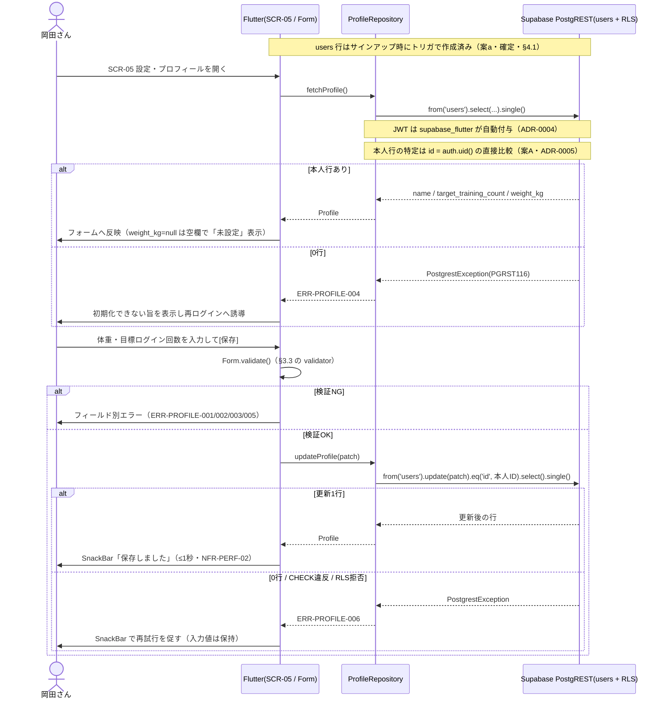

# FEAT-06 初期設定（目標ログイン回数・体重） 詳細設計

> **目的**: FEAT-XX を実装が迷わない粒度（入出力・バリデーション・クエリ・エラー・画面挙動・実装単位）まで具体化し、TDDの着手点を固定する。
> **書き方**: 実データは書かない。上位の正本（API契約＝`../../30_データ・IF設計/02_API設計.md` ／ 物理DB＝`../01_DB物理設計.md` ／ シーケンス＝`../../40_機能設計/01_シーケンス設計.md`）と矛盾させず、参照はIDで行う。横断方針（エラー分類・トランザクション・冪等・リトライ）は `../07_実装共通設計パターン.md` を正本とし本書では再定義しない。

> ⚠️ **本書はたたき台（2026-08-02 生成）**。岡田さんのレビューで確定する。

## 目次
1. [概要](#1-概要)
2. [処理フロー](#2-処理フロー)
3. [入出力仕様](#3-入出力仕様)
4. [業務ロジック](#4-業務ロジック)
5. [データアクセス](#5-データアクセス)
6. [エラー処理](#6-エラー処理)
7. [画面挙動・状態別表示](#7-画面挙動状態別表示)
8. [実装単位](#8-実装単位)
9. [テスト観点](#9-テスト観点)
10. [敵対的検証・要確認事項](#10-敵対的検証要確認事項)

## 1. 概要

| 項目 | 内容 |
|---|---|
| 対応要件 | FEAT-06（初期設定：目標ログイン回数・体重の登録／変更） |
| 対応画面 | SCR-05 設定・プロフィール |
| 対応API | **PostgREST 直接**。読み取り＝`supabase.from('users').select()`／更新＝`supabase.from('users').update()`（§3） |
| 実装構成 | Flutter（`supabase_flutter`）→ Supabase PostgREST → `users`。Edge Function・RPC は使わない |
| 関連ルール | RULE-007（目標ログイン回数の既定＝月12回）。RULE-001（必要量＝体重×2g）は**参照のみ**で算出の正本は FEAT-07 |
| 外部連携 | なし（AIを使わない決定的処理） |
| 性能目標 | NFR-PERF-02（決定的処理 ≤1秒）。SCR-05 の初期表示は NFR-PERF-01（≤2秒） |
| 状態 | 状態を持たない（ST-01/ST-02 は FEAT-04 のトレーニング明細のみが持つ） |
| 優先度 | MUST（`../../30_データ・IF設計/02_API設計.md §2`） |
| 対象テーブル | DM-01 `users`（`name` / `target_training_count` / `weight_kg`） |

FEAT-06 は `users` の本人1行を読み書きするだけの機能である。保持する値は3つ。

| 値 | 列 | 未設定時 |
|---|---|---|
| 表示名 | `users.name` | 既定値を入れる（`not null`・§4.2） |
| 目標ログイン回数（月） | `users.target_training_count` | RULE-007 の既定＝12 |
| 体重(kg) | `users.weight_kg` | NULL のまま（推測しない） |

責務の境界は次のとおり。

| 本書がやること | 本書がやらないこと |
|---|---|
| `weight_kg` を保持・更新する | `weight_kg` から必要タンパク質量を導く（RULE-001・正本は FEAT-07） |
| 「保存された `weight_kg` が FEAT-07 の唯一の入力である」ことを保証する | 算出式・端数処理の定義 |

FEAT-05・FEAT-07・FEAT-09 は本機能が書き込んだ `users.weight_kg` の読み手にあたる。

`users.target_training_count` の読み手は **FEAT-05** である。ダッシュボードに「今月のトレーニング N / 12 回」として表示する（確定・2026-08-08）。

## 2. 処理フロー

FEAT-06 のシーケンスは `../../40_機能設計/01_シーケンス設計.md` に無い。本書で新規に定義する。
記法とアクター表記は同ファイルに合わせる。



バリデーションの位置は2段になる。

| 段 | 実体 | 役割 |
|---|---|---|
| 1 | Flutter の `TextFormField.validator` | アプリ層で唯一の検証。UX も兼ねる |
| 2 | DB の CHECK 制約 | 最後の防波堤。違反メッセージを利用者に見せない |

旧構成にあった中間のサーバ側再検証は**無くなる**。PostgREST 直接にしたためである（§10 論点8）。

**検証はアプリ側のみで確定した**（ADR-0016・2026-08-08）。DB の CHECK は強めない。

トランザクション境界は「1文＝1トランザクション」。

| 項目 | 内容 |
|---|---|
| 張れない理由 | PostgREST 経由のため `BEGIN`〜`COMMIT` を発行できない |
| 影響 | なし。本機能は単一表・単一文のみで足りる |
| 正本 | `../07_実装共通設計パターン.md` |

## 3. 入出力仕様

呼び出しは2つだけ。いずれも `app/lib/data/profile_repository.dart` に閉じる。

### 3.1 読み取り（`users` の select）

| 項目 | 内容 |
|---|---|
| 呼び出し | `supabase.from('users').select('id, name, target_training_count, weight_kg').single()` |
| 認証 | 必須。`supabase_flutter` が保持する JWT を自動付与（ADR-0004）。未ログインは RLS で0行 |
| 引数 | なし。行の絞り込みは RLS が担う（§5） |
| 返り | `Map<String, dynamic>` 1件 → `Profile.fromJson` でモデル化 |
| 失敗 | `PostgrestException`（0行＝ERR-PROFILE-004）／`AuthException`（ERR-AUTH-001） |
| 冪等 | 参照系。副作用を持たない（行の作成は §4.1 案a でトリガ側に移した） |

```dart
// app/lib/data/profile_repository.dart
Future<Profile> fetchProfile() async {
  final row = await _supabase
      .from('users')
      .select('id, name, target_training_count, weight_kg')
      .single();
  return Profile.fromJson(row);
}
```

`Profile` の各フィールドの型は次のとおり。

| フィールド | Dart 型 | 内容 |
|---|---|---|
| `id` | `String` | `users.id`（**uuid**）。`auth.users.id` と同値（案A・ADR-0005）。自動採番しない |
| `name` | `String` | トリム後 1〜50 文字 |
| `target_training_count` | `int?` | 0〜31。未設定でも既定 12 が入った状態で返る |
| `weight_kg` | `double?` | 20.0〜300.0・小数第1位まで。`null`＝未設定 |

### 3.2 更新（`users` の update）

| 項目 | 内容 |
|---|---|
| 呼び出し | `supabase.from('users').update(patch).eq('id', userId).select(...).single()` |
| `userId` | `supabase.auth.currentUser!.id`（uuid 文字列）。`users.id` と同値のため変換しない（案A・ADR-0005） |
| 認証 | 必須（ADR-0004）。`.eq('id', ...)` は RLS の保険であって代替ではない |
| `patch` | 3列すべて任意（部分更新）。最低1つ必須。生成は `buildProfileUpdate`（§4.3） |
| 返り | 更新後の行（§3.1 と同一スキーマ） |
| 失敗 | `PostgrestException`（0行・CHECK違反・RLS拒否＝ERR-PROFILE-006、未知列＝ERR-VALIDATION-001） |
| 冪等 | 同一 `patch` の再送で結果が変わらない。自動リトライはしない |

```dart
Future<Profile> updateProfile(ProfileUpdate input) async {
  final patch = buildProfileUpdate(input); // 空 Map なら呼ぶ前に ERR-PROFILE-005
  final row = await _supabase
      .from('users')
      .update(patch)
      .eq('id', userId)
      .select('id, name, target_training_count, weight_kg')
      .single();
  return Profile.fromJson(row);
}
```

`patch` のキーは DB列名と一致させる。表記は snake_case（`../06_DB設計規約.md` の物理命名規約）。
Dart 側でキャメルケースに変換しない。

### 3.3 バリデーション規則

数値・文字数の規則は旧構成から**変更しない**。検証の実体だけが Flutter の `validator` に移る。

| 項目 | 規則 | 違反時 |
|---|---|---|
| `weight_kg` 型 | `double` または `null`。数値に解釈できない文字列は不可 | ERR-PROFILE-001 |
| `weight_kg` 下限 | 20.0 kg 以上 `[仮]`（DBの CHECK(>0) より厳しいアプリ側制約。入力ミス検知が目的） | ERR-PROFILE-001 |
| `weight_kg` 上限 | 300.0 kg 以下 `[仮]`（業務的根拠なし。桁誤入力の検知が目的） | ERR-PROFILE-001 |
| `weight_kg` 小数桁 | 小数第1位まで（0.1 kg 刻み）。第2位以降を含む値は丸めずに拒否 | ERR-PROFILE-001 |
| `weight_kg` 単位 | kg 固定。lb 等の単位切替は持たない | — |
| `target_training_count` 型 | 整数 または `null`。小数・文字列は不可 | ERR-PROFILE-002 |
| `target_training_count` 下限 | 0 以上（DBの CHECK(≥0) と一致。0＝「目標を置かない」を許す） | ERR-PROFILE-002 |
| `target_training_count` 上限 | 31 以下 `[仮]`（1か月の最大日数＝1日1回の想定。1日2回以上を数える運用なら不足） | ERR-PROFILE-002 |
| `target_training_count` 刻み | 1（単位＝回/月）。単位は月固定で週・年に切り替えない | ERR-PROFILE-002 |
| `name` | 前後空白トリム後 1〜50 文字 `[仮]`。空文字・空白のみは不可（DB `not null` と整合） | ERR-PROFILE-003 |
| `patch` 全体 | `name` / `target_training_count` / `weight_kg` のいずれか1つ以上を含む | ERR-PROFILE-005 |
| 未知キー | `buildProfileUpdate` は上記3列以外を出力しない。万一届けば PostgREST が列不明で拒否 | ERR-VALIDATION-001 |

### 3.4 入力ウィジェット

入力ウィジェットは `TextFormField` に統一する。

旧構成の `NumberInput` に相当する単一部品は Flutter に無い。役割を2つに分ける。

| 役割 | 担当 |
|---|---|
| 文字種と桁形を縛る | `TextInputFormatter` |
| 範囲（20.0〜300.0・0〜31）を弾く | `validator` |

| 入力 | `keyboardType` | `TextInputFormatter` | `validator` | 装飾 |
|---|---|---|---|---|
| 体重 | `TextInputType.numberWithOptions(decimal: true)` | `FilteringTextInputFormatter.allow(RegExp(r'^\d{0,3}(\.\d?)?$'))` | 20.0〜300.0 | `InputDecoration(suffixText: 'kg')` |
| 目標ログイン回数 | `TextInputType.number` | `FilteringTextInputFormatter.digitsOnly` | 0〜31 | `suffixText: '回/月'` |
| 表示名 | 既定 | なし（`maxLength: 50` で桁を縛る） | トリム後1文字以上 | — |

- 旧構成の `clampBehavior="strict"`（範囲外を入力させない）に相当する挙動は持たない。
- `validator` の実体は `app/lib/domain/profile.dart` の純関数に置く。
- ウィジェットから切り離して単体テストする（NFR-QUAL-01）。
- 検証を通ってからでないと `updateProfile` を呼ばない。
- NFR-SEC-01 が求めるサーバ側再検証は、この構成では成立しない。**受容で確定した**（ADR-0016・§10 論点8）。

## 4. 業務ロジック

### 4.1 `users` 行の作成タイミング（設計判断）

初回サインアップ時に `users` 行が存在しないケースの扱いを決める。

**設計判断そのものは旧構成から維持する。** Route Handler が無くなったため置き場所だけを選び直す。

| 案 | 置き場所 | 判定 | 長所 | 短所 |
|---|---|---|---|---|
| **a** | `auth.users` への AFTER INSERT トリガ（`supabase/migrations/*.sql`） | **採用（確定）** | サインアップ経路（メールリンク・OAuth）に依らず必ず走る | サインアップのトランザクションが失敗すると行も作られない |
| **a** | 〃 | 〃 | 作成漏れが構造的に起きない。クライアント実装に依存しない | DBの外から挙動が見えにくい |
| b | Flutter の起動時に `supabase.from('users').upsert(...)` を1回呼ぶ | 不採用 | アプリだけで完結する | 起動のたびに1往復増える |
| b | 〃 | 〃 | 〃 | クライアント実装に依存し、作成漏れが起こりうる |
| c | 旧案の共通関数 `ensureUserRow()` を各API入口で呼ぶ | **不採用** | — | Route Handler 前提の案。PostgREST 直接では呼ばれる場所が無い |

**案a を採用する**（案A・ADR-0005 で `users.id` が `auth.users.id` と同値の uuid に決まり、書けるようになった）。

```sql
-- supabase/migrations/*.sql（案a・確定）
create function public.handle_new_user() returns trigger
language plpgsql security definer as $$
begin
  insert into public.users (id, name, target_training_count, weight_kg)
  values (
    new.id,                                    -- auth.users.id をそのまま使う（自動採番しない）
    coalesce(
      nullif(trim(new.raw_user_meta_data ->> 'name'), ''),       -- [仮] キー名は実装時に確認
      nullif(trim(new.raw_user_meta_data ->> 'full_name'), ''),  -- [仮] OAuth の表示名
      nullif(split_part(new.email, '@', 1), ''),                 -- [仮] なければメールのローカル部
      'ユーザー'                                                  -- [仮] 最終フォールバック
    ),
    12,    -- RULE-007（月12回＝週3想定）
    null   -- 体重は推測してはならない値のため既定を置かない
  );
  return new;
end; $$;

create trigger on_auth_user_created
after insert on auth.users
for each row execute function public.handle_new_user();
```

| 項目 | 内容 |
|---|---|
| 実行権限 | `security definer`。`auth.users` の行を読んで `public.users` へ書くため |
| `users.id` | `new.id` を代入する。`auth.users(id)` への FK（`ON DELETE CASCADE`）で親子が揃う |
| `[仮]` の範囲 | `raw_user_meta_data` のキー名と `name` の既定値のみ。方式そのものは確定 |
| 読み取り0行の意味 | 「初回」ではなく**異常**。ERR-PROFILE-004 として扱う（§6） |

### 4.2 既定値

既定値の正本は**トリガ側（SQL）1か所**に置く（DDL は §4.1）。Dart 側の定数はテストと表示の期待値としてのみ持つ。

| 列 | 既定値 | 根拠 |
|---|---|---|
| `id` | `new.id`（`auth.users.id` の uuid） | 案A・ADR-0005。列 DEFAULT も自動採番も置かない |
| `name` | `raw_user_meta_data` → メールのローカル部 → `'ユーザー'` の順で最初に非空の値 `[仮]` | `not null` を満たすため |
| `target_training_count` | `12` | RULE-007（月12回＝週3想定） |
| `weight_kg` | `null` | 体重は推測してはならない値のため既定を置かない |

```dart
// app/lib/domain/profile.dart
const kDefaultTargetTrainingCount = 12; // RULE-007。正本はトリガ側の SQL
```

### 4.3 部分更新のセマンティクス

| `ProfileUpdate` の表現 | 意味 | `patch` への出力 |
|---|---|---|
| フィールド未指定（`absent`） | 変更しない | キーを出さない |
| `weight_kg` に明示的な `null` | 未設定に戻す | `'weight_kg': null` |
| `weight_kg` に数値 | 更新 | `'weight_kg': 62.5` |

- `name` は `not null` のため `null` を受け付けない（`null` 指定時は ERR-PROFILE-003）。
- Dart の `null` は「未指定」と「明示的な null」を区別できない。
- `ProfileUpdate` はフィールドごとに**不在／null／値**の3状態を持てる形にする `[仮]`。
- 実装手段はセンチネル値または `Object?` ラッパ。
- `buildProfileUpdate(ProfileUpdate input) -> Map<String, dynamic>` は純関数として切り出す。
- 単体テスト対象にする（NFR-QUAL-01）。

### 4.4 必要タンパク質量との関係

- FEAT-06 は `weight_kg` を**保持・更新するだけ**。必要タンパク質量（RULE-001）は算出しない。
- 算出式・端数処理・`weight_kg` が NULL のときの返り値は **FEAT-07 の詳細設計が正本**。本書では再定義しない。
- FEAT-06 が保証するのは「保存された `weight_kg` が FEAT-07 の唯一の入力である」という契約だけ。

### 4.5 目標ログイン回数の意味

| 項目 | 内容 |
|---|---|
| 要件上の呼称 | 目標ログイン回数 |
| 物理列 | `users.target_training_count` |
| 列の説明 | 「目標トレーニング回数（月）」（`../01_DB物理設計.md §1.1`） |
| 関係 | 両者は同一の値を指す。呼称のずれは §10 論点6 |
| 単位 | 月固定（回/月）。日・週の目標へ換算する処理は持たせない |
| 利用先 | FEAT-05 のダッシュボード。「今月のトレーニング N / 12 回」の分母になる（確定・§10 論点4） |

## 5. データアクセス

PostgREST 呼び出しと、それが発行する SQL の対応。

| # | PostgREST 呼び出し | 発行される SQL 相当 |
|---|---|---|
| 1 | `from('users').select('id, name, target_training_count, weight_kg').single()` | `SELECT id, name, target_training_count, weight_kg FROM users` ＋ RLS 述語 |
| 2 | `from('users').update(patch).eq('id', $1).select(...).single()` | `UPDATE users SET <patch の列> WHERE id = $1 RETURNING ...` ＋ RLS 述語 |
| 3 | `auth.users` の AFTER INSERT トリガ（§4.1 案a・確定） | `INSERT INTO users (id, name, target_training_count, weight_kg) VALUES (new.id, ...)` |

- 1 と 2 に `WHERE` 相当を書かなくても RLS が本人行に絞る。
- `.eq('id', ...)` は二重防御であり、**RLS の代替ではない**。
- 旧構成では `SELECT` と不在時 `INSERT` を1トランザクションに包んでいた。
- 案a では行作成がトリガ側（サインアップのトランザクション内）に移る。この結合は不要になる。

| 観点 | 内容 |
|---|---|
| 対象テーブル | `users`（DM-01）のみ。他テーブルへの読み書きは行わない |
| 使用INDEX | PK `users(id)` の一意インデックスのみ |
| 追加INDEX | 不要。行数が極小（`../01_DB物理設計.md §3` に FEAT-06 用の追加は無い） |
| RLS | 本人行のみ。述語は `id = auth.uid()`（`users` は `user_id` 列を持たない） |
| RLS の前提 | `users.id` が `auth.users.id` と同値の uuid であること（案A・ADR-0005）。中間列も型変換も要らない |
| トランザクション境界 | 1文＝1トランザクション（PostgreSQL の暗黙トランザクション） |
| 境界の制約 | PostgREST 経由のため複数文をまたぐ境界は張れない |
| 更新0行の扱い | `.single()` が `PostgrestException` を投げる → ERR-PROFILE-006 |
| RLS 拒否の扱い | 同上。ERR-PROFILE-006 に落ちる |

## 6. エラー処理

| ERR-ID | 検知元 | 発生条件 | 利用者向けメッセージ（意図） | retryable | ログ |
|---|---|---|---|---|---|
| ERR-AUTH-001 | `AuthException` ／ JWT 失効 | セッション無効・未ログイン（共通契約） | 再ログインを促す | false | WARN（NFR-SEC-AUDIT-02） |
| ERR-VALIDATION-001 | `PostgrestException` | `patch` に `users` に無い列が入った（想定外） | 入力形式が不正である旨 | false | WARN |
| ERR-PROFILE-001 | Flutter `validator` | `weight_kg` が型・範囲（20.0〜300.0）・小数桁（第1位まで）のいずれかに違反 | 入力できる体重の範囲と桁数を示す | false | WARN |
| ERR-PROFILE-002 | Flutter `validator` | `target_training_count` が非整数・0未満・31超 | 入力できる回数の範囲を示す | false | WARN |
| ERR-PROFILE-003 | Flutter `validator` | `name` が空・空白のみ・50文字超・`null` 指定 | 表示名は必須であり文字数上限がある旨 | false | WARN |
| ERR-PROFILE-004 | `PostgrestException` | 認証は通ったが `select` が0行（トリガで `users` 行が作られていない） | プロフィールを初期化できなかったため再ログインを促す | true | ERROR |
| ERR-PROFILE-005 | `buildProfileUpdate` | `patch` が空（更新対象フィールドが1つも無い） | 変更内容が無い旨 | false | INFO |
| ERR-PROFILE-006 | `PostgrestException` | `update` が0行、または CHECK 違反・RLS 拒否等の想定外 | 保存できなかったため時間をおいて再試行を促す | true | ERROR |

`PostgrestException` から ERR-ID への写像は `profile_repository.dart` の1か所に閉じる。エラーコードは実装時に公式ドキュメントで確認する `[仮]`。

| 例外・コード `[仮]` | 発生箇所 | 割り当て |
|---|---|---|
| `PostgrestException(code: 'PGRST116')` | `select().single()` が0行 | ERR-PROFILE-004 |
| `PostgrestException(code: 'PGRST116')` | `update().select().single()` が0行 | ERR-PROFILE-006 |
| `PostgrestException(code: 'PGRST204')` | `patch` に未知の列 | ERR-VALIDATION-001 |
| `PostgrestException(code: '23514')` | DB CHECK 制約違反 | ERR-PROFILE-006 |
| `PostgrestException(code: '42501')` ／ RLS 拒否 | 権限不足 | ERR-PROFILE-006 |
| `PostgrestException(code: 'PGRST301')` ／ `AuthException` | JWT 失効・未ログイン | ERR-AUTH-001 |

- CHECK 違反のメッセージを利用者向け文言の生成源にしない。DBのメッセージはログにだけ残す。
- 本機能は AI を使わないため `ERR-AI-*` は発生せず、NFR-AVAIL-05 の縮退対象外。
- ERRドメイン `ERR-PROFILE-*` は FEAT-07 と共有する。FEAT-06 は **001〜019** のみを使う。
- **020以降は FEAT-07 に譲る。**
- 分類（業務エラー／システムエラー／一時失敗）とログ出力の横断方針は本書で再定義しない。
- 正本は `../07_実装共通設計パターン.md`。

> ERRの完全列挙の正本は `../../60_テスト設計/02_RED母集合_受入基準・状態・エラー.md`（段6で集約）。本表はその入力とする。

## 7. 画面挙動・状態別表示

対象は SCR-05 設定・プロフィール。

| 状態 | 表示 | 操作可否 |
|---|---|---|
| 初期/空（`weight_kg` が null） | 体重の `TextFormField` は空欄＋`hintText: '未設定'`。目標回数には既定 12 が入っている | 入力・保存可 |
| 初期/空（未設定の誘導） | `MaterialBanner`（警告色）で「体重を設定するとタンパク質の目標が計算されます」と出し FEAT-07/09 へ誘導 | 入力・保存可 |
| 読込中 | `shimmer` で入力欄と同じ高さのプレースホルダを3本表示（表示名・目標回数・体重） | 入力不可 |
| 保存中 | 保存ボタンを `onPressed: null` にし、ラベル位置に `CircularProgressIndicator`（二重送信防止） | 入力不可 |
| 成功 | `ScaffoldMessenger.showSnackBar` で「保存しました」。値を応答値で置き換える（トリム結果を反映） | 入力・保存可 |
| エラー（ERR-PROFILE-001/002/003/005） | 該当 `TextFormField` の `validator` 戻り値として表示。`SnackBar`（エラー色）を併用 | 入力・保存可（再入力を促す） |
| エラー（ERR-AUTH-001） | ログイン画面へ遷移 | 不可 |
| エラー（ERR-PROFILE-004/006） | `SnackBar`（エラー色）で再試行を促す。入力値は保持する（消さない） | 入力・保存可 |

- フォーム状態は `Form` ＋ `GlobalKey<FormState>` ＋ `TextFormField.validator` で管理する。
- `validator` には §3.3 と同値の規則を置く。
- 保存は自動保存にせず、明示的なボタン押下でのみ発火させる（誤入力の即時反映を避ける）。
- 体重・目標回数の変更は FEAT-05 のダッシュボード表示に波及する。
- 保存成功後に SCR-01 の取得結果を破棄して再取得する。
- 破棄の実装手段は `[仮]`。状態管理ライブラリが未選定のため。

## 8. 実装単位

| # | ファイル | 役割 | 主なシグネチャ |
|---|---|---|---|
| 1 | `app/lib/features/settings/settings_page.dart` | SCR-05 の画面。読込・保存・状態別表示（§7） | `class SettingsPage extends StatefulWidget` |
| 2 | `app/lib/features/settings/settings_form.dart` | `Form` ＋ 3つの `TextFormField`（§3.3）。`validator` は #4 の純関数を呼ぶだけ | `class SettingsForm extends StatelessWidget` |
| 3 | `app/lib/data/profile_repository.dart` | PostgREST アクセス（§3.1・§3.2）と `PostgrestException` → ERR-ID の写像（§6） | `Future<Profile> fetchProfile()` ／ `Future<Profile> updateProfile(ProfileUpdate input)` |
| 4 | `app/lib/domain/profile.dart` | モデル・検証・`patch` 生成。純関数のみで単体テスト対象（NFR-QUAL-01） | 下表 |
| 5 | `supabase/migrations/*.sql` | `auth.users` の AFTER INSERT トリガ（§4.1 案a・確定）と `users` の RLS ポリシー（`id = auth.uid()`） | `create function public.handle_new_user() returns trigger` |

`profile.dart`（#4）が公開するもの。

| 種別 | シグネチャ |
|---|---|
| モデル | `class Profile { factory Profile.fromJson(Map<String, dynamic>) }` |
| `patch` 生成 | `Map<String, dynamic> buildProfileUpdate(ProfileUpdate)` |
| 検証（体重） | `String? validateWeightKg(String?)` |
| 検証（目標回数） | `String? validateTargetTrainingCount(String?)` |
| 検証（表示名） | `String? validateName(String?)` |
| 既定値 | `const kDefaultTargetTrainingCount` |

## 9. テスト観点

| TC-ID | 観点 | 期待 |
|---|---|---|
| TC-FEAT06-01 | 未ログインで `select` / `update` を呼ぶ | ERR-AUTH-001（NFR-SEC-01） |
| TC-FEAT06-02 | サインアップ直後に `select` | 1行返る。`target_training_count`=12（RULE-007）・`weight_kg`=null・`name` は非空 |
| TC-FEAT06-03 | `select` を連続2回呼ぶ | 2回とも同じ行を返し、`users` の行数が増えない |
| TC-FEAT06-04 | `weight_kg` の境界値 20.0／300.0 を入力 | `validator` が通り、保存される（境界は許容） |
| TC-FEAT06-05 | `weight_kg` に 19.9／300.1／小数第2位を含む値を入力 | ERR-PROFILE-001（丸めない・保存を発火させない） |
| TC-FEAT06-06 | `target_training_count` の境界値 0／31 を入力 | いずれも保存される（境界は許容） |
| TC-FEAT06-07 | `target_training_count` に -1／32／小数を入力 | ERR-PROFILE-002 |
| TC-FEAT06-08 | `name` に空白のみ／51文字を入力 | ERR-PROFILE-003 |
| TC-FEAT06-09 | `weight_kg` だけを含む `patch` で `update` | 成功。`name`・`target_training_count` は変化しない（部分更新・§4.3） |
| TC-FEAT06-10 | `{'weight_kg': null}` で `update` | 成功。`weight_kg` が NULL に戻る |
| TC-FEAT06-11 | 空 `patch` ／ 未知キー入り `patch` | ERR-PROFILE-005 ／ ERR-VALIDATION-001（黙って無視しない） |
| TC-FEAT06-12 | 同一 `patch` で `update` を2回呼ぶ | 2回とも成功・同一結果（冪等） |
| TC-FEAT06-13 | `select` / `update` の応答時間 | ≤1秒（NFR-PERF-02） |
| TC-FEAT06-14 | 他ユーザーの行が読めない／書けない | RLS により0行（ADR-0004・ADR-0005 の `id = auth.uid()`） |
| TC-FEAT06-15 | `validator` を通さず範囲外の値を `update` に渡す | DB CHECK に到達するのは `weight_kg>0` と `count≥0` のみ。300超は**保存されてしまう**ことを確認する（ADR-0016 で受容した範囲・§10 論点9） |

受入基準（G/W/T）の候補:
- [AC] Given 初回サインアップ直後である When SCR-05 を開く Then 目標ログイン回数に月12回（RULE-007）が表示され、体重は未設定として空欄で表示される
- [AC] Given SCR-05 を開いている When 体重に 20.0〜300.0 kg の範囲内かつ小数第1位までの値を入力して保存する Then 「保存しました」と表示され、再読込しても同じ値が表示される
- [AC] Given SCR-05 を開いている When 体重に範囲外または小数第2位以上を含む値を入力して保存する Then ERR-PROFILE-001 として該当フィールドにエラーが表示され、値は保存されない
- [AC] Given 体重が未設定である When SCR-05 を開く Then 体重の設定を促す注意表示が出る
- [AC] Given 未ログインである When `users` の select を実行する Then ERR-AUTH-001 として扱われる

> 受入基準・ST・ERR の**正本は段6**（`../../60_テスト設計/02_RED母集合_受入基準・状態・エラー.md`・本PR対象外）。本節はその母集合への入力。

## 10. 敵対的検証・要確認事項

| # | 論点 | 内容 | 重大度 |
|---|---|---|---|
| 1 | ~~認証主体と `users` 行の紐付けが未確定~~（**解決**） | **案A確定**（ADR-0005）。`users.id` を uuid にし `auth.users(id)` を参照する（`ON DELETE CASCADE`）。RLS述語（§5）は `id = auth.uid()`、`.eq()`（§3.2）は `auth.currentUser.id`、トリガ（§4.1）は `new.id` で書ける | — |
| 2 | ~~体重が現在値1点しか無い~~（**解決**） | **受容で確定**（ADR-0009）。履歴テーブル（測定日＋体重）は持たない。過去日も現在の体重で目標量を計算する。体重を変えると過去の達成率が遡って変わることは仕様として許容し、**UI表現の課題は FEAT-05 §10-13 に残す** | — |
| 3 | `weight_kg` が NULL のまま下流が呼ばれる | 体重未設定でも FEAT-07・FEAT-09 は呼べてしまう。0扱い・エラー・未設定誘導のどれにするかは FEAT-07 が正本。FEAT-06 側も §7 の `MaterialBanner` で誘導する前提のため整合が要る | 🟡 中 |
| 4 | ~~`target_training_count` の利用先が設計上どこにも無い~~（**解決**） | **ダッシュボード（FEAT-05）に「今月のトレーニング N / 12 回」として表示する**ことで確定（2026-08-08）。`get_dashboard` の戻り値に `training_count: { done_days, target }` が加わり、`target` が本列の値になる。`done_days` は `is_done` が1件以上 true の日数 | — |
| 5 | 表示名の二重管理 | `users.name` は `not null`。Auth 側にも表示名（`raw_user_meta_data`）とメールがある。どちらが正か決めないと片方だけ更新されて食い違う（§4.1 案a は初回のみ写す） | 🟡 中 |
| 6 | 用語と列名のずれ | 要件は「目標**ログイン**回数」、物理列は `target_training_count`（＝トレーニング回数）。`gym_visits`・`training_sessions`・アプリログインのどれを数えるか未確定（集計元が変わる） | 🟡 中 |
| 7 | 上限値に業務的根拠が無い | `weight_kg` ≤300.0・`name` ≤50文字は入力ミス検知のための `[仮]` 値（§3.3）。回数 ≤31 も「1日1回・月最大31日」の仮定に依存し、1日2回の運用では不足する | 🟢 低 |
| 8 | ~~アプリ側の検証が1段しか無い~~（**解決**） | **アプリ側のみで確定**（ADR-0016）。DB の CHECK は `weight_kg > 0`・`回数 ≥ 0` のまま強めない。§3.3 の範囲（20.0〜300.0・0〜31）はアプリ側で維持する。利用者は1人で、範囲外の値を入れる動機が無い | — |
| 9 | 端末を改変すれば範囲外の値が入る（#8 の確定に伴う新規） | `validator` を経由せず `update` を呼べば 300 超の体重も保存される。DB は `>0` しか見ない。ただし壊れるのは**自分のデータのみ**。他人への影響も課金への影響も無い（ADR-0016） | 🟢 低 |

- 論点1: 旧構成では Route Handler が本人行を解決できた。本機能が全機能中で最初にこの穴に当たり、案A（ADR-0005）で塞がった。
- 論点2: 履歴テーブルは追加しない（ADR-0009）。残るのは表示上の誤解を防ぐUI表現で、担当は FEAT-05。
- 論点8: 案(a) CHECK 強化・(b) RPC 化のいずれも採らない。**(c) 受容で確定した**（ADR-0016）。
- 論点8: NFR-SEC-01 のサーバ側再検証は、本機能では適用範囲外になる。要件側の読み替えが要る。

### 10.5 要確認（人間判断）

> ~~⚠️ 要確認（人間判断）: 本書は Flutter + Supabase 構成（Vercel 不使用）で記述している。~~（**解決**・2026-08-08）
>
> - ~~ADR-0001（Vercel AI Gateway 採用）は Vercel 前提のまま~~
> - ~~ADR-0002（Next.js + Mantine 採用）も Vercel 前提のまま~~
> - ~~`30_データ・IF設計/02_API設計.md`（`/api/*` の Route Handler 契約）も同様~~
> - ~~後継ADRの起票と段3の改訂が必要~~
>
> **ADR-0010**（Flutter + Supabase）と **ADR-0011**（Gemini API 直接）を起票した。
> ADR-0001・ADR-0002 は Superseded にした。段3も改訂済み。

> ⚠️ 要確認（人間判断）: 段3 との具体的な乖離。
>
> - `GET /api/profile` と `PUT /api/profile` は**廃止**する
> - 代わりに `users` への PostgREST 直接アクセスに置き換わる
> - `../../30_データ・IF設計/02_API設計.md §3` のプロフィール契約表の改訂が要る
> - `../06_DB設計規約.md §5` の「APIパスは kebab-case」規約は適用対象が無くなる
> - HTTP ステータス（200/400/401/404/500）前提の記述も読み替えが要る
> - 読み替え先は `PostgrestException` ベース

> 論点1 の決着（2026-08-08・ADR-0005）: **案A**（`users.id` を uuid にして `auth.users.id` と同値にする）。
>
> - 方式の正本は `../06_DB設計規約.md §4.2`・`../01_DB物理設計.md`
> - §5 の RLS 述語は `id = auth.uid()`
> - `update` の絞り込みは `.eq('id', supabase.auth.currentUser!.id)`
> - §4.1 は**案a（トリガ）で確定**。`[仮]` は `raw_user_meta_data` のキー名と `name` の既定値だけに縮小した

> ~~⚠️ 要確認（人間判断）: 論点8（検証層が1段になる件）について、CHECK 制約を強めるか・RPC 化するか・受容するかを決めること。受容する場合は NFR-SEC-01 の適用範囲を明示的に狭める必要がある。~~（**解決**・2026-08-08）
>
> **受容で確定した**（ADR-0016）。検証はアプリ側のみに置く。
>
> - DB の CHECK は現状のまま（`weight_kg > 0`・`target_training_count >= 0`）。強めない
> - アプリ側の範囲（体重20.0〜300.0kg・目標0〜31）は §3.3 のとおり維持する
> - 根拠は利用者が1人であること。範囲外の値を入れる動機が無い
> - 残る指摘は論点9（端末改変）。壊れるのは自分のデータのみ
> - NFR-SEC-01 の適用範囲を狭める見直しは**要件側に残る**

> 論点2 の決着（2026-08-08・ADR-0009）: 体重は**現在値1点のみ**を保持する。
>
> - 体重履歴テーブルは新設しない。`users` にも列を追加しない
> - 過去期間のダッシュボードは「当時の体重」ではなく現在の体重で計算する
> - 残る課題は表示だけ。誤解を与えないUI表現は FEAT-05 §10-13 が担当する

> ~~⚠️ 要確認（人間判断）: 論点4（`target_training_count` の利用先）を判断すること。~~（**解決**・2026-08-08）
>
> - ~~目標ログイン回数を FEAT-05 のダッシュボードで達成率として見せるのか~~
> - ~~見せないなら、本設定項目自体が必要か~~
> - ~~見せる場合は FEAT-05 の応答契約に目標回数と実績回数の追加が要る~~
>
> **FEAT-05 のダッシュボードに「今月のトレーニング N / 12 回」として表示する**で確定した。
> `get_dashboard` の戻り値に `training_count: { done_days, target }` を追加する（FEAT-05 §3）。
> 達成率（%）にはしない。実績と目標を並べて出すだけにする。

> ⚠️ 要確認（人間判断）: 論点6（「ログイン回数」の定義）で数える対象を確定すること。
>
> - ジム入館（`gym_visits`）
> - トレーニング実施（`training_sessions`）
> - アプリログイン

> 関連: API契約＝`../../30_データ・IF設計/02_API設計.md` / 物理DB＝`../01_DB物理設計.md`
> / 横断方針＝`../07_実装共通設計パターン.md`
> / シーケンス＝`../../40_機能設計/01_シーケンス設計.md`。
