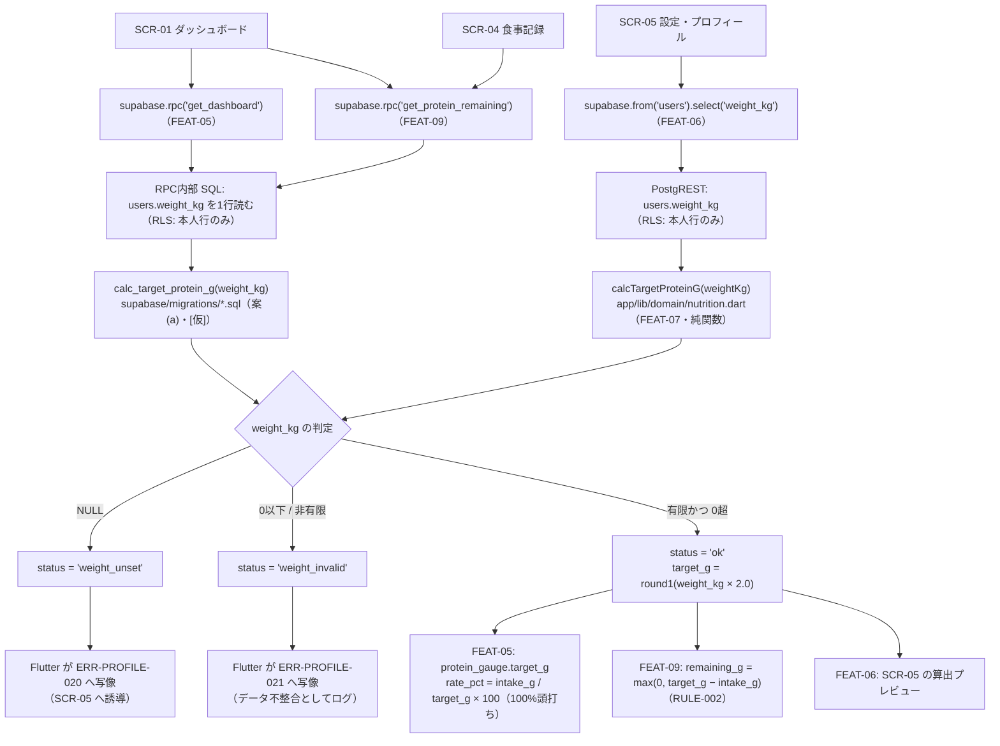

# FEAT-07 必要タンパク質量算出 詳細設計

> **目的**: FEAT-07 を実装が迷わない粒度（入出力・バリデーション・クエリ・エラー・画面挙動・実装単位）まで具体化し、TDDの着手点を固定する。
> **書き方**: 実データは書かない。上位の正本（API契約＝`../../30_データ・IF設計/02_API設計.md` ／ 物理DB＝`../01_DB物理設計.md` ／ シーケンス＝`../../40_機能設計/01_シーケンス設計.md`）と矛盾させず、参照はIDで行う。横断方針（エラー分類・トランザクション・冪等・リトライ）は `../07_実装共通設計パターン.md` を正本とし本書では再定義しない。

> ⚠️ **本書はたたき台（2026-08-02 生成）**。岡田さんのレビューで確定する。

## 目次
1. [概要](#1-概要)
2. [処理フロー](#2-処理フロー)
3. [入出力仕様](#3-入出力仕様)
4. [業務ロジック](#4-業務ロジック)
5. [データアクセス](#5-データアクセス)
6. [エラー処理](#6-エラー処理)
7. [画面挙動・状態別表示](#7-画面挙動状態別表示)
8. [実装単位](#8-実装単位)
9. [テスト観点](#9-テスト観点)
10. [敵対的検証・要確認事項](#10-敵対的検証要確認事項)

## 1. 概要

| 項目 | 内容 |
|---|---|
| 対応要件 | FEAT-07（1日の必要タンパク質量の算出＝体重×2g/日） |
| 対応画面 | SCR-01 ダッシュボード（ゲージの目標値）／ SCR-05 設定・プロフィール（体重入力時の算出プレビュー） |
| 対応API | **専用APIなし**。`users` の PostgREST 取得値（`supabase.from('users').select('weight_kg')`）から算出する。RPC `get_dashboard`（FEAT-05）・RPC `get_protein_remaining`（FEAT-09）が内部で使用 |
| 関連ルール | RULE-001（必要量＝体重×2g）。RULE-002（残量＝必要量−摂取量）の被参照側 |
| 外部連携 | なし（AI不使用・決定的処理） |
| 性能目標 | NFR-PERF-02（決定的処理 ≤1秒）。実体は O(1) の算術。呼び出し側の NFR-PERF-01（画面表示 ≤2秒）に対しほぼ無視できる |
| 状態 | 状態を持たない（ST-01/ST-02 は FEAT-04 の明細に属する） |
| 優先度 | MUST |
| AI利用 | なし |

FEAT-07 は独立したエンドポイントを持たない。実体は RULE-001（必要量 ＝ `users.weight_kg` × 2g）という**算出ロジックそのもの**である。DEC-B06 を根拠に、FEAT-05（`protein_gauge.target_g`）と FEAT-09（`target_g` と残量計算の基準値）から共有される。

本書の中心は次の1点にある。

> **同一の式を1箇所に置き、複数機能から使う。**

| 論点 | 旧構成 | 新構成 |
|---|---|---|
| 式の置き場所 | TypeScript の純関数 1箇所 | **Dart（アプリ）と SQL（RPC）の2箇所に分かれ得る** |
| 集計の実行場所 | サーバ（1言語） | DB 側（SQL）とアプリ側（Dart）に分離 |
| 不一致リスク | 低 | **高**（§4.5 が本書の中心論点） |

Flutter + Supabase 構成では FEAT-05 が RPC `get_dashboard`、FEAT-09 が RPC `get_protein_remaining` になり、集計が SQL 側で行われる。一方で SCR-05 の保存前プレビューは Dart 側で計算したい。**このままだと同じ式が2言語に現れる。旧構成（1箇所）より悪化している。** 対策の3案と推奨は §4.5 に置く。

NFR-QUAL-01（主要ロジックに単体テスト）の直接の対象である。DBにもネットワークにも依存しない純関数のため、TDD の最初の RED はここから書ける。

## 2. 処理フロー

呼び出し関係の flowchart（`../../40_機能設計/01_シーケンス設計.md §3`・`§5` のシーケンスを、算出ロジック側から見た依存関係として詳細化する）。



| 観点 | 内容 |
|---|---|
| 実行位置 | 読み取りの後・戻り値組み立ての前。関数はI/Oを持たないため、トランザクション境界の内外どちらでも結果は同じ |
| `status` の写像 | **Flutter 側（呼び出し画面）の責務**。本書は ERR-ID の予約と写像規則の提示にとどめる（§6） |
| 2経路が並ぶ理由 | 集計は SQL、保存前プレビューは Dart。経路が2本あることが §4.5 の論点そのもの |

## 3. 入出力仕様

本機能はエンドポイントを持たない。契約の実体は**関数シグネチャ**である。外部から観測される形は、RPC 応答中の `target_g` フィールドと SCR-05 のプレビュー値である。

### 3.0 関数契約（本機能の実体）

```dart
// app/lib/domain/nutrition.dart

/// RULE-001 の係数（g / kg / 日）。DEC-B06 により 2.0 固定。
const double PROTEIN_G_PER_KG = 2.0;

/// タンパク質量(g)の内部丸め: 小数第1位・四捨五入。
double roundProteinG(double value);

/// 算出結果。sealed class で「未設定」「不正値」「算出済み」を型で分ける。
sealed class ProteinTarget {
  const ProteinTarget();
}

/// 算出できた。
final class ProteinTargetOk extends ProteinTarget {
  final double targetG;
  final double weightKg;
  final double coefficient;
  const ProteinTargetOk({
    required this.targetG,
    required this.weightKg,
    required this.coefficient,
  });
}

/// 体重が未設定（FEAT-06 未実施）。業務上は正常な状態。
final class ProteinTargetUnset extends ProteinTarget {
  const ProteinTargetUnset();
}

/// 体重が不正値（0以下・非有限）。データ不整合。
final class ProteinTargetInvalid extends ProteinTarget {
  final double weightKg;
  const ProteinTargetInvalid(this.weightKg);
}

/// RULE-001: 1日の必要タンパク質量を算出する。
/// DBにもネットワークにも依存しない純関数。
ProteinTarget calcTargetProteinG(double? weightKg);
```

| 項目 | 内容 |
|---|---|
| 入力 | `weightKg`（単位 **kg**・`double?`）。`users.weight_kg` の値をそのまま渡す |
| 出力 | `ProteinTarget`（sealed class）。`double` や `double?` 単独にはしない |
| 副作用 | なし。同一入力に対し常に同一出力。呼び出し順・時刻に依存しない |
| 単位 | 入力 kg ／ 出力 **g**。Dart 側で kg→g の意味変換が起きる唯一の地点 |

sealed class を返す理由は3点。

| # | 理由 |
|---|---|
| 1 | `null` 単独では「未設定（FEAT-06 未実施＝正常）」と「不正値（データ不整合）」を区別できない。ERR-PROFILE-020 と ERR-PROFILE-021 の出し分けができなくなる |
| 2 | `weightKg` と `coefficient` を同梱すると、SCR-05 の根拠表示（「◯kg × 2g」）を呼び出し側が再計算せずに描ける |
| 3 | 将来 `coefficient` が可変になっても戻り値の形を変えずに拡張できる（§10 #1） |

- sealed class にすると Dart の `switch` が網羅性検査を行う。分岐の書き漏れがコンパイルエラーになるため、判別可能ユニオンと同じ効果が型で得られる。
- `PostgREST` の JSON は数値が `num` で返る。リポジトリ層（`app/lib/data/*_repository.dart`）で `(map['weight_kg'] as num?)?.toDouble()` に正規化してから本関数へ渡す。
- 定数名 `PROTEIN_G_PER_KG` は Dart の lint 規則 `constant_identifier_names`（lowerCamelCase 推奨）に反する `[仮]`。実装時に `proteinGPerKg` へ読み替えるか、lint を局所抑制するかを決める。**式中にリテラル `2` を書かない**という規律のほうが本質であり、名前の表記はどちらでもよい。

### 3.1 バリデーション規則

| 項目 | 規則 | 違反時 |
|---|---|---|
| `weightKg`（型） | `double?` のみ受け付ける。文字列は受け付けない（呼び出し側で数値化済みとする） | Dart の型エラー（実行時チェックはしない） |
| `weightKg`（未設定） | `null` は業務上正常。例外を投げない | `ProteinTargetUnset` → ERR-PROFILE-020 |
| `weightKg`（下限） | `> 0` であること。`0` と負値は不可（`users.weight_kg` の CHECK(>0) と同値） | `ProteinTargetInvalid` → ERR-PROFILE-021 |
| `weightKg`（有限性） | `double.nan` / `double.infinity` / `-double.infinity` は不可。PostgreSQL の `double precision` は `Infinity` を格納でき CHECK(>0) を通過するため、関数側でも必ず判定する | `ProteinTargetInvalid` → ERR-PROFILE-021 |
| `weightKg`（上限） | 上限チェックは**本関数では行わない**。入力上限は FEAT-06（`users` 更新時のバリデーション）の責務 | 本機能では判定しない |

- Dart には `undefined` が無い。列を選択しなかった場合・キーが欠落した場合も `null` として扱う。旧構成の `undefined` 分岐は不要になった。
- `get_dashboard` / `get_protein_remaining` の戻り値契約の正本は `../../30_データ・IF設計/02_API設計.md §4.3`・`§4.4` であり、本書では複製しない。SCR-05 が読む `users` の形は FEAT-06 の詳細設計を正本とする。

## 4. 業務ロジック

### 4.1 算出式（RULE-001）

```text
target_g [g/日] = round1( weight_kg [kg] × PROTEIN_G_PER_KG [g/kg/日] )
PROTEIN_G_PER_KG = 2.0   -- DEC-B06 により固定
round1(x) = (x * 10).round() / 10   -- 小数第1位・四捨五入
```

- 係数 2.0 は**リテラルを埋め込まず、定数 `PROTEIN_G_PER_KG` として外出しする**。式中に `* 2` と書かない（将来の変更点を1箇所に閉じ込めるため。§10 #1）。
- 環境変数化・DB列化は**しない**。要件上は固定値であり、設定値にすると「いつの設定で計算された目標値か」という別問題（§10 #2）を誘発する。

### 4.2 丸め規則

| 対象 | 規則 | 根拠 |
|---|---|---|
| 内部値・RPC 戻り値の `target_g` | 小数第1位で四捨五入（Dart: `(v * 10).round() / 10`） | `float` の丸め残差がそのまま応答に出るのを防ぐ。切り上げ/切り捨ては目標を過大/過小に見せるため使わない |
| SCR-01 ゲージ・SCR-05 の表示値 | **整数 g** に四捨五入（Dart: `v.round()`） | g 単位の小数第1位は読み取り上の意味が薄い。ゲージ・残量の可読性を優先 |
| `rate_pct`（FEAT-05）・`remaining_g`（FEAT-09） | 本機能の責務外。ただし入力に使う `target_g` は丸め**後**の値とする | 丸め前後が混在すると FEAT-05 と FEAT-09 で表示値がずれる |

- 表示と内部で規則を分けるのは意図的である。**表示丸めは UI 層（SCR-01 / SCR-05 のウィジェット）で行い、`nutrition.dart` は内部値の丸めのみを担う。**
- 係数 2.0 は 2 の冪であるため、IEEE 754 倍精度の `weight_kg * 2.0` は丸め誤差を生じない（指数部の +1 のみ）。誤差が入り得るのは `weight_kg` 自体の格納値と、`round1` の 10 倍/除算である。この性質は係数が 2.0 以外になった瞬間に失われる。**`round1` を省略してはならない。**
- Dart の `double.round()` は「絶対値の大きいほうへ丸める（half away from zero）」。PostgreSQL の `round(numeric)` も同じ。負値は §4.3 で弾くため、両者の丸め結果は一致する。

### 4.3 境界値と戻り値

| # | `weight_kg` | 戻り値 | 呼び出し側の扱い |
|---|---|---|---|
| B1 | `null`（FEAT-06 未実施） | `ProteinTargetUnset()` | ERR-PROFILE-020。SCR-05 への誘導。**例外を投げない** |
| B2 | 列未選択・キー欠落 | `ProteinTargetUnset()` | Dart では `null` に正規化されるため B1 と同じ |
| B3 | `0` | `ProteinTargetInvalid(0)` | ERR-PROFILE-021。CHECK(>0) 違反＝データ不整合としてログ |
| B4 | 負値 | `ProteinTargetInvalid(weightKg)` | B3 と同じ |
| B5 | `double.nan` / `±double.infinity` | `ProteinTargetInvalid(weightKg)` | B3 と同じ |
| B6 | 正の最小値近傍（極小） | `ProteinTargetOk(targetG: round1(w * 2), ...)` | 算出する（業務的な下限判定は FEAT-06 の責務） |
| B7 | 通常値 | `ProteinTargetOk(targetG, weightKg, coefficient: 2.0)` | そのまま使用 |

**例外（`throw`）は使わない。** 体重未設定は初回利用時に必ず通る正常な業務状態である。これを例外にすると FEAT-05・FEAT-09 の両RPCが初回ログイン直後に一律で失敗する。純関数を `try/catch` で囲む必要をなくし、単体テストも分岐の網羅だけで済む。

### 4.4 SQL 側の算出（RPC が使う形）

集計 RPC は SQL の中で `target_g` を必要とする。案(a) を採る場合の関数を示す `[仮]`。

```sql
-- RULE-001 の算出をDB側に一本化する（案(a)）。IMMUTABLE・引数のみに依存。
-- 係数 2.0 はこの関数だけが持つ（PostgreSQL に定数宣言が無いため、関数が定数の置き場を兼ねる）。
CREATE FUNCTION calc_target_protein_g(p_weight_kg double precision)
  RETURNS double precision
  LANGUAGE sql
  IMMUTABLE
AS $$
  SELECT CASE
    WHEN p_weight_kg IS NULL THEN NULL
    WHEN p_weight_kg <= 0 OR p_weight_kg = 'Infinity'::double precision THEN NULL
    ELSE round((p_weight_kg * 2.0)::numeric, 1)::double precision
  END;
$$;
```

| 実装上の注意 | 内容 |
|---|---|
| `round(x, 1)` の型 | PostgreSQL の2引数 `round` は `numeric` にしか無い。`double precision` のままでは小数桁を指定できないため `::numeric` へキャストする |
| NULL の伝播 | `calc_target_protein_g(NULL)` は NULL を返す。未設定と不正値の**区別が戻り値だけでは付かない** |
| 区別の付け方 | RPC は `target_g` に加えて `target_status`（`ok` / `weight_unset` / `weight_invalid`）を返す `[仮]`。Flutter はこの列で ERR-PROFILE-020 と ERR-PROFILE-021 を出し分ける |
| `NaN` の扱い | `NaN <= 0` は false、`NaN = 'Infinity'` も false のため上のCASEでは弾けない。`p_weight_kg = p_weight_kg` が false になる性質（`isnan`）で追加判定する `[仮]` |

### 4.5 ★中心論点: Dart と SQL の二重実装

**同じ式が2言語に現れる。** これは旧構成（TypeScript 1箇所）より悪化している。

| 経路 | 式が必要な理由 |
|---|---|
| SQL（RPC `get_dashboard` / `get_protein_remaining`） | 摂取量の集計と同じクエリ内で `target_g`・`rate_pct`・`remaining_g` を組み立てるため |
| Dart（`nutrition.dart`） | SCR-05 で保存前に即時プレビューを出すため（往復を待たせない） |

放置すると、丸め規則・NULL時挙動・不正値判定が少しずつずれる。**利用者から見ると「ゲージの目標値と残量の基準値が違う」という最も分かりにくいバグになる。**

#### 対策3案

| 案 | 内容 | 長所 | 短所 |
|---|---|---|---|
| **(a) 推奨 `[仮]`** | 算出を Postgres 関数 `calc_target_protein_g(weight_kg)` に一本化する。両RPCはこれを呼ぶ。Dart は表示のみ | 式は1箇所。RPC間の不一致が構造的に起きない。係数変更が1マイグレーションで済む | SCR-05 のプレビューが往復に依存する（§10 #9）。SQL は単体テストが書きにくい |
| (b) | Dart 側に一本化し、RPC には `p_target_g` を引数で渡す | 式が Dart 1箇所。`dart test` で完全に検証できる | クライアントが目標値を宣言する形になり、DB側で検算できない。改竄・古い版のアプリが誤った目標値を送れる |
| (c) | 両方に置き、単体テストで一致を担保する | どちらの経路も往復なしで完結する | 式が2つあるという事実は消えない。テストが緩むと即ずれる。**消極案** |

#### 推奨: 案(a) `[仮]`

| 層 | 責務 |
|---|---|
| `calc_target_protein_g`（SQL） | RULE-001 の式・係数・丸め。**正本** |
| RPC `get_dashboard` / `get_protein_remaining` | 上記関数を呼ぶ。**式を書かない** |
| `nutrition.dart` | 戻り値の型付け・状態判定（unset / invalid）・表示丸め。SCR-05 のプレビューは `supabase.rpc('calc_target_protein_g', {'p_weight_kg': ...})` を直接呼ぶ |

- 案(a) を採ると、Dart 側の `calcTargetProteinG` から**係数の乗算が消える**。§3.0 の契約はそのまま残し、内部を RPC 呼び出しの結果の型付けに差し替える。`PROTEIN_G_PER_KG` は表示文言（「体重 ◯kg × 2g」）用の定数として残す。
- 案が確定するまでは §3.0・§4.1 の Dart 契約を有効とする。**式の置き場所が変わっても、関数シグネチャと戻り値の型は変えない。**

> ⚠️ 要確認（人間判断）: 案(a)/(b)/(c) のどれを採るか未決。本書は (a) を `[仮]` で推奨する。(a) は `supabase/migrations/*.sql` に関数を1本追加し、FEAT-05・FEAT-09 の RPC 定義がそれに依存する形になるため、**FEAT-05・FEAT-09 の詳細設計と同時に決める必要がある**。

## 5. データアクセス

FEAT-07 自身は DB にアクセスしない（純関数）。`weight_kg` の取得は**呼び出し側（FEAT-05 / FEAT-06 / FEAT-09）が行う**。本節は、どの呼び出し側でも同一であるべき読み取り形を示す。

```sql
-- 必要タンパク質量の算出元となる体重を1行だけ取得する（RULE-001）。
-- RPC の内部で使う形。RLS により本人行のみが可視。
SELECT weight_kg
FROM   users
WHERE  id = <本人ID>;
```

```dart
// SCR-05（FEAT-06）が使う形。PostgREST 直接。
final row = await supabase
    .from('users')
    .select('weight_kg')
    .single();
```

| 観点 | 内容 |
|---|---|
| 対象テーブル | `users`（SELECT のみ。本機能は INSERT/UPDATE/DELETE を持たない） |
| 使用INDEX | PK（`users.id`）。専用INDEXは不要 |
| RLS | 本人行のみ可視。式の書き方は `../06_DB設計規約.md §4.2` を正本とし、本書では「`user_id = <本人ID>` 相当」の抽象表現にとどめる |
| RPC の実行権限 | `SECURITY INVOKER`（既定）とし、RLS を迂回しない（`../07_実装共通設計パターン.md` の方針） |
| トランザクション境界 | **持たない**。単一行の読み取り。書き込みを伴わないため `../07_実装共通設計パターン.md §2` の適用対象外 |
| 呼び出し回数 | 1画面あたり最大2回（SCR-01 が `get_dashboard` と `get_protein_remaining` を並行に呼ぶ場合）。いずれもPK1行のため許容する |

> ⚠️ 要確認（人間判断）: `users.id`（bigint）と Supabase `auth.uid()`（uuid）の紐付け方式が未確定のため、`<本人ID>` に何を渡すかは確定していない。正本は `../06_DB設計規約.md §4.2`。本書では方式を決めない。

## 6. エラー処理

`ERR-PROFILE-*` は FEAT-06 と共有する接頭辞である。**FEAT-07 は 020〜039 の範囲のみ**を使う（001〜019 は FEAT-06）。

| ERR-ID | 検出層 | 発生条件 | 利用者向けメッセージ（意図） | retryable | ログ |
|---|---|---|---|---|---|
| ERR-PROFILE-020 | Flutter（RPC の `target_status`／`calcTargetProteinG` の戻り値で判定） | 体重が未設定（`users.weight_kg` が NULL＝FEAT-06 未実施） | 体重が未登録であることと、SCR-05 で登録すれば解消することを伝える | false | info（障害ではなく未設定状態の通知。`../05_ログ設計.md` の水準に従う） |
| ERR-PROFILE-021 | 同上 | 体重が不正値（0以下・NaN・±Infinity） | 目標値を計算できなかったことを伝える。数値そのものは出さない | false | error（CHECK(>0) をすり抜けたデータ不整合として `weight_kg` の値を記録） |

- 本機能は ERR-ID を**予約するだけ**である。画面表示へ写像するのは呼び出し側（FEAT-05 / FEAT-06 / FEAT-09）。写像を各機能が独自定義しないよう、ERR-ID の定義は本書に一本化する。
- **RPC は例外を投げない。** `target_g` を NULL にし `target_status` を添えて 200 で返す `[仮]`。理由は §10 #6 のとおりで、目標値だけのために画面全体を失敗にすると NFR-AVAIL-05 の縮退方針と衝突するため。
- したがって旧構成の「409 / 500 への写像」は成立しない。HTTP ステータスではなく `target_status` の値で分岐する。共通エラー応答の形（`error_code` / `message` / `retryable`）は `../../30_データ・IF設計/02_API設計.md §5` を正本とし、本書では再定義しない。
- 認証エラー（ERR-AUTH-001）・バリデーションエラー（ERR-VALIDATION-001）は共通契約に従い、本機能では固有IDを起こさない。
- Supabase 側のエラーログは Edge Function ログではなく Postgres ログに出る（本機能は Edge Function を使わない）。`service` は `okada-fit-db`、Flutter 側は `okada-fit-app`（`../05_ログ設計.md`）。

> ERRの完全列挙の正本は `../../60_テスト設計/02_RED母集合_受入基準・状態・エラー.md`（段6で集約）。本表はその入力とする。

## 7. 画面挙動・状態別表示

| 状態 | 表示 | 操作可否 |
|---|---|---|
| 初期/空 | SCR-01: ゲージ（`CircularProgressIndicator` または `fl_chart`）を目標未設定として淡色表示。`Card` + `Icon`(warning) で「体重を登録すると目標が表示されます」＋SCR-05 への `FilledButton`。SCR-05: 体重入力欄が空、プレビュー欄は `Text`（`Theme.of(context).disabledColor`）で「—」 | SCR-01 のヒートマップ・記録系は通常どおり操作可（NFR-AVAIL-05 の縮退方針に整合） |
| 読込中 | SCR-01: ゲージ領域を `shimmer` の円形プレースホルダで置換。SCR-05: プレビュー欄を高さ 20 のプレースホルダで置換 | 期間切替 `SegmentedButton` は非活性（`onSelectionChanged: null`） |
| 成功 | SCR-01: ゲージ中央に「摂取 ◯g / 目標 ◯g」を整数表示（達成率は100%頭打ち）。SCR-05: 体重入力の直下に「1日の必要量: ◯g（体重 ◯kg × 2g）」を表示 | 通常操作可 |
| エラー | ERR-PROFILE-020: SCR-01 は空状態と同じ `Card` ＋誘導（スナックバーは出さない＝初回利用で毎回鳴らさない）。ERR-PROFILE-021: `ScaffoldMessenger.showSnackBar`（`SnackBar` を赤系で）で再読込を促す | ERR-PROFILE-021 時はゲージ領域のみ非表示。他機能の操作は継続可 |

- SCR-05 のプレビュー再計算タイミングは案の選択で変わる（§4.5）。

| 案 | プレビューの実装 | 体感 |
|---|---|---|
| (a) | `supabase.rpc('calc_target_protein_g')` を呼ぶ。入力確定時（`onEditingComplete` / デバウンス）に1回 | 往復ぶんの遅延が出る。オフラインでは出せない |
| (b)(c) | `calcTargetProteinG` をローカルで呼ぶ。`onChanged` ごとに即時 | 遅延なし。ただし式が2箇所になる |

- SCR-01 の「目安」表記については §10 #4 を参照。

## 8. 実装単位

| # | ファイル | 役割 | 主なシグネチャ |
|---|---|---|---|
| 1 | `app/lib/domain/nutrition.dart` | **本機能の実体**。RULE-001 の純関数・係数定数・丸めヘルパ・戻り値型。**Supabase クライアントを import しない**（純粋ロジックのみ） | `const double PROTEIN_G_PER_KG = 2.0` ／ `ProteinTarget calcTargetProteinG(double? weightKg)` ／ `double roundProteinG(double value)` |
| 2 | `app/test/domain/nutrition_test.dart` | NFR-QUAL-01 の単体テスト。§9 の TC を1対1で実装する。DBもモックも不要 | `group('calcTargetProteinG', () { test(...) })` |
| 3 | `supabase/migrations/<timestamp>_calc_target_protein_g.sql` | 案(a) 採用時の**式の正本**。up/down 対で用意する（`../04_移行設計.md`） | `CREATE FUNCTION calc_target_protein_g(p_weight_kg double precision) RETURNS double precision` |
| 4 | `supabase/migrations/<timestamp>_get_dashboard.sql` | FEAT-05 が正本。`protein_gauge.target_g` の算出で #3 を呼ぶ。**式を再実装しない** | `CREATE FUNCTION get_dashboard(p_period text) RETURNS json` `[仮]` |
| 5 | `supabase/migrations/<timestamp>_get_protein_remaining.sql` | FEAT-09 が正本。`target_g` の算出で #3 を呼ぶ。RULE-002 の残量計算は FEAT-09 の責務 | `CREATE FUNCTION get_protein_remaining(p_target_date date) RETURNS json` `[仮]` |
| 6 | `app/lib/data/profile_repository.dart` | FEAT-06 が正本。`users.weight_kg` の取得と `double?` への正規化 | `Future<double?> fetchWeightKg()` |
| 7 | `app/lib/features/profile/profile_page.dart` | SCR-05。FEAT-06 が正本。プレビュー表示に #1 を使う | `class ProfilePage extends StatefulWidget` |
| 8 | `app/lib/features/dashboard/dashboard_page.dart` | SCR-01。FEAT-05 が正本。RPC の戻り値を表示するだけ。**式を書かない** | `class DashboardPage extends StatefulWidget` |

- #4・#5・#7・#8 に「体重×2」に相当する式が**1つも現れないこと**が、本機能の実装完了条件である（§9 TC-FEAT07-09）。
- `roundProteinG` は FEAT-09 の `remaining_g` 丸めからも再利用してよい（丸め規則の一致を保証するため）。
- 旧構成では同じロジックを `web/src/lib/nutrition.ts` に置いていた。今回それを `app/lib/domain/nutrition.dart` へ移し、算出の正本は案(a)により SQL 側へ移す。

## 9. テスト観点

実行基盤は Dart の `test` パッケージ（`flutter test` から実行）。`nutrition.dart` は Flutter に依存しないため、`flutter_test` ではなく `package:test` だけで書ける。DB・モック・ウィジェットは不要。

| TC-ID | 観点 | 期待 |
|---|---|---|
| TC-FEAT07-01 | 通常の体重（整数kg） | `ProteinTargetOk`・`targetG` が体重の2倍・`coefficient` が 2.0 |
| TC-FEAT07-02 | 小数を含む体重 | `targetG` が小数第1位に四捨五入された値。第2位以下が残らない |
| TC-FEAT07-03 | `weightKg = null` | `ProteinTargetUnset`。**例外を投げない** |
| TC-FEAT07-04 | キー欠落からの `null` 正規化 | リポジトリ層が `null` を渡し、TC-FEAT07-03 と同じ結果になる |
| TC-FEAT07-05 | `weightKg = 0` | `ProteinTargetInvalid` |
| TC-FEAT07-06 | `weightKg` が負値 | `ProteinTargetInvalid` |
| TC-FEAT07-07 | `weightKg` が `double.nan` / `double.infinity` | `ProteinTargetInvalid`（CHECK(>0) を通過し得るため必須） |
| TC-FEAT07-08 | 純粋性 | 同一入力を複数回呼んでも戻り値が等しく、外部状態を変更しない |
| TC-FEAT07-09 | DRY（静的検査） | `app/lib/**`（`nutrition.dart` を除く）と `supabase/migrations/**`（`calc_target_protein_g` の定義を除く）に、係数リテラル `2.0` を用いた `weight` 由来の乗算が存在しない |
| TC-FEAT07-10 | 機能間の一致 | 同一ユーザー・同一時点で `get_dashboard` と `get_protein_remaining` の `target_g` が完全一致する |
| TC-FEAT07-11 | 表示丸め | SCR-01 のゲージ表示が整数 g、SCR-05 のプレビューも整数 g で、内部値の小数第1位が画面に露出しない |
| TC-FEAT07-12 | 単位の取り違え | `weightKg` に g 相当の値（体重の1000倍）を渡した場合も関数は算出する（＝関数では検出できない）ことを明示的に確認し、§10 #3 の指摘を裏付ける |
| TC-FEAT07-13 | **Dart と SQL の一致** | 同一の体重ゴールデン値表（`null` / 0 / 負 / NaN / Infinity / 極小 / 小数 / 通常）に対し、`calcTargetProteinG` と `calc_target_protein_g` の結果が一致する。案(c) では必須、案(a)(b) でも回帰検知として残す |
| TC-FEAT07-14 | 丸めの半端値 | `.05` 刻みの値（例 `x.x5` になるケース）で Dart と SQL の丸め方向が一致する（half away from zero） |

受入基準（G/W/T）の候補:
- [AC] Given `users.weight_kg` が登録済み When SCR-01 を開く Then ゲージの目標値が「体重×2g」を小数第1位で丸め、整数 g として表示される
- [AC] Given `users.weight_kg` が NULL When SCR-01 を開く Then ゲージは目標未設定として表示され、SCR-05 への導線が示され、ヒートマップと記録機能は操作できる
- [AC] Given `users.weight_kg` が登録済み When SCR-05 で体重を変更する（保存前） Then 必要量プレビューが再計算され、保存後に RPC が返す値と一致する
- [AC] Given 同一ユーザー・同一時点 When `get_dashboard` と `get_protein_remaining` を呼ぶ Then 両者の `target_g` が一致する

> 受入基準・ST・ERR の**正本は段6**（`../../60_テスト設計/02_RED母集合_受入基準・状態・エラー.md`・本PR対象外）。本節はその母集合への入力。

## 10. 敵対的検証・要確認事項

| # | 論点 | 内容 | 重大度 |
|---|---|---|---|
| 1 | 係数 2.0 のハードコード | 一般に必要タンパク質量は強度・目的・年齢で 1.2〜2.2 g/kg 程度に変動する。要件では 2.0 固定（DEC-B06）。将来可変化する場合の影響範囲は、係数を1箇所に閉じ込めている限り (a) 定数の可変化、(b) 保持先（`users` への列追加＝スキーマ変更）、(c) 過去データの再計算可否、の3点に限定される。式中にリテラルを散らすと影響範囲が全機能に広がる。**定数化は「変更しやすくするため」ではなく「変更時の探索範囲を有限にするため」に必須** | 🟡 中 |
| 2 | 過去日の目標値 | `users.weight_kg` は現在値のみを保持する。過去日のダッシュボード（週/月）も**現在の体重**で計算される。体重が変わると過去の達成率が遡って変わる。厳密には日次スナップショット（体重の履歴テーブル、または集計時点の目標値の保存）が必要だが、`../01_DB物理設計.md` に該当テーブル・列は無く、本PRでは追加しない。FEAT-06 が指摘する「体重の履歴を持たない」問題と同一根 | 🔴 高 |
| 3 | 単位の一貫性 | `users.weight_kg` は kg、`meal_logs.protein_g` / `foods.protein_amount` / `target_g` は g。両者とも `float`（Dart では `double`）のため、取り違えても型検査は通る。TC-FEAT07-12 のとおり関数側では検出不能。緩和策は (a) 変換地点を `calcTargetProteinG` 1箇所に限定する（本書の設計）、(b) extension type（Dart 3 の `extension type Kg(double v)`）で単位を型にする、の2案。(b) は境界での変換記述が増え、個人保守（NFR-MAINT-01）に見合うか微妙なため採否は人間判断 | 🟡 中 |
| 4 | 「目安」表記の要否 | 医療・栄養指導としての正確性は適用外（NFR-OOS-01）だが、「1日の必要量」と断定表示されると医学的根拠のある値と誤認され得る。SCR-01 / SCR-05 に「目安」等の注記を出すかは UI 文言の判断であり、本設計では確定しない | 🟡 中 |
| 5 | **Dart と SQL の二重実装（DRY違反・新構成で悪化）** | 旧構成では式が TypeScript 1箇所だった。新構成では集計が RPC（SQL）へ移り、SCR-05 のプレビューは Dart に残る。**同じ式が2言語に分かれる。** 丸め規則・NULL時挙動・不正値判定がずれると、SCR-01 上でゲージの目標値と残量の基準値が一致しなくなる（利用者から見て最も分かりにくいバグ）。さらに悪いのは、言語が違うため型検査もコンパイラも一致を検出できない点である。**これを解く設計が本書の中心**（§4.5）。対策は (a) SQL に一本化【推奨・`[仮]`】、(b) Dart に一本化して RPC へ引数で渡す、(c) 両方に置き TC-FEAT07-13/14 で一致を担保、の3案。TC-FEAT07-09（係数リテラルの静的検査）と TC-FEAT07-10（RPC間の値一致）はどの案でも必ず実装する | 🔴 高 |
| 6 | 未設定時の戻り値表現 | `../../30_データ・IF設計/02_API設計.md §4.3`・`§4.4` は `target_g` を `float` と定義しており、体重未設定時に返す値の表現がない。目標値だけのために画面全体を失敗にすると、ヒートマップまで見えなくなり NFR-AVAIL-05 の縮退方針と衝突する。本書は「`target_g` を nullable にし `target_status` を併せて返す」を `[仮]` とした。段3の契約改訂が要る | 🔴 高 |
| 7 | 体重の入力精度 | 本機能の丸めは `weight_kg` が既に妥当な精度で格納されている前提に立つ。入力桁数制限（小数第1位までか等）は FEAT-06 の責務であり本書では規定しない。FEAT-06 側で未規定のまま実装されると `target_g` の丸め結果が不安定になる | 🟢 低 |
| 8 | `nutrition.dart` の純粋性維持 | 純関数のみを置くファイルとして設計したが、後から Supabase クライアント・環境変数・`dart:io` を import すると、単体テストが実行環境に依存し始め、TDD の起点という位置づけが崩れる。またアプリバイナリは TestFlight で配布される成果物であり、秘密値を含む定数を置くと復元可能になる（NFR-SEC-02）。**`app/lib/domain/` にはI/Oを持ち込まない**規律が必要。Supabase アクセスは `app/lib/data/*_repository.dart` に限定する | 🟡 中 |
| 9 | 案(a) のプレビュー往復依存 | 案(a) を採ると SCR-05 の保存前プレビューが `supabase.rpc('calc_target_protein_g')` の往復に依存する。入力のたびに呼ぶと通信が増え、オフラインでは表示できない。緩和策は (i) デバウンスして確定時に1回だけ呼ぶ、(ii) プレビューだけは Dart のローカル計算を許し「表示専用の近似」と位置づける（実質 案(c)）、の2案。(ii) を選ぶと案(a) の「式は1箇所」という利点が部分的に失われる。**案(a) を採る際に併せて決める必要がある** | 🟡 中 |

> ⚠️ 要確認（人間判断）: 本書は Flutter + Supabase 構成（Vercel 不使用）で記述している。一方 ADR-0001（Vercel AI Gateway 採用）・ADR-0002（Next.js + Mantine 採用）・`30_データ・IF設計/02_API設計.md`（`/api/*` の Route Handler 契約）は Vercel 前提のまま。後継ADRの起票と段3の改訂が必要。

> ⚠️ 要確認（人間判断）: 段3との具体的な乖離。旧契約の `GET /api/dashboard` は RPC `get_dashboard`、`GET /api/protein/remaining` は RPC `get_protein_remaining`、`GET /api/profile` は `users` の PostgREST 取得に置き換わる。FEAT-07 は HTTP ステータスによるエラー写像（409/500）を持たなくなるため、段3の契約表とエラー節の改訂が要る。

> ⚠️ 要確認（人間判断）: #5 算出式の置き場所。案(a) SQL 一本化【推奨・`[仮]`】／(b) Dart 一本化／(c) 両方＋一致テスト のどれを採るか。FEAT-05・FEAT-09 の RPC 定義に直結するため、3機能まとめて決める。

> ⚠️ 要確認（人間判断）: #2 過去日の目標値。日次スナップショット（体重履歴テーブル、または集計時点の目標値保存）を持つか、「過去分も現在の体重で再計算される」仕様を許容するか。前者はDBスキーマ追加を伴うため本PRでは判断しない。

> ⚠️ 要確認（人間判断）: #6 体重未設定時の応答形。`target_g` を nullable にし `target_status` を併せて返す案でよいか。段3の契約改訂要否に直結する。

> ⚠️ 要確認（人間判断）: #4 SCR-01 / SCR-05 で必要量を「目安」と注記するか。NFR-OOS-01 により医療的正確性は適用外だが、表示文言としての扱いは人間が決める。

> ⚠️ 要確認（人間判断）: `users.id`（bigint）と Supabase `auth.uid()`（uuid）の紐付け方式が未確定（§5）。正本は `../06_DB設計規約.md §4.2`。

> 関連: API契約＝`../../30_データ・IF設計/02_API設計.md` / 物理DB＝`../01_DB物理設計.md` / 横断方針＝`../07_実装共通設計パターン.md` / シーケンス＝`../../40_機能設計/01_シーケンス設計.md`。
