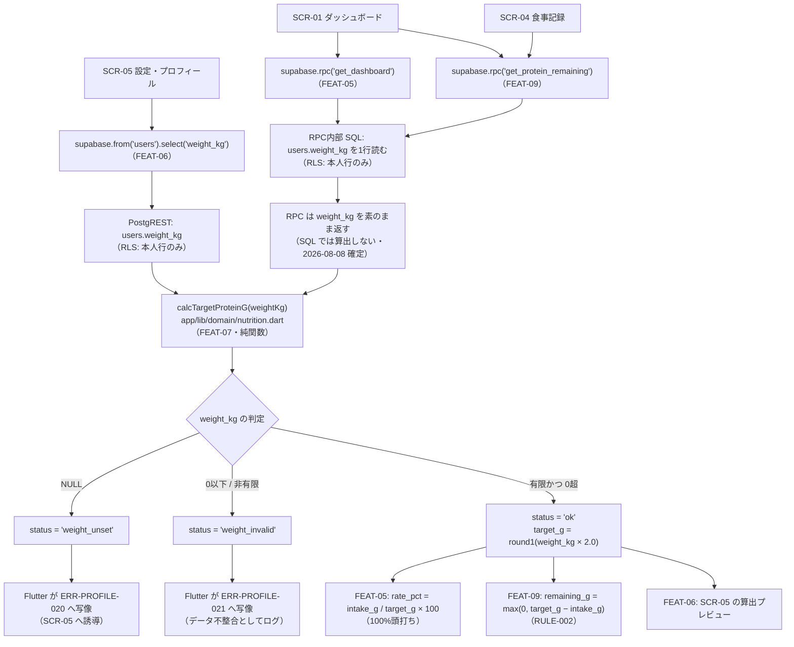

# FEAT-07 必要タンパク質量算出 詳細設計

> **目的**: FEAT-07 を実装が迷わない粒度（入出力・バリデーション・クエリ・エラー・画面挙動・実装単位）まで具体化し、TDDの着手点を固定する。
> **書き方**: 実データは書かない。上位の正本（API契約＝`../../30_データ・IF設計/02_API設計.md` ／ 物理DB＝`../01_DB物理設計.md` ／ シーケンス＝`../../40_機能設計/01_シーケンス設計.md`）と矛盾させず、参照はIDで行う。横断方針（エラー分類・トランザクション・冪等・リトライ）は `../07_実装共通設計パターン.md` を正本とし本書では再定義しない。

> ⚠️ **本書はたたき台（2026-08-02 生成）**。岡田さんのレビューで確定する。

> 📖 ID（`FEAT-` `NFR-` `RULE-` 等）の意味は [ID早見表](../../00_ID早見表.md) を参照。

## 目次
1. [概要](#1-概要)
2. [処理フロー](#2-処理フロー)
3. [入出力仕様](#3-入出力仕様)
4. [業務ロジック](#4-業務ロジック)
5. [データアクセス](#5-データアクセス)
6. [エラー処理](#6-エラー処理)
7. [画面挙動・状態別表示](#7-画面挙動状態別表示)
8. [実装単位](#8-実装単位)
9. [テスト観点](#9-テスト観点)
10. [敵対的検証・要確認事項](#10-敵対的検証要確認事項)

## 1. 概要

| 項目 | 内容 |
|---|---|
| 対応要件 | FEAT-07（1日の必要タンパク質量の算出＝体重×2g/日） |
| 対応画面 | SCR-01 ダッシュボード（ゲージの目標値）／ SCR-05 設定・プロフィール（体重入力時の算出プレビュー） |
| 対応API | **専用APIなし**。`users` の PostgREST 取得値（`supabase.from('users').select('weight_kg')`）から算出する。RPC `get_dashboard`（FEAT-05）・RPC `get_protein_remaining`（FEAT-09）が返す `weight_kg` にも本関数を適用する |
| 関連ルール | RULE-001（必要量＝体重×2g）。RULE-002（残量＝必要量−摂取量）の被参照側 |
| 外部連携 | なし（AI不使用・決定的処理） |
| 性能目標 | NFR-PERF-02（決定的処理 ≤1秒）。実体は O(1) の算術。呼び出し側の NFR-PERF-01（画面表示 ≤2秒）に対しほぼ無視できる |
| 状態 | 状態を持たない（ST-01/ST-02 は FEAT-04 の明細に属する） |
| 優先度 | MUST |
| AI利用 | なし |

**本書の主題は1つ。**

> **同一の式を1箇所に置き、複数機能から使う。**

FEAT-07 は独立したエンドポイントを持たない。実体は**算出ロジックそのもの**である。

| 項目 | 内容 |
|---|---|
| 式 | RULE-001。必要量 ＝ `users.weight_kg` × 2g |
| 根拠 | DEC-B06 |
| 共有先 | FEAT-05（`protein_gauge.weight_kg` から Dart が算出） |
| 共有先 | FEAT-09（`weight_kg` から目標値と残量を Dart が算出） |

### 式の置き場所が2つに割れる

| 論点 | 旧構成 | 新構成（2026-08-08 確定） |
|---|---|---|
| 式の置き場所 | TypeScript の純関数 1箇所 | **Dart の純関数 1箇所**（`nutrition.dart`） |
| 集計の実行場所 | サーバ（1言語） | 集計は SQL、**算出は Dart** |
| 不一致リスク | 低 | 低（式が1か所のため） |

一度は「集計が SQL 側へ移るなら式も SQL へ移る」と考えた。採らない。

| 呼び出し元 | 計算場所 | 理由 |
|---|---|---|
| FEAT-05 の RPC `get_dashboard` | Dart | RPC は `weight_kg`・`intake_g` を素のまま返す |
| FEAT-09 の RPC `get_protein_remaining` | Dart | RPC は `weight_kg`・`intake_g`・候補行を素のまま返す |
| SCR-05 の保存前プレビュー | Dart | 往復を待たせない |

**式は Dart の1箇所に置く。SQL には書かない。**
3案の比較と採否は §4.5 に置く。

### TDD の起点

NFR-QUAL-01（主要ロジックに単体テスト）の直接の対象である。
DBにもネットワークにも依存しない純関数のため、TDD の最初の RED はここから書ける。

## 2. 処理フロー

呼び出し関係の flowchart。
`../../40_機能設計/01_シーケンス設計.md §3`・`§5` のシーケンスを、算出ロジック側から見た依存関係として詳細化する。



| 観点 | 内容 |
|---|---|
| 実行位置 | 読み取りの後・表示の前。関数はI/Oを持たないため、通信の有無に結果が左右されない |
| `status` の写像 | **Flutter 側（呼び出し画面）の責務**。本書は ERR-ID の予約と写像規則の提示にとどめる（§6） |
| 経路が2本ある理由 | 読み取りが RPC と PostgREST に分かれるため。**算出は合流して Dart の1本になる**（§4.5 で確定） |

## 3. 入出力仕様

本機能はエンドポイントを持たない。契約の実体は**関数シグネチャ**である。

外部から観測される形は2つ。SCR-01（ダッシュボード）のゲージが示す目標値と、SCR-05（設定・プロフィール）のプレビュー値。
どちらも RPC の戻り値ではない。Dart が `weight_kg` から算出した値である。

### 3.0 関数契約（本機能の実体）

| 項目 | 内容 |
|---|---|
| 入力 | `weightKg`（単位 **kg**・`double?`）。`users.weight_kg` の値をそのまま渡す |
| 出力 | `ProteinTarget`（sealed class）。`double` や `double?` 単独にはしない |
| 副作用 | なし。同一入力に対し常に同一出力 |
| 決定性 | 呼び出し順・時刻に依存しない |
| 単位 | 入力 kg ／ 出力 **g** |
| 変換地点 | Dart 側で kg→g の意味変換が起きる唯一の地点 |

```dart
// app/lib/domain/nutrition.dart

/// RULE-001 の係数（g / kg / 日）。DEC-B06 により 2.0 固定。
const double PROTEIN_G_PER_KG = 2.0;

/// タンパク質量(g)の内部丸め: 小数第1位・四捨五入。
double roundProteinG(double value);

/// 算出結果。sealed class で「未設定」「不正値」「算出済み」を型で分ける。
sealed class ProteinTarget {
  const ProteinTarget();
}

/// 算出できた。
final class ProteinTargetOk extends ProteinTarget {
  final double targetG;
  final double weightKg;
  final double coefficient;
  const ProteinTargetOk({
    required this.targetG,
    required this.weightKg,
    required this.coefficient,
  });
}

/// 体重が未設定（FEAT-06 未実施）。業務上は正常な状態。
final class ProteinTargetUnset extends ProteinTarget {
  const ProteinTargetUnset();
}

/// 体重が不正値（0以下・非有限）。データ不整合。
final class ProteinTargetInvalid extends ProteinTarget {
  final double weightKg;
  const ProteinTargetInvalid(this.weightKg);
}

/// RULE-001: 1日の必要タンパク質量を算出する。
/// DBにもネットワークにも依存しない純関数。
ProteinTarget calcTargetProteinG(double? weightKg);
```

戻り値を sealed class にする理由は3点。

| # | 理由 |
|---|---|
| 1 | `null` 単独では「未設定（FEAT-06 未実施＝正常）」と「不正値（データ不整合）」を区別できない |
| 1 | 区別できないと ERR-PROFILE-020 と ERR-PROFILE-021 の出し分けができない |
| 2 | `weightKg` と `coefficient` を同梱すると、SCR-05 の根拠表示（「◯kg × 2g」）を再計算せずに描ける |
| 3 | 将来 `coefficient` が可変になっても戻り値の形を変えずに拡張できる（§10 #1） |

実装上の注意。

| 項目 | 内容 |
|---|---|
| 網羅性検査 | sealed class にすると Dart の `switch` が網羅性を検査する |
| 網羅性検査 | 分岐の書き漏れがコンパイルエラーになる。判別可能ユニオンと同じ効果が型で得られる |
| 数値の正規化 | PostgREST の JSON は数値が `num` で返る |
| 数値の正規化 | リポジトリ層（`app/lib/data/*_repository.dart`）で `(map['weight_kg'] as num?)?.toDouble()` にしてから渡す |
| 定数名 `[仮]` | `PROTEIN_G_PER_KG` は lint 規則 `constant_identifier_names`（lowerCamelCase 推奨）に反する |
| 定数名 `[仮]` | `proteinGPerKg` へ読み替えるか lint を局所抑制するかを実装時に決める |
| 本質 | **式中にリテラル `2` を書かない**という規律が本質。名前の表記はどちらでもよい |

### 3.1 バリデーション規則

| 項目 | 規則 | 違反時 |
|---|---|---|
| `weightKg`（型） | `double?` のみ受け付ける。文字列は受け付けない（呼び出し側で数値化済みとする） | Dart の型エラー（実行時チェックはしない） |
| `weightKg`（未設定） | `null` は業務上正常。例外を投げない | `ProteinTargetUnset` → ERR-PROFILE-020 |
| `weightKg`（下限） | `> 0` であること。`0` と負値は不可（`users.weight_kg` の CHECK(>0) と同値） | `ProteinTargetInvalid` → ERR-PROFILE-021 |
| `weightKg`（有限性） | `double.nan` / `double.infinity` / `-double.infinity` は不可 | `ProteinTargetInvalid` → ERR-PROFILE-021 |
| `weightKg`（有限性の根拠） | PostgreSQL の `double precision` は `Infinity` を格納でき CHECK(>0) を通過する。関数側でも必ず判定する | 同上 |
| `weightKg`（上限） | 上限チェックは**本関数では行わない**。入力上限は FEAT-06（`users` 更新時のバリデーション）の責務 | 本機能では判定しない |

- Dart には `undefined` が無い。列を選択しなかった場合・キーが欠落した場合も `null` として扱う。
- 旧構成の `undefined` 分岐は不要になった。

正本の所在。

| 対象 | 正本 |
|---|---|
| `get_dashboard` / `get_protein_remaining` の戻り値契約 | `../../30_データ・IF設計/02_API設計.md §4.3`・`§4.4` |
| SCR-05 が読む `users` の形 | FEAT-06 の詳細設計 |

いずれも本書では複製しない。

## 4. 業務ロジック

### 4.1 算出式（RULE-001）

```text
target_g [g/日] = round1( weight_kg [kg] × PROTEIN_G_PER_KG [g/kg/日] )
PROTEIN_G_PER_KG = 2.0   -- DEC-B06 により固定
round1(x) = (x * 10).round() / 10   -- 小数第1位・四捨五入
```

| 規律 | 内容 |
|---|---|
| 係数の外出し | **リテラルを埋め込まず、定数 `PROTEIN_G_PER_KG` として外出しする** |
| 係数の外出し | 式中に `* 2` と書かない。将来の変更点を1箇所に閉じ込めるため（§10 #1） |
| 環境変数化・DB列化 | **しない**。要件上は固定値である |
| 環境変数化・DB列化 | 設定値にすると「いつの設定で計算された目標値か」という別問題（§10 #2）を誘発する |

### 4.2 丸め規則

| 対象 | 規則 | 根拠 |
|---|---|---|
| 内部値・画面に渡す `target_g` | 小数第1位で四捨五入（Dart: `(v * 10).round() / 10`） | `float` の丸め残差がそのまま画面に出るのを防ぐ。切り上げ/切り捨ては目標を過大/過小に見せるため使わない |
| SCR-01 ゲージ・SCR-05 の表示値 | **整数 g** に四捨五入（Dart: `v.round()`） | g 単位の小数第1位は読み取り上の意味が薄い。ゲージ・残量の可読性を優先 |
| `rate_pct`（FEAT-05）・`remaining_g`（FEAT-09） | 本機能の責務外。ただし入力に使う `target_g` は丸め**後**の値とする | 丸め前後が混在すると FEAT-05 と FEAT-09 で表示値がずれる |

表示と内部で規則を分けるのは意図的である。

| 論点 | 内容 |
|---|---|
| 層の分担 | **表示丸めは UI 層（SCR-01 / SCR-05 のウィジェット）で行う** |
| 層の分担 | **`nutrition.dart` は内部値の丸めのみを担う** |
| 誤差の所在 | 係数 2.0 は 2 の冪。IEEE 754 倍精度の `weight_kg * 2.0` は丸め誤差を生じない（指数部の +1 のみ） |
| 誤差の所在 | 誤差が入り得るのは `weight_kg` 自体の格納値と、`round1` の 10 倍/除算 |
| 前提の脆さ | この性質は係数が 2.0 以外になった瞬間に失われる。**`round1` を省略してはならない** |
| 丸め方向 | Dart の `double.round()` は「絶対値の大きいほうへ丸める（half away from zero）」 |
| 丸めの置き場所 | **Dart だけが丸める。** SQL 側に丸め規則を置かないため、言語間の丸め差そのものが起きない |

### 4.3 境界値と戻り値

| # | `weight_kg` | 戻り値 | 呼び出し側の扱い |
|---|---|---|---|
| B1 | `null`（FEAT-06 未実施） | `ProteinTargetUnset()` | ERR-PROFILE-020。SCR-05 への誘導。**例外を投げない**（返し方は下表） |
| B2 | 列未選択・キー欠落 | `ProteinTargetUnset()` | Dart では `null` に正規化されるため B1 と同じ |
| B3 | `0` | `ProteinTargetInvalid(0)` | ERR-PROFILE-021。CHECK(>0) 違反＝データ不整合としてログ |
| B4 | 負値 | `ProteinTargetInvalid(weightKg)` | B3 と同じ |
| B5 | `double.nan` / `±double.infinity` | `ProteinTargetInvalid(weightKg)` | B3 と同じ |
| B6 | 正の最小値近傍（極小） | `ProteinTargetOk(targetG: round1(w * 2), ...)` | 算出する（業務的な下限判定は FEAT-06 の責務） |
| B7 | 通常値 | `ProteinTargetOk(targetG, weightKg, coefficient: 2.0)` | そのまま使用 |

体重未設定（B1・B2）のときの返し方は**確定済み**（2026-08-08）。

| 項目 | 内容 |
|---|---|
| HTTP | **200**。エラーにしない |
| `get_dashboard` | `protein_gauge` を階層ごと `null` にする。**正本は FEAT-05 §3** |
| 画面 | ゲージの位置に「体重を登録すると目標が表示されます」＋ SCR-05 への導線 |
| 他の表示 | ヒートマップ・トレーニング回数・記録機能は通常どおり動く |
| `get_protein_remaining` | FEAT-09 が正本。`weight_kg` を `null` のまま 200 で返す（2026-08-08 確定） |

**例外（`throw`）は使わない。**

| 理由 | 内容 |
|---|---|
| 未設定は正常 | 体重未設定は初回利用時に必ず通る正常な業務状態である |
| 影響範囲 | 例外にすると FEAT-05・FEAT-09 の両RPCが初回ログイン直後に一律で失敗する |
| 呼び出し側 | 純関数を `try/catch` で囲む必要がなくなる |
| テスト | 単体テストが分岐の網羅だけで済む |

### 4.4 SQL 側の算出（RPC が使う形）

**SQL 側では算出しない。** RULE-001（必要タンパク質量 ＝ 体重 × 2g）を SQL に書く形は採らない（2026-08-08 確定・§4.5）。

| 事項 | 内容 |
|---|---|
| SQL 関数 `calc_target_protein_g` | **作らない。** マイグレーションを1本も追加しない |
| RPC が返す形 | `get_dashboard` は `weight_kg`・`intake_g`、`get_protein_remaining` は `weight_kg`・`intake_g`・候補行 |
| RPC が返さない値 | `target_g`・`remaining_g`・`rate_pct`。いずれも計算済みの値のため |
| 係数 2.0 の置き場所 | `nutrition.dart` の `PROTEIN_G_PER_KG` だけ。SQL には現れない |
| 丸めの置き場所 | Dart の `roundProteinG` だけ。`round(x::numeric, 1)` を RPC に書かない |
| 未設定の返し方 | `get_dashboard` は `protein_gauge` を null にして 200 を返す（確定・FEAT-05 §3） |
| 未設定・不正値の判定 | Dart 側（`calcTargetProteinG`）が行う。DB の CHECK(>0) は保険として残す |

撤回した案の記録。SQL 関数を置くと次の面倒が付いてくる。いずれも今回は発生しない。

| 撤回した論点 | 内容 |
|---|---|
| `round(x, 1)` の型 | PostgreSQL の2引数 `round` は `numeric` にしか無く `::numeric` のキャストが要った |
| NULL の伝播 | SQL 関数は NULL を返すだけで、未設定と不正値を戻り値で区別できなかった |
| `NaN` の扱い | `NaN <= 0` も `NaN = 'Infinity'` も false のため、CASE では弾けず追加判定が要った |

### 4.5 ★中心論点: Dart と SQL の二重実装

**採否は確定した（2026-08-08）。案(b) の Dart 一本化を採る。**
RPC は素の値だけを返す。目標値・残量・達成率は Dart が計算する。

論点そのものは次のとおりだった。同じ式が2言語に現れ、旧構成（TypeScript 1箇所）より悪化していた。

| 経路 | 式が必要とされた理由 |
|---|---|
| SQL（RPC `get_dashboard` / `get_protein_remaining`） | 摂取量の集計と同じクエリ内で `target_g`・`rate_pct`・`remaining_g` を組み立てるため |
| Dart（`nutrition.dart`） | SCR-05 で保存前に即時プレビューを出すため（往復を待たせない） |

放置すると、丸め規則・NULL時挙動・不正値判定が少しずつずれる。
**利用者から見ると「ゲージの目標値と残量の基準値が違う」という最も分かりにくいバグになる。**

#### 対策3案

比較表は判断の記録として残す。採否は「案」列に記す。

| 案 | 内容 | 長所 | 短所 |
|---|---|---|---|
| (a) 不採用 | 算出を Postgres 関数に一本化する。両RPCはこれを呼ぶ。Dart は表示のみ | 式は1箇所。RPC間の不一致が構造的に起きない | SCR-05 のプレビューが往復に依存する。SQL は単体テストが書きにくい |
| **(b) 採用（確定）** | Dart 側に一本化する。**RPC は `weight_kg`・`intake_g` を素のまま返す** | 式が Dart 1箇所。`dart test` で完全に検証できる。プレビューが通信なしで出る | 目標値・残量が端末側の値になり、DB側で検算できない |
| (c) 不採用 | 両方に置き、単体テストで一致を担保する | どちらの経路も往復なしで完結する | 式が2つあるという事実は消えない。テストが緩むと即ずれる。**消極案** |

- 当初は案(a) を `[仮]` で推奨していた。**撤回する。**
- 案(b) の短所は受容する。利用者は1人で、目標値を偽る動機が無い。

#### 採用: 案(b) Dart 一本化（確定）

| 層 | 責務 |
|---|---|
| `nutrition.dart`（Dart） | RULE-001 の式・係数・丸め・状態判定（unset / invalid）。**正本** |
| RPC `get_dashboard` / `get_protein_remaining` | 素の値を返すだけ。**式を書かない。丸めもしない** |
| SCR-01 / SCR-05 のウィジェット | Dart の算出結果を表示する。表示丸めのみ担う（§4.2） |

得られるメリットは2つ。

| メリット | 内容 |
|---|---|
| 式が1か所 | SQL と Dart の二重実装が消える。丸めの違いで画面ごとに数字がずれない |
| 入力中のプレビュー | SCR-05 で体重を変えると**通信せずに**目標値が即座に出る |

- §3.0・§4.1 の Dart 契約はそのまま有効である。関数シグネチャも戻り値の型も変えない。
- `calcTargetProteinG` は係数の乗算を持ち続ける。RPC 呼び出しには置き換えない。
- マイグレーションの追加は**無い**（§8）。

## 5. データアクセス

FEAT-07 自身は DB にアクセスしない（純関数）。
`weight_kg` の取得は**呼び出し側（FEAT-05（ダッシュボード）/ FEAT-06（初期設定）/ FEAT-09（タンパク質残量と不足分提示））が行う**。
本節は、どの呼び出し側でも同一であるべき読み取り形を示す。

```sql
-- 必要タンパク質量の算出元となる体重を1行だけ取得する（RULE-001）。
-- RPC の内部で使う形。RLS により本人行のみが可視。
SELECT weight_kg
FROM   users
WHERE  id = auth.uid();   -- users.id は auth.users.id と同値の uuid（案A・ADR-0005）
```

```dart
// SCR-05（FEAT-06）が使う形。PostgREST 直接。
final row = await supabase
    .from('users')
    .select('weight_kg')
    .single();
```

| 観点 | 内容 |
|---|---|
| 対象テーブル | `users`（SELECT のみ。本機能は INSERT/UPDATE/DELETE を持たない） |
| 使用INDEX | PK（`users.id`）。専用INDEXは不要 |
| 本人ID | `auth.uid()`（uuid）。`users.id` は `auth.users.id` と同値のため変換も中間列も要らない（案A・ADR-0005） |
| RLS | 本人行のみ可視。`users` の述語は `id = auth.uid()`、履歴側は `user_id = auth.uid()`。正本は `../01_DB物理設計.md §3`・`../06_DB設計規約.md §4.2` |
| RPC の実行権限 | `SECURITY INVOKER`（既定）とし、RLS を迂回しない（`../07_実装共通設計パターン.md` の方針） |
| トランザクション境界 | **持たない**。単一行の読み取り。書き込みを伴わないため `../07_実装共通設計パターン.md §2` の適用対象外 |
| 呼び出し回数 | 1画面あたり最大2回（SCR-01 が `get_dashboard` と `get_protein_remaining` を並行に呼ぶ場合）。いずれもPK1行のため許容する |

## 6. エラー処理

`ERR-PROFILE-*` は FEAT-06 と共有する接頭辞である。**FEAT-07 は 020〜039 の範囲のみ**を使う（001〜019 は FEAT-06）。

| ERR-ID | 検出層 | 発生条件 | 利用者向けメッセージ（意図） | retryable | ログ |
|---|---|---|---|---|---|
| ERR-PROFILE-020 | Flutter（`protein_gauge` が null か、`calcTargetProteinG` の戻り値で判定） | 体重が未設定（`users.weight_kg` が NULL＝FEAT-06 未実施） | 体重が未登録であることと、SCR-05 で登録すれば解消することを伝える | false | info（障害ではなく未設定状態の通知。`../05_ログ設計.md` の水準に従う） |
| ERR-PROFILE-021 | 同上 | 体重が不正値（0以下・NaN・±Infinity） | 目標値を計算できなかったことを伝える。数値そのものは出さない | false | error（CHECK(>0) をすり抜けたデータ不整合として `weight_kg` の値を記録） |

- 本機能は ERR-ID を**予約するだけ**である。
- 画面表示へ写像するのは呼び出し側（FEAT-05 / FEAT-06 / FEAT-09）。
- 写像を各機能が独自定義しないよう、ERR-ID の定義は本書に一本化する。
- 認証エラー（ERR-AUTH-001）・バリデーションエラー（ERR-VALIDATION-001）は共通契約に従う。本機能では固有IDを起こさない。

**RPC は例外を投げない。**

| 項目 | 内容 |
|---|---|
| 返し方（確定） | 200 で返す。`get_dashboard` は `protein_gauge` を階層ごと `null` にする |
| 正本 | FEAT-05 §3。本書では再定義しない（2026-08-08 確定・§10 #6） |
| 理由 | 目標値だけのために画面全体を失敗にすると NFR-AVAIL-05 の縮退方針と衝突する |
| 旧構成との差 | 「409 / 500 への写像」は成立しない。`protein_gauge` が null か否かで分岐する |
| 共通エラー応答の形 | `error_code` / `message` / `retryable`。正本は `../../30_データ・IF設計/02_API設計.md §5` |

ログの出先。

| 出力元 | 出先 | `service` |
|---|---|---|
| Supabase 側 | Postgres ログ（本機能は Edge Function を使わない） | `okada-fit-db` |
| Flutter 側 | アプリログ | `okada-fit-app` |

水準の正本は `../05_ログ設計.md`。

> ERRの完全列挙の正本は `../../60_テスト設計/02_RED母集合_受入基準・状態・エラー.md`（段6で集約）。本表はその入力とする。

## 7. 画面挙動・状態別表示

画面ごとに表示を分けて示す。

| 状態 | SCR-01 ダッシュボード | SCR-05 設定・プロフィール |
|---|---|---|
| 初期/空 | ゲージは描かない。位置を体重登録の案内に差し替える（表示の正本は FEAT-05 §7） | 体重入力欄が空 |
| 初期/空 | `Card` + `Icon`(warning) で「体重を登録すると目標が表示されます」＋SCR-05 への `FilledButton` | プレビュー欄は `Text`（`Theme.of(context).disabledColor`）で「—」 |
| 読込中 | ゲージ領域を `shimmer` の円形プレースホルダで置換 | プレビュー欄を高さ 20 のプレースホルダで置換 |
| 成功 | ゲージ中央に「摂取 ◯g / 目標 ◯g」を整数表示（達成率は100%頭打ち） | 体重入力の直下に「1日の必要量: ◯g（体重 ◯kg × 2g）」を表示 |
| ERR-PROFILE-020 | 空状態と同じ `Card` ＋誘導。スナックバーは出さない（初回利用で毎回鳴らさないため） | 初期/空と同じ |
| ERR-PROFILE-021 | `ScaffoldMessenger.showSnackBar`（`SnackBar` を赤系で）で再読込を促す | 同上 |

操作可否。

| 状態 | 操作可否 |
|---|---|
| 初期/空 | SCR-01 のヒートマップ・記録系は通常どおり操作可（NFR-AVAIL-05 の縮退方針に整合） |
| 読込中 | 期間切替 `SegmentedButton` は非活性（`onSelectionChanged: null`） |
| 成功 | 通常操作可 |
| ERR-PROFILE-020 | 初期/空と同じ |
| ERR-PROFILE-021 | ゲージ領域のみ非表示。他機能の操作は継続可 |

- SCR-05（設定・プロフィール）のプレビューは**案(b) 確定により通信を伴わない**（§4.5）。

| 項目 | 内容 |
|---|---|
| 実装 | `calcTargetProteinG` をローカルで呼ぶ。`onChanged` ごとに即時 |
| 体感 | 遅延なし。オフラインでも出る。デバウンスも不要 |
| 保存後の値 | 同じ関数が RPC の `weight_kg` にも適用されるため、保存前後で値が一致する |

- SCR-01 の「目安」表記については §10 #4 を参照。

## 8. 実装単位

| # | ファイル | 役割 | 主なシグネチャ |
|---|---|---|---|
| 1 | `app/lib/domain/nutrition.dart` | **本機能の実体**。RULE-001 の純関数・係数定数・丸めヘルパ・戻り値型。**Supabase クライアントを import しない**（純粋ロジックのみ） | `const double PROTEIN_G_PER_KG = 2.0` ／ `ProteinTarget calcTargetProteinG(double? weightKg)` ／ `double roundProteinG(double value)` |
| 2 | `app/test/domain/nutrition_test.dart` | NFR-QUAL-01 の単体テスト。§9 の TC を1対1で実装する。DBもモックも不要 | `group('calcTargetProteinG', () { test(...) })` |
| 3 | `app/lib/data/profile_repository.dart` | FEAT-06 が正本。`users.weight_kg` の取得と `double?` への正規化 | `Future<double?> fetchWeightKg()` |
| 4 | `app/lib/features/profile/profile_page.dart` | SCR-05。FEAT-06 が正本。プレビュー表示に #1 を使う | `class ProfilePage extends StatefulWidget` |
| 5 | `app/lib/features/dashboard/dashboard_page.dart` | SCR-01。FEAT-05 が正本。#1 の算出結果を表示する。**式を書かない** | `class DashboardPage extends StatefulWidget` |

**本機能が新規に作るのは #1 と #2 だけである。**

| 事項 | 内容 |
|---|---|
| マイグレーション | **追加しない。** `calc_target_protein_g` は作らない（§4.5） |
| RPC 定義 | 本機能では触らない。`get_dashboard` は FEAT-05、`get_protein_remaining` は FEAT-09 が正本 |
| RPC への要求 | 「体重×2」に相当する式を**書かないこと**。素の `weight_kg` を返すこと |

- #3〜#5 と `supabase/migrations/**` に「体重×2」に相当する式が**1つも現れないこと**が実装完了条件である（§9 TC-FEAT07-09）。
- `roundProteinG` は FEAT-09 の残量丸めからも再利用する（丸め規則の一致を保証するため）。
- 旧構成では同じロジックを1ファイルの TypeScript に置いていた。
- 今回それを `app/lib/domain/nutrition.dart` へ移す。**算出の正本は Dart 側1箇所のままである。**

## 9. テスト観点

実行基盤は Dart の `test` パッケージ（`flutter test` から実行）。
`nutrition.dart` は Flutter に依存しないため、`flutter_test` ではなく `package:test` だけで書ける。
DB・モック・ウィジェットは不要。

| TC-ID | 観点 | 期待 |
|---|---|---|
| TC-FEAT07-01 | 通常の体重（整数kg） | `ProteinTargetOk`・`targetG` が体重の2倍・`coefficient` が 2.0 |
| TC-FEAT07-02 | 小数を含む体重 | `targetG` が小数第1位に四捨五入された値。第2位以下が残らない |
| TC-FEAT07-03 | `weightKg = null` | `ProteinTargetUnset`。**例外を投げない** |
| TC-FEAT07-04 | キー欠落からの `null` 正規化 | リポジトリ層が `null` を渡し、TC-FEAT07-03 と同じ結果になる |
| TC-FEAT07-05 | `weightKg = 0` | `ProteinTargetInvalid` |
| TC-FEAT07-06 | `weightKg` が負値 | `ProteinTargetInvalid` |
| TC-FEAT07-07 | `weightKg` が `double.nan` / `double.infinity` | `ProteinTargetInvalid`（CHECK(>0) を通過し得るため必須） |
| TC-FEAT07-08 | 純粋性 | 同一入力を複数回呼んでも戻り値が等しく、外部状態を変更しない |
| TC-FEAT07-09 | DRY（静的検査） | `app/lib/**`（`nutrition.dart` を除く）と `supabase/migrations/**` に、係数リテラル `2.0` を用いた `weight` 由来の乗算が存在しない |
| TC-FEAT07-10 | 機能間の一致 | 同一ユーザー・同一時点で `get_dashboard` と `get_protein_remaining` の `weight_kg` が一致し、そこから Dart が出す `target_g` も一致する |
| TC-FEAT07-11 | 表示丸め | SCR-01 のゲージ表示が整数 g、SCR-05 のプレビューも整数 g で、内部値の小数第1位が画面に露出しない |
| TC-FEAT07-12 | 単位の取り違え | `weightKg` に g 相当の値（体重の1000倍）を渡した場合も関数は算出する（＝関数では検出できない）ことを明示的に確認し、§10 #3 の指摘を裏付ける |
| TC-FEAT07-13 | **SQL に式が無いこと**（静的検査） | `supabase/migrations/**` に `calc_target_protein_g` の定義が無く、RPC の本体にも RULE-001 の式・丸めが現れない |
| TC-FEAT07-14 | 丸めの半端値 | `.05` 刻みの値（例 `x.x5` になるケース）で `roundProteinG` が half away from zero に丸める |

- ゴールデン値表は `null` / 0 / 負 / NaN / Infinity / 極小 / 小数 / 通常 の8種。TC-FEAT07-01〜07 に割り当てる。
- TC-FEAT07-13 は案(b) 確定（§4.5）の回帰検知である。SQL 側へ式が戻っていないかを見る。

受入基準（G/W/T）の候補:
- [AC] Given `users.weight_kg` が登録済み When SCR-01 を開く Then ゲージの目標値が「体重×2g」を小数第1位で丸め、整数 g として表示される
- [AC] Given `users.weight_kg` が NULL When SCR-01 を開く Then ゲージは目標未設定として表示され、SCR-05 への導線が示され、ヒートマップと記録機能は操作できる
- [AC] Given `users.weight_kg` が登録済み When SCR-05 で体重を変更する（保存前） Then 必要量プレビューが再計算され、保存後に RPC が返す値と一致する
- [AC] Given 同一ユーザー・同一時点 When `get_dashboard` と `get_protein_remaining` を呼ぶ Then Dart が両者から算出する目標値が一致する

> 受入基準・ST・ERR の**正本は段6**（`../../60_テスト設計/02_RED母集合_受入基準・状態・エラー.md`・本PR対象外）。本節はその母集合への入力。

## 10. 敵対的検証・要確認事項

| # | 論点 | 内容 | 重大度 |
|---|---|---|---|
| 1 | 係数 2.0 のハードコード | 一般に必要量は強度・目的・年齢で 1.2〜2.2 g/kg に変動するが、要件は 2.0 固定（DEC-B06）。可変化時の影響は (a) 定数、(b) `users` への列追加、(c) 過去データ再計算可否の3点に限定される | 🟡 中 |
| 2 | ~~過去日の目標値~~（**解決**） | **受容で確定**（ADR-0009）。`users.weight_kg` は現在値のみを保持し、過去日のダッシュボードも現在の体重で計算する。日次スナップショットも体重履歴テーブルも持たない。**残る表示上の課題は FEAT-05 §10-13** が担当する | — |
| 3 | 単位の一貫性 | `weight_kg` は kg、`protein_g` 系と `target_g` は g。どちらも `float`（Dart は `double`）のため取り違えても型検査は通り、関数側でも検出できない（TC-FEAT07-12） | 🟡 中 |
| 4 | 「目安」表記の要否 | 医療・栄養指導としての正確性は適用外（NFR-OOS-01）。だが「1日の必要量」と断定表示すると医学的根拠のある値と誤認され得る。注記の要否は UI 文言の判断で本設計では確定しない | 🟡 中 |
| 5 | ~~**Dart と SQL の二重実装（DRY違反・新構成で悪化）**~~（**解決**） | **Dart 一本化で確定**（2026-08-08・案(b)・§4.5）。RPC は素の値だけを返し、目標値・残量・達成率は Dart が計算する。SQL 関数 `calc_target_protein_g` は作らない。式が1か所になり、丸めの違いで画面ごとに数字がずれない。SCR-05 のプレビューも通信なしで出る | — |
| 6 | ~~未設定時の戻り値表現~~（**解決**） | **体重未設定なら `protein_gauge` を `null` にして 200 を返す**（2026-08-08）。エラーにしない。正本は FEAT-05 §3。画面はゲージの位置に体重登録の案内を出す。ヒートマップと記録機能は動くため NFR-AVAIL-05 とも衝突しない。段3 §4.3・§4.4 の契約改訂が要る | — |
| 7 | 体重の入力精度 | 本機能の丸めは `weight_kg` が妥当な精度で格納されている前提に立つ。入力桁数制限（小数第1位までか等）は FEAT-06 の責務であり、未規定だと丸め結果が不安定になる | 🟢 低 |
| 8 | `nutrition.dart` の純粋性維持 | Supabase クライアント・環境変数・`dart:io` を import すると単体テストが実行環境に依存し、TDD の起点という位置づけが崩れる。TestFlight 配布物に秘密値を置くと復元可能（NFR-SEC-02） | 🟡 中 |
| 9 | ~~案(a) のプレビュー往復依存~~（**解決**） | **案(b) 確定により消滅した**（2026-08-08）。プレビューは `calcTargetProteinG` のローカル呼び出しで出る。通信は増えず、オフラインでも表示できる。デバウンスも不要（§7） | — |

- 論点1: 式中にリテラルを散らすと影響範囲が全機能に広がる。**定数化は変更時の探索範囲を有限にするために必須**（§4.1）。
- 論点2: 日次スナップショット（体重履歴テーブル、または集計時点の目標値の保存）は**持たない**と確定した（ADR-0009）。
- 論点3: 緩和策(a) は変換地点を `calcTargetProteinG` 1箇所に限定する【本書の設計】。
- 論点3: 緩和策(b) は `extension type Kg(double v)` で単位を型にする。NFR-MAINT-01 に見合うかは人間判断。
- 論点5: 対策3案と採否は §4.5。
- 論点5: 回帰は TC-FEAT07-09・TC-FEAT07-10・TC-FEAT07-13 の3本で防ぐ。
- 論点6: 確定は「`protein_gauge` を null にして 200 を返す」（FEAT-05 §3 が正本・§4.3）。段3の契約改訂が要る。
- 論点6: 未設定と不正値は戻り値で区別できなくなる。ERR-PROFILE-021 は Dart 側と CHECK(>0) で防ぐ。
- 論点8: **`app/lib/domain/` にはI/Oを持ち込まない**。Supabase アクセスは `app/lib/data/*_repository.dart` に限定する（§8）。
- 論点9: 案(b) 確定により、プレビューは常にローカル算出になった（§7）。

### 10.5 要確認（人間判断）

> ~~⚠️ 要確認（人間判断）: 本書は Flutter + Supabase 構成（Vercel 不使用）で記述している。~~（**解決**・2026-08-08）
>
> - ~~ADR-0001（Vercel AI Gateway 採用）は Vercel 前提のまま~~
> - ~~ADR-0002（Next.js + Mantine 採用）も Vercel 前提のまま~~
> - ~~`30_データ・IF設計/02_API設計.md`（`/api/*` の Route Handler 契約）も同様~~
> - ~~後継ADRの起票と段3の改訂が必要~~
>
> **ADR-0010**（Flutter + Supabase）と **ADR-0011**（Gemini API 直接）を起票した。
> ADR-0001・ADR-0002 は Superseded にした。段3も改訂済み。

> ⚠️ 要確認（人間判断）: 段3との具体的な乖離。旧契約は次のように置き換わる。
>
> - `GET /api/dashboard` → RPC `get_dashboard`
> - `GET /api/protein/remaining` → RPC `get_protein_remaining`
> - `GET /api/profile` → `users` の PostgREST 取得
> - FEAT-07 は HTTP ステータスによるエラー写像（409/500）を持たなくなる
> - 段3の契約表とエラー節の改訂が要る

> ~~⚠️ 要確認（人間判断）: #5 算出式の置き場所。次のどれを採るか。~~（**解決**・2026-08-08）
>
> - ~~案(a) SQL 一本化【推奨・`[仮]`】~~
> - **案(b) Dart 一本化で確定。** RPC は素の値だけを返す
> - ~~案(c) 両方＋一致テスト~~
> - FEAT-05・FEAT-09 の RPC 定義も同時に確定した。SQL 関数 `calc_target_protein_g` は作らない

> #2 の決着（2026-08-08・ADR-0009）: 「過去分も現在の体重で再計算される」仕様を**受容**する。
>
> - 日次スナップショット（体重履歴テーブル・集計時点の目標値保存）は持たない
> - DBスキーマの追加は行わない
> - 利用者に誤解を与えないUI表現は FEAT-05 §10-13 の論点として残す

> ~~⚠️ 要確認（人間判断）: #6 体重未設定時の応答形。`target_g` を nullable にし `target_status` を併せて返す案でよいか。~~（**解決**・2026-08-08）
> **`protein_gauge` を `null` にして 200 を返す**で確定した。エラーにしない。
> 契約の正本は FEAT-05 §3。段3（`../../30_データ・IF設計/02_API設計.md §4.3`）の改訂が要る。

> ⚠️ 要確認（人間判断）: #4 SCR-01 / SCR-05 で必要量を「目安」と注記するか。NFR-OOS-01 により医療的正確性は適用外だが、表示文言としての扱いは人間が決める。

> `users.id` と `auth.uid()` の紐付けは**案A で確定**（ADR-0005・§5）。`users.id` は `auth.users.id` と同値の uuid で、本人ID は `auth.uid()` をそのまま使う。正本は `../01_DB物理設計.md`・`../06_DB設計規約.md §4.2`。

> 関連: API契約＝`../../30_データ・IF設計/02_API設計.md` / 物理DB＝`../01_DB物理設計.md`
> / 横断方針＝`../07_実装共通設計パターン.md`
> / シーケンス＝`../../40_機能設計/01_シーケンス設計.md`。
