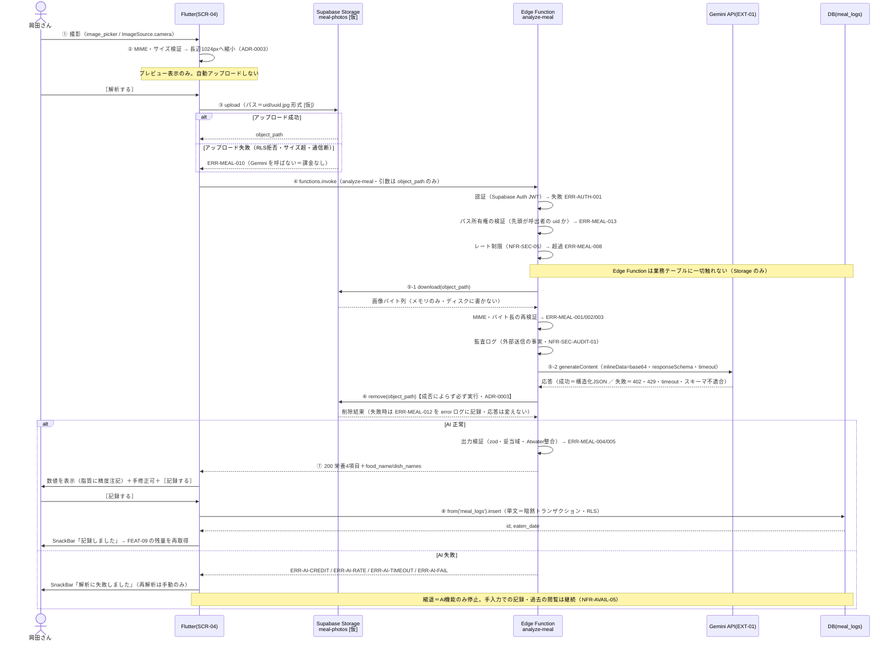

# FEAT-08 食事撮影・タンパク質計算 詳細設計

> **目的**: FEAT-XX を実装が迷わない粒度（入出力・バリデーション・クエリ・エラー・画面挙動・実装単位）まで具体化し、TDDの着手点を固定する。
> **書き方**: 実データは書かない。上位の正本（API契約＝`../../30_データ・IF設計/02_API設計.md` ／ 物理DB＝`../01_DB物理設計.md` ／ シーケンス＝`../../40_機能設計/01_シーケンス設計.md`）と矛盾させず、参照はIDで行う。横断方針（エラー分類・トランザクション・冪等・リトライ）は `../07_実装共通設計パターン.md` を正本とし本書では再定義しない。

> ⚠️ **本書はたたき台（2026-08-02 生成）**。岡田さんのレビューで確定する。

## 目次
1. [概要](#1-概要)
2. [処理フロー](#2-処理フロー)
3. [入出力仕様](#3-入出力仕様)
4. [業務ロジック](#4-業務ロジック)
5. [データアクセス](#5-データアクセス)
6. [エラー処理](#6-エラー処理)
7. [画面挙動・状態別表示](#7-画面挙動状態別表示)
8. [実装単位](#8-実装単位)
9. [テスト観点](#9-テスト観点)
10. [敵対的検証・要確認事項](#10-敵対的検証要確認事項)

## 1. 概要

| 項目 | 内容 |
|---|---|
| 対応要件 | FEAT-08（食事撮影・タンパク質計算。本PJの中核機能） |
| 対応画面 | SCR-04 食事記録 |
| 対応API | ① `supabase.storage.from('meal-photos').upload()`（画像の一時アップロード） ② `supabase.functions.invoke('analyze-meal')`（EXT-01・保存しない） ③ `supabase.from('meal_logs').insert()`（保存） |
| 関連ルール | RULE-006（写真計算は AI を用いる）。保存値は RULE-002（残量＝必要量−摂取量）の入力になる |
| 外部連携 | EXT-01（Google Gemini API を Edge Function から直接呼ぶ）。画像入力（vision）＋構造化出力 |
| 性能目標 | NFR-PERF-04（食事写真計算 ≤20秒。①②の合計）。③の保存は NFR-PERF-02（≤1秒） |
| 状態 | 状態を持たない（ST-01/ST-02 は FEAT-04 の領域） |
| 優先度 | MUST |

### 全体の流れ（8ステップ）

| # | 主体 | 処理 |
|---|---|---|
| ① | Flutter | `image_picker`（`ImageSource.camera`）で撮影する |
| ② | Flutter | 端末側で長辺1024pxへ縮小する（ADR-0003） |
| ③ | Flutter → Storage | `meal-photos` バケット `[仮]` へアップロードする |
| ④ | Flutter → Edge Function | `analyze-meal` を invoke する。引数はオブジェクトパスのみ |
| ⑤ | Edge Function → Gemini | Storage から画像を読み、`generateContent` を呼ぶ |
| ⑥ | Edge Function → Storage | 推論完了と同時に画像を削除する（成否によらず必ず実行） |
| ⑦ | Edge Function → Flutter | 栄養4項目＋料理名を返す |
| ⑧ | Flutter → DB | 利用者が確認・手修正して［記録する］→ `meal_logs` に INSERT |

### なぜ Storage を経由するか

画像を Edge Function へ直接 POST しない。理由は次のとおり。

| 理由 | 内容 |
|---|---|
| ボディ上限が未文書化 | Edge Function のリクエストボディ上限は公式に文書化されていない `[仮]`。上限に依存した設計を組めない |
| 上限を宣言的に強制できる | バケットの `file_size_limit` / `allowed_mime_types` で、関数へ到達する前に弾ける |
| 課金の抑止 | 形式・サイズ違反は Gemini を呼ぶ前に落ちる。従量課金が発生しない |

**Storage は保管庫ではなく転送路。** 推論後すぐ消す（ADR-0003 の「保持しない」は維持）。⑥の削除は §5・§6・§10-12 で扱う。

### 2段階に分ける理由

④解析と⑧保存を1操作にまとめない。

| 理由 | 根拠 |
|---|---|
| ピンボケ・見切れの失敗写真をそのまま記録する事故を防ぐ | `../../40_機能設計/01_シーケンス設計.md` §1 |
| 記録に値しない解析への従量課金を防ぐ | 同上 |

### 保存しないもの

**食事写真も料理名も永続化しない**（ADR-0003・`../../30_データ・IF設計/01_データモデル.md` §7）。

| 項目 | 扱い |
|---|---|
| 食事写真 | Storage に一時置くのみ。⑥で削除する。DBの列は持たない |
| `food_name` / `dish_names` | ⑦のレスポンスに含むが表示専用。⑧のリクエストにも `meal_logs` にも存在しない |
| 栄養4項目 | `meal_logs` に保存する。保存後は FEAT-09（残量再計算）へ連携する |

> ⚠️ 要確認（人間判断）: 本書は Flutter + Supabase 構成（Vercel 不使用）で記述している。一方 ADR-0001（Vercel AI Gateway 採用）・ADR-0002（Next.js + Mantine 採用）・`../../30_データ・IF設計/02_API設計.md`（`/api/*` の Route Handler 契約）は Vercel 前提のまま。後継ADRの起票と段3の改訂が必要。**本機能は ADR-0001 と ADR-0003 の双方を根拠ADRとしており、両方の改訂・確認が要る**（§10-13）。

> ⚠️ 要確認（人間判断）: 段3との具体的な乖離は次の3点。(1) `POST /api/meals/analyze` は Edge Function `analyze-meal` に置き換わる。(2) `POST /api/meals` は PostgREST 直接 INSERT に置き換わる。(3) 画像の受け渡しが multipart から Storage オブジェクトパスに変わる。`../../30_データ・IF設計/02_API設計.md` §4.1 の契約表の改訂が要る。

## 2. 処理フロー

`../../40_機能設計/01_シーケンス設計.md` §1 を正本とし、本節はバリデーション位置・AI呼び出し引数・トランザクション境界・クエリ発行点まで踏み込んだ詳細化とする。



- ⑥は AI の成否にかかわらず実行する。実装は `try / finally` で担保する（§3(c) のコード）。
- ⑥が失敗しても⑦の応答は変えない。利用者の操作をブロックしない（§6・§10-12）。

## 3. 入出力仕様

3層に分けて定義する。

| 層 | 経路 | 節 |
|---|---|---|
| (a) | Flutter → Supabase Storage | §3(a) |
| (b) | Flutter → Edge Function `analyze-meal` | §3(b) |
| (c) | Edge Function → Gemini API（EXT-01） | §3(c) |
| (d) | Flutter → PostgREST（`meal_logs` 保存） | §3(d) |

### 3(a) Flutter → Supabase Storage（画像の一時アップロード）

| 項目 | 値 | 根拠 |
|---|---|---|
| 呼び出し | `supabase.storage.from('meal-photos').uploadBinary(path, bytes, fileOptions)` | — |
| バケット名 | `meal-photos` `[仮]` | 本書 |
| 公開設定 | 非公開（private）。署名URLも発行しない | ADR-0003 |
| オブジェクトパス | `{auth.uid()}/{uuid}.jpg` `[仮]`（先頭フォルダ＝所有者） | RLS 判定に使う |
| `upsert` | `false`（同名上書きを許さない） | 誤上書き防止 |
| `contentType` | `image/jpeg` `[仮]`（リサイズ結果の形式に一致させる） | §3.1 |
| ファイルサイズ上限 | バケットの `file_size_limit = 4 MB` `[仮]` | §3.1 |
| 許可MIME | バケットの `allowed_mime_types = image/jpeg, image/png, image/webp` `[仮]` | §3.1 |
| RLS | INSERT / SELECT / DELETE とも `(storage.foldername(name))[1] = auth.uid()::text` `[仮]`。**本人のみ** | NFR-SEC-01 |
| 保持 | ⑥で削除する。バケットは転送路であり保管庫ではない | ADR-0003 |

```dart
// app/lib/data/meal_photo_repository.dart（抜粋・[仮]）
final path = '${supabase.auth.currentUser!.id}/${uuid.v4()}.jpg';
await supabase.storage.from('meal-photos').uploadBinary(
  path,
  resizedBytes,                                   // 長辺1024px・JPEG 品質0.8 [仮]
  fileOptions: const FileOptions(contentType: 'image/jpeg', upsert: false),
);
```

### 3(b) Flutter → Edge Function `analyze-meal`（EXT-01・非保存）

| 項目 | 内容 |
|---|---|
| 呼び出し | `supabase.functions.invoke('analyze-meal', body: {...})` |
| 実体 | `POST {SUPABASE_URL}/functions/v1/analyze-meal` |
| 認証 | 要（Supabase Auth の JWT。`supabase_flutter` が自動付与） |
| Content-Type | `application/json`。**画像バイト列は送らない**（§1「なぜ Storage を経由するか」） |
| ステータス | 200 / 400 / 401 / 402 / 403 / 404 / 413 / 415 / 422 / 429 / 500 / 504 |
| 冪等性 | 非冪等。自動リトライなし（`../../30_データ・IF設計/02_API設計.md` §1） |

```jsonc
// Request（型のみ。値は書かない）
{
  "object_path": "string 必須"   // 例: {uid}/{uuid}.jpg。バケット名は含めない [仮]
}
// Response 200（型のみ。値は書かない）
{
  "food_name": "string",          // 表示専用・保存しない
  "dish_names": ["string"],       // 表示専用・保存しない
  "calories_kcal": "float(>=0)",
  "protein_g": "float(>=0)",
  "sugar_g": "float(>=0)",
  "fat_g": "float(>=0)"
}
```

- Flutter 側の応答検証は **Dart のモデルクラス＋`fromJson`** で行う（zod は Deno 側のみ）。
- `object_path` はバケット名を含めない。バケットは Edge Function 側で固定する（他バケットの読み出しを防ぐ）。

```dart
// app/lib/data/meal_analyze_repository.dart（抜粋・[仮]）
final res = await supabase.functions.invoke('analyze-meal', body: {'object_path': path});
final nutrition = MealNutrition.fromJson(res.data as Map<String, dynamic>);
```

### 3(c) Edge Function → Gemini API（EXT-01）呼び出し仕様

Deno の `fetch` で直接呼ぶ。SDK は使わない。モデルIDは**環境変数**から読み、コードに直書きしない。

| 項目 | 値 | 根拠 |
|---|---|---|
| エンドポイント | `POST https://generativelanguage.googleapis.com/v1beta/models/{model}:generateContent` `[仮]` | EXT-01 |
| モデル | 環境変数 `GEMINI_MODEL`（既定 `gemini-3.5-flash`） | ADR-0001 |
| 認証 | ヘッダ `x-goog-api-key: $GEMINI_API_KEY`。**Edge Function の環境変数のみ**に置く | NFR-SEC-02 |
| プロンプト | `contents[0].parts[0].text = MEAL_ANALYZE_PROMPT`（文言は §10-9） | ADR-0001 |
| 画像の渡し方 | `contents[0].parts[1].inlineData = { mimeType, data }`。`data` は Storage から読んだバイト列の base64。**ディスクに書かない** | ADR-0003 |
| 構造化出力 | `generationConfig.responseMimeType = "application/json"` ＋ `generationConfig.responseSchema` | EXT-01 |
| reasoning | `generationConfig.thinkingConfig.thinkingLevel = 'high'` `[仮]` | ADR-0001（実測値の前提） |
| タイムアウト | `signal: AbortSignal.timeout(18_000)` `[仮]`（NFR-PERF-04 の20秒に2秒の応答余裕） | NFR-PERF-04 |
| 自動リトライ | 行わない（従量課金のため）。429 のみ利用者操作なしで1回だけ指数バックオフ再試行 `[仮]` | `../../30_データ・IF設計/02_API設計.md` §1 |
| フォールバック | **無し**。Gateway 相当の宣言的なモデル切替は使えない。必要なら Edge Function 内に自前で書く | §10-13 |

```ts
// supabase/functions/analyze-meal/_schema.ts（PoC実測の基線スキーマ・ADR-0001）
export const MEAL_NUTRITION_RESPONSE_SCHEMA = {
  type: 'object',
  properties: {
    food_name:     { type: 'string', description: '写真全体の料理・商品の推定名称（日本語、総称）' },
    dish_names:    { type: 'array', items: { type: 'string' },
                     description: '写真に写る個々の料理名。単品なら1件、複数なら全て列挙' },
    calories_kcal: { type: 'number', description: '写真に写っている食事全体(1人前)のカロリー (kcal)' },
    protein_g:     { type: 'number', description: 'タンパク質 (g)' },
    sugar_g:       { type: 'number', description: '糖質 (g)。食物繊維を除いた炭水化物量' },
    fat_g:         { type: 'number', description: '脂質 (g)' },
  },
  required: ['food_name', 'dish_names', 'calories_kcal', 'protein_g', 'sugar_g', 'fat_g'],
} as const;

// 応答の検証は zod（Deno/TS）で行う。Flutter 側は Dart のモデルクラス＋fromJson。
export const mealNutritionSchema = z.object({
  food_name:     z.string(),
  dish_names:    z.array(z.string()).max(20),
  calories_kcal: z.number(),
  protein_g:     z.number(),
  sugar_g:       z.number(),
  fat_g:         z.number(),
});
```

```ts
// supabase/functions/analyze-meal/index.ts（抜粋・[仮]）
const { data: blob, error: dlErr } =
  await admin.storage.from('meal-photos').download(objectPath);
if (dlErr || !blob) throw new StorageReadError();            // ERR-MEAL-011
const base64 = encodeBase64(new Uint8Array(await blob.arrayBuffer()));

try {
  const res = await fetch(
    `${GEMINI_ENDPOINT}/${Deno.env.get('GEMINI_MODEL')}:generateContent`,
    {
      method: 'POST',
      headers: {
        'content-type': 'application/json',
        'x-goog-api-key': Deno.env.get('GEMINI_API_KEY')!,   // 環境変数のみ・NFR-SEC-02
      },
      body: JSON.stringify({
        contents: [{ role: 'user', parts: [
          { text: MEAL_ANALYZE_PROMPT },
          { inlineData: { mimeType, data: base64 } },
        ]}],
        generationConfig: {
          responseMimeType: 'application/json',
          responseSchema: MEAL_NUTRITION_RESPONSE_SCHEMA,
          thinkingConfig: { thinkingLevel: 'high' },          // [仮]
        },
      }),
      signal: AbortSignal.timeout(18_000),                    // [仮]
    },
  );
  // …ステータス判定 → JSON パース → mealNutritionSchema で検証
} finally {
  // ADR-0003: 推論の成否によらず必ず削除する。失敗は ERR-MEAL-012 として記録のみ。
  const { error: rmErr } = await admin.storage.from('meal-photos').remove([objectPath]);
  if (rmErr) logDeleteFailure(objectPath, rmErr);             // 応答は変えない
}
```

### 3(d) Flutter → PostgREST（`meal_logs` 保存）

| 項目 | 内容 |
|---|---|
| 呼び出し | `supabase.from('meal_logs').insert({...}).select('id, eaten_date').single()` |
| 認証 | 要（JWT。RLS で本人行のみ） |
| フィールド名 | snake_case＝DB列名と一致 |
| `user_id` | **クライアントから送らない**。列 DEFAULT `auth.uid()` 相当で解決し、RLS の `WITH CHECK` で他人の値を拒否する `[仮]` |
| 冪等性 | 非冪等（連投すると2行入る）。冪等キーは当面未使用 |

```jsonc
// Insert する行（日時3項目は API設計 §4.1 に定義が無いため本書で [仮] 定義。§10-1/§10-2 参照）
{
  "calories_kcal": "float(>=0) 必須",
  "protein_g":     "float(>=0) 必須",
  "sugar_g":       "float(>=0) 必須",
  "fat_g":         "float(>=0) 必須",
  "eaten_date":    "date 必須 [仮]",          // ISO 8601 (YYYY-MM-DD)
  "eaten_time":    "time 任意 [仮]",          // ISO 8601 (HH:mm)・null 可
  "intake_count":  "int(>=1) 任意 [仮]"       // 業務的意味が未確定（§10-2）
}
// 返り値
{ "id": "bigint", "eaten_date": "date" }
```

### 3.1 バリデーション規則

検証は3か所で行う。**課金を伴う⑤より前に必ず落とす。**

| 位置 | 主体 |
|---|---|
| 端末側（送信前） | Flutter |
| バケット側（宣言的） | Supabase Storage |
| 関数側（再検証） | Edge Function |

| 項目 | 規則 | 検証位置 | 違反時 |
|---|---|---|---|
| 画像の実体 | 必須。0バイト不可（下限 1 KB `[仮]`） | Flutter・Edge Function | ERR-MEAL-001 (400) |
| 画像 MIME | `image/jpeg` / `image/png` / `image/webp` のみ許可 `[仮]`。申告値とマジックバイトの両方で判定 | 3か所すべて | ERR-MEAL-002 (415) |
| 画像バイト長 | ≤ 4 MB `[仮]`。長辺1024px・JPEG 品質0.8 `[仮]` のリサイズ後は通常これを大きく下回る | 3か所すべて | ERR-MEAL-003 (413) |
| `object_path` の形式 | 非空文字列。バケット名を含まない。パス区切りの正規化後に `..` を含まない `[仮]` | Edge Function | ERR-MEAL-013 (400) |
| `object_path` の所有権 | 先頭フォルダが呼出者の `auth.uid()` と一致すること | Edge Function | ERR-MEAL-013 (403) |
| AI出力の型 | `mealNutritionSchema` に適合すること | Edge Function | ERR-MEAL-004 (422) |
| AI出力の妥当域 | `calories_kcal` 0〜5000 ／ `protein_g` 0〜500 ／ `sugar_g` 0〜1000 ／ `fat_g` 0〜500 `[仮]`。負値・NaN・Infinity は不可 | Edge Function | ERR-MEAL-005 (422) |
| 保存の栄養4項目 | 4項目すべて必須・数値・0以上（`meal_logs` の CHECK と同値を Flutter 側でも検証） | Flutter・DB CHECK | ERR-MEAL-006 (400) |
| `eaten_date` | ISO 8601 の日付。未来日は不可 `[仮]`。1年以上前の日付も不可 `[仮]` | Flutter | ERR-MEAL-007 (400) |
| `eaten_time` | ISO 8601 の時刻または null | Flutter | ERR-MEAL-007 (400) |
| `intake_count` | 整数かつ1以上、または null（`meal_logs` の CHECK と同値） | Flutter・DB CHECK | ERR-MEAL-006 (400) |
| レート制限 | `analyze-meal` は `user_id` 単位で 20回/時・100回/日 `[仮]`（NFR-SEC-05・従量課金と悪用の抑止） | Edge Function | ERR-MEAL-008 (429) |

- バケット側の `file_size_limit` / `allowed_mime_types` は**強制**として働く。関数側の再検証は多重防御であり、省略しない。
- 端末側の検証は UX のためのもの。信頼境界の外にあるため、これだけに依存しない。

## 4. 業務ロジック

RULE-006（写真からの栄養推定に AI を用いる）を実装する部分。決定的な計算は純関数へ切り出し、単体テスト対象とする（NFR-QUAL-01）。

| 関数 | 実装先 | 責務 | 判定・式 |
|---|---|---|---|
| `resizeToMaxEdge(bytes, maxEdge)` | Dart | 端末側リサイズ（ADR-0003） | 長辺 > `maxEdge`(=1024) のとき縦横比維持で縮小。以下なら再エンコードのみ |
| `assertImageInput(bytes, mimeType)` | Dart / TS | 画像の入力検証 | MIME 許可リスト ∧ 1 KB ≤ size ≤ 4 MB `[仮]` |
| `assertOwnedPath(path, uid)` | TS | `object_path` の形式・所有権検証 | 先頭フォルダ＝`uid` ∧ `..` を含まない `[仮]` |
| `validateNutrition(obj)` | TS | AI出力の妥当域判定 | 4項目それぞれ `0 <= v <= 上限`（§3.1 の値）。1つでも外れたら不合格 |
| `atwaterDeviation(obj)` | TS / Dart | 栄養値の内部整合の目安 | `est = 4*protein_g + 4*sugar_g + 9*fat_g`、`dev = abs(calories_kcal - est) / max(est, 1)` |
| `toMealLogRow(input)` | Dart | 保存行の組み立て | 栄養4項目＋`eaten_date`/`eaten_time`/`intake_count` のみを写す。`food_name`・`dish_names` は**写さない** |

### Atwater整合の扱い

`atwaterDeviation` が 0.40 `[仮]` を超えても**保存はブロックしない。**

| 判断 | 内容 |
|---|---|
| 表示 | SCR-04 に「数値の整合が取れていない可能性があります。ご確認ください」の注意を出す |
| 理由 | AI推定は本来ずれる。機械的な拒否は誤検知が多い |
| 位置づけ | ADR-0001 のテスト観点「栄養値の妥当域＝Atwater整合」の実装受け皿 |

### 脂質の扱い（精度の弱点）

ADR-0001 の実測で、外食の脂質 MAPE は 32.7%。

| 指標 | 外食 | 備考 |
|---|---|---|
| kcal | 5.7% | — |
| たんぱく質 | 10.5% | **本機能の主目的** |
| 糖質 | 9.8% | n=10 の小標本（§10-7） |
| 脂質 | 32.7% | 既知の弱点 |
| 総合 | 14.7% | 家庭料理は 18.8% |

- 原因は揚げ油・ドレッシング等の「見えない油」。
- 対処は表示上のものにとどめる。**脂質の入力欄にのみ**「揚げ物・炒め物では実際より少なく出る傾向があります」の注記を添える（§7）。
- 既定で手修正しやすい状態にする。
- 主目的はタンパク質（MAPE 10.5%）であり、脂質誤差は目的指標を直接損なわない。

### 合計計算との関係

- 本機能が保存するのは1レコード＝1回の記録。
- 日次合計・残量算出は FEAT-09 が `meal_logs` を SUM して行う。
- `intake_count` を係数として掛けるか否かは未確定（§10-2）。

## 5. データアクセス

### Edge Function `analyze-meal`

- **業務テーブルに一切触れない。** `meal_logs` を含むどのテーブルにも SELECT / INSERT / UPDATE / DELETE を発行しない。
- 触れるのは **Storage のみ**（`download` と `remove` の2操作）。
- したがってトランザクションは存在しない。
- 行うのは Supabase Auth による JWT 検証と、`object_path` の所有権検証のみ。
- 解析結果は永続化されず応答として返るだけ。⑧が呼ばれなければ `meal_logs` には何も残らない。

| 操作 | 対象 | 権限 |
|---|---|---|
| `download(object_path)` | `meal-photos` `[仮]` | service_role。所有権はアプリ側で検証済み |
| `remove([object_path])` | `meal-photos` `[仮]` | service_role。`finally` で成否によらず実行 |

- **画像は一切ディスクへ書かない**。`Blob` → `Uint8Array` → base64 の変換をメモリ上で行い、そのまま EXT-01 へ渡す。関数終了とともに破棄される（ADR-0003）。
- 画像バイト列・base64 文字列を `console.log` に出さない（§6・`../05_ログ設計.md`）。

### `meal_logs` への保存（PostgREST）

- Flutter から単一行の INSERT 1文のみ。単文＝暗黙トランザクションで完結する。
- 明示的な `BEGIN` / `COMMIT` は不要。副作用のある処理を同一境界に持たない。

```sql
-- FEAT-08 ⑧ 食事記録の保存。PostgREST が発行する単文＝暗黙トランザクション。
-- 画像・料理名の列は存在しない（ADR-0003）。user_id は列 DEFAULT で解決する [仮]。
INSERT INTO meal_logs (
  calories_kcal, protein_g, sugar_g, fat_g, eaten_date, eaten_time, intake_count
) VALUES ($1, $2, $3, $4, $5, $6, $7)
RETURNING id, eaten_date;
```

| 観点 | 内容 |
|---|---|
| 対象テーブル | `meal_logs`（INSERT のみ）。Edge Function は対象テーブルなし |
| 使用INDEX | 本 INSERT は INDEX 探索を伴わない。書き込みは `ix_meal_logs_user_date` の更新コストのみ。同 INDEX は FEAT-09 の当日 SUM が利用する |
| RLS（テーブル） | `user_id = auth.uid()` 相当で本人行のみ（`../01_DB物理設計.md` §3・`../../30_データ・IF設計/01_データモデル.md` §7） |
| `user_id` の詐称防止 | クライアントが `user_id` を送っても RLS の `WITH CHECK` で拒否する。列 DEFAULT で自動解決する `[仮]` |
| RLS（Storage） | `meal-photos` `[仮]` は本人フォルダのみ read/write/delete（§3(a)） |
| トランザクション境界 | Edge Function ＝なし（DB非接触） ／ 保存＝INSERT 1文の暗黙トランザクション。両者にまたがるトランザクションは存在しない |
| 外部I/Oとの関係 | EXT-01 呼び出しはトランザクション外（Edge Function が DB に触れないため構造的に保証される） |
| Storage との関係 | Storage 操作と DB INSERT は別トランザクション。⑥の削除失敗は⑧の保存に影響しない（§10-12） |

> ⚠️ 要確認（人間判断）: `user_id`（`bigint`）と Supabase `auth.uid()`（`uuid`）の紐付け方式は未確定。正本は `../06_DB設計規約.md`。本書では方式を決めず、列 DEFAULT・RLS・Storage のフォルダ名の3か所で同じ解決方式を使うことだけを要件とする。

> ⚠️ 要確認（人間判断）: `../06_DB設計規約.md` §（適用外・例外）は「ADR-0003 により Storage は使用しないため、その命名も対象外」と記している。本書は `meal-photos` `[仮]` を使うため矛盾する。同規約に Storage の命名・RLS 規約を追加する必要がある（§10-15）。

## 6. エラー処理

分類・ログ出力の横断方針は `../07_実装共通設計パターン.md` を正本とする。本表は FEAT-08 固有の割り当て（ドメイン接頭辞 `ERR-MEAL-*`）。

| ERR-ID | HTTP | 発生条件 | 利用者向けメッセージ（意図） | retryable | ログ |
|---|---|---|---|---|---|
| ERR-AUTH-001 | 401 | セッション無効・未ログイン | 再ログインを促す | false | 認証失敗（NFR-SEC-AUDIT-02） |
| ERR-MEAL-001 | 400 | 画像が空・実体なし | 写真を選び直すよう促す | false | warn（AI呼び出し前） |
| ERR-MEAL-002 | 415 | 許可外 MIME（申告値またはマジックバイト） | 対応形式（JPEG/PNG/WebP）を示す | false | warn |
| ERR-MEAL-003 | 413 | 画像が上限 4 MB `[仮]` 超 | 撮り直し／縮小を促す。通常は端末側リサイズで到達しない | false | warn（端末側リサイズの不具合を示唆） |
| ERR-MEAL-004 | 422 | AI応答が `mealNutritionSchema` に不適合 | 「うまく読み取れませんでした。撮り直してください」 | false（手動再実行のみ） | error＋生テキスト要約（画像は残さない） |
| ERR-MEAL-005 | 422 | AI出力が妥当域外（負値・上限超・NaN） | 同上 | false | error＋出力値 |
| ERR-MEAL-006 | 400 | 保存時の栄養4項目が欠落・非数値・負値、または `intake_count` 不正 | 該当項目を指し示す | false | warn |
| ERR-MEAL-007 | 400 | `eaten_date`/`eaten_time` の形式不正・未来日 | 日時を修正するよう促す | false | warn |
| ERR-MEAL-008 | 429 | アプリ側レート制限超過（NFR-SEC-05） | 時間をおいて再試行するよう促す | true（時間経過後） | warn＋`user_id`・カウンタ |
| ERR-MEAL-009 | 500 | `meal_logs` INSERT 失敗（CHECK違反・RLS拒否・接続断） | 「記録に失敗しました」＋再試行導線 | true | error＋SQLSTATE（値はマスキング） |
| **ERR-MEAL-010** | 500 | **③ Storage アップロード失敗**（通信断・容量超・バケットのMIME/サイズ拒否・RLS拒否） | 「写真を送れませんでした」＋再試行導線 | true | error＋Storage のエラーコード（パスは記録・画像は記録しない） |
| **ERR-MEAL-011** | 404 | **⑤-1 Storage 読み出し失敗**（オブジェクト不在・パス不正・既に削除済み） | 「写真が見つかりませんでした。撮り直してください」 | false | error＋`object_path`（Gemini を呼ばない＝課金なし） |
| **ERR-MEAL-012** | — | **⑥ Storage 削除失敗（推論は成功）** | **表示しない**（⑦の応答は 200 のまま返す） | true（後述の再試行） | **error＋`object_path`＋`correlation_id`**（ADR-0003 直結・要監視） |
| **ERR-MEAL-013** | 400/403 | `object_path` の形式不正（400）／他人のパス（403） | 「不正なリクエストです」 | false | warn＋`object_path`・`user_id`（403 は NFR-SEC-AUDIT-02 の対象） |
| ERR-AI-CREDIT | 402 | Gemini API のクレジット・クォータ不足 | AI機能の一時停止を伝える | false | error（運用者向けアラート対象） |
| ERR-AI-RATE | 429 | Gemini API のレート制限 | 少し待って再試行するよう促す | true（指数バックオフ） | warn |
| ERR-AI-TIMEOUT | 504 | `AbortSignal` 発火（18秒 `[仮]`） | 「時間内に解析できませんでした」 | false（自動再試行しない＝課金抑止） | error＋所要時間 |
| ERR-AI-FAIL | 500 | 上記以外の EXT-01 失敗（不達・5xx を含む） | 解析失敗を伝え、手入力での記録を案内 | false | error（NFR-AVAIL-05 の縮退判定材料） |

### ERR-MEAL-012（推論は成功したが削除に失敗した場合）の扱い

ADR-0003「写真を保持しない」に直結するため、単独で規定する。

| 観点 | 決定 |
|---|---|
| 利用者への影響 | **無し。**⑦は 200 を返し、⑧の保存も通常どおり行える |
| 理由 | 削除は利用者の関心事ではない。ここで失敗を返すと、課金済みの解析結果を捨てることになる |
| 即時の対処 | Edge Function 内で `remove` を1回だけ再試行する `[仮]` |
| 再試行も失敗した場合 | `level=error` で `object_path` と `correlation_id` を記録し、応答は変えない |
| 残置オブジェクトの回収 | **未決。** バケットのライフサイクル設定または定期削除が要る（§10-12・🔴 高） |
| 監視 | ERR-MEAL-012 の発生件数を運用者が確認できる状態にする（正本は `../05_ログ設計.md`） |

- ⑥は `finally` で実行するため、AI が失敗した経路でも削除は走る（§3(c)）。
- ⑤-1 で ERR-MEAL-011 が出た場合（オブジェクト不在）は、削除対象が無いため ERR-MEAL-012 は発生しない。

### 監査ログ

- ⑤-2 で EXT-01 へ画像を送信する事実を、**送信前に**1件記録する（NFR-SEC-AUDIT-01）。
- 記録項目: `actor` / `occurred_at` / `action=外部送信` / `target=EXT-01` / モデルID / 画像バイト長 / `correlation_id` / `result`。
- **画像そのもの・base64・画像を復元しうるデータは記録しない**（ADR-0003）。`object_path` は記録してよい（画像の復元に使えないため）。
- 出力先は Supabase Edge Function ログ（1行1JSON・`service=okada-fit-fn`）。項目定義の正本は `../05_ログ設計.md`。

### 縮退（NFR-AVAIL-05）

| 障害 | 影響 | 継続できること |
|---|---|---|
| `ERR-AI-*` 系 | AI 機能のみ停止 | 手入力での記録・過去記録の閲覧・FEAT-09 の残量表示 |
| ERR-MEAL-010（Storage 不達） | 写真からの解析のみ停止 | 同上 |
| ERR-MEAL-012（削除失敗） | 影響なし（内部事象） | すべて |

> ERRの完全列挙の正本は `../../60_テスト設計/02_RED母集合_受入基準・状態・エラー.md`（段6で集約）。本表はその入力とする。

## 7. 画面挙動・状態別表示

SCR-04 食事記録。`ERR-MEAL-*` の番号順ではなく、利用者の操作段階で表示を切り替える。

| 状態 | 表示 | 操作可否 |
|---|---|---|
| 初期/空 | 撮影ボタン（`image_picker` / `ImageSource.camera`）＋説明文。当日の記録一覧（0件なら淡色の `Text` で空表示） | 撮影/選択のみ可 |
| プレビュー（未送信） | 縮小後画像を `Image.memory` で表示＋［解析する］`FilledButton`＋［撮り直す］。**この時点では未アップロード**（ADR-0003） | ［解析する］可 |
| 読込中（アップロード＋解析） | ［解析する］を無効化し `CircularProgressIndicator` を出す。二重送信を禁止する。結果領域は `shimmer` もしくは `CircularProgressIndicator`。20秒想定の旨を `Text`（小サイズ）で明示（NFR-PERF-04） | 全操作不可（キャンセルのみ可） |
| 成功（解析結果） | `food_name` を見出し、`dish_names` を `Chip` 群で表示。栄養4項目は `TextFormField`＋数値 `TextInputFormatter`（初期値＝AI出力・手修正可）。脂質欄に `helperText` で精度注記（§4）。Atwater 乖離時は警告色の `Card`／`Banner` | 手修正・［記録する］可 |
| 読込中（保存） | ［記録する］を無効化し `CircularProgressIndicator`。楽観的更新はしない | 全操作不可 |
| 成功（保存） | `ScaffoldMessenger.showSnackBar`（成功色）で「記録しました」。入力欄をリセットし、当日一覧と FEAT-09 の残量を再取得 | 続けて撮影可 |
| エラー（AI系・Storage系） | `ScaffoldMessenger.showSnackBar`（エラー色）＋結果領域に ERR-ID 由来のメッセージ。［手入力で記録する］導線を併置（NFR-AVAIL-05） | 再解析・手入力とも可 |
| エラー（入力系） | 該当 `TextFormField` の `validator` でエラー表示。SnackBar は出さない | 修正して再送可 |

- 撮影→プレビュー→［解析する］→［記録する］の順序は固定する。**自動アップロード・自動保存はしない**（ADR-0003）。
- アップロードは［解析する］押下時に開始する。プレビュー段階では Storage に何も置かない。
- 解析結果は端末のウィジェット状態のみで保持する。サーバ側には持たせない（改ざん可能性は §10-4）。
- キャンセル時は Edge Function を呼ばずに終わる。アップロード済みオブジェクトが残る点は §10-12 で扱う。

## 8. 実装単位

| # | ファイル | 役割 | 主なシグネチャ |
|---|---|---|---|
| 1 | `supabase/functions/analyze-meal/index.ts` | Edge Function 本体。認証→所有権検証→レート制限→Storage読出→EXT-01→出力検証→**Storage削除**→返却。DB非接触 | `Deno.serve(handler)` / `async function handler(req: Request): Promise<Response>` |
| 2 | `supabase/functions/analyze-meal/_schema.ts` | `responseSchema`（Gemini 用）と zod スキーマ・型（§3(c)） | `export const MEAL_NUTRITION_RESPONSE_SCHEMA` / `export const mealNutritionSchema` / `export type MealNutrition` |
| 3 | `supabase/functions/analyze-meal/_gemini.ts` | EXT-01 呼び出しの隔離層。エンドポイント・モデルID・タイムアウトを集約 | `export function callGemini(base64: string, mimeType: string): Promise<MealNutrition>` |
| 4 | `supabase/functions/analyze-meal/_validation.ts` | 純関数群。パス所有権・AI出力の妥当域・Atwater（§4） | `export function assertOwnedPath(p: string, uid: string): void` / `export function validateNutrition(o: unknown): MealNutrition` / `export function atwaterDeviation(o: MealNutrition): number` |
| 5 | `supabase/functions/_shared/rate_limit.ts` | `user_id` 単位のレート制限（NFR-SEC-05）。FEAT-03 と共用 | `export function consume(userId: string, key: string): Promise<boolean>` |
| 6 | `supabase/migrations/*.sql` | `meal-photos` バケット `[仮]` の作成・`file_size_limit`・`allowed_mime_types`・Storage RLS ポリシー | （SQL） |
| 7 | `app/lib/features/meals/meal_capture_page.dart` | SCR-04。撮影→プレビュー→解析→確認→記録の画面（§7） | `class MealCapturePage extends StatefulWidget` |
| 8 | `app/lib/features/meals/meal_analyze_controller.dart` | 画面状態の管理。アップロード→invoke→結果保持→保存の進行制御 | `Future<void> analyze()` / `Future<void> save()` |
| 9 | `app/lib/features/meals/meal_nutrition.dart` | 応答のモデルクラス（zod ではなく Dart 側の型） | `class MealNutrition { factory MealNutrition.fromJson(Map<String, dynamic> j); }` |
| 10 | `app/lib/data/meal_photo_repository.dart` | Storage への一時アップロード（§3(a)） | `Future<String> upload(Uint8List bytes, String mimeType)` |
| 11 | `app/lib/data/meal_analyze_repository.dart` | `analyze-meal` の invoke（§3(b)） | `Future<MealNutrition> analyze(String objectPath)` |
| 12 | `app/lib/data/meal_log_repository.dart` | `meal_logs` への INSERT（§3(d)・§5） | `Future<MealLogCreated> insert(MealLogRow row)` |
| 13 | `app/lib/domain/image_resize.dart` | 端末側リサイズ（ADR-0003・§4） | `Uint8List resizeToMaxEdge(Uint8List bytes, int maxEdge)` |
| 14 | `app/lib/domain/meal_validation.dart` | 保存値の検証・Atwater（Dart 側の純関数・単体テスト対象） | `void assertImageInput(Uint8List b, String mimeType)` / `double atwaterDeviation(MealNutrition o)` |

## 9. テスト観点

| TC-ID | 観点 | 期待 |
|---|---|---|
| TC-FEAT08-01 | 正常系 | 有効画像で 200、栄養4項目＋`food_name`/`dish_names` を返す |
| TC-FEAT08-02 | Edge Function がDBに書かない | `analyze-meal` を呼んでも `meal_logs` の行数が変化しない（⑧を呼ばなければ0件のまま） |
| TC-FEAT08-03 | 画像の非永続化 | 実行後に `meal-photos` `[仮]` にオブジェクトが残らない。ログ・DBのいずれにも画像バイト列が存在しない（ADR-0003） |
| TC-FEAT08-04 | プレビュー段階で未送信 | ［解析する］押下前に Storage へのアップロードが発生しない |
| TC-FEAT08-05 | 入力拒否（課金前に弾く） | 許可外MIMEで ERR-MEAL-002 (415)、4 MB `[仮]` 超で ERR-MEAL-003 (413)。いずれも EXT-01 を呼ばない |
| TC-FEAT08-06 | AI出力の不正 | スキーマ不適合で ERR-MEAL-004 (422)、妥当域外で ERR-MEAL-005 (422)。自動リトライしない |
| TC-FEAT08-07 | Atwater乖離 | 乖離 0.40 `[仮]` 超でも 200 を返し、警告フラグのみ立つ（保存はブロックしない） |
| TC-FEAT08-08 | フォールバックが無いこと | 既定モデル失敗時に自動でモデル切替せず ERR-AI-FAIL を返す（Gateway 相当の宣言的切替は使わない・§10-13） |
| TC-FEAT08-09 | AI障害の分岐 | 429→ERR-AI-RATE（バックオフ後）／18秒 `[仮]` 超→ERR-AI-TIMEOUT (504)／402→ERR-AI-CREDIT。いずれも自動再実行しない |
| TC-FEAT08-10 | 縮退 | EXT-01 全断でも過去記録の閲覧・手入力保存・FEAT-09 残量が動作する（NFR-AVAIL-05） |
| TC-FEAT08-11 | 保存の正常系 | 栄養4項目＋日時で1行 INSERT、画像・料理名の列が存在しない |
| TC-FEAT08-12 | 保存の検証 | 負値・欠落で ERR-MEAL-006 (400)、不正日時で ERR-MEAL-007 (400)。DBに行が増えない |
| TC-FEAT08-13 | 非冪等・RLS | 同一内容2回送信で2行入る（現仕様・§10-6）。`user_id` を詐称しても RLS の `WITH CHECK` で拒否される |
| TC-FEAT08-14 | レート制限・監査ログ | 閾値超過で ERR-MEAL-008 (429) かつ EXT-01 未呼出。外部送信ごとに監査ログ1件、画像バイト列・base64 を含まない（NFR-SEC-AUDIT-01） |
| TC-FEAT08-15 | 性能 | ③＋④が20秒以内に応答する（NFR-PERF-04）、⑧が1秒以内（NFR-PERF-02） |
| TC-FEAT08-16 | Storage 起因の失敗 | アップロード失敗で ERR-MEAL-010、オブジェクト不在で ERR-MEAL-011。いずれも EXT-01 を呼ばない |
| TC-FEAT08-17 | AI失敗時も削除される | ERR-AI-TIMEOUT / ERR-AI-FAIL の経路でもオブジェクトが削除される（`finally` の担保・ADR-0003） |
| TC-FEAT08-18 | 削除失敗時の挙動 | `remove` を失敗させても⑦は 200 を返す。ERR-MEAL-012 が `error` ログに1件記録される |
| TC-FEAT08-19 | Storage の RLS | 他人の `uid` フォルダへアップロードできない。他人の `object_path` を渡すと ERR-MEAL-013 (403) |
| TC-FEAT08-20 | 中断時の残置 | ［解析する］後にアプリを終了すると、オブジェクトが残る（現仕様・§10-12 の回収手段が要る） |

受入基準（G/W/T）の候補:
- [AC] Given 有効な食事写真 When ［解析する］を押す Then 栄養4項目が20秒以内に表示され、DBには何も保存されていない
- [AC] Given 有効な食事写真 When 解析が完了する Then Supabase Storage に当該画像が残っていない
- [AC] Given 解析結果が表示されている When 数値を手修正して［記録する］を押す Then `meal_logs` に修正後の栄養4項目のみが1行保存され、写真は保存されない
- [AC] Given Gemini API が不達 When ［解析する］を押す Then 解析失敗が通知され、過去の記録閲覧と手入力での記録は継続できる
- [AC] Given 許可外形式または上限超のファイル When ［解析する］を押す Then EXT-01 を呼ばずにエラーを返す（従量課金を発生させない）

> 受入基準・ST・ERR の**正本は段6**（`../../60_テスト設計/02_RED母集合_受入基準・状態・エラー.md`・本PR対象外）。本節はその母集合への入力。

## 10. 敵対的検証・要確認事項

| # | 論点 | 内容 | 重大度 |
|---|---|---|---|
| 1 | `eaten_date`/`eaten_time` を誰が決めるか未定義 | `../../30_データ・IF設計/02_API設計.md` §4.1 に日時フィールドの定義が無い。一方 `meal_logs.eaten_date` は not null。本書は §3(d) でクライアント送信 `[仮]` とした。**サーバ時刻採用**なら過去の食事を後から記録できない。**クライアント時刻採用**なら端末TZ・端末時計のずれがそのまま入る。Edge Function（Deno）も Postgres も既定は UTC のため、サーバ側 `now()::date` は JST 深夜帯で前日にずれる。FEAT-05 の日付境界・タイムゾーン問題と同一の根であり、**両機能で同じ規則に揃える必要がある**（片方だけ決めると日次合計が合わなくなる） | 🔴 高 |
| 2 | `intake_count` の業務的意味が未確定 | `../../30_データ・IF設計/01_データモデル.md` §8-6 の未解決。AI出力は「写真に写っている食事全体(1人前)」。栄養4項目が**1食分**なのか `intake_count` 倍すべき**単価**なのかで FEAT-09 の日次合計が変わる。本書は「保存値＝そのまま1レコードの摂取量」として設計している。乗算解釈が採られると FEAT-08/09 の双方に修正が波及する。UI（入力欄の有無・既定値）も確定できない | 🔴 高 |
| 3 | ⑦→⑧の間の手修正の可否 | 本書は §7 で手修正可としたが、要件に明記が無い設計判断。**修正不可なら**脂質 MAPE 32.7%・家庭料理 総合 18.8% の誤差がそのまま記録に固定される。**修正可なら** §3.1 の保存時バリデーションが必須になる。かつ「記録された値がAI推定か手入力か」を区別できない（`meal_logs` に由来を示す列が無く、新列追加は禁止事項）。精度モニタリング（ADR-0001 の再検討トリガ）が実データからは行えない | 🔴 高 |
| 4 | 解析結果を保存へ渡す経路がクライアント経由 | Edge Function は結果を返すだけで保存しない。⑧の INSERT は Flutter が直接 PostgREST に発行する。したがって保存される栄養値は**クライアントが自由に構成できる**。DB 側に照合対象が無く検証不能。RLS は「誰の行か」しか守らない。単一利用者の自己申告データなので実害は小さいが、「AIが算出した値」としてダッシュボードに出す以上、値の出所は保証されていない。Edge Function に短命トークンを持たせるか、保存自体を RPC 化すれば検証できるが、構成が増える | 🟡 中 |
| 5 | 画像を保持しないことの実装的保証 | ADR-0003 の「関数終了とともに破棄」は自システム内の話に限られる。(a) **Supabase Storage の実体削除タイミング・Edge Function ログ・プラットフォーム側の一時領域**に残らないことは未検証。(b) アプリログに base64 やリクエストボディを誤って出力しない実装規律が必要（§6 で規定）。(c) **Gemini 側の保持・学習利用は別問題**で、ADR-0001 の申し送り（ZDR / Disallow prompt training の個別確認）が未消化。NFR-SEC-06 は `docs-nfr` 側で `⚠️ 要確認` のまま更新待ちであり、ADR-0003 の反映チェックが閉じていない | 🔴 高 |
| 6 | 二重記録を防ぐ手段が無い | ⑧は非冪等。通信タイムアウト後の再送・UIの二重タップでそのまま2行入る。ボタンの無効化は緩和にすぎない。`meal_logs` に UNIQUE 制約を置ける自然キーが無く（同じ食事を2回食べることは正当）、新列追加も禁止。表示側での重複検知か、`../../30_データ・IF設計/02_API設計.md` §1 の冪等キーの実運用が要る | 🟡 中 |
| 7 | 脂質の精度をUIでどう扱うか | 脂質 MAPE 32.7% は上位5モデル中で最悪（ADR-0001）。本書は §4/§7 で「注記＋手修正可」という表示上の対処を採ったが、これは設計判断であり承認が要る。代替案は (a) 脂質を非表示にして保存時0にする（`meal_logs` の not null を満たすが虚偽の値が入る）、(b) レンジ表示にする（`meal_logs` は単一 float のため保存できない）、(c) Pro モデルへ既定昇格（ADR-0001 の再検討条件・応答+1.7秒）。糖質の 9.8% も n=10 の小標本評価である点に留意 | 🟡 中 |
| 8 | 複数料理の内訳を持てない | `dish_names[]` が複数でも栄養値はフラットな4項目＝**写真全体の合計**として扱う（スキーマ上そうとしか解釈できない）。定食の一部だけを残した・小鉢だけ別カウントしたい、といった調整ができない。利用者は合計値を手で按分するしかない。料理ごとの内訳を持つには `meal_logs` の子テーブルが必要だが新テーブル追加は禁止事項のため、本書では合計として確定し指摘に留める | 🟡 中 |
| 9 | プロンプト文言が未確定 | §3(c) の `MEAL_ANALYZE_PROMPT` は PoC の実測プロンプト（「日本のコンビニまたは外食チェーンの商品」前提）を基線とする。家庭料理も対象にする本番用途では文言が合わない。**プロンプトを変えると ADR-0001 の実測 MAPE の前提が崩れる**（`thinkingLevel` 依存と同様、変更時は再ベンチが要る） | 🟡 中 |
| 10 | 横断方針の正本が未記入 | `../07_実装共通設計パターン.md` は本書が正本として参照する先。エラー分類・トランザクション・冪等・リトライの各表が未記入。本書の §5・§6 は FEAT-08 固有の判断として先行して書いているため、同ファイル確定時に齟齬が出る可能性がある | 🟡 中 |
| 11 | レート制限の実装基盤が未決 | NFR-SEC-05 の閾値は「実装時」とされ未定（本書 20回/時・100回/日 `[仮]`）。Edge Function は Deno の隔離環境で実行され、**インスタンス間でメモリを共有しない**。プロセス内カウンタでは制限にならない。永続カウンタが要るが、`../01_DB物理設計.md` に該当テーブルが無く新テーブル追加も禁止。Storage のアップロード回数で代替する案もあるが、解析回数と一致しない | 🟡 中 |
| 12 | **Storage 経由により画像が一時的に永続化される** | 旧構成では画像はメモリ上にしか存在しなかった。新構成では③〜⑥の間、**Supabase Storage に実体として存在する**。ADR-0003 は「案B（ストレージに保存）を却下」「食事写真用のオブジェクトストレージは採用しない」と明記しており、**本書の構成は ADR-0003 の決定本文と正面から矛盾する**。残置が起きる経路は3つ。(a) ⑥の削除失敗（ERR-MEAL-012）、(b) ③の後にアプリが落ちて④が呼ばれない（TC-FEAT08-20）、(c) Edge Function 自体のクラッシュで `finally` に到達しない。回収手段が無いと写真が無期限に残る。**バケットのライフサイクル設定（自動失効）または定期削除（pg_cron / Scheduled Function）の要否を決める必要がある**。ADR-0003 の「削除処理を実装せずとも構造的に写真が残らない」という根拠は、新構成では成立しない | 🔴 高 |
| 13 | **根拠ADRが2本とも改訂を要する** | 本機能は ADR-0001（Vercel AI Gateway 採用）と ADR-0003（写真非保持）の**双方**を根拠にしている。ADR-0001 は Gateway 経由・`provider/model` 形式・宣言的フォールバックを前提としており、Gemini API 直接呼び出しでは**フォールバック機構が失われる**（TC-FEAT08-08）。ADR-0003 は上記12のとおりストレージ不採用を前提としている。**片方だけ改訂すると本書の根拠が片肺になる。**後継ADRは2本必要か1本に統合するかも含めて判断が要る | 🔴 高 |
| 14 | Storage 経由の前提が「上限が未文書化」という消極的理由 | ③〜⑥の構成は Edge Function のボディ上限が不明であることに起因する（§1）。上限が判明し、リサイズ後サイズ（通常 1 MB 未満 `[仮]`）が十分下回るなら、**直接 POST の方が単純で ADR-0003 とも整合する**（ストレージを経由しないため12の残置問題が消える）。実装着手時に上限を実測し、構成を再判断できるようにしておく | 🟡 中 |
| 15 | `06_DB設計規約.md` が Storage 不使用を前提にしている | 同規約は「ADR-0003 により Storage は使用しないため、その命名も対象外」と記す。本書は `meal-photos` `[仮]` を導入するため矛盾する。バケット名・オブジェクトパス・RLS ポリシー名の規約が無いまま実装に入ると、命名が場当たりになる | 🟡 中 |
| 16 | Storage 転送分の性能・通信量が未計上 | NFR-PERF-04（20秒）は旧構成の「送信→AI→応答」を前提にした値。新構成は③のアップロードと⑤-1のダウンロードが加わり、往復が1回増える。モバイル回線での③の所要時間は未実測。20秒に収まるかは `[仮]`。リサイズ後サイズの実測とあわせて確認が要る | 🟡 中 |

> ⚠️ 要確認（人間判断）: #12 Storage に一時的に画像が残ることを許容するか判断してください。許容する場合、残置オブジェクトの回収手段（バケットのライフサイクル設定 ／ pg_cron 等による定期削除 ／ 実装しない）を決め、ADR-0003 の「オブジェクトストレージは採用しない」を後継ADRで上書きする必要があります。

> ⚠️ 要確認（人間判断）: #13 ADR-0001（Vercel AI Gateway 採用）と ADR-0003（写真非保持）は**どちらも本機能の根拠ADR**です。Gemini API 直接呼び出し＋Storage 経由への変更にあたり、**両方の改訂または後継ADRの起票**が必要です。あわせて ADR-0002（Next.js + Mantine 採用）も Flutter へ置き換わります。

> ⚠️ 要確認（人間判断）: #1 `eaten_date`/`eaten_time` の決定主体（クライアント時刻／サーバ時刻／利用者入力）を FEAT-05 の日付境界規則と同時に確定してください。`../../30_データ・IF設計/02_API設計.md` §4.1 への追記が必要です。

> ⚠️ 要確認（人間判断）: #2 `meal_logs.intake_count` の業務的意味（栄養4項目は1食分か `intake_count` 倍か）を確定してください。FEAT-09 の合計算出式が変わります。

> ⚠️ 要確認（人間判断）: #3 解析結果と保存の間で栄養値を手修正できる仕様としてよいか承認してください。可とする場合、記録値がAI推定か手入力かを区別しない（`meal_logs` に由来列を追加しない）ことも併せて承認が必要です。

> ⚠️ 要確認（人間判断）: #5 Gemini API 側のデータ保持・学習拒否設定を確認し、ADR-0001 の申し送りと NFR-SEC-06 を確定してください。未確定のまま本番運用に入ると ADR-0003 の前提が崩れます。

> ⚠️ 要確認（人間判断）: #7 脂質の精度（MAPE 32.7%）に対する UI 上の扱い（注記＋手修正で許容するか、モデルを Pro へ昇格するか）を決めてください。

> ⚠️ 要確認（人間判断）: 本書の `[仮]` 数値は根拠となる実測・要件が無いため暫定です。実機検証後に確定してください。対象は次のとおり。**§3(a)**: バケット名・オブジェクトパス形式・`file_size_limit` 4 MB・`allowed_mime_types` 3種。**§3(c)**: エンドポイントのパス・フィールド名・`thinkingLevel`・タイムアウト 18秒。**§3.1**: 栄養値の妥当域・レート制限閾値。

> 関連: API契約＝`../../30_データ・IF設計/02_API設計.md` / 物理DB＝`../01_DB物理設計.md` / DB・Storage規約＝`../06_DB設計規約.md` / 横断方針＝`../07_実装共通設計パターン.md` / ログ＝`../05_ログ設計.md` / シーケンス＝`../../40_機能設計/01_シーケンス設計.md`。
