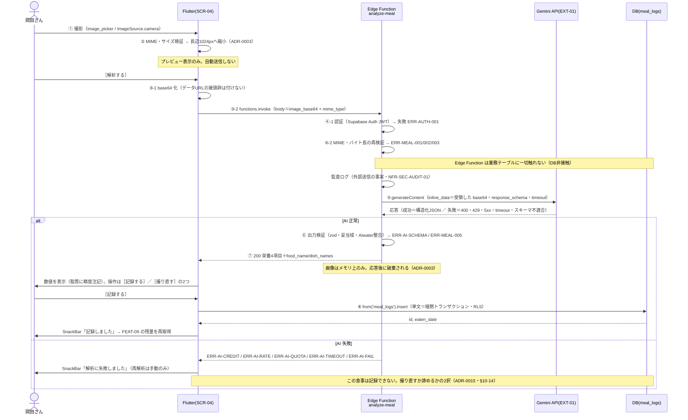

# FEAT-08 食事撮影・タンパク質計算 詳細設計

> **目的**: FEAT-XX を実装が迷わない粒度（入出力・バリデーション・クエリ・エラー・画面挙動・実装単位）まで具体化し、TDDの着手点を固定する。
> **書き方**: 実データは書かない。上位の正本（API契約＝`../../30_データ・IF設計/02_API設計.md` ／ 物理DB＝`../01_DB物理設計.md` ／ シーケンス＝`../../40_機能設計/01_シーケンス設計.md`）と矛盾させず、参照はIDで行う。横断方針（エラー分類・トランザクション・冪等・リトライ）は `../07_実装共通設計パターン.md` を正本とし本書では再定義しない。

> ⚠️ **本書はたたき台（2026-08-02 生成）**。岡田さんのレビューで確定する。

> 経緯: 2026-08-07 の改訂で一時 Supabase Storage 経由に改めた。
> 画像サイズの実測（base64 で最大約400KB）と Edge Function の上限確認により、2026-08-08 に直接POSTへ戻した。
> ADR-0003 の当初方針に戻したことになる。

> 📖 ID（`FEAT-` `NFR-` `RULE-` 等）の意味は [ID早見表](../../00_ID早見表.md) を参照。

## 目次
1. [概要](#1-概要)
2. [処理フロー](#2-処理フロー)
3. [入出力仕様](#3-入出力仕様)
4. [業務ロジック](#4-業務ロジック)
5. [データアクセス](#5-データアクセス)
6. [エラー処理](#6-エラー処理)
7. [画面挙動・状態別表示](#7-画面挙動状態別表示)
8. [実装単位](#8-実装単位)
9. [テスト観点](#9-テスト観点)
10. [敵対的検証・要確認事項](#10-敵対的検証要確認事項)

## 1. 概要

| 項目 | 内容 |
|---|---|
| 対応要件 | FEAT-08（食事撮影・タンパク質計算。本PJの中核機能） |
| 対応画面 | SCR-04 食事記録 |
| 対応API ① | `supabase.functions.invoke('analyze-meal')`（EXT-01・保存しない） |
| 対応API ② | `supabase.from('meal_logs').insert()`（保存） |
| 関連ルール | RULE-006（写真計算は AI を用いる）。保存値は RULE-002 の入力になる |
| 外部連携 | EXT-01。Gemini API を Edge Function から直接呼ぶ。画像入力＋構造化出力 |
| 性能目標 ① | NFR-PERF-04（食事写真計算 ≤20秒） |
| 性能目標 ② | NFR-PERF-02（保存 ≤1秒） |
| 状態 | 状態を持たない（ST-01/ST-02 は FEAT-04 の領域） |
| 優先度 | MUST |

### 全体の流れ（8ステップ）

| # | 主体 | 処理 |
|---|---|---|
| ① | Flutter | `image_picker`（`ImageSource.camera`）で撮影する |
| ② | Flutter | 端末側で長辺1024pxへ縮小する（ADR-0003・必須） |
| ③ | Flutter → Edge Function | 画像を base64 化し、`analyze-meal` へ直接POSTする |
| ④ | Edge Function | JWT検証 → 入力検証（MIME・バイト長） |
| ⑤ | Edge Function → Gemini | 受領した base64 を `inline_data` に載せて `generateContent` を呼ぶ |
| ⑥ | Edge Function | `response_schema` の構造化出力を zod で検証する |
| ⑦ | Edge Function → Flutter | 栄養4項目＋料理名を返す。画像はメモリ上のみで、どこにも永続化しない |
| ⑧ | Flutter → DB | 利用者が確認して［記録する］→ `meal_logs` に INSERT。値は修正できない（ADR-0015） |

### なぜ直接POSTするか

画像は Flutter から Edge Function へ直接送る。中継用のオブジェクトストレージは置かない（ADR-0003 の当初方針）。

#### 根拠1: 画像サイズの実測（PoC画像40枚・長辺1024pxへリサイズ後）

| 指標 | サイズ |
|---|---|
| 最小 | 61 KB |
| 中央値 | 163 KB |
| 平均 | 160 KB |
| 最大 | 303 KB |

base64 化で約1.33倍になる。**最大でも約400KB。**

#### 根拠2: Edge Function の実行上限（公式 Limits で確認済み・確定値）

| 項目 | 値 | 直接POSTとの関係 |
|---|---|---|
| メモリ | 256 MB | base64 400KB はメモリの 0.2% 未満 |
| CPU時間 | 2秒（**非同期I/Oを含まない**） | Gemini 待ちは非同期I/O。CPU時間に算入されない |
| 実行時間（wall clock） | 無料 150秒 ／ 有料 400秒 | 目標20秒（NFR-PERF-04）に対し余裕がある |
| リクエストボディ上限 | **記載なし（未文書化）** | 400KB で詰まる可能性は極めて低い |

- 検索で出る「10MB」「20MB／5MB」は**関数のデプロイサイズ**であり、リクエストボディ上限とは別物。混同しない。

> ⚠️ 要確認（人間判断）: Edge Function の**リクエストボディ上限は未文書化**。
> 実測400KBなら詰まる公算は低い。実装着手時に実サイズの画像で1回だけ疎通を検証する（§9 TC-FEAT08-18・§10-13）。

### 2段階に分ける理由

③解析と⑧保存を1操作にまとめない。

| 理由 | 根拠 |
|---|---|
| ピンボケ・見切れの失敗写真をそのまま記録する事故を防ぐ | `../../40_機能設計/01_シーケンス設計.md` §1 |
| 記録に値しない解析への従量課金を防ぐ | 同上 |

### 保存しないもの

**食事写真も料理名も永続化しない**（ADR-0003・`../../30_データ・IF設計/01_データモデル.md` §7）。

| 項目 | 扱い |
|---|---|
| 食事写真 | Edge Function のメモリ上にのみ存在する。ディスク・ログ・DBに書かない |
| 食事写真の列 | DBに持たない |
| `food_name` / `dish_names` | ⑦のレスポンスに含むが表示専用 |
| `food_name` / `dish_names` の保存 | ⑧のリクエストにも `meal_logs` にも存在しない |
| 栄養4項目 | `meal_logs` に保存する。保存後は FEAT-09（残量再計算）へ連携する |

#### 担保できる範囲（2026-08-08 確定）

**自システム内は設計で固める。** 担保は3点。

| 担保 | 内容 |
|---|---|
| DB | 画像・料理名の列を持たない（`../../30_データ・IF設計/01_データモデル.md` §7） |
| 保管 | 中継用のオブジェクト保管を使わない（ADR-0003） |
| ログ | 画像・base64 をログに出さない（§6 監査ログ） |

**Google 側の保持・学習利用は未確認のまま残る。** 実装着手前に調べる（§10-5）。

### ADR・段3との関係

> ~~⚠️ 要確認（人間判断）: 本書は Flutter + Supabase 構成（Vercel 不使用）で記述している。~~（**解決**・2026-08-08）
> ~~一方 ADR-0001（Vercel AI Gateway 採用）・ADR-0002（Next.js + Mantine 採用）は Vercel 前提のまま。~~
> ~~`../../30_データ・IF設計/02_API設計.md` も `/api/*` の Route Handler 契約のまま。~~
> ~~後継ADRの起票と段3の改訂が必要。~~
> **ADR-0010**（Flutter + Supabase）と **ADR-0011**（Gemini API 直接）で確定済み。
> ADR-0001・ADR-0002 は Superseded にした。段3も改訂済み。
> **ADR-0003（写真非保持）は改訂不要**（§10-12）。

> ~~⚠️ 要確認（人間判断）: 段3との乖離は次の3点。`../../30_データ・IF設計/02_API設計.md` §4.1 の契約表の改訂が要る。~~（**解決**・2026-08-08）
> **段3は改訂済み。** 同 §4.1 が Edge Function `analyze-meal` の契約になっている。
> 画像は「base64 にして JSON ボディに載せ、直接POSTする」と同 §4.1 に明記された。
> 保存の第2段は PostgREST `meal_logs` の insert（同 §3・§4.1）。
> 下表は旧契約との対比として残す。同 §3 末尾の対比表と一致する。

| # | 段3の契約 | 本書 |
|---|---|---|
| 1 | `POST /api/meals/analyze` | Edge Function `analyze-meal` |
| 2 | `POST /api/meals` | PostgREST への直接 INSERT |
| 3 | 画像を multipart で送る | base64 を JSON ボディに載せる |

## 2. 処理フロー

正本は `../../40_機能設計/01_シーケンス設計.md` §1。
本節はバリデーション位置・AI呼び出し引数・トランザクション境界・クエリ発行点まで詳細化する。



- ④の検証は課金を伴う⑤より前にすべて終える。
- 画像は関数のメモリ上にのみ存在する。ディスク・ログ・DBのいずれにも書かない（§5）。

## 3. 入出力仕様

3層に分けて定義する。

| 層 | 経路 | 節 |
|---|---|---|
| ① | Flutter → Edge Function `analyze-meal` | §3.1 |
| ② | Edge Function → Gemini API（EXT-01） | §3.2 |
| ③ | Flutter → PostgREST（`meal_logs` 保存） | §3.3 |
| — | 3層に共通のバリデーション規則 | §3.4 |

### 3.1 Flutter → Edge Function `analyze-meal`（EXT-01・非保存）

| 項目 | 内容 |
|---|---|
| 呼び出し | `supabase.functions.invoke('analyze-meal', body: {...})` |
| 実体 | `POST {SUPABASE_URL}/functions/v1/analyze-meal` |
| 認証 | 要（Supabase Auth の JWT。`supabase_flutter` が自動付与） |
| Content-Type | `application/json` |
| 送信形式 | **画像を base64 化して JSON ボディに載せる**（下の比較表で決定） |
| ボディサイズ | 実測 中央値 163 KB・最大 303 KB。base64 後で最大約 400 KB（§1 根拠1） |
| ステータス | 200 / 400 / 401 / 402 / 413 / 415 / 422 / 429 / 500 / 502 / 504 |
| 冪等性 | 非冪等。自動リトライなし（`../../30_データ・IF設計/02_API設計.md` §1） |

#### 送信形式の選定

**base64 JSON を採用する。** 理由と代償は次のとおり。

| 観点 | base64 JSON（**採用**） | `multipart/form-data`（不採用） |
|---|---|---|
| Gemini への受け渡し | `inline_data.data` が base64。再エンコード不要 | 関数側で base64 化し直す |
| クライアント実装 | `functions.invoke` がそのまま使え、JWT も自動で付く | 生の HTTP POST ＋ JWT 手付与になる |
| 関数側実装 | `req.json()` だけで済む | `formData()` のパースが増える |
| ボディサイズ | 1.33倍。最大約400KB で上限に届かない | 1.33倍にならない |
| 判断 | 上限に余裕があるため実装の単純さを採る | 400KB 規模では削減量が実装コストに見合わない |

```jsonc
// Request（型のみ。値は書かない）
{
  "image_base64": "string 必須",   // 長辺1024pxへリサイズ後の画像。データURLの接頭辞は付けない
  "mime_type":    "string 必須"    // image/jpeg | image/png | image/webp [仮]
}
// Response 200（型のみ。値は書かない）
{
  "food_name": "string",          // 表示専用・保存しない
  "dish_names": ["string"],       // 表示専用・保存しない
  "calories_kcal": "numeric(6,1)(>=0)",  // 小数第1位に丸めて返す（ADR-0022）
  "protein_g": "numeric(6,1)(>=0)",
  "sugar_g": "numeric(6,1)(>=0)",
  "fat_g": "numeric(6,1)(>=0)"
}
```

- Flutter 側の応答検証は **Dart のモデルクラス＋`fromJson`** で行う（zod は Deno 側のみ）。
- `image_base64` はリクエスト・レスポンスのログに出さない（§6 監査ログ）。

```dart
// app/lib/data/meal_analyze_repository.dart（抜粋・[仮]）
final res = await supabase.functions.invoke('analyze-meal', body: {
  'image_base64': base64Encode(resizedBytes),   // 長辺1024px（ADR-0003）・JPEG 品質0.8 [仮]
  'mime_type': 'image/jpeg',
});
final nutrition = MealNutrition.fromJson(res.data as Map<String, dynamic>);
```

### 3.2 Edge Function → Gemini API（EXT-01）呼び出し仕様

Deno の `fetch` で直接呼ぶ。SDK は使わない。モデルIDは**環境変数**から読み、コードに直書きしない。

API 仕様は **2026-08-08 に公式ドキュメントで確認済み**。**REST の JSON は snake_case。**
正本は `../03_外部連携IF/10_GeminiAPI連携.md §1`。

| 項目 | 値 | 根拠 |
|---|---|---|
| エンドポイント | `POST https://generativelanguage.googleapis.com/v1beta/{model=models/*}:generateContent` | EXT-01 |
| モデル | 環境変数 `GEMINI_MODEL`（既定 `gemini-3.5-flash`） | ADR-0001 |
| 認証 | ヘッダ `x-goog-api-key: $GEMINI_API_KEY`。**環境変数のみ**に置く | NFR-SEC-02 |
| プロンプト | `contents[0].parts[0].text = MEAL_ANALYZE_PROMPT`（文言は §10-9） | ADR-0001 |
| system 指示 | 使う場合は `systemInstruction: { parts: [{ text }] }` | EXT-01 |
| 画像の渡し方 | `contents[0].parts[1].inline_data = { mime_type, data }` | ADR-0003 |
| `inline_data.data` | **受領した base64 をそのまま使う**。再エンコードもディスク書き出しもしない | ADR-0003 |
| 構造化出力 | `generationConfig.response_mime_type = "application/json"` ＋ `generationConfig.response_schema` | EXT-01 |
| 応答の取り出し | `candidates[0].content.parts[0].text` を `JSON.parse` | EXT-01 |
| 応答の付帯情報 | `candidates[0].finishReason`／`usageMetadata`／`promptFeedback`（ログ用・§6） | EXT-01 |
| reasoning | **`thinking_level: medium`**（確定・ADR-0018）。取り得る値は `minimal`／`low`／`medium`（既定）／`high`。**`thinkingConfig` は誤り** | EXT-01 |
| 同上・併用禁止 | `thinking_budget`（旧）と併用すると 400 エラーになる。本PJは併用しない | EXT-01 |
| 同上・本PJの値 | 未確定。ADR-0001 は `high` だが根拠が失われた。`medium` と比較する | §10-17 |
| タイムアウト | `signal: AbortSignal.timeout(18_000)` `[仮]`。20秒に2秒の応答余裕 | NFR-PERF-04 |
| 自動リトライ | 行わない（従量課金のため） | `../../30_データ・IF設計/02_API設計.md` §1 |
| 429 のみ例外 | `rate_limit_exceeded` に限り、利用者操作なしで1回だけ指数バックオフ再試行 `[仮]` | 同上 |
| 同上・除外 | `quota_exceeded` は再試行しない。当日は回復しないため（ADR-0011） | §6 |
| フォールバック | **無し**。Gateway 相当の宣言的なモデル切替は使えない | §10-12 |
| 要るとき | Edge Function 内に自前で書く | §10-12 |

```ts
// supabase/functions/analyze-meal/_schema.ts（PoC実測の基線スキーマ・ADR-0001）
// generationConfig.response_schema に載せる（フィールド名は snake_case）
export const MEAL_NUTRITION_RESPONSE_SCHEMA = {
  type: 'object',
  properties: {
    food_name:     { type: 'string', description: '写真全体の料理・商品の推定名称（日本語、総称）' },
    dish_names:    { type: 'array', items: { type: 'string' },
                     description: '写真に写る個々の料理名。単品なら1件、複数なら全て列挙' },
    calories_kcal: { type: 'number', description: '写真に写っている食事全体(1人前)のカロリー (kcal)' },
    protein_g:     { type: 'number', description: 'タンパク質 (g)' },
    sugar_g:       { type: 'number', description: '糖質 (g)。食物繊維を除いた炭水化物量' },
    fat_g:         { type: 'number', description: '脂質 (g)' },
  },
  required: ['food_name', 'dish_names', 'calories_kcal', 'protein_g', 'sugar_g', 'fat_g'],
} as const;

// 応答の検証は zod（Deno/TS）で行う。Flutter 側は Dart のモデルクラス＋fromJson。
export const mealNutritionSchema = z.object({
  food_name:     z.string(),
  dish_names:    z.array(z.string()).max(20),
  calories_kcal: z.number(),
  protein_g:     z.number(),
  sugar_g:       z.number(),
  fat_g:         z.number(),
});
```

```ts
// supabase/functions/analyze-meal/index.ts（抜粋・[仮]）
const { image_base64: base64, mime_type: mimeType } = await req.json();
assertImageInput(base64, mimeType);                      // ERR-MEAL-001/002/003

const res = await fetch(
  `${GEMINI_ENDPOINT}/${Deno.env.get('GEMINI_MODEL')}:generateContent`,
  {
    method: 'POST',
    headers: {
      'content-type': 'application/json',
      'x-goog-api-key': Deno.env.get('GEMINI_API_KEY')!,  // 環境変数のみ・NFR-SEC-02
    },
    body: JSON.stringify({
      contents: [{ role: 'user', parts: [
        { text: MEAL_ANALYZE_PROMPT },
        { inline_data: { mime_type: mimeType, data: base64 } },  // 受領した base64 をそのまま渡す
      ]}],
      generationConfig: {
        response_mime_type: 'application/json',
        response_schema: MEAL_NUTRITION_RESPONSE_SCHEMA,
        thinking_level: 'medium',                         // 確定（ADR-0018）。thinking_budget は併用しない
        // thinking_budget（旧）は併用しない。併用すると 400 エラーになる
      },
    }),
    signal: AbortSignal.timeout(18_000),                  // [仮]
  },
);
// …ステータス判定 → JSON パース → mealNutritionSchema で検証
// ADR-0003: 画像は変数に持つだけ。ハンドラを抜ければ破棄される。削除処理は要らない。
```

### 3.3 Flutter → PostgREST（`meal_logs` 保存）

| 項目 | 内容 |
|---|---|
| 呼び出し | `supabase.from('meal_logs').insert({...}).select('id, eaten_date').single()` |
| 認証 | 要（JWT。RLS で `user_id = auth.uid()` の本人行のみ） |
| フィールド名 | snake_case＝DB列名と一致 |
| `meal_logs.user_id` の型 | **uuid**（`auth.uid()` と同じ値・ADR-0005） |
| `user_id` | **クライアントから送らない** |
| `user_id` の解決 | 列 DEFAULT `auth.uid()` `[仮]`（DEFAULT を使うか否かが `[仮]`。値と型は確定） |
| `user_id` の防御 | RLS の `WITH CHECK (user_id = auth.uid())` で他人の値を拒否する `[仮]` |
| 冪等性 | 非冪等（連投すると2行入る）。冪等キーは当面未使用 |
| `eaten_date` の決定 | **Flutter が端末のタイムゾーンで当日を決めて渡す**（ADR-0014） |
| `eaten_time` の決定 | 同上。端末時刻を渡す。null 可 |
| サーバ時刻 | 使わない。Supabase は UTC のため `CURRENT_DATE` に依存しない |
| 送る値 | ⑦で受けた栄養4項目をそのまま送る。利用者は編集できない（ADR-0015） |

```jsonc
// Insert する行（日時2項目は API設計 §4.1 に定義が無いため本書で定義。§10-1 参照）
{
  "calories_kcal": "numeric(6,1)(>=0) 必須",
  "protein_g":     "numeric(6,1)(>=0) 必須",
  "sugar_g":       "numeric(6,1)(>=0) 必須",
  "fat_g":         "numeric(6,1)(>=0) 必須",
  "eaten_date":    "date 必須",    // ISO 8601 (YYYY-MM-DD)。端末TZの当日をアプリが決める
  "eaten_time":    "time 任意"     // ISO 8601 (HH:mm)・null 可。端末時刻をアプリが決める
}
// 返り値
{ "id": "bigint", "eaten_date": "date" }
```

### 3.4 バリデーション規則

検証は2か所で行う。**課金を伴う⑤より前に必ず落とす。**

| 位置 | 主体 |
|---|---|
| 端末側（送信前） | Flutter |
| 関数側（再検証） | Edge Function |

| 項目 | 規則 | 検証位置 | 違反時 |
|---|---|---|---|
| 画像の実体 | 必須。非空かつ base64 として妥当。下限 1 KB `[仮]` | Flutter・Edge Function | ERR-MEAL-001 (400) |
| 画像 MIME | `image/jpeg` / `image/png` / `image/webp` のみ `[仮]` | Flutter・Edge Function | ERR-MEAL-002 (415) |
| MIME の判定 | `mime_type` の申告値と先頭のマジックバイトの両方で見る | Flutter・Edge Function | ERR-MEAL-002 (415) |
| 画像バイト長 | デコード後 ≤ 1 MB `[仮]`。実測最大 303 KB の約3倍 | Flutter・Edge Function | ERR-MEAL-003 (413) |
| AI出力の型 | `mealNutritionSchema` に適合すること | Edge Function | ERR-AI-SCHEMA (502) |
| AI出力の妥当域 | `calories_kcal` 0〜5000 ／ `protein_g` 0〜500 `[仮]` | Edge Function | ERR-MEAL-005 (422) |
| AI出力の妥当域 | `sugar_g` 0〜1000 ／ `fat_g` 0〜500 `[仮]` | Edge Function | ERR-MEAL-005 (422) |
| AI出力の禁止値 | 負値・NaN・Infinity は不可 | Edge Function | ERR-MEAL-005 (422) |
| 保存の栄養4項目 | 4項目すべて必須・数値・0以上（DB CHECK と同値） | Flutter・DB CHECK | ERR-MEAL-006 (400) |
| `eaten_date` | 端末TZで決めた ISO 8601 の日付。未来日・1年以上前は不可 `[仮]` | Flutter | ERR-MEAL-007 (400) |
| `eaten_time` | 端末時刻の ISO 8601 の時刻または null | Flutter | ERR-MEAL-007 (400) |

- 画像バイト長の上限は、長辺1024px（ADR-0003）・JPEG 品質0.8 `[仮]` のリサイズ後は通常大きく下回る。
- バイト長は base64 文字列長から算出する（`len/4*3 −パディング数`）。全体をデコードしない。
- マジックバイト判定は先頭数バイトだけをデコードして行う。
- 端末側の検証は UX のためのもの。信頼境界の外にあるため、これだけに依存しない。
- 関数側の再検証は省略しない。

**アプリ側のレート制限は実装しない**（ADR-0016・2026-08-08 確定）。カウンタテーブルも閾値も持たない。
コスト防御は2層に委ねる。

| 層 | 何が守るか |
|---|---|
| UI | 送信中は［解析する］を無効化する（二重送信の防止・§7） |
| Gemini API | 日次クォータ。超過は `ERR-AI-QUOTA`（429・retryable=false） |

- 根拠は利用者1人・1日3〜5回・想定コスト月$1前後・個人保守（ADR-0016）。
- `ERR-AI-QUOTA` の定義は `../../30_データ・IF設計/02_API設計.md` §5 が正本。
- 残る指摘は §10 #16（NFR-SEC-05 を掲げながら実装しない）。

## 4. 業務ロジック

RULE-006（写真からの栄養推定に AI を用いる）を実装する部分。
決定的な計算は純関数へ切り出し、単体テスト対象とする（NFR-QUAL-01）。

| 関数 | 実装先 | 責務 | 判定・式 |
|---|---|---|---|
| `resizeToMaxEdge(bytes, maxEdge)` | Dart | 端末側リサイズ（ADR-0003） | 長辺 > `maxEdge`(=1024) なら縦横比維持で縮小。以下なら再エンコードのみ |
| `decodedLength(base64)` | Dart / TS | デコード後バイト長を求める | `len/4*3 − パディング数`。全体をデコードしない |
| `assertImageInput(base64, mimeType)` | Dart / TS | 画像の入力検証 | MIME 許可リスト ∧ 1 KB ≤ `decodedLength` ≤ 1 MB `[仮]` ∧ マジックバイト一致 |
| `validateNutrition(obj)` | TS | AI出力の妥当域判定 | 4項目それぞれ `0 <= v <= 上限`（§3.4）。1つでも外れたら不合格 |
| `round1Nutrition(obj)` | TS | **AI応答を小数第1位に丸める**（ADR-0022） | 4項目それぞれ `Math.round(v * 10) / 10`。妥当域判定の**後**に適用し、丸めた値を返す |
| `atwaterDeviation(obj)` | TS / Dart | 栄養値の内部整合の目安 | `est = 4*protein_g + 4*sugar_g + 9*fat_g` |
| 同上 | 同上 | 同上 | `dev = abs(calories_kcal - est) / max(est, 1)` |
| `toMealLogRow(input)` | Dart | 保存行の組み立て | 栄養4項目＋`eaten_date`/`eaten_time` のみを写す |
| 同上 | 同上 | 同上 | `food_name`・`dish_names` は**写さない** |

- **AI（EXT-01）の応答は小数第1位に丸めて保存する**（ADR-0022）。Gemini は任意の小数を返しうる。
- 列は `numeric(6,1)`。丸めずに送ると DB 側で丸められ、画面に出した値と保存値がずれる。
- 丸めは Edge Function 側で行う。返す値と保存する値を同一にするため。

### Atwater整合の扱い

`atwaterDeviation` が 0.40 `[仮]` を超えても**保存はブロックしない。**

| 判断 | 内容 |
|---|---|
| 表示 | SCR-04 に「数値の整合が取れていない可能性があります。ご確認ください」の注意を出す |
| 理由 | AI推定は本来ずれる。機械的な拒否は誤検知が多い |
| 位置づけ | ADR-0001 のテスト観点「栄養値の妥当域＝Atwater整合」の実装受け皿 |

### 脂質の扱い（精度の弱点）

ADR-0001 の実測で、外食の脂質 MAPE は 32.7%。

| 指標 | 外食 | 備考 |
|---|---|---|
| kcal | 5.7% | — |
| たんぱく質 | 10.5% | **本機能の主目的** |
| 糖質 | 9.8% | n=10 の小標本（§10-7） |
| 脂質 | 32.7% | 既知の弱点 |
| 総合 | 14.7% | 家庭料理は 18.8% |

- 原因は揚げ油・ドレッシング等の「見えない油」。
- 対処は表示上のものにとどめる。
- **脂質の表示にのみ**「揚げ物・炒め物では実際より少なく出る傾向があります」の注記を添える（§7）。
- 値は修正できない（ADR-0015）。ずれが大きいと感じたら撮り直す。
- 主目的はタンパク質（MAPE 10.5%）であり、脂質誤差は目的指標を直接損なわない。

### 合計計算との関係

- 本機能が保存するのは1レコード＝1回の記録。
- 日次合計・残量算出は FEAT-09（タンパク質残量と不足分提示）が `meal_logs` を SUM して行う。
- 合計は `SUM(protein_g)`。係数を掛ける列は `meal_logs` に存在しない（ADR-0013・§10-2）。

## 5. データアクセス

### Edge Function `analyze-meal`

- **業務テーブルに一切触れない。** `meal_logs` を含むどのテーブルにも DML を発行しない。
- **永続化層に一切触れない。** 画像はメモリ上の値としてだけ存在する（ADR-0003）。
- したがってトランザクションは存在しない。
- 行うのは Supabase Auth による JWT 検証と、入力・出力の検証のみ。
- 解析結果は永続化されず応答として返るだけ。
- ⑧が呼ばれなければ `meal_logs` には何も残らない。

| 観点 | 内容 |
|---|---|
| 読み書き対象 | 無し（DB・ファイル・外部保管のいずれも使わない） |
| 画像の生存期間 | リクエスト受信からレスポンス返却まで |
| 画像の破棄 | ハンドラを抜ければ破棄される |
| 削除処理 | **不要。** 保存しないため削除する対象が存在しない |
| ADR-0003 との関係 | 「構造的に写真が残らない」がそのまま成立する |

- 画像バイト列・base64 文字列を `console.log` に出さない（§6・`../05_ログ設計.md`）。

### `meal_logs` への保存（PostgREST）

- Flutter から単一行の INSERT 1文のみ。単文＝暗黙トランザクションで完結する。
- 明示的な `BEGIN` / `COMMIT` は不要。副作用のある処理を同一境界に持たない。

```sql
-- FEAT-08 ⑧ 食事記録の保存。PostgREST が発行する単文＝暗黙トランザクション。
-- 画像・料理名の列は存在しない（ADR-0003）。user_id は uuid で、列 DEFAULT auth.uid() で解決する [仮]。
-- eaten_date / eaten_time は端末TZでアプリが決めた値（ADR-0014）。CURRENT_DATE は使わない。
INSERT INTO meal_logs (
  calories_kcal, protein_g, sugar_g, fat_g, eaten_date, eaten_time
) VALUES ($1, $2, $3, $4, $5, $6)
RETURNING id, eaten_date;
```

| 観点 | 内容 |
|---|---|
| 対象テーブル | `meal_logs`（INSERT のみ）。Edge Function は対象テーブルなし |
| 使用INDEX | 本 INSERT は INDEX 探索を伴わない |
| INDEX の更新コスト | `ix_meal_logs_user_date` の更新のみ。同 INDEX は FEAT-09 の当日 SUM が使う |
| `meal_logs.user_id` の型 | **uuid**。`users.id` が uuid＝`auth.users.id` のため（案A・ADR-0005） |
| RLS | `user_id = auth.uid()` の**直接比較**で本人行のみ（3区分の「本人のみ」） |
| RLS の正本 | `../01_DB物理設計.md` §3・`../../30_データ・IF設計/01_データモデル.md` §7 |
| RLS の3区分 | 横断方針は `../07_実装共通設計パターン.md` §1 |
| `user_id` の詐称防止 | クライアントが送っても RLS の `WITH CHECK (user_id = auth.uid())` で拒否する |
| `user_id` の解決 | 列 DEFAULT `auth.uid()` で自動解決する `[仮]` |
| トランザクション境界 | Edge Function ＝なし（DB非接触） |
| 同上（保存側） | INSERT 1文の暗黙トランザクション。両者にまたがる境界は無い |
| 外部I/Oとの関係 | EXT-01 呼び出しはトランザクション外。DB非接触により構造的に保証される |

> ~~⚠️ 要確認（人間判断）: `user_id` と Supabase `auth.uid()` の紐付け方式は未確定。本書では方式を決めない。~~（**解決**・2026-08-08）
> **案A で確定**（ADR-0005）。`users.id` を uuid にして `auth.users.id` と同値にしたため、`meal_logs.user_id` も uuid になる。
> 列 DEFAULT も RLS も `auth.uid()` をそのまま使う。変換・対応表は要らない。正本は `../01_DB物理設計.md` §3・`../06_DB設計規約.md`。

## 6. エラー処理

分類・ログ出力の横断方針は `../07_実装共通設計パターン.md` を正本とする。
本節は FEAT-08 固有の割り当て（ドメイン接頭辞 `ERR-MEAL-*`）。採番は 001〜009 で確定する。

### ERR 一覧

| ERR-ID | HTTP | 発生条件 | 利用者向けメッセージ（意図） | retryable | ログ |
|---|---|---|---|---|---|
| ERR-AUTH-001 | 401 | セッション無効・未ログイン | 再ログインを促す | false | 認証失敗（NFR-SEC-AUDIT-02） |
| ERR-MEAL-001 | 400 | 画像が空・`image_base64` が不正 | 写真を選び直すよう促す | false | warn（AI呼び出し前） |
| ERR-MEAL-002 | 415 | 許可外 MIME（申告値またはマジックバイト） | 対応形式（JPEG/PNG/WebP）を示す | false | warn |
| ERR-MEAL-003 | 413 | 画像がデコード後 1 MB `[仮]` 超 | 撮り直し／縮小を促す | false | warn（端末側リサイズの不具合を示唆） |
| ERR-MEAL-004 | — | **欠番。** AI応答の型不適合は共通の `ERR-AI-SCHEMA` で受ける（ADR-0011・§3.4） | — | — | — |
| ERR-MEAL-005 | 422 | AI出力が妥当域外（負値・上限超・NaN） | 「うまく読み取れませんでした。撮り直してください」 | false | error＋出力値 |
| ERR-MEAL-006 | 400 | 保存時の栄養4項目が欠落・非数値・負値 | 撮り直しを促す（利用者は値を直せない） | false | warn |
| ERR-MEAL-007 | 400 | `eaten_date`/`eaten_time` の形式不正・未来日 | 端末の日時設定を確認するよう促す | false | warn |
| ERR-MEAL-008 | — | **欠番。** アプリ側レート制限を実装しないため未使用（ADR-0016・§3.4・§10 #11） | — | — | — |
| ERR-MEAL-009 | 500 | `meal_logs` INSERT 失敗（CHECK違反・RLS拒否・接続断） | 「記録に失敗しました」＋再試行導線 | true | error＋SQLSTATE（値はマスキング） |
| ERR-AI-CREDIT | 402 | Gemini API が課金無効・請求未設定で拒否（**400 `failed_precondition`**・ADR-0011） | AI機能の一時停止を伝える | false | error（運用者向けアラート対象） |
| ERR-AI-RATE | 429 | Gemini API の分/秒あたりのレート制限（**429 `rate_limit_exceeded`**・ADR-0011） | 少し待って再試行するよう促す | true（指数バックオフ） | warn |
| ERR-AI-QUOTA | 429 | Gemini API の日次クォータ超過（**429 `quota_exceeded`**・ADR-0011） | 当日は回復しない旨を伝える | false | error（運用者向けアラート対象） |
| ERR-AI-TIMEOUT | 504 | `AbortSignal` 発火（18秒 `[仮]`）、または 504 `deadline_exceeded`・接続断 | 「時間内に解析できませんでした」 | false（課金抑止のため自動再試行しない） | error＋所要時間 |
| ERR-AI-FAIL | 500 | キー無効・権限なし（401 `authentication`／403 `permission_denied`）、モデル不明（404 `model_not_found`）、API側の障害（500 `api_error`／503 `service_unavailable`）、不達 | 解析失敗を伝え、撮り直しを案内 | false | error（NFR-AVAIL-05 の縮退判定材料） |
| ERR-AI-SCHEMA | 502 | 200 だが AI応答が `mealNutritionSchema` に不適合。呼び出し自体は成功している（ADR-0011） | 「うまく読み取れませんでした。撮り直してください」 | false（手動再実行のみ） | error＋生テキスト要約（画像は残さない） |

- ERR-MEAL-003 は通常、端末側リサイズにより到達しない。
- 欠番の ERR-MEAL-004 / 008 は**採番を変えずに残す。** ERR-MEAL-005〜009 を繰り上げない。

**429 は2種類あり、retryable が逆になる。**

| Gemini の `error.status` | 意味 | 本PJ | retryable |
|---|---|---|---|
| `rate_limit_exceeded` | 分/秒あたりの上限超過 | ERR-AI-RATE | true |
| `quota_exceeded` | 日次クォータ超過 | ERR-AI-QUOTA | false |

- HTTP ステータスだけで判定しない。`error.status` を必ず見る。
- 見ずに判定すると、日次クォータ切れをバックオフで叩き続ける。

`ERR-MEAL-005`（妥当域外）は共通ERRに寄せず、FEAT-08 固有のまま残す。理由は2つ。

| 事項 | 内容 |
|---|---|
| 原因が違う | 型は `mealNutritionSchema` に適合している。逸脱するのは業務上の妥当域である |
| 判定基準が固有 | 上限値（kcal 0〜5000 等・§3.4）は FEAT-08 の業務判断で、共通契約に持てない |

- 写像の正本は `../03_外部連携IF/10_GeminiAPI連携.md` の「ERRマッピング」。

### 通信断の扱い

Edge Function に到達しない通信断には**専用の ERR を設けない**。

| 観点 | 扱い |
|---|---|
| 分類 | 端末側のネットワークエラー |
| 表示 | 解析失敗として通知する |
| 再送 | 利用者の明示操作のみ。自動再送はしない |

### 監査ログ

- ⑤で EXT-01（Google Gemini API）へ画像を送信する事実を、**送信前に**1件記録する（NFR-SEC-AUDIT-01）。
- 記録項目は `actor` / `occurred_at` / `action=外部送信` / `target=EXT-01` の4つ。
- あわせて モデルID / 画像バイト長 / `correlation_id` / `result` を記録する。
- **画像そのもの・base64・画像を復元しうるデータは記録しない**（ADR-0003）。
- 記録してよいのはバイト長などのメタ情報のみ。
- 出力先は Supabase Edge Function ログ（1行1JSON・`service=okada-fit-fn`）。
- 項目定義の正本は `../05_ログ設計.md`。

### 縮退（NFR-AVAIL-05）

**AI機能だけ止まる。トレーニング記録と閲覧は継続する。ただし食事の記録はできない。**

| 障害 | 影響 | 継続できること |
|---|---|---|
| `ERR-AI-*` 系 | AI 機能のみ停止。**その食事は記録できない** | トレーニング記録・過去記録の閲覧・FEAT-09 の残量表示 |
| 通信断（Edge Function に到達しない） | 写真からの解析のみ停止。同上 | 同上 |

- 手入力での記録は**行わない**（ADR-0015）。利用者はタンパク質量を知らないため代替にならない。
- 利用者に残るのは［撮り直す］か、その食事を諦めるかの2択。
- NFR-AVAIL-05（AI障害時の縮退）の文言（記録は継続する）と実態が合わない。要件側の見直しが要る（§10-14）。

> ERRの完全列挙の正本は `../../60_テスト設計/02_RED母集合_受入基準・状態・エラー.md`（段6で集約）。本表はその入力とする。

## 7. 画面挙動・状態別表示

SCR-04 食事記録。`ERR-MEAL-*` の番号順ではなく、利用者の操作段階で表示を切り替える。

| 状態 | 表示 | 操作可否 |
|---|---|---|
| 初期/空 | 撮影ボタン（`image_picker` / `ImageSource.camera`）＋説明文 | 撮影/選択のみ可 |
| 同上 | 当日の記録一覧。0件なら淡色の `Text` で空表示 | 同上 |
| プレビュー（未送信） | 縮小後画像を `Image.memory` で表示 | ［解析する］可 |
| 同上 | ［解析する］`FilledButton`＋［撮り直す］ | 同上 |
| 同上 | **この時点では端末外へ何も送らない**（ADR-0003） | 同上 |
| 読込中（送信＋解析） | ［解析する］を無効化し `CircularProgressIndicator` を出す | 全操作不可（キャンセルのみ可） |
| 同上 | 二重送信を禁止する | 同上 |
| 同上 | 結果領域は `shimmer` もしくは `CircularProgressIndicator` | 同上 |
| 同上 | 20秒想定の旨を `Text`（小サイズ）で明示（NFR-PERF-04） | 同上 |
| 成功（解析結果） | `food_name` を見出し、`dish_names` を `Chip` 群で表示 | ［記録する］／［撮り直す］可 |
| 同上 | 栄養4項目は `Text` で**表示するだけ**。入力欄にしない（ADR-0015） | 同上 |
| 同上 | 値は AI 出力のまま。利用者は修正できない | 同上 |
| 同上 | 脂質の行に `Text`（小サイズ）で精度注記（§4） | 同上 |
| 同上 | Atwater 乖離時は警告色の `Card`／`Banner` | 同上 |
| 読込中（保存） | ［記録する］を無効化し `CircularProgressIndicator`。楽観的更新はしない | 全操作不可 |
| 成功（保存） | `ScaffoldMessenger.showSnackBar`（成功色）で「記録しました」 | 続けて撮影可 |
| 同上 | 表示をリセットし、当日一覧と FEAT-09 の残量を再取得 | 同上 |
| エラー（AI系・送信系） | `ScaffoldMessenger.showSnackBar`（エラー色） | ［撮り直す］のみ可 |
| 同上 | 結果領域に ERR-ID 由来のメッセージ | 同上 |
| 同上 | **その食事は記録できない**。手入力の導線は置かない（ADR-0015・§10-14） | 同上 |
| エラー（入力系） | 画像の形式・サイズのエラーを結果領域に出す。SnackBar は出さない | ［撮り直す］のみ可 |

- 撮影→プレビュー→［解析する］→［記録する］の順序は固定する。
- 解析後の操作は［記録する］と［撮り直す］の**2つだけ**（ADR-0015）。
- **手入力の経路は持たない。** 利用者はタンパク質量を知らない。それを知るために写真を撮る。
- よって手入力は代替手段にならない。AI が失敗した食事は記録できない。
- **自動送信・自動保存はしない**（ADR-0003）。
- 送信は［解析する］押下時に開始する。送信中は単一の `CircularProgressIndicator` のみを出す。
- 進捗率は表示しない。1回のPOSTで完結し、400KB 規模では意味を持たないため。
- 解析結果は端末のウィジェット状態のみで保持する。サーバ側には持たせない（改ざん可能性は §10-4）。
- キャンセル時は Edge Function を呼ばずに終わる。端末外には何も残らない。

## 8. 実装単位

| # | ファイル | 役割 | 主なシグネチャ |
|---|---|---|---|
| 1 | `supabase/functions/analyze-meal/index.ts` | Edge Function 本体。認証→入力検証→EXT-01→出力検証→返却 | `Deno.serve(handler)` |
| 1 | 同上 | DB非接触・永続化なし | `async function handler(req: Request): Promise<Response>` |
| 2 | `supabase/functions/analyze-meal/_schema.ts` | `response_schema`（Gemini 用）と zod スキーマ・型（§3.2） | `export const MEAL_NUTRITION_RESPONSE_SCHEMA` |
| 2 | 同上 | 同上 | `export const mealNutritionSchema` / `export type MealNutrition` |
| 3 | `supabase/functions/analyze-meal/_gemini.ts` | EXT-01 呼び出しの隔離層。エンドポイント・モデルID・タイムアウトを集約 | `export function callGemini(base64: string, mimeType: string): Promise<MealNutrition>` |
| 4 | `supabase/functions/analyze-meal/_validation.ts` | 純関数群。画像入力・AI出力の妥当域・Atwater（§4） | `export function assertImageInput(b64: string, mimeType: string): void` |
| 4 | 同上 | 同上 | `export function validateNutrition(o: unknown): MealNutrition` |
| 4 | 同上 | 同上 | `export function atwaterDeviation(o: MealNutrition): number` |
| 5 | `app/lib/features/meals/meal_capture_page.dart` | SCR-04。撮影→プレビュー→解析→確認→記録の画面（§7） | `class MealCapturePage extends StatefulWidget` |
| 6 | `app/lib/features/meals/meal_analyze_controller.dart` | 画面状態の管理。送信→invoke→結果保持→保存の進行制御 | `Future<void> analyze()` / `Future<void> save()` |
| 7 | `app/lib/features/meals/meal_nutrition.dart` | 応答のモデルクラス（zod ではなく Dart 側の型） | `class MealNutrition { factory MealNutrition.fromJson(Map<String, dynamic> j); }` |
| 8 | `app/lib/data/meal_analyze_repository.dart` | `analyze-meal` の invoke（§3.1） | `Future<MealNutrition> analyze(Uint8List bytes, String mimeType)` |
| 9 | `app/lib/data/meal_log_repository.dart` | `meal_logs` への INSERT（§3.3・§5） | `Future<MealLogCreated> insert(MealLogRow row)` |
| 10 | `app/lib/domain/image_resize.dart` | 端末側リサイズ（ADR-0003・§4） | `Uint8List resizeToMaxEdge(Uint8List bytes, int maxEdge)` |
| 11 | `app/lib/domain/meal_validation.dart` | 入力・保存値の検証・Atwater（Dart 側の純関数・単体テスト対象） | `void assertImageInput(String b64, String mimeType)` |
| 11 | 同上 | 同上 | `double atwaterDeviation(MealNutrition o)` |

- **レート制限のモジュールは作らない**（旧 `_shared/rate_limit.ts`）。実装しない方針で確定（ADR-0016・§3.4）。

## 9. テスト観点

| TC-ID | 観点 | 期待 |
|---|---|---|
| TC-FEAT08-01 | 正常系 | 有効画像で 200、栄養4項目＋`food_name`/`dish_names` を返す |
| TC-FEAT08-02 | Edge Function がDBに書かない | `analyze-meal` を呼んでも `meal_logs` の行数が変化しない（⑧を呼ばなければ0件のまま） |
| TC-FEAT08-03 | 画像の非永続化 | 実行後、画像バイト列・base64 がログ・DB・端末外のどこにも存在しない（ADR-0003） |
| TC-FEAT08-04 | プレビュー段階で未送信 | ［解析する］押下前に `analyze-meal` への POST が発生しない |
| TC-FEAT08-05 | 入力拒否（課金前に弾く） | 許可外MIMEで ERR-MEAL-002 (415)、デコード後 1 MB `[仮]` 超で ERR-MEAL-003 (413)。いずれも EXT-01 を呼ばない |
| TC-FEAT08-06 | AI出力の不正 | スキーマ不適合で ERR-AI-SCHEMA (502)、妥当域外で ERR-MEAL-005 (422)。自動リトライしない |
| TC-FEAT08-07 | Atwater乖離 | 乖離 0.40 `[仮]` 超でも 200 を返し、警告フラグのみ立つ（保存はブロックしない） |
| TC-FEAT08-08 | フォールバックが無いこと | 既定モデル失敗時に自動でモデル切替せず ERR-AI-FAIL を返す（Gateway 相当の宣言的切替は使わない・§10-12） |
| TC-FEAT08-09 | AI障害の分岐 | 429 `rate_limit_exceeded`→ERR-AI-RATE（バックオフ後）／429 `quota_exceeded`→ERR-AI-QUOTA（再試行しない）／400 `failed_precondition`→ERR-AI-CREDIT (402)／18秒 `[仮]` 超→ERR-AI-TIMEOUT (504) |
| TC-FEAT08-10 | 縮退 | EXT-01 全断でも過去記録の閲覧・FEAT-09 残量が動作する。その食事は記録できない（§10-14） |
| TC-FEAT08-11 | 保存の正常系 | 栄養4項目＋日時で1行 INSERT、画像・料理名の列が存在しない |
| TC-FEAT08-12 | 保存の検証 | 負値・欠落で ERR-MEAL-006 (400)、不正日時で ERR-MEAL-007 (400)。DBに行が増えない |
| TC-FEAT08-13 | 非冪等・RLS | 同一内容2回送信で2行入る（現仕様・§10-6）。`user_id` を詐称しても RLS の `WITH CHECK` で拒否される |
| TC-FEAT08-14 | 監査ログ | 外部送信ごとに監査ログ1件。画像バイト列・base64 を含まない（NFR-SEC-AUDIT-01） |
| TC-FEAT08-15 | 性能 | ③〜⑦が20秒以内に応答する（NFR-PERF-04）、⑧が1秒以内（NFR-PERF-02） |
| TC-FEAT08-16 | 画像サイズの上限（境界） | 1 MB `[仮]` 直下は 200、直上は ERR-MEAL-003 (413)。端末側でも送信前に弾く。1 KB `[仮]` 未満は ERR-MEAL-001 (400) |
| TC-FEAT08-17 | メモリ上にしか置かないこと | ハンドラ内で画像をファイル・DB・外部保管へ書く呼び出しが1つも無い（実装検査）。応答後に画像を再取得する手段が存在しない |
| TC-FEAT08-18 | 実サイズでの疎通（ボディ上限の確認） | 実測相当（中央値163KB・最大303KB／base64 で約400KB）の画像で 200 が返る。ボディ上限が未文書化のため実装時に1回だけ実施する（§1・§10-13） |
| TC-FEAT08-19 | 手修正・手入力の経路が無いこと | 結果画面に栄養値の入力欄が1つも無く、保存値が⑦の応答と完全に一致する。手入力で記録する導線も存在しない（ADR-0015） |

受入基準（G/W/T）の候補:
- [AC] Given 有効な食事写真 When ［解析する］を押す Then 栄養4項目が20秒以内に表示され、DBには何も保存されていない
- [AC] Given 有効な食事写真 When 解析が完了する Then 画像はサーバのどこにも永続化されていない（ログ・DBを含む）
- [AC] Given 解析結果が表示されている When ［記録する］を押す Then 表示された栄養4項目がそのまま1行保存され、写真は保存されない
- [AC] Given 解析結果が表示されている When 画面を操作する Then 栄養値を修正する手段が無く、［記録する］と［撮り直す］だけが選べる
- [AC] Given Gemini API が不達 When ［解析する］を押す Then 解析失敗が通知され、その食事は記録できない。過去の記録閲覧は継続できる
- [AC] Given 許可外形式または上限超のファイル When ［解析する］を押す Then EXT-01 を呼ばずにエラーを返す（従量課金を発生させない）

> 受入基準・ST・ERR の**正本は段6**（`../../60_テスト設計/02_RED母集合_受入基準・状態・エラー.md`・本PR対象外）。本節はその母集合への入力。

## 10. 敵対的検証・要確認事項

| # | 論点 | 内容 | 重大度 |
|---|---|---|---|
| 1 | ~~`eaten_date`/`eaten_time` を誰が決めるか未定義~~（**解決**） | ~~段3 §4.1 に定義が無く `eaten_date` は not null。本書は §3.3 でクライアント送信 `[仮]`~~ → **端末時刻で確定**（ADR-0014・2026-08-08）。Flutter が端末TZで日付・時刻を決めて渡す。サーバの `CURRENT_DATE` は使わない。FEAT-05・FEAT-09 も同じ規則。段3 §4.1 への追記は残る | — |
| 2 | ~~`intake_count` の業務的意味が未確定~~（**解決**） | ~~栄養4項目が1食分かその倍かで FEAT-09 の日次合計が変わる~~ → **列を削除した**（ADR-0013・2026-08-08）。合計は導出値であり列で持つとずれるため。日次合計は `SUM(protein_g)` で算出する。係数を掛けるかという論点は消滅した | — |
| 3 | ~~⑦→⑧の間の手修正の可否~~（**解決**） | ~~§7 で手修正可としたが要件に明記が無い~~ → **手修正は不可**（ADR-0015・2026-08-08）。解析結果は表示のみで入力欄にしない。手入力の経路も持たない。利用者はタンパク質量を知らず、それを知るために撮影するため、手入力は代替にならない。帰結は #14 | — |
| 4 | 解析結果を保存へ渡す経路がクライアント経由 | ⑧の INSERT は Flutter が PostgREST へ直接発行するため、保存値をクライアントが自由に構成できる。DB 側に照合対象が無く RLS も「誰の行か」しか守らない。短命トークンや RPC 化で検証できるが構成が増える | 🟡 中 |
| 5 | 画像非保持は自システム内だけ担保する（**部分解決**） | **自システム内は確定済み**（2026-08-08・§1）。DB に列を持たず、保管を使わず、ログに画像を出さない。**残るのは Google 側の設定のみ**。保持・学習利用は未確認で、実装着手前に調べる。NFR-SEC-06 は `⚠️ 要確認` のまま維持する | 🟡 中 |
| 6 | 二重記録を防ぐ手段が無い | ⑧は非冪等で、再送・二重タップで2行入る（ボタン無効化は緩和にすぎない）。同じ食事を2回食べることは正当なため UNIQUE を置ける自然キーが無く、新列追加も禁止。表示側の重複検知か段3 §1 の冪等キー運用が要る | 🟡 中 |
| 7 | 脂質の精度をUIでどう扱うか（糖質 9.8% も n=10 の小標本） | 脂質 MAPE 32.7% は上位5モデル中で最悪（ADR-0001）。**手修正で補正する道は無くなった**（#3・ADR-0015） | 🟡 中 |
| 〃 | 〃 | 残る選択肢は3つ。(a) 注記のみで許容する（本案）、(b) 非表示にする＝0保存は虚偽値になるため不可、(c) モデルを Pro へ昇格＝+1.7秒 | 〃 |
| 〃 | 〃 | 現設計で使うのはタンパク質（MAPE 10.5%）のみ。脂質は記録されるが画面に出ない | 〃 |
| 8 | 複数料理の内訳を持てない | `dish_names[]` が複数でも栄養値は写真全体の合計としか解釈できない。定食の一部を残す・小鉢だけ別カウントといった調整ができず、利用者は手で按分するしかない。子テーブルが要るが新テーブル追加は禁止のため合計として確定する | 🟡 中 |
| 9 | プロンプト文言が未確定 | §3.2 の `MEAL_ANALYZE_PROMPT` は PoC の実測プロンプト（コンビニ・外食チェーン前提）が基線。家庭料理も含む本番用途では文言が合わない。変えると ADR-0001 の実測 MAPE の前提が崩れ再ベンチが要る | 🟡 中 |
| 10 | 横断方針の正本が未記入 | `../07_実装共通設計パターン.md` はエラー分類・トランザクション・冪等・リトライの各表が未記入。本書の §5・§6 は FEAT-08 固有の判断として先行して書いている。同ファイル確定時に齟齬が出る可能性がある | 🟡 中 |
| 11 | ~~レート制限の実装基盤が未決~~（**解決**） | **2026-08-08 決定。実装しないことで確定**（ADR-0016）。カウンタテーブルも閾値も持たない。永続カウンタの置き場所を決める議論は不要になった（§3.4） | — |
| 〃 | 〃 | 防御は2層。**UI は送信中に［解析する］を無効化**し、**Gemini API の日次クォータ**が超過を `ERR-AI-QUOTA` で止める（§3.4・§7） | — |
| 〃 | 〃 | `ERR-MEAL-008` は**欠番**として残す。他の ERR-ID を繰り上げない（§6）。残る指摘は #16 | — |
| 12 | ~~**根拠ADRのうち ADR-0001 が改訂を要する**（ADR-0002 も Flutter へ置換）~~（**解決**） | **ADR-0011 が根拠になった**（Gemini API 直接・フォールバック不在の受容・TC-FEAT08-08）。ADR-0002 は **ADR-0010** で置換済み。**ADR-0003 は改訂不要**（直接送信・端末側リサイズ必須という当初方針と整合・§1） | — |
| 13 | ボディ上限が未文書化のまま直接POSTを採っている | 公式 Limits に記載が無く実測で判断。実測は中央値 163 KB・最大 303 KB、base64 で約 400 KB＝メモリ 256 MB の 0.2% 未満。上限値は不明のため実装時に1回疎通検証する（TC-FEAT08-18） | 🟡 中 |
| 14 | AI 失敗時に食事を記録できない（#3 の確定に伴う新規） | NFR-AVAIL-05 は「AI不達時も記録・閲覧は継続」としているが、食事記録では成立しない。手入力は代替にならない（利用者が値を知らないため・ADR-0015）。トレーニング記録と閲覧は影響を受けず要件全体は崩れないが、**要件の文言が実態と合っていない**。要件側の見直しが要る | 🟡 中 |
| 15 | 端末時刻を信頼する（#1 の確定に伴う新規） | 日付は端末TZで決める（ADR-0014）。利用者が端末の日付を変えると記録日がずれる。単一利用者の現行運用では実害が小さいため受容する。サーバ側に照合材料は持たない | 🟢 低 |
| 16 | NFR-SEC-05 を掲げながら実装しない（#11 の確定に伴う新規） | レート制限は要件化されているが実装しない。**要件側の見直しが要る**。`GEMINI_API_KEY` が漏れた場合、日次クォータを使い切られるまで止められない。**指摘の内容は `FEAT-03_AIメニュー提案.md` §10 #18 と同じ**。要件側への申し送りも同書に集約する | 🟡 中 |
| 17 | ~~`thinking_level` の値に根拠が無い~~（**解決**） | ~~ADR-0001 の `high` は旧パラメータ体系の実測で根拠が失われた~~ → **`medium` を採用**（2026-08-08・ADR-0018）。既定であり公式の推奨。`high` を選び直す根拠が無い。精度が足りなければ `high` へ上げる（1行の変更で戻せる。ADR-0018 の ⚠️ に残課題） | — |
| 18 | 構造化出力と思考の併用（参考情報） | 応答が空になる・トークン消費が膨らむという報告がある。ただし File Search 併用時の事例で、本PJ（`generateContent` 単体・File Search なし）とは条件が違う。現時点で本PJに影響するとは言えない。実装時に構造化出力が正しく返るかを確認する | 🟢 低 |
| 19 | **`supabase_flutter` が `numeric` をどう返すか未確認** | 栄養4項目を `numeric(6,1)` に変えた（ADR-0022）。PostgreSQL の `numeric` は、ドライバによって**文字列で返る**ことがある。`.select()` の返り値で `double.parse` が要るかもしれない。**変換を1箇所に集約する**設計にしておき、実装初日に実挙動を確認する。Dart 側の型は `double` のまま | 🟡 中 |

> ~~⚠️ 要確認（人間判断）: #12 ADR-0001（Vercel AI Gateway 採用）の改訂または後継ADRの起票が必要です。~~（**解決**・2026-08-08）
> ~~直接呼び出しで宣言的フォールバックが失われる点を、許容するか代替を実装するかを決めてください。~~
> ~~ADR-0002（Next.js + Mantine 採用）も Flutter への置き換えが必要です。~~
> **ADR-0011** を起票し、フォールバック不在の受容を明記しました。ADR-0001 は Superseded です。
> ADR-0002 は **ADR-0010** で置換しました。
> ADR-0003（写真非保持）は当初方針どおりのため改訂は不要です。

> ⚠️ 要確認（人間判断）: #19 `supabase_flutter` が `numeric` を数値で返すか文字列で返すか（🟡 中）。
> `numeric` は、ドライバによって**文字列で返る**ことがある。Dart 側で `double.parse` が要るかもしれない。
> **変換を1箇所に集約する**設計にしておき、実装初日に実挙動を確認する。
> 対象は `meal_logs` の栄養4項目。Edge Function の応答（JSON 数値）は影響を受けない。

> ⚠️ 要確認（人間判断）: #13 Edge Function のリクエストボディ上限は未文書化です。
> 実装着手時に実サイズ（base64 で約400KB）の画像で疎通を1回検証し、結果を本書に記録してください。
> 検証に失敗した場合のみ、分割送信や中継の要否を再検討します。

> ~~⚠️ 要確認（人間判断）: #1 `eaten_date`/`eaten_time` の決定主体を確定してください。~~（**解決**・2026-08-08）
> ~~選択肢はクライアント時刻／サーバ時刻／利用者入力の3つ。FEAT-05 の日付境界規則と同時に決めてください。~~
> **端末時刻で確定**（ADR-0014）。Flutter が端末TZで日付・時刻を決めて渡します。
> `../../30_データ・IF設計/02_API設計.md` §4.1 への追記は引き続き必要です。

> ~~⚠️ 要確認（人間判断）: #2 `meal_logs` の摂取数の業務的意味を確定してください。~~（**解決**・2026-08-08）
> ~~栄養4項目が1食分かその倍かで、FEAT-09 の合計算出式が変わります。~~
> **列を削除しました**（ADR-0013）。合計は導出値のため列で持ちません。
> 日次合計は `SUM(protein_g)` で算出します。係数の論点は消滅しました。

> ~~⚠️ 要確認（人間判断）: #3 解析結果と保存の間で栄養値を手修正できる仕様としてよいか承認してください。~~（**解決**・2026-08-08）
> ~~可とする場合、記録値がAI推定か手入力かを区別しない（`meal_logs` に由来列を追加しない）ことも併せて承認が必要です。~~
> **手修正は不可で確定**（ADR-0015）。表示のみとし、手入力の経路も持ちません。
> 記録値は常に AI 推定であるため、由来列は不要です。

> ⚠️ 要確認（人間判断）: #14 NFR-AVAIL-05 の文言を見直してください。
> AI が失敗した食事は記録できません。手入力は代替になりません（ADR-0015）。
> トレーニング記録と閲覧は継続するため要件全体は崩れませんが、文言が実態と合っていません。

> ⚠️ 要確認（人間判断）: #5 Gemini API 側のデータ保持・学習拒否設定を確認してください。
>
> - **自システム内は確定しました**（2026-08-08）。DB・保管・ログの3点で担保します（§1）
> - **残るのは Google 側の設定だけ**です。保持と学習利用は未確認のままです
> - **実装着手前に調べます。** 本番運用に入る前に確定させてください
> - NFR-SEC-06（写真の外部送信・保持）の `⚠️ 要確認` は**維持**します
> - 未確認のまま本番運用に入ると ADR-0003 の前提が崩れます

> ⚠️ 要確認（人間判断）: #7 脂質の精度（MAPE 32.7%）に対する UI 上の扱いを決めてください。
>
> - **手修正で補正する道は無くなりました**（ADR-0015）。表示のみで、利用者は値を直せません。
> - 選択肢は「注記のみで許容する」か「モデルを Pro へ昇格する（+1.7秒）」の2つです。
> - なお現設計で画面に出るのはタンパク質（MAPE 10.5%）だけです。脂質は記録されますが表示されません。
> - 表示しないなら精度の問題は顕在化しないため、**注記のみで許容するのが妥当**と考えます。

> ~~⚠️ 要確認（人間判断）: `thinking_level` を `medium` と `high` のどちらにするか。~~（**解決**・2026-08-08・ADR-0018）
> **`medium` を採用する。** 既定であり公式の推奨。`high` を選び直す根拠が無い。
> ADR-0001 の実測は旧パラメータ体系のもので、新体系の `high` を正当化しない。
> **精度が足りなければ `high` へ上げる。** 1行の変更で戻せる（ADR-0018 の ⚠️）。

> ⚠️ 要確認（人間判断）: 本書の `[仮]` 数値は根拠となる実測・要件が無いため暫定です。実機検証後に確定してください。
> **§3.1**: 許可 MIME 3種。**§3.2**: タイムアウト 18秒。
> ~~**§3.2**: エンドポイントのパス・フィールド名・`thinkingLevel` も `[仮]`。~~（**解決**・2026-08-08 公式ドキュメントで確認）
> **§3.4**: 画像バイト長の下限 1 KB・上限 1 MB・栄養値の妥当域。

> 関連: API契約＝`../../30_データ・IF設計/02_API設計.md` / 物理DB＝`../01_DB物理設計.md` / DB規約＝`../06_DB設計規約.md` / 横断方針＝`../07_実装共通設計パターン.md` / ログ＝`../05_ログ設計.md` / シーケンス＝`../../40_機能設計/01_シーケンス設計.md`。
