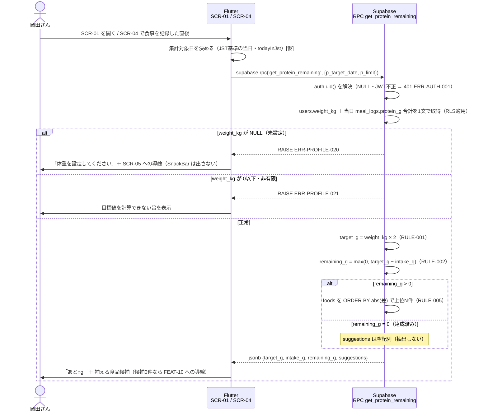

# FEAT-09 タンパク質残量・不足分提示 詳細設計

> **目的**: FEAT-09 を実装が迷わない粒度（入出力・バリデーション・クエリ・エラー・画面挙動・実装単位）まで具体化し、TDDの着手点を固定する。
> **書き方**: 実データは書かない。上位の正本（API契約＝`../../30_データ・IF設計/02_API設計.md` ／ 物理DB＝`../01_DB物理設計.md` ／ シーケンス＝`../../40_機能設計/01_シーケンス設計.md`）と矛盾させず、参照はIDで行う。横断方針（エラー分類・トランザクション・冪等・リトライ）は `../07_実装共通設計パターン.md` を正本とし本書では再定義しない。

> ⚠️ **本書はたたき台（2026-08-02 生成）**。岡田さんのレビューで確定する。

## 目次
1. [概要](#1-概要)
2. [処理フロー](#2-処理フロー)
3. [入出力仕様](#3-入出力仕様)
4. [業務ロジック](#4-業務ロジック)
5. [データアクセス](#5-データアクセス)
6. [エラー処理](#6-エラー処理)
7. [画面挙動・状態別表示](#7-画面挙動状態別表示)
8. [実装単位](#8-実装単位)
9. [テスト観点](#9-テスト観点)
10. [敵対的検証・要確認事項](#10-敵対的検証要確認事項)

## 1. 概要

| 項目 | 内容 |
|---|---|
| 対応要件 | FEAT-09（タンパク質残量・不足分提示） |
| 対応画面 | SCR-01 ダッシュボード ／ SCR-04 食事記録 |
| 対応API | **RPC** `supabase.rpc('get_protein_remaining', ...)`（Postgres関数・§3） |
| 関連ルール | RULE-001（必要量＝体重×2g）。**係数と丸めの正本は FEAT-07** |
| 同上 | RULE-002（残量＝必要量−摂取量） |
| 同上 | RULE-005（不足分の食品提示は `foods` から抽出・AI不使用） |
| 外部連携 | なし（AIを使わない決定的処理） |
| 性能目標 | NFR-PERF-02（決定的処理 ≤1秒） |
| 同上 | SCR-01 の初期表示に含まれるため NFR-PERF-01（≤2秒）にも従属 |
| 状態 | 状態を持たない。ST-01/ST-02 はトレーニング明細の状態で本機能は非該当 |
| 優先度 | MUST |

本機能は1回の RPC 呼び出しで2つを返す。「あと何g タンパク質を摂ればよいか」と「それを補える食品」である。

| 返す値 | 出どころ |
|---|---|
| `target_g` 必要量 | RULE-001（体重×2g）。**係数・丸め規則の正本は FEAT-07** |
| `intake_g` 摂取量 | 当日の `meal_logs.protein_g` 合計（FEAT-08 が書き込んだ記録） |
| `remaining_g` 残量 | RULE-002（必要量−摂取量・0でクランプ） |
| `suggestions` 候補 | `foods`（FEAT-10 が CSV で投入）からの決定的抽出 |

- AI（EXT-01）は呼ばない。Edge Function も使わない。
- したがって NFR-AVAIL-05 の AI 縮退時も本機能は通常どおり動作する。
- 旧設計は Route Handler `GET /api/protein/remaining` だった。RPC 1本に置き換える（§10 #11・末尾の要確認）。

## 2. 処理フロー

`../../40_機能設計/01_シーケンス設計.md §5` を正本とし、本節はバリデーション位置・クエリ発行点・分岐点まで詳細化する。



- 参照系のみ。書き込みは行わない。同じ引数なら同じ結果を返す（冪等）。
- 往復は**1回**。旧設計は参照2本（Q1・Q2）を並列発行していたが、RPC 1本にまとめたため不要になった。
- 関数本体は単一のスナップショットで実行される。旧設計にあった「Q1 と Q2 の間に FEAT-08 の記録が入る」ずれは消えた。
- RPC が失敗しても SCR-01 の他カード（FEAT-05 の `get_dashboard`）は独立して表示を継続する。

## 3. 入出力仕様

### RPC `get_protein_remaining`

| 項目 | 内容 |
|---|---|
| 呼び出し | `supabase.rpc('get_protein_remaining', params: { 'p_target_date': ..., 'p_limit': ... })` |
| 関数シグネチャ | `public.get_protein_remaining(p_target_date date, p_limit int default 3)` |
| 実行権限 | `SECURITY INVOKER`（RLS がそのまま効く）。`GRANT EXECUTE TO authenticated` |
| 揮発性 | `STABLE`（SELECT のみ・副作用なし） |
| 認証 | 必須。`supabase_flutter` が JWT を付与する。`auth.uid()` が解決できなければ 401 |
| 戻り値 | `jsonb`（1行1列）。Dart では `Map<String, dynamic>` として受け取る |
| キャッシュ | しない。SCR-04 の記録直後は必ず呼び直す（古い残量を出さない） |

**引数**

| 引数 | 型 | 必須 | 既定 | 説明 |
|---|---|---|---|---|
| `p_target_date` | `date` | yes | — | 集計対象日。JST基準の当日を Flutter が決めて渡す `[仮]`（§10 #3） |
| `p_limit` | `int` | no | `3` | 提示件数 N `[仮]`（§4.1 L4）。既定値は関数定義側に持たせ、呼び出し側で重複定義しない |

```jsonc
// 戻り値（型の枠のみ・実データは書かない）
{
  "target_g":    "float(>=0)",   // 必要量。RULE-001（係数と丸めの正本＝FEAT-07）
  "intake_g":    "float(>=0)",   // 当日の meal_logs.protein_g 合計
  "remaining_g": "float(>=0)",   // RULE-002。0でクランプ（負値を返さない）
  "suggestions": [               // RULE-005。foods からの決定的抽出（AI不使用）
    { "food_name": "string", "protein_amount": "float(>0)" }
  ]
}
```

- 型付けは Dart のモデルクラス＋`fromJson` で行う（§8 #3）。Dart のため zod は使わない。
- `suggestions` は §4.1 の並び順で**順序が保証された配列**。件数は 0〜`p_limit`。
- JSON キーは snake_case（`../06_DB設計規約.md §5`）。
- DB列名 `foods.name` は `food_name` に写像する。旧API契約の項目名を維持するため。
- 異常時は戻り値を返さず `RAISE EXCEPTION` で返す（§6）。正常応答に `error_code` を混ぜない。

### 3.1 バリデーション規則

検証対象は「認証」「引数」「算出の前提データ」の3つ。

| 項目 | 規則 | 違反時 |
|---|---|---|
| セッション | 有効な JWT が付与されていること | ERR-AUTH-001（401） |
| `p_target_date` | `date` 型。呼び出し側が必ず渡す。型不一致は PostgREST が弾く | ERR-PROTEIN-001 に写像（§6） |
| `p_limit` | 省略可。省略時は関数の既定値 3 を使う | — |
| `users.weight_kg` | NULL でないこと | ERR-PROFILE-020 |
| `users.weight_kg` | `> 0` かつ有限であること（判定規則の正本は FEAT-07・RULE-001） | ERR-PROFILE-021 |
| 当日の `meal_logs` | 0件でもエラーとせず `intake_g = 0` として扱う | エラーとしない |
| `foods` の候補 | 0件でもエラーとせず `suggestions: []` を返す | エラーとしない |
| RPC 実行 | 上記以外の失敗は応答を組み立てない | ERR-PROTEIN-001 |

## 4. 業務ロジック

算出はすべて RPC 内で行う（§5.1 の設計判断 (a)）。Dart 側に本機能の算出ロジックは置かない。

### 4.1 算出ロジック L1〜L5

抽出アルゴリズム（残量・0クランプ・選定順序・N=3・丸め）は次の1表に集約する。

| # | ロジック | 規則 | 実装場所 |
|---|---|---|---|
| L1 | 集計対象日の決定 | JST（Asia/Tokyo）の当日 `[仮]` | Flutter `todayInJst()` → `p_target_date`（§10 #3） |
| L2 | 摂取量合計 | 当日の `meal_logs.protein_g` の SUM。0件は 0 | RPC 内（§5） |
| L2 | 摂取量の係数 | `intake_count` は**乗じない** `[仮]` | 同上 |
| L3 | 残量 | `remaining_g = max(0, target_g − intake_g)` | RPC 内（RULE-002） |
| L3 | 0クランプ | 過剰摂取（`intake_g > target_g`）でも 0。負値・超過量は返さない | 同上 |
| L3 | 超過量 | 要るなら `intake_g − target_g` を Flutter 側で算出できる | 同上 |
| L3 | 列の追加 | しない。応答に `target_g` と `intake_g` の両方が含まれるため | 同上 |
| L4 | 抽出しない条件 | `remaining_g <= 0`（達成済み）なら抽出せず空配列を返す | RPC 内（RULE-005） |
| L4 | 候補の母集合 | `foods` のうち `protein_amount > 0` の行。0g の行は候補にしない | 同上 |
| L4 | 並び① | `abs(protein_amount − remaining_raw)` 昇順（残量との差が小さい順） | 同上 |
| L4 | 並び② | `protein_amount` 降順（同差なら量の多い方を優先） | 同上 |
| L4 | 並び③ | `id` 昇順（さらに同値なら決定性を担保） | 同上 |
| L4 | 件数 N | **3** `[仮]`。SCR-01 のカード内に折り返さず収まる件数 | 同上 |
| L4 | 方式 | **単品N件方式**。組み合わせで残量を埋める探索（部分和）は行わない `[仮]` | 同上 |
| L5 | 丸め | 応答に載せる数値はすべて小数第1位に四捨五入 | RPC 内 `round(v::numeric, 1)` |
| L5 | 丸めの位置 | **最後に1回だけ**。残量は「丸める前の差」を丸める | 同上 |
| L5 | 丸めのずれ | 丸め済みの `target_g − intake_g` と最大 0.1g ずれうる | 同上 |
| L5 | 画面での扱い | **`remaining_g` をそのまま表示し、再計算しない** | 同上 |

```
remaining_raw = greatest(0, weight_kg * 2.0 - intake_protein_g)
remaining_g   = round(remaining_raw::numeric, 1)
```

選定規則の①②③は旧設計から変えない。

### 4.2 単品N件方式を採る理由

| 理由 | 根拠 |
|---|---|
| 決定的処理 ≤1秒を素直に満たす | NFR-PERF-02 |
| 結果を人が説明できる。個人保守に見合う | NFR-MAINT-01 |

| 不採用案 | 理由 |
|---|---|
| 「残量以上で最小の1件」だけを返す | 全食品が残量未満のとき提示が空になり価値が消える |
| 組み合わせ提案（部分和） | Phase2 の検討事項とする |

- 差の絶対値順なら、残量を満たす最小の食品があれば上位に来る。
- 無い場合も「最も近い食品」を返せる。

### 4.3 FEAT-07 の丸め規則との一致

丸めが Dart（FEAT-07）と SQL（本 RPC）の2言語に分かれる。一致は次の3点で担保する。

| # | 担保 | 内容 |
|---|---|---|
| 1 | 丸める場所を1つにする | 応答に載る数値は **RPC 内で1回だけ**丸める |
| 1 | 同上 | Flutter は受け取った値をそのまま表示し、再計算も再丸めもしない |
| 2 | 純関数を応答経路に使わない | `app/lib/domain/nutrition.dart` の `roundProteinG` は SCR-05 の入力プレビュー専用 |
| 3 | 境界値をテストで突き合わせる | `.05` 刻みの値で SQL と Dart の丸め結果が一致することを確認（TC-FEAT09-17） |

- `double precision` に2引数の `round()` は使えない。`::numeric` のキャストを必ず挟む。
- `numeric` の `round()` は絶対値が大きい方へ丸める。Dart の `(v * 10).round() / 10` も同じ向き。
- ただし二進浮動小数の表現誤差で境界値がずれ得る。だから #3 のテストが要る。
- **丸め規則そのものの正本は引き続き FEAT-07**。本書の SQL はその写しである。
- 二重定義の指摘は §10 #12。

### 4.4 境界値

| 条件 | `remaining_g` | `suggestions` |
|---|---|---|
| `intake_g` = 0（当日記録なし） | `target_g` と同値 | 上位N件 |
| `intake_g` < `target_g` | 正の値 | 上位N件 |
| `intake_g` = `target_g`（ちょうど達成） | 0 | `[]`（空配列） |
| `intake_g` > `target_g`（過剰摂取） | 0（クランプ） | `[]`（空配列） |
| `foods` が0件（CSV未取込） | 通常どおり算出 | `[]`（空配列・エラーにしない） |
| `foods` の該当が N 件未満 | 通常どおり算出 | 該当件数のみ |
| `protein_amount` が同値で並ぶ | 通常どおり算出 | ②③のtie-breakで順序が一意に決まる |
| `weight_kg` が NULL・不正値 | 算出しない | ERR-PROFILE-020 / ERR-PROFILE-021（§6） |

## 5. データアクセス

### 5.1 設計判断: 候補抽出をどこで行うか

**(a) RPC 内の `ORDER BY` / `LIMIT` で選ぶ**を採る `[仮]`。

| 観点 | (a) RPC 内で選ぶ（**採用** `[仮]`） | (b) Dart の純関数で選ぶ（不採用・旧設計の踏襲） |
|---|---|---|
| 返すもの | 候補まで選び、結果だけ返す | 候補行を返し、端末側で選ぶ |
| 選定規則の置き場所 | SQL の1箇所（FEAT-07 で同種の問題・§10 #12） | Dart と SQL の2箇所に散る |
| 往復 | 1回で済む（NFR-PERF-01 ／ NFR-PERF-02） | 1回だが転送量が増える |
| 転送量 | `foods` 全件を端末に転送しない（NFR-PERF-05） | `foods` の候補行を全件転送する |
| 横断方針 | 「集計は RPC」の原則に合う（`../07_実装共通設計パターン.md`） | 業務判定が純関数に残る |
| 単体テスト | 選定規則を Dart のテストで触れない | Dart のテストで触れる |
| テストの代替 | SQL 側のテストで検証する（§9・TC-FEAT09-08〜11） | — |
| RULE の所在 | RULE-002・RULE-005 が SQL に入る。改訂が要る（§10 #11） | 衝突しない |
| INDEX | `abs()` の式ソートは INDEX が効かない | 同左 |
| 性能 | `foods` は数百件想定（NFR-MIGR-02）。全件走査で NFR-PERF-02 に収まる | — |

選定規則そのもの（§4.1 の並び①②③）は旧設計から変えない。

```sql
-- supabase/migrations/*.sql に置く（`../04_移行設計.md` の版管理対象）
create or replace function public.get_protein_remaining(
  p_target_date date,
  p_limit       int default 3          -- 提示件数 N [仮]
)
returns jsonb
language plpgsql
stable
security invoker
set search_path = public
as $$
declare
  v_weight double precision;
  v_intake double precision;
  v_target double precision;
  v_remain double precision;
  v_result jsonb;
begin
  -- 旧 Q1 に相当: 体重＋当日のタンパク質摂取合計を1文で取得
  --   ⚠️ WHERE の述語は auth.uid() と users.id の紐付け方式に依存（末尾の要確認）
  select u.weight_kg, coalesce(sum(m.protein_g), 0)
    into v_weight, v_intake
    from users u
    left join meal_logs m
      on  m.user_id    = u.id
      and m.eaten_date = p_target_date
   where u.id = <認証ユーザーに対応する users.id>
   group by u.weight_kg;

  -- 前提データの検証（判定規則の正本は FEAT-07）
  if v_weight is null then
    raise exception 'ERR-PROFILE-020' using errcode = 'PT409';   -- [仮] §6
  elsif v_weight <= 0
     or v_weight = 'Infinity'::double precision
     or v_weight <> v_weight then                                -- NaN の検出
    raise exception 'ERR-PROFILE-021' using errcode = 'PT500';   -- [仮] §6
  end if;

  v_target := v_weight * 2.0;                      -- RULE-001（係数の正本は FEAT-07）
  v_remain := greatest(0, v_target - v_intake);    -- RULE-002（0でクランプ）

  -- 旧 Q2 に相当: 候補抽出まで SQL 側で行う（設計判断 (a)）
  select jsonb_build_object(
           'target_g',    round(v_target::numeric, 1),
           'intake_g',    round(v_intake::numeric, 1),
           'remaining_g', round(v_remain::numeric, 1),
           'suggestions', coalesce(s.arr, '[]'::jsonb)
         )
    into v_result
    from (
      select jsonb_agg(
               jsonb_build_object(
                 'food_name',      c.name,
                 'protein_amount', round(c.protein_amount::numeric, 1))
               order by c.diff asc, c.protein_amount desc, c.id asc   -- ①②③（§4.1 L4）
             ) as arr
        from (
          select f.id, f.name, f.protein_amount,
                 abs(f.protein_amount - v_remain) as diff
            from foods f
           where v_remain > 0                     -- 達成済みなら抽出しない
             and f.protein_amount > 0             -- 0g の行は候補にしない
           order by diff asc, f.protein_amount desc, f.id asc
           limit p_limit
        ) c
    ) s;

  return v_result;
end;
$$;
```

- 並び順は `jsonb_agg(... order by ...)` に**明示する**。副問い合わせの `ORDER BY` は集約時の順序を保証しない。
- `users` の行が RLS で見えない場合も `v_weight` は NULL になり ERR-PROFILE-020 に落ちる。
- 本人行しか見えない前提のため、この経路は通常は発生しない。
- 旧設計にあった代替SQL `Q2-alt`（DB側 ORDER BY/LIMIT）は本方式そのもの。別案として保持しない。

### 5.2 アクセス諸元

| 観点 | 内容 |
|---|---|
| 対象テーブル | `users`（SELECT・`weight_kg`） |
| 同上 | `meal_logs`（SELECT・当日SUM）／ `foods`（SELECT） |
| 操作 | SELECT のみ。INSERT/UPDATE/DELETE なし |
| 使用INDEX | `ix_meal_logs_user_date`（`meal_logs(user_id, eaten_date)`）が当日絞り込みに効く |
| `foods` の走査 | 全件走査（数百件想定・INDEXを追加しない） |
| RLS | `SECURITY INVOKER` のため呼び出しユーザーのポリシーが効く |
| RLS（`users`・`meal_logs`） | `user_id = auth.uid()` 相当で本人行のみ |
| RLS（`foods`） | **`user_id` を持たない全ユーザー共通マスタのため同じポリシーが書けない** |
| `foods` の方針 `[仮]` | RLS を有効化し「認証済みユーザーは SELECT 可」とする（§10 #1） |
| 同上 | 書き込みは FEAT-10 の取込経路のみ |
| トランザクション境界 | 明示的トランザクションを張らない |
| 同上 | 関数本体が単一の暗黙トランザクションで動く（参照のみ・Read Committed） |
| 冪等・リトライ | 参照系のため冪等。自動リトライはしない |
| 同上の正本 | `../07_実装共通設計パターン.md` |
| 往復回数 | 1回（Flutter → RPC） |

## 6. エラー処理

RPC のため HTTP ステータスは PostgREST が決める。
異常は `RAISE EXCEPTION` で返し、Dart 側で `PostgrestException` を ERR-ID に写像する。

| ERR-ID | 返し方 | 発生条件 | 利用者向けメッセージ（意図） | retryable | ログ |
|---|---|---|---|---|---|
| ERR-AUTH-001 | PostgREST が 401 | JWT が無効・未ログイン | 再ログインを促す（共通契約） | false | 認証失敗として記録（NFR-SEC-AUDIT-02） |
| ERR-PROFILE-020 | `RAISE ... ERRCODE 'PT409'` → 409 `[仮]` | `users.weight_kg` が NULL（体重未設定・FEAT-06 未実施） | 体重の設定が必要であり、SCR-05 へ行けばよいことを伝える | false | info |
| ERR-PROFILE-021 | `RAISE ... ERRCODE 'PT500'` → 500 `[仮]` | `users.weight_kg` が 0以下・非有限 | 目標値を計算できなかったことを伝える | false | error（データ不整合として記録） |
| ERR-PROTEIN-001 | 上記以外の失敗 | RPC 実行失敗（接続断・タイムアウト・想定外の SQLSTATE・引数型不一致） | 一時的な問題であり時間をおいて再表示すればよいと伝える | true | error（相関IDと関数名のみ。栄養値は載せない） |

- `PT` で始まる SQLSTATE を PostgREST が HTTP ステータスに写像する挙動は `[仮]`。実装時に PostgREST の公式ドキュメントで確認する。
- 写像先HTTPは FEAT-05 と一致させる。旧設計の 409 / 500 を変えない。

```dart
// app/lib/data/protein_repository.dart（写像の骨子・[仮]）
try {
  final json = await supabase.rpc('get_protein_remaining', params: {
    'p_target_date': todayInJst(),
  });
  return ProteinRemaining.fromJson(json as Map<String, dynamic>);
} on PostgrestException catch (e) {
  // RAISE の MESSAGE を ERR-ID として受け取る [仮]
  throw switch (e.message) {
    'ERR-PROFILE-020' => AppError.weightUnset(),
    'ERR-PROFILE-021' => AppError.weightInvalid(),
    _                 => AppError.proteinFetchFailed(),   // ERR-PROTEIN-001
  };
} on AuthException {
  throw AppError.unauthenticated();                       // ERR-AUTH-001
}
```

- 本機能は AI（EXT-01）を呼ばないため `ERR-AI-*` は発生しない。
- AI 障害時も残量表示は継続する（NFR-AVAIL-05）。
- 利用者が入力する値が無いため `ERR-VALIDATION-001` も発生しない。
- ドメイン接頭辞は `ERR-PROTEIN-*` を FEAT-09 が単独で使う（001から連番）。
- 体重未設定・不正値については**新しいIDを起こさず**、FEAT-07 が予約した `ERR-PROFILE-020` / `ERR-PROFILE-021` へ写像する。

> ERRの完全列挙の正本は `../../60_テスト設計/02_RED母集合_受入基準・状態・エラー.md`（段6で集約）。本表はその入力とする。

## 7. 画面挙動・状態別表示

SCR-01 ではダッシュボードの1カードとして表示する。
SCR-04 では食事記録の保存成功後に RPC を呼び直して表示を更新する。
これは `../../40_機能設計/01_シーケンス設計.md §1` の「残量再計算」に対応する。
表示は同一ウィジェットを共用する。

| 状態 | 表示 | 操作可否 |
|---|---|---|
| 初期/空（当日の記録0件） | 残量＝必要量として通常表示 | 候補の表示のみ。SCR-04 への導線ボタンは活性 |
| 同上 | 「まだ記録がありません」を淡色の `Text`（`bodySmall`）で併記 | 同上 |
| 初期/空（`foods` 0件・CSV未取込） | 残量は表示する | 取込画面への遷移のみ活性 |
| 同上 | 候補欄は `Card` 内の注意表示（`Icon(Icons.info_outline)`＋`Text`） | 同上 |
| 同上 | SCR-05（FEAT-10 の取込）への `TextButton` を出す | 同上 |
| 読込中 | `shimmer` のプレースホルダを残量行と候補リスト行に出す | 再取得ボタンは不活性 |
| 同上 | 全面 `CircularProgressIndicator` は出さない（NFR-PERF-02） | 同上 |
| 成功（残量 > 0） | 「あと ○g」を `Text(style: TextStyle(fontWeight: FontWeight.bold))` で強調 | 通常 |
| 同上 | 候補は `ListView(shrinkWrap: true)` で食品名＋`Chip`（タンパク質量）を最大N件 | 同上 |
| 成功（残量 = 0・達成/過剰） | 達成メッセージを表示し、候補リストは描画しない（空配列のため） | 通常 |
| エラー（ERR-PROFILE-020） | カード内に黄系の注意表示で体重未設定を伝え、SCR-05 への `FilledButton` を出す | 設定画面への遷移のみ活性 |
| 同上 | **SnackBar は出さない**。初回利用者に毎回出てしまうため | 同上 |
| エラー（ERR-PROTEIN-001・ERR-PROFILE-021） | カード内に赤系の注意表示＋再取得 `TextButton` | 再取得のみ活性 |
| 同上 | SCR-04 の記録直後は `ScaffoldMessenger.showSnackBar` で失敗を通知 | 同上 |
| 同上 | 記録自体は成功しているため、記録成功の通知とは分けて出す | 同上 |

- SCR-01 のリング表示（達成率）は FEAT-05 の RPC `get_dashboard` が正本。
- 本カードは残量と候補のみを担う。同一画面で RPC を2本呼ぶ（§10 #8）。
- 数値は小数第1位まで表示し、単位「g」を必ず添える。
- 残量の再計算は画面側で行わない（§4.1 L5）。

## 8. 実装単位

| # | ファイル | 役割 | 主な定義 |
|---|---|---|---|
| 1 | `supabase/migrations/*.sql` | RPC `get_protein_remaining` の定義（§5）。`GRANT EXECUTE TO authenticated` | `create function public.get_protein_remaining(p_target_date date, p_limit int default 3) returns jsonb` |
| 1 | 同上 | `foods` の RLS ポリシー（`[仮]`・§10 #1） | 同上 |
| 2 | `app/lib/data/protein_repository.dart` | RPC 呼び出しと `PostgrestException` の ERR-ID 写像（§6） | `Future<ProteinRemaining> fetchRemaining({required String targetDate})` |
| 3 | `app/lib/features/dashboard/protein_remaining.dart` | 応答のモデルクラス。`fromJson` で型付けする（Dart のため zod は使わない） | `class ProteinRemaining` ／ `class ProteinSuggestion` |
| 3 | 同上 | 同上 | `factory ProteinRemaining.fromJson(Map<String, dynamic> json)` |
| 4 | `app/lib/features/dashboard/protein_remaining_card.dart` | SCR-01 / SCR-04 共用の表示。状態別表示（§7）を担う | `class ProteinRemainingCard extends StatelessWidget` |
| 5 | `app/lib/domain/date.dart` | 集計対象日（JST基準の当日）の算出。FEAT-05・FEAT-08 と共用する | `String todayInJst([DateTime? now])` |
| 5 | 同上 | 配置の正本は `../07_実装共通設計パターン.md` に置くべき（§10 #3） | 同上 |
| 6 | `app/lib/domain/nutrition.dart` | FEAT-07 の正本。本機能では**新規作成も変更もしない**（RULE-001 の算出は RPC 側に写した・§10 #12） | 既存 |

## 9. テスト観点

| TC-ID | 観点 | 検証層 | 期待 |
|---|---|---|---|
| TC-FEAT09-01 | 未認証で呼ぶ | Dart | 401 / ERR-AUTH-001。RPC が実行されない |
| TC-FEAT09-02 | `weight_kg` が NULL / 0以下 / NaN | SQL | ERR-PROFILE-020 / ERR-PROFILE-021 が RAISE される。`suggestions` を含む戻り値を返さない |
| TC-FEAT09-03 | 当日の `meal_logs` が0件 | SQL | `intake_g` = 0、`remaining_g` = `target_g` |
| TC-FEAT09-04 | 当日に複数件の記録がある | SQL | `intake_g` が `protein_g` の合計と一致（前日・翌日の行を含まない） |
| TC-FEAT09-05 | 摂取が必要量ちょうど | SQL | `remaining_g` = 0 かつ `suggestions` = `[]` |
| TC-FEAT09-06 | 摂取が必要量超過 | SQL | `remaining_g` = 0（負値にならない）かつ `suggestions` = `[]` |
| TC-FEAT09-07 | `foods` が0件 | SQL | 正常に返り `suggestions` = `[]`（エラーにしない） |
| TC-FEAT09-08 | `foods` の件数が `p_limit` 未満 | SQL | 該当件数だけ返る |
| TC-FEAT09-09 | 残量より多い食品と少ない食品が混在 | SQL | 差の絶対値昇順で並ぶ。同差なら多い方が先 |
| TC-FEAT09-10 | `protein_amount` が同値の行が複数 | SQL | `id` 昇順で順序が一意に決まる（実行ごとに変わらない） |
| TC-FEAT09-11 | `protein_amount` = 0 の行が存在 | SQL | 候補に含まれない |
| TC-FEAT09-12 | 日付境界（JST の 0時前後・UTCでは前日） | Dart | `todayInJst()` が JST の当日を返し、その日で集計される |
| TC-FEAT09-13 | 丸め | SQL | 戻り値の各数値が小数第1位。`remaining_g` は丸め前の差を丸めた値 |
| TC-FEAT09-14 | RPC 実行失敗 | Dart | ERR-PROTEIN-001・retryable=true に写像される |
| TC-FEAT09-15 | 応答時間 | SQL | 代表データで ≤1秒（NFR-PERF-02） |
| TC-FEAT09-16 | RLS | SQL | 他ユーザーの `meal_logs` が `intake_g` に混ざらない |
| TC-FEAT09-17 | 丸めの言語間一致 | SQL＋Dart | `.05` 刻みの境界値で SQL の `round(v::numeric, 1)` と Dart の `roundProteinG` が一致する（§4） |
| TC-FEAT09-18 | `p_limit` 省略 | SQL | 関数の既定値 3 が使われる |

受入基準（G/W/T）の候補:
- [AC] Given 体重が設定済みで当日の食事記録が必要量に満たない When SCR-01 を開く Then 残量（g）と、それを補える食品候補が最大N件表示される
- [AC] Given 当日の摂取が必要量以上 When RPC を呼ぶ Then `remaining_g` は 0 で `suggestions` は空配列である
- [AC] Given 体重が未設定 When SCR-01 を開く Then 残量は表示されず、体重設定（SCR-05）への導線が表示される
- [AC] Given `foods` が未取込 When 残量が残っている Then 残量は表示され、候補欄には食品マスタ取込（FEAT-10）への導線が表示される
- [AC] Given AI（EXT-01）が利用不能 When SCR-01 を開く Then 残量・候補は通常どおり表示される（NFR-AVAIL-05）

> 受入基準・ST・ERR の**正本は段6**（`../../60_テスト設計/02_RED母集合_受入基準・状態・エラー.md`・本PR対象外）。本節はその母集合への入力。

## 10. 敵対的検証・要確認事項

| # | 論点 | 内容 | 重大度 |
|---|---|---|---|
| 1 | `foods` に `user_id` が無く RLS の設計が他表と異なる | `foods` は分離キーが無く `auth.uid()` でポリシーを書けない。**共通マスタか私有データ（FEAT-10）かが未定義**で、私有なら他人の食品名が見え NFR-SCALE-01 で破綻する。本書は共通マスタ `[仮]` | 🟡 中 |
| 2 | `foods.protein_amount` の**単位が未定義** | 物理設計は「タンパク質量(g)」としか定義せず、1食分／100g／1個のどれかが未定。残量との差で並べる抽出（RULE-005）が意味を成さない。CSV 列設計（FEAT-10）・分量列の要否と併せて確定が要るが、本書は指摘に留める | 🔴 高 |
| 3 | 「当日」の定義とタイムゾーン（FEAT-05・FEAT-08 と共通） | `eaten_date` の基準 TZ が未定義。UTC の `current_date` だと JST 0〜9時の記録が前日に入り残量が過大になる。本書は Flutter が JST 当日を渡す `[仮]` | 🟡 中 |
| 4 | `meal_logs.intake_count` を SUM に掛けるべきか不明 | `01_データモデル.md §8-6` の未解決。「何人前」なら `SUM(protein_g * intake_count)`、「便宜上の個数」なら掛けない。本書は**掛けない** `[仮]`（FEAT-08 と対） | 🔴 高 |
| 5 | `weight_kg` 未設定時の応答形式 | ERR-PROFILE-020（409 `[仮]`）へ写像する方針。409 を前提条件未充足に使うのは一般的用法とずれ、`target_g: null` を返す案もある。**SCR-01 は初回に必ず通る経路**のため UX に直結する | 🟡 中 |
| 6 | `foods` が空のときの `suggestions` | 本書は空配列＋画面導線とした。FEAT-10 の CSV 取込を行うまで RULE-005 の価値が一切出ない。初期データを同梱するか、取込を FEAT-06 の必須ステップにするかが未定義 | 🟢 低 |
| 7 | 提示アルゴリズムの妥当性（単品N件・N=3） | 実装は単純で決定的。ただし残量が大きい日は単品では補えず、提示が実用的でなくなる。組み合わせ提案や上限フィルタ（残量を大きく超える食品を除く）の要否は業務判断で、N=3 も含めて `[仮]` | 🟡 中 |
| 8 | `target_g`・`intake_g` が FEAT-05 と重複算出になる | `get_dashboard`（FEAT-05）と本 RPC が同じ値を返し、SCR-01 は両方を呼ぶため二重の集計が走る。実装が分岐すると表示値が食い違う。内部関数への切り出しか RPC 統合かを要判断 | 🟡 中 |
| 9 | カロリー・糖質・脂質の残量を出さない | `meal_logs` は栄養4項目を記録するが、残量・不足分提示はタンパク質1項目だけに使う（要件どおり）。記録コスト（NFR-PERF-04）に対し活用が 1/4 に留まる。将来使うなら本 RPC の汎用化の判断が要る | 🟢 低 |
| 10 | 丸め済み値の見た目の不整合 | `target_g − intake_g` と `remaining_g` が丸めにより最大 0.1g ずれうる。画面での再計算を禁止して回避しているが、将来クライアント側で差分表示を作ると再発する | 🟢 低 |
| 11 | 業務判定を RPC に置くことが横断方針と衝突する | 横断方針は「RPC は永続化だけ。業務判定は純関数に残す」としている。本書は §5.1 の (a) を採り RULE-002・RULE-005 を SQL に置いた。**どちらかの改訂が必要**（集計系 RPC を例外とするのが妥当） | 🟡 中 |
| 12 | RULE-001 の係数と丸めが `nutrition.dart`（FEAT-07）と本 RPC に二重定義されている（§4.3） | 直し忘れると SCR-05 と SCR-01 の表示が食い違う。緩和案は (a) 係数をDB側1箇所に置く、(b) SCR-05 も RPC 経由、(c) 本書＝TC-FEAT09-17 で検出 `[仮]` | 🟡 中 |

> ⚠️ 要確認（人間判断）: 本書は Flutter + Supabase 構成（Vercel 不使用）で記述している。
> 一方 ADR-0001（Vercel AI Gateway 採用）・ADR-0002（Next.js + Mantine 採用）は Vercel 前提のまま。
> `30_データ・IF設計/02_API設計.md` も `/api/*` の Route Handler 契約のまま。
> 後継ADRの起票と段3の改訂が必要。

> ⚠️ 要確認（人間判断）: 段3の契約表を改訂すること。
> 旧 `GET /api/protein/remaining` は RPC `get_protein_remaining` に置き換わる。
> HTTPメソッド・パス・ステータスコードを前提とした契約が成立しない。
> `../../30_データ・IF設計/02_API設計.md §4.4` を RPC の引数・戻り値・SQLSTATE 写像の形に書き直すこと。

> ⚠️ 要確認（人間判断）: 候補抽出を RPC 内の `ORDER BY` / `LIMIT` で行う方針（§5.1 の (a)）を承認するか。
> 承認する場合、`../07_実装共通設計パターン.md` の「RPC には永続化だけを置く」方針に集計系 RPC の例外を明記すること（#11）。

> ⚠️ 要確認（人間判断）: `foods` の性格を確定すること。
> (a) `protein_amount` の単位（1食分／100g／1個）を FEAT-10 の CSV 列設計とセットで決める。
> 決まらないと RULE-005 の提示は数値としての意味を持たない（#2）。
> (b) 全ユーザー共通マスタか本人の私有データか。私有なら `foods.user_id` の追加＝スキーマ変更が必要で、RLS ポリシーの書き方も変わる（#1）。

> ⚠️ 要確認（人間判断）: `intake_g` の算出前提を確定すること。どちらも値が変われば残量・提示候補がすべて変わる。
> (a) `meal_logs.intake_count` を乗じるか（`01_データモデル.md §8-6` の未解決・#4）。
> (b) 「当日」の判定を Flutter が渡す `p_target_date` に委ねるか RPC 内で JST 固定にするか（#3）。
> (b) は FEAT-05・FEAT-08 と共通の横断方針として `../07_実装共通設計パターン.md` に1か所で定めるべき。

> ⚠️ 要確認（人間判断）: 提示件数 N＝3 と単品N件方式（組み合わせ提案なし）でよいか（#7）。
> あわせて `weight_kg` 未設定時をエラー（ERR-PROFILE-020）とするか正常応答で返すかを決めてください（#5）。

> ⚠️ 要確認（人間判断）: `users.id`(bigint) と Supabase `auth.uid()`(uuid) の紐付け方式は未確定。
> 正本は `../06_DB設計規約.md`。
> §5 の RPC の `WHERE` 述語と RLS ポリシーがこの方式に依存するため、確定するまで SQL は論理仕様として扱う。

> ⚠️ 要確認（人間判断）: PostgREST の挙動2点が `[仮]`。§6 の写像を実装する前に公式ドキュメントで確認すること。
> (a) SQLSTATE `PTxxx` を HTTP ステータス xxx に写像すること。
> (b) `RAISE` の `MESSAGE` が `PostgrestException.message` に載ること。

> 関連: API契約＝`../../30_データ・IF設計/02_API設計.md` / 物理DB＝`../01_DB物理設計.md` / 横断方針＝`../07_実装共通設計パターン.md` / シーケンス＝`../../40_機能設計/01_シーケンス設計.md`。
