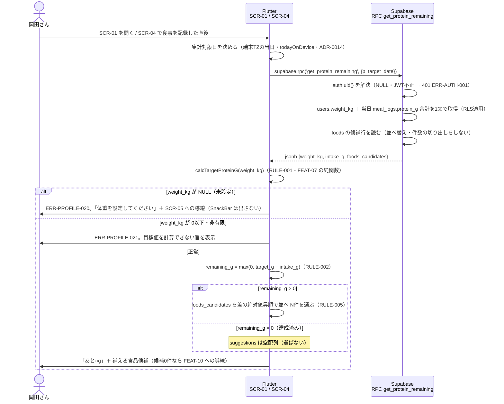

# FEAT-09 タンパク質残量・不足分提示 詳細設計

> **目的**: FEAT-09 を実装が迷わない粒度（入出力・バリデーション・クエリ・エラー・画面挙動・実装単位）まで具体化し、TDDの着手点を固定する。
> **書き方**: 実データは書かない。上位の正本（API契約＝`../../30_データ・IF設計/02_API設計.md` ／ 物理DB＝`../01_DB物理設計.md` ／ シーケンス＝`../../40_機能設計/01_シーケンス設計.md`）と矛盾させず、参照はIDで行う。横断方針（エラー分類・トランザクション・冪等・リトライ）は `../07_実装共通設計パターン.md` を正本とし本書では再定義しない。

> ⚠️ **本書はたたき台（2026-08-02 生成）**。岡田さんのレビューで確定する。

> 📖 ID（`FEAT-` `NFR-` `RULE-` 等）の意味は [ID早見表](../../00_ID早見表.md) を参照。

## 目次
1. [概要](#1-概要)
2. [処理フロー](#2-処理フロー)
3. [入出力仕様](#3-入出力仕様)
4. [業務ロジック](#4-業務ロジック)
5. [データアクセス](#5-データアクセス)
6. [エラー処理](#6-エラー処理)
7. [画面挙動・状態別表示](#7-画面挙動状態別表示)
8. [実装単位](#8-実装単位)
9. [テスト観点](#9-テスト観点)
10. [敵対的検証・要確認事項](#10-敵対的検証要確認事項)

## 1. 概要

| 項目 | 内容 |
|---|---|
| 対応要件 | FEAT-09（タンパク質残量・不足分提示） |
| 対応画面 | SCR-01 ダッシュボード ／ SCR-04 食事記録 |
| 対応API | **RPC** `supabase.rpc('get_protein_remaining', ...)`（Postgres関数・§3） |
| 関連ルール | RULE-001（必要量＝体重×2g）。**係数と丸めの正本は FEAT-07** |
| 同上 | RULE-002（残量＝必要量−摂取量） |
| 同上 | RULE-005（不足分の食品提示は `foods` から抽出・AI不使用） |
| 外部連携 | なし（AIを使わない決定的処理） |
| 性能目標 | NFR-PERF-02（決定的処理 ≤1秒） |
| 同上 | SCR-01 の初期表示に含まれるため NFR-PERF-01（≤2秒）にも従属 |
| 状態 | 状態を持たない。ST-01/ST-02 はトレーニング明細の状態で本機能は非該当 |
| 優先度 | MUST |

本機能は1回の RPC で**素の値**を受け取り、Dart が2つを組み立てる。「あと何g タンパク質を摂ればよいか」と「それを補える食品」である。

**RPC は計算済みの値を返さない**（2026-08-08 確定・E群D）。算出は Dart に1本化する（§4）。

| RPC が返す値 | 出どころ |
|---|---|
| `weight_kg` 体重 | `users.weight_kg` をそのまま返す。未設定なら `null` |
| `intake_g` 摂取量 | 当日の `meal_logs.protein_g` 合計（FEAT-08 が書き込んだ記録） |
| `foods_candidates` 候補行 | `foods`（FEAT-10 が CSV で投入）の行。並べ替えも件数の切り出しもしない |

| Dart が算出する値 | 規則 |
|---|---|
| 目標値 `target_g` | RULE-001（体重×2g）。**係数・丸め規則の正本は FEAT-07** |
| 残量 `remaining_g` | RULE-002（必要量−摂取量・0でクランプ） |
| 候補 `suggestions` | RULE-005（`foods_candidates` から決定的に N件を選ぶ・§4.1 L4） |

- `foods.protein_amount` は**1食分あたり**のタンパク質量（ADR-0012）。残量と直接比較できる。
- `intake_g` は当日の `SUM(protein_g)`。係数を掛ける列は `meal_logs` に無い（ADR-0013）。
- 「当日」は**端末のタイムゾーン**で決める（ADR-0014）。Flutter が日付を決めて RPC に渡す。

- AI（EXT-01）は呼ばない。Edge Function も使わない。
- したがって NFR-AVAIL-05 の AI 縮退時も本機能は通常どおり動作する。
- 旧設計は Route Handler `GET /api/protein/remaining` だった。RPC 1本に置き換える（§10 #11・末尾の要確認）。

## 2. 処理フロー

`../../40_機能設計/01_シーケンス設計.md §5` を正本とし、本節はバリデーション位置・クエリ発行点・分岐点まで詳細化する。



- 参照系のみ。書き込みは行わない。同じ引数なら同じ結果を返す（冪等）。
- 往復は**1回**。旧設計は参照2本（Q1・Q2）を並列発行していたが、RPC 1本にまとめたため不要になった。
- 関数本体は単一のスナップショットで実行される。旧設計にあった「Q1 と Q2 の間に FEAT-08（食事撮影タンパク質計算）の記録が入る」ずれは消えた。
- RPC が失敗しても SCR-01（ダッシュボード）の他カード（FEAT-05 の `get_dashboard`）は独立して表示を継続する。
- 体重の未設定・不正値の判定は **RPC ではなく Dart で行う**。RPC は `weight_kg` を素のまま返す。

## 3. 入出力仕様

### RPC `get_protein_remaining`

| 項目 | 内容 |
|---|---|
| 呼び出し | `supabase.rpc('get_protein_remaining', params: { 'p_target_date': ... })` |
| 関数シグネチャ | `public.get_protein_remaining(p_target_date date)` |
| 実行権限 | `SECURITY INVOKER`（RLS がそのまま効く）。`GRANT EXECUTE TO authenticated` |
| 揮発性 | `STABLE`（SELECT のみ・副作用なし） |
| 認証 | 必須。`supabase_flutter` が JWT を付与する。`auth.uid()` が解決できなければ 401 |
| 戻り値 | `jsonb`（1行1列）。Dart では `Map<String, dynamic>` として受け取る |
| キャッシュ | しない。SCR-04 の記録直後は必ず呼び直す（古い残量を出さない） |

**引数**

| 引数 | 型 | 必須 | 既定 | 説明 |
|---|---|---|---|---|
| `p_target_date` | `date` | yes | — | 集計対象日。**端末TZの当日**を Flutter が決めて渡す（ADR-0014・§10 #3） |

- 旧契約にあった `p_limit` は**削除した**。件数 N の切り出しが Dart 側へ移ったため（§4.1 L4）。

```jsonc
// 戻り値（型の枠のみ・実データは書かない）
{
  "weight_kg": "numeric(6,1)(>0) | null",  // users.weight_kg をそのまま返す。未設定は null
  "intake_g":  "numeric(6,1)(>=0)",        // 当日の meal_logs.protein_g 合計。記録なしは 0
  "foods_candidates": [                    // RULE-005 の母集合。並べ替えず id 昇順で返す
    { "id": "bigint", "food_name": "string", "protein_amount": "numeric(6,1)(>=0)" }  // 1食分あたりのg（ADR-0012）
  ]
}
```

- **計算済みの値を含めない。** `target_g`・`remaining_g` は戻り値に無い（2026-08-08 確定）。
- 型付けは Dart のモデルクラス＋`fromJson` で行う（§8 #3）。Dart のため zod は使わない。
- `foods_candidates` に `id` を含める。選定規則③（`id` 昇順）が Dart 側で要るため。
- `foods_candidates` は母集合そのもの。件数は `foods` の行数と一致する。
- JSON キーは snake_case（`../06_DB設計規約.md §5`）。
- DB列名 `foods.name` は `food_name` に写像する。旧API契約の項目名を維持するため。
- 異常時は戻り値を返さず `RAISE EXCEPTION` で返す（§6）。正常応答に `error_code` を混ぜない。

### 3.1 バリデーション規則

検証対象は「認証」「引数」「算出の前提データ」の3つ。**検出層が RPC と Dart に分かれる。**

| 項目 | 規則 | 検出層 | 違反時 |
|---|---|---|---|
| セッション | 有効な JWT が付与されていること | RPC | ERR-AUTH-001（401） |
| `p_target_date` | `date` 型。呼び出し側が必ず渡す。型不一致は PostgREST が弾く | RPC | ERR-PROTEIN-001 に写像（§6） |
| `users.weight_kg` | NULL でないこと | **Dart** | ERR-PROFILE-020 |
| `users.weight_kg` | `> 0` かつ有限であること（判定規則の正本は FEAT-07・RULE-001） | **Dart** | ERR-PROFILE-021 |
| 当日の `meal_logs` | 0件でもエラーとせず `intake_g = 0` として扱う | RPC | エラーとしない |
| `foods` の行 | 0件でもエラーとせず `foods_candidates: []` を返す | RPC | エラーとしない |
| RPC 実行 | 上記以外の失敗は応答を組み立てない | RPC | ERR-PROTEIN-001 |

- 体重の判定を RPC から外した（2026-08-08 確定）。`calcTargetProteinG` の戻り値で分ける（FEAT-07（必要タンパク質量算出）§3.0）。
- RPC は体重が未設定でも 200 を返す。`weight_kg` が `null` のまま載る。

## 4. 業務ロジック

**算出はすべて Dart の純関数で行う**（§5.1 の設計判断 (b)・2026-08-08 確定）。RPC 内に算出ロジックを置かない。

### 4.1 算出ロジック L1〜L5

抽出アルゴリズム（残量・0クランプ・選定順序・N=3・丸め）は次の1表に集約する。

| # | ロジック | 規則 | 実装場所 |
|---|---|---|---|
| L1 | 集計対象日の決定 | **端末のタイムゾーンの当日**（ADR-0014） | Flutter `todayOnDevice()` → `p_target_date` |
| L1 | サーバ時刻 | 使わない。RPC 内で `CURRENT_DATE` を呼ばない（Supabase は UTC） | 同上 |
| L2 | 摂取量合計 | 当日の `SUM(meal_logs.protein_g)`。0件は 0 | RPC 内（§5） |
| L2 | 摂取量の係数 | **係数を掛けない。** 個数を持つ列は `meal_logs` に存在しない（ADR-0013） | 同上 |
| L3 | 目標値 | `target_g = calcTargetProteinG(weight_kg)`（RULE-001・正本は FEAT-07） | **Dart** `nutrition.dart` |
| L3 | 残量 | `remaining_g = max(0, target_g − intake_g)` | **Dart**（RULE-002） |
| L3 | 0クランプ | 過剰摂取（`intake_g > target_g`）でも 0。負値・超過量は出さない | 同上 |
| L3 | 超過量 | 要るなら `intake_g − target_g` を Dart 側で算出できる | 同上 |
| L3 | 列の追加 | しない。応答に `weight_kg` と `intake_g` の両方が含まれるため | 同上 |
| L4 | 抽出しない条件 | `remaining_g <= 0`（達成済み）なら選ばず空配列にする | **Dart**（RULE-005） |
| L4 | `protein_amount` の意味 | **1食分あたり**のタンパク質量（ADR-0012）。100g あたり・1個あたりではない | 同上 |
| L4 | 残量との比較 | 1食分あたりのため `remaining_g` と同じ尺度。換算せずそのまま差を取れる | 同上 |
| L4 | 候補の母集合 | `foods_candidates` のうち `protein_amount > 0` の行。0g の行は候補にしない | 同上 |
| L4 | 並び① | `abs(protein_amount − remaining_g)` 昇順（残量との差が小さい順） | 同上 |
| L4 | 並び② | `protein_amount` 降順（同差なら量の多い方を優先） | 同上 |
| L4 | 並び③ | `id` 昇順（さらに同値なら決定性を担保） | 同上 |
| L4 | 件数 N | **3** `[仮]`。SCR-01 のカード内に折り返さず収まる件数。Dart 側の定数で持つ | 同上 |
| L4 | 方式 | **単品N件方式**。組み合わせで残量を埋める探索（部分和）は行わない `[仮]` | 同上 |
| L5 | 丸め | 画面に出す数値はすべて小数第1位に四捨五入（`roundProteinG`・FEAT-07） | **Dart** |
| L5 | 丸めの位置 | **最後に1回だけ**。残量は「丸める前の差」を丸める | 同上 |
| L5 | 丸めのずれ | 丸め済みの `target_g − intake_g` と最大 0.1g ずれうる | 同上 |
| L5 | 画面での扱い | **ドメイン層が出した `remaining_g` をそのまま表示し、ウィジェットで再計算しない** | 同上 |

```
target_g      = roundProteinG(weight_kg * 2.0)          // RULE-001（FEAT-07）
remaining_raw = max(0, target_g - intake_g)
remaining_g   = roundProteinG(remaining_raw)            // RULE-002
```

選定規則の①②③と件数 N は旧設計から変えない。**変えたのは実行場所だけである。**

### 4.2 単品N件方式を採る理由

| 理由 | 根拠 |
|---|---|
| 決定的処理 ≤1秒を素直に満たす | NFR-PERF-02 |
| 結果を人が説明できる。個人保守に見合う | NFR-MAINT-01 |

| 不採用案 | 理由 |
|---|---|
| 「残量以上で最小の1件」だけを返す | 全食品が残量未満のとき提示が空になり価値が消える |
| 組み合わせ提案（部分和） | Phase2 の検討事項とする |

- 差の絶対値順なら、残量を満たす最小の食品があれば上位に来る。
- 無い場合も「最も近い食品」を返せる。

### 4.3 FEAT-07 の丸め規則との一致

**丸めは Dart の1言語だけになった**（2026-08-08 確定）。言語間の一致を担保する仕組みは要らなくなった。

| # | 担保 | 内容 |
|---|---|---|
| 1 | 丸める場所を1つにする | `roundProteinG`（`app/lib/domain/nutrition.dart`・FEAT-07）だけが丸める |
| 1 | 同上 | RPC は丸めない。`round(v::numeric, 1)` を関数本体に書かない |
| 2 | 純関数を応答経路にも使う | SCR-05 のプレビューと SCR-01 の残量が同じ関数を通る |
| 3 | 境界値をテストで確かめる | `.05` 刻みの値で丸め方向が half away from zero であることを確認（TC-FEAT09-17） |

- `double precision` に2引数の `round()` が使えないという SQL 側の制約は、本機能に関係しなくなった。
- 二進浮動小数の表現誤差は残る。だから #3 のテストは残す。
- **丸め規則そのものの正本は引き続き FEAT-07**。本書は写しを持たない。
- 二重定義の指摘は §10 #12（**解決**）。

### 4.4 境界値

Dart の算出結果として示す。RPC の戻り値ではない。

| 条件 | `remaining_g` | `suggestions` |
|---|---|---|
| `intake_g` = 0（当日記録なし） | `target_g` と同値 | 上位N件 |
| `intake_g` < `target_g` | 正の値 | 上位N件 |
| `intake_g` = `target_g`（ちょうど達成） | 0 | `[]`（空配列） |
| `intake_g` > `target_g`（過剰摂取） | 0（クランプ） | `[]`（空配列） |
| `foods_candidates` が0件（CSV未取込） | 通常どおり算出 | `[]`（空配列・エラーにしない） |
| `foods_candidates` の該当が N 件未満 | 通常どおり算出 | 該当件数のみ |
| `protein_amount` が同値で並ぶ | 通常どおり算出 | ②③のtie-breakで順序が一意に決まる |
| `weight_kg` が NULL・不正値 | 算出しない | ERR-PROFILE-020 / ERR-PROFILE-021（§6） |

## 5. データアクセス

### 5.1 設計判断: 候補抽出をどこで行うか

**(b) Dart の純関数で選ぶ**を採る（2026-08-08 確定）。残量が Dart 側で出るため、候補の絞り込みも Dart 側になる。

| 観点 | (a) RPC 内で選ぶ（不採用） | (b) Dart の純関数で選ぶ（**採用・確定**） |
|---|---|---|
| 返すもの | 候補まで選び、結果だけ返す | 候補行を返し、端末側で選ぶ |
| 選定規則の置き場所 | SQL の1箇所。ただし RULE-001 が Dart にあるため式が2言語に割れる | **Dart の1箇所**。RULE-001・002・005 が同じ言語に揃う |
| 往復 | 1回で済む（NFR-PERF-01 ／ NFR-PERF-02） | 1回。転送量だけが増える |
| 転送量 | `foods` 全件を端末に転送しない（NFR-PERF-05） | `foods` の行を全件転送する（受容・§10 #14） |
| 横断方針 | 「集計は RPC」の原則に合う（`../07_実装共通設計パターン.md`） | **「業務判定は純関数」の原則に合う**。例外の明記が要らなくなる |
| 単体テスト | 選定規則を Dart のテストで触れない | **`dart test` で選定規則を直接検証できる** |
| RULE の所在 | RULE-002・RULE-005 が SQL に入り、横断方針の改訂が要った | 衝突しない（§10 #11 が解決した） |
| INDEX | `abs()` の式ソートは INDEX が効かない | 端末側のソート。INDEX の話が消える |
| 性能 | `foods` は数百件想定（NFR-MIGR-02）。全件走査で NFR-PERF-02 に収まる | 数百件のソートは端末で1ms未満 |

得られるメリットは2つ。FEAT-07 §4.5 と同じである。

| メリット | 内容 |
|---|---|
| 式が1か所 | SQL と Dart の二重実装が消える。丸めの違いで画面ごとに数字がずれない |
| 入力中のプレビュー | SCR-05 で体重を変えると**通信せずに**目標値が即座に出る |

選定規則そのもの（§4.1 の並び①②③・件数 N）は旧設計から変えない。

```sql
-- supabase/migrations/*.sql に置く（`../04_移行設計.md` の版管理対象）
create or replace function public.get_protein_remaining(
  p_target_date date                   -- 端末TZの当日を Flutter が渡す（ADR-0014）
)
returns jsonb
language plpgsql
stable
security invoker
set search_path = public
as $$
declare
  v_weight numeric(6,1);
  v_intake numeric(6,1);
  v_result jsonb;
begin
  -- 旧 Q1 に相当: 体重＋当日のタンパク質摂取合計を1文で取得
  --   users.id・meal_logs.user_id は uuid で auth.uid() と同値（案A・ADR-0005）。直接比較で書ける。
  --   対象日は p_target_date のみで絞る。CURRENT_DATE は使わない（ADR-0014）。
  --   合計は protein_g の単純 SUM。係数を掛ける列は持たない（ADR-0013）。
  select u.weight_kg, coalesce(sum(m.protein_g), 0)
    into v_weight, v_intake
    from users u
    left join meal_logs m
      on  m.user_id    = u.id
      and m.eaten_date = p_target_date
   where u.id = auth.uid()
   group by u.weight_kg;

  -- 体重の判定はしない。weight_kg を素のまま返し、Dart が判定する（§3.1・FEAT-07）
  -- 目標値・残量も計算しない。丸めもしない（設計判断 (b)）

  -- 旧 Q2 に相当: 候補行をそのまま返す。並べ替えも件数の切り出しもしない
  select jsonb_build_object(
           'weight_kg', v_weight,
           'intake_g',  v_intake,
           'foods_candidates', coalesce(s.arr, '[]'::jsonb)
         )
    into v_result
    from (
      select jsonb_agg(
               jsonb_build_object(
                 'id',             f.id,
                 'food_name',      f.name,
                 'protein_amount', f.protein_amount)
               order by f.id asc                  -- 決定的な順序のためだけの並び
             ) as arr
        from foods f
    ) s;

  return v_result;
end;
$$;
```

- 関数本体に `abs()`・`limit`・`round()`・`* 2.0` が**1つも現れない**ことが実装の合否になる（§9 TC-FEAT09-19）。
- `order by f.id asc` は選定規則ではない。応答を安定させるためだけの並びである。
- `protein_amount > 0` の除外も SQL では行わない。規則は Dart の1か所に置く（§4.1 L4）。
- `users` の行が RLS で見えない場合、`v_weight` は NULL になり Dart 側で ERR-PROFILE-020 に落ちる。
- 本人行しか見えない前提のため、この経路は通常は発生しない。
- 旧設計にあった代替SQL `Q2-alt`（DB側 ORDER BY/LIMIT）は**採らない**。

### 5.2 アクセス諸元

| 観点 | 内容 |
|---|---|
| 対象テーブル | `users`（SELECT・`weight_kg`） |
| 同上 | `meal_logs`（SELECT・当日SUM）／ `foods`（SELECT） |
| 操作 | SELECT のみ。INSERT/UPDATE/DELETE なし |
| 使用INDEX | `ix_meal_logs_user_date`（`meal_logs(user_id, eaten_date)`）が当日絞り込みに効く |
| `foods` の走査 | 全件走査（数百件想定・INDEXを追加しない） |
| `foods` の転送 | **全件を端末へ返す。** 絞り込みも並べ替えも Dart 側で行う（§5.1・§10 #14） |
| RLS | `SECURITY INVOKER` のため呼び出しユーザーのポリシーが効く |
| 型 | `users.id`・`meal_logs.user_id` はいずれも **uuid**（`auth.uid()` と同値・ADR-0005） |
| RLS（`users`） | `id = auth.uid()` の直接比較で本人行のみ（3区分の「本人のみ」） |
| RLS（`meal_logs`） | `user_id = auth.uid()` の直接比較で本人行のみ（同上） |
| RLS（`foods`） | **共通マスタで確定**（2026-08-08）。`user_id` を持たず、`TO authenticated USING (true)` で認証済みなら全件参照できる |
| `foods` の書き込み | 認証済みなら誰でも書ける。実運用の経路は FEAT-10 の取込（`import_foods`）のみ |
| RLS の正本 | `../01_DB物理設計.md` §3。3区分の横断方針は `../07_実装共通設計パターン.md` §1 |
| トランザクション境界 | 明示的トランザクションを張らない |
| 同上 | 関数本体が単一の暗黙トランザクションで動く（参照のみ・Read Committed） |
| 冪等・リトライ | 参照系のため冪等。自動リトライはしない |
| 同上の正本 | `../07_実装共通設計パターン.md` |
| 往復回数 | 1回（Flutter → RPC） |

## 6. エラー処理

RPC のため HTTP ステータスは PostgREST が決める。
通信・実行の異常は `PostgrestException` を ERR-ID に写像する。
**体重に起因する2件は RPC ではなく Dart の判定で起こす**（2026-08-08 確定）。

| ERR-ID | 返し方 | 発生条件 | 利用者向けメッセージ（意図） | retryable | ログ |
|---|---|---|---|---|---|
| ERR-AUTH-001 | PostgREST が 401 | JWT が無効・未ログイン | 再ログインを促す（共通契約） | false | 認証失敗として記録（NFR-SEC-AUDIT-02） |
| ERR-PROFILE-020 | **Dart 判定**（200 応答の `weight_kg` が null） | `users.weight_kg` が NULL（体重未設定・FEAT-06 未実施） | 体重の設定が必要であり、SCR-05 へ行けばよいことを伝える | false | info |
| ERR-PROFILE-021 | **Dart 判定**（`calcTargetProteinG` が `ProteinTargetInvalid`） | `users.weight_kg` が 0以下・非有限 | 目標値を計算できなかったことを伝える | false | error（データ不整合として記録） |
| ERR-PROTEIN-001 | 上記以外の失敗 | RPC 実行失敗（接続断・タイムアウト・想定外の SQLSTATE・引数型不一致） | 一時的な問題であり時間をおいて再表示すればよいと伝える | true | error（相関IDと関数名のみ。栄養値は載せない） |

- **ERR-ID の採番は変えない。** 発生する層だけが RPC から Dart へ移った。
- ERR-PROFILE-020 / 021 に HTTP ステータスは対応しない。RPC は 200 を返すため。
- 旧設計の 409 / 500 への写像と `PT` 始まりの SQLSTATE は、本機能では不要になった。
- SQLSTATE → HTTP の写像の正本は `../07_実装共通設計パターン.md §1`（2026-08-08 確定）。
- 本機能が `PostgrestException` の `code` を見るのは ERR-AUTH-001 との切り分けだけである。
- 判定規則の正本は FEAT-07 §3.0（`ProteinTarget` の3分岐）。本書では再定義しない。

```dart
// app/lib/data/protein_repository.dart（写像の骨子・[仮]）
try {
  final json = await supabase.rpc('get_protein_remaining', params: {
    'p_target_date': todayOnDevice(),   // 端末TZの当日（ADR-0014）
  });
  return ProteinRemainingRaw.fromJson(json as Map<String, dynamic>);
} on PostgrestException {
  throw AppError.proteinFetchFailed();                    // ERR-PROTEIN-001
} on AuthException {
  throw AppError.unauthenticated();                       // ERR-AUTH-001
}

// app/lib/domain/protein_remaining.dart（体重に起因する2件はここで分ける）
final target = calcTargetProteinG(raw.weightKg);          // FEAT-07 の純関数
switch (target) {
  case ProteinTargetUnset():   throw AppError.weightUnset();     // ERR-PROFILE-020
  case ProteinTargetInvalid(): throw AppError.weightInvalid();   // ERR-PROFILE-021
  case ProteinTargetOk():      /* 残量と候補を組み立てる（§4.1） */
}
```

- 本機能は AI（EXT-01）を呼ばないため `ERR-AI-*` は発生しない。
- AI 障害時も残量表示は継続する（NFR-AVAIL-05）。
- 利用者が入力する値が無いため `ERR-VALIDATION-001` も発生しない。
- ドメイン接頭辞は `ERR-PROTEIN-*` を FEAT-09 が単独で使う（001から連番）。
- 体重未設定・不正値については**新しいIDを起こさず**、FEAT-07 が予約した `ERR-PROFILE-020` / `ERR-PROFILE-021` へ写像する。

> ERRの完全列挙の正本は `../../60_テスト設計/02_RED母集合_受入基準・状態・エラー.md`（段6で集約）。本表はその入力とする。

## 7. 画面挙動・状態別表示

SCR-01 ではダッシュボードの1カードとして表示する。
SCR-04 では食事記録の保存成功後に RPC を呼び直して表示を更新する。
これは `../../40_機能設計/01_シーケンス設計.md §1` の「残量再計算」に対応する。
表示は同一ウィジェットを共用する。

| 状態 | 表示 | 操作可否 |
|---|---|---|
| 初期/空（当日の記録0件） | 残量＝必要量として通常表示 | 候補の表示のみ。SCR-04 への導線ボタンは活性 |
| 同上 | 「まだ記録がありません」を淡色の `Text`（`bodySmall`）で併記 | 同上 |
| 初期/空（`foods` 0件・CSV未取込） | 残量は表示する | 取込画面への遷移のみ活性 |
| 同上 | 候補欄は `Card` 内の注意表示（`Icon(Icons.info_outline)`＋`Text`） | 同上 |
| 同上 | SCR-05（FEAT-10 の取込）への `TextButton` を出す | 同上 |
| 読込中 | `shimmer` のプレースホルダを残量行と候補リスト行に出す | 再取得ボタンは不活性 |
| 同上 | 全面 `CircularProgressIndicator` は出さない（NFR-PERF-02） | 同上 |
| 成功（残量 > 0） | 「あと ○g」を `Text(style: TextStyle(fontWeight: FontWeight.bold))` で強調 | 通常 |
| 同上 | 候補は `ListView(shrinkWrap: true)` で食品名＋`Chip`（タンパク質量）を最大N件 | 同上 |
| 成功（残量 = 0・達成/過剰） | 達成メッセージを表示し、候補リストは描画しない（空配列のため） | 通常 |
| エラー（ERR-PROFILE-020） | カード内に黄系の注意表示で体重未設定を伝え、SCR-05 への `FilledButton` を出す | 設定画面への遷移のみ活性 |
| 同上 | **SnackBar は出さない**。初回利用者に毎回出てしまうため | 同上 |
| エラー（ERR-PROTEIN-001・ERR-PROFILE-021） | カード内に赤系の注意表示＋再取得 `TextButton` | 再取得のみ活性 |
| 同上 | SCR-04 の記録直後は `ScaffoldMessenger.showSnackBar` で失敗を通知 | 同上 |
| 同上 | 記録自体は成功しているため、記録成功の通知とは分けて出す | 同上 |

- SCR-01 のリング表示（達成率）は FEAT-05（ダッシュボード）の RPC `get_dashboard` が正本。
- 本カードは残量と候補のみを担う。同一画面で RPC を2本呼ぶ（§10 #8）。
- 数値は小数第1位まで表示し、単位「g」を必ず添える。
- 残量と候補は**ドメイン層の純関数が1回だけ算出する**（§4.1 L5・§8 #6）。
- ウィジェットは受け取った値を描くだけ。再計算も再丸めもしない。

## 8. 実装単位

| # | ファイル | 役割 | 主な定義 |
|---|---|---|---|
| 1 | `supabase/migrations/*.sql` | RPC `get_protein_remaining` の定義（§5）。`GRANT EXECUTE TO authenticated` | `create function public.get_protein_remaining(p_target_date date) returns jsonb` |
| 1 | 同上 | `foods` の RLS ポリシー（共通マスタ区分・`TO authenticated USING (true)`） | 同上 |
| 2 | `app/lib/data/protein_repository.dart` | RPC 呼び出しと `PostgrestException` の ERR-ID 写像（§6） | `Future<ProteinRemainingRaw> fetchRemaining({required String targetDate})` |
| 3 | `app/lib/features/dashboard/protein_remaining.dart` | 応答のモデルクラス。`fromJson` で型付けする（Dart のため zod は使わない） | `class ProteinRemainingRaw` ／ `class FoodCandidate` |
| 3 | 同上 | 同上 | `factory ProteinRemainingRaw.fromJson(Map<String, dynamic> json)` |
| 4 | `app/lib/features/dashboard/protein_remaining_card.dart` | SCR-01 / SCR-04 共用の表示。状態別表示（§7）を担う | `class ProteinRemainingCard extends StatelessWidget` |
| 5 | `app/lib/domain/date.dart` | 集計対象日（端末TZの当日）の算出。FEAT-05・FEAT-08 と共用する（ADR-0014） | `String todayOnDevice([DateTime? now])` |
| 5 | 同上 | 配置の正本は `../07_実装共通設計パターン.md` に置くべき | 同上 |
| 6 | `app/lib/domain/protein_remaining.dart` | **本機能の算出の実体**。RULE-002 の残量と RULE-005 の候補選定を純関数で持つ。Supabase クライアントを import しない | `double calcRemainingG(double targetG, double intakeG)` |
| 6 | 同上 | 同上（件数 N＝3 の定数もここに置く） | `List<FoodCandidate> pickSuggestions(List<FoodCandidate> candidates, double remainingG, {int n = 3})` |
| 7 | `app/test/domain/protein_remaining_test.dart` | #6 の単体テスト（NFR-QUAL-01）。§9 の Dart 検証層の TC を実装する | `group('pickSuggestions', () { test(...) })` |
| 8 | `app/lib/domain/nutrition.dart` | FEAT-07 の正本。本機能では**変更しない**。`calcTargetProteinG` と `roundProteinG` を呼ぶだけ | 既存 |

## 9. テスト観点

| TC-ID | 観点 | 検証層 | 期待 |
|---|---|---|---|
| TC-FEAT09-01 | 未認証で呼ぶ | Dart | 401 / ERR-AUTH-001。RPC が実行されない |
| TC-FEAT09-02 | `weight_kg` が NULL / 0以下 / NaN | Dart | ERR-PROFILE-020 / ERR-PROFILE-021 に分かれる。RPC は 200 を返す |
| TC-FEAT09-03 | 当日の `meal_logs` が0件 | SQL | `intake_g` = 0。Dart の `remaining_g` = `target_g` |
| TC-FEAT09-04 | 当日に複数件の記録がある | SQL | `intake_g` が `protein_g` の合計と一致（前日・翌日の行を含まない） |
| TC-FEAT09-05 | 摂取が必要量ちょうど | Dart | `remaining_g` = 0 かつ `suggestions` = `[]` |
| TC-FEAT09-06 | 摂取が必要量超過 | Dart | `remaining_g` = 0（負値にならない）かつ `suggestions` = `[]` |
| TC-FEAT09-07 | `foods` が0件 | SQL＋Dart | `foods_candidates` = `[]` で正常に返り、`suggestions` = `[]`（エラーにしない） |
| TC-FEAT09-08 | 候補の件数が N 未満 | Dart | 該当件数だけ選ばれる |
| TC-FEAT09-09 | 残量より多い食品と少ない食品が混在 | Dart | 差の絶対値昇順で並ぶ。同差なら多い方が先 |
| TC-FEAT09-10 | `protein_amount` が同値の行が複数 | Dart | `id` 昇順で順序が一意に決まる（実行ごとに変わらない） |
| TC-FEAT09-11 | `protein_amount` = 0 の行が存在 | Dart | 候補に含まれない |
| TC-FEAT09-12 | 日付境界（端末TZの 0時前後・UTCでは前日） | Dart | `todayOnDevice()` が端末TZの当日を返し、その日で集計される |
| TC-FEAT09-13 | 丸め | Dart | 画面に出す各数値が小数第1位。`remaining_g` は丸め前の差を丸めた値 |
| TC-FEAT09-14 | RPC 実行失敗 | Dart | ERR-PROTEIN-001・retryable=true に写像される |
| TC-FEAT09-15 | 応答時間 | SQL | 代表データで ≤1秒（NFR-PERF-02） |
| TC-FEAT09-16 | RLS | SQL | 他ユーザーの `meal_logs` が `intake_g` に混ざらない |
| TC-FEAT09-17 | 丸めの半端値 | Dart | `.05` 刻みの境界値で `roundProteinG` が half away from zero に丸める（§4.3） |
| TC-FEAT09-18 | 件数 N の既定 | Dart | `pickSuggestions` の既定値 3 が使われる |
| TC-FEAT09-19 | **RPC に算出が無いこと**（静的検査） | SQL | 関数本体に `* 2.0`・`abs(`・`limit`・`round(` が現れない（§5.1） |

受入基準（G/W/T）の候補:
- [AC] Given 体重が設定済みで当日の食事記録が必要量に満たない When SCR-01 を開く Then 残量（g）と、それを補える食品候補が最大N件表示される
- [AC] Given 当日の摂取が必要量以上 When 残量を算出する Then `remaining_g` は 0 で `suggestions` は空配列である
- [AC] Given 体重が未設定 When SCR-01 を開く Then 残量は表示されず、体重設定（SCR-05）への導線が表示される
- [AC] Given `foods` が未取込 When 残量が残っている Then 残量は表示され、候補欄には食品マスタ取込（FEAT-10）への導線が表示される
- [AC] Given AI（EXT-01）が利用不能 When SCR-01 を開く Then 残量・候補は通常どおり表示される（NFR-AVAIL-05）

> 受入基準・ST・ERR の**正本は段6**（`../../60_テスト設計/02_RED母集合_受入基準・状態・エラー.md`・本PR対象外）。本節はその母集合への入力。

## 10. 敵対的検証・要確認事項

| # | 論点 | 内容 | 重大度 |
|---|---|---|---|
| 1 | ~~`foods` に `user_id` が無く RLS の設計が他表と異なる~~（**解決**） | ~~共通マスタか私有データ（FEAT-10）かが未定義~~ → **共通マスタで確定**（2026-08-08・ADR-0005）。所有者列は持たない。RLS は3区分の「共通マスタ」＝`TO authenticated USING (true)`（§5.2） | — |
| 2 | ~~`foods.protein_amount` の**単位が未定義**~~（**解決**） | ~~1食分／100g／1個のどれかが未定で、残量との差で並べる抽出（RULE-005）が意味を成さない~~ → **1食分あたりで確定**（ADR-0012・2026-08-08）。「これを食べれば X g 取れる」という数値で、残量と直接比較できる。1食分の分量は CSV 作成者が決める（FEAT-10） | — |
| 3 | ~~「当日」の定義とタイムゾーン（FEAT-05・FEAT-08 と共通）~~（**解決**） | ~~`eaten_date` の基準 TZ が未定義。UTC の `current_date` だと JST 0〜9時の記録が前日に入り残量が過大になる~~ → **端末時刻で確定**（ADR-0014・2026-08-08）。Flutter が端末TZで日付を決め `p_target_date` に渡す。RPC 内で `CURRENT_DATE` を使わない | — |
| 4 | ~~摂取数を SUM に掛けるべきか不明~~（**解決**） | ~~「何人前」なら乗じ、「便宜上の個数」なら掛けない~~ → **列を削除した**（ADR-0013・2026-08-08）。合計は導出値であり列で持つとずれるため。摂取量合計は `SUM(protein_g)` で確定し、係数の論点は消滅した（FEAT-08 §10-2 と対） | — |
| 5 | ~~`weight_kg` 未設定時の応答形式~~（**解決**） | **200 で返して Dart が判定する**（2026-08-08 確定）。RPC は `weight_kg` を `null` のまま載せ、`RAISE` しない。409 の用法のずれも消えた。ERR-PROFILE-020 は Dart 側で起こす（§6）。FEAT-05 の `protein_gauge: null` と扱いが揃った | — |
| 6 | `foods` が空のときの `suggestions` | 本書は空配列＋画面導線とした。FEAT-10 の CSV 取込を行うまで RULE-005 の価値が一切出ない。初期データを同梱するか、取込を FEAT-06 の必須ステップにするかが未定義 | 🟢 低 |
| 7 | 提示アルゴリズムの妥当性（単品N件・N=3） | 実装は単純で決定的。ただし残量が大きい日は単品では補えず、提示が実用的でなくなる。組み合わせ提案や上限フィルタ（残量を大きく超える食品を除く）の要否は業務判断で、N=3 も含めて `[仮]` | 🟡 中 |
| 8 | `weight_kg`・`intake_g` が FEAT-05 と重複取得になる | `get_dashboard`（FEAT-05）と本 RPC が同じ値を返し、SCR-01 は両方を呼ぶため二重の集計が走る。算出が Dart に揃ったため表示値の食い違いは起きにくくなったが、集計の重複は残る。RPC 統合の要否は判断が要る | 🟡 中 |
| 9 | カロリー・糖質・脂質の残量を出さない | `meal_logs` は栄養4項目を記録するが、残量・不足分提示はタンパク質1項目だけに使う（要件どおり）。記録コスト（NFR-PERF-04）に対し活用が 1/4 に留まる。将来使うなら本 RPC の汎用化の判断が要る | 🟢 低 |
| 10 | 丸め済み値の見た目の不整合 | `target_g − intake_g` と `remaining_g` が丸めにより最大 0.1g ずれうる。ウィジェットでの再計算を禁止して回避しているが、将来クライアント側で差分表示を作ると再発する | 🟢 低 |
| 11 | ~~業務判定を RPC に置くことが横断方針と衝突する~~（**解決**） | **(b) Dart 一本化で確定**（2026-08-08・§5.1）。RULE-002・RULE-005 は SQL から出て純関数に戻った。横断方針「RPC は永続化だけ。業務判定は純関数に残す」と衝突しない。集計系 RPC の例外を明記する作業も要らなくなった | — |
| 12 | ~~RULE-001 の係数と丸めが `nutrition.dart`（FEAT-07）と本 RPC に二重定義されている（§4.3）~~（**解決**） | **RPC から式と丸めを取り除いた**（2026-08-08）。係数 2.0 も `round(v::numeric, 1)` も関数本体に無い。式は `nutrition.dart` の1か所だけになり、SCR-05 と SCR-01 の食い違いが構造的に起きない。回帰は TC-FEAT09-19 で検出する | — |
| 13 | 共通マスタは認証済みなら誰でも書き換えられる（#1 の確定に伴う新規） | `foods` の RLS は `TO authenticated USING (true)`。単一利用者の現行運用では実害が無いが、複数利用者（NFR-SCALE-01・Phase2）では他人の食品マスタを壊せる。Phase2 で書き込みを分離する見直しが要る | 🟡 中 |
| 14 | `foods` を全件転送する（#11・#12 の確定に伴う新規） | 候補の絞り込みが Dart 側へ移り、RPC は `foods` の全行を返す。数百件想定（NFR-MIGR-02）では体感に出ないが、CSV が数千件に増えると SCR-01 の初期表示（NFR-PERF-01）に効く。件数が増えたら RPC 側での粗い絞り込みを再検討する | 🟢 低 |
| 15 | **`supabase_flutter` が `numeric` をどう返すか未確認** | 栄養値・体重を `numeric(6,1)` に変えた（ADR-0022）。PostgreSQL の `numeric` は、ドライバによって**文字列で返る**ことがある。`weight_kg`・`intake_g`・`protein_amount` の受け取りに `double.parse` が要るかもしれない。**変換を1箇所に集約する**設計にしておき、実装初日に実挙動を確認する。Dart 側の型は `double` のまま | 🟡 中 |

> ⚠️ 要確認（人間判断）: #15 `supabase_flutter` が `numeric` を数値で返すか文字列で返すか（🟡 中）。
> `numeric` は、ドライバによって**文字列で返る**ことがある。Dart 側で `double.parse` が要るかもしれない。
> **変換を1箇所に集約する**設計にしておき、実装初日に実挙動を確認する。
> 対象は `weight_kg`・`intake_g`・`foods_candidates[].protein_amount` の3つ。
> 文字列のまま比較すると RULE-002 の残量判定（0 か否か）が壊れる。

> ~~⚠️ 要確認（人間判断）: 本書は Flutter + Supabase 構成（Vercel 不使用）で記述している。~~（**解決**・2026-08-08）
> ~~一方 ADR-0001（Vercel AI Gateway 採用）・ADR-0002（Next.js + Mantine 採用）は Vercel 前提のまま。~~
> ~~`30_データ・IF設計/02_API設計.md` も `/api/*` の Route Handler 契約のまま。~~
> ~~後継ADRの起票と段3の改訂が必要。~~
> **ADR-0010**（Flutter + Supabase）と **ADR-0011**（Gemini API 直接）を起票した。
> ADR-0001・ADR-0002 は Superseded にした。段3も改訂済み。

> ~~⚠️ 要確認（人間判断）: 段3の契約表を改訂すること。~~（**解決**・2026-08-08）
> ~~旧 `GET /api/protein/remaining` は RPC `get_protein_remaining` に置き換わる。~~
> ~~HTTPメソッド・パス・ステータスコードを前提とした契約が成立しない。~~
> ~~`../../30_データ・IF設計/02_API設計.md §4.4` を RPC の引数・戻り値・SQLSTATE 写像の形に書き直すこと。~~
> **段3は改訂済み。** 同 §4.4 が `supabase.rpc('get_protein_remaining', params: {...})` になっている。
> 引数は `p_target_date` の1本。旧 `p_limit` は削除された、と同 §4.4 に明記されている。
> 戻り値も `weight_kg`・`intake_g`・`foods_candidates` の素の値だけに差し替わった。
> SQLSTATE 写像は同 §5.4。旧 `GET /api/protein/remaining` は同 §3 末尾の対比表に残るだけである。

> ~~⚠️ 要確認（人間判断）: 候補抽出を RPC 内の `ORDER BY` / `LIMIT` で行う方針（§5.1 の (a)）を承認するか。~~（**解決**・2026-08-08）
> ~~承認する場合、`../07_実装共通設計パターン.md` の「RPC には永続化だけを置く」方針に集計系 RPC の例外を明記すること（#11）。~~
> **(b) Dart の純関数で選ぶで確定した。** RPC は候補行を返すだけになった。
> 横断方針への例外の追記は**不要**。RULE-002・RULE-005 は純関数に戻った（#11・#12）。

> ~~⚠️ 要確認（人間判断）: `foods.protein_amount` の単位（1食分／100g／1個）を FEAT-10 の CSV 列設計とセットで確定すること。~~（**解決**・2026-08-08）
> ~~決まらないと RULE-005 の提示は数値としての意味を持たない（#2）。**本件は未解決のまま残る。**~~
> **1食分あたりで確定**（ADR-0012）。残量と直接比較できる数値です。
> 1食分の分量は CSV 作成者が決めます（FEAT-10）。

> ~~⚠️ 要確認（人間判断）: `foods` は全ユーザー共通マスタか本人の私有データか。私有なら `foods.user_id` の追加＝スキーマ変更が必要（#1）。~~（**解決**・2026-08-08）
> **共通マスタで確定**（ADR-0005）。`foods` に所有者列を追加しない。RLS は「共通マスタ」区分（§5.2）。
> 残る懸念は Phase2 での書き込み分離のみ（#13）。

> ~~⚠️ 要確認（人間判断）: `intake_g` の算出前提を確定すること。どちらも値が変われば残量・提示候補がすべて変わる。~~（**解決**・2026-08-08）
> ~~(a) `meal_logs` の摂取数を乗じるか（#4）。~~
> ~~(b) 「当日」の判定を Flutter が渡す `p_target_date` に委ねるか RPC 内で JST 固定にするか（#3）。~~
> (a) は**列を削除**して決着しました（ADR-0013）。合計は `SUM(protein_g)` です。
> (b) は**端末TZで確定**（ADR-0014）。Flutter が `p_target_date` を決めて渡します。
> 横断方針として `../07_実装共通設計パターン.md` に1か所で定める作業は残ります（FEAT-05・FEAT-08 と共通）。

> ⚠️ 要確認（人間判断）: 提示件数 N＝3 と単品N件方式（組み合わせ提案なし）でよいか（#7）。
> ~~あわせて `weight_kg` 未設定時をエラー（ERR-PROFILE-020）とするか正常応答で返すかを決めてください（#5）。~~（**解決**・2026-08-08）
> `weight_kg` 未設定は**正常応答（200）で返す**で確定した。判定は Dart 側が行う（#5・§6）。

> ~~⚠️ 要確認（人間判断）: `users.id` と Supabase `auth.uid()` の紐付け方式は未確定。確定するまで SQL は論理仕様として扱う。~~（**解決**・2026-08-08）
> **案A で確定**（ADR-0005）。`users.id` は uuid で `auth.users.id` と同値。`meal_logs.user_id` も uuid。
> §5.1 の `WHERE u.id = auth.uid()` はそのまま実装できる。正本は `../01_DB物理設計.md` §3・`../06_DB設計規約.md`。

> ~~⚠️ 要確認（人間判断）: PostgREST の挙動2点が `[仮]`。§6 の写像を実装する前に公式ドキュメントで確認すること。~~（**解決**・2026-08-08）
> ~~(a) SQLSTATE `PTxxx` を HTTP ステータス xxx に写像すること。~~
> ~~(b) `RAISE` の `MESSAGE` が `PostgrestException.message` に載ること。~~
> **本機能では `RAISE EXCEPTION` を使わなくなったため、どちらも不要になった**（§6）。
> ~~同じ確認は FEAT-05（`PT400` / `PT409`）に残る。そちらで行う。~~（**解決**・2026-08-08）
> (a) は公式ドキュメントで確認した。**`PTxyz` の xyz 3桁がそのまま HTTP ステータスになる。**
> `PT400` は 400、`PT409` は 409 で返る。FEAT-05 の設計はそのまま成立する。
> 写像の正本は `../07_実装共通設計パターン.md §1` に集約した。

> 関連: API契約＝`../../30_データ・IF設計/02_API設計.md` / 物理DB＝`../01_DB物理設計.md` / 横断方針＝`../07_実装共通設計パターン.md` / シーケンス＝`../../40_機能設計/01_シーケンス設計.md`。
