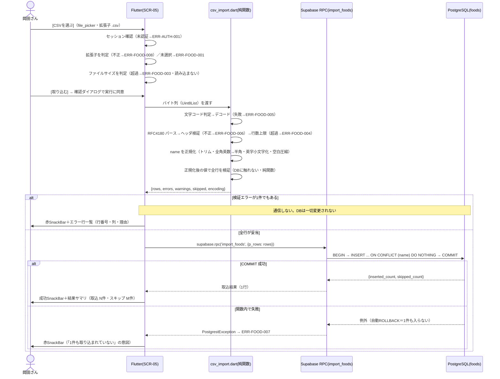

# FEAT-10 食事マスタCSVインポート 詳細設計

> **目的**: FEAT-XX を実装が迷わない粒度（入出力・バリデーション・クエリ・エラー・画面挙動・実装単位）まで具体化し、TDDの着手点を固定する。
> **書き方**: 実データは書かない。上位の正本（API契約＝`../../30_データ・IF設計/02_API設計.md` ／ 物理DB＝`../01_DB物理設計.md` ／ シーケンス＝`../../40_機能設計/01_シーケンス設計.md`）と矛盾させず、参照はIDで行う。横断方針（エラー分類・トランザクション・冪等・リトライ）は `../07_実装共通設計パターン.md` を正本とし本書では再定義しない。

> ⚠️ **本書はたたき台（2026-08-02 生成）**。岡田さんのレビューで確定する。

## 目次
1. [概要](#1-概要)
2. [処理フロー](#2-処理フロー)
3. [入出力仕様](#3-入出力仕様)
4. [業務ロジック](#4-業務ロジック)
5. [データアクセス](#5-データアクセス)
6. [エラー処理](#6-エラー処理)
7. [画面挙動・状態別表示](#7-画面挙動状態別表示)
8. [実装単位](#8-実装単位)
9. [テスト観点](#9-テスト観点)
10. [敵対的検証・要確認事項](#10-敵対的検証要確認事項)

## 1. 概要

| 項目 | 内容 |
|---|---|
| 対応要件 | FEAT-10（食事マスタCSVインポート）。初期データ投入手段＝NFR-MIGR-02、マスタはデータ追加で拡張＝NFR-SCALE-02 |
| 対応画面 | SCR-05 設定・プロフィール |
| 対応API | `supabase.rpc('import_foods', { p_rows })`（Supabase RPC・認証要）。ファイル選択は `file_picker` |
| 廃止した契約 | 旧 `POST /api/foods/import`（multipart/form-data）は使わない |
| 関連ルール | RULE-005（不足分提示は `foods` から抽出・AI不使用）の供給元マスタを整備する |
| 外部連携 | なし（AIは使わない） |
| 性能目標 | NFR-PERF-05（数百件を ≤5秒） |
| 状態 | 状態を持たない（`03_ドメインイベント.md` の「食事マスタが取り込まれた」＝一過性イベント。成功/失敗はSnackBarで通知） |

本機能の要旨:

| 観点 | 内容 |
|---|---|
| 何をする | 岡田さんが手元のCSV（Excel由来を想定）を SCR-05 で選び、`foods`（食品名＋タンパク質量）に**行を追加**する |
| 取込モード | **追加＋重複スキップ**。既存の `foods.name` と一致する行は取り込まない |
| 上書きしない | 同名で `protein_amount` が違う行もスキップする。既存の値は変わらない |
| 冪等性 | 同じCSVを2回流しても結果は同じ（2回目は全件スキップ・NFR-MIGR-02） |
| 重複判定のキー | `foods.name` の UNIQUE（`uq_foods_name`）。比較は正規化後の文字列で行う（§4-5） |
| **パースの場所** | **Flutter 側（端末内）**。Supabase へは検証済み・正規化済みの行の配列だけを送る |
| 用途 | 取り込んだマスタは FEAT-09 の不足分提示（RULE-005）でのみ参照される |
| 結果表示 | 件数サマリ（取込／スキップ）とエラー行一覧 |
| 1件だけの追加 | 1行のCSVを取り込めばよい。専用の画面・APIは設けない |

`../../40_機能設計/01_シーケンス設計.md` に FEAT-10 のシーケンスは無いため、処理フローは本書で新規に定義する。

## 2. 処理フロー

**旧構成との差分**は2点ある。

| # | 差分 | 内容 |
|---|---|---|
| 1 | 実行場所 | CSV のデコード・パース・検証は**サーバではなく端末（Flutter）で行う**。サーバへファイルを送らない。検証NGなら通信自体が発生しない |
| 2 | 取込方式 | 既存マスタを消さない。**追加＋重複スキップ**で取り込む（旧: 洗い替え） |

正規化は検証の前に置く。**送るのも保存されるのも正規化後の文字列**である（§4-5）。



| 段 | 起きること | 利用者から見た結果 |
|---|---|---|
| 検証NG | RPC を呼ばない | `foods` は取込前のまま |
| RPC 失敗 | 関数内で自動ROLLBACK | `foods` は取込前のまま |
| RPC 成功 | 新規の名前だけが入る | 既存の行は1件も変わらない |

## 3. 入出力仕様

契約は2段に分かれる。**旧 multipart アップロードの契約は廃止**。

| 段 | 担当 | 契約 |
|---|---|---|
| 1 | Flutter | ファイル選択 → 文字コード判定 → パース → 正規化 → 検証 → `rows` の JSON 組み立て（§3.1） |
| 2 | Supabase | RPC `import_foods(jsonb)`（§3.2） |

### 3.1 Flutter 側の処理契約

| # | 処理 | 入力 | 出力 | 失敗時 |
|---|---|---|---|---|
| 1 | ファイル選択 | `FilePicker.platform.pickFiles(type: FileType.custom, allowedExtensions: ['csv'])` | `PlatformFile`（`name` / `size` / `bytes`） | 未選択→ERR-FOOD-001／拡張子不正→ERR-FOOD-008 |
| 2 | サイズ判定 | `PlatformFile.size` | 続行可否 | 上限超過→ERR-FOOD-003（**バイト列を読まない**） |
| 3 | 文字コード判定＋デコード | `Uint8List` | `{ text, encoding }`（§4-1） | デコード不能→ERR-FOOD-005 |
| 4 | パース | `String` | `List<List<String>>`（RFC4180） | ヘッダ不正→ERR-FOOD-006／行数超過→ERR-FOOD-004 |
| 5 | 正規化 | `String`（`name` 1セル） | 正規化後の `String`（§4-5） | — （失敗しない純関数） |
| 6 | 検証 | 正規化後の `List<List<String>>` | `{ rows, errors, warnings, skipped }`（§3.4） | `errors` が1件以上→ERR-FOOD-002（**RPCを呼ばない**） |
| 7 | JSON 組み立て | `List<FoodRow>` | `List<Map<String, dynamic>>` | — |

- 1〜7 は端末内で完結する。ネットワークを使わない。
- 3〜6 は**純関数**（`app/lib/domain/csv_import.dart`）。単体テストの主対象（NFR-QUAL-01）。
- 正規化は検証より**先**に置く。長さ・重複の判定は正規化後の文字列で行う。
- 行単位エラーは通信に載らない。Dart のモデルとして画面へ直接渡す。

```dart
// 行単位エラー（画面表示用・§6 の reason_code をそのまま持つ）
class RowError { final int line; final String column; final String reasonCode; }
```

- `line` は**CSVファイル上の物理行番号**（ヘッダ行＝1）。Excel の行番号とそのまま突き合わせられるようにする。
- 画面に出すのは最大100件。超過分は「他にもエラーがある」旨で打ち切る（`errorsTruncated`）。

### 3.2 RPC `import_foods(jsonb)`

| 項目 | 内容 |
|---|---|
| 呼び出し | `supabase.rpc('import_foods', { 'p_rows': rows })` |
| 認証 | 要。JWT は `supabase_flutter` が自動付与。未認証は ERR-AUTH-001 |
| 引数 | `p_rows jsonb` ＝ 検証済み・正規化済み行の配列 |
| 戻り値 | 1行（`inserted_count` / `skipped_count`） |
| 方式 | `insert ... on conflict (name) do nothing`（§5） |
| 既存と同名の行 | **スキップする**。`protein_amount` が違っても上書きしない |
| 往復回数 | **1回のみ**（§5・NFR-PERF-05） |
| 冪等性 | **冪等**。同一CSVを2回投げると2回目は `inserted_count = 0`・`skipped_count` ＝ データ行数になる。自動リトライはしない |

```jsonc
// 引数 p_rows（検証済み・正規化済み・空配列は送らない）
[
  { "name": "string（正規化後・1〜100文字）", "protein_amount": 0.0 }
]

// 戻り値（PostgREST は配列で返す。要素は1つ）
[
  { "inserted_count": 0, "skipped_count": 0 }
]
```

- `inserted_count` ＋ `skipped_count` ＝ `p_rows` の要素数になる。突き合わせで取りこぼしを検知できる。

結果サマリの出どころ:

| 表示項目 | 出どころ | 意味 |
|---|---|---|
| `imported_count` | RPC の `inserted_count` | 新しく入った件数 |
| `skipped_existing_count` | RPC の `skipped_count` | 既存と同名でスキップした件数 |
| `skipped_empty_count` | 端末側の検証結果 | 空行としてスキップした件数（RPCに送っていない） |
| `warning_count` | 端末側の検証結果（§4-4） | 数式扱いされうる `name` の件数 |
| `detected_encoding` | 端末側の文字コード判定（§4-1） | 判定した文字コード |
| `duration_ms` | 端末側の実測（選択〜RPC完了） | 所要時間 |

### 3.3 CSVフォーマット仕様 `[仮]`

ファイル全体の仕様を1つの表にまとめる。行単位の検証は §3.4。

| 項目 | 仕様 | 違反時 | 根拠 |
|---|---|---|---|
| 拡張子 | `.csv` であること | ERR-FOOD-008 | `file_picker` の `allowedExtensions` |
| ファイル選択 | `file_picker` の結果が1件あること | ERR-FOOD-001 | 複数選択は受け付けない |
| 列構成 | `name`（食品名・text）／`protein_amount`（タンパク質量・float）の**2列のみ** | ERR-FOOD-006 | `foods` の列（`../01_DB物理設計.md §1.5`） |
| `protein_amount` の意味 | **1食分あたり**のタンパク質量(g)。100g あたりではない | — | ADR-0012（2026-08-08 確定） |
| CSVに含めない列 | `id` ／ `created_at` | — | DB採番のため |
| 列順 | ヘッダ名で解決（順不同可） | — | 列取り違え防止 |
| ヘッダ行 | **必須**（1行目）。正は `name,protein_amount` | ERR-FOOD-006 | ヘッダ無しは列取り違えを検知できない |
| ヘッダのエイリアス | `食品名,タンパク質量` も受理 | — | Excel で人が作る想定 |
| 区切り文字 | `,`（U+002C）のみ。TSV・セミコロン区切りは非対応 | — | RFC 4180 |
| 文字コード | **UTF-8 ／ UTF-8(BOM付き) ／ Shift_JIS(CP932) の3種**を受理し自動判定 | ERR-FOOD-005 | Excel 由来CSVは Shift_JIS・BOM付きUTF-8 が多い |
| 判定順 | **BOM → UTF-8（厳密）→ Shift_JIS** の順（§4-1） | ERR-FOOD-005 | 逆順だと UTF-8 の日本語が文字化けする |
| 判定結果の表示 | `detected_encoding` として結果サマリに必ず出す | — | 利用者が誤判定に気づけるようにする |
| 改行コード | LF / CRLF を受理。CR単独は非対応 | — | RFC 4180＋Unix系 |
| クォート | RFC 4180 準拠。`"` で囲んだセル内のカンマ・改行・`""` を許容 | — | RFC 4180 |
| 最大行数 | **1,000行**（ヘッダ除く）。データ行0件も不可 | ERR-FOOD-004 | NFR-PERF-05 の「数百件」の2倍。超過は明示的に拒否 |
| 最大ファイルサイズ | **1 MiB**（1,048,576 バイト） | ERR-FOOD-003 | 1行平均100バイト×1,000行＝約100KB。10倍の余裕 |
| `name` の正規化 | 前後空白除去・全角英数→半角・英字小文字化・連続空白を1つへ（§4-5） | — | 表記ゆれによる重複行を減らす |
| 正規化の適用先 | **正規化後の文字列を保存する**。CSVの原文は保存しない | — | 重複判定と保存値を一致させる（案i） |
| `name` 長さ | 1〜100文字（**正規化後**） | ERR-FOOD-002 | 行単位の判定は §3.4 |
| 既存マスタと同名 | エラーにしない。RPC 側でスキップし `skipped_existing_count` に計上 | — | 追加＋重複スキップ方式（§3.2） |
| 空行 | 全列が空の行はスキップ。エラーにせず `skipped_empty_count` に計上 | — | Excel 保存時の末尾空行対策 |

**ファイルサイズ上限の真の制約は RPC のペイロード上限**（旧構成では「Vercel のリクエストボディ上限を下回る」だった）。

| 観点 | 内容 |
|---|---|
| 送るもの | ファイル本体ではなく、パース済み `p_rows` の JSON |
| 膨張率 | CSV 1 MiB → JSON はキー名の付与で概ね2〜3倍 `[仮]` |
| 効く制約 | **Supabase（PostgREST）の RPC リクエストボディ上限**。実値は未確認 `[仮]`（§10-10） |
| 方針 | 1 MiB／1,000行の上限は据え置く。RPC 上限を実測し、下回っていることを確認する |

### 3.4 バリデーション規則

行単位の規則。**全行を一括で検証し、DBを一切触らない**（2パス方式）。

1行でも違反があれば RPC を呼ばず、全件を画面に返す（ERR-FOOD-002）。

| 項目 | 規則 | reason_code |
|---|---|---|
| 列数 | 各データ行はちょうど2列 | `COLUMN_COUNT_MISMATCH` |
| `name` 必須 | 空文字・空白のみは不可（正規化後で判定） | `EMPTY_NAME` |
| `name` 長さ | 1〜100文字（正規化後） | `NAME_TOO_LONG` |
| `name` 重複 | **同一ファイル内**の重複を禁止（正規化後で比較・後勝ちで黙って捨てない） | `DUPLICATE_NAME` |
| `protein_amount` 必須 | 空不可 | `PROTEIN_EMPTY` |
| `protein_amount` 型 | 半角10進数のみ（`^-?\d+(\.\d+)?$`）。全角数字・桁区切りカンマ・単位付き表記は不可 | `PROTEIN_NOT_NUMBER` |
| `protein_amount` 範囲 | 0 ≤ x ≤ 1000。上限は `[仮]` | `PROTEIN_NEGATIVE` ／ `PROTEIN_TOO_LARGE` |

- 上表の違反はすべて ERR-FOOD-002 に集約する。`reason_code` で理由を特定する。
- `protein_amount` の範囲は `foods.protein_amount` の CHECK(≥0) と整合させる。
- ファイル全体の規則（拡張子・サイズ・文字コード・ヘッダ・行数）と対応 ERR-ID は §3.3。

**重複の扱いは2種類ある。混同しない。**

| 重複の種類 | 判定する場所 | 扱い |
|---|---|---|
| 同一ファイル内で `name` が重複 | 端末側の検証 | **エラー**（`DUPLICATE_NAME`・ERR-FOOD-002）。どちらを採るか決められないため |
| 既存マスタと `name` が重複 | DB（`uq_foods_name`） | **スキップ**。エラーにしない（§3.2） |

**検証が端末側に移ったことの帰結**:

| 論点 | 内容 |
|---|---|
| 利点 | NG のとき通信が発生しない。応答が速い |
| 利点 | サーバ側の実行時間上限を気にしなくてよい |
| 弱点 | 検証は**信頼境界の外**にある。改造したクライアントは検証を飛ばして RPC を呼べる |
| 緩和 | DB側の砦は `foods.protein_amount` の CHECK(≥0) と `uq_foods_name`（UNIQUE）の2つ |
| 緩和 | 正規化を飛ばされても、UNIQUE により**完全一致の重複だけは DB が防ぐ** |
| 残る穴 | 正規化を飛ばした `　鶏むね肉 ` は別行として入る。DBは正規化を強制しない |
| 緩和 | 単一ユーザー運用のため当面は許容する（ADR-0016・§10-1） |

## 4. 業務ロジック

### 4-1. 文字コード判定

`detectAndDecode`。純関数（NFR-QUAL-01）。

| # | 判定 | 結果 |
|---|---|---|
| 1 | 先頭3バイトが `EF BB BF` | `utf-8-bom`（BOMを除去して UTF-8 デコード） |
| 2 | `utf8.decode(bytes, allowMalformed: false)` が例外を投げない | `utf-8` |
| 3 | `CharsetConverter.decode('shift_jis', bytes)` が成功 `[仮]` | `shift_jis` |
| 4 | いずれも失敗 | ERR-FOOD-005 |

- UTF-8 を厳密（`allowMalformed: false`）にデコードしてから Shift_JIS にフォールバックする**順序が肝**。
- 逆順にすると Shift_JIS デコーダはほぼ何でも通す。UTF-8 の日本語が文字化けする。
- 判定結果は必ず結果サマリに含め、利用者が誤判定に気づけるようにする（§10-4）。

**Dart 側のデコード実装** `[仮]`:

| 文字コード | 手段 |
|---|---|
| UTF-8 / UTF-8(BOM) | `dart:convert` の `utf8`（標準） |
| Shift_JIS(CP932) | **Dart 標準に無い**。`charset_converter` 等のプラグインを使う `[仮]`（§10-9） |

### 4-2. `protein_amount` の意味（2026-08-08 確定・ADR-0012）

`protein_amount` は **1食分あたり**のタンパク質量(g)である。100g あたりではない。

| 項目 | 内容 |
|---|---|
| 定義 | その食品を1回に食べる標準量（1食分・1パック等）あたりのタンパク質量(g) |
| 残量との比較 | 残量(g)と直接比較できる。換算が要らない |
| FEAT-09 の提示形式 | RULE-005 は「あと○g 不足 → △△を食べると補える」 |
| 100gあたりだと成立しない | 「何g食べればよいか」の換算が要る |
| 換算できない | `foods` に内容量を持つ列が無い |

- **「1食分」がどれくらいかはCSVの作成者が食品ごとに決める。** アプリは判定しない。
- 列説明の正本は `../01_DB物理設計.md §1.5`。本書はそれに従う。

### 4-3. 取込モードの選択理由

2026-08-08 の決定により `foods.name` に UNIQUE（`uq_foods_name`）が入った。衝突判定キーができたため **追加＋重複スキップ**を採用する。

| モード | 冪等性（NFR-MIGR-02） | 判定 |
|---|---|---|
| 追記（INSERT only・制約なし） | 満たさない（再取込のたび重複が積み上がる） | 不採用 |
| 洗い替え（全件DELETE → INSERT） | 満たす | 不採用。1件追加のたびに全件を作り直す運用になる（§10-12） |
| upsert（`do update`） | 満たす | 不採用。CSVの値が既存を上書きし、事故の影響が大きい |
| **追加＋重複スキップ（`do nothing`）** | 満たす（2回目は全件スキップ） | **採用** |

採用の帰結:

| 観点 | 内容 |
|---|---|
| 1件追加 | 1行のCSVで足りる。全件を作り直さなくてよい |
| 既存の保護 | 既存行は上書きも削除もされない。誤ったCSVでも既存マスタは壊れない |
| 消せない | **誤って入れた行を消す手段は本機能に無い**（§10-7） |
| 上書きできない | 既存の `protein_amount` を直す手段も無い（同上） |
| FK参照が無い | `foods` は他テーブルから FK 参照されない（`01_データモデル.md` の DM-09 は独立エンティティ。`meal_logs` と FK で繋がない） |
| `id` の採番 | `GENERATED ALWAYS AS IDENTITY`。スキップされた行では採番が進まない（`do nothing` は INSERT を試みるため飛び番は生じうる `[仮]`）。外部参照が無いので影響しない |

### 4-4. 警告（取込は継続）

対象は `name` の先頭が `=` `+` `@` `TAB` `CR` のいずれかの行。

| 項目 | 内容 |
|---|---|
| リスク | 表計算ソフトへ再エクスポートした際に数式として解釈されうる（CSVインジェクション） |
| 扱い | 取込自体はブロックしない。`warning_count` に計上し、画面に該当行を提示する `[仮]` |
| 実害 | 本アプリに CSV エクスポート機能が無いため限定的（§10-6） |

### 4-5. `name` の正規化

`normalizeFoodName`。純関数（NFR-QUAL-01）。**正規化後の文字列をそのまま保存する**（案i）。

| # | 処理 | 例 |
|---|---|---|
| 1 | 前後の空白を除去（半角・全角） | `　鶏むね肉 ` → `鶏むね肉` |
| 2 | 全角英数字を半角へ | `ＭＣＴオイル` → `MCTオイル` |
| 3 | 英字を小文字へ | `Whey` → `whey` |
| 4 | 連続する空白を1つへ | `鶏  むね肉` → `鶏 むね肉` |

- 適用順は 1→4 の順とする。2 で全角空白が半角に変わらないため、1 と 4 は全角空白も対象にする。
- 正規化するのは `name` のみ。`protein_amount` は数値として検証する（§3.4）。

**吸収しないもの**:

| 対象 | 例 | 理由 |
|---|---|---|
| カタカナ・ひらがなの表記ゆれ | `鶏むね肉` と `鶏ムネ肉` は**別行**になる | 別物を同一視する事故を避ける |
| 送り仮名・漢字の違い | `玉子` と `たまご` は別行 | 同上 |
| Unicode 正規化（NFKC 等） | 濁点の合成・分解は扱わない `[仮]` | 影響範囲が読み切れない |

- 表記ゆれが残ることは受容する（§10-14）。名寄せは利用者がCSV側で行う。
- 実装は `app/lib/domain/csv_import.dart` に置き、単体テストの対象にする（§8・§9）。

## 5. データアクセス

```sql
-- 追加＋重複スキップ: バルクINSERT を1トランザクションに閉じる。
-- $1 = 検証済み・正規化済み行の配列（jsonb）: [{"name": <text>, "protein_amount": <float>}, ...]
-- 衝突判定は uq_foods_name（foods(name) の UNIQUE INDEX・01_DB物理設計.md §1.5）。
-- supabase_flutter の .insert() でも on conflict は書けるが、件数の内訳を1往復で返す目的で
-- DB関数（RPC）にまとめる。
create or replace function import_foods(p_rows jsonb)
returns table (inserted_count bigint, skipped_count bigint)
language plpgsql
security definer
as $$
declare v_total bigint; v_inserted bigint;
begin
  select count(*) into v_total from jsonb_array_elements(p_rows);
  with i as (
    insert into foods (name, protein_amount)
    select r.name, r.protein_amount
      from jsonb_to_recordset(p_rows) as r(name text, protein_amount float8)
    on conflict (name) do nothing
    returning 1
  ) select count(*) into v_inserted from i;
  return query select v_inserted, v_total - v_inserted;
end $$;
```

- 呼び出しは `supabase.rpc('import_foods', { p_rows })` の**1往復のみ**。
- 1行1 INSERT だと数百往復となり NFR-PERF-05（≤5秒）を満たせない（§10-5）。
- `skipped_count` は「送った件数 − 入った件数」で求める。`do nothing` は既存行を返さないため直接は数えられない。
- 同一ファイル内の重複は端末側で弾く（§3.4）。1文の INSERT で同名2行が来ると `do nothing` でも片方しか入らず、件数の意味が曖昧になるため。

性能配分 `[仮]`。

| 区間 | 目標 | 備考 |
|---|---|---|
| 端末側のデコード＋パース＋正規化＋検証 | ≤1,000ms | モバイル端末のため旧サーバ想定より緩める |
| RPC 1往復（バルクINSERT） | ≤1,500ms | 洗い替えが無くなった分だけ軽い |
| 合計（p95） | ≤5秒 | NFR-PERF-05 |

| 観点 | 内容 |
|---|---|
| 対象テーブル | `foods`（INSERT 一括のみ。DELETE も UPDATE もしない）。他テーブルへの読み書きは無し |
| 使用INDEX | **`uq_foods_name`**（`foods(name)` の UNIQUE INDEX）。`on conflict (name)` の衝突判定に使う。本機能のための追加INDEXは不要 |
| RLS | `foods` は**共通マスタ**として `TO authenticated USING (true)` とする（2026-08-08 確定・正本は `../01_DB物理設計.md §3`）。所有者による絞り込みは行わない |
| 書込口 | RLS 上は認証済みなら直接 INSERT もできるが、**本アプリは `import_foods()` 以外から `foods` に書かない**。件数の内訳を返せるのがこの関数だけのため（§10-1） |
| 関数の実行権限 | `grant execute on function import_foods(jsonb) to authenticated` `[仮]`。端末から直接呼ぶ唯一の書込口になる |
| トランザクション境界 | `import_foods()` の呼び出し1回＝1トランザクション。**検証は境界の外**（端末側・DB未接触） |
| 失敗時 | 関数内で失敗すれば自動ROLLBACKされ**1件も入らない**。部分コミットは発生しない |

## 6. エラー処理

HTTPステータスによる分類は廃止した。エラーの大半が端末内で確定するためである。

RPC 由来の失敗は `PostgrestException` として返る。`foods_repository.dart` で ERR-ID に写像する。

| ERR-ID | 検出箇所 | 発生条件 | 利用者向けメッセージ（意図） | retryable | ログ |
|---|---|---|---|---|---|
| ERR-AUTH-001 | Supabase Auth | 未認証（共通契約）。RPC 呼び出しが拒否される | ログインが必要である旨 | false | Supabase Auth ログ（NFR-SEC-AUDIT-02） |
| ERR-FOOD-001 | Flutter（選択） | ファイルが選択されていない／複数選択 | ファイルが選択されていない旨 | false | 端末ログのみ（ファイル名だけ・内容は残さない） |
| ERR-FOOD-002 | Flutter（検証） | 1行以上の行バリデーション違反（§3.4）。**同一ファイル内の `name` 重複を含む** | 何行目のどの列がなぜ不正かを一覧で示す旨 | false | 端末ログのみ（件数と `reason_code` の内訳のみ。セル値は残さない） |
| ERR-FOOD-003 | Flutter（選択） | ファイルサイズが上限超過 | 上限サイズを示し分割を促す旨 | false | 端末ログのみ（サイズだけ） |
| ERR-FOOD-004 | Flutter（パース） | 行数が上限超過／データ行0件 | 上限行数を示す旨 | false | 端末ログのみ |
| ERR-FOOD-005 | Flutter（デコード） | 対応3文字コードでデコード不能 | 対応文字コードで保存し直す旨 | false | 端末ログのみ |
| ERR-FOOD-006 | Flutter（パース） | ヘッダ行の必須列が欠落 | 必要な列名を示す旨 | false | 端末ログのみ |
| ERR-FOOD-007 | Supabase RPC | `import_foods()` が失敗（ROLLBACK済み） | 取込に失敗し**1件も取り込まれていない**旨 | true（手動再実行） | error（DBエラー原文は Supabase 側のログのみ） |
| ERR-FOOD-008 | Flutter（選択） | 選択されたファイルの拡張子が `.csv` でない | CSVファイルの選択を促す旨 | false | 端末ログのみ |

行単位エラーの返し方は維持する。次の3点で1件を特定する。画面表示は最大100件で打ち切る。

| 項目 | 内容 |
|---|---|
| `line` | CSVファイル上の物理行番号（ヘッダ行＝1） |
| `column` | `name` ／ `protein_amount` ／ `-` |
| `reason_code` | §3.4 の理由コード |

- ERR-FOOD-007 の retryable=true は「手動での再実行が有効」という意味である。
- ERR-FOOD-007 でも**自動リトライはしない**。同じCSVの再実行は冪等（2回目は全件スキップ）だが、失敗原因を利用者に確認させるためである。
- 既存マスタと同名の行は**エラーではない**。ERR-ID を割り当てず `skipped_existing_count` として結果サマリに出す。
- CSVの中身（食品名・数値）はログに残さない。ログ方針の正本は `../05_ログ設計.md`。
- Flutter 側のクラッシュ収集はスコープ外。端末ログは外部送信しない。

> ERRの完全列挙の正本は `../../60_テスト設計/02_RED母集合_受入基準・状態・エラー.md`（段6で集約）。本表はその入力とする。

## 7. 画面挙動・状態別表示

SCR-05 設定・プロフィール内の「食事マスタ取込」セクション。

| 項目 | 内容 |
|---|---|
| ファイル選択 | `file_picker`（`FileType.custom` ＋ `allowedExtensions: ['csv']`） |
| ドラッグ＆ドロップ | iOS では使わないため考慮しない |

| 状態 | 表示 | 操作可否 |
|---|---|---|
| 初期/空 | `OutlinedButton`「CSVを選ぶ」＋説明テキスト（列構成・対応文字コード・上限行数/サイズ）。案内バナーで「既存の食品は消えず、同じ名前の行はスキップされる」旨を掲示（`Container` ＋ `Icon(Icons.info_outline)`） | ファイル選択のみ可。[取り込む] は `onPressed: null` |
| 選択済み | ファイル名・サイズを `ListTile` で表示。[取り込む] 活性 | [取り込む] 押下で `showDialog`（`AlertDialog`・[実行する]/[やめる]）を開く |
| 読込中（パース） | `LinearProgressIndicator`（不定形）＋「CSVを読み込み中」 | 画面全体を `AbsorbPointer` で操作不可にする |
| 読込中（送信） | `LinearProgressIndicator`（不定形）＋「サーバへ反映中」。実測5秒以内のため**実進捗バーは持たない** | 同上。二重送信を防止 |
| 成功 | 緑の `SnackBar`（`ScaffoldMessenger.showSnackBar`）＋セクション内に結果サマリ `Card`。**主文は「取込 N件・スキップ M件」**。`warning_count > 0` なら黄色 `Card` に該当行を併記 | 続けて別ファイルの取込が可能。FEAT-09 の候補は次回取得時に新しい行を含む |
| 成功（全件スキップ） | 緑の `SnackBar`＋「取込 0件・スキップ M件（すべて登録済み）」。エラー扱いにしない | 同上 |
| エラー（検証） | 赤の `SnackBar` ＋ `ListView.builder`（行番号／列／理由）で最大100件を表示。`errorsTruncated` なら「他にもエラーがある」旨を末尾に表示 | 修正して再選択・再実行が可能。**DBは未変更**である旨を明記 |
| エラー（その他） | 赤の `SnackBar` にエラーメッセージ。ERR-FOOD-007 は「1件も取り込まれていない」旨を必ず添える | 再実行が可能 |

成功サマリ `Card` に出す項目とその出どころは §3.2 の表を正とする。

**結果表示の文言**:

| 項目 | 文言の意図 |
|---|---|
| 取込 N件 | 新しく追加された件数（`inserted_count`） |
| スキップ M件 | **同じ名前が既に登録済み**のため取り込まなかった件数（`skipped_count`） |
| 空行 K件 | CSV上の空行。スキップとは分けて出す（`skipped_empty_count`） |

**1件だけ追加する用途**:

| 観点 | 内容 |
|---|---|
| やり方 | ヘッダ1行＋データ1行のCSVを作って取り込む |
| 結果 | 未登録なら「取込 1件・スキップ 0件」、登録済みなら「取込 0件・スキップ 1件」 |
| 専用UI | 設けない。取込経路を1本に保つため（§10-12） |
| 何度でも押せる | 冪等なので、同じCSVを誤って2回取り込んでも重複しない |

**進捗表示を2段に分けた理由**:

| 段 | 何をしている | 利用者が知りたいこと |
|---|---|---|
| パース | 端末内でデコード・検証 | 止まっているのではなく処理中である |
| 送信 | RPC 1往復 | 通信中である（オフライン時に切り分けられる） |

- 確認ダイアログに件数の内訳は出さない。取込前に何件がスキップされるかは、実行しないと分からないため（§10-7）。
- 文字コードの誤判定に気づけるよう、成功サマリの `detected_encoding` は必ず可視化する。
- 正規化で名前が変わる旨を説明テキストに書く（例: 前後の空白が消える・`ＭＣＴ` が `MCT` になる）。保存されるのは正規化後の文字列である。
- `protein_amount` は**1食分あたり**で入力する旨も説明テキストに書く（§4-2・ADR-0012）。
- `name` はプレーンテキストとして `Text` ウィジェットに描画する。
- Flutter は HTML を解釈しないため、XSS は構造的に発生しない（§10-6）。

## 8. 実装単位

| # | ファイル | 役割 | 主なシグネチャ |
|---|---|---|---|
| 1 | `supabase/migrations/*_uq_foods_name.sql` | `foods(name)` の UNIQUE INDEX（`uq_foods_name`）。正本は `../01_DB物理設計.md §1.5` | `create unique index uq_foods_name on foods(name)` |
| 2 | `supabase/migrations/*_fn_import_foods.sql` | `import_foods(jsonb)` 関数のDDL＋実行権限付与（可逆マイグレーション・NFR-MIGR-03） | `create or replace function import_foods(p_rows jsonb) returns table (...)` |
| 3 | `app/lib/domain/csv_import.dart` | 文字コード判定・RFC4180パース・**正規化**・全行検証（**純関数・単体テスト対象**・NFR-QUAL-01の主対象） | `DecodedCsv detectAndDecode(Uint8List bytes)` ／ `List<List<String>> parseCsv(String text)` ／ `String normalizeFoodName(String raw)` ／ `FoodsCsvResult validateFoodsCsv(List<List<String>> rows)` |
| 4 | `app/lib/data/foods_repository.dart` | `import_foods` RPC 呼び出しと例外→ERR-ID マッピング | `Future<ImportFoodsResult> importFoods(List<FoodRow> rows)` |
| 5 | `app/lib/features/settings/foods_csv_import_section.dart` | SCR-05 の取込UI（`file_picker`／確認 `AlertDialog`／結果 `Card`／`SnackBar`） | `class FoodsCsvImportSection extends StatefulWidget` |
| 6 | `app/lib/features/settings/settings_page.dart` | SCR-05 本体。上記セクションを組み込む | `class SettingsPage extends StatelessWidget` |

- `ImportFoodsResult` は `insertedCount` / `skippedCount` を持つ。
- 1 は 2 より先に流す。UNIQUE が無いと `on conflict (name)` は実行時エラーになる。
- `normalizeFoodName` は**画面からもリポジトリからも呼ばない**。`validateFoodsCsv` の内部で1回だけ適用し、二重適用を避ける。

| 追加依存 `[仮]` | 用途 |
|---|---|
| `file_picker` | CSVファイルの選択 |
| `charset_converter` | Shift_JIS(CP932) のデコード（§4-1・§10-9） |

## 9. テスト観点

| TC-ID | 観点 | 期待 |
|---|---|---|
| TC-FEAT10-01 | 正常系・UTF-8（BOM無し）・数百行 | `imported_count`＝データ行数、`detected_encoding`＝`utf-8` |
| TC-FEAT10-02 | 正常系・BOM付きUTF-8 | BOMがヘッダ名に混入せず、ヘッダ検証を通過する |
| TC-FEAT10-03 | 正常系・Shift_JIS（Excel由来） | 日本語の食品名が文字化けせず取り込まれる（実機で `charset_converter` の挙動を確認する） |
| TC-FEAT10-04 | 判定順序 | 日本語を含むUTF-8が Shift_JIS と誤判定されない（§4-1 の順序） |
| TC-FEAT10-05 | 冪等性（NFR-MIGR-02） | 同一CSVを2回取り込むと、2回目は `inserted_count`＝0・`skipped_count`＝データ行数。`foods` の件数・内容は1回目と同一 |
| TC-FEAT10-06 | 既存を上書きしない | 既存と同名で `protein_amount` が違うCSVを取り込むと、その行はスキップされ**既存の値が変わらない** |
| TC-FEAT10-07 | 検証エラー時はDB未変更 | 1行でも不正なら ERR-FOOD-002 かつ **RPCが呼ばれない**。`foods` の行数・内容が取込前と一致 |
| TC-FEAT10-08 | エラー行報告 | `line` がヘッダ行を1とした物理行番号と一致し、`column`・`reasonCode` が特定できる |
| TC-FEAT10-09 | `protein_amount` の境界値・型 | `0` は通り、`-0.1` は `PROTEIN_NEGATIVE`、`1000.1` は `PROTEIN_TOO_LARGE`、全角数字・`20g`・`1,200` は `PROTEIN_NOT_NUMBER` |
| TC-FEAT10-10 | 重複・空行 | ファイル内 `name` 重複は `DUPLICATE_NAME`／空行は `skipped_empty_count` に計上されエラーにならない |
| TC-FEAT10-11 | クォート・埋め込みカンマ/改行 | `"` で囲まれたセル内のカンマ・改行・`""` が正しく1セルとして復元される |
| TC-FEAT10-12 | 上限（NFR-SEC-04/05・DoS） | 1 MiB 超は ERR-FOOD-003（**バイト列を読む前に拒否**）／1,000行超は ERR-FOOD-004 |
| TC-FEAT10-13 | 性能（NFR-PERF-05） | 数百行のCSVで完了が ≤5秒（バルクINSERT・RPC1往復であること）。実機（iOS）で測る |
| TC-FEAT10-14 | 認証（NFR-SEC-01） | 未認証状態の RPC 呼び出しは拒否され `foods` が変更されない |
| TC-FEAT10-15 | CSVインジェクション・FEAT-09連携 | `=` 始まりの `name` は `warning_count` に計上され取込は成功し、取込後の `get_protein_remaining` の `suggestions` が新しい行を含む |
| TC-FEAT10-16 | 正規化（純関数・§4-5） | `　鶏むね肉 `→`鶏むね肉`／`ＭＣＴオイル`→`MCTオイル`／`Whey`→`whey`／`鶏  むね肉`→`鶏 むね肉` |
| TC-FEAT10-17 | 正規化後の値が保存される | `ＭＣＴオイル` を含むCSVを取り込むと `foods.name` は `MCTオイル`。原文は保存されない |
| TC-FEAT10-18 | 正規化違いは同一視される | `Whey` を取込済みの状態で `whey`／` WHEY ` を取り込むと `skipped_count`＝1、`foods` は増えない |
| TC-FEAT10-19 | 表記ゆれは吸収しない（既知の制約） | `鶏むね肉` を取込済みの状態で `鶏ムネ肉` を取り込むと**別行として追加**される（`inserted_count`＝1・§10-14） |
| TC-FEAT10-20 | 1件だけ追加 | データ行1行のCSVで「取込 1件・スキップ 0件」。同じCSVをもう一度取り込むと「取込 0件・スキップ 1件」 |
| TC-FEAT10-21 | UNIQUE 制約の実在 | `uq_foods_name` が無い状態で `import_foods` を呼ぶと `on conflict (name)` が失敗する（マイグレーション順序の担保・§8） |

受入基準（G/W/T）の候補:
- [AC] Given SCR-05 を開いている When 正しい形式のCSV（数百行）を選んで取り込む Then 取込件数・スキップ件数・検出文字コードのサマリが成功SnackBarとともに5秒以内に表示される
- [AC] Given 3行目の `protein_amount` が負値のCSV When 取り込む Then ERR-FOOD-002 とともに「3行目・protein_amount」がエラー一覧に示され、`foods` は取込前の内容のままである
- [AC] Given 一度取り込み済みの食事マスタがある When 同じCSVをもう一度取り込む Then 「取込 0件・スキップ 全件」と表示され `foods` の件数・内容は変わらない
- [AC] Given `鶏むね肉` が登録済みである When `鶏むね肉` を含み `protein_amount` だけ違うCSVを取り込む Then その行はスキップされ、登録済みの `protein_amount` は変わらない
- [AC] Given 新しい食品を1つだけ足したい When ヘッダ1行＋データ1行のCSVを取り込む Then 「取込 1件・スキップ 0件」と表示され、その食品が FEAT-09 の候補に現れる
- [AC] Given Excel で Shift_JIS 保存されたCSV When 取り込む Then 日本語の食品名が文字化けせず取り込まれ、`detected_encoding` に `shift_jis` が表示される

> 受入基準・ST・ERR の**正本は段6**（`../../60_テスト設計/02_RED母集合_受入基準・状態・エラー.md`・本PR対象外）。本節はその母集合への入力。

## 10. 敵対的検証・要確認事項

| # | 論点 | 内容 | 重大度 |
|---|---|---|---|
| 1 | ~~`foods` に `user_id` が無い~~（**解決**） | **共通マスタで確定**（2026-08-08・岡田さん決定）。`foods` は所有者列を持たない。RLS は `TO authenticated USING (true)`（`../01_DB物理設計.md §3`） | — |
| 〃 | 〃 | ~~認証済みユーザーなら誰でも全件を置換できる~~ → 洗い替えをやめたため**破壊的な置換は起こらない**。既存行は上書きも削除もされない | 〃 |
| 〃 | 〃 | 残る影響は「認証済みなら誰でも行を追加できる」ことだけ。単一ユーザー運用（NFR-SCALE-01 でマルチテナントは適用外）では実害が無い | 〃 |
| 〃 | 〃 | Phase2 のマルチユーザー化では関数内の権限チェックが要る（横断論点として `../01_DB物理設計.md` に残す） | 〃 |
| 2 | ~~`foods.name` に UNIQUE が無い~~（**解決**） | **UNIQUE 追加で確定**（2026-08-08・岡田さん決定）。`create unique index uq_foods_name on foods(name)` | — |
| 〃 | 〃 | 衝突判定キーができたため `insert ... on conflict (name) do nothing` が使える（§5） | 〃 |
| 〃 | 〃 | ~~upsert のキーが無く、取込モードは洗い替えしか選べない~~ → **追加＋重複スキップ**を採用した（#12） | 〃 |
| 〃 | 〃 | `foods` を一度空にしないため、FEAT-09 の候補提示が一瞬空になる問題も消えた | 〃 |
| 〃 | 〃 | INDEX の追加は `../01_DB物理設計.md §1.5` へ反映済み（INDEX は7本になる） | 〃 |
| 〃 | 〃 | UNIQUE は**完全一致**でしか効かない。表記ゆれの吸収は正規化（§4-5）が担い、その範囲には限界がある（#14） | 〃 |
| 3 | ~~`protein_amount` の単位が未定義~~（**解決**） | **1食分あたりで確定**（2026-08-08・岡田さん決定・ADR-0012）。100g あたりではない | — |
| 〃 | 〃 | ~~CSVの中身を決める本書が単位を確定しないと、同じ数値が別の意味で混在する~~ → 単位が1つに決まったため混在しない | 〃 |
| 〃 | 〃 | ~~FEAT-09（RULE-005）の「△△を食べると補える」が成立しない~~ → 残量(g)と直接比較でき成立する | 〃 |
| 〃 | 〃 | ~~本書は §4-2 で「1食分あたり」を `[仮]` 採用した~~ → §4-2 の `[仮]` を外し、§3.3 のCSV仕様にも明記した | 〃 |
| 〃 | 〃 | 「1食分」の量はCSV作成者が食品ごとに決める。この判断はアプリの外に残る | 〃 |
| 4 | 文字コードの誤判定 | Shift_JIS デコーダはほぼ任意のバイト列を受理する。判定順序を誤ると文字化けが**エラーにならず静かに取り込まれる** | 🟡 中 |
| 〃 | 〃 | §4-1 の順序（BOM→UTF-8厳密→Shift_JIS）と `detected_encoding` の可視化で緩和した | 〃 |
| 〃 | 〃 | CP932 の機種依存文字など完全ではない | 〃 |
| 〃 | 〃 | 取込前プレビュー（先頭数行を画面で確認させる）を追加するか要判断 | 〃 |
| 5 | 性能（NFR-PERF-05） | 1行1 INSERT を `supabase_flutter`（PostgREST）で行うと数百HTTP往復となる | 🟡 中 |
| 〃 | 〃 | モバイル回線では1往復50〜200msで 15〜60秒かかり ≤5秒を満たせない | 〃 |
| 〃 | 〃 | **バルクINSERT（RPC1往復）が必須要件**。実装時に個別INSERTへ退化しないよう TC-FEAT10-13 で担保する | 〃 |
| 6 | CSVインジェクション・DoS | `=` 始まりセルは本アプリにエクスポート機能が無いため直ちに実害は無い | 🟡 中 |
| 〃 | 〃 | XSS は Flutter が HTML を解釈しないため構造的に発生しない。旧構成では React の既定エスケープに依存していた | 〃 |
| 〃 | 〃 | 検証が端末側に移ったことで**改造クライアントは検証を飛ばして RPC を直接呼べる**。巨大ペイロードによる DoS も同様 | 〃 |
| 〃 | 〃 | DB側の防御が CHECK(≥0) と `uq_foods_name` だけでよいかが未定（NFR-SEC-04/05） | 〃 |
| 7 | 取込後の個別編集手段が無い | 取り込んだ食品を1件だけ直す／消す手段が要件にも本書にも存在しない | 🔴 高 |
| 〃 | 〃 | **追加＋重複スキップでは上書きも削除もできない**（#12 の解決に伴い重大度を 🟡 中 → 🔴 高 に引き上げ） | 〃 |
| 〃 | 〃 | 誤った `protein_amount` を入れると、再取込しても直らない。修正には Supabase 側の直接操作が要る | 〃 |
| 〃 | 〃 | 1件だけ**追加**する手段は確保できた（1行CSV・§7）。足りないのは**訂正と削除** | 〃 |
| 〃 | 〃 | 現行件数を取る手段も定義していないため、取込前にスキップ予定件数を出せない（§10-11 と関連） | 〃 |
| 8 | エラー詳細が共通契約に無い | 行単位エラー（`line`/`column`/`reasonCode`）が `02_API設計.md §5` の共通エラー応答契約に無い | 🟡 中 |
| 〃 | 〃 | 共通契約の形は `error_code`/`message`/`retryable` の3項目である | 〃 |
| 〃 | 〃 | 本構成では通信に載らず端末内で完結するが、共通のエラー表示部品と構造が揃わない点は変わらない | 〃 |
| 〃 | 〃 | 段3の契約改訂で整理するのか、本機能限定の例外とするのかを決める必要がある | 〃 |
| 9 | 追加依存とプラグイン挙動 | Shift_JIS(CP932) のデコーダは **Dart 標準に無い**。`charset_converter` 等のプラグインが要る | 🟡 中 |
| 〃 | 〃 | プラグインは iOS ネイティブ実装に依存するため、実機での挙動確認が必須 | 〃 |
| 〃 | 〃 | 代替として Dart 純実装の変換表を自前で持つ案もあるが、保守コストが上がる（NFR-MAINT-01） | 〃 |
| 10 | 上限値の根拠が薄い | 1,000行／1 MiB／`name` 100文字／`protein_amount` ≤1000 はいずれも `[仮]` | 🟢 低 |
| 〃 | 〃 | 岡田さんの手元CSVの実サイズを確認して確定させる | 〃 |
| 〃 | 〃 | **RPC のペイロード上限**（Supabase / PostgREST 側の制約）は未確認である | 〃 |
| 〃 | 〃 | 1,000行分の JSON が通ることを実測で裏取りする | 〃 |
| 11 | 全件ロールバックか部分成功か | 利用者からの質問「1件失敗したら全件ロールバックだと思うが、失敗したものだけスキップして続行できないか」 | 🟡 中 |
| 〃 | 〃 | **技術的には可能**。実現方法とトレードオフは §10.1-A に整理した | 〃 |
| 〃 | 〃 | 今回は方式を変更しない（現行＝全件ロールバック） | 〃 |
| 〃 | 〃 | ただし「既存と同名」だけは**行単位でスキップ**するようになった（#12）。これはエラーではないため全件ロールバックの対象外 | 〃 |
| 12 | ~~全置換ではなく1件追加ができないか~~（**解決**） | 利用者からの質問「1件追加はできないか。名前で比較して既存はスキップし重複を防ぎたい」に対し、**追加＋重複スキップ方式で確定**（2026-08-08・岡田さん決定） | — |
| 〃 | 〃 | 根本原因だった `foods.name` の UNIQUE 欠如を解消し（#2）、`insert ... on conflict (name) do nothing` で実現する（§5） | 〃 |
| 〃 | 〃 | 1件追加は**1行のCSVを取り込む**ことで行う。専用の画面・APIは設けず取込経路を1本に保つ（§7） | 〃 |
| 〃 | 〃 | 名前の比較は正規化後の文字列で行う（§4-5）。既存と同名なら `protein_amount` が違っても上書きしない | 〃 |
| 〃 | 〃 | 選択肢の比較は §10.1-B に残す | 〃 |
| 13 | ~~上位文書との乖離~~（**解決**・2026-08-08） | 段3（`02_API設計.md`）を改訂し、`POST /api/foods/import` を RPC `import_foods` に置き換えた | — |
| 〃 | 〃 | ADR-0010（Flutter + Supabase）・ADR-0011（Gemini API 直接）で構成も確定した | 〃 |
| 14 | 正規化がカタカナの表記ゆれを吸収しない | `鶏むね肉` と `鶏ムネ肉` は**別行として両方入る**。UNIQUE も正規化も止められない | 🟡 中 |
| 〃 | 〃 | 意図的な判断である（§4-5）。別物を同一視する事故を避けるため、吸収は空白・全角半角・大小文字までに限った | 〃 |
| 〃 | 〃 | FEAT-09 の不足分提示に、同じ食品が2行で並ぶことが起こりうる | 〃 |
| 〃 | 〃 | 重複に気づいても消す手段が無い（#7）。名寄せは利用者がCSV側で行う前提 | 〃 |
| 〃 | 〃 | 将来カタカナ→ひらがな等の正規化を足すと、**既に入っている行との整合が取れなくなる**（保存値も正規化後のため移行が要る） | 〃 |

### 10.1 今後の検討（利用者からの質問・今回は方式を変更しない）

#### A. 失敗した行だけスキップして続行できるか（§10-11）

**結論**: 技術的には可能。ただし今回は変更しない。現行は「1行でも不正なら1件も入らない」である。

実現方法の選択肢:

| 案 | やり方 | 得られるもの | 失うもの |
|---|---|---|---|
| **A-1 現行（全件ロールバック）** | 検証NGなら RPC を呼ばない。RPC 内の失敗は自動ROLLBACK | 「全部入った／1件も入っていない」の2値。状態が単純 | 1行の誤りで全件が入らない |
| **A-2 検証を通った行だけ送る** | 端末側でNG行を除外し、OK行だけ `p_rows` に載せる。**RPC は無変更**。戻り値に端末側の `failed_count` を足して表示する | 実装が最小。どの行を捨てたかは端末が把握済み | 一部だけ入った状態になり、CSVとDBが一致しなくなる |
| **A-3 RPC 内で行ごとに例外を握る** | plpgsql の `for ... loop` 内に `begin ... exception when others then` を置いて失敗を数える。戻り値に `failed_count` と失敗行番号を追加 | DB制約違反（将来のCHECK追加など）も拾える。端末の検証を通り抜けた行も救える | 1行1INSERT＋例外ブロック（サブトランザクション）で遅くなり NFR-PERF-05 に効く |

共通のトレードオフ:

| 論点 | 内容 |
|---|---|
| 一貫性 | 「全件成功／1件も入らない」の2値だから、失敗時に何が起きたかを説明しやすい。部分成功にすると DB の内容がどの CSV とも一致しなくなる |
| 再取込との相性 | 現行の回復手段は「直したCSVを丸ごと再取込する」。取込は冪等なので、既に入った行はスキップされて残りだけが入る |
| 画面 | 成功サマリに `failed_count` と失敗行一覧を併記することになる。「成功したが一部失敗」という第3の状態が §7 に増える |
| 検証との重複 | 端末側の §3.4 検証を通った行は、実運用ではほぼ失敗しない。部分成功が効くのは DB制約違反だけであり、費用対効果が小さい |

**推奨**: 変えるなら A-2（実装が最小・性能を落とさない）。A-3 は DB 側でも救いたい要件が出てからでよい。

#### B. 1件追加（名前で重複スキップ）はできないか（§10-12）

**結論**: **できる。採用した**（2026-08-08 確定）。`foods.name` に UNIQUE（`uq_foods_name`）を張り、`insert ... on conflict (name) do nothing` で取り込む（§5）。

| 事実 | 帰結 |
|---|---|
| `foods.name` に UNIQUE がある | 名前での重複判定を**DB側で担保できる** |
| 端末側で SELECT して比較する回避策 | 判定と INSERT の間に別の取込が走ると重複が入る。担保にならないので使わない |
| ゆえに | 「既存はスキップして追加」は DB の制約1本で成立する（§4-3） |

検討したモードの比較（採用したのは2行目）:

| モード | 必要なDB変更 | SQL | 判定 |
|---|---|---|---|
| 洗い替え | なし | `delete from foods` → バルク `insert` | 不採用。1件追加のたびに全件を作り直す |
| **追加・既存はスキップ** | `foods.name` に UNIQUE | `insert ... on conflict (name) do nothing` | **採用** |
| 追加・既存は上書き | `foods.name` に UNIQUE | `insert ... on conflict (name) do update set protein_amount = excluded.protein_amount` | 不採用。CSVの値が既存を黙って書き換える |
| 追加・UNIQUEなし | なし | 端末側で SELECT → 差分 INSERT | 重複を防げない。非推奨 |

採用にあたって処理した点:

| 論点 | どうしたか |
|---|---|
| 既存データ | 同名の行があると UNIQUE を張れない。`foods` は未投入のため名寄せ不要（初回マイグレーションで張る・§8） |
| 名前の正規化 | 端末側で正規化してから送る（§4-5）。`unique (name)` は完全一致でしか効かないため、比較キーと保存値を正規化後に揃えた |
| モードの選択 | 画面で選ばせない。RPC は `import_foods` の1本だけにした（§7） |
| 元に戻せない | 追加モードは冪等だが**取り消せない**。誤って入れた行を消す手段が無い点は #7 として残る |

> ~~⚠️ 要確認（人間判断）: `protein_amount` の単位（1食分あたり／100gあたり）を確定すること。本書は「1食分あたり」を `[仮]` としたが、FEAT-09 の提示内容の意味が変わるため最優先で確定が必要（#3）。~~（**解決**・2026-08-08）
> **決定（2026-08-08・岡田さん）**: `protein_amount` は **1食分あたり**とする（ADR-0012）。
> 100g あたりではない。「1食分」がどれくらいかはCSV作成者が食品ごとに決める（#3）。

> **決定（2026-08-08・岡田さん）**: `foods.name` に UNIQUE（`uq_foods_name`）を追加する。`../01_DB物理設計.md §1.5` の改訂とマイグレーション追加を伴う（#2）。

> **決定（2026-08-08・岡田さん）**: 取込モードは**追加＋重複スキップ**とする。洗い替えは行わない。RPC は `import_foods(jsonb)` の1本（#12）。

> **決定（2026-08-08・岡田さん）**: `foods` は**共通マスタ**とし `user_id` を持たせない。RLS は `TO authenticated USING (true)`。Phase2 のマルチユーザー化で見直す（#1）。

> ⚠️ 要確認（人間判断）: 取り込んだ食品の**訂正・削除**の手段を FEAT-10 の範囲に含めるか、対象外として明示するか。追加＋重複スキップでは上書きも削除もできないため、誤った行は本機能では直せない（#7）。

> ⚠️ 要確認（人間判断）: 部分成功モード（失敗行だけスキップして続行）を採用するか。技術的には可能で、実現方法とトレードオフは §10.1-A に整理した。今回は現行の全件ロールバックのままとする（#11）。

> ~~⚠️ 要確認（人間判断）: 本書は Flutter + Supabase 構成（Vercel 不使用）で記述している。一方 ADR-0001・ADR-0002・段3の API 契約は Vercel 前提のまま。後継ADRの起票と段3の改訂が必要。~~（**解決**・2026-08-08）
> **ADR-0010**（Flutter + Supabase）と **ADR-0011**（Gemini API 直接）を起票し、ADR-0001・ADR-0002 は Superseded にした。段3 `30_データ・IF設計/02_API設計.md` も改訂済み。

> ⚠️ 要確認（人間判断）: 段3の契約改訂が要る。旧 `POST /api/foods/import`（multipart/form-data）は廃止し、RPC `import_foods(jsonb)` に置き換わる。`02_API設計.md` の契約表から本エンドポイントを削除し、RPC の引数（`p_rows`）・戻り値（`inserted_count` / `skipped_count`）を載せること（#13）。

> ⚠️ 要確認（人間判断）: 正規化はカタカナの表記ゆれを吸収しない。`鶏むね肉` と `鶏ムネ肉` が別行として両方入ることを受容するか、正規化を強めるかの判断が要る。強める場合は既に入っている行の移行も要る（#14）。

> 関連: API契約＝`../../30_データ・IF設計/02_API設計.md` / 物理DB＝`../01_DB物理設計.md` / 横断方針＝`../07_実装共通設計パターン.md` / シーケンス＝`../../40_機能設計/01_シーケンス設計.md`。
