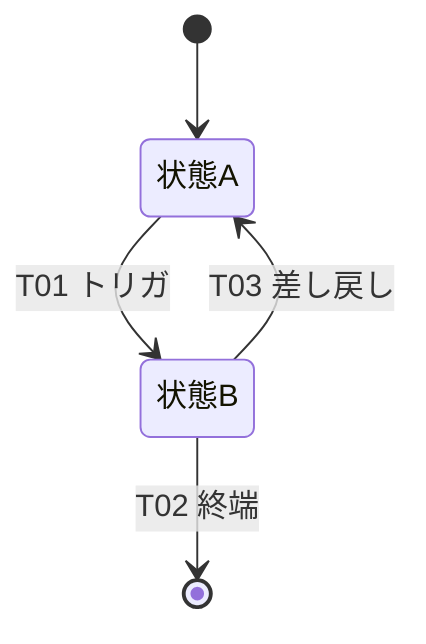

# RED母集合 — 受入基準（G/W/T）・状態機械（ST）・エラー母集合（ERR）

> **目的**: 各FEATの**受入基準（Given-When-Then）**・対象データの**状態機械（ST）**・**エラー/例外の完全列挙（ERR）**をFEAT番号で束ね、**TDDのRED（失敗するテスト）の源泉**とする。受入基準・状態・エラーの3点は本書を単一の正本とし、要件・設計の各文書はここをID参照する。
> **書き方**: 手段（DB・API・アルゴリズム）は書かず、観測可能な振る舞いのみ。合否が機械的に判定できる粒度で。状態・遷移・エラーは一意なIDで、各ERRにハンドラ＋テストを1対1で紐づける。記入例は example-suido-fax/02_設計/60_テスト設計/02_RED母集合_受入基準・状態・エラー.md 参照。
> **受入基準は `- [AC] Given <前提> When <操作> Then <期待>` の1行形式**で書き、対応する **FEAT-見出しにぶら下げる**（＝collect.py の測定対象・TDDのRED源泉）。1つのFEATに複数の `[AC]` を並べてよい。本記法は共通ハーネス(aic-harness)の要件レビュー(criteria.json)に準拠。
> **大規模時の分割（機能展開G2と同型）**: 本書が肥大化・マージ競合・FEAT別レビュー困難になったら、**FEAT別ファイルに分割してよい**（`60_テスト設計/RED/{FEAT-ID}_受入基準・状態・エラー.md`）。本書は索引（FEAT一覧＋各ファイルへのリンク）に降格。**小規模は本1ファイルに集約**。

## 目次
1. [受入基準の書き方（型）](#1-受入基準の書き方型)
2. [FEAT別 受入基準（Given-When-Then）](#2-feat別-受入基準given-when-then)
3. [状態機械（ST）](#3-状態機械st)
4. [エラー/例外 完全列挙（ERR）](#4-エラー例外-完全列挙err)
5. [通知条件](#5-通知条件)
6. [トレーサビリティ（FEAT × DM/IF/ST/ERR/TC）](#6-トレーサビリティfeat--dmifsterrtc)

## 1. 受入基準の書き方（型）
> 📝 ここは記入不要（型の説明）。各FEATを下記の型で記述する。1つのFEATに複数の Given/When/Then（正常系＋分岐）を並べてよい。**この受入基準がTDDのREDになる**ため、合否が機械的に判定できる粒度で書く。

- Story: {誰として} {何がしたいか}。
- 受入基準: **`- [AC] Given` {前提・状態} `When` {操作・イベント} `Then` {期待される観測可能な結果}**（1行1AC。分岐ごとに `[AC]` 行を足す）。
- 例外: {異常な入力・状態} → {期待挙動}（ERR-XXX）。

## 2. FEAT別 受入基準（Given-When-Then）
> 📝 ここにFEATごとの受入基準を記載。含める項目: FEAT-ID／機能名／確定状態（[確定]/[暫定]）／Story／Given-When-Then（正常系と分岐）／例外（ERR-IDと対応）。FEATの数だけ見出しを増やす。各FEATの概要は `01_要件定義/02_機能要件/01_機能一覧/` を参照。

### FEAT-01 {機能名} `[確定/暫定]`
> 📝 ここにFEAT-01の受入基準を記載。含める項目: Story／Given-When-Then／例外（ERR-ID）。必要なら補足・制約も。

- Story: {誰として}{何がしたいか}。
- [AC] Given {前提} When {操作} Then {期待結果}。
- 例外: {条件} → {挙動}（ERR-XXX）。

### FEAT-02 {機能名} `[確定/暫定]`
> 📝 ここにFEAT-02の受入基準を記載。以降、FEATの数だけ同じ型で見出しを追加する。

- Story: {誰として}{何がしたいか}。
- [AC] Given {前提} When {操作} Then {期待結果}。
- 例外: {条件} → {挙動}（ERR-XXX）。

## 3. 状態機械（ST）
> 📝 ここに状態の一覧を記載。含める項目: ST-ID／enum（内部値）／表示名／説明。終端状態が分かるように。

| ST-ID | enum | 表示名 | 説明 |
|---|---|---|---|
| （記入） | （記入） | （記入） | （記入） |

> 📝 ここに状態遷移を記載。含める項目: 遷移ID／From→To／トリガ（きっかけ）／ガード（遷移条件）。

| 遷移ID | From→To | トリガ | ガード |
|---|---|---|---|
| （記入） | （記入） | （記入） | （記入） |

> 📝 ここに状態遷移図を記載。含める項目: 初期状態・各状態・遷移（トリガ）・終端。下の骨組みのコメント部を実際の状態/遷移に置き換える。

## 4. エラー/例外 完全列挙（ERR）
> 📝 ここにエラーを漏れなく記載。**この表が分岐網羅テスト（TC）の母集合**。含める項目: ERR-ID／分類／発生FEAT／再送可否／HTTP／利用者向けメッセージ（例）。警告（WARN-）も含める。各ERRにハンドラとテストを1対1で用意する。

| ERR-ID | 分類 | 発生FEAT | 再送可否 | HTTP | 利用者向けメッセージ（例） |
|---|---|---|---|---|---|
| （記入） | （記入） | （記入） | （記入） | （記入） | （記入） |

## 5. 通知条件
> 📝 ここに通知の条件を記載。含める項目: 即時通知するERR／集約通知するERR／通知チャネル（閾値が未確定なら設計層/ADRへ委譲と明記）。

- 即時通知: （記入）
- 集約通知: （記入）
- 通知チャネル: （記入）

## 6. トレーサビリティ（FEAT × DM/IF/ST/ERR/TC）
> 📝 ここに機能と各成果物の対応表を記載。FEAT-ID ごとに 関連 DM（データ）/EXT（IF）/ST（状態）/ERR（エラー）/TC（テストケース）を横串で対応づける。テスト未整備のFEATや孤立ERR等の抜け漏れを検出できるように。

| FEAT | DM | EXT/IF | ST | ERR | TC |
|---|---|---|---|---|---|
| （記入） | （記入） | （記入） | （記入） | （記入） | （記入） |

> 関連: FEATサマリ・優先度＝`01_要件定義/02_機能要件/00_機能要件インデックス.md` / 機能概要＝`01_要件定義/02_機能要件/01_機能一覧/` / テスト戦略＝`01_テスト戦略.md` / テスト観点＝`03_テスト観点表_テンプレート.md` / 状態イベント表現＝`30_データ・IF設計/03_ドメインイベント.md`。
