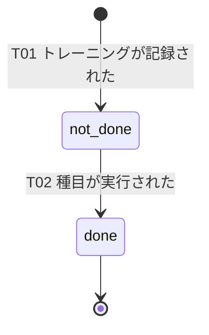

# RED母集合 — 受入基準（G/W/T）・状態機械（ST）・エラー母集合（ERR）

> **目的**: 各FEATの**受入基準（Given-When-Then）**・対象データの**状態機械（ST）**・**エラー/例外の完全列挙（ERR）**をFEAT番号で束ね、**TDDのRED（失敗するテスト）の源泉**とする。受入基準・状態・エラーの3点は本書を単一の正本とし、要件・設計の各文書はここをID参照する。
> **書き方**: 手段（DB・API・アルゴリズム）は書かず、観測可能な振る舞いのみ。合否が機械的に判定できる粒度で。状態・遷移・エラーは一意なIDで、各ERRにハンドラ＋テストを1対1で紐づける。記入例は example-suido-fax/02_設計/60_テスト設計/02_RED母集合_受入基準・状態・エラー.md 参照。
> **受入基準は `- [AC] Given <前提> When <操作> Then <期待>` の1行形式**で書き、対応する **FEAT-見出しにぶら下げる**（＝collect.py の測定対象・TDDのRED源泉）。1つのFEATに複数の `[AC]` を並べてよい。本記法は共通ハーネス(aic-harness)の要件レビュー(criteria.json)に準拠。
> **大規模時の分割（機能展開G2と同型）**: 本書が肥大化・マージ競合・FEAT別レビュー困難になったら、**FEAT別ファイルに分割してよい**（`60_テスト設計/RED/{FEAT-ID}_受入基準・状態・エラー.md`）。本書は索引（FEAT一覧＋各ファイルへのリンク）に降格。**小規模は本1ファイルに集約**。

> ⚠️ **本書はたたき台（2026-08-08 生成）**。岡田さんのレビューで確定する。中身は各 `FEAT-*.md` §9 の「受入基準（G/W/T）の候補」・§6 の ERR 表・`../30_データ・IF設計/03_ドメインイベント.md` の ST を**機械的に集約したもの**であり、本書で新しい AC・ERR-ID を創作していない。

**本書の規模**（レビュー前に規模を掴むための集計）

| 区分 | 件数 | 内訳 |
|---|---|---|
| 受入基準（AC） | **65** | FEAT-01〜10 の有効な `- [AC]` 行。§2 |
| 同上・廃止 | **1** | FEAT-01 の1件（ADR-0021）。取り消し線つきで残す |
| 状態（ST） | **2** | ST-01 未実行 / ST-02 実行済。§3 |
| 状態遷移（TR） | **2** | T01 / T02。§3 |
| エラー（ERR）・使用中 | **67** | §4。うち共通8件（ERR-AUTH-001・ERR-VALIDATION-001・ERR-AI-*6） |
| 同上・欠番 | **6** | ERR-MENU-003/004/005/006・ERR-MEAL-004/008。採番は繰り上げない |
| 同上・未使用の予約枠 | **2レンジ** | ERR-MACHINE-017〜019・ERR-PROFILE-007〜019。欠番ではない |

- **ID は不変・欠番再利用禁止**（`../../01_要件定義/00_用語定義.md §3`）。本書でも採番を繰り上げていない。
- 「使用中 67 件」が分岐網羅テストの分母である（`01_テスト戦略.md` §3）。

> 📖 ID（`FEAT-` `NFR-` `RULE-` 等）の意味は [ID早見表](../00_ID早見表.md) を参照。

## 目次
1. [受入基準の書き方（型）](#1-受入基準の書き方型)
2. [FEAT別 受入基準（Given-When-Then）](#2-feat別-受入基準given-when-then)
3. [状態機械（ST）](#3-状態機械st)
4. [エラー/例外 完全列挙（ERR）](#4-エラー例外-完全列挙err)
5. [通知条件](#5-通知条件)
6. [トレーサビリティ（FEAT × DM/IF/ST/ERR/TC）](#6-トレーサビリティfeat--dmifsterrtc)

## 1. 受入基準の書き方（型）
> 📝 ここは記入不要（型の説明）。各FEATを下記の型で記述する。1つのFEATに複数の Given/When/Then（正常系＋分岐）を並べてよい。**この受入基準がTDDのREDになる**ため、合否が機械的に判定できる粒度で書く。

- Story: {誰として} {何がしたいか}。
- 受入基準: **`- [AC] Given` {前提・状態} `When` {操作・イベント} `Then` {期待される観測可能な結果}**（1行1AC。分岐ごとに `[AC]` 行を足す）。
- 例外: {異常な入力・状態} → {期待挙動}（ERR-XXX）。

## 2. FEAT別 受入基準（Given-When-Then）
> 📝 ここにFEATごとの受入基準を記載。含める項目: FEAT-ID／機能名／確定状態（[確定]/[暫定]）／Story／Given-When-Then（正常系と分岐）／例外（ERR-IDと対応）。FEATの数だけ見出しを増やす。各FEATの概要は `01_要件定義/02_機能要件/01_機能一覧/` を参照。

本節の読み方。

| 事項 | 内容 |
|---|---|
| AC の出所 | 各 `FEAT-*.md` §9 の「受入基準（G/W/T）の候補」。**原文のまま転記**した |
| 言い換え | していない。語句の統一も行っていない |
| 確定状態 | 全 FEAT が `[暫定]`。出所が「候補」であり、承認が済んでいないため |
| Story | ID早見表 §1 の「何をするか」から起こした要約 `[仮]`。要件の正本ではない |
| 廃止した AC | **消さない。** 取り消し線と廃止理由を付けて残す |
| 例外 | ERR-ID のレンジだけを示す。1件ずつの定義は §4 が正本 |

### FEAT-01 器具登録 `[暫定]`

> 📝 ここにFEAT-01の受入基準を記載。含める項目: Story／Given-When-Then／例外（ERR-ID）。必要なら補足・制約も。

- 出典: `../50_詳細設計/08_機能別詳細設計/FEAT-01_器具登録.md` §9（AC は原文のまま転記）。
- Story: 岡田さんとして、ジム・器具・種目を登録したい。
- [AC] Given ジムと部位「胸」の種目が登録済み When 器具名とそのジム・種目を選んで登録する Then 器具が保存され、一覧で部位「胸」として表示される
- [AC] Given 部位「背中」「胸」「腕」の種目が登録済み When 1台の器具に3種目すべてを選んで登録する Then その器具は3部位すべてで絞り込みに現れる
- [AC] Given 器具名とジムを入力済み When 種目を1件も選ばずに登録しようとする Then 登録は実行されず ERR-MACHINE-003 が示される
- [AC] Given 種目が1件も無い状態 When SCR-02 を開く Then 器具登録フォームは無効で、種目作成への導線が表示される
- [AC] Given ある種目がトレーニング明細から参照されている When その種目を削除しようとする Then ERR-MACHINE-013 が返り、履歴が保持される
- [AC] Given 部位「脚」の種目に紐づく器具が登録済み When 部位「脚」で器具を照会する Then その器具が返る（絞り込み契約の正本は FEAT-02）
- [AC] Given ジムが2件登録済み When 一覧でジムを選ぶ Then そのジムの器具だけが一覧に表示される
- ~~[AC] Given AI提案（FEAT-03）が表示されている When 1件を［登録］する Then その種目が種目マスタに追加される~~（**2026-08-08 廃止**・ADR-0021。FEAT-03 は種目を登録しない）
- 例外: 入力検証・DB制約・認証の失敗 → ERR-MACHINE-001〜016・ERR-AUTH-001（詳細は §4 と FEAT-01 §6.2）。
- 件数: 有効 7 件／廃止 1 件

### FEAT-02 部位選択と器具絞り込み `[暫定]`

> 📝 ここにFEAT-02の受入基準を記載。以降、FEATの数だけ同じ型で見出しを追加する。

- 出典: `../50_詳細設計/08_機能別詳細設計/FEAT-02_部位選択と器具絞り込み.md` §9（AC は原文のまま転記）。
- Story: 岡田さんとして、部位を選んで使える器具を絞り込みたい。
- [AC] Given 部位に器具が登録済み When 利用者がその部位を選ぶ Then 該当する器具だけが1秒以内に一覧表示される
- [AC] Given その部位に器具が1件も無い When 利用者がその部位を選ぶ Then エラーではなく空状態と器具登録（SCR-02）への導線が表示される
- [AC] Given その部位に器具が1件も無い When SCR-03 を表示する Then ［メニュー生成］は押せない
- [AC] Given ジムが2件登録済み When ジムを選んで部位で絞り込む Then そのジムの器具だけが表示される
- [AC] Given ジムが1件だけ登録済み When SCR-02 を開く Then ジムの選択UIは表示されない
- [AC] Given 部位に5値以外の値が渡された When 絞り込みを実行する Then ERR-MACHINE-020 となり、Supabase への照会は発行されない
- [AC] Given 未認証 When 絞り込みを実行する Then ERR-AUTH-001 が返る
- [AC] Given 複数ジムの器具が登録済み When 部位で絞り込む Then 各器具にジム名が付いて識別できる
- [AC] Given 1台の器具が同じ部位の種目を2つ持つ When その部位で絞り込む Then その器具は一覧に1件だけ表示され、対応する種目名が2つ並ぶ
- [AC] Given 1台の器具が背中と胸の種目を持つ When 部位「背中」で絞り込み、次に「胸」で絞り込む Then どちらの結果にもその器具が現れる
- 例外: 部位値の不正・DB照会の失敗・認証の失敗 → ERR-MACHINE-020〜023・ERR-AUTH-001（詳細は §4 と FEAT-02 §6）。
- 件数: 有効 10 件

### FEAT-03 AIメニュー提案 `[暫定]`

- 出典: `../50_詳細設計/08_機能別詳細設計/FEAT-03_AIメニュー提案.md` §9（AC は原文のまま転記）。
- Story: 岡田さんとして、登録済みの種目から今日やる分を組んでほしい。
- [AC] Given 部位「胸」に対応する器具が登録済み When 器具を選んで［メニュー生成］を押す Then 15秒以内に今日のメニューが実施順つきで1件以上表示される
- [AC] Given 選択部位に対応する器具が0件 When SCR-03 を表示する Then ［メニュー生成］は押せず、器具登録（SCR-02）への導線が表示される
- [AC] Given 選択した器具が要求部位の種目を1つも持たない When 生成を要求する Then ERR-MENU-002 が返り AI は呼び出されない
- [AC] Given 1台で複数部位に対応する器具を選んでいる When 部位「胸」で生成を要求する Then 胸の種目だけを候補に今日のメニューが組まれる
- [AC] Given Gemini API が不達 When 生成を要求する Then エラーが通知されるが、トレーニング記録と閲覧は継続して行える
- [AC] Given 今日のメニューが表示された When 何も操作をしない Then 種目マスタには何も追加されない
- [AC] Given 今日のメニューが表示された When ［この内容で記録する］を押す Then 選ばれた種目が実施順どおり明細になり、種目マスタは増えない
- [AC] Given AI が候補集合に無い `menu_id` を返した When 生成を要求する Then ERR-MENU-007 が返り、提案は表示されない
- [AC] Given メニュー案が表示された When 画面を離れて戻る Then 提案は残っていない
- 例外: 入力不正・器具や種目の不整合・AI呼び出しの失敗 → ERR-VALIDATION-001・ERR-MENU-001/002/007・ERR-AI-*・ERR-AUTH-001（詳細は §4 と FEAT-03 §6）。
- 件数: 有効 9 件

### FEAT-04 トレーニング記録 `[暫定]`

- 出典: `../50_詳細設計/08_機能別詳細設計/FEAT-04_トレーニング記録.md` §9（AC は原文のまま転記）。
- Story: 岡田さんとして、実施の有無を記録したい。
- [AC] Given 本人の種目が登録済み When 実施日と種目を選んで[記録する]を押す Then セッションと明細が同時に保存され、明細は ST-01 になる
- [AC] Given 明細の一括保存が失敗する状況 When 記録を送信する Then セッションも明細も保存されず、エラーが通知される
- [AC] Given ST-01 の明細 When 実行済にチェックする Then ST-02 へ遷移し、ダッシュボードの実施有無に反映される
- [AC] Given 既に ST-02 の明細 When 同じチェック操作が再送される Then 状態は変わらず、エラーにもならない
- [AC] Given ジムが1件も登録されていない When 入館記録を開く Then ジム登録への導線が示され、入館記録は保存されない
- 例外: 日付・種目の不正、遷移違反、DB失敗、認証の失敗 → ERR-TRAINING-001〜009・ERR-VALIDATION-001・ERR-AUTH-001（詳細は §4 と FEAT-04 §6.2）。
- 件数: 有効 5 件

### FEAT-05 ダッシュボード `[暫定]`

- 出典: `../50_詳細設計/08_機能別詳細設計/FEAT-05_ダッシュボード.md` §9（AC は原文のまま転記）。
- Story: 岡田さんとして、摂取ゲージ・実施回数・ヒートマップを1画面で見たい。
- [AC] Given 当日の食事記録と体重が登録されている When SCR-01 を開く Then タンパク質ゲージが達成率とともに表示される
- [AC] Given 摂取量が目標量を超えている When SCR-01 を開く Then 達成率は100%として表示される
- [AC] Given 体重が未設定である When SCR-01 を開く Then ゲージの位置に体重登録の案内と SCR-05（設定・プロフィール）への導線が示される
- [AC] Given 体重が未設定である When SCR-01 を開く Then ヒートマップとトレーニング回数は通常どおり表示される
- [AC] Given 今月にトレーニング実施日がある When SCR-01 を開く Then 「今月のトレーニング N / 12 回」が表示される
- [AC] Given 期間内にトレーニング実施日がある When ヒートマップの実施日をタップする Then その日の種目名が表示される
- [AC] Given 月表示でダッシュボードを見ている When `SegmentedButton` で週を選ぶ Then ヒートマップの範囲だけが切り替わる
- [AC] Given ダッシュボードを見ている When 期間を切り替える Then ゲージとトレーニング回数の値は変わらない
- 例外: 期間指定の不正・`users` 行の欠落・RPC の失敗 → ERR-DASHBOARD-001〜003・ERR-AUTH-001（詳細は §4 と FEAT-05 §6）。
- 件数: 有効 8 件

### FEAT-06 初期設定 `[暫定]`

- 出典: `../50_詳細設計/08_機能別詳細設計/FEAT-06_初期設定.md` §9（AC は原文のまま転記）。
- Story: 岡田さんとして、体重・目標回数・表示名を設定したい。
- [AC] Given 初回サインアップ直後である When SCR-05（設定・プロフィール）を開く Then 目標ログイン回数に月12回（RULE-007）が表示され、体重は未設定として空欄で表示される
- [AC] Given SCR-05 を開いている When 体重に 20.0〜300.0 kg の範囲内かつ小数第1位までの値を入力して保存する Then 「保存しました」と表示され、再読込しても同じ値が表示される
- [AC] Given SCR-05 を開いている When 体重に範囲外または小数第2位以上を含む値を入力して保存する Then ERR-PROFILE-001 として該当フィールドにエラーが表示され、値は保存されない
- [AC] Given 体重が未設定である When SCR-05 を開く Then 体重の設定を促す注意表示が出る
- [AC] Given 未ログインである When `users` の select を実行する Then ERR-AUTH-001 として扱われる
- 例外: 入力値の範囲外・行の欠落・保存の失敗 → ERR-PROFILE-001〜006・ERR-VALIDATION-001・ERR-AUTH-001（詳細は §4 と FEAT-06 §6）。
- 件数: 有効 5 件

### FEAT-07 必要タンパク質量算出 `[暫定]`

- 出典: `../50_詳細設計/08_機能別詳細設計/FEAT-07_必要タンパク質量算出.md` §9（AC は原文のまま転記）。
- Story: 岡田さんとして、体重から1日の必要タンパク質量を知りたい。
- [AC] Given `users.weight_kg` が登録済み When SCR-01 を開く Then ゲージの目標値が「体重×2g」を小数第1位で丸め、整数 g として表示される
- [AC] Given `users.weight_kg` が NULL When SCR-01 を開く Then ゲージは目標未設定として表示され、SCR-05 への導線が示され、ヒートマップと記録機能は操作できる
- [AC] Given `users.weight_kg` が登録済み When SCR-05 で体重を変更する（保存前） Then 必要量プレビューが再計算され、保存後に RPC が返す値と一致する
- [AC] Given 同一ユーザー・同一時点 When `get_dashboard` と `get_protein_remaining` を呼ぶ Then Dart が両者から算出する目標値が一致する
- 例外: 体重が未設定・不正値 → ERR-PROFILE-020／ERR-PROFILE-021（詳細は §4 と FEAT-07 §6）。本機能は ERR-ID を予約するだけで、画面表示への写像は呼び出し側が行う。
- 件数: 有効 4 件

### FEAT-08 食事撮影タンパク質計算 `[暫定]`

- 出典: `../50_詳細設計/08_機能別詳細設計/FEAT-08_食事撮影タンパク質計算.md` §9（AC は原文のまま転記）。
- Story: 岡田さんとして、食事の写真から栄養4項目を知り、記録したい。
- [AC] Given 有効な食事写真 When ［解析する］を押す Then 栄養4項目が20秒以内に表示され、DBには何も保存されていない
- [AC] Given 有効な食事写真 When 解析が完了する Then 画像はサーバのどこにも永続化されていない（ログ・DBを含む）
- [AC] Given 解析結果が表示されている When ［記録する］を押す Then 表示された栄養4項目がそのまま1行保存され、写真は保存されない
- [AC] Given 解析結果が表示されている When 画面を操作する Then 栄養値を修正する手段が無く、［記録する］と［撮り直す］だけが選べる
- [AC] Given Gemini API が不達 When ［解析する］を押す Then 解析失敗が通知され、その食事は記録できない。過去の記録閲覧は継続できる
- [AC] Given 許可外形式または上限超のファイル When ［解析する］を押す Then EXT-01 を呼ばずにエラーを返す（従量課金を発生させない）
- 例外: 画像の不正・AI 出力の不正・保存の失敗 → ERR-MEAL-001〜009・ERR-AI-*・ERR-AUTH-001（詳細は §4 と FEAT-08 §6）。
- 件数: 有効 6 件

### FEAT-09 タンパク質残量と不足分提示 `[暫定]`

- 出典: `../50_詳細設計/08_機能別詳細設計/FEAT-09_タンパク質残量と不足分提示.md` §9（AC は原文のまま転記）。
- Story: 岡田さんとして、残量と、それを補える食品を知りたい。
- [AC] Given 体重が設定済みで当日の食事記録が必要量に満たない When SCR-01 を開く Then 残量（g）と、それを補える食品候補が最大N件表示される
- [AC] Given 当日の摂取が必要量以上 When 残量を算出する Then `remaining_g` は 0 で `suggestions` は空配列である
- [AC] Given 体重が未設定 When SCR-01 を開く Then 残量は表示されず、体重設定（SCR-05）への導線が表示される
- [AC] Given `foods` が未取込 When 残量が残っている Then 残量は表示され、候補欄には食品マスタ取込（FEAT-10）への導線が表示される
- [AC] Given AI（EXT-01）が利用不能 When SCR-01 を開く Then 残量・候補は通常どおり表示される（NFR-AVAIL-05）
- 例外: 体重が未設定・不正値、RPC の失敗 → ERR-PROFILE-020/021・ERR-PROTEIN-001・ERR-AUTH-001（詳細は §4 と FEAT-09 §6）。
- 件数: 有効 5 件

### FEAT-10 食事マスタCSVインポート `[暫定]`

- 出典: `../50_詳細設計/08_機能別詳細設計/FEAT-10_食事マスタCSVインポート.md` §9（AC は原文のまま転記）。
- Story: 岡田さんとして、食品マスタを CSV から取り込みたい。
- [AC] Given SCR-05（設定・プロフィール）を開いている When 正しい形式のCSV（数百行）を選んで取り込む Then 取込件数・スキップ件数・検出文字コードのサマリが成功SnackBarとともに5秒以内に表示される
- [AC] Given 3行目の `protein_amount` が負値のCSV When 取り込む Then ERR-FOOD-002 とともに「3行目・protein_amount」がエラー一覧に示され、`foods` は取込前の内容のままである
- [AC] Given 一度取り込み済みの食事マスタがある When 同じCSVをもう一度取り込む Then 「取込 0件・スキップ 全件」と表示され `foods` の件数・内容は変わらない
- [AC] Given `鶏むね肉` が登録済みである When `鶏むね肉` を含み `protein_amount` だけ違うCSVを取り込む Then その行はスキップされ、登録済みの `protein_amount` は変わらない
- [AC] Given 新しい食品を1つだけ足したい When ヘッダ1行＋データ1行のCSVを取り込む Then 「取込 1件・スキップ 0件」と表示され、その食品が FEAT-09（タンパク質残量と不足分提示）の候補に現れる
- [AC] Given Excel で Shift_JIS 保存されたCSV When 取り込む Then 日本語の食品名が文字化けせず取り込まれ、`detected_encoding` に `shift_jis` が表示される
- 例外: ファイル選択・デコード・行検証・RPC の失敗 → ERR-FOOD-001〜008・ERR-AUTH-001（詳細は §4 と FEAT-10 §6）。
- 件数: 有効 6 件
## 3. 状態機械（ST）
> 📝 ここに状態の一覧を記載。含める項目: ST-ID／enum（内部値）／表示名／説明。終端状態が分かるように。

**本PJが持つ永続状態は `training_session_details.is_done` だけである。** 他に状態機械は無い。

| ST-ID | enum | 表示名 | 説明 |
|---|---|---|---|
| ST-01 | `not_done` | 未実行 | トレーニング明細の初期状態（`is_done=false`）。T01 で入る |
| ST-02 | `done` | 実行済 | 実施をチェックした状態（`is_done=true`）。**終端**。ST-01 へは戻らない |

> 📝 ここに状態遷移を記載。含める項目: 遷移ID／From→To／トリガ（きっかけ）／ガード（遷移条件）。

| 遷移ID | From→To | トリガ | ガード |
|---|---|---|---|
| T01 | （新規）→ ST-01 | トレーニングが記録された（FEAT-04 の RPC `create_training_session`） | 明細は `is_done` 既定 false で作られる |
| T02 | ST-01 → ST-02 | 種目が実行された（明細の実行済をチェック） | `is_done=false` の行だけ更新する。既に ST-02 なら0件で正常終了 |

- 逆遷移（ST-02 → ST-01）は**定義しない**。要求されたら ERR-TRAINING-006 になる（FEAT-04 §6.2）。
- T02 は状態ガードで冪等になる。2回押しても結果は同じ（`07_実装共通設計パターン.md §3`）。
- 状態の正本は `../30_データ・IF設計/03_ドメインイベント.md`。本書はそれを ID 付きで束ね直したものである。

状態を**持たない**もの。一過性の記録イベントとして扱う。

| 事象 | FEAT | 理由 |
|---|---|---|
| 食事が解析・記録された | FEAT-08 | 記録された時点で完了。以後の状態変化が無い |
| 入館が記録された | FEAT-04 | 同上 |
| 食事マスタが取り込まれた | FEAT-10 | 同上 |
| AIメニューが提案された | FEAT-03 | **保存しない**（ADR-0021）。画面状態のみ |

> ⚠️ 要確認（人間判断）: **遷移IDの表記が2つある。** ID早見表 §4 と本書は `T01`/`T02`、`../30_データ・IF設計/03_ドメインイベント.md` §2 と `../50_詳細設計/07_実装共通設計パターン.md §2` は `T01`/`T02` を使っている。同じ遷移を指す。どちらを正とするか決めてください。

> 📝 ここに状態遷移図を記載。含める項目: 初期状態・各状態・遷移（トリガ）・終端。下の骨組みのコメント部を実際の状態/遷移に置き換える。

## 4. エラー/例外 完全列挙（ERR）
> 📝 ここにエラーを漏れなく記載。**この表が分岐網羅テスト（TC）の母集合**。含める項目: ERR-ID／分類／発生FEAT／再送可否／HTTP／利用者向けメッセージ（例）。警告（WARN-）も含める。各ERRにハンドラとテストを1対1で用意する。

表の読み方。

| 記号 | 意味 |
|---|---|
| HTTP `—` | HTTP を持たない。Flutter 内で検出するか、PostgREST 直接経路で応答形が固定されない |
| 再送可否 | 応答の `retryable`。**利用者が手動で再試行する価値があるか**であり、自動再送の有無ではない |
| 分類 | 認証／入力検証／業務／システム／一時失敗（`../50_詳細設計/07_実装共通設計パターン.md §1`） |
| 欠番 | 採番だけ残して**使わない**。再利用禁止。他の ERR-ID を繰り上げない |
| 予約枠 | ドメインを分け合うための未使用レンジ。**欠番ではない**。将来採番されうる |

| ERR-ID | 分類 | 発生FEAT | 再送可否 | HTTP | 利用者向けメッセージ（例） |
|---|---|---|---|---|---|
| ERR-AUTH-001 | 認証 | 全FEAT | false | 401 | 再ログインを促す |
| ERR-VALIDATION-001 | 入力検証 | FEAT-03・04・06 | false | 400 | 入力内容の確認を促す |
| ERR-AI-CREDIT | システム | FEAT-03・08 | false | 402 | 一時的に利用できない旨 |
| ERR-AI-RATE | 一時失敗 | FEAT-03・08 | **true**（指数バックオフ） | 429 | 時間をおいて再試行する旨 |
| ERR-AI-QUOTA | システム | FEAT-03・08 | false | 429 | 当日は回復しない旨 |
| ERR-AI-TIMEOUT | 一時失敗 | FEAT-03・08 | false | 504 | 時間内に処理できなかった旨 |
| ERR-AI-FAIL | システム | FEAT-03・08 | false | 500 | AI機能のみ一時停止している旨 |
| ERR-AI-SCHEMA | システム | FEAT-03・08 | false | 502 | うまく読み取れなかった旨 |
| ERR-MACHINE-001 | 業務 | FEAT-01 | false | — | 器具名の入力し直しを促す |
| ERR-MACHINE-002 | 業務 | FEAT-01 | false | — | ジムの選択し直しを促す |
| ERR-MACHINE-003 | 業務 | FEAT-01 | false | —（`P0001`） | 種目を1件以上選ぶよう促す |
| ERR-MACHINE-004 | 業務 | FEAT-01 | false | 409（`23503`） | 選択したジムが見つからない旨と再読込 |
| ERR-MACHINE-005 | 業務 | FEAT-01 | false | 409（`23503`）／401・403（`42501`） | 選択した種目が見つからない旨と再読込 |
| ERR-MACHINE-006 | 業務 | FEAT-01 | false | — | 対象が見つからない旨 |
| ERR-MACHINE-007 | 業務 | FEAT-01 | false | — `[仮]` | 既に登録済みである旨と既存行への誘導 |
| ERR-MACHINE-008 | 業務 | FEAT-01 | false | — | 種目名の入力し直しを促す |
| ERR-MACHINE-009 | 業務 | FEAT-01 | false | `[仮]`（`23514`） | 部位の選択し直しを促す |
| ERR-MACHINE-010 | 業務 | FEAT-01 | false | — | やり方メモの短縮を促す |
| ERR-MACHINE-011 | 業務 | FEAT-01 | false | — | 対象が見つからない旨 |
| ERR-MACHINE-012 | 業務 | FEAT-01 | false | — `[仮]` | 既に登録済みである旨 |
| ERR-MACHINE-013 | 業務 | FEAT-01 | false | 409（`23503`） | 履歴があるため削除できない旨と参照件数 |
| ERR-MACHINE-014 | 業務 | FEAT-01 | false | — | ジム名の入力し直しを促す |
| ERR-MACHINE-015 | 業務 | FEAT-01 | false | — `[仮]` | 既に登録済みである旨 |
| ERR-MACHINE-016 | 業務 | FEAT-01 | false | 409（`23505`） | 同じ種目は1回だけ選べる旨 |
| ERR-MACHINE-017〜019 | — | — | — | — | **未使用（予約枠）。** FEAT-01 は 001〜019 を持つ |
| ERR-MACHINE-020 | 業務 | FEAT-02 | false | — | 部位の指定が不正である旨と選び直し |
| ERR-MACHINE-021 | 業務 | FEAT-02 | false | — | 部位は1つだけ選べる旨（**構造的に発生しない・予約**） |
| ERR-MACHINE-022 | 業務 | FEAT-02 | false | — | ジムの指定が不正である旨 |
| ERR-MACHINE-023 | システム | FEAT-02 | **true** | — | 器具の取得に失敗した旨と再試行 |
| ERR-MENU-001 | 業務 | FEAT-03 | false | 400 | 器具の選び直しを促す |
| ERR-MENU-002 | 業務 | FEAT-03 | false | 400 | 部位と器具の組合せを直す旨 |
| ERR-MENU-003 | — | — | — | — | **欠番。** アプリ側レート制限を実装しない（ADR-0016） |
| ERR-MENU-004 | — | — | — | — | **欠番。** 構造化出力の失敗は ERR-AI-SCHEMA で受ける（ADR-0011） |
| ERR-MENU-005 | — | — | — | — | **欠番。** 旧「AI出力の器具整合」で検証対象が違う（ADR-0021） |
| ERR-MENU-006 | — | — | — | — | **欠番。** 多重実行の検知を実装しない |
| ERR-MENU-007 | システム | FEAT-03 | false | 502 | 生成に失敗した旨 |
| ERR-TRAINING-001 | 業務 | FEAT-04 | false | — | 実施日を選び直す必要がある旨 |
| ERR-TRAINING-002 | 業務 | FEAT-04 | false | —／409（`23505`） | 種目を1つ以上・重複なく選ぶよう促す |
| ERR-TRAINING-003 | 業務 | FEAT-04 | false | —（`P0001`） | 種目が見つからない旨と再読込 |
| ERR-TRAINING-004 | 業務 | FEAT-04 | false | —／401・403（`42501`） | 記録が見つからない旨 |
| ERR-TRAINING-005 | 業務 `[仮]` | FEAT-04 | false | — | 同じ日の記録が既にある旨と追記への導線 |
| ERR-TRAINING-006 | 業務 | FEAT-04 | false | — | チェックの取り消しは未対応である旨 |
| ERR-TRAINING-007 | 業務 | FEAT-04 | false | 409（`23503`） | 先にジムを登録する必要がある旨 |
| ERR-TRAINING-008 | 業務 | FEAT-04 | false | — | 入館日時を選び直すよう促す |
| ERR-TRAINING-009 | システム | FEAT-04 | **true**（利用者操作） | — | 保存できなかった旨と再試行できる旨 |
| ERR-DASHBOARD-001 | 業務 | FEAT-05 | false | 400（`PT400`） | 期間指定が不正である旨 |
| ERR-DASHBOARD-002 | 業務 | FEAT-05 | false | 409（`PT409`） | 初期設定（SCR-05）へ誘導する |
| ERR-DASHBOARD-003 | システム | FEAT-05 | **true** | 500 | 一時的な取得失敗として再試行を促す |
| ERR-PROFILE-001 | 業務 | FEAT-06 | false | — | 入力できる体重の範囲と桁数を示す |
| ERR-PROFILE-002 | 業務 | FEAT-06 | false | — | 入力できる回数の範囲を示す |
| ERR-PROFILE-003 | 業務 | FEAT-06 | false | — | 表示名は必須であり文字数上限がある旨 |
| ERR-PROFILE-004 | システム | FEAT-06 | **true** | — | 初期化できなかったため再ログインを促す |
| ERR-PROFILE-005 | 業務 | FEAT-06 | false | — | 変更内容が無い旨 |
| ERR-PROFILE-006 | システム | FEAT-06 | **true** | — | 保存できなかったため再試行を促す |
| ERR-PROFILE-007〜019 | — | — | — | — | **未使用（予約枠）。** FEAT-06 は 001〜019 を持つ |
| ERR-PROFILE-020 | 業務 | FEAT-07 が定義（写像は FEAT-05・06・09） | false | —（RPC は 200） | 体重が未登録である旨と SCR-05 への誘導 |
| ERR-PROFILE-021 | システム | FEAT-07 が定義（写像は FEAT-05・06・09） | false | —（RPC は 200） | 目標値を計算できなかった旨 |
| ERR-MEAL-001 | 業務 | FEAT-08 | false | 400 | 写真を選び直すよう促す |
| ERR-MEAL-002 | 業務 | FEAT-08 | false | 415 | 対応形式（JPEG/PNG/WebP）を示す |
| ERR-MEAL-003 | 業務 | FEAT-08 | false | 413 | 撮り直し／縮小を促す |
| ERR-MEAL-004 | — | — | — | — | **欠番。** AI応答の型不適合は ERR-AI-SCHEMA で受ける（ADR-0011） |
| ERR-MEAL-005 | 業務 | FEAT-08 | false | 422 | うまく読み取れなかった旨と撮り直し |
| ERR-MEAL-006 | 業務 | FEAT-08 | false | 400 | 撮り直しを促す（利用者は値を直せない） |
| ERR-MEAL-007 | 業務 | FEAT-08 | false | 400 | 端末の日時設定の確認を促す |
| ERR-MEAL-008 | — | — | — | — | **欠番。** アプリ側レート制限を実装しない（ADR-0016） |
| ERR-MEAL-009 | システム | FEAT-08 | **true** | 500 | 記録に失敗した旨と再試行導線 |
| ERR-PROTEIN-001 | システム | FEAT-09 | **true** | — | 一時的な問題であり時間をおけばよい旨 |
| ERR-FOOD-001 | 業務 | FEAT-10 | false | — | ファイルが選択されていない旨 |
| ERR-FOOD-002 | 業務 | FEAT-10 | false | — | 何行目のどの列がなぜ不正かを一覧で示す旨 |
| ERR-FOOD-003 | 業務 | FEAT-10 | false | — | 上限サイズを示し分割を促す旨 |
| ERR-FOOD-004 | 業務 | FEAT-10 | false | — | 上限行数を示す旨 |
| ERR-FOOD-005 | 業務 | FEAT-10 | false | — | 対応文字コードで保存し直す旨 |
| ERR-FOOD-006 | 業務 | FEAT-10 | false | — | 必要な列名を示す旨 |
| ERR-FOOD-007 | システム | FEAT-10 | **true**（手動再実行） | — | 取込に失敗し1件も取り込まれていない旨 |
| ERR-FOOD-008 | 業務 | FEAT-10 | false | — | CSVファイルの選択を促す旨 |

集計。**分岐網羅テストの分母は「使用中 67 件」**である。

| 接頭辞 | 使用中 | 欠番 | 予約枠（未使用） |
|---|---|---|---|
| ERR-AUTH | 1 | 0 | — |
| ERR-VALIDATION | 1 | 0 | — |
| ERR-AI-* | 6 | 0 | — |
| ERR-MACHINE | 20 | 0 | 017〜019 |
| ERR-MENU | 3 | 4（003〜006） | — |
| ERR-TRAINING | 9 | 0 | — |
| ERR-DASHBOARD | 3 | 0 | — |
| ERR-PROFILE | 8 | 0 | 007〜019 |
| ERR-MEAL | 7 | 2（004・008） | — |
| ERR-PROTEIN | 1 | 0 | — |
| ERR-FOOD | 8 | 0 | — |
| **合計** | **67** | **6** | **2レンジ** |

**WARN- 接頭辞の ID は本PJに存在しない。** 警告は ERR-ID ではなく件数として結果に載せる。

**`ERR-AI-001` は本表に無い。** `../50_詳細設計/06_DB設計規約.md §8` に `ERR-AI-001`〜`004` の表記がある。これは「`ERR-AI-*` を連番に改める案」の記述であり、採用されていない。現行の ID は `ERR-AI-RATE` ほか6件である。

ERR-ID を割り当てない事象。エラーとして扱わないものを明示する。

| 事象 | 扱い | 出典 |
|---|---|---|
| 該当部位の器具が0件 | エラーではない（`total: 0`）。空状態で表示する | FEAT-02 §6 |
| 同じ器具が重複して返る | 実装バグ。TC-FEAT02-14 で検出する | FEAT-02 §6 |
| 体重が未設定（RPC 応答） | 200 で `protein_gauge: null` を返す | FEAT-05 §6 |
| CSV の既存同名行 | `skipped_existing_count` に計上する | FEAT-10 §6 |
| CSV の空行 | `skipped_empty_count` に計上する | FEAT-10 §4-4 |
| CSV の `=` 始まりの `name` | `warning_count` に計上し取込は成功させる | FEAT-10 §4-4 |
| Atwater 整合の乖離 | 警告フラグのみ。保存はブロックしない | FEAT-08 §4 |
| Edge Function への通信断 | 専用 ERR を設けない。解析失敗として通知する | FEAT-08 §6 |
| `uq_tsd_session_menu` 違反 | `ON CONFLICT DO NOTHING` で成功扱い | `../50_詳細設計/07_実装共通設計パターン.md §3` |

> ⚠️ 要確認（人間判断）: **`ERR-AI-*` だけ命名規約から外れている**（`../50_詳細設計/06_DB設計規約.md §8`）。他は `ERR-<領域>-<3桁連番>` である。改名すると FEAT-03・08・段3・段5に波及する。現状維持でよいか確定してください。

## 5. 通知条件
> 📝 ここに通知の条件を記載。含める項目: 即時通知するERR／集約通知するERR／通知チャネル（閾値が未確定なら設計層/ADRへ委譲と明記）。

- 即時通知: ERR-AI-CREDIT ／ ERR-AI-QUOTA（**運用者への気付きが要る**。利用者操作では直らない・FEAT-03 §6・FEAT-08 §6）
- 集約通知: **持たない** `[仮]`（集約の実行基盤が無い。`../50_詳細設計/02_バッチ設計.md` に非同期基盤を置かない方針）
- 通知チャネル: 利用者向けは `SnackBar` のみ（ダイアログを使わない・`../50_詳細設計/07_実装共通設計パターン.md §1`）。**運用者向けのチャネルは未定** ⚠️

| 事項 | 内容 |
|---|---|
| 利用者への出し方 | `ScaffoldMessenger.showSnackBar`。`retryable: true` のときだけ再試行アクションを付ける |
| ログの出先 | Edge Function ログ（`service=okada-fit-fn`）／Postgres ログ／端末ログ（`../50_詳細設計/05_ログ設計.md`） |
| 監査 | 外部送信（NFR-SEC-AUDIT-01）・認証成否（NFR-SEC-AUDIT-02）を記録する |
| 閾値 | 設けない。アラート閾値の設計は運用フェーズへ委譲する `[仮]` |

> ⚠️ 要確認（人間判断）: ERR-AI-CREDIT・ERR-AI-QUOTA の「運用者への通知」を**どこへ出すか**が未定。現状は Supabase のログに残るだけで、岡田さんが自分で見に行かない限り気付けない。

## 6. トレーサビリティ（FEAT × DM/IF/ST/ERR/TC）
> 📝 ここに機能と各成果物の対応表を記載。FEAT-ID ごとに 関連 DM（データ）/EXT（IF）/ST（状態）/ERR（エラー）/TC（テストケース）を横串で対応づける。テスト未整備のFEATや孤立ERR等の抜け漏れを検出できるように。

| FEAT | DM | EXT/IF | ST | ERR | TC |
|---|---|---|---|---|---|
| FEAT-01 | DM-02・DM-04・DM-05・DM-10 | PostgREST ＋ RPC 3本 `[仮]` | — | ERR-AUTH-001・ERR-MACHINE-001〜016 | TC-FEAT01-01〜24（-24 は欠番） |
| FEAT-02 | DM-02・DM-04・DM-05・DM-10 | PostgREST（埋め込み select） | — | ERR-AUTH-001・ERR-MACHINE-020〜023 | TC-FEAT02-01〜19 |
| FEAT-03 | DM-04・DM-05・DM-10 | **EXT-01**（Edge Function `generate-menu`） | — | ERR-AUTH-001・ERR-VALIDATION-001・ERR-MENU-001/002/007・ERR-AI-*（6件） | TC-FEAT03-01〜27（-06・-11 は欠番） |
| FEAT-04 | DM-03・DM-04・DM-06・DM-07 | RPC `create_training_session` ＋ PostgREST | **ST-01・ST-02／T01・T02** | ERR-AUTH-001・ERR-VALIDATION-001・ERR-TRAINING-001〜009 | TC-FEAT04-01〜14 |
| FEAT-05 | DM-01・DM-04・DM-06・DM-07・DM-08 | RPC `get_dashboard` | ST-02 を参照（実施有無） | ERR-AUTH-001・ERR-DASHBOARD-001〜003 | TC-FEAT05-01〜20 |
| FEAT-06 | DM-01 | PostgREST | — | ERR-AUTH-001・ERR-VALIDATION-001・ERR-PROFILE-001〜006 | TC-FEAT06-01〜15 |
| FEAT-07 | DM-01 | 無し（Dart 純関数） | — | ERR-PROFILE-020・ERR-PROFILE-021（**定義のみ**） | TC-FEAT07-01〜14 |
| FEAT-08 | DM-08 | **EXT-01**（Edge Function `analyze-meal`）＋ PostgREST | — | ERR-AUTH-001・ERR-MEAL-001〜009・ERR-AI-*（6件） | TC-FEAT08-01〜19 |
| FEAT-09 | DM-01・DM-08・DM-09 | RPC `get_protein_remaining` | — | ERR-AUTH-001・ERR-PROFILE-020/021・ERR-PROTEIN-001 | TC-FEAT09-01〜19 |
| FEAT-10 | DM-09 | RPC `import_foods` | — | ERR-AUTH-001・ERR-FOOD-001〜008 | TC-FEAT10-01〜21 |

抜け漏れの検出結果。

| 観点 | 結果 |
|---|---|
| TC が無い FEAT | 無し。FEAT-01〜10 の全てに §9 のテスト観点がある |
| 孤立 ERR（どの FEAT にも属さない） | 無し。予約枠と欠番を除き、全て発生 FEAT を持つ |
| AC が名指ししている ERR | **8件のみ**（ERR-AUTH-001・ERR-MACHINE-003/013/020・ERR-MENU-002/007・ERR-PROFILE-001・ERR-FOOD-002） |
| 残る 59 件 | AC ではなく各 FEAT §9 の TC でのみ担保される |
| ST を持つ FEAT | FEAT-04 のみ。FEAT-05 は参照するだけ |

> 関連: FEATサマリ・優先度＝`01_要件定義/02_機能要件/00_機能要件インデックス.md` / 機能概要＝`01_要件定義/02_機能要件/01_機能一覧/` / テスト戦略＝`01_テスト戦略.md` / テスト観点＝`03_テスト観点表_テンプレート.md` / 状態イベント表現＝`30_データ・IF設計/03_ドメインイベント.md`。

**敵対的検証・要確認事項**（本書を自分で敵対的にレビューした結果。重大度 🔴 高 / 🟡 中 / 🟢 低）

| # | 論点 | 内容 | 重大度 |
|---|---|---|---|
| 1 | AC が「候補」のままである | 各 FEAT §9 の見出しは「受入基準（G/W/T）の**候補**」。本書はそれを転記しただけで、確定の承認を経ていない | 🔴 高 |
| 〃 | 〃 | 本書が正本になると宣言している以上、候補→確定の承認が要る。全 FEAT を `[暫定]` としたのはそのため | 〃 |
| 2 | ~~段3の ERR 定義が本書と食い違う~~（**解決**） | ~~段3が `ERR-MEAL-004`(422) と `ERR-MENU-004` を現役として書いている~~ → **段3は追随済み**（2026-08-08）。同 §5 に「両方を**欠番**にした。採番は繰り上げない」と明記されている | — |
| 〃 | 〃 | 構造化出力の検証失敗は共通の `ERR-AI-SCHEMA`(502) 1つに寄せた。本書の記述と一致する | — |
| 3 | ERR の 88% が AC で守られていない | AC が名指しする ERR は 8件。残る 59 件は各 FEAT §9 の TC にしか根拠が無い | 🔴 高 |
| 〃 | 〃 | TC は本書の管理外である。TC が消えると ERR のテストが黙って消える | 〃 |
| 4 | AC に非機能の観測が混ざっている | 「1秒以内」「15秒以内」「20秒以内」「5秒以内」が Then に入っている（FEAT-02・03・08・10） | 🟡 中 |
| 〃 | 〃 | 端末と回線で結果が動く。RED が環境で赤くなると、機能の失敗と区別できない | 〃 |
| 5 | 遷移IDの表記が2つある | 本書と ID早見表は `T01`/`T02`、段3のドメインイベントと段5の共通パターンは `T01`/`T02` | 🟡 中 |
| 〃 | 〃 | 同じ遷移を指す。ID 参照が2系統になると検索で拾えない | 〃 |
| 6 | ERR-AI-TIMEOUT の `retryable` が層で食い違う | 段3 `02_API設計.md §5` は false、段5 `07_実装共通設計パターン.md §4` は true と読める | 🟡 中 |
| 〃 | 〃 | 本書は段3と FEAT-03/08 §6 に合わせ **false** を採った。段5側の追随が要る | 〃 |
| 7 | テストできない ERR が母集合に入っている | ERR-MACHINE-021 は「`SegmentedButton` の単一選択により構造的に起きない」（FEAT-02 §6） | 🟡 中 |
| 〃 | 〃 | 分岐網羅 100%（`01_テスト戦略.md` §3）と両立しない。予約 ID を分母から外す扱いを決める必要がある | 〃 |
| 8 | 予約枠が分母を動かす | ERR-MACHINE-017〜019・ERR-PROFILE-007〜019 は欠番ではなく未使用である。将来採番されると 67 件が増える | 🟡 中 |
| 〃 | 〃 | 「67 件を全て緑」という完了条件は、採番のたびに書き換わる | 〃 |
| 9 | Story が要件の正本ではない | Story は ID早見表 §1 の「何をするか」から起こした要約 `[仮]`。要件の正本は `../../01_要件定義/02_機能要件/` にある | 🟡 中 |
| 〃 | 〃 | 要件側の Story と食い違っていても本書では検出できない | 〃 |
| 10 | ERR-TRAINING-005 が未決に依存する | FEAT-04 §10-2（同一日に複数セッションを許すか）の結論次第で**削除される**暫定定義である | 🟢 低 |
| 11 | 廃止 AC の扱いを機械が判別できない | 取り消し線で残したが、`- [AC]` の文字列は残る。行数を数える仕組みは 66 件と数える | 🟢 低 |
| 〃 | 〃 | 本書の集計（有効 65・廃止 1）を人が読む前提になっている | 〃 |
| 12 | HTTP `—` の行が多い | PostgREST 直接・RPC 経路は HTTP が固定されない。契約テストの期待値を HTTP で書けない | 🟢 低 |
| 13 | ST が1つしか無いことの将来リスク | 状態を1つに絞った判断は正しいが、食事記録の「下書き」やメニューの「保存」を後から入れると状態機械が生える | 🟢 低 |

> ⚠️ 要確認（人間判断）: #1・#2・#3 が判断待ち。
>
> - #1 各 FEAT §9 の AC を確定として承認してよいか。承認後は本書が正本になる。
> - #2 段3 `02_API設計.md §5` の `ERR-MEAL-004`・`ERR-MENU-004` を欠番に直してください。
> - #3 AC が守っていない 59 件の ERR を、AC 側に足すか TC のままにするかを決めてください。
> - #5 遷移IDを `TR-` と `T` のどちらに統一するか決めてください。
> - #7 構造的に発生しない ERR-MACHINE-021 を分岐網羅の分母に含めるか決めてください。
