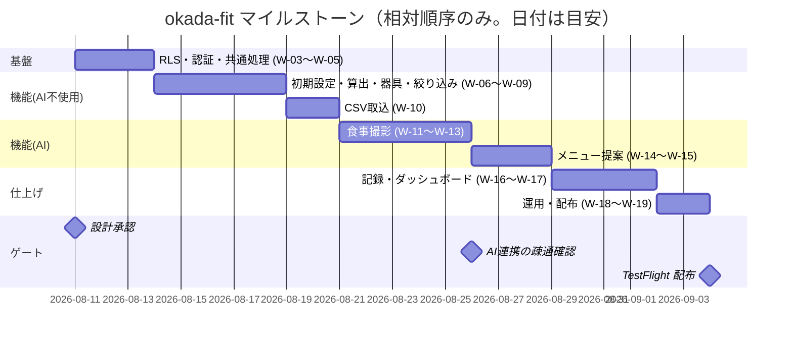

# 見積・WBS（確定見積もり・納期）

> **目的**: 設計完了時点の**確定見積もり・WBS・納期**を顧客と合意する（＝設計ゲートの顧客合意対象）。概算からの差分と根拠を示し、以降のスコープ変更は変更管理（ADR＋再見積もり）に乗せる。
> **書き方**: WBSの行は `../01_要件定義/05_タスク一覧/01_大タスク.md` の TASK- にトレースさせる。実行タスクの粒度は**半日〜1日 かつ 1PR差分300行以内**（統一開発フロー）。タスクの実体はAsanaが正で、本書は顧客合意のスナップショット。

> 📖 ID（`FEAT-` `NFR-` `RULE-` 等）の意味は [ID早見表](00_ID早見表.md) を参照。

> ⚠️ **本書はたたき台（2026-08-08 生成）**。岡田さんのレビューで確定する。
> **本PJは個人開発であり、顧客も契約も無い。** 金額・支払条件・検収は該当なしとして扱う。
> 本書が実際に担うのは **WBS（実装の作業分解）とマイルストーン**の2つである。

## 目次
1. [確定見積サマリ](#1-確定見積サマリ)
2. [WBS](#2-wbs)
3. [マイルストーン・納期](#3-マイルストーン納期)
4. [概算見積もりとの差分](#4-概算見積もりとの差分)
5. [前提条件・変更管理](#5-前提条件変更管理)

## 1. 確定見積サマリ
> 📝 ここに確定見積もりを記載。含める項目: 総工数／金額／納期／支払条件（マイルストーン払い等）。概算（`../01_要件定義/06_概算見積もり.md`）のどの案（梅/竹/松）をベースに確定したかを明記。

| 項目 | 内容 |
|---|---|
| 総工数 | **17〜24人日** `[仮]`（§2 の合計。実装者1名） |
| 金額 | **該当なし。** 個人開発で受託ではない |
| 納期 | **該当なし。** 期日の commitment を負わない |
| 支払条件 | **該当なし** |
| ベースにした概算案 | **該当なし。** 梅/竹/松の3案立ては行っていない |

**費用として実際に発生するのは2つだけ。**

| 費目 | 内容 |
|---|---|
| Gemini API | 従量課金。日次2〜3枚で月$1未満の見込み `[仮]`（ADR-0001 の実測ベンチ） |
| Apple Developer Program | TestFlight 配布に必要。年額 `[仮]` |

- Supabase は**無料枠のまま**（ADR-0017／0019／0020 でいずれも有料化しない決定）。
- 工数は**人件費として計上しない**。本人の作業時間である。

## 2. WBS
> 📝 ここにWBSを記載。含める項目: 大タスク（TASK-）／子タスク／担当（役割名で書く。実名は書かない）／工数／依存関係／完了条件。同一ファイルを触るタスクは同時に走らせない前提で依存を付ける（worktree並列の制約）。

**工数は `[仮]`。** 実績データが2件（W-01・W-02）しか無いため、以降は設計書の実装単位（各 FEAT の §8）から積み上げた見込みである。

| # | 大タスク | 子タスク | 担当 | 工数 | 依存 | 完了条件 |
|---|---|---|---|---|---|---|
| W-01 | 基盤 | Flutter プロジェクト初期化・Supabase 接続 | 実装者 | **完了** | — | 接続が通る |
| W-02 | 基盤 | DBスキーマのマイグレーション化・両環境へ適用 | 実装者 | **完了** | W-01 | up→down→up が通る |
| W-03 | 基盤 | RLS ポリシーの適用と検証 | 実装者 | 1〜2日 `[仮]` | W-02 | **他人の行が読めず書けないことをテストで示す** |
| W-04 | 基盤 | 認証（Supabase Auth）・`handle_new_user` トリガ | 実装者 | 1日 `[仮]` | W-02 | サインアップで `users` に1行できる |
| W-05 | 基盤 | 共通エラー処理・`error_mapper.dart` | 実装者 | 0.5日 `[仮]` | W-01 | `07_実装共通設計パターン.md §1` の写像が動く |
| W-06 | 機能 | FEAT-06 初期設定（体重・目標回数） | 実装者 | 1日 `[仮]` | W-04 | AC を満たす |
| W-07 | 機能 | FEAT-07 必要タンパク質量算出（Dart 純関数） | 実装者 | 0.5日 `[仮]` | — | **単体テストが緑**（NFR-QUAL-01） |
| W-08 | 機能 | FEAT-01 器具登録（RPC 3本＋画面） | 実装者 | 2〜3日 `[仮]` | W-03 | AC を満たす |
| W-09 | 機能 | FEAT-02 部位選択と器具絞り込み | 実装者 | 1日 `[仮]` | W-08 | **5値すべてで絞り込める**（`06_DB設計規約.md §8`） |
| W-10 | 機能 | FEAT-10 食事マスタCSVインポート | 実装者 | 1.5〜2日 `[仮]` | W-03 | Shift_JIS・UTF-8 の両方が通る |
| W-11 | 外部 | Edge Function `analyze-meal`（EXT-01） | 実装者 | 1.5〜2日 `[仮]` | W-05 | Gemini から構造化出力が返る |
| W-12 | 機能 | FEAT-08 食事撮影タンパク質計算（画面＋保存） | 実装者 | 1.5〜2日 `[仮]` | W-11 | **実機のカメラで通る** |
| W-13 | 機能 | FEAT-09 タンパク質残量と不足分提示 | 実装者 | 1日 `[仮]` | W-12・W-10 | AC を満たす |
| W-14 | 外部 | Edge Function `generate-menu`（EXT-01） | 実装者 | 1.5〜2日 `[仮]` | W-05・W-08 | **集合外の `menu_id` を弾く**（ADR-0021） |
| W-15 | 機能 | FEAT-03 AIメニュー提案（画面） | 実装者 | 1日 `[仮]` | W-14 | 実施順つきで表示される |
| W-16 | 機能 | FEAT-04 トレーニング記録 | 実装者 | 1.5日 `[仮]` | W-08 | T01・T02 が動く |
| W-17 | 機能 | FEAT-05 ダッシュボード（RPC＋チャート） | 実装者 | 2日 `[仮]` | W-16・W-13 | 初期表示 ≤2秒（NFR-PERF-01） |
| W-18 | 運用 | 日次エクスポートの launchd 設定（ADR-0017） | 実装者 | 0.5日 `[仮]` | W-02 | **復元まで1度通す** |
| W-19 | 配布 | TestFlight 配布 | 実装者 | 1日 `[仮]` | W-17 | 実機にインストールできる |

**合計 17〜24人日** `[仮]`（W-01・W-02 を除く）。

### 依存の要点

| 観点 | 内容 |
|---|---|
| 最初に来るもの | **W-03（RLS）**。RLS は唯一の防御線であり、後回しにすると全機能を作り直す |
| AI より先に作るもの | 器具登録（W-08）。FEAT-03 は登録済みの種目が無いと動かない（ADR-0021） |
| 実機が要るもの | W-12（カメラ）・W-10（ファイル選択）・W-19 |
| 並行できないもの | 同じファイルを触る W-08 と W-09、W-12 と W-13 |

- タスクの粒度は**半日〜1日**に収まっている。W-08 だけ2〜3日で、分割の余地がある。
- 実装単位の正本は各 `50_詳細設計/08_機能別詳細設計/FEAT-*.md` の §8。

> ⚠️ 要確認（人間判断）: **`../01_要件定義/05_タスク一覧/01_大タスク.md` の TASK- とのトレースが取れていない。**
> 同ファイルは本ブランチではテンプレのままで、TASK- が採番されていない。
> 本書は W-01〜W-19 の独自採番で暫定運用している。**要件層のマージ後にトレースを張り直すこと。**

## 3. マイルストーン・納期
> 📝 ここにマイルストーンを記載。ガントの骨組みに大タスク・マイルストーン（設計承認・実装完了・受け入れテスト・検収）を記入する。

**期日は置かない。** 個人開発のため納期の commitment が無く、日付を書くと守れない約束になる。
代わりに**順序とゲート**を定める。

| マイルストーン | 期日 | 完了条件（ゲート） |
|---|---|---|
| 設計承認 | `[仮]` | **本PR（設計PR4）のレビュー完了。** 🔴 高の指摘が残っていないこと |
| AI連携の疎通確認 | W-11 完了時 | Gemini から構造化出力が返り、`ERR-AI-*` の写像が動くこと |
| 実装完了 | W-17 完了時 | **RED母集合（`60_テスト設計/02_RED母集合…`）の AC 65件が全て緑** |
| TestFlight 配布 | W-19 完了時 | 実機にインストールでき、主要導線が通ること |

- 検収・受け入れテストの工程は**持たない**。利用者＝実装者のため。
- 「実装完了」の判定は RED母集合を使う（`CLAUDE.md`「受入基準がTDDのRED」）。

> ⚠️ 要確認（人間判断）: **AI連携の疎通確認は課金する。** 1回あたり約$0.01（ADR-0001 の実測）。
> W-11 の時点で少額の課金が始まる。事前に Google Cloud 側の請求設定を済ませること。

## 4. 概算見積もりとの差分
> 📝 ここに概算（レンジ）から確定に至った差分と根拠を記載。設計で判明した増減要因（ADR参照）を挙げ、顧客への説明責任を果たす。

**概算（`../01_要件定義/06_概算見積もり.md`）は本ブランチでは未参照。** 別ブランチにあり、本PRのスコープ外である。
代わりに、**設計で判明した増減要因**を記録する。

| 差分項目 | 設計前の想定 | 設計後 | 根拠 |
|---|---|---|---|
| フロント | Web（Next.js + Mantine） | **Flutter アプリ** | ADR-0010。Web ホスティングが不要になり、TestFlight 配布の工程が増えた |
| AI 経路 | Vercel AI Gateway 経由 | **Gemini API 直接** | ADR-0011。ゲートウェイの設定が不要になった分、エラー写像を自前で書く |
| サーバ | Next.js Route Handlers（全機能） | **Edge Function 2本のみ** | AI を呼ぶものだけ。CRUD は PostgREST 直接で、実装量が減った |
| 器具↔種目 | 1対1 | **多対多**（中間テーブル） | 1台が複数部位に効くため。RPC が3本増えた |
| FEAT-03 | 種目の発見＋やり方の生成 | **今日のメニューを組む** | ADR-0021。幻覚フィルタが不要になり、検証が単純になった |
| バックアップ | 想定なし | **日次エクスポートの運用** | ADR-0017。W-18 が増えた |

- **総じて実装量は減っている。** サーバ側の CRUD が消え、AI の後処理も減った。
- 増えたのは配布（TestFlight）と運用（日次エクスポート）の2つ。

> ⚠️ 要確認（人間判断）: **概算見積もりとの定量的な突合ができていない。**
> `../01_要件定義/06_概算見積もり.md` は別ブランチにある。**要件層のマージ後に差分を取ること。**

## 5. 前提条件・変更管理
> 📝 ここに確定見積もりの前提と変更管理ルールを記載。例: スコープ変更（FEAT追加・受入基準変更）は変更依頼として起票し、ADR記録＋再見積もりとセットで合意する／顧客レビューの応答期限（例: {N}営業日）を超えた場合は納期を同日数スライドする。

**前提条件**

| # | 前提 |
|---|---|
| 1 | 実装者は1名。並行作業は行わない |
| 2 | Supabase は**無料枠のまま**（ADR-0017／0019／0020） |
| 3 | iOS 先行。**Android は対象外** `[仮]`（`05_技術選定.md`） |
| 4 | 利用者は1名。マルチユーザー化は Phase2（NFR-SCALE-01） |
| 5 | 実機（iPhone）と Mac が使える。Docker Desktop も導入済み |
| 6 | 工数は本人の作業時間であり、人件費として計上しない |

**変更管理**

| 事象 | 対応 |
|---|---|
| FEAT の追加・削除 | **ADR を起票**してから着手する。本書の WBS も更新する |
| 受入基準（AC）の変更 | `60_テスト設計/02_RED母集合…` を更新する。**RED が変わる** |
| DBスキーマの変更 | **ADR＋人間の承認が要る**（`CLAUDE.md`「最終判断は人間が下す」） |
| 実装中に判明した工数の増減 | 本書を更新せず、実績として記録するにとどめる `[仮]` |

- 顧客レビューの応答期限は**該当なし**。顧客がいないため。
- スコープの最終判断は岡田さん本人が行う。

> 関連: 実装単位＝各 `50_詳細設計/08_機能別詳細設計/FEAT-*.md` §8 / 完了判定＝`60_テスト設計/02_RED母集合_受入基準・状態・エラー.md` / 決定の記録＝`../意思決定_ADR/`。
