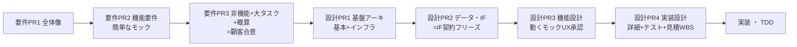

# aic-docs-template

AI請負開発チームの**設計ドキュメント標準テンプレート**。`classlab-inc/subscbase-docs` の 01〜13＋90 体系を継承。**このリポジトリ自体が新規案件用のスケルトン**（リポジトリ直下に 00〜02＋ADR を配置）。

> **スコープ = 要件定義 ＋ 設計（00〜02）**。実装/テスト実行/リリース/運用は将来フェーズ（`_backlog/` に退避）。

## 使い方
1. このリポジトリをテンプレートとして新規案件リポジトリを作成する（GitHub の「Use this template」または clone）。`_backlog/` は案件リポジトリでは削除してよい。
2. 各フォルダの `README.md`（この層に置くもの／正本／承認ゲート）に従ってドキュメントを作成。
3. 各ドキュメントは**記入式テンプレート**（`> 📝 ここに〜を記載` のチュートリアル付き）。ガイドに従って埋める。図（DFD/ER/シーケンス）は各ファイル内のMermaid骨組みに記入。

> **記入例の所在**: 各テンプレの「記入例は example-suido-fax 参照」は**記入済みの実例**を指します。実例はリポジトリ整理により削除済みのため、**[example-suido-fax（SHA固定の安定URL）](https://github.com/classlab-inc/aic-docs-template/tree/95e59f6c986fcc5e132df3655155cd00089fd2c2/example-suido-fax)** を参照してください。

## 構成
| フォルダ | 役割 | 型 | 要件 |
|---|---|---|---|
| `00_プロジェクト概要/` | 人間向け1枚俯瞰（目的・全体像・体制・契約スコープ・適用マトリクス・設計着手チェックリスト） | — | ① |
| `01_要件定義/` | 何を作るか（全体像／機能要件＋簡単なモック／非機能要件／タスク一覧／概算見積もり） | 要件4層 森→機能→非機能→木 | ① |
| `02_設計/` | どう作るか（基本設計／インフラ設計／データ・IF設計／機能設計＋動くモック／詳細設計／テスト設計／見積・WBS） | 設計6段＋見積 | ② |
| `意思決定_ADR/` | 設計判断の記録（1決定=1ファイル・Proposed→Accepted→Superseded） | — | ② |
| `_backlog/` | 今回スコープ外（将来フェーズの検討資料） | — | — |

- 全体ツリー・置き場所早見表・承認ゲート（PR構成）は [`ドキュメント構成ツリー.md`](./ドキュメント構成ツリー.md)
- **2つの最大要件**: ①人間がパッと見て仕組みが分かる（00→01）／②AIがデータ構造・連携を理解して駆動開発できる（02＋共通プラグイン）

## 承認ゲート（PRの束ね方）
書く順序はフォルダ採番順、**承認は要件定義3PR＋設計4PR**に束ねる。詳細は各層のREADME（[`01_要件定義/README.md`](./01_要件定義/README.md)・[`02_設計/README.md`](./02_設計/README.md)）。

