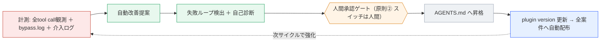
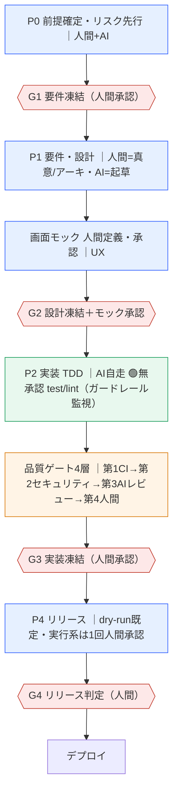

# 検討資料｜統合開発フローのアクターと責任境界（リーダーレビュー用・board準拠）

> **位置づけ**: 統合開発フローの各アクターが「**何を・どこで・どこまで**」やるかを可視化し、**ハーネス設計board（SEC.01-05）と整合**させたもの。当初の未決2点のうち**論点②（AGENTS.md共通化）と自己進化はboardで決着**。残る確認事項を末尾にまとめる。
> **典拠**: ハーネス設計board（SEC.01 目的と役割／SEC.02 設計原則8つ／SEC.03 6層アーキテクチャ／SEC.04 配布モデル／SEC.05 コンポーネント優先度）・統一開発フローboard（要件型/設計4段・品質ゲート4層・3層権限境界）／共通プラグイン `aic-harness`（v0.1.4）／`.claude/settings.json`。

## 0. 一言で
**「紙のルール（統一開発フロー）→ ハーネスが機械強制に変換 → 全tool call を計測 → 計測が自己改善の原料 → 次サイクルで強化」** という循環（board SEC.01）。人間は代替不可点（真意/アーキ/UX/リリース）と**承認ゲート**だけに集中する。

## 1. アクター一覧（4分類）
「手を動かす doer」と「振る舞いを規定する審判/規約」を分けて整理する。

### A. 能動アクター（手を動かす）
| アクター | ロール | 主な仕事 |
|---|---|---|
| **人間** | 顧客/PO | 要件の真意・受入・スコープ承認 |
| | リーダー(PL/TL) | アーキ選定・ゲート承認(G1〜G4)・リスク受容 |
| | レビューア（実装者と分離） | 人間レビュー（品質ゲート第4層） |
| | UX定義者 | 画面モックの定義・承認 |
| **統合Claude Harness**（共通プラグイン aic-harness／**6層構造**・下記§2） | 実装エージェント | TDD（RED→GREEN）・ドキュメント整備 |
| | AI独立レビュー(AR) 2〜3体 | 品質ゲート第3層（実装と別エージェント）＋自動修正 |
| | ガードレール(hook) | TDD/PR300行/権限境界を**機械強制（BLOCK）** |
| | 計測(hook) | **全tool call観測＋bypass.log**（自己改善の原料） |
| **GitHub Actions**（CI） | 機械層 | テスト・lint・型・カバレッジ・**セキュリティスキャン**・**完全性監査**・CI側ゲート |

### B. 統制アーティファクト（審判・規約）
| アーティファクト | 役割 |
|---|---|
| **AGENTS.md**（**共通プラグイン側＝全PJ共通**） | エージェント憲法。3層権限境界・ワークフロー規約・明示コマンド。**自己改善ループの"昇格先"**（§3）。①概要は各PJ CLAUDE.md を参照 |
| **harness-config.yml**（設定SSoT） | **強制度の単一情報源**（preset: advisory→team-default→strict）。環境変数で上書き |
| ゲート文書 | 設計着手チェックリスト(G2)／適用マトリクス(完全性・入口)／リリース承認基準(G4・出口) |
| STRATEGY BOARD（＋共通プラグイン/AGENTS.md） | プロセスの正本（温度計） |

### C. 境界アクター（外部）
先方/外部システム（kintone・NEXLINK 等）。タスク管理は**アダプタ層で抽象化**（Asana MCP・ロックイン回避／board原則⑥）。

### D. 実行環境（どこで動くか）
| 環境 | 何が動く | 契機 |
|---|---|---|
| **ローカル**（Claude Harness 稼働） | TDD RED→GREEN 即時ループ・C1自己チェック・lint・**ガードレールhook** | 実装中・常時 |
| **CI**（GitHub Actions） | 全テスト再実行・カバレッジ・スキャン・完全性監査・CI側ゲート | PR/push |
| **stg/本番** | デプロイ・段階適用・**dry-run**・実行系の**1回人間承認** | G4後 |

## 2. ハーネス6層アーキテクチャ（board SEC.03）
Claude Harness は単一アクターではなく**6層のシステム**。**「6層アーキ」は"ハーネスの構造"であり、品質ゲート4層（レビュー・パイプライン）とは別の軸**（＝旧・論点①の混同はこれで解消）。

| 層 | 役割 | 代表コンポーネント |
|---|---|---|
| **配布・統制層** | 全案件へ配る/効かせる | プラグイン＋マーケットプレイス＋自動更新／settings.jsonで有効化／設定SSoT＋プリセット |
| **ワークフロー層** | フローを型化 | **初期フェーズ支援（要件→設計→分解）**／**TDDタスクテンプレ**／AIレビュー編成2〜3体＋自動修正 |
| **ガードレール層** | 機械強制 | Bashガード（破壊操作/直push禁止）／テスト改変ブロック／PR前検証＋300行チェック／信頼度ゲート(閾値0.6)／**3層権限境界の執行** |
| **外部連携層** | 外部を繋ぐ | タスク管理アダプタ(Asana MCP)／GitHub連携＋CI側ゲート／本番エラー自律修正ループ |
| **計測層** | 一級市民として記録 | **全tool call観測＋bypass.log**／介入ログ導線(PRラベル＋Issue)／ハーネス監査 |
| **自己改善層** | 改善の原料化 | 自動改善提案／失敗ループ検出＋自己診断／**人間承認付きで AGENTS.md へ昇格** |

## 3. 自己進化ループ（＝ループ2／自己改善層）
「自己進化」は**単体スキルではなくループ**。**計測が自己改善の原料**になる（board SEC.01・原則④「計測は一級市民」）。

- **昇格先＝AGENTS.md**（共通）。改善は**AIが提案どまり・人間承認で確定**（原則②）。＝私が別途述べた「自己進化はスキルでなく計測→提案→承認→配布のループ」と一致。
- **バイパスは痕跡を残す**（原則③・`bypass.log`）＝ガードレールを越えた操作も監査可能。

## 4. AGENTS.md＝3層権限境界（board・ガードレール層が執行）
「AIはどこまで自走してよいか」の正本。**AGENTS.md（共通・人間可読）＋ settings.json/permissions（機械強制）＋ ガードレール層hook（BLOCK）** で実装する。

| 権限 | board の例 | 実装対応 |
|---|---|---|
| 🟢 **無承認で実行可** | テスト実行 / リント | Claude 自走（TDDループ・🟢はガードレール通過） |
| 🟠 **人間承認が必須** | スキーマ変更 / 依存追加 | ＋ 本番送信/課金（dry-run既定・1回承認）／画面モック承認／ADR |
| 🔴 **絶対禁止** | シークレットのコミット / 本番直接操作 / 直push | settings.json の deny ＋ **Bashガードで初日からBLOCK** |

> AGENTS.md 4部構成: ①プロジェクト概要（→各PJ CLAUDE.md 参照）②明示コマンド ③ワークフロー規約 ④3層権限境界。**②〜④が全PJ共通、①はPJ側**。

## 5. 責任境界スイムレーン（誰が × どこで × 何で判定）
| フェーズ | 人間（PO/TL/レビューア/UX） | Claude Harness | GitHub Actions（CI） | 環境 | ゲート |
|---|---|---|---|---|---|
| P0 前提・リスク先行 | 制約/リスク/未決を確定 | 起草補助・RAG参照 | — | ローカル | → G1 |
| P1 要件・設計 | **真意確定・アーキ選定・ADR承認** | 要件/設計/ADR **起草**（ワークフロー層 初期フェーズ支援） | — | ローカル | → G2 |
| 画面モック（UI時） | **UX定義・承認**（承認まで実装不可） | （承認後に実装） | — | ローカル | モック承認 |
| P2 実装（TDD） | （監督） | **RED→GREEN 実装**・🟢無承認／ガードレールがBLOCK監視 | — | ローカル | C1(自己) |
| PR前チェック | — | 自己チェック（機械）・**PR前検証＋300行** | lint/型/test | ローカル→**CI** | C1 |
| 品質ゲート（4層） | **第4層 人間レビュー**（①正しい問題か ②アーキ適合か） | **第3層 AIレビュー2〜3体＋自動修正** | **第1層 CI ＋ 第2層 セキュリティ** | CI/PR | → merge |
| （全工程で）計測 | — | — | **全tool call観測＋bypass.log**（計測層） | 常時 | → 自己改善層 |
| P4 リリース | **実行系の1回承認**（本番送信/課金/破壊） | デプロイ補助 | 完全性監査・スキャン | stg/本番 | G4 |

## 6. フロー図（フェーズ・ゲート・アクター色）

## 7. ハーネス実装ロードマップ（board SEC.05）と担保マップ
「どこまで機械が担保し、どこは当面 人間＋文書規約か」の一望。現ハーネスは **v0.1.4＝pre-MVP**（配布＋要件レビューadvisory のみ実装済み）。

| 我々のルール/成果物 | ハーネスの担保 | 状態（board上の位置） |
|---|---|---|
| 共通プラグイン配布・自動有効化 | 配布・統制層 | ✅ **実装済** |
| 要件定義レビュー（16観点・TDD RED等） | ワークフロー層 `/req-review`＋doc-reviewer | ✅ **実装済（advisory＝計測のみ）** |
| 3層権限境界の執行（🟢🟠🔴） | ガードレール層（AGENTS.md+permissions／Bashガード） | 🟡 **MVP**（2週間） |
| TDD強制・PR前検証＋300行・テスト改変ブロック・信頼度ゲート | ガードレール層 | 🟡 **MVP** |
| AIコードレビュー（品質ゲート第3層）2〜3体＋自動修正 | ワークフロー層 | 🟡 **MVP** |
| 全tool call計測・介入ログ・bypass.log | 計測層 | 🟡 **MVP** |
| 自己進化（自動改善提案／失敗ループ検出／AGENTS.md昇格） | 自己改善層 | 🔵 **次スプリント〜後で** |
| CI組込み・GitHub Actions・Sentry/本番エラー自律修正 | 外部連携層 | 🔵 **次スプリント** |
| 適用マトリクス/完全性監査・設計フェーズの機械チェック | （未board化） | ⚪ **当面 文書規約＋人間運用** |

> ⚪ の領域（設計フェーズの品質・完全性統制）は現状boardに明示されておらず、**我々の aic-docs-template（文書規約）＋ 人間運用**で担保している段階。ハーネスの `phases` 構造は拡張前提なので、将来 design phase として載る想定。

## 8. 決着と残る確認事項

### ✅ 決着（board で解消）
- **論点②（AGENTS.md 共通化・役割分担）** … board で確定。AGENTS.md＝共通（配布統制/ガードレール）・permission を持ち・**自己改善の昇格先**。①概要は各PJ CLAUDE.md へ委譲。→ **AGENTS.md共通＋CLAUDE.md各PJ** で分離。
- **自己進化** … 単体スキルではなく**自己改善層＝計測→提案→人間承認→AGENTS.md昇格→配布のループ**（§3）。
- **旧・論点①の"層数のズレ"** … **6層アーキ（構造）≠ 品質ゲート4層（レビュー）** の別軸と判明。品質ゲートは4層のまま。旧 `標準開発フロー.md`（3層）は削除済で二重管理も解消。

### 🔲 残る確認事項（会議）
1. **PJ固有の権限上書き**：共通AGENTS.md＋共通settings.json を正とし、PJ固有は**厳格化のみ可・緩和不可**でよいか（例: 本番送信を持つ suido は 🟠/🔴 を上乗せ）。
2. **強制度プリセットの初期値**：`harness-config.yml` を **advisory から始め、計測を見て team-default→strict にラチェット**（原則①段階導入）でよいか。
3. **文書側の宿題との接続**：ワークフロー層「初期フェーズ支援（要件→設計→分解）」「TDDタスクテンプレ」が我々の docs を INPUT にする。**docs の記法統一（受入基準：会議中）・トレーサビリティ縦串・AC粒度**を締めることが、この層の前提になる。

> 参照: ハーネス設計board SEC.01-05 ／ 統一開発フローboard（品質ゲート4層・3層権限境界） ／ 共通プラグイン `aic-harness`（`harness-config.json`/`criteria.json`/`doc-reviewer`/`aic-requirements`） ／ `template/.claude/settings.json` ／ `_backlog/リリース承認基準_テンプレート.md`。
